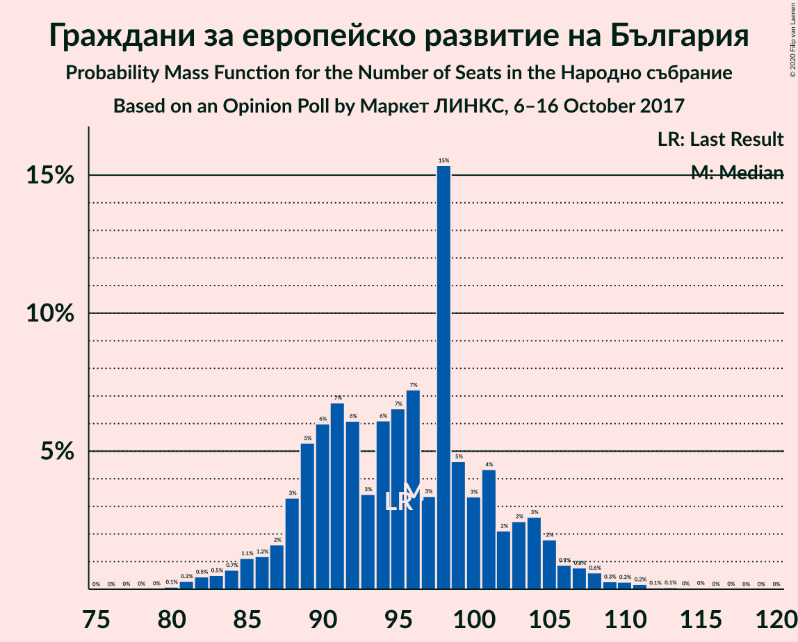
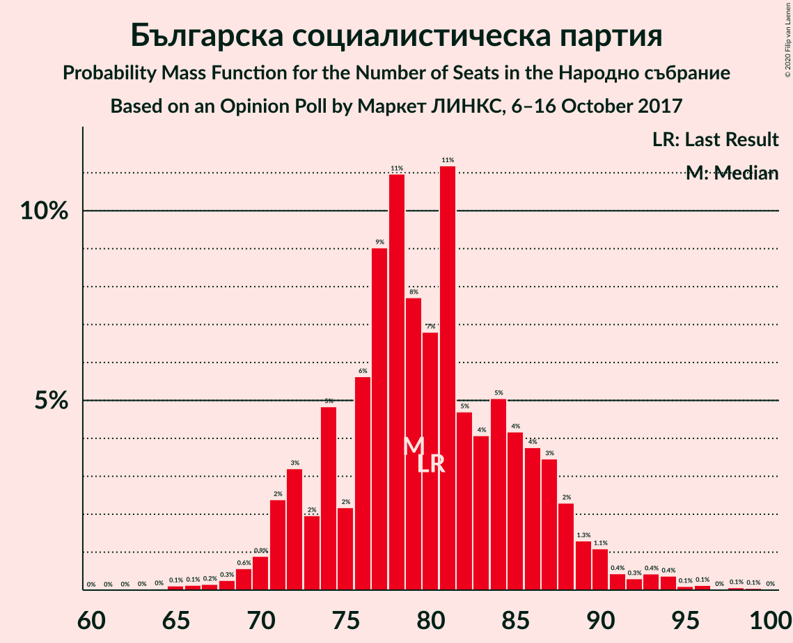
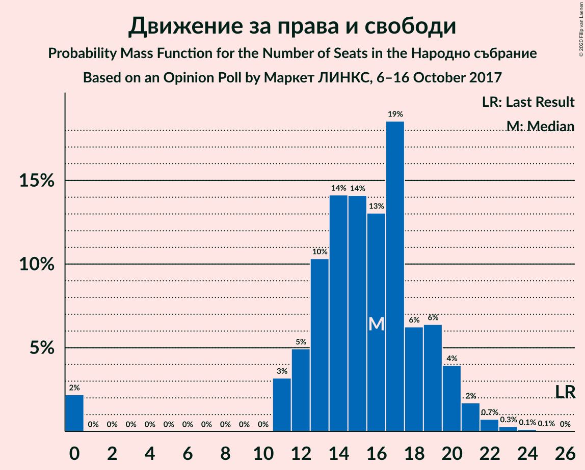
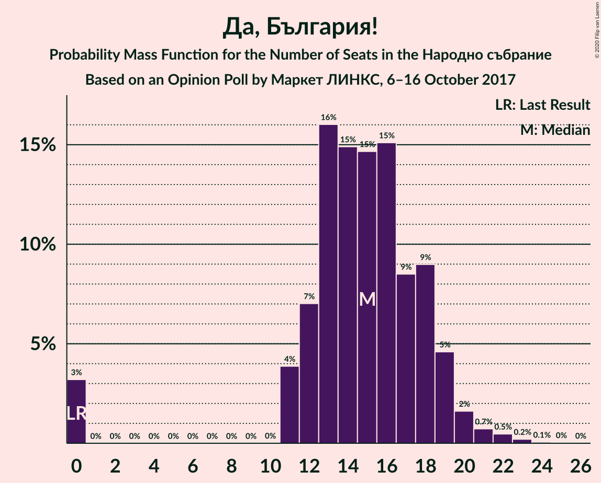

# Opinion Poll by Маркет ЛИНКС, 6–16 October 2017

<a href="#voting-intentions">Voting Intentions</a> | <a href="#seats">Seats</a> | <a href="#coalitions">Coalitions</a> | <a href="#technical-information">Technical Information</a>

## Voting Intentions

### Confidence Intervals

| Party | Last Result | Poll Result | 80% Confidence Interval | 90% Confidence Interval | 95% Confidence Interval | 99% Confidence Interval |
|:-----:|:-----------:|:-----------:|:-----------------------:|:-----------------------:|:-----------------------:|:-----------------------:|
| Граждани за европейско развитие на България | 33.5% | 35.8% | 33.3–38.4% |32.6–39.1% |32.0–39.8% |30.8–41.0% |
| Българска социалистическа партия | 27.9% | 30.0% | 27.6–32.5% |27.0–33.2% |26.4–33.8% |25.3–35.0% |
| Обединени Патриоти | 9.3% | 7.3% | 6.1–8.9% |5.8–9.3% |5.5–9.7% |5.0–10.5% |
| Движение за права и свободи | 9.2% | 5.6% | 4.6–7.0% |4.3–7.4% |4.0–7.8% |3.6–8.5% |
| Воля | 4.3% | 5.6% | 4.6–7.0% |4.3–7.4% |4.0–7.8% |3.6–8.5% |
| Да, България! | 3.0% | 5.5% | 4.4–6.9% |4.1–7.3% |3.9–7.6% |3.4–8.3% |
| Реформаторски блок | 3.1% | 2.2% | 1.6–3.2% |1.4–3.5% |1.3–3.8% |1.1–4.3% |
| Демократи за силна България | 0.0% | 2.0% | 1.5–3.0% |1.3–3.3% |1.2–3.6% |0.9–4.1% |
| Алтернатива за българско възраждане | 1.6% | 1.7% | 1.2–2.6% |1.1–2.9% |0.9–3.1% |0.7–3.6% |

*Note:* The poll result column reflects the actual value used in the calculations. Published results may vary slightly, and in addition be rounded to fewer digits.

## Seats

### Confidence Intervals

| Party | Last Result | Median | 80% Confidence Interval | 90% Confidence Interval | 95% Confidence Interval | 99% Confidence Interval |
|:-----:|:-----------:|:------:|:-----------------------:|:-----------------------:|:-----------------------:|:-----------------------:|
| <a href="#граждани-за-европейско-развитие-на-българия">Граждани за европейско развитие на България</a> | 95 | 95 | 88–102 |86–105 |85–107 |82–111 |
| <a href="#българска-социалистическа-партия">Българска социалистическа партия</a> | 80 | 81 | 72–87 |71–88 |71–90 |67–94 |
| <a href="#обединени-патриоти">Обединени Патриоти</a> | 27 | 20 | 16–23 |15–27 |15–27 |14–27 |
| <a href="#движение-за-права-и-свободи">Движение за права и свободи</a> | 26 | 15 | 11–19 |11–21 |11–21 |0–21 |
| <a href="#воля">Воля</a> | 12 | 15 | 11–19 |11–21 |0–22 |0–23 |
| <a href="#да,-българия!">Да, България!</a> | 0 | 15 | 12–19 |11–19 |0–20 |0–23 |
| <a href="#реформаторски-блок">Реформаторски блок</a> | 0 | 0 | 0 |0 |0 |0–12 |
| <a href="#демократи-за-силна-българия">Демократи за силна България</a> | 0 | 0 | 0 |0 |0 |0–11 |
| <a href="#алтернатива-за-българско-възраждане">Алтернатива за българско възраждане</a> | 0 | 0 | 0 |0 |0 |0 |

### Граждани за европейско развитие на България

*For a full overview of the results for this party, see the [Граждани за европейско развитие на България](party-гражданизаевропейскоразвитиенабългария.html) page.*

| Number of Seats | Probability | Accumulated | Special Marks |
|:---------------:|:-----------:|:-----------:|:-------------:|
| 78 | 0.1% | 100% |  |
| 79 | 0.1% | 99.9% |  |
| 80 | 0.1% | 99.9% |  |
| 81 | 0.2% | 99.8% |  |
| 82 | 0.1% | 99.5% |  |
| 83 | 0.1% | 99.4% |  |
| 84 | 0.6% | 99.3% |  |
| 85 | 3% | 98.7% |  |
| 86 | 2% | 96% |  |
| 87 | 2% | 94% |  |
| 88 | 5% | 91% |  |
| 89 | 12% | 86% |  |
| 90 | 2% | 74% |  |
| 91 | 5% | 71% |  |
| 92 | 3% | 66% |  |
| 93 | 7% | 63% |  |
| 94 | 4% | 56% |  |
| 95 | 9% | 52% | Last Result, Median |
| 96 | 3% | 43% |  |
| 97 | 2% | 40% |  |
| 98 | 7% | 38% |  |
| 99 | 10% | 31% |  |
| 100 | 3% | 20% |  |
| 101 | 7% | 17% |  |
| 102 | 0.8% | 11% |  |
| 103 | 3% | 10% |  |
| 104 | 0.9% | 7% |  |
| 105 | 3% | 6% |  |
| 106 | 0.6% | 4% |  |
| 107 | 0.7% | 3% |  |
| 108 | 0.9% | 2% |  |
| 109 | 0.6% | 1.4% |  |
| 110 | 0.1% | 0.8% |  |
| 111 | 0.3% | 0.7% |  |
| 112 | 0% | 0.4% |  |
| 113 | 0.2% | 0.4% |  |
| 114 | 0.1% | 0.1% |  |
| 115 | 0% | 0.1% |  |
| 116 | 0% | 0.1% |  |
| 117 | 0% | 0.1% |  |
| 118 | 0% | 0% |  |

### Българска социалистическа партия

*For a full overview of the results for this party, see the [Българска социалистическа партия](party-българскасоциалистическапартия.html) page.*

| Number of Seats | Probability | Accumulated | Special Marks |
|:---------------:|:-----------:|:-----------:|:-------------:|
| 64 | 0.1% | 100% |  |
| 65 | 0.1% | 99.9% |  |
| 66 | 0.1% | 99.8% |  |
| 67 | 0.4% | 99.7% |  |
| 68 | 0.2% | 99.4% |  |
| 69 | 0.4% | 99.1% |  |
| 70 | 1.0% | 98.7% |  |
| 71 | 3% | 98% |  |
| 72 | 6% | 94% |  |
| 73 | 4% | 88% |  |
| 74 | 3% | 84% |  |
| 75 | 5% | 82% |  |
| 76 | 9% | 77% |  |
| 77 | 3% | 68% |  |
| 78 | 0.9% | 65% |  |
| 79 | 10% | 64% |  |
| 80 | 3% | 55% | Last Result |
| 81 | 6% | 52% | Median |
| 82 | 9% | 46% |  |
| 83 | 2% | 37% |  |
| 84 | 16% | 35% |  |
| 85 | 5% | 19% |  |
| 86 | 3% | 14% |  |
| 87 | 2% | 11% |  |
| 88 | 5% | 10% |  |
| 89 | 1.3% | 4% |  |
| 90 | 0.9% | 3% |  |
| 91 | 1.0% | 2% |  |
| 92 | 0.1% | 1.1% |  |
| 93 | 0.4% | 1.1% |  |
| 94 | 0.2% | 0.7% |  |
| 95 | 0.2% | 0.5% |  |
| 96 | 0% | 0.3% |  |
| 97 | 0.1% | 0.2% |  |
| 98 | 0.1% | 0.2% |  |
| 99 | 0% | 0.1% |  |
| 100 | 0% | 0.1% |  |
| 101 | 0% | 0.1% |  |
| 102 | 0% | 0% |  |

### Обединени Патриоти

*For a full overview of the results for this party, see the [Обединени Патриоти](party-обединенипатриоти.html) page.*

| Number of Seats | Probability | Accumulated | Special Marks |
|:---------------:|:-----------:|:-----------:|:-------------:|
| 11 | 0.1% | 100% |  |
| 12 | 0% | 99.9% |  |
| 13 | 0.2% | 99.9% |  |
| 14 | 0.8% | 99.7% |  |
| 15 | 8% | 98.8% |  |
| 16 | 2% | 91% |  |
| 17 | 5% | 89% |  |
| 18 | 24% | 84% |  |
| 19 | 9% | 60% |  |
| 20 | 5% | 51% | Median |
| 21 | 10% | 46% |  |
| 22 | 10% | 36% |  |
| 23 | 18% | 26% |  |
| 24 | 2% | 8% |  |
| 25 | 0.4% | 6% |  |
| 26 | 0.3% | 6% |  |
| 27 | 5% | 5% | Last Result |
| 28 | 0.2% | 0.4% |  |
| 29 | 0.1% | 0.2% |  |
| 30 | 0.1% | 0.2% |  |
| 31 | 0% | 0.1% |  |
| 32 | 0% | 0% |  |

### Движение за права и свободи

*For a full overview of the results for this party, see the [Движение за права и свободи](party-движениезаправаисвободи.html) page.*

| Number of Seats | Probability | Accumulated | Special Marks |
|:---------------:|:-----------:|:-----------:|:-------------:|
| 0 | 2% | 100% |  |
| 1 | 0% | 98% |  |
| 2 | 0% | 98% |  |
| 3 | 0% | 98% |  |
| 4 | 0% | 98% |  |
| 5 | 0% | 98% |  |
| 6 | 0% | 98% |  |
| 7 | 0% | 98% |  |
| 8 | 0% | 98% |  |
| 9 | 0% | 98% |  |
| 10 | 0% | 98% |  |
| 11 | 12% | 98% |  |
| 12 | 16% | 86% |  |
| 13 | 11% | 71% |  |
| 14 | 9% | 59% |  |
| 15 | 6% | 50% | Median |
| 16 | 7% | 44% |  |
| 17 | 3% | 37% |  |
| 18 | 9% | 34% |  |
| 19 | 18% | 25% |  |
| 20 | 2% | 7% |  |
| 21 | 5% | 5% |  |
| 22 | 0.1% | 0.5% |  |
| 23 | 0.1% | 0.4% |  |
| 24 | 0.1% | 0.3% |  |
| 25 | 0.1% | 0.2% |  |
| 26 | 0% | 0% | Last Result |

### Воля

*For a full overview of the results for this party, see the [Воля](party-воля.html) page.*

| Number of Seats | Probability | Accumulated | Special Marks |
|:---------------:|:-----------:|:-----------:|:-------------:|
| 0 | 3% | 100% |  |
| 1 | 0% | 97% |  |
| 2 | 0% | 97% |  |
| 3 | 0% | 97% |  |
| 4 | 0% | 97% |  |
| 5 | 0% | 97% |  |
| 6 | 0% | 97% |  |
| 7 | 0% | 97% |  |
| 8 | 0% | 97% |  |
| 9 | 0% | 97% |  |
| 10 | 0% | 97% |  |
| 11 | 8% | 97% |  |
| 12 | 5% | 89% | Last Result |
| 13 | 2% | 84% |  |
| 14 | 31% | 82% |  |
| 15 | 6% | 51% | Median |
| 16 | 16% | 45% |  |
| 17 | 6% | 29% |  |
| 18 | 9% | 23% |  |
| 19 | 8% | 14% |  |
| 20 | 1.3% | 7% |  |
| 21 | 3% | 6% |  |
| 22 | 0.3% | 3% |  |
| 23 | 2% | 2% |  |
| 24 | 0.1% | 0.1% |  |
| 25 | 0% | 0.1% |  |
| 26 | 0% | 0% |  |

### Да, България!

*For a full overview of the results for this party, see the [Да, България!](party-дабългария.html) page.*

| Number of Seats | Probability | Accumulated | Special Marks |
|:---------------:|:-----------:|:-----------:|:-------------:|
| 0 | 3% | 100% | Last Result |
| 1 | 0% | 97% |  |
| 2 | 0% | 97% |  |
| 3 | 0% | 97% |  |
| 4 | 0% | 97% |  |
| 5 | 0% | 97% |  |
| 6 | 0% | 97% |  |
| 7 | 0% | 97% |  |
| 8 | 0% | 97% |  |
| 9 | 0% | 97% |  |
| 10 | 0% | 97% |  |
| 11 | 5% | 97% |  |
| 12 | 11% | 92% |  |
| 13 | 6% | 81% |  |
| 14 | 15% | 75% |  |
| 15 | 11% | 60% | Median |
| 16 | 22% | 48% |  |
| 17 | 6% | 27% |  |
| 18 | 9% | 21% |  |
| 19 | 8% | 12% |  |
| 20 | 3% | 5% |  |
| 21 | 1.0% | 2% |  |
| 22 | 0.3% | 0.8% |  |
| 23 | 0.3% | 0.5% |  |
| 24 | 0.2% | 0.3% |  |
| 25 | 0% | 0.1% |  |
| 26 | 0% | 0% |  |

### Реформаторски блок

*For a full overview of the results for this party, see the [Реформаторски блок](party-реформаторскиблок.html) page.*

| Number of Seats | Probability | Accumulated | Special Marks |
|:---------------:|:-----------:|:-----------:|:-------------:|
| 0 | 98.8% | 100% | Last Result, Median |
| 1 | 0% | 1.2% |  |
| 2 | 0% | 1.2% |  |
| 3 | 0% | 1.2% |  |
| 4 | 0% | 1.2% |  |
| 5 | 0% | 1.2% |  |
| 6 | 0% | 1.2% |  |
| 7 | 0% | 1.2% |  |
| 8 | 0% | 1.2% |  |
| 9 | 0% | 1.2% |  |
| 10 | 0% | 1.2% |  |
| 11 | 0.5% | 1.2% |  |
| 12 | 0.7% | 0.7% |  |
| 13 | 0% | 0% |  |

### Демократи за силна България

*For a full overview of the results for this party, see the [Демократи за силна България](party-демократизасилнабългария.html) page.*

| Number of Seats | Probability | Accumulated | Special Marks |
|:---------------:|:-----------:|:-----------:|:-------------:|
| 0 | 99.4% | 100% | Last Result, Median |
| 1 | 0% | 0.6% |  |
| 2 | 0% | 0.6% |  |
| 3 | 0% | 0.6% |  |
| 4 | 0% | 0.6% |  |
| 5 | 0% | 0.6% |  |
| 6 | 0% | 0.6% |  |
| 7 | 0% | 0.6% |  |
| 8 | 0% | 0.6% |  |
| 9 | 0% | 0.6% |  |
| 10 | 0.1% | 0.6% |  |
| 11 | 0.4% | 0.5% |  |
| 12 | 0.1% | 0.1% |  |
| 13 | 0% | 0% |  |

### Алтернатива за българско възраждане

*For a full overview of the results for this party, see the [Алтернатива за българско възраждане](party-алтернативазабългарсковъзраждане.html) page.*

| Number of Seats | Probability | Accumulated | Special Marks |
|:---------------:|:-----------:|:-----------:|:-------------:|
| 0 | 99.9% | 100% | Last Result, Median |
| 1 | 0% | 0.1% |  |
| 2 | 0% | 0.1% |  |
| 3 | 0% | 0.1% |  |
| 4 | 0% | 0.1% |  |
| 5 | 0% | 0.1% |  |
| 6 | 0% | 0.1% |  |
| 7 | 0% | 0.1% |  |
| 8 | 0% | 0.1% |  |
| 9 | 0% | 0.1% |  |
| 10 | 0% | 0.1% |  |
| 11 | 0.1% | 0.1% |  |
| 12 | 0% | 0% |  |

## Coalitions

### Confidence Intervals

| Coalition | Last Result | Median | Majority? | 80% Confidence Interval | 90% Confidence Interval | 95% Confidence Interval | 99% Confidence Interval |
|:---------:|:-----------:|:------:|:---------:|:-----------------------:|:-----------------------:|:-----------------------:|:-----------------------:|
| Граждани за европейско развитие на България – Обединени Патриоти | 122 | 114 | 20% | 107–124 | 106–125 | 103–127 | 101–131 |
| Българска социалистическа партия – Движение за права и свободи | 106 | 94 | 0% | 87–103 | 85–103 | 84–105 | 81–109 |

### Граждани за европейско развитие на България – Обединени Патриоти

| Number of Seats | Probability | Accumulated | Special Marks |
|:---------------:|:-----------:|:-----------:|:-------------:|
| 97 | 0.1% | 100% |  |
| 98 | 0.1% | 99.9% |  |
| 99 | 0.1% | 99.8% |  |
| 100 | 0.1% | 99.7% |  |
| 101 | 0.4% | 99.6% |  |
| 102 | 0.1% | 99.2% |  |
| 103 | 2% | 99.0% |  |
| 104 | 0.6% | 97% |  |
| 105 | 0.5% | 96% |  |
| 106 | 2% | 96% |  |
| 107 | 12% | 94% |  |
| 108 | 3% | 82% |  |
| 109 | 4% | 79% |  |
| 110 | 3% | 75% |  |
| 111 | 6% | 73% |  |
| 112 | 6% | 67% |  |
| 113 | 3% | 61% |  |
| 114 | 8% | 57% |  |
| 115 | 3% | 49% | Median |
| 116 | 2% | 46% |  |
| 117 | 13% | 44% |  |
| 118 | 0.5% | 31% |  |
| 119 | 3% | 31% |  |
| 120 | 8% | 28% |  |
| 121 | 0.5% | 20% | Majority |
| 122 | 6% | 20% | Last Result |
| 123 | 0.7% | 14% |  |
| 124 | 7% | 13% |  |
| 125 | 3% | 5% |  |
| 126 | 0.2% | 3% |  |
| 127 | 0.9% | 3% |  |
| 128 | 0.8% | 2% |  |
| 129 | 0.1% | 1.0% |  |
| 130 | 0.1% | 0.9% |  |
| 131 | 0.3% | 0.7% |  |
| 132 | 0.1% | 0.4% |  |
| 133 | 0.1% | 0.3% |  |
| 134 | 0% | 0.2% |  |
| 135 | 0% | 0.2% |  |
| 136 | 0.1% | 0.1% |  |
| 137 | 0% | 0.1% |  |
| 138 | 0% | 0% |  |

### Българска социалистическа партия – Движение за права и свободи

| Number of Seats | Probability | Accumulated | Special Marks |
|:---------------:|:-----------:|:-----------:|:-------------:|
| 76 | 0.1% | 100% |  |
| 77 | 0% | 99.9% |  |
| 78 | 0.1% | 99.9% |  |
| 79 | 0.1% | 99.8% |  |
| 80 | 0.1% | 99.7% |  |
| 81 | 0.6% | 99.6% |  |
| 82 | 0.7% | 99.0% |  |
| 83 | 0.6% | 98% |  |
| 84 | 3% | 98% |  |
| 85 | 2% | 95% |  |
| 86 | 1.0% | 93% |  |
| 87 | 3% | 92% |  |
| 88 | 4% | 90% |  |
| 89 | 2% | 86% |  |
| 90 | 8% | 84% |  |
| 91 | 6% | 76% |  |
| 92 | 11% | 70% |  |
| 93 | 5% | 59% |  |
| 94 | 9% | 54% |  |
| 95 | 2% | 45% |  |
| 96 | 1.4% | 42% | Median |
| 97 | 5% | 41% |  |
| 98 | 5% | 36% |  |
| 99 | 0.8% | 32% |  |
| 100 | 6% | 31% |  |
| 101 | 2% | 25% |  |
| 102 | 3% | 22% |  |
| 103 | 15% | 19% |  |
| 104 | 0.7% | 5% |  |
| 105 | 1.5% | 4% |  |
| 106 | 0.5% | 2% | Last Result |
| 107 | 0.7% | 2% |  |
| 108 | 0.7% | 1.2% |  |
| 109 | 0.1% | 0.5% |  |
| 110 | 0.2% | 0.5% |  |
| 111 | 0.1% | 0.3% |  |
| 112 | 0% | 0.2% |  |
| 113 | 0% | 0.2% |  |
| 114 | 0.1% | 0.2% |  |
| 115 | 0% | 0.1% |  |
| 116 | 0% | 0.1% |  |
| 117 | 0% | 0% |  |

## Technical Information

### Opinion Poll

+ **Polling firm:** Маркет ЛИНКС
+ **Commissioner(s):** —
+ **Fieldwork period:** 6–16 October 2017

### Calculations

+ **Sample size:** 587
+ **Simulations done:** 131,072
+ **Error estimate:** 5.03%

