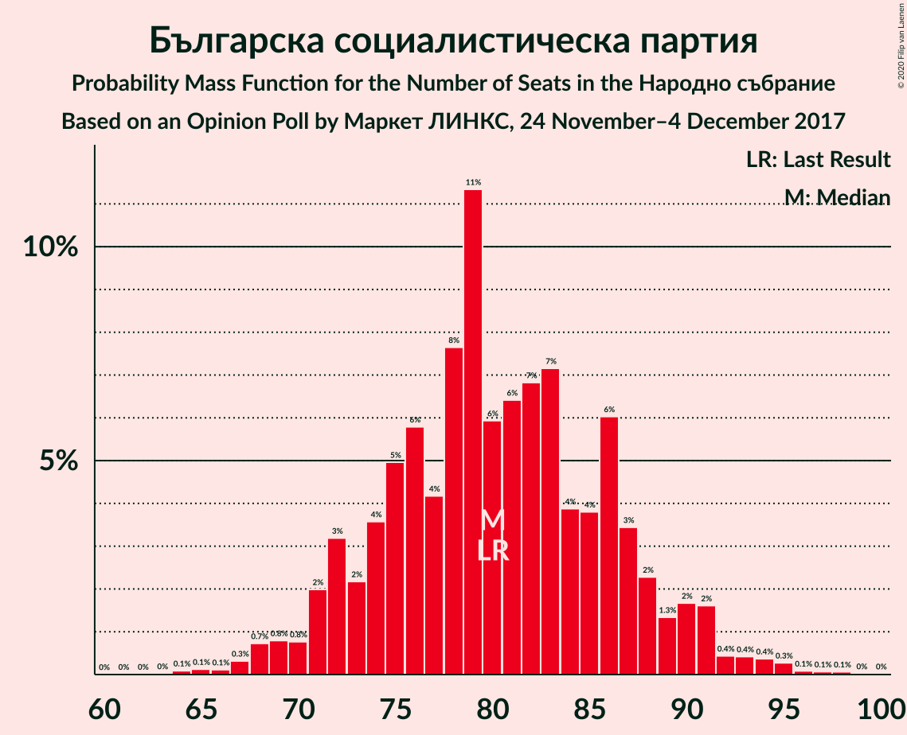
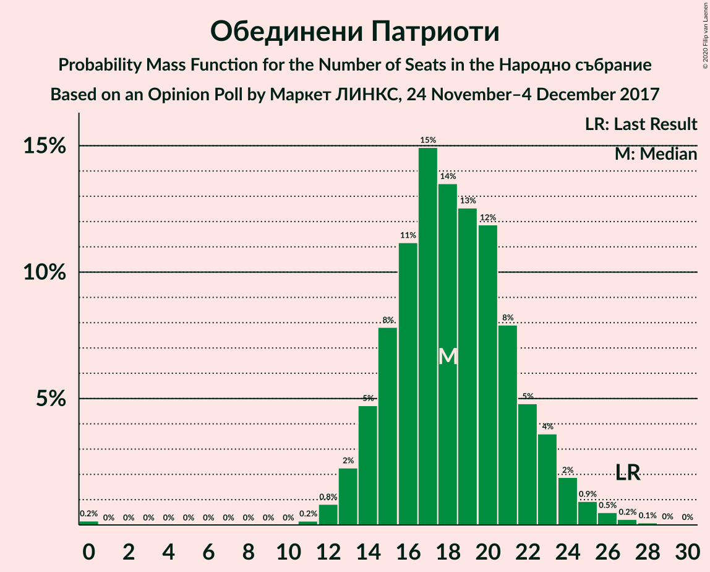
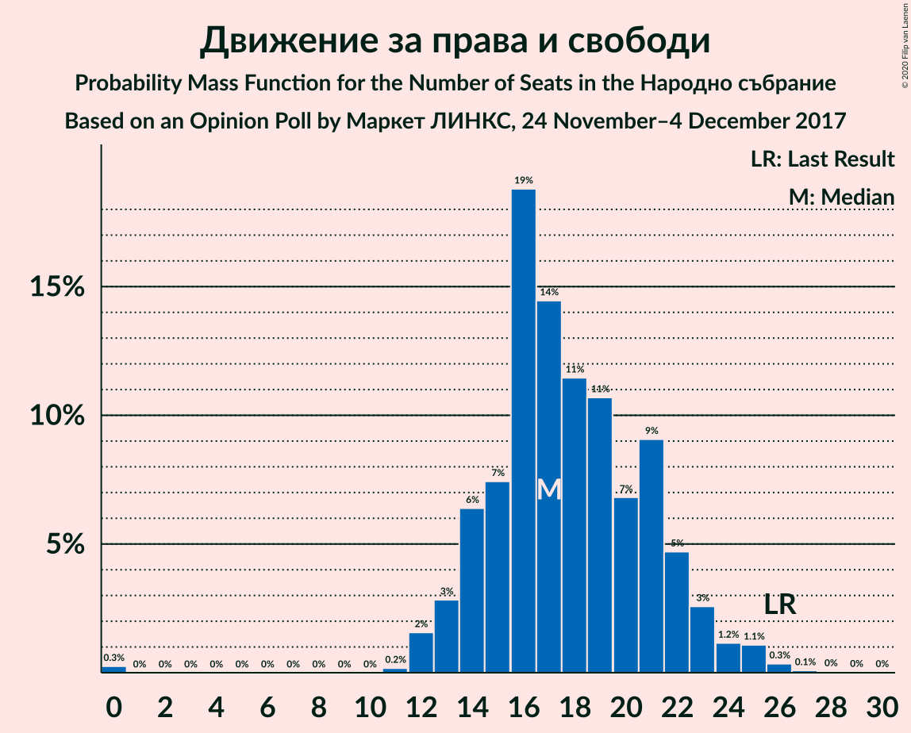
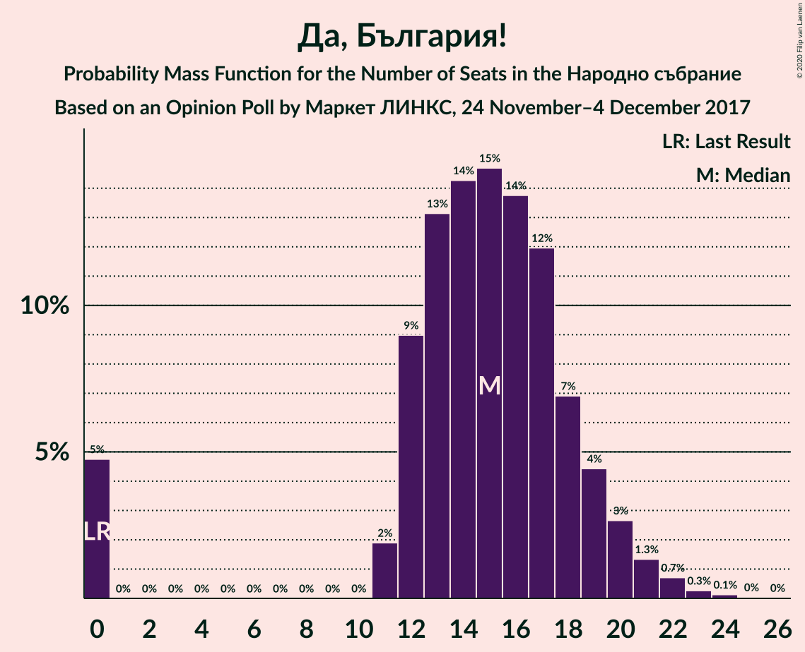
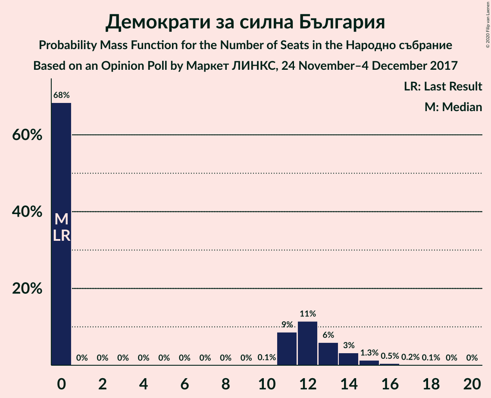
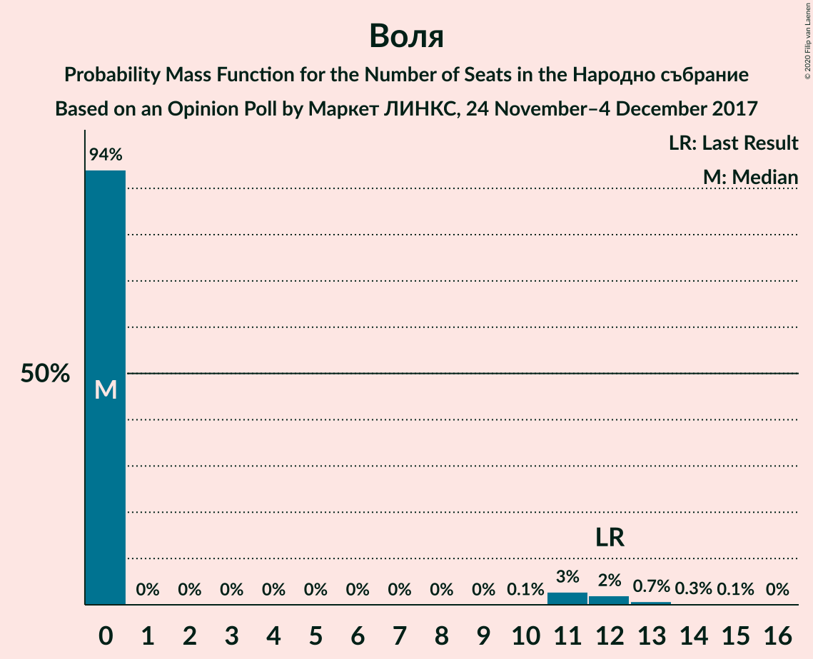

# Opinion Poll by Маркет ЛИНКС, 24 November–4 December 2017

<a href="#voting-intentions">Voting Intentions</a> | <a href="#seats">Seats</a> | <a href="#coalitions">Coalitions</a> | <a href="#technical-information">Technical Information</a>

## Voting Intentions

### Confidence Intervals

| Party | Last Result | Poll Result | 80% Confidence Interval | 90% Confidence Interval | 95% Confidence Interval | 99% Confidence Interval |
|:-----:|:-----------:|:-----------:|:-----------------------:|:-----------------------:|:-----------------------:|:-----------------------:|
| Граждани за европейско развитие на България | 33.5% | 37.7% | 35.3–40.3% |34.6–41.0% |34.0–41.6% |32.8–42.9% |
| Българска социалистическа партия | 27.9% | 28.9% | 26.6–31.3% |26.0–32.0% |25.4–32.6% |24.4–33.7% |
| Обединени Патриоти | 9.3% | 6.5% | 5.3–7.9% |5.0–8.3% |4.8–8.7% |4.3–9.4% |
| Движение за права и свободи | 9.2% | 6.3% | 5.2–7.7% |4.9–8.1% |4.6–8.5% |4.2–9.2% |
| Да, България! | 3.0% | 5.3% | 4.3–6.7% |4.0–7.0% |3.8–7.4% |3.4–8.1% |
| Демократи за силна България | 0.0% | 3.5% | 2.8–4.7% |2.5–5.0% |2.3–5.3% |2.0–5.9% |
| Воля | 4.3% | 2.7% | 2.1–3.8% |1.9–4.1% |1.7–4.4% |1.4–4.9% |

*Note:* The poll result column reflects the actual value used in the calculations. Published results may vary slightly, and in addition be rounded to fewer digits.

## Seats

### Confidence Intervals

| Party | Last Result | Median | 80% Confidence Interval | 90% Confidence Interval | 95% Confidence Interval | 99% Confidence Interval |
|:-----:|:-----------:|:------:|:-----------------------:|:-----------------------:|:-----------------------:|:-----------------------:|
| <a href="#граждани-за-европейско-развитие-на-българия">Граждани за европейско развитие на България</a> | 95 | 104 | 97–112 |95–114 |93–116 |89–120 |
| <a href="#българска-социалистическа-партия">Българска социалистическа партия</a> | 80 | 80 | 73–87 |72–90 |70–91 |67–95 |
| <a href="#обединени-патриоти">Обединени Патриоти</a> | 27 | 18 | 15–22 |14–23 |13–24 |12–26 |
| <a href="#движение-за-права-и-свободи">Движение за права и свободи</a> | 26 | 17 | 14–22 |14–23 |13–24 |12–26 |
| <a href="#да,-българия!">Да, България!</a> | 0 | 15 | 12–18 |11–20 |0–21 |0–22 |
| <a href="#демократи-за-силна-българия">Демократи за силна България</a> | 0 | 0 | 0–13 |0–14 |0–14 |0–16 |
| <a href="#воля">Воля</a> | 12 | 0 | 0 |0–11 |0–12 |0–13 |

### Граждани за европейско развитие на България

*For a full overview of the results for this party, see the [Граждани за европейско развитие на България](party-гражданизаевропейскоразвитиенабългария.html) page.*

| Number of Seats | Probability | Accumulated | Special Marks |
|:---------------:|:-----------:|:-----------:|:-------------:|
| 86 | 0% | 100% |  |
| 87 | 0.1% | 99.9% |  |
| 88 | 0.2% | 99.9% |  |
| 89 | 0.2% | 99.7% |  |
| 90 | 0.3% | 99.5% |  |
| 91 | 0.4% | 99.2% |  |
| 92 | 0.6% | 98.7% |  |
| 93 | 0.9% | 98% |  |
| 94 | 2% | 97% |  |
| 95 | 2% | 96% | Last Result |
| 96 | 2% | 93% |  |
| 97 | 3% | 91% |  |
| 98 | 3% | 87% |  |
| 99 | 4% | 84% |  |
| 100 | 4% | 81% |  |
| 101 | 6% | 76% |  |
| 102 | 7% | 70% |  |
| 103 | 6% | 63% |  |
| 104 | 8% | 57% | Median |
| 105 | 7% | 49% |  |
| 106 | 5% | 42% |  |
| 107 | 5% | 37% |  |
| 108 | 6% | 33% |  |
| 109 | 6% | 27% |  |
| 110 | 4% | 21% |  |
| 111 | 4% | 17% |  |
| 112 | 4% | 13% |  |
| 113 | 2% | 9% |  |
| 114 | 2% | 7% |  |
| 115 | 1.3% | 5% |  |
| 116 | 1.3% | 4% |  |
| 117 | 0.7% | 2% |  |
| 118 | 0.5% | 2% |  |
| 119 | 0.4% | 1.1% |  |
| 120 | 0.2% | 0.7% |  |
| 121 | 0.2% | 0.5% | Majority |
| 122 | 0.1% | 0.3% |  |
| 123 | 0.1% | 0.2% |  |
| 124 | 0% | 0.1% |  |
| 125 | 0% | 0.1% |  |
| 126 | 0% | 0.1% |  |
| 127 | 0% | 0% |  |

### Българска социалистическа партия

*For a full overview of the results for this party, see the [Българска социалистическа партия](party-българскасоциалистическапартия.html) page.*

| Number of Seats | Probability | Accumulated | Special Marks |
|:---------------:|:-----------:|:-----------:|:-------------:|
| 64 | 0.1% | 100% |  |
| 65 | 0.1% | 99.9% |  |
| 66 | 0.1% | 99.7% |  |
| 67 | 0.3% | 99.6% |  |
| 68 | 0.7% | 99.3% |  |
| 69 | 0.8% | 98.6% |  |
| 70 | 0.8% | 98% |  |
| 71 | 2% | 97% |  |
| 72 | 3% | 95% |  |
| 73 | 2% | 92% |  |
| 74 | 4% | 90% |  |
| 75 | 5% | 86% |  |
| 76 | 6% | 81% |  |
| 77 | 4% | 75% |  |
| 78 | 8% | 71% |  |
| 79 | 11% | 64% |  |
| 80 | 6% | 52% | Last Result, Median |
| 81 | 6% | 46% |  |
| 82 | 7% | 40% |  |
| 83 | 7% | 33% |  |
| 84 | 4% | 26% |  |
| 85 | 4% | 22% |  |
| 86 | 6% | 18% |  |
| 87 | 3% | 12% |  |
| 88 | 2% | 9% |  |
| 89 | 1.3% | 6% |  |
| 90 | 2% | 5% |  |
| 91 | 2% | 3% |  |
| 92 | 0.4% | 2% |  |
| 93 | 0.4% | 1.3% |  |
| 94 | 0.4% | 0.9% |  |
| 95 | 0.3% | 0.6% |  |
| 96 | 0.1% | 0.3% |  |
| 97 | 0.1% | 0.2% |  |
| 98 | 0.1% | 0.1% |  |
| 99 | 0% | 0.1% |  |
| 100 | 0% | 0% |  |

### Обединени Патриоти

*For a full overview of the results for this party, see the [Обединени Патриоти](party-обединенипатриоти.html) page.*

| Number of Seats | Probability | Accumulated | Special Marks |
|:---------------:|:-----------:|:-----------:|:-------------:|
| 0 | 0.2% | 100% |  |
| 1 | 0% | 99.8% |  |
| 2 | 0% | 99.8% |  |
| 3 | 0% | 99.8% |  |
| 4 | 0% | 99.8% |  |
| 5 | 0% | 99.8% |  |
| 6 | 0% | 99.8% |  |
| 7 | 0% | 99.8% |  |
| 8 | 0% | 99.8% |  |
| 9 | 0% | 99.8% |  |
| 10 | 0% | 99.8% |  |
| 11 | 0.2% | 99.8% |  |
| 12 | 0.8% | 99.7% |  |
| 13 | 2% | 98.9% |  |
| 14 | 5% | 97% |  |
| 15 | 8% | 92% |  |
| 16 | 11% | 84% |  |
| 17 | 15% | 73% |  |
| 18 | 14% | 58% | Median |
| 19 | 13% | 44% |  |
| 20 | 12% | 32% |  |
| 21 | 8% | 20% |  |
| 22 | 5% | 12% |  |
| 23 | 4% | 7% |  |
| 24 | 2% | 4% |  |
| 25 | 0.9% | 2% |  |
| 26 | 0.5% | 0.9% |  |
| 27 | 0.2% | 0.4% | Last Result |
| 28 | 0.1% | 0.2% |  |
| 29 | 0% | 0.1% |  |
| 30 | 0% | 0% |  |

### Движение за права и свободи

*For a full overview of the results for this party, see the [Движение за права и свободи](party-движениезаправаисвободи.html) page.*

| Number of Seats | Probability | Accumulated | Special Marks |
|:---------------:|:-----------:|:-----------:|:-------------:|
| 0 | 0.3% | 100% |  |
| 1 | 0% | 99.7% |  |
| 2 | 0% | 99.7% |  |
| 3 | 0% | 99.7% |  |
| 4 | 0% | 99.7% |  |
| 5 | 0% | 99.7% |  |
| 6 | 0% | 99.7% |  |
| 7 | 0% | 99.7% |  |
| 8 | 0% | 99.7% |  |
| 9 | 0% | 99.7% |  |
| 10 | 0% | 99.7% |  |
| 11 | 0.2% | 99.7% |  |
| 12 | 2% | 99.6% |  |
| 13 | 3% | 98% |  |
| 14 | 6% | 95% |  |
| 15 | 7% | 89% |  |
| 16 | 19% | 81% |  |
| 17 | 14% | 63% | Median |
| 18 | 11% | 48% |  |
| 19 | 11% | 37% |  |
| 20 | 7% | 26% |  |
| 21 | 9% | 19% |  |
| 22 | 5% | 10% |  |
| 23 | 3% | 5% |  |
| 24 | 1.2% | 3% |  |
| 25 | 1.1% | 2% |  |
| 26 | 0.3% | 0.5% | Last Result |
| 27 | 0.1% | 0.2% |  |
| 28 | 0% | 0.1% |  |
| 29 | 0% | 0% |  |

### Да, България!

*For a full overview of the results for this party, see the [Да, България!](party-дабългария.html) page.*

| Number of Seats | Probability | Accumulated | Special Marks |
|:---------------:|:-----------:|:-----------:|:-------------:|
| 0 | 5% | 100% | Last Result |
| 1 | 0% | 95% |  |
| 2 | 0% | 95% |  |
| 3 | 0% | 95% |  |
| 4 | 0% | 95% |  |
| 5 | 0% | 95% |  |
| 6 | 0% | 95% |  |
| 7 | 0% | 95% |  |
| 8 | 0% | 95% |  |
| 9 | 0% | 95% |  |
| 10 | 0% | 95% |  |
| 11 | 2% | 95% |  |
| 12 | 9% | 93% |  |
| 13 | 13% | 84% |  |
| 14 | 14% | 71% |  |
| 15 | 15% | 57% | Median |
| 16 | 14% | 42% |  |
| 17 | 12% | 28% |  |
| 18 | 7% | 17% |  |
| 19 | 4% | 10% |  |
| 20 | 3% | 5% |  |
| 21 | 1.3% | 3% |  |
| 22 | 0.7% | 1.2% |  |
| 23 | 0.3% | 0.5% |  |
| 24 | 0.1% | 0.2% |  |
| 25 | 0% | 0.1% |  |
| 26 | 0% | 0% |  |

### Демократи за силна България

*For a full overview of the results for this party, see the [Демократи за силна България](party-демократизасилнабългария.html) page.*

| Number of Seats | Probability | Accumulated | Special Marks |
|:---------------:|:-----------:|:-----------:|:-------------:|
| 0 | 68% | 100% | Last Result, Median |
| 1 | 0% | 32% |  |
| 2 | 0% | 32% |  |
| 3 | 0% | 32% |  |
| 4 | 0% | 32% |  |
| 5 | 0% | 32% |  |
| 6 | 0% | 32% |  |
| 7 | 0% | 32% |  |
| 8 | 0% | 32% |  |
| 9 | 0% | 32% |  |
| 10 | 0.1% | 32% |  |
| 11 | 9% | 31% |  |
| 12 | 11% | 23% |  |
| 13 | 6% | 11% |  |
| 14 | 3% | 5% |  |
| 15 | 1.3% | 2% |  |
| 16 | 0.5% | 0.8% |  |
| 17 | 0.2% | 0.3% |  |
| 18 | 0.1% | 0.1% |  |
| 19 | 0% | 0% |  |

### Воля

*For a full overview of the results for this party, see the [Воля](party-воля.html) page.*

| Number of Seats | Probability | Accumulated | Special Marks |
|:---------------:|:-----------:|:-----------:|:-------------:|
| 0 | 94% | 100% | Median |
| 1 | 0% | 6% |  |
| 2 | 0% | 6% |  |
| 3 | 0% | 6% |  |
| 4 | 0% | 6% |  |
| 5 | 0% | 6% |  |
| 6 | 0% | 6% |  |
| 7 | 0% | 6% |  |
| 8 | 0% | 6% |  |
| 9 | 0% | 6% |  |
| 10 | 0.1% | 6% |  |
| 11 | 3% | 6% |  |
| 12 | 2% | 3% | Last Result |
| 13 | 0.7% | 1.1% |  |
| 14 | 0.3% | 0.4% |  |
| 15 | 0.1% | 0.1% |  |
| 16 | 0% | 0% |  |

## Coalitions

### Confidence Intervals

| Coalition | Last Result | Median | Majority? | 80% Confidence Interval | 90% Confidence Interval | 95% Confidence Interval | 99% Confidence Interval |
|:---------:|:-----------:|:------:|:---------:|:-----------------------:|:-----------------------:|:-----------------------:|:-----------------------:|
| Граждани за европейско развитие на България – Обединени Патриоти | 122 | 123 | 63% | 114–131 | 112–133 | 111–135 | 107–139 |
| Българска социалистическа партия – Движение за права и свободи | 106 | 98 | 0% | 91–106 | 88–108 | 87–110 | 83–113 |

### Граждани за европейско развитие на България – Обединени Патриоти

| Number of Seats | Probability | Accumulated | Special Marks |
|:---------------:|:-----------:|:-----------:|:-------------:|
| 102 | 0% | 100% |  |
| 103 | 0% | 99.9% |  |
| 104 | 0.1% | 99.9% |  |
| 105 | 0.1% | 99.8% |  |
| 106 | 0.1% | 99.7% |  |
| 107 | 0.3% | 99.6% |  |
| 108 | 0.4% | 99.3% |  |
| 109 | 0.4% | 99.0% |  |
| 110 | 1.0% | 98.6% |  |
| 111 | 1.4% | 98% |  |
| 112 | 1.5% | 96% |  |
| 113 | 2% | 95% |  |
| 114 | 3% | 93% |  |
| 115 | 2% | 90% |  |
| 116 | 4% | 88% |  |
| 117 | 5% | 84% |  |
| 118 | 3% | 79% |  |
| 119 | 6% | 76% |  |
| 120 | 6% | 69% |  |
| 121 | 6% | 63% | Majority |
| 122 | 6% | 58% | Last Result, Median |
| 123 | 7% | 52% |  |
| 124 | 4% | 45% |  |
| 125 | 6% | 41% |  |
| 126 | 5% | 35% |  |
| 127 | 5% | 29% |  |
| 128 | 5% | 25% |  |
| 129 | 5% | 19% |  |
| 130 | 3% | 14% |  |
| 131 | 3% | 11% |  |
| 132 | 3% | 8% |  |
| 133 | 2% | 6% |  |
| 134 | 1.2% | 4% |  |
| 135 | 0.7% | 3% |  |
| 136 | 0.6% | 2% |  |
| 137 | 0.5% | 2% |  |
| 138 | 0.4% | 1.2% |  |
| 139 | 0.3% | 0.8% |  |
| 140 | 0.2% | 0.5% |  |
| 141 | 0.1% | 0.3% |  |
| 142 | 0.1% | 0.2% |  |
| 143 | 0.1% | 0.2% |  |
| 144 | 0% | 0.1% |  |
| 145 | 0% | 0.1% |  |
| 146 | 0% | 0% |  |

### Българска социалистическа партия – Движение за права и свободи

| Number of Seats | Probability | Accumulated | Special Marks |
|:---------------:|:-----------:|:-----------:|:-------------:|
| 79 | 0% | 100% |  |
| 80 | 0.1% | 99.9% |  |
| 81 | 0.1% | 99.9% |  |
| 82 | 0.2% | 99.8% |  |
| 83 | 0.2% | 99.6% |  |
| 84 | 0.5% | 99.4% |  |
| 85 | 0.6% | 98.9% |  |
| 86 | 0.7% | 98% |  |
| 87 | 1.1% | 98% |  |
| 88 | 2% | 96% |  |
| 89 | 2% | 95% |  |
| 90 | 3% | 93% |  |
| 91 | 3% | 90% |  |
| 92 | 4% | 87% |  |
| 93 | 6% | 83% |  |
| 94 | 4% | 77% |  |
| 95 | 9% | 74% |  |
| 96 | 5% | 65% |  |
| 97 | 7% | 60% | Median |
| 98 | 9% | 53% |  |
| 99 | 4% | 44% |  |
| 100 | 8% | 40% |  |
| 101 | 6% | 32% |  |
| 102 | 4% | 26% |  |
| 103 | 6% | 22% |  |
| 104 | 3% | 16% |  |
| 105 | 3% | 13% |  |
| 106 | 2% | 10% | Last Result |
| 107 | 2% | 8% |  |
| 108 | 2% | 6% |  |
| 109 | 1.4% | 4% |  |
| 110 | 0.8% | 3% |  |
| 111 | 0.7% | 2% |  |
| 112 | 0.3% | 1.0% |  |
| 113 | 0.3% | 0.7% |  |
| 114 | 0.1% | 0.4% |  |
| 115 | 0.1% | 0.3% |  |
| 116 | 0.1% | 0.2% |  |
| 117 | 0% | 0.1% |  |
| 118 | 0% | 0.1% |  |
| 119 | 0% | 0.1% |  |
| 120 | 0% | 0% |  |

## Technical Information

### Opinion Poll

+ **Polling firm:** Маркет ЛИНКС
+ **Commissioner(s):** —
+ **Fieldwork period:** 24 November–4 December 2017

### Calculations

+ **Sample size:** 620
+ **Simulations done:** 1,048,576
+ **Error estimate:** 1.48%

