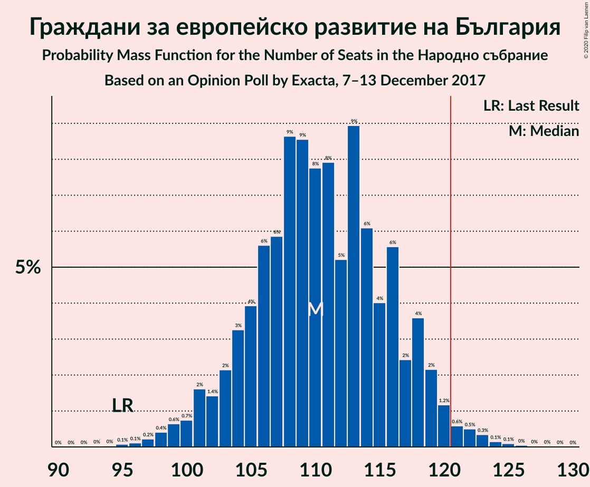

# Opinion Poll by Exacta, 7–13 December 2017

<a href="#voting-intentions">Voting Intentions</a> | <a href="#seats">Seats</a> | <a href="#coalitions">Coalitions</a> | <a href="#technical-information">Technical Information</a>

## Voting Intentions

### Confidence Intervals

| Party | Last Result | Poll Result | 80% Confidence Interval | 90% Confidence Interval | 95% Confidence Interval | 99% Confidence Interval |
|:-----:|:-----------:|:-----------:|:-----------------------:|:-----------------------:|:-----------------------:|:-----------------------:|
| Граждани за европейско развитие на България | 33.5% | 41.3% | 38.9–43.8% |38.3–44.5% |37.7–45.1% |36.5–46.3% |
| Българска социалистическа партия | 27.9% | 30.7% | 28.5–33.0% |27.8–33.7% |27.3–34.3% |26.3–35.4% |
| Обединени Патриоти | 9.3% | 9.0% | 7.8–10.6% |7.4–11.1% |7.1–11.4% |6.5–12.2% |
| Движение за права и свободи | 9.2% | 8.4% | 7.2–10.0% |6.9–10.4% |6.6–10.8% |6.0–11.6% |
| Воля | 4.3% | 2.7% | 2.0–3.7% |1.8–3.9% |1.7–4.2% |1.4–4.7% |
| Реформаторски блок | 3.1% | 2.1% | 1.5–3.0% |1.4–3.2% |1.2–3.5% |1.0–3.9% |
| Демократи за силна България | 0.0% | 1.9% | 1.4–2.8% |1.2–3.0% |1.1–3.3% |0.9–3.7% |
| Да, България! | 3.0% | 1.0% | 0.7–1.7% |0.6–2.0% |0.5–2.1% |0.4–2.5% |

*Note:* The poll result column reflects the actual value used in the calculations. Published results may vary slightly, and in addition be rounded to fewer digits.

## Seats

### Confidence Intervals

| Party | Last Result | Median | 80% Confidence Interval | 90% Confidence Interval | 95% Confidence Interval | 99% Confidence Interval |
|:-----:|:-----------:|:------:|:-----------------------:|:-----------------------:|:-----------------------:|:-----------------------:|
| <a href="#граждани-за-европейско-развитие-на-българия">Граждани за европейско развитие на България</a> | 95 | 111 | 104–117 |103–118 |101–120 |97–123 |
| <a href="#българска-социалистическа-партия">Българска социалистическа партия</a> | 80 | 82 | 76–88 |75–88 |73–90 |71–94 |
| <a href="#обединени-патриоти">Обединени Патриоти</a> | 27 | 25 | 20–29 |20–30 |19–31 |18–32 |
| <a href="#движение-за-права-и-свободи">Движение за права и свободи</a> | 26 | 23 | 20–26 |19–27 |19–28 |17–30 |
| <a href="#воля">Воля</a> | 12 | 0 | 0 |0 |0–11 |0–12 |
| <a href="#реформаторски-блок">Реформаторски блок</a> | 0 | 0 | 0 |0 |0 |0 |
| <a href="#демократи-за-силна-българия">Демократи за силна България</a> | 0 | 0 | 0 |0 |0 |0 |
| <a href="#да,-българия!">Да, България!</a> | 0 | 0 | 0 |0 |0 |0 |

### Граждани за европейско развитие на България

*For a full overview of the results for this party, see the [Граждани за европейско развитие на България](party-гражданизаевропейскоразвитиенабългария.html) page.*

| Number of Seats | Probability | Accumulated | Special Marks |
|:---------------:|:-----------:|:-----------:|:-------------:|
| 93 | 0% | 100% |  |
| 94 | 0% | 99.9% |  |
| 95 | 0.1% | 99.9% | Last Result |
| 96 | 0.1% | 99.8% |  |
| 97 | 0.4% | 99.7% |  |
| 98 | 0.8% | 99.3% |  |
| 99 | 0.3% | 98.5% |  |
| 100 | 0.5% | 98% |  |
| 101 | 0.9% | 98% |  |
| 102 | 0.7% | 97% |  |
| 103 | 2% | 96% |  |
| 104 | 5% | 94% |  |
| 105 | 5% | 89% |  |
| 106 | 7% | 84% |  |
| 107 | 9% | 78% |  |
| 108 | 9% | 68% |  |
| 109 | 2% | 59% |  |
| 110 | 7% | 57% |  |
| 111 | 15% | 50% | Median |
| 112 | 4% | 35% |  |
| 113 | 9% | 32% |  |
| 114 | 6% | 23% |  |
| 115 | 3% | 17% |  |
| 116 | 4% | 15% |  |
| 117 | 3% | 10% |  |
| 118 | 3% | 7% |  |
| 119 | 0.3% | 4% |  |
| 120 | 2% | 4% |  |
| 121 | 0.3% | 2% | Majority |
| 122 | 0.7% | 2% |  |
| 123 | 0.7% | 1.1% |  |
| 124 | 0.2% | 0.4% |  |
| 125 | 0% | 0.1% |  |
| 126 | 0% | 0.1% |  |
| 127 | 0% | 0.1% |  |
| 128 | 0% | 0% |  |

### Българска социалистическа партия

*For a full overview of the results for this party, see the [Българска социалистическа партия](party-българскасоциалистическапартия.html) page.*

| Number of Seats | Probability | Accumulated | Special Marks |
|:---------------:|:-----------:|:-----------:|:-------------:|
| 67 | 0% | 100% |  |
| 68 | 0% | 99.9% |  |
| 69 | 0.1% | 99.9% |  |
| 70 | 0.3% | 99.8% |  |
| 71 | 0.5% | 99.5% |  |
| 72 | 0.6% | 99.0% |  |
| 73 | 1.0% | 98% |  |
| 74 | 2% | 97% |  |
| 75 | 2% | 96% |  |
| 76 | 5% | 94% |  |
| 77 | 7% | 88% |  |
| 78 | 2% | 81% |  |
| 79 | 10% | 79% |  |
| 80 | 5% | 69% | Last Result |
| 81 | 4% | 64% |  |
| 82 | 22% | 61% | Median |
| 83 | 12% | 39% |  |
| 84 | 1.5% | 27% |  |
| 85 | 3% | 25% |  |
| 86 | 6% | 22% |  |
| 87 | 2% | 16% |  |
| 88 | 9% | 13% |  |
| 89 | 1.3% | 4% |  |
| 90 | 0.7% | 3% |  |
| 91 | 0.9% | 2% |  |
| 92 | 0.4% | 1.4% |  |
| 93 | 0.4% | 1.0% |  |
| 94 | 0.4% | 0.6% |  |
| 95 | 0.1% | 0.2% |  |
| 96 | 0% | 0.1% |  |
| 97 | 0% | 0.1% |  |
| 98 | 0% | 0.1% |  |
| 99 | 0% | 0% |  |

### Обединени Патриоти

*For a full overview of the results for this party, see the [Обединени Патриоти](party-обединенипатриоти.html) page.*

| Number of Seats | Probability | Accumulated | Special Marks |
|:---------------:|:-----------:|:-----------:|:-------------:|
| 16 | 0.2% | 100% |  |
| 17 | 0.2% | 99.8% |  |
| 18 | 1.2% | 99.6% |  |
| 19 | 1.1% | 98% |  |
| 20 | 10% | 97% |  |
| 21 | 4% | 87% |  |
| 22 | 8% | 84% |  |
| 23 | 10% | 76% |  |
| 24 | 15% | 65% |  |
| 25 | 15% | 51% | Median |
| 26 | 10% | 35% |  |
| 27 | 9% | 26% | Last Result |
| 28 | 4% | 17% |  |
| 29 | 8% | 13% |  |
| 30 | 2% | 5% |  |
| 31 | 3% | 3% |  |
| 32 | 0.4% | 0.7% |  |
| 33 | 0.2% | 0.3% |  |
| 34 | 0.1% | 0.1% |  |
| 35 | 0% | 0.1% |  |
| 36 | 0% | 0% |  |

### Движение за права и свободи

*For a full overview of the results for this party, see the [Движение за права и свободи](party-движениезаправаисвободи.html) page.*

| Number of Seats | Probability | Accumulated | Special Marks |
|:---------------:|:-----------:|:-----------:|:-------------:|
| 15 | 0.1% | 100% |  |
| 16 | 0.3% | 99.9% |  |
| 17 | 1.1% | 99.6% |  |
| 18 | 0.8% | 98% |  |
| 19 | 6% | 98% |  |
| 20 | 12% | 91% |  |
| 21 | 0.6% | 79% |  |
| 22 | 8% | 79% |  |
| 23 | 36% | 71% | Median |
| 24 | 17% | 35% |  |
| 25 | 2% | 18% |  |
| 26 | 6% | 16% | Last Result |
| 27 | 5% | 9% |  |
| 28 | 2% | 4% |  |
| 29 | 0.6% | 2% |  |
| 30 | 1.1% | 1.4% |  |
| 31 | 0.1% | 0.3% |  |
| 32 | 0% | 0.2% |  |
| 33 | 0.1% | 0.2% |  |
| 34 | 0% | 0.1% |  |
| 35 | 0% | 0% |  |

### Воля

*For a full overview of the results for this party, see the [Воля](party-воля.html) page.*

| Number of Seats | Probability | Accumulated | Special Marks |
|:---------------:|:-----------:|:-----------:|:-------------:|
| 0 | 97% | 100% | Median |
| 1 | 0% | 3% |  |
| 2 | 0% | 3% |  |
| 3 | 0% | 3% |  |
| 4 | 0% | 3% |  |
| 5 | 0% | 3% |  |
| 6 | 0% | 3% |  |
| 7 | 0% | 3% |  |
| 8 | 0% | 3% |  |
| 9 | 0% | 3% |  |
| 10 | 0.5% | 3% |  |
| 11 | 1.0% | 3% |  |
| 12 | 1.5% | 2% | Last Result |
| 13 | 0.2% | 0.2% |  |
| 14 | 0.1% | 0.1% |  |
| 15 | 0% | 0% |  |

### Реформаторски блок

*For a full overview of the results for this party, see the [Реформаторски блок](party-реформаторскиблок.html) page.*

| Number of Seats | Probability | Accumulated | Special Marks |
|:---------------:|:-----------:|:-----------:|:-------------:|
| 0 | 99.8% | 100% | Last Result, Median |
| 1 | 0% | 0.2% |  |
| 2 | 0% | 0.2% |  |
| 3 | 0% | 0.2% |  |
| 4 | 0% | 0.2% |  |
| 5 | 0% | 0.2% |  |
| 6 | 0% | 0.2% |  |
| 7 | 0% | 0.2% |  |
| 8 | 0% | 0.2% |  |
| 9 | 0% | 0.2% |  |
| 10 | 0% | 0.2% |  |
| 11 | 0.1% | 0.2% |  |
| 12 | 0.1% | 0.1% |  |
| 13 | 0% | 0% |  |

### Демократи за силна България

*For a full overview of the results for this party, see the [Демократи за силна България](party-демократизасилнабългария.html) page.*

| Number of Seats | Probability | Accumulated | Special Marks |
|:---------------:|:-----------:|:-----------:|:-------------:|
| 0 | 99.8% | 100% | Last Result, Median |
| 1 | 0% | 0.2% |  |
| 2 | 0% | 0.2% |  |
| 3 | 0% | 0.2% |  |
| 4 | 0% | 0.2% |  |
| 5 | 0% | 0.2% |  |
| 6 | 0% | 0.2% |  |
| 7 | 0% | 0.2% |  |
| 8 | 0% | 0.2% |  |
| 9 | 0% | 0.2% |  |
| 10 | 0% | 0.2% |  |
| 11 | 0.2% | 0.2% |  |
| 12 | 0% | 0% |  |

### Да, България!

*For a full overview of the results for this party, see the [Да, България!](party-дабългария.html) page.*

| Number of Seats | Probability | Accumulated | Special Marks |
|:---------------:|:-----------:|:-----------:|:-------------:|
| 0 | 100% | 100% | Last Result, Median |

## Coalitions

### Confidence Intervals

| Coalition | Last Result | Median | Majority? | 80% Confidence Interval | 90% Confidence Interval | 95% Confidence Interval | 99% Confidence Interval |
|:---------:|:-----------:|:------:|:---------:|:-----------------------:|:-----------------------:|:-----------------------:|:-----------------------:|
| Граждани за европейско развитие на България – Обединени Патриоти | 122 | 135 | 99.7% | 128–142 | 126–143 | 125–144 | 122–147 |
| Българска социалистическа партия – Движение за права и свободи | 106 | 105 | 0.1% | 98–112 | 97–112 | 95–114 | 92–117 |

### Граждани за европейско развитие на България – Обединени Патриоти

| Number of Seats | Probability | Accumulated | Special Marks |
|:---------------:|:-----------:|:-----------:|:-------------:|
| 117 | 0.1% | 100% |  |
| 118 | 0.1% | 99.9% |  |
| 119 | 0.1% | 99.9% |  |
| 120 | 0% | 99.7% |  |
| 121 | 0.1% | 99.7% | Majority |
| 122 | 0.2% | 99.6% | Last Result |
| 123 | 0.5% | 99.3% |  |
| 124 | 1.0% | 98.8% |  |
| 125 | 2% | 98% |  |
| 126 | 1.3% | 96% |  |
| 127 | 1.2% | 95% |  |
| 128 | 6% | 94% |  |
| 129 | 4% | 87% |  |
| 130 | 6% | 84% |  |
| 131 | 2% | 78% |  |
| 132 | 4% | 76% |  |
| 133 | 11% | 72% |  |
| 134 | 2% | 60% |  |
| 135 | 19% | 59% |  |
| 136 | 3% | 39% | Median |
| 137 | 9% | 37% |  |
| 138 | 9% | 28% |  |
| 139 | 2% | 19% |  |
| 140 | 4% | 18% |  |
| 141 | 3% | 14% |  |
| 142 | 3% | 11% |  |
| 143 | 4% | 8% |  |
| 144 | 1.3% | 4% |  |
| 145 | 0.3% | 2% |  |
| 146 | 1.2% | 2% |  |
| 147 | 0.3% | 0.7% |  |
| 148 | 0.3% | 0.4% |  |
| 149 | 0.1% | 0.2% |  |
| 150 | 0% | 0.1% |  |
| 151 | 0% | 0% |  |

### Българска социалистическа партия – Движение за права и свободи

| Number of Seats | Probability | Accumulated | Special Marks |
|:---------------:|:-----------:|:-----------:|:-------------:|
| 89 | 0% | 100% |  |
| 90 | 0.1% | 99.9% |  |
| 91 | 0.3% | 99.9% |  |
| 92 | 0.3% | 99.5% |  |
| 93 | 0.3% | 99.2% |  |
| 94 | 1.3% | 98.9% |  |
| 95 | 0.5% | 98% |  |
| 96 | 2% | 97% |  |
| 97 | 5% | 96% |  |
| 98 | 3% | 91% |  |
| 99 | 3% | 88% |  |
| 100 | 4% | 85% |  |
| 101 | 2% | 81% |  |
| 102 | 8% | 79% |  |
| 103 | 10% | 71% |  |
| 104 | 3% | 61% |  |
| 105 | 19% | 58% | Median |
| 106 | 2% | 39% | Last Result |
| 107 | 11% | 37% |  |
| 108 | 4% | 26% |  |
| 109 | 2% | 22% |  |
| 110 | 6% | 20% |  |
| 111 | 3% | 14% |  |
| 112 | 6% | 10% |  |
| 113 | 1.0% | 4% |  |
| 114 | 1.2% | 3% |  |
| 115 | 0.7% | 2% |  |
| 116 | 0.5% | 1.3% |  |
| 117 | 0.4% | 0.8% |  |
| 118 | 0.2% | 0.4% |  |
| 119 | 0% | 0.2% |  |
| 120 | 0% | 0.2% |  |
| 121 | 0.1% | 0.1% | Majority |
| 122 | 0% | 0% |  |

## Technical Information

### Opinion Poll

+ **Polling firm:** Exacta
+ **Commissioner(s):** —
+ **Fieldwork period:** 7–13 December 2017

### Calculations

+ **Sample size:** 675
+ **Simulations done:** 131,072
+ **Error estimate:** 1.45%

