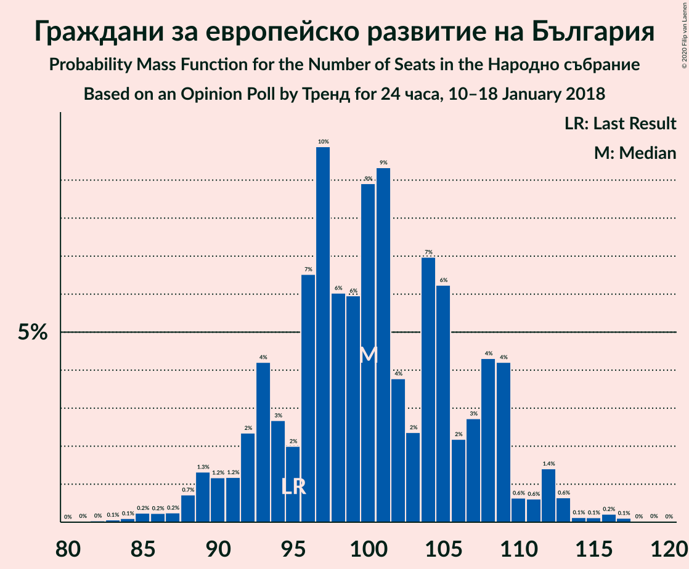
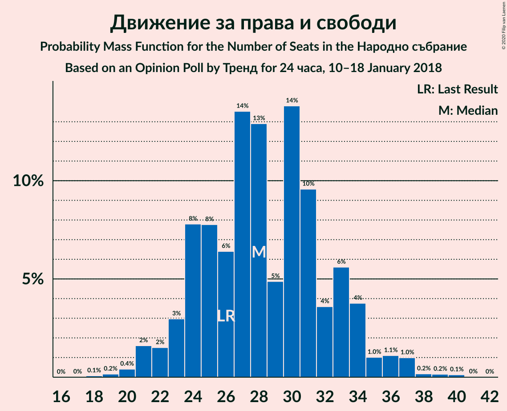
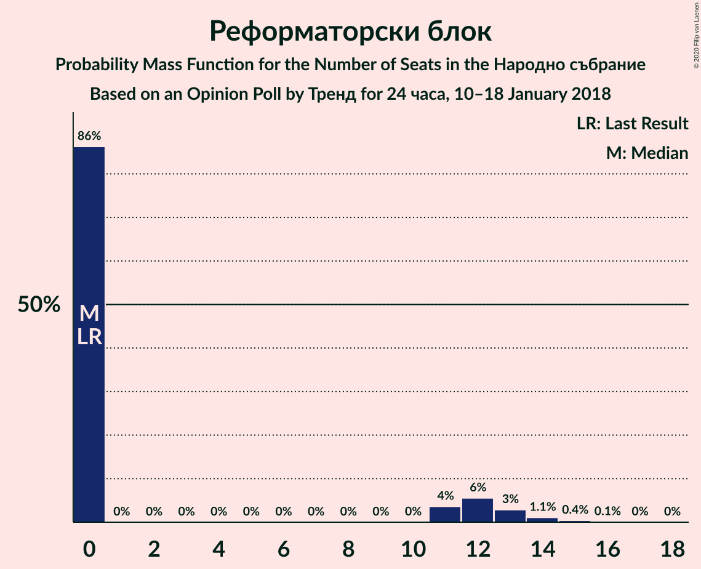
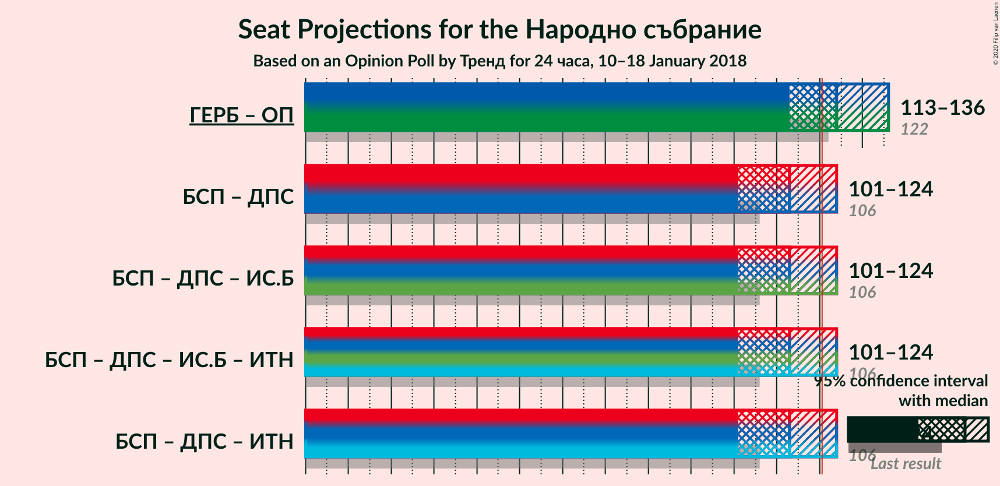

# Opinion Poll by Тренд for 24 часа, 10–18 January 2018

<a href="#voting-intentions">Voting Intentions</a> | <a href="#seats">Seats</a> | <a href="#coalitions">Coalitions</a> | <a href="#technical-information">Technical Information</a>

## Voting Intentions

### Confidence Intervals

| Party | Last Result | Poll Result | 80% Confidence Interval | 90% Confidence Interval | 95% Confidence Interval | 99% Confidence Interval |
|:-----:|:-----------:|:-----------:|:-----------------------:|:-----------------------:|:-----------------------:|:-----------------------:|
| Граждани за европейско развитие на България | 33.5% | 35.9% | 33.5–38.5% |32.8–39.2% |32.2–39.8% |31.0–41.0% |
| Българска социалистическа партия | 27.9% | 30.0% | 27.7–32.5% |27.1–33.2% |26.5–33.8% |25.4–35.0% |
| Движение за права и свободи | 9.2% | 10.0% | 8.6–11.7% |8.2–12.2% |7.9–12.7% |7.2–13.5% |
| Обединени Патриоти | 9.3% | 8.7% | 7.4–10.3% |7.0–10.8% |6.7–11.2% |6.1–12.0% |
| Реформаторски блок | 3.1% | 3.1% | 2.4–4.2% |2.2–4.5% |2.0–4.8% |1.7–5.4% |
| Воля | 4.3% | 2.6% | 2.0–3.7% |1.8–4.0% |1.6–4.2% |1.4–4.8% |
| Да, България! | 3.0% | 2.6% | 2.0–3.7% |1.8–4.0% |1.6–4.2% |1.4–4.8% |
| Демократи за силна България | 0.0% | 1.6% | 1.1–2.5% |1.0–2.8% |0.9–3.0% |0.7–3.5% |

*Note:* The poll result column reflects the actual value used in the calculations. Published results may vary slightly, and in addition be rounded to fewer digits.

## Seats

### Confidence Intervals

| Party | Last Result | Median | 80% Confidence Interval | 90% Confidence Interval | 95% Confidence Interval | 99% Confidence Interval |
|:-----:|:-----------:|:------:|:-----------------------:|:-----------------------:|:-----------------------:|:-----------------------:|
| <a href="#граждани-за-европейско-развитие-на-българия">Граждани за европейско развитие на България</a> | 95 | 100 | 93–108 |91–109 |90–110 |86–115 |
| <a href="#българска-социалистическа-партия">Българска социалистическа партия</a> | 80 | 84 | 76–93 |75–93 |74–95 |71–99 |
| <a href="#движение-за-права-и-свободи">Движение за права и свободи</a> | 26 | 28 | 24–34 |23–35 |22–37 |20–38 |
| <a href="#обединени-патриоти">Обединени Патриоти</a> | 27 | 25 | 21–28 |20–30 |19–32 |16–35 |
| <a href="#реформаторски-блок">Реформаторски блок</a> | 0 | 0 | 0–12 |0–12 |0–13 |0–14 |
| <a href="#воля">Воля</a> | 12 | 0 | 0 |0–11 |0–11 |0–13 |
| <a href="#да,-българия!">Да, България!</a> | 0 | 0 | 0 |0 |0–11 |0–13 |
| <a href="#демократи-за-силна-българия">Демократи за силна България</a> | 0 | 0 | 0 |0 |0 |0 |

### Граждани за европейско развитие на България

*For a full overview of the results for this party, see the [Граждани за европейско развитие на България](party-гражданизаевропейскоразвитиенабългария.html) page.*

| Number of Seats | Probability | Accumulated | Special Marks |
|:---------------:|:-----------:|:-----------:|:-------------:|
| 82 | 0.1% | 100% |  |
| 83 | 0.1% | 99.9% |  |
| 84 | 0.2% | 99.8% |  |
| 85 | 0.1% | 99.6% |  |
| 86 | 0.2% | 99.5% |  |
| 87 | 0.2% | 99.3% |  |
| 88 | 0.3% | 99.1% |  |
| 89 | 1.2% | 98.8% |  |
| 90 | 2% | 98% |  |
| 91 | 3% | 96% |  |
| 92 | 2% | 93% |  |
| 93 | 10% | 92% |  |
| 94 | 3% | 82% |  |
| 95 | 2% | 79% | Last Result |
| 96 | 3% | 77% |  |
| 97 | 10% | 73% |  |
| 98 | 1.3% | 63% |  |
| 99 | 4% | 62% |  |
| 100 | 18% | 58% | Median |
| 101 | 9% | 40% |  |
| 102 | 2% | 31% |  |
| 103 | 2% | 29% |  |
| 104 | 6% | 28% |  |
| 105 | 4% | 22% |  |
| 106 | 1.3% | 17% |  |
| 107 | 2% | 16% |  |
| 108 | 5% | 14% |  |
| 109 | 7% | 9% |  |
| 110 | 0.6% | 3% |  |
| 111 | 0.1% | 2% |  |
| 112 | 0.9% | 2% |  |
| 113 | 0.3% | 1.1% |  |
| 114 | 0.2% | 0.7% |  |
| 115 | 0.2% | 0.6% |  |
| 116 | 0.2% | 0.4% |  |
| 117 | 0% | 0.1% |  |
| 118 | 0% | 0.1% |  |
| 119 | 0% | 0.1% |  |
| 120 | 0% | 0% |  |

### Българска социалистическа партия

*For a full overview of the results for this party, see the [Българска социалистическа партия](party-българскасоциалистическапартия.html) page.*

| Number of Seats | Probability | Accumulated | Special Marks |
|:---------------:|:-----------:|:-----------:|:-------------:|
| 67 | 0% | 100% |  |
| 68 | 0% | 99.9% |  |
| 69 | 0.1% | 99.9% |  |
| 70 | 0.3% | 99.8% |  |
| 71 | 0.4% | 99.5% |  |
| 72 | 0.4% | 99.1% |  |
| 73 | 0.9% | 98.7% |  |
| 74 | 2% | 98% |  |
| 75 | 5% | 96% |  |
| 76 | 1.3% | 91% |  |
| 77 | 0.9% | 89% |  |
| 78 | 4% | 89% |  |
| 79 | 11% | 85% |  |
| 80 | 3% | 74% | Last Result |
| 81 | 7% | 71% |  |
| 82 | 3% | 64% |  |
| 83 | 9% | 61% |  |
| 84 | 6% | 52% | Median |
| 85 | 2% | 45% |  |
| 86 | 2% | 43% |  |
| 87 | 2% | 41% |  |
| 88 | 4% | 39% |  |
| 89 | 16% | 35% |  |
| 90 | 1.4% | 19% |  |
| 91 | 2% | 17% |  |
| 92 | 2% | 15% |  |
| 93 | 8% | 13% |  |
| 94 | 0.7% | 5% |  |
| 95 | 2% | 4% |  |
| 96 | 0.1% | 2% |  |
| 97 | 1.5% | 2% |  |
| 98 | 0.4% | 0.9% |  |
| 99 | 0.4% | 0.5% |  |
| 100 | 0% | 0.1% |  |
| 101 | 0% | 0.1% |  |
| 102 | 0% | 0.1% |  |
| 103 | 0% | 0% |  |

### Движение за права и свободи

*For a full overview of the results for this party, see the [Движение за права и свободи](party-движениезаправаисвободи.html) page.*

| Number of Seats | Probability | Accumulated | Special Marks |
|:---------------:|:-----------:|:-----------:|:-------------:|
| 18 | 0.1% | 100% |  |
| 19 | 0.3% | 99.9% |  |
| 20 | 0.3% | 99.6% |  |
| 21 | 2% | 99.3% |  |
| 22 | 2% | 98% |  |
| 23 | 4% | 96% |  |
| 24 | 3% | 92% |  |
| 25 | 20% | 88% |  |
| 26 | 3% | 69% | Last Result |
| 27 | 7% | 65% |  |
| 28 | 17% | 58% | Median |
| 29 | 3% | 40% |  |
| 30 | 10% | 37% |  |
| 31 | 9% | 27% |  |
| 32 | 3% | 17% |  |
| 33 | 4% | 15% |  |
| 34 | 5% | 10% |  |
| 35 | 1.1% | 5% |  |
| 36 | 1.3% | 4% |  |
| 37 | 2% | 3% |  |
| 38 | 0.2% | 0.5% |  |
| 39 | 0.1% | 0.3% |  |
| 40 | 0.1% | 0.2% |  |
| 41 | 0.1% | 0.1% |  |
| 42 | 0% | 0% |  |

### Обединени Патриоти

*For a full overview of the results for this party, see the [Обединени Патриоти](party-обединенипатриоти.html) page.*

| Number of Seats | Probability | Accumulated | Special Marks |
|:---------------:|:-----------:|:-----------:|:-------------:|
| 15 | 0% | 100% |  |
| 16 | 0.5% | 99.9% |  |
| 17 | 0.3% | 99.5% |  |
| 18 | 2% | 99.1% |  |
| 19 | 2% | 98% |  |
| 20 | 4% | 95% |  |
| 21 | 10% | 91% |  |
| 22 | 11% | 81% |  |
| 23 | 6% | 70% |  |
| 24 | 11% | 64% |  |
| 25 | 13% | 53% | Median |
| 26 | 17% | 40% |  |
| 27 | 10% | 23% | Last Result |
| 28 | 5% | 13% |  |
| 29 | 2% | 8% |  |
| 30 | 3% | 7% |  |
| 31 | 0.9% | 4% |  |
| 32 | 0.9% | 3% |  |
| 33 | 2% | 2% |  |
| 34 | 0.1% | 0.6% |  |
| 35 | 0.4% | 0.5% |  |
| 36 | 0.1% | 0.2% |  |
| 37 | 0% | 0.1% |  |
| 38 | 0.1% | 0.1% |  |
| 39 | 0% | 0% |  |

### Реформаторски блок

*For a full overview of the results for this party, see the [Реформаторски блок](party-реформаторскиблок.html) page.*

| Number of Seats | Probability | Accumulated | Special Marks |
|:---------------:|:-----------:|:-----------:|:-------------:|
| 0 | 86% | 100% | Last Result, Median |
| 1 | 0% | 14% |  |
| 2 | 0% | 14% |  |
| 3 | 0% | 14% |  |
| 4 | 0% | 14% |  |
| 5 | 0% | 14% |  |
| 6 | 0% | 14% |  |
| 7 | 0% | 14% |  |
| 8 | 0% | 14% |  |
| 9 | 0% | 14% |  |
| 10 | 0% | 14% |  |
| 11 | 2% | 14% |  |
| 12 | 9% | 12% |  |
| 13 | 1.3% | 4% |  |
| 14 | 2% | 2% |  |
| 15 | 0.3% | 0.5% |  |
| 16 | 0.1% | 0.2% |  |
| 17 | 0.1% | 0.1% |  |
| 18 | 0% | 0% |  |

### Воля

*For a full overview of the results for this party, see the [Воля](party-воля.html) page.*

| Number of Seats | Probability | Accumulated | Special Marks |
|:---------------:|:-----------:|:-----------:|:-------------:|
| 0 | 94% | 100% | Median |
| 1 | 0% | 6% |  |
| 2 | 0% | 6% |  |
| 3 | 0% | 6% |  |
| 4 | 0% | 6% |  |
| 5 | 0% | 6% |  |
| 6 | 0% | 6% |  |
| 7 | 0% | 6% |  |
| 8 | 0% | 6% |  |
| 9 | 0% | 6% |  |
| 10 | 0% | 6% |  |
| 11 | 4% | 6% |  |
| 12 | 0.7% | 2% | Last Result |
| 13 | 1.0% | 1.3% |  |
| 14 | 0.3% | 0.4% |  |
| 15 | 0% | 0.1% |  |
| 16 | 0% | 0% |  |

### Да, България!

*For a full overview of the results for this party, see the [Да, България!](party-дабългария.html) page.*

| Number of Seats | Probability | Accumulated | Special Marks |
|:---------------:|:-----------:|:-----------:|:-------------:|
| 0 | 96% | 100% | Last Result, Median |
| 1 | 0% | 4% |  |
| 2 | 0% | 4% |  |
| 3 | 0% | 4% |  |
| 4 | 0% | 4% |  |
| 5 | 0% | 4% |  |
| 6 | 0% | 4% |  |
| 7 | 0% | 4% |  |
| 8 | 0% | 4% |  |
| 9 | 0% | 4% |  |
| 10 | 0% | 4% |  |
| 11 | 2% | 4% |  |
| 12 | 1.4% | 2% |  |
| 13 | 0.4% | 0.7% |  |
| 14 | 0.3% | 0.3% |  |
| 15 | 0.1% | 0.1% |  |
| 16 | 0% | 0% |  |

### Демократи за силна България

*For a full overview of the results for this party, see the [Демократи за силна България](party-демократизасилнабългария.html) page.*

| Number of Seats | Probability | Accumulated | Special Marks |
|:---------------:|:-----------:|:-----------:|:-------------:|
| 0 | 100% | 100% | Last Result, Median |

## Coalitions

### Confidence Intervals

| Coalition | Last Result | Median | Majority? | 80% Confidence Interval | 90% Confidence Interval | 95% Confidence Interval | 99% Confidence Interval |
|:---------:|:-----------:|:------:|:---------:|:-----------------------:|:-----------------------:|:-----------------------:|:-----------------------:|
| Граждани за европейско развитие на България – Обединени Патриоти | 122 | 125 | 73% | 116–133 | 115–135 | 113–135 | 110–141 |
| Българска социалистическа партия – Движение за права и свободи | 106 | 114 | 14% | 105–121 | 103–124 | 101–125 | 96–126 |

### Граждани за европейско развитие на България – Обединени Патриоти

| Number of Seats | Probability | Accumulated | Special Marks |
|:---------------:|:-----------:|:-----------:|:-------------:|
| 105 | 0.1% | 100% |  |
| 106 | 0% | 99.9% |  |
| 107 | 0.1% | 99.8% |  |
| 108 | 0.1% | 99.7% |  |
| 109 | 0.2% | 99.7% |  |
| 110 | 0.2% | 99.5% |  |
| 111 | 0.4% | 99.3% |  |
| 112 | 0.7% | 98.9% |  |
| 113 | 1.1% | 98% |  |
| 114 | 1.1% | 97% |  |
| 115 | 3% | 96% |  |
| 116 | 6% | 93% |  |
| 117 | 3% | 88% |  |
| 118 | 3% | 84% |  |
| 119 | 7% | 82% |  |
| 120 | 1.5% | 74% |  |
| 121 | 1.3% | 73% | Majority |
| 122 | 7% | 71% | Last Result |
| 123 | 3% | 65% |  |
| 124 | 7% | 62% |  |
| 125 | 7% | 55% | Median |
| 126 | 19% | 47% |  |
| 127 | 3% | 28% |  |
| 128 | 4% | 25% |  |
| 129 | 2% | 21% |  |
| 130 | 0.6% | 19% |  |
| 131 | 6% | 19% |  |
| 132 | 2% | 13% |  |
| 133 | 4% | 11% |  |
| 134 | 3% | 8% |  |
| 135 | 3% | 5% |  |
| 136 | 0.7% | 2% |  |
| 137 | 0.3% | 0.9% |  |
| 138 | 0% | 0.7% |  |
| 139 | 0.1% | 0.6% |  |
| 140 | 0% | 0.6% |  |
| 141 | 0.2% | 0.6% |  |
| 142 | 0.1% | 0.3% |  |
| 143 | 0.2% | 0.2% |  |
| 144 | 0% | 0% |  |

### Българска социалистическа партия – Движение за права и свободи

| Number of Seats | Probability | Accumulated | Special Marks |
|:---------------:|:-----------:|:-----------:|:-------------:|
| 93 | 0% | 100% |  |
| 94 | 0.1% | 99.9% |  |
| 95 | 0.1% | 99.9% |  |
| 96 | 0.4% | 99.8% |  |
| 97 | 0.3% | 99.4% |  |
| 98 | 0.2% | 99.1% |  |
| 99 | 0.7% | 98.8% |  |
| 100 | 0.5% | 98% |  |
| 101 | 0.3% | 98% |  |
| 102 | 0.7% | 97% |  |
| 103 | 3% | 97% |  |
| 104 | 1.4% | 93% |  |
| 105 | 4% | 92% |  |
| 106 | 6% | 87% | Last Result |
| 107 | 5% | 81% |  |
| 108 | 2% | 77% |  |
| 109 | 8% | 74% |  |
| 110 | 2% | 67% |  |
| 111 | 3% | 65% |  |
| 112 | 4% | 62% | Median |
| 113 | 6% | 58% |  |
| 114 | 17% | 52% |  |
| 115 | 7% | 35% |  |
| 116 | 7% | 28% |  |
| 117 | 2% | 21% |  |
| 118 | 2% | 18% |  |
| 119 | 1.1% | 16% |  |
| 120 | 1.0% | 15% |  |
| 121 | 4% | 14% | Majority |
| 122 | 0.5% | 9% |  |
| 123 | 3% | 9% |  |
| 124 | 3% | 6% |  |
| 125 | 2% | 3% |  |
| 126 | 0.4% | 0.7% |  |
| 127 | 0.1% | 0.3% |  |
| 128 | 0% | 0.2% |  |
| 129 | 0% | 0.2% |  |
| 130 | 0% | 0.1% |  |
| 131 | 0% | 0.1% |  |
| 132 | 0% | 0% |  |

## Technical Information

### Opinion Poll

+ **Polling firm:** Тренд
+ **Commissioner(s):** 24 часа
+ **Fieldwork period:** 10–18 January 2018

### Calculations

+ **Sample size:** 610
+ **Simulations done:** 131,072
+ **Error estimate:** 3.80%

