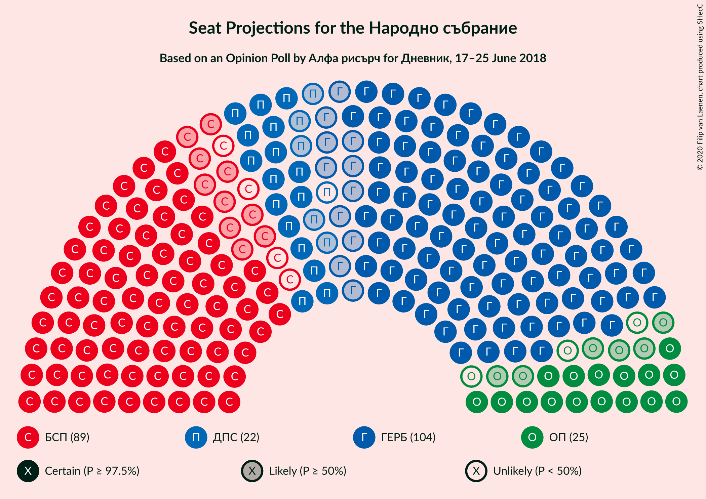
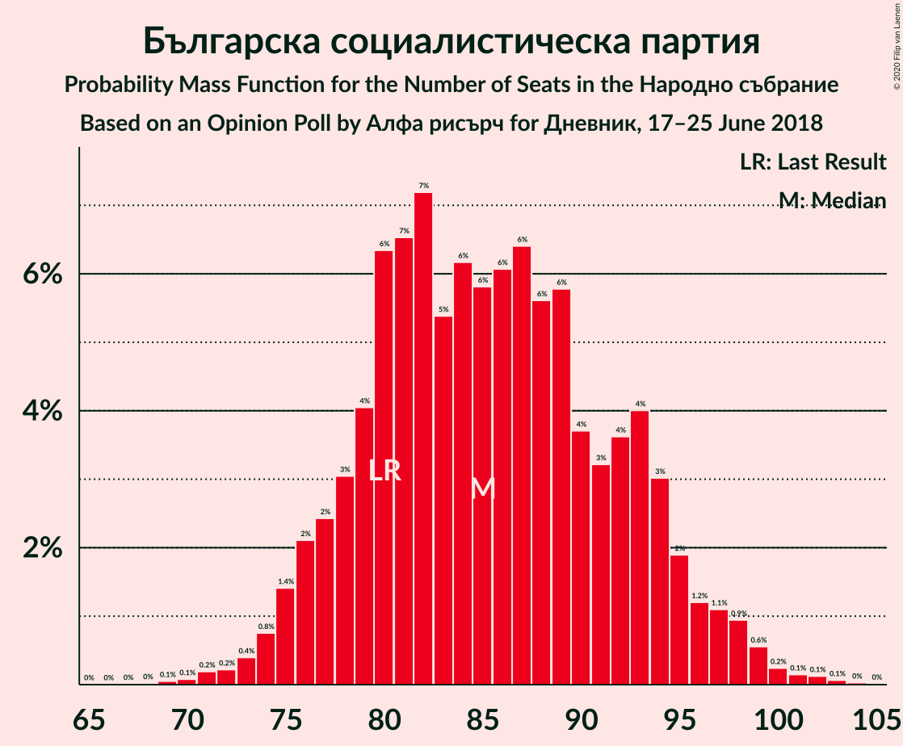
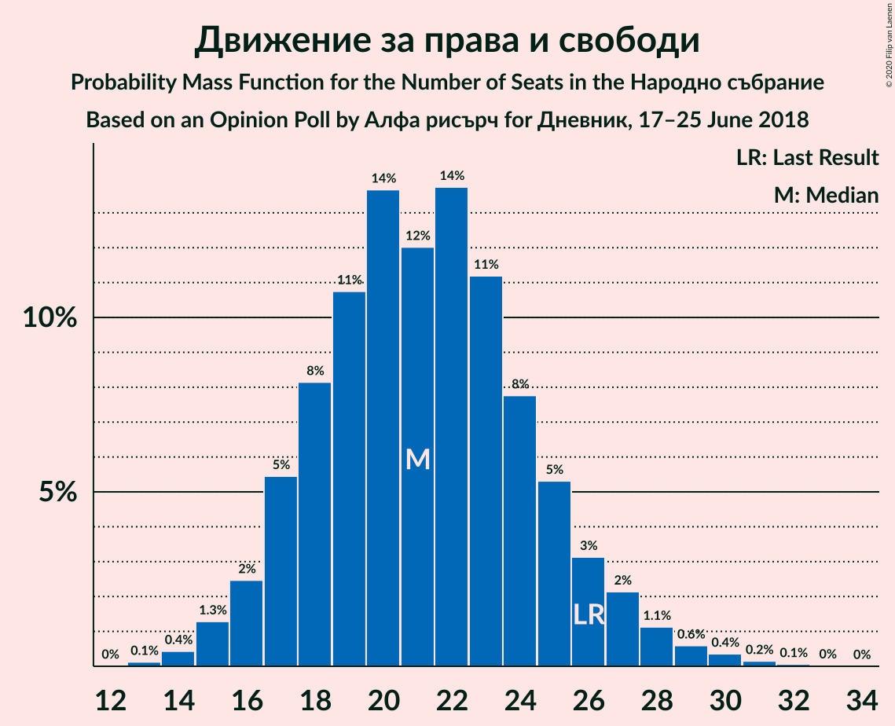
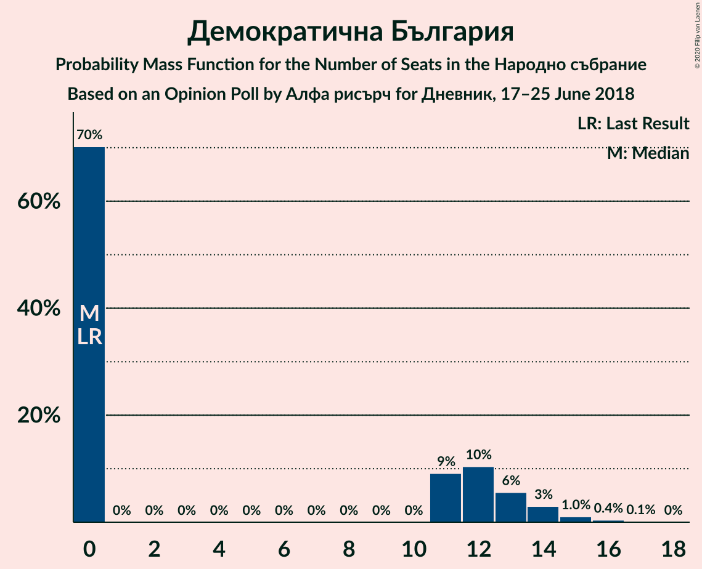
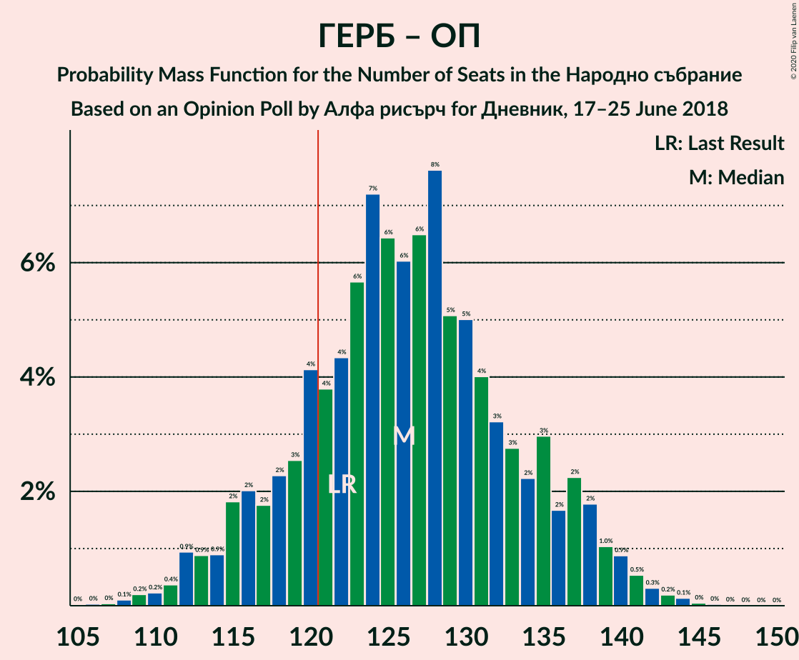

# Opinion Poll by Алфа рисърч for Дневник, 17–25 June 2018

<a href="#voting-intentions">Voting Intentions</a> | <a href="#seats">Seats</a> | <a href="#coalitions">Coalitions</a> | <a href="#technical-information">Technical Information</a>

## Voting Intentions

### Confidence Intervals

| Party | Last Result | Poll Result | 80% Confidence Interval | 90% Confidence Interval | 95% Confidence Interval | 99% Confidence Interval |
|:-----:|:-----------:|:-----------:|:-----------------------:|:-----------------------:|:-----------------------:|:-----------------------:|
| Граждани за европейско развитие на България | 33.5% | 37.4% | 35.1–39.9% |34.4–40.6% |33.8–41.2% |32.7–42.4% |
| Българска социалистическа партия | 27.9% | 30.7% | 28.5–33.0% |27.8–33.7% |27.3–34.3% |26.2–35.4% |
| Обединени Патриоти | 9.3% | 7.7% | 6.5–9.2% |6.2–9.6% |5.9–10.0% |5.4–10.7% |
| Движение за права и свободи | 9.2% | 7.5% | 6.4–9.0% |6.0–9.4% |5.7–9.8% |5.2–10.5% |
| Воля | 4.3% | 3.5% | 2.7–4.6% |2.5–4.9% |2.3–5.2% |2.0–5.7% |
| Демократична България | 0.0% | 3.5% | 2.7–4.6% |2.5–4.9% |2.3–5.2% |2.0–5.7% |
| Възраждане | 0.0% | 0.6% | 0.4–1.2% |0.3–1.4% |0.2–1.5% |0.2–1.9% |

*Note:* The poll result column reflects the actual value used in the calculations. Published results may vary slightly, and in addition be rounded to fewer digits.

## Seats

### Confidence Intervals

| Party | Last Result | Median | 80% Confidence Interval | 90% Confidence Interval | 95% Confidence Interval | 99% Confidence Interval |
|:-----:|:-----------:|:------:|:-----------------------:|:-----------------------:|:-----------------------:|:-----------------------:|
| <a href="#граждани-за-европейско-развитие-на-българия">Граждани за европейско развитие на България</a> | 95 | 104 | 97–113 |94–115 |93–117 |90–119 |
| <a href="#българска-социалистическа-партия">Българска социалистическа партия</a> | 80 | 85 | 78–93 |76–95 |75–97 |72–100 |
| <a href="#обединени-патриоти">Обединени Патриоти</a> | 27 | 22 | 18–25 |17–27 |16–28 |15–30 |
| <a href="#движение-за-права-и-свободи">Движение за права и свободи</a> | 26 | 21 | 18–25 |17–26 |16–27 |14–30 |
| <a href="#воля">Воля</a> | 12 | 0 | 0–13 |0–13 |0–14 |0–16 |
| <a href="#демократична-българия">Демократична България</a> | 0 | 0 | 0–13 |0–13 |0–14 |0–16 |
| <a href="#възраждане">Възраждане</a> | 0 | 0 | 0 |0 |0 |0 |

### Граждани за европейско развитие на България

*For a full overview of the results for this party, see the [Граждани за европейско развитие на България](party-гражданизаевропейскоразвитиенабългария.html) page.*

| Number of Seats | Probability | Accumulated | Special Marks |
|:---------------:|:-----------:|:-----------:|:-------------:|
| 86 | 0% | 100% |  |
| 87 | 0.1% | 99.9% |  |
| 88 | 0.1% | 99.9% |  |
| 89 | 0.2% | 99.8% |  |
| 90 | 0.4% | 99.6% |  |
| 91 | 0.5% | 99.2% |  |
| 92 | 0.7% | 98.7% |  |
| 93 | 2% | 98% |  |
| 94 | 2% | 96% |  |
| 95 | 2% | 95% | Last Result |
| 96 | 2% | 93% |  |
| 97 | 4% | 91% |  |
| 98 | 3% | 87% |  |
| 99 | 4% | 84% |  |
| 100 | 5% | 81% |  |
| 101 | 6% | 76% |  |
| 102 | 6% | 70% |  |
| 103 | 7% | 64% |  |
| 104 | 11% | 57% | Median |
| 105 | 6% | 46% |  |
| 106 | 6% | 40% |  |
| 107 | 7% | 34% |  |
| 108 | 3% | 27% |  |
| 109 | 3% | 25% |  |
| 110 | 3% | 22% |  |
| 111 | 2% | 18% |  |
| 112 | 3% | 16% |  |
| 113 | 4% | 13% |  |
| 114 | 2% | 10% |  |
| 115 | 3% | 7% |  |
| 116 | 2% | 4% |  |
| 117 | 1.0% | 3% |  |
| 118 | 0.8% | 2% |  |
| 119 | 0.6% | 1.0% |  |
| 120 | 0.2% | 0.5% |  |
| 121 | 0.2% | 0.3% | Majority |
| 122 | 0.1% | 0.1% |  |
| 123 | 0% | 0% |  |

### Българска социалистическа партия

*For a full overview of the results for this party, see the [Българска социалистическа партия](party-българскасоциалистическапартия.html) page.*

| Number of Seats | Probability | Accumulated | Special Marks |
|:---------------:|:-----------:|:-----------:|:-------------:|
| 69 | 0.1% | 100% |  |
| 70 | 0.1% | 99.9% |  |
| 71 | 0.2% | 99.8% |  |
| 72 | 0.2% | 99.6% |  |
| 73 | 0.4% | 99.4% |  |
| 74 | 0.8% | 99.0% |  |
| 75 | 1.4% | 98% |  |
| 76 | 2% | 97% |  |
| 77 | 2% | 95% |  |
| 78 | 3% | 92% |  |
| 79 | 4% | 89% |  |
| 80 | 6% | 85% | Last Result |
| 81 | 7% | 79% |  |
| 82 | 7% | 72% |  |
| 83 | 5% | 65% |  |
| 84 | 6% | 60% |  |
| 85 | 6% | 54% | Median |
| 86 | 6% | 48% |  |
| 87 | 6% | 42% |  |
| 88 | 6% | 35% |  |
| 89 | 6% | 30% |  |
| 90 | 4% | 24% |  |
| 91 | 3% | 20% |  |
| 92 | 4% | 17% |  |
| 93 | 4% | 13% |  |
| 94 | 3% | 9% |  |
| 95 | 2% | 6% |  |
| 96 | 1.2% | 4% |  |
| 97 | 1.1% | 3% |  |
| 98 | 0.9% | 2% |  |
| 99 | 0.6% | 1.2% |  |
| 100 | 0.2% | 0.6% |  |
| 101 | 0.1% | 0.4% |  |
| 102 | 0.1% | 0.2% |  |
| 103 | 0.1% | 0.1% |  |
| 104 | 0% | 0.1% |  |
| 105 | 0% | 0% |  |

### Обединени Патриоти

*For a full overview of the results for this party, see the [Обединени Патриоти](party-обединенипатриоти.html) page.*

| Number of Seats | Probability | Accumulated | Special Marks |
|:---------------:|:-----------:|:-----------:|:-------------:|
| 13 | 0.1% | 100% |  |
| 14 | 0.3% | 99.9% |  |
| 15 | 0.7% | 99.7% |  |
| 16 | 2% | 99.0% |  |
| 17 | 4% | 97% |  |
| 18 | 9% | 93% |  |
| 19 | 10% | 84% |  |
| 20 | 11% | 74% |  |
| 21 | 12% | 63% |  |
| 22 | 9% | 51% | Median |
| 23 | 14% | 42% |  |
| 24 | 11% | 28% |  |
| 25 | 9% | 17% |  |
| 26 | 3% | 8% |  |
| 27 | 3% | 5% | Last Result |
| 28 | 0.9% | 3% |  |
| 29 | 0.6% | 2% |  |
| 30 | 0.7% | 1.0% |  |
| 31 | 0.2% | 0.4% |  |
| 32 | 0.1% | 0.2% |  |
| 33 | 0% | 0% |  |

### Движение за права и свободи

*For a full overview of the results for this party, see the [Движение за права и свободи](party-движениезаправаисвободи.html) page.*

| Number of Seats | Probability | Accumulated | Special Marks |
|:---------------:|:-----------:|:-----------:|:-------------:|
| 13 | 0.1% | 100% |  |
| 14 | 0.4% | 99.9% |  |
| 15 | 1.3% | 99.4% |  |
| 16 | 2% | 98% |  |
| 17 | 5% | 96% |  |
| 18 | 8% | 90% |  |
| 19 | 11% | 82% |  |
| 20 | 14% | 71% |  |
| 21 | 12% | 58% | Median |
| 22 | 14% | 46% |  |
| 23 | 11% | 32% |  |
| 24 | 8% | 21% |  |
| 25 | 5% | 13% |  |
| 26 | 3% | 8% | Last Result |
| 27 | 2% | 4% |  |
| 28 | 1.1% | 2% |  |
| 29 | 0.6% | 1.2% |  |
| 30 | 0.4% | 0.6% |  |
| 31 | 0.2% | 0.3% |  |
| 32 | 0.1% | 0.1% |  |
| 33 | 0% | 0% |  |

### Воля

*For a full overview of the results for this party, see the [Воля](party-воля.html) page.*

| Number of Seats | Probability | Accumulated | Special Marks |
|:---------------:|:-----------:|:-----------:|:-------------:|
| 0 | 72% | 100% | Median |
| 1 | 0% | 28% |  |
| 2 | 0% | 28% |  |
| 3 | 0% | 28% |  |
| 4 | 0% | 28% |  |
| 5 | 0% | 28% |  |
| 6 | 0% | 28% |  |
| 7 | 0% | 28% |  |
| 8 | 0% | 28% |  |
| 9 | 0% | 28% |  |
| 10 | 0% | 28% |  |
| 11 | 9% | 28% |  |
| 12 | 9% | 19% | Last Result |
| 13 | 6% | 10% |  |
| 14 | 3% | 4% |  |
| 15 | 0.9% | 2% |  |
| 16 | 0.4% | 0.6% |  |
| 17 | 0.2% | 0.2% |  |
| 18 | 0% | 0.1% |  |
| 19 | 0% | 0% |  |

### Демократична България

*For a full overview of the results for this party, see the [Демократична България](party-демократичнабългария.html) page.*

| Number of Seats | Probability | Accumulated | Special Marks |
|:---------------:|:-----------:|:-----------:|:-------------:|
| 0 | 70% | 100% | Last Result, Median |
| 1 | 0% | 30% |  |
| 2 | 0% | 30% |  |
| 3 | 0% | 30% |  |
| 4 | 0% | 30% |  |
| 5 | 0% | 30% |  |
| 6 | 0% | 30% |  |
| 7 | 0% | 30% |  |
| 8 | 0% | 30% |  |
| 9 | 0% | 30% |  |
| 10 | 0% | 30% |  |
| 11 | 9% | 30% |  |
| 12 | 10% | 21% |  |
| 13 | 6% | 10% |  |
| 14 | 3% | 5% |  |
| 15 | 1.0% | 2% |  |
| 16 | 0.4% | 0.6% |  |
| 17 | 0.1% | 0.2% |  |
| 18 | 0% | 0% |  |

### Възраждане

*For a full overview of the results for this party, see the [Възраждане](party-възраждане.html) page.*

| Number of Seats | Probability | Accumulated | Special Marks |
|:---------------:|:-----------:|:-----------:|:-------------:|
| 0 | 100% | 100% | Last Result, Median |

## Coalitions

### Confidence Intervals

| Coalition | Last Result | Median | Majority? | 80% Confidence Interval | 90% Confidence Interval | 95% Confidence Interval | 99% Confidence Interval |
|:---------:|:-----------:|:------:|:---------:|:-----------------------:|:-----------------------:|:-----------------------:|:-----------------------:|
| Граждани за европейско развитие на България – Обединени Патриоти | 122 | 126 | 82% | 118–135 | 115–137 | 113–139 | 110–142 |
| Българска социалистическа партия – Движение за права и свободи | 106 | 106 | 1.3% | 99–116 | 97–117 | 96–119 | 93–122 |

### Граждани за европейско развитие на България – Обединени Патриоти

| Number of Seats | Probability | Accumulated | Special Marks |
|:---------------:|:-----------:|:-----------:|:-------------:|
| 106 | 0% | 100% |  |
| 107 | 0% | 99.9% |  |
| 108 | 0.1% | 99.9% |  |
| 109 | 0.2% | 99.8% |  |
| 110 | 0.2% | 99.6% |  |
| 111 | 0.4% | 99.4% |  |
| 112 | 0.9% | 99.0% |  |
| 113 | 0.9% | 98% |  |
| 114 | 0.9% | 97% |  |
| 115 | 2% | 96% |  |
| 116 | 2% | 94% |  |
| 117 | 2% | 92% |  |
| 118 | 2% | 91% |  |
| 119 | 3% | 88% |  |
| 120 | 4% | 86% |  |
| 121 | 4% | 82% | Majority |
| 122 | 4% | 78% | Last Result |
| 123 | 6% | 74% |  |
| 124 | 7% | 68% |  |
| 125 | 6% | 61% |  |
| 126 | 6% | 54% | Median |
| 127 | 6% | 48% |  |
| 128 | 8% | 42% |  |
| 129 | 5% | 34% |  |
| 130 | 5% | 29% |  |
| 131 | 4% | 24% |  |
| 132 | 3% | 20% |  |
| 133 | 3% | 17% |  |
| 134 | 2% | 14% |  |
| 135 | 3% | 12% |  |
| 136 | 2% | 9% |  |
| 137 | 2% | 7% |  |
| 138 | 2% | 5% |  |
| 139 | 1.0% | 3% |  |
| 140 | 0.9% | 2% |  |
| 141 | 0.5% | 1.3% |  |
| 142 | 0.3% | 0.7% |  |
| 143 | 0.2% | 0.4% |  |
| 144 | 0.1% | 0.2% |  |
| 145 | 0% | 0.1% |  |
| 146 | 0% | 0.1% |  |
| 147 | 0% | 0% |  |

### Българска социалистическа партия – Движение за права и свободи

| Number of Seats | Probability | Accumulated | Special Marks |
|:---------------:|:-----------:|:-----------:|:-------------:|
| 88 | 0% | 100% |  |
| 89 | 0% | 99.9% |  |
| 90 | 0.1% | 99.9% |  |
| 91 | 0.1% | 99.8% |  |
| 92 | 0.2% | 99.7% |  |
| 93 | 0.3% | 99.5% |  |
| 94 | 0.6% | 99.2% |  |
| 95 | 0.9% | 98.6% |  |
| 96 | 1.5% | 98% |  |
| 97 | 2% | 96% |  |
| 98 | 3% | 94% |  |
| 99 | 4% | 92% |  |
| 100 | 5% | 88% |  |
| 101 | 7% | 83% |  |
| 102 | 6% | 77% |  |
| 103 | 7% | 71% |  |
| 104 | 6% | 63% |  |
| 105 | 6% | 57% |  |
| 106 | 5% | 52% | Last Result, Median |
| 107 | 5% | 47% |  |
| 108 | 4% | 42% |  |
| 109 | 5% | 38% |  |
| 110 | 4% | 33% |  |
| 111 | 3% | 29% |  |
| 112 | 5% | 25% |  |
| 113 | 3% | 21% |  |
| 114 | 4% | 17% |  |
| 115 | 3% | 13% |  |
| 116 | 3% | 10% |  |
| 117 | 2% | 7% |  |
| 118 | 1.4% | 5% |  |
| 119 | 1.3% | 3% |  |
| 120 | 0.8% | 2% |  |
| 121 | 0.5% | 1.3% | Majority |
| 122 | 0.4% | 0.8% |  |
| 123 | 0.2% | 0.4% |  |
| 124 | 0.1% | 0.2% |  |
| 125 | 0.1% | 0.1% |  |
| 126 | 0% | 0% |  |

## Technical Information

### Opinion Poll

+ **Polling firm:** Алфа рисърч
+ **Commissioner(s):** Дневник
+ **Fieldwork period:** 17–25 June 2018

### Calculations

+ **Sample size:** 665
+ **Simulations done:** 1,048,576
+ **Error estimate:** 1.39%

