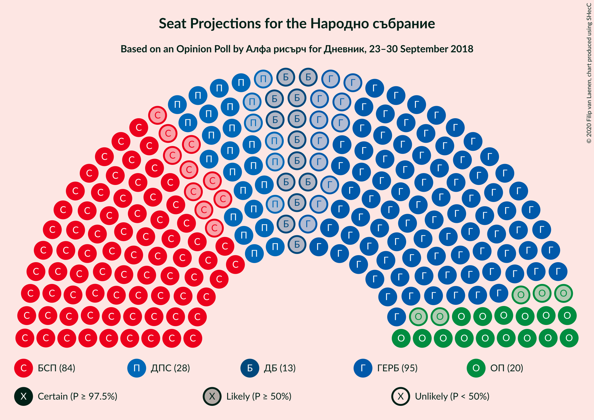
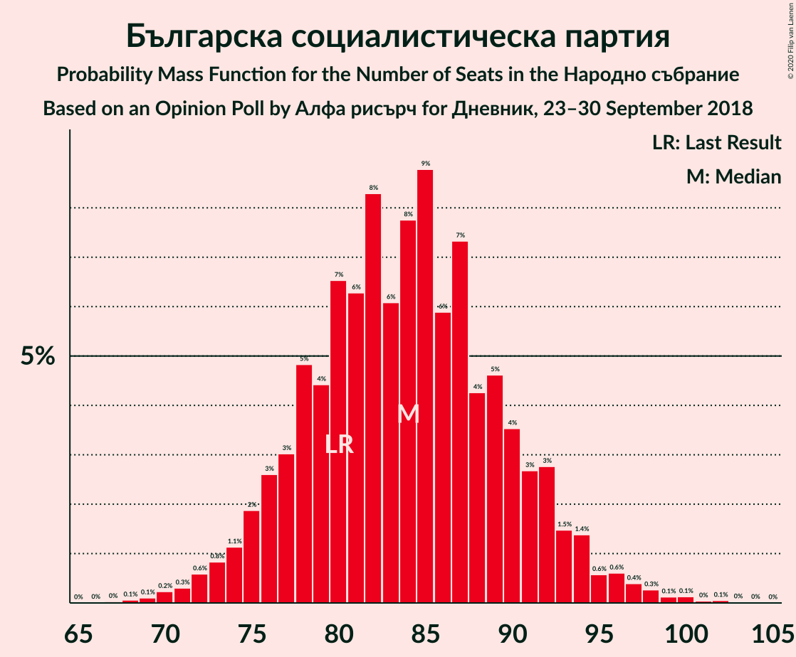
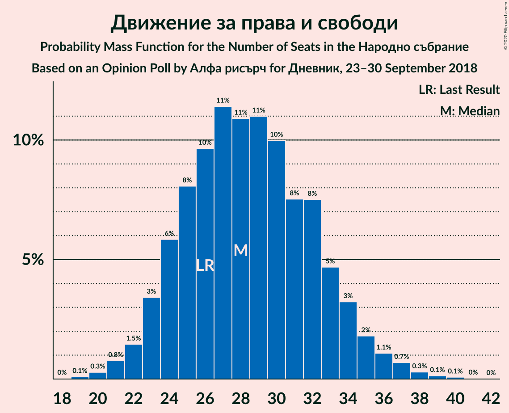

# Opinion Poll by Алфа рисърч for Дневник, 23–30 September 2018

<a href="#voting-intentions">Voting Intentions</a> | <a href="#seats">Seats</a> | <a href="#coalitions">Coalitions</a> | <a href="#technical-information">Technical Information</a>

## Voting Intentions

### Confidence Intervals

| Party | Last Result | Poll Result | 80% Confidence Interval | 90% Confidence Interval | 95% Confidence Interval | 99% Confidence Interval |
|:-----:|:-----------:|:-----------:|:-----------------------:|:-----------------------:|:-----------------------:|:-----------------------:|
| Граждани за европейско развитие на България | 33.5% | 35.0% | 32.7–37.5% |32.0–38.2% |31.4–38.8% |30.3–40.0% |
| Българска социалистическа партия | 27.9% | 31.0% | 28.8–33.4% |28.1–34.1% |27.6–34.7% |26.5–35.9% |
| Движение за права и свободи | 9.2% | 10.4% | 9.1–12.1% |8.7–12.6% |8.3–13.0% |7.7–13.9% |
| Обединени Патриоти | 9.3% | 7.4% | 6.2–8.9% |5.9–9.3% |5.6–9.6% |5.1–10.4% |
| Демократична България | 0.0% | 4.6% | 3.7–5.9% |3.5–6.2% |3.2–6.5% |2.9–7.1% |
| Воля | 4.3% | 3.2% | 2.5–4.3% |2.3–4.6% |2.1–4.9% |1.8–5.5% |
| Възраждане | 0.0% | 0.8% | 0.5–1.4% |0.4–1.6% |0.3–1.8% |0.2–2.2% |

*Note:* The poll result column reflects the actual value used in the calculations. Published results may vary slightly, and in addition be rounded to fewer digits.

## Seats

### Confidence Intervals

| Party | Last Result | Median | 80% Confidence Interval | 90% Confidence Interval | 95% Confidence Interval | 99% Confidence Interval |
|:-----:|:-----------:|:------:|:-----------------------:|:-----------------------:|:-----------------------:|:-----------------------:|
| <a href="#граждани-за-европейско-развитие-на-българия">Граждани за европейско развитие на България</a> | 95 | 95 | 88–103 |86–105 |84–106 |81–110 |
| <a href="#българска-социалистическа-партия">Българска социалистическа партия</a> | 80 | 84 | 77–91 |75–93 |74–94 |70–97 |
| <a href="#движение-за-права-и-свободи">Движение за права и свободи</a> | 26 | 29 | 24–33 |24–34 |23–35 |21–37 |
| <a href="#обединени-патриоти">Обединени Патриоти</a> | 27 | 20 | 17–24 |16–25 |15–27 |14–28 |
| <a href="#демократична-българия">Демократична България</a> | 0 | 13 | 0–15 |0–16 |0–17 |0–19 |
| <a href="#воля">Воля</a> | 12 | 0 | 0–11 |0–12 |0–13 |0–14 |
| <a href="#възраждане">Възраждане</a> | 0 | 0 | 0 |0 |0 |0 |

### Граждани за европейско развитие на България

*For a full overview of the results for this party, see the [Граждани за европейско развитие на България](party-гражданизаевропейскоразвитиенабългария.html) page.*

| Number of Seats | Probability | Accumulated | Special Marks |
|:---------------:|:-----------:|:-----------:|:-------------:|
| 77 | 0% | 100% |  |
| 78 | 0% | 99.9% |  |
| 79 | 0.1% | 99.9% |  |
| 80 | 0.1% | 99.8% |  |
| 81 | 0.3% | 99.7% |  |
| 82 | 0.8% | 99.4% |  |
| 83 | 0.9% | 98.6% |  |
| 84 | 1.3% | 98% |  |
| 85 | 1.3% | 96% |  |
| 86 | 3% | 95% |  |
| 87 | 2% | 92% |  |
| 88 | 3% | 90% |  |
| 89 | 3% | 88% |  |
| 90 | 1.3% | 84% |  |
| 91 | 11% | 83% |  |
| 92 | 8% | 72% |  |
| 93 | 2% | 64% |  |
| 94 | 8% | 62% |  |
| 95 | 12% | 53% | Last Result, Median |
| 96 | 5% | 42% |  |
| 97 | 7% | 36% |  |
| 98 | 3% | 30% |  |
| 99 | 0.9% | 27% |  |
| 100 | 3% | 26% |  |
| 101 | 8% | 22% |  |
| 102 | 2% | 15% |  |
| 103 | 3% | 13% |  |
| 104 | 4% | 10% |  |
| 105 | 2% | 6% |  |
| 106 | 2% | 4% |  |
| 107 | 0.8% | 2% |  |
| 108 | 0.4% | 1.2% |  |
| 109 | 0.1% | 0.8% |  |
| 110 | 0.4% | 0.6% |  |
| 111 | 0.1% | 0.2% |  |
| 112 | 0% | 0.1% |  |
| 113 | 0% | 0.1% |  |
| 114 | 0% | 0.1% |  |
| 115 | 0% | 0% |  |

### Българска социалистическа партия

*For a full overview of the results for this party, see the [Българска социалистическа партия](party-българскасоциалистическапартия.html) page.*

| Number of Seats | Probability | Accumulated | Special Marks |
|:---------------:|:-----------:|:-----------:|:-------------:|
| 67 | 0% | 100% |  |
| 68 | 0.1% | 99.9% |  |
| 69 | 0.1% | 99.9% |  |
| 70 | 0.4% | 99.8% |  |
| 71 | 0.3% | 99.3% |  |
| 72 | 0.4% | 99.0% |  |
| 73 | 0.7% | 98.6% |  |
| 74 | 1.2% | 98% |  |
| 75 | 2% | 97% |  |
| 76 | 3% | 95% |  |
| 77 | 2% | 92% |  |
| 78 | 2% | 89% |  |
| 79 | 6% | 88% |  |
| 80 | 5% | 82% | Last Result |
| 81 | 3% | 77% |  |
| 82 | 13% | 74% |  |
| 83 | 6% | 61% |  |
| 84 | 5% | 55% | Median |
| 85 | 15% | 50% |  |
| 86 | 5% | 35% |  |
| 87 | 7% | 30% |  |
| 88 | 5% | 23% |  |
| 89 | 2% | 18% |  |
| 90 | 4% | 16% |  |
| 91 | 5% | 11% |  |
| 92 | 0.6% | 6% |  |
| 93 | 2% | 5% |  |
| 94 | 1.4% | 3% |  |
| 95 | 0.3% | 2% |  |
| 96 | 0.8% | 2% |  |
| 97 | 0.6% | 0.9% |  |
| 98 | 0.1% | 0.4% |  |
| 99 | 0.1% | 0.3% |  |
| 100 | 0.1% | 0.2% |  |
| 101 | 0% | 0.1% |  |
| 102 | 0.1% | 0.1% |  |
| 103 | 0% | 0.1% |  |
| 104 | 0% | 0% |  |

### Движение за права и свободи

*For a full overview of the results for this party, see the [Движение за права и свободи](party-движениезаправаисвободи.html) page.*

| Number of Seats | Probability | Accumulated | Special Marks |
|:---------------:|:-----------:|:-----------:|:-------------:|
| 19 | 0.1% | 100% |  |
| 20 | 0.2% | 99.9% |  |
| 21 | 0.7% | 99.7% |  |
| 22 | 0.9% | 99.0% |  |
| 23 | 3% | 98% |  |
| 24 | 8% | 95% |  |
| 25 | 9% | 87% |  |
| 26 | 9% | 78% | Last Result |
| 27 | 11% | 69% |  |
| 28 | 7% | 58% |  |
| 29 | 8% | 52% | Median |
| 30 | 13% | 44% |  |
| 31 | 7% | 31% |  |
| 32 | 11% | 24% |  |
| 33 | 5% | 13% |  |
| 34 | 5% | 8% |  |
| 35 | 1.3% | 3% |  |
| 36 | 0.9% | 2% |  |
| 37 | 0.6% | 1.0% |  |
| 38 | 0.2% | 0.4% |  |
| 39 | 0.1% | 0.2% |  |
| 40 | 0.1% | 0.1% |  |
| 41 | 0% | 0.1% |  |
| 42 | 0% | 0% |  |

### Обединени Патриоти

*For a full overview of the results for this party, see the [Обединени Патриоти](party-обединенипатриоти.html) page.*

| Number of Seats | Probability | Accumulated | Special Marks |
|:---------------:|:-----------:|:-----------:|:-------------:|
| 12 | 0.1% | 100% |  |
| 13 | 0.4% | 99.9% |  |
| 14 | 0.5% | 99.5% |  |
| 15 | 4% | 99.0% |  |
| 16 | 4% | 95% |  |
| 17 | 11% | 92% |  |
| 18 | 16% | 81% |  |
| 19 | 12% | 65% |  |
| 20 | 14% | 53% | Median |
| 21 | 7% | 39% |  |
| 22 | 7% | 32% |  |
| 23 | 8% | 25% |  |
| 24 | 10% | 17% |  |
| 25 | 3% | 8% |  |
| 26 | 2% | 5% |  |
| 27 | 2% | 3% | Last Result |
| 28 | 0.4% | 0.6% |  |
| 29 | 0.1% | 0.3% |  |
| 30 | 0.1% | 0.1% |  |
| 31 | 0% | 0% |  |

### Демократична България

*For a full overview of the results for this party, see the [Демократична България](party-демократичнабългария.html) page.*

| Number of Seats | Probability | Accumulated | Special Marks |
|:---------------:|:-----------:|:-----------:|:-------------:|
| 0 | 22% | 100% | Last Result |
| 1 | 0% | 78% |  |
| 2 | 0% | 78% |  |
| 3 | 0% | 78% |  |
| 4 | 0% | 78% |  |
| 5 | 0% | 78% |  |
| 6 | 0% | 78% |  |
| 7 | 0% | 78% |  |
| 8 | 0% | 78% |  |
| 9 | 0% | 78% |  |
| 10 | 0.5% | 78% |  |
| 11 | 12% | 77% |  |
| 12 | 13% | 66% |  |
| 13 | 21% | 53% | Median |
| 14 | 15% | 32% |  |
| 15 | 9% | 17% |  |
| 16 | 4% | 8% |  |
| 17 | 2% | 4% |  |
| 18 | 1.4% | 2% |  |
| 19 | 0.4% | 0.7% |  |
| 20 | 0.3% | 0.4% |  |
| 21 | 0% | 0.1% |  |
| 22 | 0% | 0% |  |

### Воля

*For a full overview of the results for this party, see the [Воля](party-воля.html) page.*

| Number of Seats | Probability | Accumulated | Special Marks |
|:---------------:|:-----------:|:-----------:|:-------------:|
| 0 | 86% | 100% | Median |
| 1 | 0% | 14% |  |
| 2 | 0% | 14% |  |
| 3 | 0% | 14% |  |
| 4 | 0% | 14% |  |
| 5 | 0% | 14% |  |
| 6 | 0% | 14% |  |
| 7 | 0% | 14% |  |
| 8 | 0% | 14% |  |
| 9 | 0% | 14% |  |
| 10 | 0.6% | 14% |  |
| 11 | 6% | 13% |  |
| 12 | 4% | 7% | Last Result |
| 13 | 2% | 4% |  |
| 14 | 1.1% | 2% |  |
| 15 | 0.4% | 0.5% |  |
| 16 | 0.1% | 0.1% |  |
| 17 | 0% | 0% |  |

### Възраждане

*For a full overview of the results for this party, see the [Възраждане](party-възраждане.html) page.*

| Number of Seats | Probability | Accumulated | Special Marks |
|:---------------:|:-----------:|:-----------:|:-------------:|
| 0 | 100% | 100% | Last Result, Median |

## Coalitions

### Confidence Intervals

| Coalition | Last Result | Median | Majority? | 80% Confidence Interval | 90% Confidence Interval | 95% Confidence Interval | 99% Confidence Interval |
|:---------:|:-----------:|:------:|:---------:|:-----------------------:|:-----------------------:|:-----------------------:|:-----------------------:|
| Граждани за европейско развитие на България – Обединени Патриоти | 122 | 115 | 19% | 107–125 | 105–127 | 103–127 | 99–130 |
| Българска социалистическа партия – Движение за права и свободи | 106 | 113 | 9% | 105–120 | 103–123 | 101–125 | 98–128 |

### Граждани за европейско развитие на България – Обединени Патриоти

| Number of Seats | Probability | Accumulated | Special Marks |
|:---------------:|:-----------:|:-----------:|:-------------:|
| 97 | 0% | 100% |  |
| 98 | 0.1% | 99.9% |  |
| 99 | 0.5% | 99.9% |  |
| 100 | 0.1% | 99.4% |  |
| 101 | 0.3% | 99.3% |  |
| 102 | 0.6% | 99.0% |  |
| 103 | 2% | 98% |  |
| 104 | 2% | 97% |  |
| 105 | 2% | 95% |  |
| 106 | 1.0% | 93% |  |
| 107 | 3% | 92% |  |
| 108 | 4% | 89% |  |
| 109 | 3% | 86% |  |
| 110 | 6% | 83% |  |
| 111 | 3% | 77% |  |
| 112 | 5% | 74% |  |
| 113 | 9% | 69% |  |
| 114 | 10% | 60% |  |
| 115 | 8% | 50% | Median |
| 116 | 6% | 42% |  |
| 117 | 3% | 36% |  |
| 118 | 4% | 33% |  |
| 119 | 2% | 29% |  |
| 120 | 7% | 27% |  |
| 121 | 1.2% | 19% | Majority |
| 122 | 3% | 18% | Last Result |
| 123 | 1.1% | 15% |  |
| 124 | 4% | 14% |  |
| 125 | 3% | 11% |  |
| 126 | 2% | 8% |  |
| 127 | 3% | 6% |  |
| 128 | 0.8% | 2% |  |
| 129 | 0.8% | 2% |  |
| 130 | 0.5% | 0.7% |  |
| 131 | 0.1% | 0.3% |  |
| 132 | 0.1% | 0.2% |  |
| 133 | 0% | 0.1% |  |
| 134 | 0% | 0.1% |  |
| 135 | 0% | 0.1% |  |
| 136 | 0% | 0.1% |  |
| 137 | 0% | 0% |  |

### Българска социалистическа партия – Движение за права и свободи

| Number of Seats | Probability | Accumulated | Special Marks |
|:---------------:|:-----------:|:-----------:|:-------------:|
| 94 | 0.1% | 100% |  |
| 95 | 0% | 99.9% |  |
| 96 | 0.1% | 99.9% |  |
| 97 | 0.3% | 99.8% |  |
| 98 | 0.3% | 99.5% |  |
| 99 | 0.2% | 99.3% |  |
| 100 | 0.7% | 99.0% |  |
| 101 | 1.2% | 98% |  |
| 102 | 2% | 97% |  |
| 103 | 2% | 95% |  |
| 104 | 2% | 94% |  |
| 105 | 3% | 91% |  |
| 106 | 4% | 88% | Last Result |
| 107 | 2% | 84% |  |
| 108 | 3% | 83% |  |
| 109 | 7% | 79% |  |
| 110 | 4% | 73% |  |
| 111 | 6% | 69% |  |
| 112 | 8% | 63% |  |
| 113 | 7% | 55% | Median |
| 114 | 11% | 48% |  |
| 115 | 12% | 37% |  |
| 116 | 6% | 25% |  |
| 117 | 3% | 19% |  |
| 118 | 2% | 16% |  |
| 119 | 2% | 13% |  |
| 120 | 3% | 11% |  |
| 121 | 2% | 9% | Majority |
| 122 | 1.2% | 7% |  |
| 123 | 1.0% | 6% |  |
| 124 | 1.1% | 5% |  |
| 125 | 2% | 4% |  |
| 126 | 0.2% | 1.5% |  |
| 127 | 0.5% | 1.3% |  |
| 128 | 0.5% | 0.9% |  |
| 129 | 0.1% | 0.4% |  |
| 130 | 0.2% | 0.3% |  |
| 131 | 0% | 0.1% |  |
| 132 | 0% | 0.1% |  |
| 133 | 0% | 0% |  |

## Technical Information

### Opinion Poll

+ **Polling firm:** Алфа рисърч
+ **Commissioner(s):** Дневник
+ **Fieldwork period:** 23–30 September 2018

### Calculations

+ **Sample size:** 651
+ **Simulations done:** 131,072
+ **Error estimate:** 1.87%

