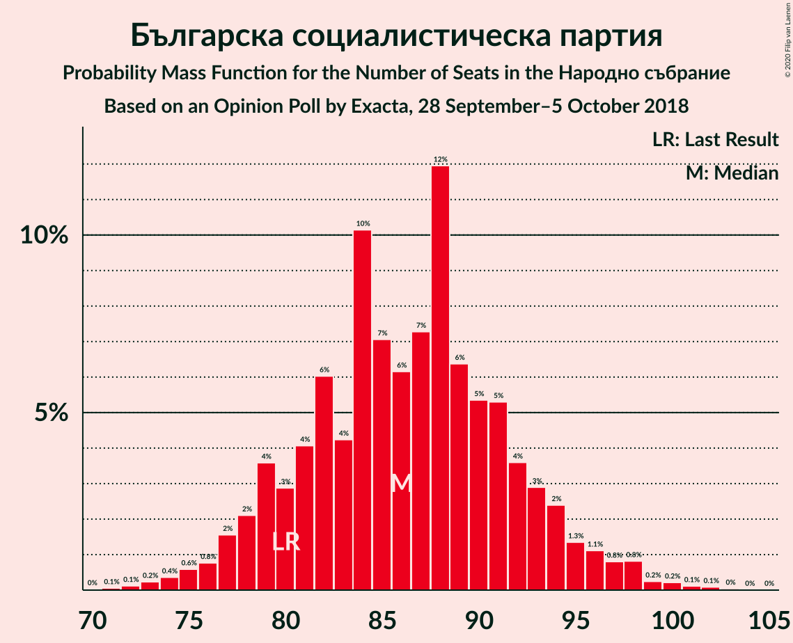
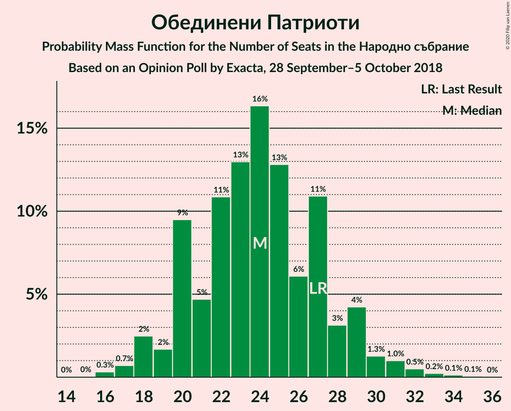
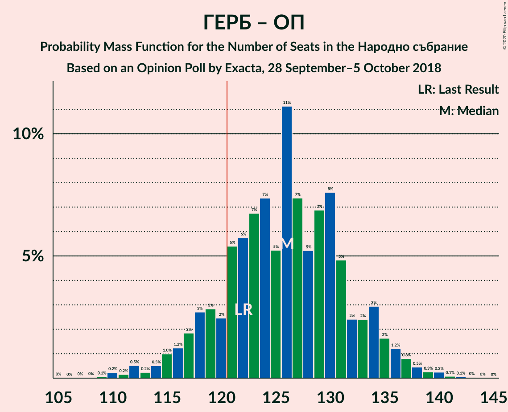

# Opinion Poll by Exacta, 28 September–5 October 2018

<a href="#voting-intentions">Voting Intentions</a> | <a href="#seats">Seats</a> | <a href="#coalitions">Coalitions</a> | <a href="#technical-information">Technical Information</a>

## Voting Intentions

### Confidence Intervals

| Party | Last Result | Poll Result | 80% Confidence Interval | 90% Confidence Interval | 95% Confidence Interval | 99% Confidence Interval |
|:-----:|:-----------:|:-----------:|:-----------------------:|:-----------------------:|:-----------------------:|:-----------------------:|
| Граждани за европейско развитие на България | 33.5% | 36.0% | 33.7–38.5% |33.0–39.2% |32.4–39.8% |31.3–41.0% |
| Българска социалистическа партия | 27.9% | 30.5% | 28.3–32.9% |27.7–33.6% |27.1–34.2% |26.1–35.3% |
| Движение за права и свободи | 9.2% | 9.3% | 8.0–10.9% |7.6–11.3% |7.3–11.7% |6.7–12.5% |
| Обединени Патриоти | 9.3% | 8.4% | 7.1–9.9% |6.8–10.3% |6.5–10.7% |5.9–11.5% |
| Демократична България | 0.0% | 3.0% | 2.3–4.1% |2.1–4.4% |2.0–4.6% |1.7–5.2% |
| Воля | 4.3% | 1.8% | 1.3–2.7% |1.2–2.9% |1.1–3.2% |0.8–3.6% |
| Алтернатива за българско възраждане | 1.6% | 1.7% | 1.2–2.5% |1.1–2.8% |0.9–3.0% |0.7–3.4% |
| Реформаторски блок | 3.1% | 1.5% | 1.1–2.3% |0.9–2.6% |0.8–2.8% |0.7–3.2% |

*Note:* The poll result column reflects the actual value used in the calculations. Published results may vary slightly, and in addition be rounded to fewer digits.

## Seats

### Confidence Intervals

| Party | Last Result | Median | 80% Confidence Interval | 90% Confidence Interval | 95% Confidence Interval | 99% Confidence Interval |
|:-----:|:-----------:|:------:|:-----------------------:|:-----------------------:|:-----------------------:|:-----------------------:|
| <a href="#граждани-за-европейско-развитие-на-българия">Граждани за европейско развитие на България</a> | 95 | 101 | 96–108 |95–110 |93–112 |89–115 |
| <a href="#българска-социалистическа-партия">Българска социалистическа партия</a> | 80 | 87 | 79–91 |77–93 |77–96 |73–98 |
| <a href="#движение-за-права-и-свободи">Движение за права и свободи</a> | 26 | 27 | 22–30 |22–32 |21–32 |19–34 |
| <a href="#обединени-патриоти">Обединени Патриоти</a> | 27 | 23 | 20–27 |19–29 |18–30 |16–32 |
| <a href="#демократична-българия">Демократична България</a> | 0 | 0 | 0–12 |0–12 |0–13 |0–14 |
| <a href="#воля">Воля</a> | 12 | 0 | 0 |0 |0 |0 |
| <a href="#алтернатива-за-българско-възраждане">Алтернатива за българско възраждане</a> | 0 | 0 | 0 |0 |0 |0 |
| <a href="#реформаторски-блок">Реформаторски блок</a> | 0 | 0 | 0 |0 |0 |0 |

### Граждани за европейско развитие на България

*For a full overview of the results for this party, see the [Граждани за европейско развитие на България](party-гражданизаевропейскоразвитиенабългария.html) page.*

| Number of Seats | Probability | Accumulated | Special Marks |
|:---------------:|:-----------:|:-----------:|:-------------:|
| 85 | 0% | 100% |  |
| 86 | 0.1% | 99.9% |  |
| 87 | 0.1% | 99.9% |  |
| 88 | 0.2% | 99.8% |  |
| 89 | 0.2% | 99.6% |  |
| 90 | 0.4% | 99.4% |  |
| 91 | 0.2% | 99.0% |  |
| 92 | 0.6% | 98.8% |  |
| 93 | 2% | 98% |  |
| 94 | 1.3% | 96% |  |
| 95 | 4% | 95% | Last Result |
| 96 | 2% | 91% |  |
| 97 | 10% | 89% |  |
| 98 | 1.2% | 79% |  |
| 99 | 15% | 78% |  |
| 100 | 4% | 63% |  |
| 101 | 13% | 59% | Median |
| 102 | 4% | 46% |  |
| 103 | 6% | 41% |  |
| 104 | 3% | 35% |  |
| 105 | 4% | 33% |  |
| 106 | 13% | 28% |  |
| 107 | 4% | 16% |  |
| 108 | 3% | 12% |  |
| 109 | 3% | 9% |  |
| 110 | 1.3% | 6% |  |
| 111 | 1.0% | 4% |  |
| 112 | 1.0% | 3% |  |
| 113 | 0.9% | 2% |  |
| 114 | 0.7% | 1.3% |  |
| 115 | 0.2% | 0.6% |  |
| 116 | 0.2% | 0.4% |  |
| 117 | 0.1% | 0.2% |  |
| 118 | 0% | 0.1% |  |
| 119 | 0% | 0.1% |  |
| 120 | 0% | 0.1% |  |
| 121 | 0% | 0% | Majority |

### Българска социалистическа партия

*For a full overview of the results for this party, see the [Българска социалистическа партия](party-българскасоциалистическапартия.html) page.*

| Number of Seats | Probability | Accumulated | Special Marks |
|:---------------:|:-----------:|:-----------:|:-------------:|
| 69 | 0.1% | 100% |  |
| 70 | 0% | 99.9% |  |
| 71 | 0.1% | 99.9% |  |
| 72 | 0.1% | 99.8% |  |
| 73 | 0.5% | 99.7% |  |
| 74 | 0.4% | 99.2% |  |
| 75 | 0.7% | 98.9% |  |
| 76 | 0.1% | 98% |  |
| 77 | 4% | 98% |  |
| 78 | 4% | 95% |  |
| 79 | 10% | 91% |  |
| 80 | 1.2% | 80% | Last Result |
| 81 | 1.4% | 79% |  |
| 82 | 8% | 78% |  |
| 83 | 5% | 70% |  |
| 84 | 3% | 65% |  |
| 85 | 1.2% | 62% |  |
| 86 | 3% | 61% |  |
| 87 | 22% | 58% | Median |
| 88 | 17% | 36% |  |
| 89 | 1.2% | 19% |  |
| 90 | 1.3% | 18% |  |
| 91 | 10% | 16% |  |
| 92 | 1.4% | 7% |  |
| 93 | 0.5% | 5% |  |
| 94 | 0.7% | 5% |  |
| 95 | 0.2% | 4% |  |
| 96 | 2% | 4% |  |
| 97 | 1.3% | 2% |  |
| 98 | 0.6% | 0.9% |  |
| 99 | 0.1% | 0.3% |  |
| 100 | 0.1% | 0.3% |  |
| 101 | 0.2% | 0.2% |  |
| 102 | 0% | 0% |  |

### Движение за права и свободи

*For a full overview of the results for this party, see the [Движение за права и свободи](party-движениезаправаисвободи.html) page.*

| Number of Seats | Probability | Accumulated | Special Marks |
|:---------------:|:-----------:|:-----------:|:-------------:|
| 16 | 0% | 100% |  |
| 17 | 0.1% | 99.9% |  |
| 18 | 0.2% | 99.9% |  |
| 19 | 0.7% | 99.7% |  |
| 20 | 1.0% | 99.0% |  |
| 21 | 3% | 98% |  |
| 22 | 5% | 95% |  |
| 23 | 5% | 90% |  |
| 24 | 6% | 84% |  |
| 25 | 7% | 78% |  |
| 26 | 7% | 71% | Last Result |
| 27 | 14% | 64% | Median |
| 28 | 27% | 49% |  |
| 29 | 12% | 23% |  |
| 30 | 2% | 11% |  |
| 31 | 4% | 9% |  |
| 32 | 3% | 5% |  |
| 33 | 0.9% | 2% |  |
| 34 | 0.8% | 1.2% |  |
| 35 | 0.1% | 0.3% |  |
| 36 | 0.1% | 0.2% |  |
| 37 | 0% | 0.1% |  |
| 38 | 0% | 0% |  |

### Обединени Патриоти

*For a full overview of the results for this party, see the [Обединени Патриоти](party-обединенипатриоти.html) page.*

| Number of Seats | Probability | Accumulated | Special Marks |
|:---------------:|:-----------:|:-----------:|:-------------:|
| 15 | 0.1% | 100% |  |
| 16 | 0.5% | 99.9% |  |
| 17 | 0.5% | 99.4% |  |
| 18 | 3% | 98.9% |  |
| 19 | 2% | 96% |  |
| 20 | 20% | 94% |  |
| 21 | 3% | 75% |  |
| 22 | 13% | 72% |  |
| 23 | 15% | 59% | Median |
| 24 | 4% | 44% |  |
| 25 | 22% | 39% |  |
| 26 | 4% | 17% |  |
| 27 | 5% | 13% | Last Result |
| 28 | 1.2% | 8% |  |
| 29 | 4% | 7% |  |
| 30 | 1.0% | 3% |  |
| 31 | 0.6% | 2% |  |
| 32 | 0.9% | 1.3% |  |
| 33 | 0.2% | 0.4% |  |
| 34 | 0.1% | 0.2% |  |
| 35 | 0% | 0.1% |  |
| 36 | 0% | 0.1% |  |
| 37 | 0% | 0% |  |

### Демократична България

*For a full overview of the results for this party, see the [Демократична България](party-демократичнабългария.html) page.*

| Number of Seats | Probability | Accumulated | Special Marks |
|:---------------:|:-----------:|:-----------:|:-------------:|
| 0 | 78% | 100% | Last Result, Median |
| 1 | 0% | 22% |  |
| 2 | 0% | 22% |  |
| 3 | 0% | 22% |  |
| 4 | 0% | 22% |  |
| 5 | 0% | 22% |  |
| 6 | 0% | 22% |  |
| 7 | 0% | 22% |  |
| 8 | 0% | 22% |  |
| 9 | 0% | 22% |  |
| 10 | 0% | 22% |  |
| 11 | 11% | 22% |  |
| 12 | 7% | 11% |  |
| 13 | 3% | 4% |  |
| 14 | 1.4% | 2% |  |
| 15 | 0.3% | 0.3% |  |
| 16 | 0.1% | 0.1% |  |
| 17 | 0% | 0% |  |

### Воля

*For a full overview of the results for this party, see the [Воля](party-воля.html) page.*

| Number of Seats | Probability | Accumulated | Special Marks |
|:---------------:|:-----------:|:-----------:|:-------------:|
| 0 | 99.8% | 100% | Median |
| 1 | 0% | 0.2% |  |
| 2 | 0% | 0.2% |  |
| 3 | 0% | 0.2% |  |
| 4 | 0% | 0.2% |  |
| 5 | 0% | 0.2% |  |
| 6 | 0% | 0.2% |  |
| 7 | 0% | 0.2% |  |
| 8 | 0% | 0.2% |  |
| 9 | 0% | 0.2% |  |
| 10 | 0% | 0.2% |  |
| 11 | 0.1% | 0.2% |  |
| 12 | 0.1% | 0.1% | Last Result |
| 13 | 0% | 0% |  |

### Алтернатива за българско възраждане

*For a full overview of the results for this party, see the [Алтернатива за българско възраждане](party-алтернативазабългарсковъзраждане.html) page.*

| Number of Seats | Probability | Accumulated | Special Marks |
|:---------------:|:-----------:|:-----------:|:-------------:|
| 0 | 99.9% | 100% | Last Result, Median |
| 1 | 0% | 0.1% |  |
| 2 | 0% | 0.1% |  |
| 3 | 0% | 0.1% |  |
| 4 | 0% | 0.1% |  |
| 5 | 0% | 0.1% |  |
| 6 | 0% | 0.1% |  |
| 7 | 0% | 0.1% |  |
| 8 | 0% | 0.1% |  |
| 9 | 0% | 0.1% |  |
| 10 | 0% | 0.1% |  |
| 11 | 0% | 0.1% |  |
| 12 | 0% | 0% |  |

### Реформаторски блок

*For a full overview of the results for this party, see the [Реформаторски блок](party-реформаторскиблок.html) page.*

| Number of Seats | Probability | Accumulated | Special Marks |
|:---------------:|:-----------:|:-----------:|:-------------:|
| 0 | 100% | 100% | Last Result, Median |

## Coalitions

### Confidence Intervals

| Coalition | Last Result | Median | Majority? | 80% Confidence Interval | 90% Confidence Interval | 95% Confidence Interval | 99% Confidence Interval |
|:---------:|:-----------:|:------:|:---------:|:-----------------------:|:-----------------------:|:-----------------------:|:-----------------------:|
| Граждани за европейско развитие на България – Обединени Патриоти | 122 | 124 | 87% | 120–133 | 118–136 | 117–137 | 113–140 |
| Българска социалистическа партия – Движение за права и свободи | 106 | 114 | 3% | 105–119 | 103–120 | 101–121 | 99–124 |

### Граждани за европейско развитие на България – Обединени Патриоти

| Number of Seats | Probability | Accumulated | Special Marks |
|:---------------:|:-----------:|:-----------:|:-------------:|
| 107 | 0% | 100% |  |
| 108 | 0% | 99.9% |  |
| 109 | 0% | 99.9% |  |
| 110 | 0.1% | 99.9% |  |
| 111 | 0% | 99.8% |  |
| 112 | 0.2% | 99.7% |  |
| 113 | 0.1% | 99.6% |  |
| 114 | 0.1% | 99.4% |  |
| 115 | 0.4% | 99.3% |  |
| 116 | 0.5% | 98.8% |  |
| 117 | 3% | 98% |  |
| 118 | 4% | 96% |  |
| 119 | 2% | 92% |  |
| 120 | 3% | 90% |  |
| 121 | 6% | 87% | Majority |
| 122 | 10% | 82% | Last Result |
| 123 | 9% | 72% |  |
| 124 | 22% | 63% | Median |
| 125 | 1.4% | 42% |  |
| 126 | 14% | 40% |  |
| 127 | 4% | 26% |  |
| 128 | 3% | 23% |  |
| 129 | 4% | 20% |  |
| 130 | 0.9% | 16% |  |
| 131 | 3% | 15% |  |
| 132 | 2% | 12% |  |
| 133 | 1.0% | 10% |  |
| 134 | 2% | 9% |  |
| 135 | 0.9% | 7% |  |
| 136 | 3% | 6% |  |
| 137 | 0.6% | 3% |  |
| 138 | 0.5% | 2% |  |
| 139 | 0.8% | 2% |  |
| 140 | 0.7% | 1.0% |  |
| 141 | 0.1% | 0.3% |  |
| 142 | 0.1% | 0.2% |  |
| 143 | 0% | 0.1% |  |
| 144 | 0% | 0% |  |

### Българска социалистическа партия – Движение за права и свободи

| Number of Seats | Probability | Accumulated | Special Marks |
|:---------------:|:-----------:|:-----------:|:-------------:|
| 94 | 0% | 100% |  |
| 95 | 0% | 99.9% |  |
| 96 | 0% | 99.9% |  |
| 97 | 0.1% | 99.9% |  |
| 98 | 0.2% | 99.8% |  |
| 99 | 0.2% | 99.6% |  |
| 100 | 0.9% | 99.3% |  |
| 101 | 1.0% | 98% |  |
| 102 | 1.0% | 97% |  |
| 103 | 2% | 96% |  |
| 104 | 4% | 95% |  |
| 105 | 2% | 90% |  |
| 106 | 4% | 88% | Last Result |
| 107 | 9% | 84% |  |
| 108 | 4% | 76% |  |
| 109 | 4% | 72% |  |
| 110 | 3% | 68% |  |
| 111 | 6% | 65% |  |
| 112 | 3% | 59% |  |
| 113 | 4% | 56% |  |
| 114 | 13% | 52% | Median |
| 115 | 1.0% | 39% |  |
| 116 | 20% | 38% |  |
| 117 | 6% | 18% |  |
| 118 | 2% | 12% |  |
| 119 | 5% | 10% |  |
| 120 | 2% | 5% |  |
| 121 | 1.1% | 3% | Majority |
| 122 | 1.3% | 2% |  |
| 123 | 0.1% | 0.7% |  |
| 124 | 0.2% | 0.6% |  |
| 125 | 0.2% | 0.5% |  |
| 126 | 0.1% | 0.3% |  |
| 127 | 0.1% | 0.2% |  |
| 128 | 0.1% | 0.1% |  |
| 129 | 0% | 0.1% |  |
| 130 | 0% | 0% |  |

## Technical Information

### Opinion Poll

+ **Polling firm:** Exacta
+ **Commissioner(s):** —
+ **Fieldwork period:** 28 September–5 October 2018

### Calculations

+ **Sample size:** 658
+ **Simulations done:** 131,072
+ **Error estimate:** 1.59%

