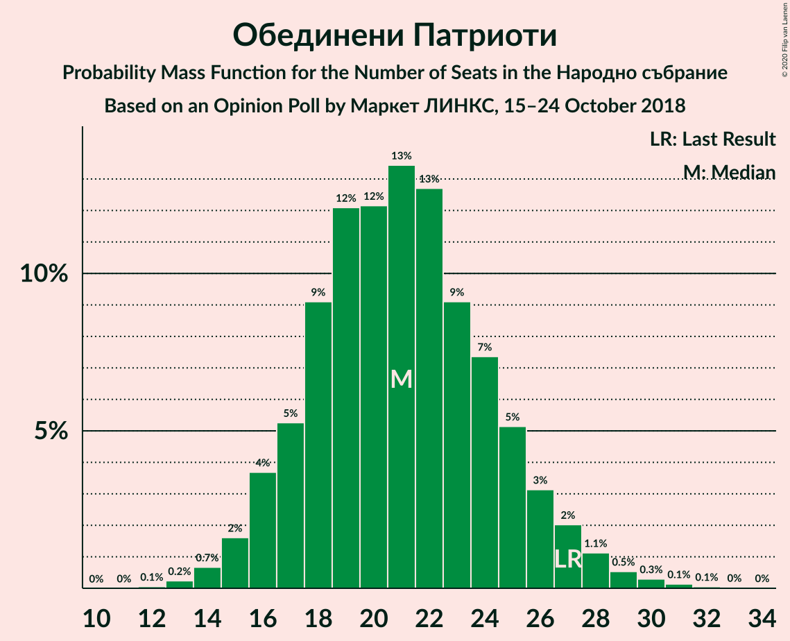
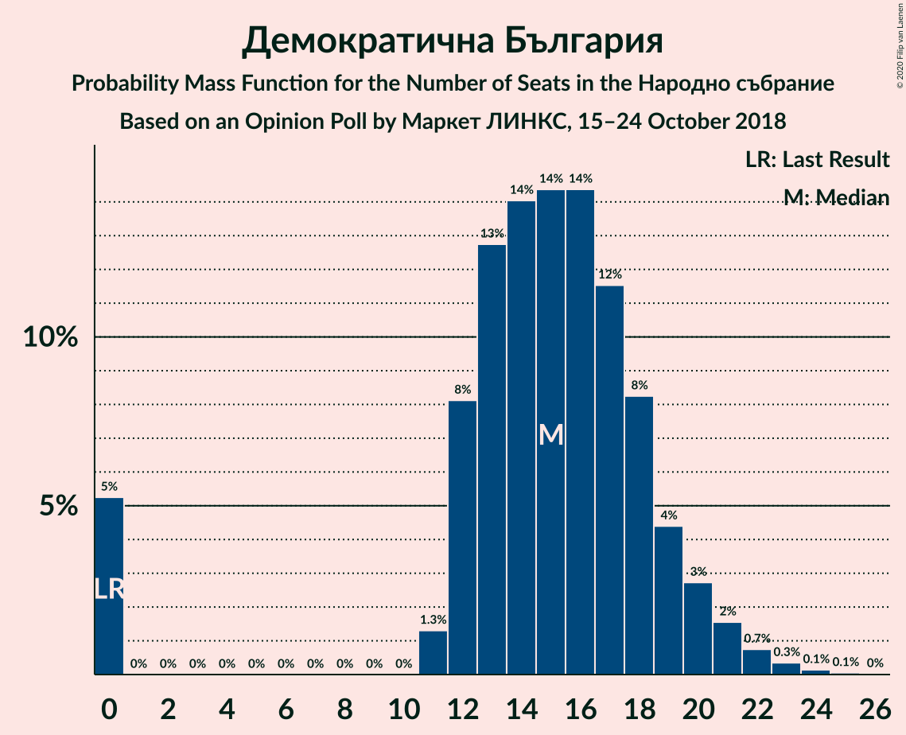
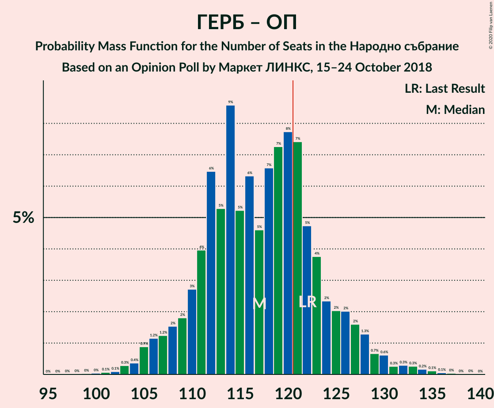

# Opinion Poll by Маркет ЛИНКС, 15–24 October 2018

<a href="#voting-intentions">Voting Intentions</a> | <a href="#seats">Seats</a> | <a href="#coalitions">Coalitions</a> | <a href="#technical-information">Technical Information</a>

## Voting Intentions

### Confidence Intervals

| Party | Last Result | Poll Result | 80% Confidence Interval | 90% Confidence Interval | 95% Confidence Interval | 99% Confidence Interval |
|:-----:|:-----------:|:-----------:|:-----------------------:|:-----------------------:|:-----------------------:|:-----------------------:|
| Граждани за европейско развитие на България | 33.5% | 34.3% | 31.9–36.9% |31.2–37.6% |30.6–38.2% |29.4–39.5% |
| Българска социалистическа партия | 27.9% | 30.5% | 28.2–33.1% |27.5–33.8% |26.9–34.4% |25.8–35.6% |
| Движение за права и свободи | 9.2% | 7.8% | 6.6–9.5% |6.2–9.9% |5.9–10.3% |5.4–11.1% |
| Обединени Патриоти | 9.3% | 7.3% | 6.1–8.9% |5.8–9.4% |5.5–9.8% |5.0–10.5% |
| Демократична България | 0.0% | 5.3% | 4.3–6.7% |4.0–7.1% |3.7–7.4% |3.3–8.1% |
| Воля | 4.3% | 1.4% | 0.9–2.2% |0.8–2.5% |0.7–2.7% |0.5–3.1% |

*Note:* The poll result column reflects the actual value used in the calculations. Published results may vary slightly, and in addition be rounded to fewer digits.

## Seats

### Confidence Intervals

| Party | Last Result | Median | 80% Confidence Interval | 90% Confidence Interval | 95% Confidence Interval | 99% Confidence Interval |
|:-----:|:-----------:|:------:|:-----------------------:|:-----------------------:|:-----------------------:|:-----------------------:|
| <a href="#граждани-за-европейско-развитие-на-българия">Граждани за европейско развитие на България</a> | 95 | 95 | 90–103 |88–105 |86–108 |83–111 |
| <a href="#българска-социалистическа-партия">Българска социалистическа партия</a> | 80 | 86 | 80–93 |78–95 |76–96 |73–100 |
| <a href="#движение-за-права-и-свободи">Движение за права и свободи</a> | 26 | 22 | 19–26 |17–28 |17–29 |15–31 |
| <a href="#обединени-патриоти">Обединени Патриоти</a> | 27 | 21 | 17–25 |16–26 |16–27 |14–29 |
| <a href="#демократична-българия">Демократична България</a> | 0 | 15 | 12–18 |11–20 |0–20 |0–23 |
| <a href="#воля">Воля</a> | 12 | 0 | 0 |0 |0 |0 |

### Граждани за европейско развитие на България

*For a full overview of the results for this party, see the [Граждани за европейско развитие на България](party-гражданизаевропейскоразвитиенабългария.html) page.*

| Number of Seats | Probability | Accumulated | Special Marks |
|:---------------:|:-----------:|:-----------:|:-------------:|
| 79 | 0% | 100% |  |
| 80 | 0.1% | 99.9% |  |
| 81 | 0.1% | 99.9% |  |
| 82 | 0.2% | 99.8% |  |
| 83 | 0.2% | 99.6% |  |
| 84 | 0.3% | 99.4% |  |
| 85 | 1.0% | 99.0% |  |
| 86 | 1.2% | 98% |  |
| 87 | 2% | 97% |  |
| 88 | 2% | 95% |  |
| 89 | 3% | 94% |  |
| 90 | 2% | 91% |  |
| 91 | 6% | 88% |  |
| 92 | 11% | 82% |  |
| 93 | 8% | 71% |  |
| 94 | 9% | 64% |  |
| 95 | 5% | 55% | Last Result, Median |
| 96 | 6% | 50% |  |
| 97 | 7% | 44% |  |
| 98 | 9% | 37% |  |
| 99 | 5% | 28% |  |
| 100 | 3% | 23% |  |
| 101 | 2% | 20% |  |
| 102 | 4% | 17% |  |
| 103 | 4% | 13% |  |
| 104 | 3% | 10% |  |
| 105 | 2% | 7% |  |
| 106 | 0.9% | 4% |  |
| 107 | 0.8% | 3% |  |
| 108 | 0.7% | 3% |  |
| 109 | 0.8% | 2% |  |
| 110 | 0.5% | 1.1% |  |
| 111 | 0.2% | 0.5% |  |
| 112 | 0.1% | 0.3% |  |
| 113 | 0.1% | 0.2% |  |
| 114 | 0.1% | 0.2% |  |
| 115 | 0.1% | 0.1% |  |
| 116 | 0% | 0.1% |  |
| 117 | 0% | 0% |  |

### Българска социалистическа партия

*For a full overview of the results for this party, see the [Българска социалистическа партия](party-българскасоциалистическапартия.html) page.*

| Number of Seats | Probability | Accumulated | Special Marks |
|:---------------:|:-----------:|:-----------:|:-------------:|
| 69 | 0% | 100% |  |
| 70 | 0.1% | 99.9% |  |
| 71 | 0.1% | 99.8% |  |
| 72 | 0.1% | 99.8% |  |
| 73 | 0.2% | 99.7% |  |
| 74 | 0.9% | 99.5% |  |
| 75 | 0.9% | 98.5% |  |
| 76 | 1.4% | 98% |  |
| 77 | 0.6% | 96% |  |
| 78 | 2% | 96% |  |
| 79 | 4% | 94% |  |
| 80 | 8% | 90% | Last Result |
| 81 | 3% | 82% |  |
| 82 | 2% | 79% |  |
| 83 | 3% | 77% |  |
| 84 | 11% | 74% |  |
| 85 | 11% | 63% |  |
| 86 | 8% | 52% | Median |
| 87 | 3% | 44% |  |
| 88 | 4% | 42% |  |
| 89 | 9% | 38% |  |
| 90 | 9% | 28% |  |
| 91 | 6% | 19% |  |
| 92 | 2% | 13% |  |
| 93 | 2% | 12% |  |
| 94 | 4% | 9% |  |
| 95 | 3% | 5% |  |
| 96 | 1.1% | 3% |  |
| 97 | 0.3% | 2% |  |
| 98 | 0.5% | 1.5% |  |
| 99 | 0.3% | 1.0% |  |
| 100 | 0.3% | 0.6% |  |
| 101 | 0.1% | 0.3% |  |
| 102 | 0% | 0.2% |  |
| 103 | 0% | 0.2% |  |
| 104 | 0.1% | 0.1% |  |
| 105 | 0% | 0.1% |  |
| 106 | 0% | 0% |  |

### Движение за права и свободи

*For a full overview of the results for this party, see the [Движение за права и свободи](party-движениезаправаисвободи.html) page.*

| Number of Seats | Probability | Accumulated | Special Marks |
|:---------------:|:-----------:|:-----------:|:-------------:|
| 13 | 0% | 100% |  |
| 14 | 0.2% | 99.9% |  |
| 15 | 0.5% | 99.7% |  |
| 16 | 1.3% | 99.2% |  |
| 17 | 3% | 98% |  |
| 18 | 4% | 95% |  |
| 19 | 8% | 90% |  |
| 20 | 11% | 82% |  |
| 21 | 13% | 72% |  |
| 22 | 11% | 59% | Median |
| 23 | 12% | 48% |  |
| 24 | 13% | 35% |  |
| 25 | 8% | 22% |  |
| 26 | 5% | 14% | Last Result |
| 27 | 4% | 9% |  |
| 28 | 2% | 5% |  |
| 29 | 1.4% | 3% |  |
| 30 | 0.8% | 2% |  |
| 31 | 0.4% | 0.8% |  |
| 32 | 0.2% | 0.3% |  |
| 33 | 0.1% | 0.2% |  |
| 34 | 0% | 0.1% |  |
| 35 | 0% | 0% |  |

### Обединени Патриоти

*For a full overview of the results for this party, see the [Обединени Патриоти](party-обединенипатриоти.html) page.*

| Number of Seats | Probability | Accumulated | Special Marks |
|:---------------:|:-----------:|:-----------:|:-------------:|
| 12 | 0.1% | 100% |  |
| 13 | 0.3% | 99.9% |  |
| 14 | 0.5% | 99.6% |  |
| 15 | 1.5% | 99.1% |  |
| 16 | 3% | 98% |  |
| 17 | 4% | 94% |  |
| 18 | 9% | 90% |  |
| 19 | 13% | 81% |  |
| 20 | 14% | 68% |  |
| 21 | 12% | 55% | Median |
| 22 | 18% | 42% |  |
| 23 | 7% | 25% |  |
| 24 | 7% | 18% |  |
| 25 | 5% | 11% |  |
| 26 | 2% | 6% |  |
| 27 | 3% | 5% | Last Result |
| 28 | 1.1% | 2% |  |
| 29 | 0.4% | 0.8% |  |
| 30 | 0.3% | 0.5% |  |
| 31 | 0.1% | 0.2% |  |
| 32 | 0% | 0.1% |  |
| 33 | 0% | 0% |  |

### Демократична България

*For a full overview of the results for this party, see the [Демократична България](party-демократичнабългария.html) page.*

| Number of Seats | Probability | Accumulated | Special Marks |
|:---------------:|:-----------:|:-----------:|:-------------:|
| 0 | 5% | 100% | Last Result |
| 1 | 0% | 95% |  |
| 2 | 0% | 95% |  |
| 3 | 0% | 95% |  |
| 4 | 0% | 95% |  |
| 5 | 0% | 95% |  |
| 6 | 0% | 95% |  |
| 7 | 0% | 95% |  |
| 8 | 0% | 95% |  |
| 9 | 0% | 95% |  |
| 10 | 0% | 95% |  |
| 11 | 2% | 95% |  |
| 12 | 10% | 93% |  |
| 13 | 12% | 84% |  |
| 14 | 14% | 72% |  |
| 15 | 14% | 58% | Median |
| 16 | 16% | 43% |  |
| 17 | 12% | 27% |  |
| 18 | 6% | 15% |  |
| 19 | 4% | 9% |  |
| 20 | 3% | 5% |  |
| 21 | 1.1% | 2% |  |
| 22 | 0.6% | 1.1% |  |
| 23 | 0.3% | 0.5% |  |
| 24 | 0.2% | 0.3% |  |
| 25 | 0% | 0.1% |  |
| 26 | 0% | 0% |  |

### Воля

*For a full overview of the results for this party, see the [Воля](party-воля.html) page.*

| Number of Seats | Probability | Accumulated | Special Marks |
|:---------------:|:-----------:|:-----------:|:-------------:|
| 0 | 100% | 100% | Median |
| 1 | 0% | 0% |  |
| 2 | 0% | 0% |  |
| 3 | 0% | 0% |  |
| 4 | 0% | 0% |  |
| 5 | 0% | 0% |  |
| 6 | 0% | 0% |  |
| 7 | 0% | 0% |  |
| 8 | 0% | 0% |  |
| 9 | 0% | 0% |  |
| 10 | 0% | 0% |  |
| 11 | 0% | 0% |  |
| 12 | 0% | 0% | Last Result |

## Coalitions

### Confidence Intervals

| Coalition | Last Result | Median | Majority? | 80% Confidence Interval | 90% Confidence Interval | 95% Confidence Interval | 99% Confidence Interval |
|:---------:|:-----------:|:------:|:---------:|:-----------------------:|:-----------------------:|:-----------------------:|:-----------------------:|
| Граждани за европейско развитие на България – Обединени Патриоти | 122 | 116 | 26% | 111–125 | 109–127 | 107–129 | 104–134 |
| Българска социалистическа партия – Движение за права и свободи | 106 | 109 | 1.0% | 101–115 | 99–117 | 98–119 | 95–124 |

### Граждани за европейско развитие на България – Обединени Патриоти

| Number of Seats | Probability | Accumulated | Special Marks |
|:---------------:|:-----------:|:-----------:|:-------------:|
| 98 | 0% | 100% |  |
| 99 | 0% | 99.9% |  |
| 100 | 0% | 99.9% |  |
| 101 | 0.1% | 99.9% |  |
| 102 | 0.1% | 99.8% |  |
| 103 | 0.2% | 99.7% |  |
| 104 | 0.2% | 99.5% |  |
| 105 | 1.2% | 99.3% |  |
| 106 | 0.4% | 98% |  |
| 107 | 0.9% | 98% |  |
| 108 | 1.0% | 97% |  |
| 109 | 3% | 96% |  |
| 110 | 1.3% | 93% |  |
| 111 | 6% | 92% |  |
| 112 | 7% | 85% |  |
| 113 | 4% | 78% |  |
| 114 | 17% | 74% |  |
| 115 | 3% | 57% |  |
| 116 | 9% | 54% | Median |
| 117 | 2% | 45% |  |
| 118 | 5% | 43% |  |
| 119 | 2% | 37% |  |
| 120 | 9% | 35% |  |
| 121 | 6% | 26% | Majority |
| 122 | 5% | 20% | Last Result |
| 123 | 2% | 15% |  |
| 124 | 2% | 13% |  |
| 125 | 3% | 11% |  |
| 126 | 2% | 8% |  |
| 127 | 2% | 6% |  |
| 128 | 0.8% | 3% |  |
| 129 | 0.6% | 3% |  |
| 130 | 0.2% | 2% |  |
| 131 | 0.3% | 2% |  |
| 132 | 0.2% | 1.5% |  |
| 133 | 0.6% | 1.3% |  |
| 134 | 0.2% | 0.6% |  |
| 135 | 0.3% | 0.4% |  |
| 136 | 0.1% | 0.1% |  |
| 137 | 0% | 0.1% |  |
| 138 | 0% | 0% |  |

### Българска социалистическа партия – Движение за права и свободи

| Number of Seats | Probability | Accumulated | Special Marks |
|:---------------:|:-----------:|:-----------:|:-------------:|
| 91 | 0% | 100% |  |
| 92 | 0.1% | 99.9% |  |
| 93 | 0.1% | 99.9% |  |
| 94 | 0.2% | 99.8% |  |
| 95 | 0.4% | 99.6% |  |
| 96 | 0.4% | 99.1% |  |
| 97 | 1.0% | 98.8% |  |
| 98 | 2% | 98% |  |
| 99 | 2% | 96% |  |
| 100 | 2% | 94% |  |
| 101 | 2% | 91% |  |
| 102 | 3% | 89% |  |
| 103 | 6% | 86% |  |
| 104 | 3% | 80% |  |
| 105 | 5% | 77% |  |
| 106 | 9% | 72% | Last Result |
| 107 | 4% | 63% |  |
| 108 | 5% | 59% | Median |
| 109 | 8% | 54% |  |
| 110 | 10% | 46% |  |
| 111 | 5% | 36% |  |
| 112 | 8% | 31% |  |
| 113 | 2% | 23% |  |
| 114 | 8% | 20% |  |
| 115 | 3% | 12% |  |
| 116 | 3% | 10% |  |
| 117 | 2% | 6% |  |
| 118 | 2% | 5% |  |
| 119 | 0.8% | 3% |  |
| 120 | 0.9% | 2% |  |
| 121 | 0.2% | 1.0% | Majority |
| 122 | 0.2% | 0.8% |  |
| 123 | 0.1% | 0.6% |  |
| 124 | 0.1% | 0.5% |  |
| 125 | 0.1% | 0.4% |  |
| 126 | 0.1% | 0.3% |  |
| 127 | 0.2% | 0.3% |  |
| 128 | 0% | 0.1% |  |
| 129 | 0% | 0.1% |  |
| 130 | 0% | 0% |  |

## Technical Information

### Opinion Poll

+ **Polling firm:** Маркет ЛИНКС
+ **Commissioner(s):** —
+ **Fieldwork period:** 15–24 October 2018

### Calculations

+ **Sample size:** 586
+ **Simulations done:** 131,072
+ **Error estimate:** 2.80%

