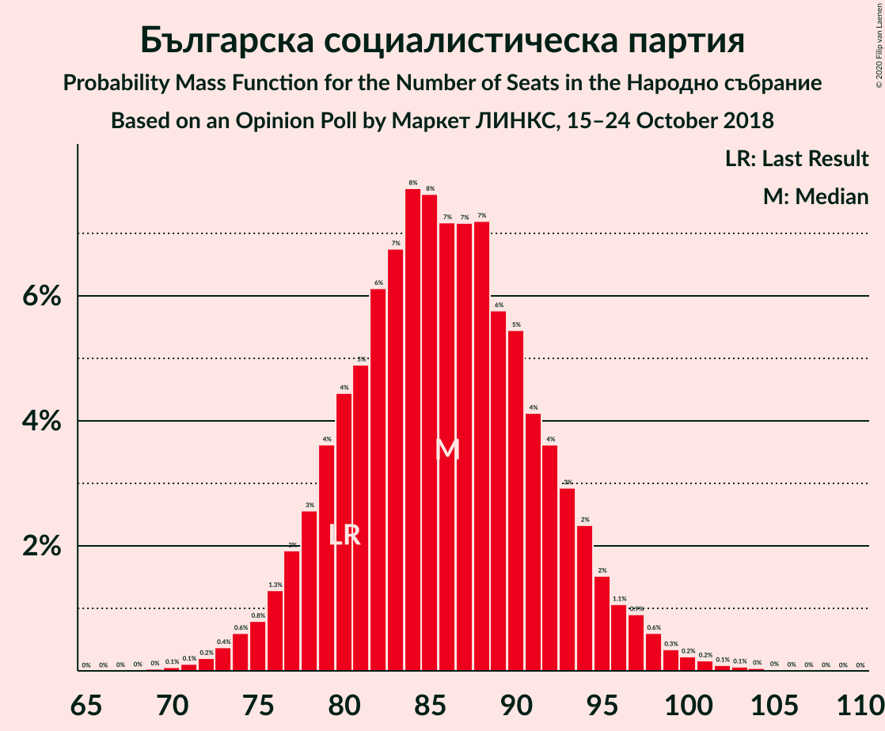

# Opinion Poll by Маркет ЛИНКС, 15–24 October 2018

<a href="#voting-intentions">Voting Intentions</a> | <a href="#seats">Seats</a> | <a href="#coalitions">Coalitions</a> | <a href="#technical-information">Technical Information</a>

## Voting Intentions

### Confidence Intervals

| Party | Last Result | Poll Result | 80% Confidence Interval | 90% Confidence Interval | 95% Confidence Interval | 99% Confidence Interval |
|:-----:|:-----------:|:-----------:|:-----------------------:|:-----------------------:|:-----------------------:|:-----------------------:|
| Граждани за европейско развитие на България | 33.5% | 34.3% | 31.9–36.9% |31.2–37.6% |30.6–38.2% |29.4–39.5% |
| Българска социалистическа партия | 27.9% | 30.5% | 28.2–33.1% |27.5–33.8% |26.9–34.4% |25.8–35.6% |
| Движение за права и свободи | 9.2% | 7.8% | 6.6–9.5% |6.2–9.9% |5.9–10.3% |5.4–11.1% |
| Обединени Патриоти | 9.3% | 7.3% | 6.1–8.9% |5.8–9.4% |5.5–9.8% |5.0–10.5% |
| Демократична България | 0.0% | 5.3% | 4.3–6.7% |4.0–7.1% |3.7–7.4% |3.3–8.1% |
| Воля | 4.3% | 1.4% | 0.9–2.2% |0.8–2.5% |0.7–2.7% |0.5–3.1% |

*Note:* The poll result column reflects the actual value used in the calculations. Published results may vary slightly, and in addition be rounded to fewer digits.

## Seats

### Confidence Intervals

| Party | Last Result | Median | 80% Confidence Interval | 90% Confidence Interval | 95% Confidence Interval | 99% Confidence Interval |
|:-----:|:-----------:|:------:|:-----------------------:|:-----------------------:|:-----------------------:|:-----------------------:|
| <a href="#граждани-за-европейско-развитие-на-българия">Граждани за европейско развитие на България</a> | 95 | 96 | 89–103 |87–105 |86–107 |83–111 |
| <a href="#българска-социалистическа-партия">Българска социалистическа партия</a> | 80 | 86 | 79–93 |77–95 |76–96 |73–100 |
| <a href="#движение-за-права-и-свободи">Движение за права и свободи</a> | 26 | 22 | 18–26 |17–28 |17–29 |15–31 |
| <a href="#обединени-патриоти">Обединени Патриоти</a> | 27 | 21 | 17–25 |16–26 |15–27 |14–30 |
| <a href="#демократична-българия">Демократична България</a> | 0 | 15 | 12–19 |0–20 |0–21 |0–23 |
| <a href="#воля">Воля</a> | 12 | 0 | 0 |0 |0 |0 |

### Граждани за европейско развитие на България

*For a full overview of the results for this party, see the [Граждани за европейско развитие на България](party-гражданизаевропейскоразвитиенабългария.html) page.*

| Number of Seats | Probability | Accumulated | Special Marks |
|:---------------:|:-----------:|:-----------:|:-------------:|
| 79 | 0% | 100% |  |
| 80 | 0.1% | 99.9% |  |
| 81 | 0.1% | 99.9% |  |
| 82 | 0.2% | 99.8% |  |
| 83 | 0.3% | 99.6% |  |
| 84 | 0.5% | 99.2% |  |
| 85 | 0.8% | 98.7% |  |
| 86 | 1.3% | 98% |  |
| 87 | 2% | 97% |  |
| 88 | 2% | 95% |  |
| 89 | 3% | 93% |  |
| 90 | 4% | 90% |  |
| 91 | 5% | 86% |  |
| 92 | 6% | 81% |  |
| 93 | 6% | 75% |  |
| 94 | 7% | 69% |  |
| 95 | 7% | 62% | Last Result |
| 96 | 8% | 55% | Median |
| 97 | 7% | 47% |  |
| 98 | 7% | 40% |  |
| 99 | 7% | 33% |  |
| 100 | 5% | 26% |  |
| 101 | 4% | 21% |  |
| 102 | 4% | 17% |  |
| 103 | 3% | 13% |  |
| 104 | 3% | 9% |  |
| 105 | 2% | 7% |  |
| 106 | 1.3% | 5% |  |
| 107 | 1.1% | 3% |  |
| 108 | 0.8% | 2% |  |
| 109 | 0.5% | 1.5% |  |
| 110 | 0.4% | 1.0% |  |
| 111 | 0.2% | 0.6% |  |
| 112 | 0.1% | 0.4% |  |
| 113 | 0.1% | 0.2% |  |
| 114 | 0.1% | 0.2% |  |
| 115 | 0% | 0.1% |  |
| 116 | 0% | 0.1% |  |
| 117 | 0% | 0% |  |

### Българска социалистическа партия

*For a full overview of the results for this party, see the [Българска социалистическа партия](party-българскасоциалистическапартия.html) page.*

| Number of Seats | Probability | Accumulated | Special Marks |
|:---------------:|:-----------:|:-----------:|:-------------:|
| 69 | 0% | 100% |  |
| 70 | 0.1% | 99.9% |  |
| 71 | 0.1% | 99.9% |  |
| 72 | 0.2% | 99.8% |  |
| 73 | 0.4% | 99.6% |  |
| 74 | 0.6% | 99.2% |  |
| 75 | 0.8% | 98.6% |  |
| 76 | 1.3% | 98% |  |
| 77 | 2% | 97% |  |
| 78 | 3% | 95% |  |
| 79 | 4% | 92% |  |
| 80 | 4% | 88% | Last Result |
| 81 | 5% | 84% |  |
| 82 | 6% | 79% |  |
| 83 | 7% | 73% |  |
| 84 | 8% | 66% |  |
| 85 | 8% | 58% |  |
| 86 | 7% | 51% | Median |
| 87 | 7% | 44% |  |
| 88 | 7% | 36% |  |
| 89 | 6% | 29% |  |
| 90 | 5% | 24% |  |
| 91 | 4% | 18% |  |
| 92 | 4% | 14% |  |
| 93 | 3% | 10% |  |
| 94 | 2% | 7% |  |
| 95 | 2% | 5% |  |
| 96 | 1.1% | 4% |  |
| 97 | 0.9% | 2% |  |
| 98 | 0.6% | 2% |  |
| 99 | 0.3% | 1.0% |  |
| 100 | 0.2% | 0.6% |  |
| 101 | 0.2% | 0.4% |  |
| 102 | 0.1% | 0.3% |  |
| 103 | 0.1% | 0.2% |  |
| 104 | 0% | 0.1% |  |
| 105 | 0% | 0.1% |  |
| 106 | 0% | 0% |  |

### Движение за права и свободи

*For a full overview of the results for this party, see the [Движение за права и свободи](party-движениезаправаисвободи.html) page.*

| Number of Seats | Probability | Accumulated | Special Marks |
|:---------------:|:-----------:|:-----------:|:-------------:|
| 13 | 0% | 100% |  |
| 14 | 0.2% | 99.9% |  |
| 15 | 0.5% | 99.8% |  |
| 16 | 1.3% | 99.2% |  |
| 17 | 3% | 98% |  |
| 18 | 5% | 95% |  |
| 19 | 8% | 90% |  |
| 20 | 10% | 82% |  |
| 21 | 12% | 71% |  |
| 22 | 12% | 60% | Median |
| 23 | 12% | 47% |  |
| 24 | 11% | 35% |  |
| 25 | 9% | 24% |  |
| 26 | 6% | 15% | Last Result |
| 27 | 4% | 10% |  |
| 28 | 2% | 6% |  |
| 29 | 2% | 3% |  |
| 30 | 0.9% | 2% |  |
| 31 | 0.4% | 0.8% |  |
| 32 | 0.2% | 0.4% |  |
| 33 | 0.1% | 0.2% |  |
| 34 | 0% | 0.1% |  |
| 35 | 0% | 0% |  |

### Обединени Патриоти

*For a full overview of the results for this party, see the [Обединени Патриоти](party-обединенипатриоти.html) page.*

| Number of Seats | Probability | Accumulated | Special Marks |
|:---------------:|:-----------:|:-----------:|:-------------:|
| 12 | 0.1% | 100% |  |
| 13 | 0.2% | 99.9% |  |
| 14 | 0.7% | 99.7% |  |
| 15 | 2% | 99.0% |  |
| 16 | 4% | 97% |  |
| 17 | 5% | 94% |  |
| 18 | 9% | 88% |  |
| 19 | 12% | 79% |  |
| 20 | 12% | 67% |  |
| 21 | 13% | 55% | Median |
| 22 | 13% | 42% |  |
| 23 | 9% | 29% |  |
| 24 | 7% | 20% |  |
| 25 | 5% | 12% |  |
| 26 | 3% | 7% |  |
| 27 | 2% | 4% | Last Result |
| 28 | 1.1% | 2% |  |
| 29 | 0.5% | 1.1% |  |
| 30 | 0.3% | 0.5% |  |
| 31 | 0.1% | 0.2% |  |
| 32 | 0.1% | 0.1% |  |
| 33 | 0% | 0% |  |

### Демократична България

*For a full overview of the results for this party, see the [Демократична България](party-демократичнабългария.html) page.*

| Number of Seats | Probability | Accumulated | Special Marks |
|:---------------:|:-----------:|:-----------:|:-------------:|
| 0 | 5% | 100% | Last Result |
| 1 | 0% | 95% |  |
| 2 | 0% | 95% |  |
| 3 | 0% | 95% |  |
| 4 | 0% | 95% |  |
| 5 | 0% | 95% |  |
| 6 | 0% | 95% |  |
| 7 | 0% | 95% |  |
| 8 | 0% | 95% |  |
| 9 | 0% | 95% |  |
| 10 | 0% | 95% |  |
| 11 | 1.3% | 95% |  |
| 12 | 8% | 93% |  |
| 13 | 13% | 85% |  |
| 14 | 14% | 73% |  |
| 15 | 14% | 59% | Median |
| 16 | 14% | 44% |  |
| 17 | 12% | 30% |  |
| 18 | 8% | 18% |  |
| 19 | 4% | 10% |  |
| 20 | 3% | 6% |  |
| 21 | 2% | 3% |  |
| 22 | 0.7% | 1.3% |  |
| 23 | 0.3% | 0.6% |  |
| 24 | 0.1% | 0.2% |  |
| 25 | 0.1% | 0.1% |  |
| 26 | 0% | 0% |  |

### Воля

*For a full overview of the results for this party, see the [Воля](party-воля.html) page.*

| Number of Seats | Probability | Accumulated | Special Marks |
|:---------------:|:-----------:|:-----------:|:-------------:|
| 0 | 100% | 100% | Median |
| 1 | 0% | 0% |  |
| 2 | 0% | 0% |  |
| 3 | 0% | 0% |  |
| 4 | 0% | 0% |  |
| 5 | 0% | 0% |  |
| 6 | 0% | 0% |  |
| 7 | 0% | 0% |  |
| 8 | 0% | 0% |  |
| 9 | 0% | 0% |  |
| 10 | 0% | 0% |  |
| 11 | 0% | 0% |  |
| 12 | 0% | 0% | Last Result |

## Coalitions

### Confidence Intervals

| Coalition | Last Result | Median | Majority? | 80% Confidence Interval | 90% Confidence Interval | 95% Confidence Interval | 99% Confidence Interval |
|:---------:|:-----------:|:------:|:---------:|:-----------------------:|:-----------------------:|:-----------------------:|:-----------------------:|
| Граждани за европейско развитие на България – Обединени Патриоти | 122 | 117 | 28% | 110–124 | 108–127 | 106–129 | 103–133 |
| Българска социалистическа партия – Движение за права и свободи | 106 | 108 | 2% | 101–115 | 99–118 | 98–120 | 94–123 |

### Граждани за европейско развитие на България – Обединени Патриоти

| Number of Seats | Probability | Accumulated | Special Marks |
|:---------------:|:-----------:|:-----------:|:-------------:|
| 99 | 0% | 100% |  |
| 100 | 0% | 99.9% |  |
| 101 | 0.1% | 99.9% |  |
| 102 | 0.1% | 99.8% |  |
| 103 | 0.3% | 99.7% |  |
| 104 | 0.4% | 99.5% |  |
| 105 | 0.9% | 99.1% |  |
| 106 | 1.2% | 98% |  |
| 107 | 1.2% | 97% |  |
| 108 | 2% | 96% |  |
| 109 | 2% | 94% |  |
| 110 | 3% | 92% |  |
| 111 | 4% | 90% |  |
| 112 | 6% | 86% |  |
| 113 | 5% | 79% |  |
| 114 | 9% | 74% |  |
| 115 | 5% | 65% |  |
| 116 | 6% | 60% |  |
| 117 | 5% | 54% | Median |
| 118 | 7% | 49% |  |
| 119 | 7% | 43% |  |
| 120 | 8% | 35% |  |
| 121 | 7% | 28% | Majority |
| 122 | 5% | 20% | Last Result |
| 123 | 4% | 16% |  |
| 124 | 2% | 12% |  |
| 125 | 2% | 9% |  |
| 126 | 2% | 7% |  |
| 127 | 2% | 5% |  |
| 128 | 1.3% | 4% |  |
| 129 | 0.7% | 3% |  |
| 130 | 0.6% | 2% |  |
| 131 | 0.3% | 1.2% |  |
| 132 | 0.3% | 1.0% |  |
| 133 | 0.3% | 0.7% |  |
| 134 | 0.2% | 0.4% |  |
| 135 | 0.1% | 0.3% |  |
| 136 | 0.1% | 0.1% |  |
| 137 | 0% | 0.1% |  |
| 138 | 0% | 0% |  |

### Българска социалистическа партия – Движение за права и свободи

| Number of Seats | Probability | Accumulated | Special Marks |
|:---------------:|:-----------:|:-----------:|:-------------:|
| 91 | 0% | 100% |  |
| 92 | 0.1% | 99.9% |  |
| 93 | 0.1% | 99.8% |  |
| 94 | 0.2% | 99.7% |  |
| 95 | 0.4% | 99.5% |  |
| 96 | 0.7% | 99.1% |  |
| 97 | 0.9% | 98% |  |
| 98 | 1.4% | 98% |  |
| 99 | 2% | 96% |  |
| 100 | 2% | 95% |  |
| 101 | 3% | 92% |  |
| 102 | 4% | 89% |  |
| 103 | 5% | 85% |  |
| 104 | 6% | 80% |  |
| 105 | 6% | 74% |  |
| 106 | 8% | 68% | Last Result |
| 107 | 6% | 60% |  |
| 108 | 7% | 53% | Median |
| 109 | 6% | 46% |  |
| 110 | 7% | 40% |  |
| 111 | 6% | 33% |  |
| 112 | 6% | 27% |  |
| 113 | 5% | 21% |  |
| 114 | 4% | 17% |  |
| 115 | 3% | 12% |  |
| 116 | 3% | 9% |  |
| 117 | 2% | 7% |  |
| 118 | 1.4% | 5% |  |
| 119 | 1.1% | 4% |  |
| 120 | 1.0% | 3% |  |
| 121 | 0.5% | 2% | Majority |
| 122 | 0.4% | 1.0% |  |
| 123 | 0.2% | 0.7% |  |
| 124 | 0.1% | 0.5% |  |
| 125 | 0.1% | 0.3% |  |
| 126 | 0.1% | 0.2% |  |
| 127 | 0.1% | 0.2% |  |
| 128 | 0% | 0.1% |  |
| 129 | 0% | 0.1% |  |
| 130 | 0% | 0% |  |

## Technical Information

### Opinion Poll

+ **Polling firm:** Маркет ЛИНКС
+ **Commissioner(s):** —
+ **Fieldwork period:** 15–24 October 2018

### Calculations

+ **Sample size:** 586
+ **Simulations done:** 1,048,576
+ **Error estimate:** 1.19%

