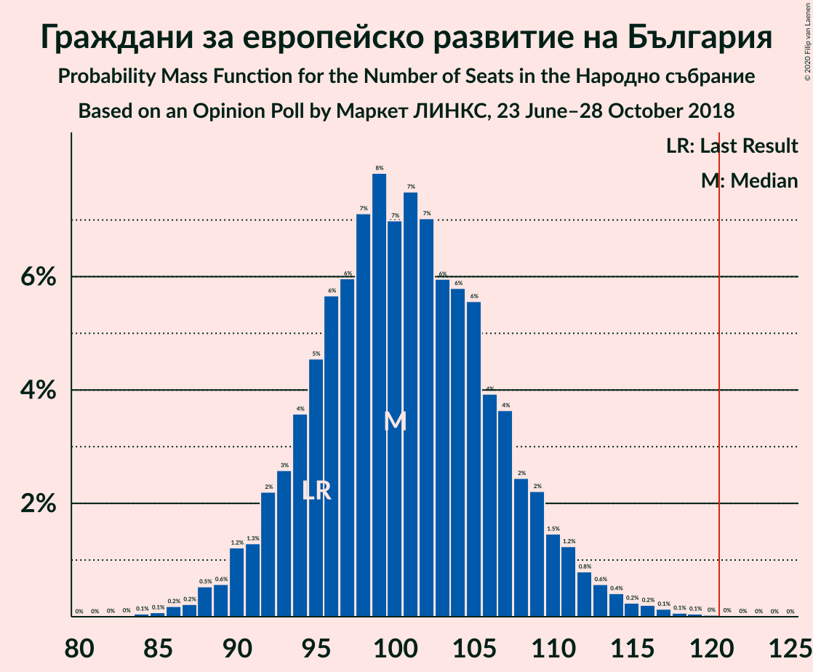
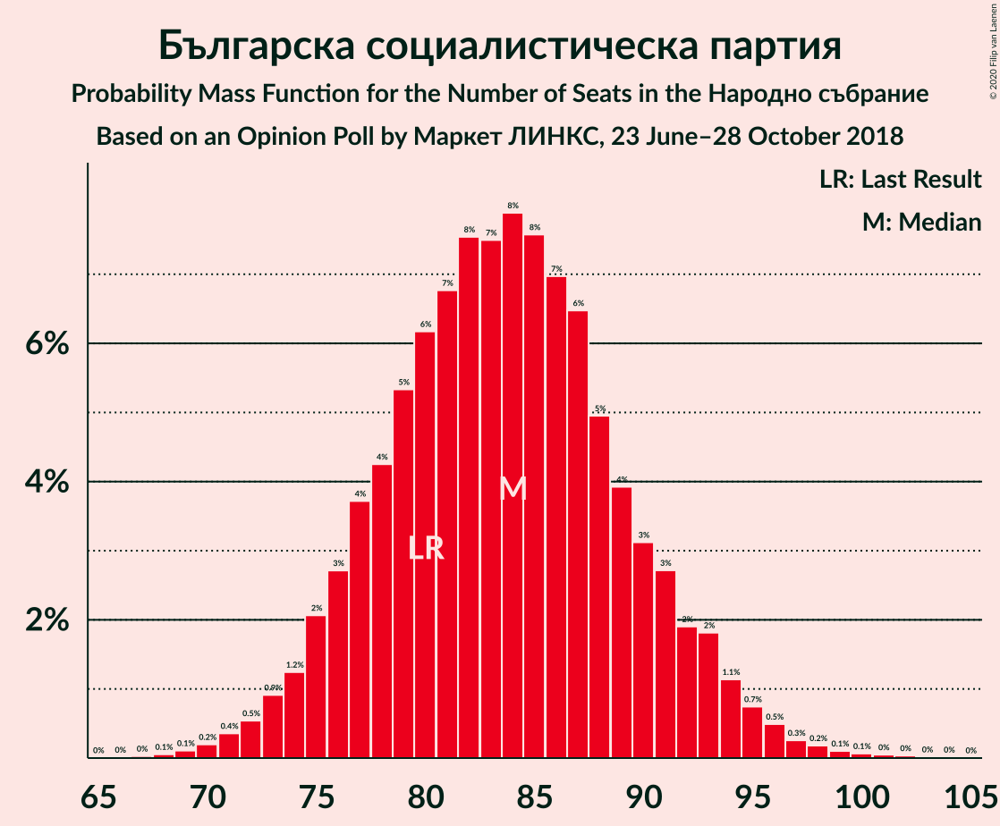
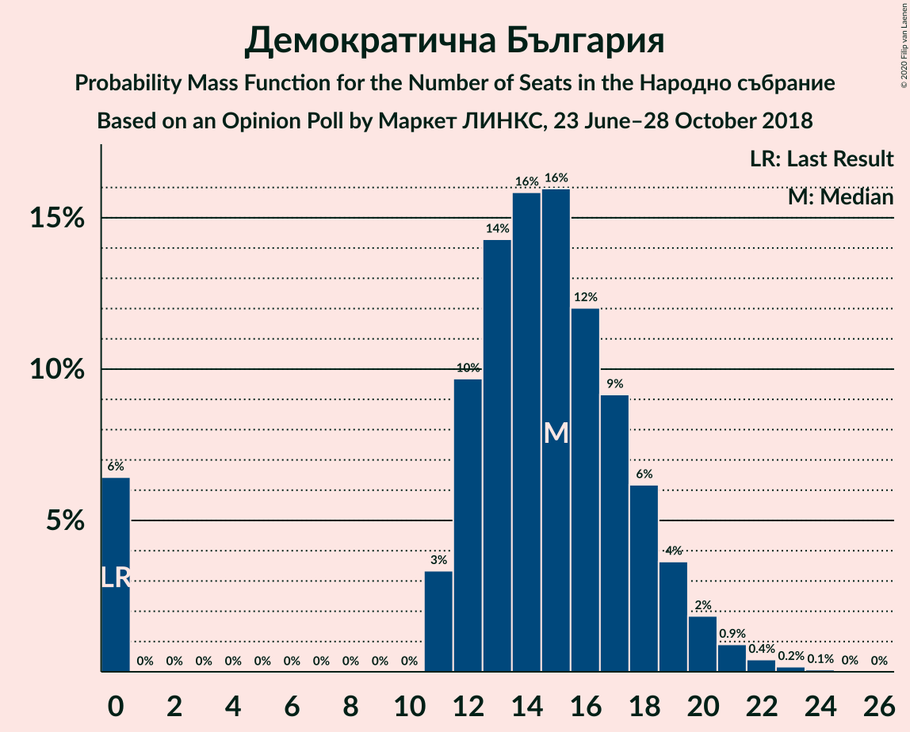
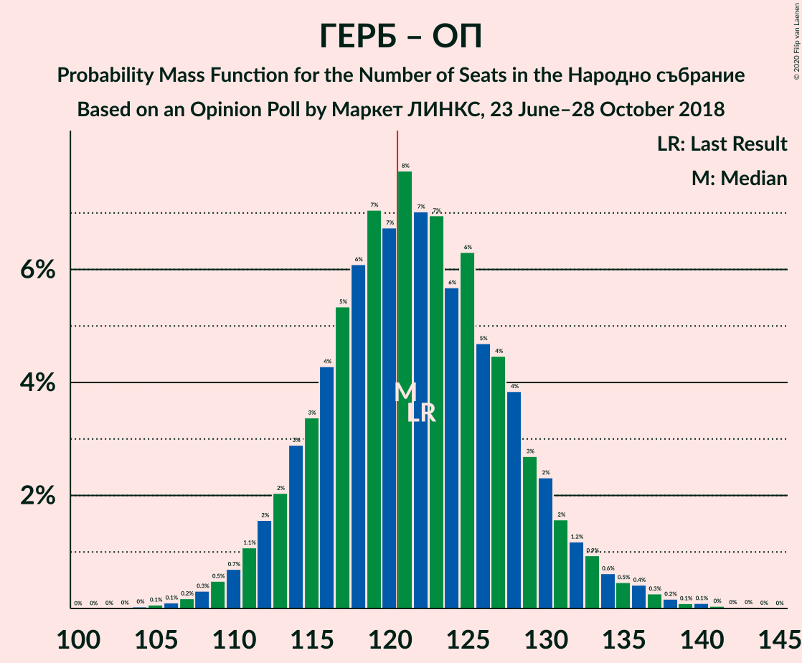
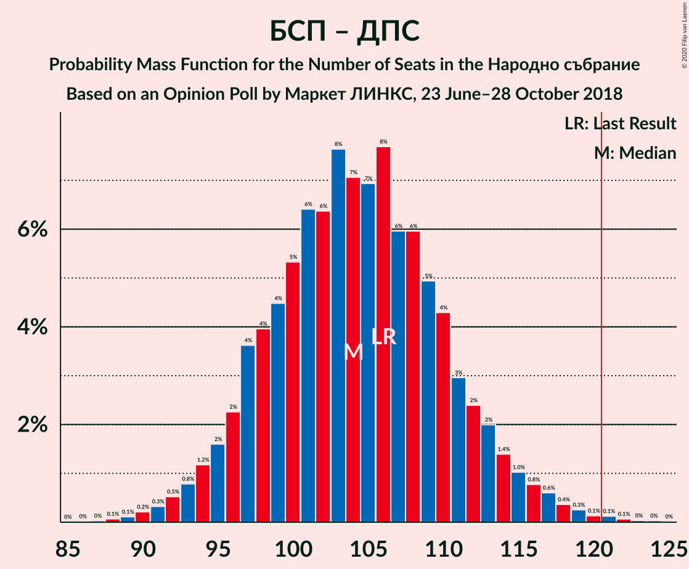

# Opinion Poll by Маркет ЛИНКС, 23 June–28 October 2018

<a href="#voting-intentions">Voting Intentions</a> | <a href="#seats">Seats</a> | <a href="#coalitions">Coalitions</a> | <a href="#technical-information">Technical Information</a>

## Voting Intentions

### Confidence Intervals

| Party | Last Result | Poll Result | 80% Confidence Interval | 90% Confidence Interval | 95% Confidence Interval | 99% Confidence Interval |
|:-----:|:-----------:|:-----------:|:-----------------------:|:-----------------------:|:-----------------------:|:-----------------------:|
| Граждани за европейско развитие на България | 33.5% | 36.7% | 34.2–39.3% |33.5–40.0% |32.9–40.7% |31.7–41.9% |
| Българска социалистическа партия | 27.9% | 30.5% | 28.1–33.0% |27.5–33.7% |26.9–34.3% |25.8–35.5% |
| Обединени Патриоти | 9.3% | 7.6% | 6.3–9.2% |6.0–9.6% |5.7–10.0% |5.2–10.8% |
| Движение за права и свободи | 9.2% | 7.4% | 6.2–9.0% |5.9–9.4% |5.6–9.8% |5.0–10.6% |
| Демократична България | 0.0% | 5.2% | 4.2–6.6% |3.9–7.0% |3.7–7.3% |3.3–8.0% |
| Воля | 4.3% | 1.9% | 1.3–2.8% |1.2–3.0% |1.0–3.3% |0.8–3.8% |

*Note:* The poll result column reflects the actual value used in the calculations. Published results may vary slightly, and in addition be rounded to fewer digits.

## Seats

### Confidence Intervals

| Party | Last Result | Median | 80% Confidence Interval | 90% Confidence Interval | 95% Confidence Interval | 99% Confidence Interval |
|:-----:|:-----------:|:------:|:-----------------------:|:-----------------------:|:-----------------------:|:-----------------------:|
| <a href="#граждани-за-европейско-развитие-на-българия">Граждани за европейско развитие на България</a> | 95 | 100 | 93–108 |92–110 |90–113 |87–117 |
| <a href="#българска-социалистическа-партия">Българска социалистическа партия</a> | 80 | 84 | 77–91 |75–93 |74–94 |70–98 |
| <a href="#обединени-патриоти">Обединени Патриоти</a> | 27 | 21 | 17–25 |16–26 |15–27 |14–29 |
| <a href="#движение-за-права-и-свободи">Движение за права и свободи</a> | 26 | 21 | 17–25 |16–26 |15–27 |14–29 |
| <a href="#демократична-българия">Демократична България</a> | 0 | 14 | 11–18 |0–19 |0–20 |0–22 |
| <a href="#воля">Воля</a> | 12 | 0 | 0 |0 |0 |0 |

### Граждани за европейско развитие на България

*For a full overview of the results for this party, see the [Граждани за европейско развитие на България](party-гражданизаевропейскоразвитиенабългария.html) page.*

| Number of Seats | Probability | Accumulated | Special Marks |
|:---------------:|:-----------:|:-----------:|:-------------:|
| 84 | 0.1% | 100% |  |
| 85 | 0% | 99.9% |  |
| 86 | 0.2% | 99.9% |  |
| 87 | 0.2% | 99.6% |  |
| 88 | 0.5% | 99.4% |  |
| 89 | 0.6% | 98.9% |  |
| 90 | 2% | 98% |  |
| 91 | 1.5% | 97% |  |
| 92 | 3% | 95% |  |
| 93 | 3% | 92% |  |
| 94 | 4% | 90% |  |
| 95 | 3% | 86% | Last Result |
| 96 | 7% | 82% |  |
| 97 | 6% | 75% |  |
| 98 | 10% | 70% |  |
| 99 | 6% | 60% |  |
| 100 | 8% | 54% | Median |
| 101 | 7% | 46% |  |
| 102 | 5% | 39% |  |
| 103 | 5% | 34% |  |
| 104 | 6% | 29% |  |
| 105 | 5% | 24% |  |
| 106 | 5% | 19% |  |
| 107 | 4% | 14% |  |
| 108 | 3% | 10% |  |
| 109 | 2% | 7% |  |
| 110 | 1.4% | 6% |  |
| 111 | 0.8% | 4% |  |
| 112 | 0.7% | 3% |  |
| 113 | 0.5% | 3% |  |
| 114 | 0.7% | 2% |  |
| 115 | 0.3% | 2% |  |
| 116 | 0.7% | 1.3% |  |
| 117 | 0.3% | 0.5% |  |
| 118 | 0.1% | 0.2% |  |
| 119 | 0% | 0.1% |  |
| 120 | 0% | 0.1% |  |
| 121 | 0% | 0% | Majority |

### Българска социалистическа партия

*For a full overview of the results for this party, see the [Българска социалистическа партия](party-българскасоциалистическапартия.html) page.*

| Number of Seats | Probability | Accumulated | Special Marks |
|:---------------:|:-----------:|:-----------:|:-------------:|
| 67 | 0% | 100% |  |
| 68 | 0.1% | 99.9% |  |
| 69 | 0.1% | 99.9% |  |
| 70 | 0.3% | 99.8% |  |
| 71 | 0.3% | 99.5% |  |
| 72 | 0.5% | 99.2% |  |
| 73 | 1.0% | 98.7% |  |
| 74 | 1.0% | 98% |  |
| 75 | 2% | 97% |  |
| 76 | 3% | 95% |  |
| 77 | 3% | 92% |  |
| 78 | 3% | 89% |  |
| 79 | 6% | 86% |  |
| 80 | 5% | 80% | Last Result |
| 81 | 6% | 75% |  |
| 82 | 7% | 69% |  |
| 83 | 10% | 62% |  |
| 84 | 6% | 52% | Median |
| 85 | 5% | 46% |  |
| 86 | 9% | 41% |  |
| 87 | 8% | 31% |  |
| 88 | 6% | 24% |  |
| 89 | 4% | 18% |  |
| 90 | 3% | 15% |  |
| 91 | 4% | 11% |  |
| 92 | 2% | 8% |  |
| 93 | 3% | 5% |  |
| 94 | 1.1% | 3% |  |
| 95 | 0.4% | 2% |  |
| 96 | 0.4% | 1.2% |  |
| 97 | 0.3% | 0.8% |  |
| 98 | 0.3% | 0.5% |  |
| 99 | 0.1% | 0.3% |  |
| 100 | 0% | 0.2% |  |
| 101 | 0.1% | 0.1% |  |
| 102 | 0% | 0% |  |

### Обединени Патриоти

*For a full overview of the results for this party, see the [Обединени Патриоти](party-обединенипатриоти.html) page.*

| Number of Seats | Probability | Accumulated | Special Marks |
|:---------------:|:-----------:|:-----------:|:-------------:|
| 12 | 0% | 100% |  |
| 13 | 0.2% | 99.9% |  |
| 14 | 0.5% | 99.8% |  |
| 15 | 2% | 99.3% |  |
| 16 | 3% | 97% |  |
| 17 | 5% | 95% |  |
| 18 | 8% | 89% |  |
| 19 | 12% | 81% |  |
| 20 | 13% | 68% |  |
| 21 | 15% | 55% | Median |
| 22 | 10% | 40% |  |
| 23 | 8% | 30% |  |
| 24 | 9% | 22% |  |
| 25 | 6% | 14% |  |
| 26 | 4% | 8% |  |
| 27 | 2% | 4% | Last Result |
| 28 | 1.2% | 2% |  |
| 29 | 0.8% | 1.3% |  |
| 30 | 0.2% | 0.4% |  |
| 31 | 0.1% | 0.2% |  |
| 32 | 0.1% | 0.1% |  |
| 33 | 0% | 0% |  |

### Движение за права и свободи

*For a full overview of the results for this party, see the [Движение за права и свободи](party-движениезаправаисвободи.html) page.*

| Number of Seats | Probability | Accumulated | Special Marks |
|:---------------:|:-----------:|:-----------:|:-------------:|
| 12 | 0.1% | 100% |  |
| 13 | 0.3% | 99.9% |  |
| 14 | 0.7% | 99.6% |  |
| 15 | 2% | 98.9% |  |
| 16 | 4% | 96% |  |
| 17 | 6% | 92% |  |
| 18 | 7% | 86% |  |
| 19 | 12% | 79% |  |
| 20 | 16% | 67% |  |
| 21 | 12% | 51% | Median |
| 22 | 10% | 39% |  |
| 23 | 12% | 30% |  |
| 24 | 7% | 17% |  |
| 25 | 4% | 10% |  |
| 26 | 3% | 7% | Last Result |
| 27 | 2% | 3% |  |
| 28 | 0.6% | 1.3% |  |
| 29 | 0.3% | 0.7% |  |
| 30 | 0.3% | 0.4% |  |
| 31 | 0.1% | 0.2% |  |
| 32 | 0% | 0.1% |  |
| 33 | 0% | 0% |  |

### Демократична България

*For a full overview of the results for this party, see the [Демократична България](party-демократичнабългария.html) page.*

| Number of Seats | Probability | Accumulated | Special Marks |
|:---------------:|:-----------:|:-----------:|:-------------:|
| 0 | 8% | 100% | Last Result |
| 1 | 0% | 92% |  |
| 2 | 0% | 92% |  |
| 3 | 0% | 92% |  |
| 4 | 0% | 92% |  |
| 5 | 0% | 92% |  |
| 6 | 0% | 92% |  |
| 7 | 0% | 92% |  |
| 8 | 0% | 92% |  |
| 9 | 0% | 92% |  |
| 10 | 0% | 92% |  |
| 11 | 5% | 92% |  |
| 12 | 11% | 88% |  |
| 13 | 18% | 76% |  |
| 14 | 11% | 59% | Median |
| 15 | 16% | 48% |  |
| 16 | 8% | 32% |  |
| 17 | 7% | 24% |  |
| 18 | 9% | 17% |  |
| 19 | 4% | 8% |  |
| 20 | 2% | 4% |  |
| 21 | 1.0% | 2% |  |
| 22 | 0.5% | 0.6% |  |
| 23 | 0.1% | 0.2% |  |
| 24 | 0% | 0.1% |  |
| 25 | 0% | 0% |  |

### Воля

*For a full overview of the results for this party, see the [Воля](party-воля.html) page.*

| Number of Seats | Probability | Accumulated | Special Marks |
|:---------------:|:-----------:|:-----------:|:-------------:|
| 0 | 99.8% | 100% | Median |
| 1 | 0% | 0.2% |  |
| 2 | 0% | 0.2% |  |
| 3 | 0% | 0.2% |  |
| 4 | 0% | 0.2% |  |
| 5 | 0% | 0.2% |  |
| 6 | 0% | 0.2% |  |
| 7 | 0% | 0.2% |  |
| 8 | 0% | 0.2% |  |
| 9 | 0% | 0.2% |  |
| 10 | 0% | 0.2% |  |
| 11 | 0.1% | 0.2% |  |
| 12 | 0.1% | 0.1% | Last Result |
| 13 | 0% | 0% |  |

## Coalitions

### Confidence Intervals

| Coalition | Last Result | Median | Majority? | 80% Confidence Interval | 90% Confidence Interval | 95% Confidence Interval | 99% Confidence Interval |
|:---------:|:-----------:|:------:|:---------:|:-----------------------:|:-----------------------:|:-----------------------:|:-----------------------:|
| Граждани за европейско развитие на България – Обединени Патриоти | 122 | 121 | 58% | 114–129 | 112–131 | 111–134 | 108–138 |
| Българска социалистическа партия – Движение за права и свободи | 106 | 106 | 0.3% | 98–112 | 96–114 | 94–115 | 90–119 |

### Граждани за европейско развитие на България – Обединени Патриоти

| Number of Seats | Probability | Accumulated | Special Marks |
|:---------------:|:-----------:|:-----------:|:-------------:|
| 104 | 0% | 100% |  |
| 105 | 0.1% | 99.9% |  |
| 106 | 0.1% | 99.9% |  |
| 107 | 0.1% | 99.8% |  |
| 108 | 0.4% | 99.6% |  |
| 109 | 0.5% | 99.2% |  |
| 110 | 0.3% | 98.7% |  |
| 111 | 2% | 98% |  |
| 112 | 2% | 96% |  |
| 113 | 1.1% | 94% |  |
| 114 | 4% | 93% |  |
| 115 | 6% | 89% |  |
| 116 | 1.2% | 83% |  |
| 117 | 5% | 82% |  |
| 118 | 9% | 77% |  |
| 119 | 7% | 68% |  |
| 120 | 3% | 61% |  |
| 121 | 15% | 58% | Median, Majority |
| 122 | 5% | 43% | Last Result |
| 123 | 3% | 38% |  |
| 124 | 4% | 35% |  |
| 125 | 7% | 30% |  |
| 126 | 2% | 24% |  |
| 127 | 7% | 22% |  |
| 128 | 4% | 15% |  |
| 129 | 1.4% | 10% |  |
| 130 | 3% | 9% |  |
| 131 | 2% | 6% |  |
| 132 | 0.9% | 4% |  |
| 133 | 0.8% | 4% |  |
| 134 | 0.7% | 3% |  |
| 135 | 0.4% | 2% |  |
| 136 | 0.2% | 2% |  |
| 137 | 0.7% | 1.4% |  |
| 138 | 0.2% | 0.7% |  |
| 139 | 0.1% | 0.5% |  |
| 140 | 0.3% | 0.4% |  |
| 141 | 0% | 0.1% |  |
| 142 | 0% | 0.1% |  |
| 143 | 0% | 0% |  |

### Българска социалистическа партия – Движение за права и свободи

| Number of Seats | Probability | Accumulated | Special Marks |
|:---------------:|:-----------:|:-----------:|:-------------:|
| 87 | 0% | 100% |  |
| 88 | 0.1% | 99.9% |  |
| 89 | 0.2% | 99.8% |  |
| 90 | 0.2% | 99.7% |  |
| 91 | 0.4% | 99.4% |  |
| 92 | 0.4% | 99.0% |  |
| 93 | 0.4% | 98.7% |  |
| 94 | 1.0% | 98% |  |
| 95 | 1.3% | 97% |  |
| 96 | 2% | 96% |  |
| 97 | 4% | 94% |  |
| 98 | 5% | 90% |  |
| 99 | 4% | 85% |  |
| 100 | 6% | 81% |  |
| 101 | 4% | 75% |  |
| 102 | 6% | 71% |  |
| 103 | 3% | 64% |  |
| 104 | 4% | 62% |  |
| 105 | 5% | 57% | Median |
| 106 | 13% | 52% | Last Result |
| 107 | 10% | 39% |  |
| 108 | 6% | 29% |  |
| 109 | 6% | 24% |  |
| 110 | 5% | 18% |  |
| 111 | 2% | 12% |  |
| 112 | 2% | 11% |  |
| 113 | 4% | 9% |  |
| 114 | 1.3% | 5% |  |
| 115 | 2% | 4% |  |
| 116 | 0.8% | 2% |  |
| 117 | 0.7% | 2% |  |
| 118 | 0.3% | 0.9% |  |
| 119 | 0.2% | 0.6% |  |
| 120 | 0.1% | 0.4% |  |
| 121 | 0.2% | 0.3% | Majority |
| 122 | 0.1% | 0.1% |  |
| 123 | 0% | 0.1% |  |
| 124 | 0% | 0% |  |

## Technical Information

### Opinion Poll

+ **Polling firm:** Маркет ЛИНКС
+ **Commissioner(s):** —
+ **Fieldwork period:** 23 June–28 October 2018

### Calculations

+ **Sample size:** 594
+ **Simulations done:** 131,072
+ **Error estimate:** 1.57%

