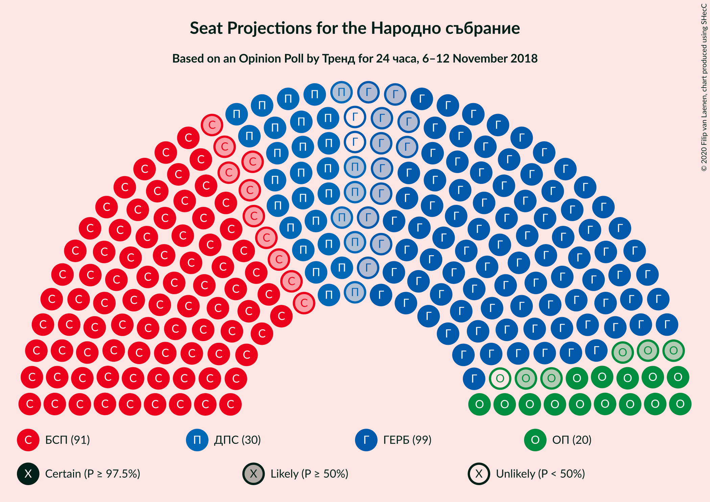
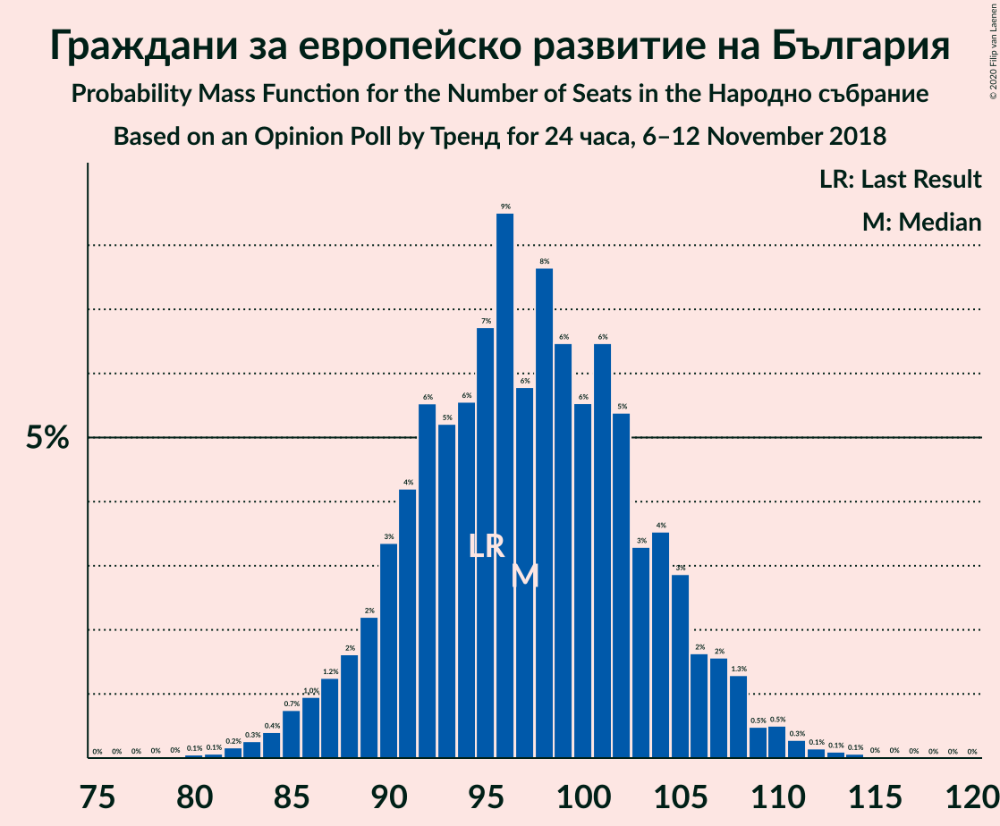
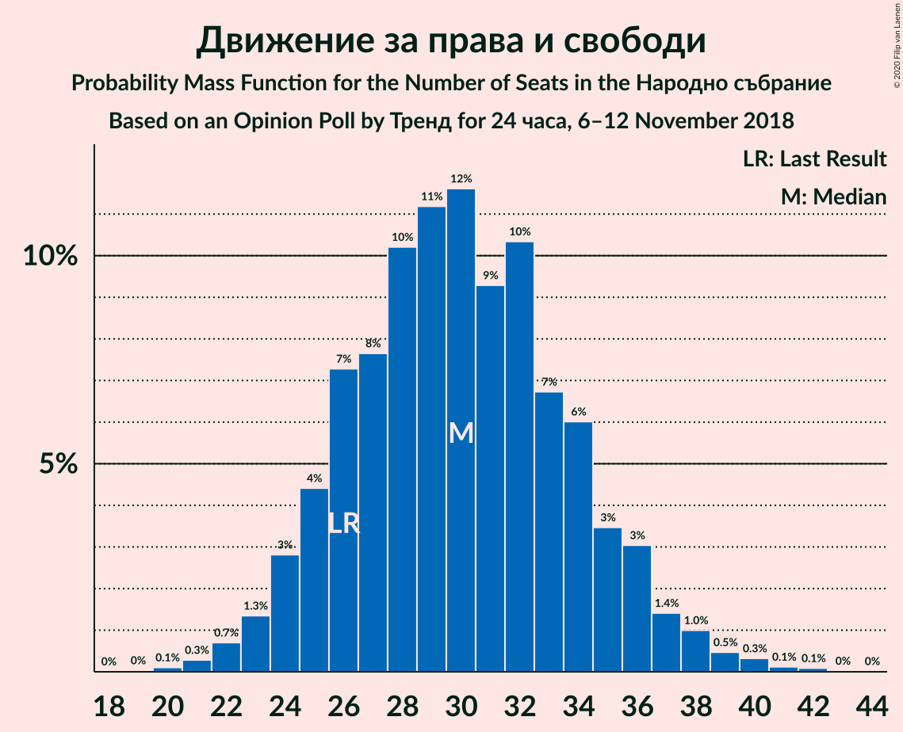
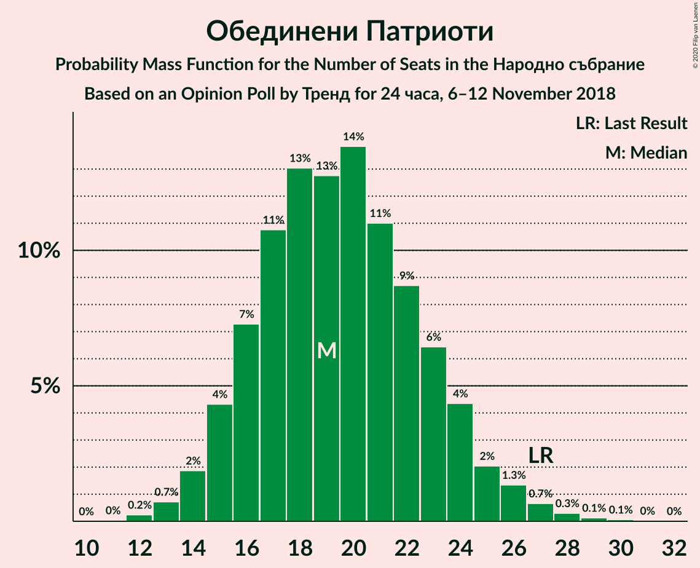
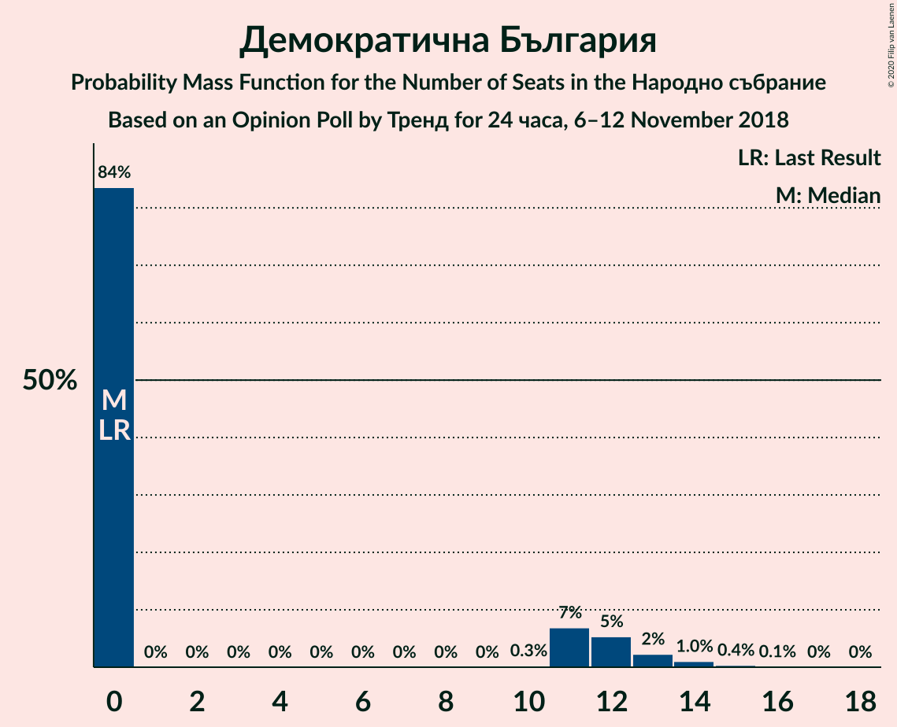
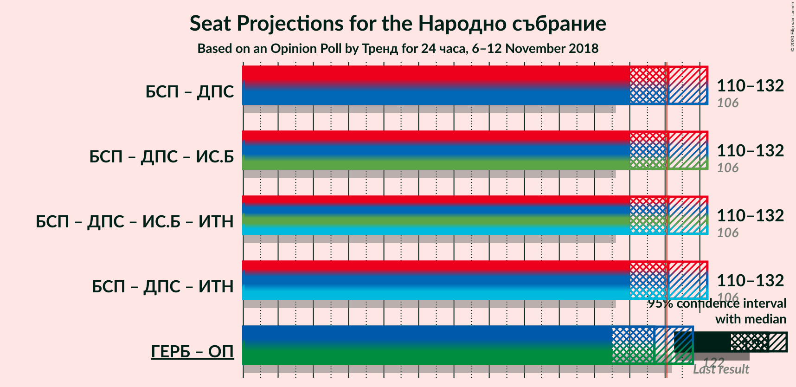

# Opinion Poll by Тренд for 24 часа, 6–12 November 2018

<a href="#voting-intentions">Voting Intentions</a> | <a href="#seats">Seats</a> | <a href="#coalitions">Coalitions</a> | <a href="#technical-information">Technical Information</a>

## Voting Intentions

### Confidence Intervals

| Party | Last Result | Poll Result | 80% Confidence Interval | 90% Confidence Interval | 95% Confidence Interval | 99% Confidence Interval |
|:-----:|:-----------:|:-----------:|:-----------------------:|:-----------------------:|:-----------------------:|:-----------------------:|
| Граждани за европейско развитие на България | 33.5% | 35.5% | 33.1–38.1% |32.4–38.8% |31.8–39.4% |30.6–40.7% |
| Българска социалистическа партия | 27.9% | 33.3% | 30.9–35.9% |30.3–36.6% |29.7–37.2% |28.5–38.4% |
| Движение за права и свободи | 9.2% | 10.8% | 9.4–12.6% |8.9–13.1% |8.6–13.6% |7.9–14.5% |
| Обединени Патриоти | 9.3% | 7.0% | 5.8–8.5% |5.5–8.9% |5.2–9.3% |4.7–10.1% |
| Демократична България | 0.0% | 3.2% | 2.4–4.3% |2.2–4.6% |2.0–4.9% |1.7–5.5% |
| Воля | 4.3% | 2.3% | 1.7–3.3% |1.5–3.6% |1.4–3.9% |1.1–4.4% |
| Реформаторски блок | 3.1% | 1.8% | 1.3–2.8% |1.1–3.0% |1.0–3.3% |0.8–3.8% |

*Note:* The poll result column reflects the actual value used in the calculations. Published results may vary slightly, and in addition be rounded to fewer digits.

## Seats

### Confidence Intervals

| Party | Last Result | Median | 80% Confidence Interval | 90% Confidence Interval | 95% Confidence Interval | 99% Confidence Interval |
|:-----:|:-----------:|:------:|:-----------------------:|:-----------------------:|:-----------------------:|:-----------------------:|
| <a href="#граждани-за-европейско-развитие-на-българия">Граждани за европейско развитие на България</a> | 95 | 97 | 90–104 |88–106 |86–108 |83–111 |
| <a href="#българска-социалистическа-партия">Българска социалистическа партия</a> | 80 | 91 | 84–98 |82–100 |81–102 |78–105 |
| <a href="#движение-за-права-и-свободи">Движение за права и свободи</a> | 26 | 30 | 26–34 |24–36 |24–37 |22–40 |
| <a href="#обединени-патриоти">Обединени Патриоти</a> | 27 | 19 | 16–23 |15–24 |14–26 |13–28 |
| <a href="#демократична-българия">Демократична България</a> | 0 | 0 | 0–11 |0–12 |0–13 |0–15 |
| <a href="#воля">Воля</a> | 12 | 0 | 0 |0 |0 |0–12 |
| <a href="#реформаторски-блок">Реформаторски блок</a> | 0 | 0 | 0 |0 |0 |0 |

### Граждани за европейско развитие на България

*For a full overview of the results for this party, see the [Граждани за европейско развитие на България](party-гражданизаевропейскоразвитиенабългария.html) page.*

| Number of Seats | Probability | Accumulated | Special Marks |
|:---------------:|:-----------:|:-----------:|:-------------:|
| 79 | 0% | 100% |  |
| 80 | 0.1% | 99.9% |  |
| 81 | 0.1% | 99.9% |  |
| 82 | 0.2% | 99.8% |  |
| 83 | 0.3% | 99.7% |  |
| 84 | 0.4% | 99.4% |  |
| 85 | 0.7% | 99.0% |  |
| 86 | 1.0% | 98% |  |
| 87 | 1.2% | 97% |  |
| 88 | 2% | 96% |  |
| 89 | 2% | 94% |  |
| 90 | 3% | 92% |  |
| 91 | 4% | 89% |  |
| 92 | 6% | 85% |  |
| 93 | 5% | 79% |  |
| 94 | 6% | 74% |  |
| 95 | 7% | 68% | Last Result |
| 96 | 9% | 62% |  |
| 97 | 6% | 53% | Median |
| 98 | 8% | 47% |  |
| 99 | 6% | 40% |  |
| 100 | 6% | 33% |  |
| 101 | 6% | 28% |  |
| 102 | 5% | 21% |  |
| 103 | 3% | 16% |  |
| 104 | 4% | 13% |  |
| 105 | 3% | 9% |  |
| 106 | 2% | 6% |  |
| 107 | 2% | 5% |  |
| 108 | 1.3% | 3% |  |
| 109 | 0.5% | 2% |  |
| 110 | 0.5% | 1.2% |  |
| 111 | 0.3% | 0.7% |  |
| 112 | 0.1% | 0.4% |  |
| 113 | 0.1% | 0.2% |  |
| 114 | 0.1% | 0.1% |  |
| 115 | 0% | 0.1% |  |
| 116 | 0% | 0% |  |

### Българска социалистическа партия

*For a full overview of the results for this party, see the [Българска социалистическа партия](party-българскасоциалистическапартия.html) page.*

| Number of Seats | Probability | Accumulated | Special Marks |
|:---------------:|:-----------:|:-----------:|:-------------:|
| 74 | 0% | 100% |  |
| 75 | 0.1% | 99.9% |  |
| 76 | 0.2% | 99.9% |  |
| 77 | 0.2% | 99.7% |  |
| 78 | 0.4% | 99.5% |  |
| 79 | 0.7% | 99.1% |  |
| 80 | 0.9% | 98% | Last Result |
| 81 | 1.4% | 98% |  |
| 82 | 1.4% | 96% |  |
| 83 | 2% | 95% |  |
| 84 | 3% | 92% |  |
| 85 | 3% | 89% |  |
| 86 | 4% | 86% |  |
| 87 | 5% | 82% |  |
| 88 | 8% | 77% |  |
| 89 | 6% | 70% |  |
| 90 | 7% | 64% |  |
| 91 | 9% | 57% | Median |
| 92 | 8% | 48% |  |
| 93 | 6% | 39% |  |
| 94 | 5% | 33% |  |
| 95 | 7% | 28% |  |
| 96 | 5% | 21% |  |
| 97 | 4% | 16% |  |
| 98 | 3% | 12% |  |
| 99 | 3% | 9% |  |
| 100 | 2% | 6% |  |
| 101 | 1.4% | 4% |  |
| 102 | 1.0% | 3% |  |
| 103 | 0.9% | 2% |  |
| 104 | 0.4% | 1.0% |  |
| 105 | 0.3% | 0.6% |  |
| 106 | 0.2% | 0.4% |  |
| 107 | 0.1% | 0.2% |  |
| 108 | 0% | 0.1% |  |
| 109 | 0% | 0.1% |  |
| 110 | 0% | 0% |  |

### Движение за права и свободи

*For a full overview of the results for this party, see the [Движение за права и свободи](party-движениезаправаисвободи.html) page.*

| Number of Seats | Probability | Accumulated | Special Marks |
|:---------------:|:-----------:|:-----------:|:-------------:|
| 20 | 0.1% | 100% |  |
| 21 | 0.3% | 99.9% |  |
| 22 | 0.7% | 99.6% |  |
| 23 | 1.3% | 98.9% |  |
| 24 | 3% | 98% |  |
| 25 | 4% | 95% |  |
| 26 | 7% | 90% | Last Result |
| 27 | 8% | 83% |  |
| 28 | 10% | 75% |  |
| 29 | 11% | 65% |  |
| 30 | 12% | 54% | Median |
| 31 | 9% | 42% |  |
| 32 | 10% | 33% |  |
| 33 | 7% | 23% |  |
| 34 | 6% | 16% |  |
| 35 | 3% | 10% |  |
| 36 | 3% | 7% |  |
| 37 | 1.4% | 3% |  |
| 38 | 1.0% | 2% |  |
| 39 | 0.5% | 1.0% |  |
| 40 | 0.3% | 0.6% |  |
| 41 | 0.1% | 0.3% |  |
| 42 | 0.1% | 0.1% |  |
| 43 | 0% | 0% |  |

### Обединени Патриоти

*For a full overview of the results for this party, see the [Обединени Патриоти](party-обединенипатриоти.html) page.*

| Number of Seats | Probability | Accumulated | Special Marks |
|:---------------:|:-----------:|:-----------:|:-------------:|
| 11 | 0% | 100% |  |
| 12 | 0.2% | 99.9% |  |
| 13 | 0.7% | 99.7% |  |
| 14 | 2% | 99.0% |  |
| 15 | 4% | 97% |  |
| 16 | 7% | 93% |  |
| 17 | 11% | 85% |  |
| 18 | 13% | 75% |  |
| 19 | 13% | 62% | Median |
| 20 | 14% | 49% |  |
| 21 | 11% | 35% |  |
| 22 | 9% | 24% |  |
| 23 | 6% | 15% |  |
| 24 | 4% | 9% |  |
| 25 | 2% | 5% |  |
| 26 | 1.3% | 3% |  |
| 27 | 0.7% | 1.2% | Last Result |
| 28 | 0.3% | 0.5% |  |
| 29 | 0.1% | 0.2% |  |
| 30 | 0.1% | 0.1% |  |
| 31 | 0% | 0% |  |

### Демократична България

*For a full overview of the results for this party, see the [Демократична България](party-демократичнабългария.html) page.*

| Number of Seats | Probability | Accumulated | Special Marks |
|:---------------:|:-----------:|:-----------:|:-------------:|
| 0 | 84% | 100% | Last Result, Median |
| 1 | 0% | 16% |  |
| 2 | 0% | 16% |  |
| 3 | 0% | 16% |  |
| 4 | 0% | 16% |  |
| 5 | 0% | 16% |  |
| 6 | 0% | 16% |  |
| 7 | 0% | 16% |  |
| 8 | 0% | 16% |  |
| 9 | 0% | 16% |  |
| 10 | 0.3% | 16% |  |
| 11 | 7% | 16% |  |
| 12 | 5% | 9% |  |
| 13 | 2% | 4% |  |
| 14 | 1.0% | 2% |  |
| 15 | 0.4% | 0.5% |  |
| 16 | 0.1% | 0.2% |  |
| 17 | 0% | 0.1% |  |
| 18 | 0% | 0% |  |

### Воля

*For a full overview of the results for this party, see the [Воля](party-воля.html) page.*

| Number of Seats | Probability | Accumulated | Special Marks |
|:---------------:|:-----------:|:-----------:|:-------------:|
| 0 | 98% | 100% | Median |
| 1 | 0% | 2% |  |
| 2 | 0% | 2% |  |
| 3 | 0% | 2% |  |
| 4 | 0% | 2% |  |
| 5 | 0% | 2% |  |
| 6 | 0% | 2% |  |
| 7 | 0% | 2% |  |
| 8 | 0% | 2% |  |
| 9 | 0% | 2% |  |
| 10 | 0% | 2% |  |
| 11 | 0.9% | 2% |  |
| 12 | 0.5% | 0.7% | Last Result |
| 13 | 0.1% | 0.2% |  |
| 14 | 0% | 0.1% |  |
| 15 | 0% | 0% |  |

### Реформаторски блок

*For a full overview of the results for this party, see the [Реформаторски блок](party-реформаторскиблок.html) page.*

| Number of Seats | Probability | Accumulated | Special Marks |
|:---------------:|:-----------:|:-----------:|:-------------:|
| 0 | 99.8% | 100% | Last Result, Median |
| 1 | 0% | 0.2% |  |
| 2 | 0% | 0.2% |  |
| 3 | 0% | 0.2% |  |
| 4 | 0% | 0.2% |  |
| 5 | 0% | 0.2% |  |
| 6 | 0% | 0.2% |  |
| 7 | 0% | 0.2% |  |
| 8 | 0% | 0.2% |  |
| 9 | 0% | 0.2% |  |
| 10 | 0% | 0.2% |  |
| 11 | 0.1% | 0.2% |  |
| 12 | 0.1% | 0.1% |  |
| 13 | 0% | 0% |  |

## Coalitions

### Confidence Intervals

| Coalition | Last Result | Median | Majority? | 80% Confidence Interval | 90% Confidence Interval | 95% Confidence Interval | 99% Confidence Interval |
|:---------:|:-----------:|:------:|:---------:|:-----------------------:|:-----------------------:|:-----------------------:|:-----------------------:|
| Българска социалистическа партия – Движение за права и свободи | 106 | 121 | 56% | 114–128 | 112–130 | 110–132 | 106–135 |
| Граждани за европейско развитие на България – Обединени Патриоти | 122 | 117 | 25% | 109–124 | 107–126 | 105–128 | 102–131 |

### Българска социалистическа партия – Движение за права и свободи

| Number of Seats | Probability | Accumulated | Special Marks |
|:---------------:|:-----------:|:-----------:|:-------------:|
| 102 | 0% | 100% |  |
| 103 | 0.1% | 99.9% |  |
| 104 | 0.1% | 99.9% |  |
| 105 | 0.2% | 99.8% |  |
| 106 | 0.3% | 99.6% | Last Result |
| 107 | 0.5% | 99.4% |  |
| 108 | 0.5% | 98.9% |  |
| 109 | 0.7% | 98% |  |
| 110 | 1.1% | 98% |  |
| 111 | 1.4% | 97% |  |
| 112 | 2% | 95% |  |
| 113 | 2% | 93% |  |
| 114 | 3% | 91% |  |
| 115 | 3% | 88% |  |
| 116 | 5% | 85% |  |
| 117 | 6% | 80% |  |
| 118 | 6% | 74% |  |
| 119 | 6% | 69% |  |
| 120 | 7% | 62% |  |
| 121 | 6% | 56% | Median, Majority |
| 122 | 7% | 49% |  |
| 123 | 7% | 42% |  |
| 124 | 7% | 35% |  |
| 125 | 5% | 29% |  |
| 126 | 7% | 24% |  |
| 127 | 4% | 17% |  |
| 128 | 4% | 13% |  |
| 129 | 2% | 9% |  |
| 130 | 2% | 7% |  |
| 131 | 2% | 5% |  |
| 132 | 1.2% | 3% |  |
| 133 | 0.6% | 2% |  |
| 134 | 0.5% | 1.3% |  |
| 135 | 0.3% | 0.8% |  |
| 136 | 0.2% | 0.5% |  |
| 137 | 0.1% | 0.3% |  |
| 138 | 0.1% | 0.2% |  |
| 139 | 0% | 0.1% |  |
| 140 | 0% | 0% |  |

### Граждани за европейско развитие на България – Обединени Патриоти

| Number of Seats | Probability | Accumulated | Special Marks |
|:---------------:|:-----------:|:-----------:|:-------------:|
| 98 | 0% | 100% |  |
| 99 | 0.1% | 99.9% |  |
| 100 | 0.1% | 99.9% |  |
| 101 | 0.2% | 99.7% |  |
| 102 | 0.4% | 99.5% |  |
| 103 | 0.3% | 99.2% |  |
| 104 | 0.8% | 98.8% |  |
| 105 | 0.7% | 98% |  |
| 106 | 1.3% | 97% |  |
| 107 | 1.4% | 96% |  |
| 108 | 2% | 95% |  |
| 109 | 3% | 92% |  |
| 110 | 4% | 89% |  |
| 111 | 3% | 85% |  |
| 112 | 5% | 82% |  |
| 113 | 5% | 77% |  |
| 114 | 8% | 72% |  |
| 115 | 6% | 64% |  |
| 116 | 7% | 58% | Median |
| 117 | 7% | 51% |  |
| 118 | 7% | 44% |  |
| 119 | 6% | 37% |  |
| 120 | 6% | 31% |  |
| 121 | 5% | 25% | Majority |
| 122 | 5% | 20% | Last Result |
| 123 | 4% | 15% |  |
| 124 | 3% | 11% |  |
| 125 | 2% | 8% |  |
| 126 | 2% | 6% |  |
| 127 | 1.2% | 4% |  |
| 128 | 1.1% | 3% |  |
| 129 | 0.5% | 2% |  |
| 130 | 0.4% | 1.0% |  |
| 131 | 0.2% | 0.6% |  |
| 132 | 0.2% | 0.4% |  |
| 133 | 0.1% | 0.2% |  |
| 134 | 0.1% | 0.1% |  |
| 135 | 0% | 0.1% |  |
| 136 | 0% | 0% |  |

## Technical Information

### Opinion Poll

+ **Polling firm:** Тренд
+ **Commissioner(s):** 24 часа
+ **Fieldwork period:** 6–12 November 2018

### Calculations

+ **Sample size:** 600
+ **Simulations done:** 1,048,576
+ **Error estimate:** 2.71%

