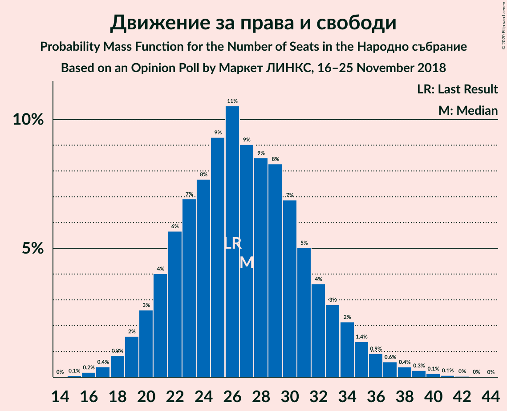
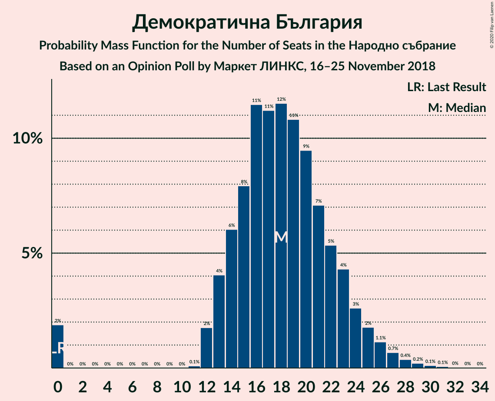
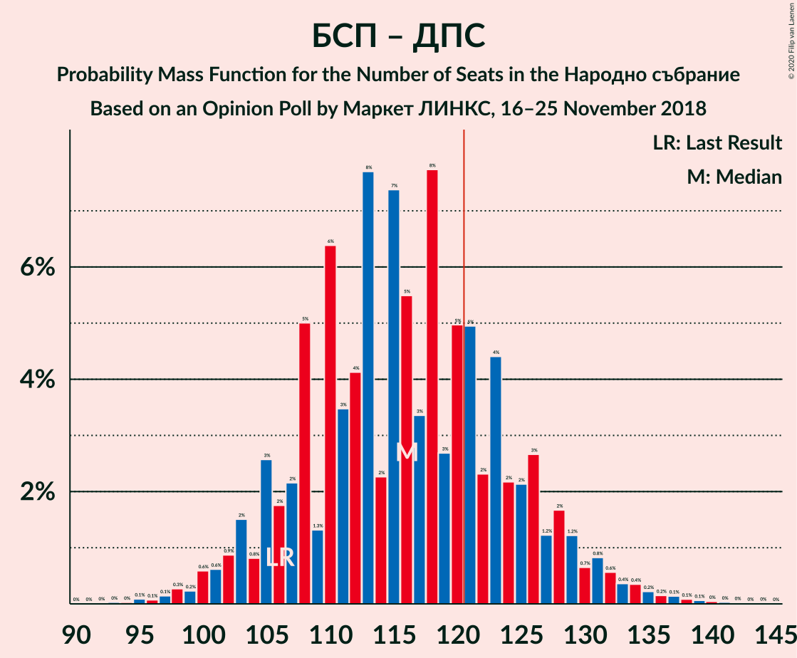

# Opinion Poll by Маркет ЛИНКС, 16–25 November 2018

<a href="#voting-intentions">Voting Intentions</a> | <a href="#seats">Seats</a> | <a href="#coalitions">Coalitions</a> | <a href="#technical-information">Technical Information</a>

## Voting Intentions

### Confidence Intervals

| Party | Last Result | Poll Result | 80% Confidence Interval | 90% Confidence Interval | 95% Confidence Interval | 99% Confidence Interval |
|:-----:|:-----------:|:-----------:|:-----------------------:|:-----------------------:|:-----------------------:|:-----------------------:|
| Граждани за европейско развитие на България | 33.5% | 32.8% | 29.9–35.8% |29.1–36.7% |28.4–37.4% |27.1–38.9% |
| Българска социалистическа партия | 27.9% | 30.6% | 27.8–33.6% |27.0–34.5% |26.3–35.2% |25.0–36.7% |
| Движение за права и свободи | 9.2% | 9.0% | 7.4–11.0% |7.0–11.6% |6.6–12.1% |5.9–13.2% |
| Демократична България | 0.0% | 6.1% | 4.8–7.8% |4.4–8.4% |4.1–8.8% |3.6–9.7% |
| Обединени Патриоти | 9.3% | 4.4% | 3.3–6.0% |3.0–6.4% |2.8–6.8% |2.3–7.7% |
| Воля | 4.3% | 2.2% | 1.5–3.4% |1.3–3.8% |1.2–4.1% |0.9–4.8% |

*Note:* The poll result column reflects the actual value used in the calculations. Published results may vary slightly, and in addition be rounded to fewer digits.

## Seats

### Confidence Intervals

| Party | Last Result | Median | 80% Confidence Interval | 90% Confidence Interval | 95% Confidence Interval | 99% Confidence Interval |
|:-----:|:-----------:|:------:|:-----------------------:|:-----------------------:|:-----------------------:|:-----------------------:|
| <a href="#граждани-за-европейско-развитие-на-българия">Граждани за европейско развитие на България</a> | 95 | 95 | 87–104 |85–107 |83–110 |78–115 |
| <a href="#българска-социалистическа-партия">Българска социалистическа партия</a> | 80 | 88 | 80–95 |78–98 |76–100 |73–107 |
| <a href="#движение-за-права-и-свободи">Движение за права и свободи</a> | 26 | 26 | 22–33 |21–34 |20–35 |18–39 |
| <a href="#демократична-българия">Демократична България</a> | 0 | 18 | 14–23 |13–24 |12–25 |0–28 |
| <a href="#обединени-патриоти">Обединени Патриоти</a> | 27 | 14 | 0–17 |0–18 |0–19 |0–22 |
| <a href="#воля">Воля</a> | 12 | 0 | 0 |0 |0 |0–13 |

### Граждани за европейско развитие на България

*For a full overview of the results for this party, see the [Граждани за европейско развитие на България](party-гражданизаевропейскоразвитиенабългария.html) page.*

| Number of Seats | Probability | Accumulated | Special Marks |
|:---------------:|:-----------:|:-----------:|:-------------:|
| 74 | 0% | 100% |  |
| 75 | 0% | 99.9% |  |
| 76 | 0.1% | 99.9% |  |
| 77 | 0.1% | 99.8% |  |
| 78 | 0.3% | 99.8% |  |
| 79 | 0.2% | 99.5% |  |
| 80 | 0.2% | 99.3% |  |
| 81 | 0.8% | 99.2% |  |
| 82 | 0.4% | 98% |  |
| 83 | 1.1% | 98% |  |
| 84 | 0.6% | 97% |  |
| 85 | 3% | 96% |  |
| 86 | 2% | 93% |  |
| 87 | 2% | 91% |  |
| 88 | 3% | 89% |  |
| 89 | 3% | 85% |  |
| 90 | 8% | 82% |  |
| 91 | 3% | 74% |  |
| 92 | 6% | 71% |  |
| 93 | 5% | 65% |  |
| 94 | 7% | 60% |  |
| 95 | 5% | 53% | Last Result, Median |
| 96 | 5% | 48% |  |
| 97 | 8% | 43% |  |
| 98 | 4% | 35% |  |
| 99 | 4% | 31% |  |
| 100 | 3% | 27% |  |
| 101 | 3% | 24% |  |
| 102 | 7% | 21% |  |
| 103 | 3% | 14% |  |
| 104 | 2% | 11% |  |
| 105 | 2% | 9% |  |
| 106 | 1.4% | 7% |  |
| 107 | 1.1% | 6% |  |
| 108 | 1.1% | 5% |  |
| 109 | 0.7% | 4% |  |
| 110 | 0.9% | 3% |  |
| 111 | 0.7% | 2% |  |
| 112 | 0.5% | 1.5% |  |
| 113 | 0.3% | 1.0% |  |
| 114 | 0.1% | 0.6% |  |
| 115 | 0.1% | 0.5% |  |
| 116 | 0.2% | 0.5% |  |
| 117 | 0.1% | 0.3% |  |
| 118 | 0.1% | 0.2% |  |
| 119 | 0% | 0.1% |  |
| 120 | 0% | 0.1% |  |
| 121 | 0% | 0% | Majority |

### Българска социалистическа партия

*For a full overview of the results for this party, see the [Българска социалистическа партия](party-българскасоциалистическапартия.html) page.*

| Number of Seats | Probability | Accumulated | Special Marks |
|:---------------:|:-----------:|:-----------:|:-------------:|
| 69 | 0% | 100% |  |
| 70 | 0.1% | 99.9% |  |
| 71 | 0.1% | 99.9% |  |
| 72 | 0.2% | 99.8% |  |
| 73 | 0.5% | 99.6% |  |
| 74 | 0.5% | 99.1% |  |
| 75 | 0.6% | 98.6% |  |
| 76 | 1.1% | 98% |  |
| 77 | 1.0% | 97% |  |
| 78 | 2% | 96% |  |
| 79 | 2% | 94% |  |
| 80 | 2% | 92% | Last Result |
| 81 | 3% | 90% |  |
| 82 | 6% | 86% |  |
| 83 | 5% | 81% |  |
| 84 | 7% | 76% |  |
| 85 | 6% | 69% |  |
| 86 | 4% | 62% |  |
| 87 | 5% | 58% |  |
| 88 | 5% | 54% | Median |
| 89 | 7% | 49% |  |
| 90 | 6% | 42% |  |
| 91 | 6% | 36% |  |
| 92 | 9% | 30% |  |
| 93 | 6% | 22% |  |
| 94 | 4% | 16% |  |
| 95 | 3% | 12% |  |
| 96 | 2% | 9% |  |
| 97 | 2% | 7% |  |
| 98 | 1.3% | 5% |  |
| 99 | 1.2% | 4% |  |
| 100 | 0.5% | 3% |  |
| 101 | 0.7% | 2% |  |
| 102 | 0.3% | 2% |  |
| 103 | 0.2% | 1.2% |  |
| 104 | 0.2% | 1.0% |  |
| 105 | 0.1% | 0.8% |  |
| 106 | 0.1% | 0.7% |  |
| 107 | 0.1% | 0.5% |  |
| 108 | 0.1% | 0.4% |  |
| 109 | 0.1% | 0.3% |  |
| 110 | 0.1% | 0.2% |  |
| 111 | 0.1% | 0.1% |  |
| 112 | 0% | 0% |  |

### Движение за права и свободи

*For a full overview of the results for this party, see the [Движение за права и свободи](party-движениезаправаисвободи.html) page.*

| Number of Seats | Probability | Accumulated | Special Marks |
|:---------------:|:-----------:|:-----------:|:-------------:|
| 15 | 0% | 100% |  |
| 16 | 0.1% | 99.9% |  |
| 17 | 0.3% | 99.8% |  |
| 18 | 0.6% | 99.5% |  |
| 19 | 1.1% | 98.9% |  |
| 20 | 2% | 98% |  |
| 21 | 4% | 95% |  |
| 22 | 5% | 91% |  |
| 23 | 5% | 86% |  |
| 24 | 9% | 81% |  |
| 25 | 14% | 72% |  |
| 26 | 11% | 58% | Last Result, Median |
| 27 | 7% | 47% |  |
| 28 | 6% | 40% |  |
| 29 | 8% | 33% |  |
| 30 | 8% | 25% |  |
| 31 | 5% | 18% |  |
| 32 | 2% | 13% |  |
| 33 | 3% | 10% |  |
| 34 | 4% | 8% |  |
| 35 | 2% | 4% |  |
| 36 | 0.5% | 2% |  |
| 37 | 0.5% | 2% |  |
| 38 | 0.6% | 1.3% |  |
| 39 | 0.4% | 0.7% |  |
| 40 | 0.2% | 0.3% |  |
| 41 | 0% | 0.1% |  |
| 42 | 0% | 0.1% |  |
| 43 | 0% | 0.1% |  |
| 44 | 0% | 0% |  |

### Демократична България

*For a full overview of the results for this party, see the [Демократична България](party-демократичнабългария.html) page.*

| Number of Seats | Probability | Accumulated | Special Marks |
|:---------------:|:-----------:|:-----------:|:-------------:|
| 0 | 2% | 100% | Last Result |
| 1 | 0% | 98% |  |
| 2 | 0% | 98% |  |
| 3 | 0% | 98% |  |
| 4 | 0% | 98% |  |
| 5 | 0% | 98% |  |
| 6 | 0% | 98% |  |
| 7 | 0% | 98% |  |
| 8 | 0% | 98% |  |
| 9 | 0% | 98% |  |
| 10 | 0% | 98% |  |
| 11 | 0% | 98% |  |
| 12 | 2% | 98% |  |
| 13 | 4% | 97% |  |
| 14 | 6% | 93% |  |
| 15 | 7% | 87% |  |
| 16 | 9% | 80% |  |
| 17 | 14% | 71% |  |
| 18 | 11% | 57% | Median |
| 19 | 10% | 47% |  |
| 20 | 9% | 37% |  |
| 21 | 10% | 28% |  |
| 22 | 6% | 17% |  |
| 23 | 3% | 11% |  |
| 24 | 4% | 8% |  |
| 25 | 2% | 4% |  |
| 26 | 0.9% | 2% |  |
| 27 | 0.7% | 1.3% |  |
| 28 | 0.3% | 0.6% |  |
| 29 | 0.2% | 0.3% |  |
| 30 | 0.1% | 0.1% |  |
| 31 | 0% | 0.1% |  |
| 32 | 0% | 0% |  |

### Обединени Патриоти

*For a full overview of the results for this party, see the [Обединени Патриоти](party-обединенипатриоти.html) page.*

| Number of Seats | Probability | Accumulated | Special Marks |
|:---------------:|:-----------:|:-----------:|:-------------:|
| 0 | 23% | 100% |  |
| 1 | 0% | 77% |  |
| 2 | 0% | 77% |  |
| 3 | 0% | 77% |  |
| 4 | 0% | 77% |  |
| 5 | 0% | 77% |  |
| 6 | 0% | 77% |  |
| 7 | 0% | 77% |  |
| 8 | 0% | 77% |  |
| 9 | 0% | 77% |  |
| 10 | 0% | 77% |  |
| 11 | 2% | 77% |  |
| 12 | 6% | 76% |  |
| 13 | 19% | 70% |  |
| 14 | 16% | 50% | Median |
| 15 | 15% | 35% |  |
| 16 | 8% | 20% |  |
| 17 | 6% | 12% |  |
| 18 | 3% | 6% |  |
| 19 | 1.5% | 4% |  |
| 20 | 1.2% | 2% |  |
| 21 | 0.4% | 0.9% |  |
| 22 | 0.3% | 0.6% |  |
| 23 | 0.2% | 0.3% |  |
| 24 | 0.1% | 0.1% |  |
| 25 | 0% | 0.1% |  |
| 26 | 0% | 0% |  |
| 27 | 0% | 0% | Last Result |

### Воля

*For a full overview of the results for this party, see the [Воля](party-воля.html) page.*

| Number of Seats | Probability | Accumulated | Special Marks |
|:---------------:|:-----------:|:-----------:|:-------------:|
| 0 | 98% | 100% | Median |
| 1 | 0% | 2% |  |
| 2 | 0% | 2% |  |
| 3 | 0% | 2% |  |
| 4 | 0% | 2% |  |
| 5 | 0% | 2% |  |
| 6 | 0% | 2% |  |
| 7 | 0% | 2% |  |
| 8 | 0% | 2% |  |
| 9 | 0% | 2% |  |
| 10 | 0% | 2% |  |
| 11 | 0.2% | 2% |  |
| 12 | 1.1% | 2% | Last Result |
| 13 | 0.7% | 1.1% |  |
| 14 | 0.3% | 0.4% |  |
| 15 | 0.1% | 0.2% |  |
| 16 | 0% | 0.1% |  |
| 17 | 0% | 0% |  |

## Coalitions

### Confidence Intervals

| Coalition | Last Result | Median | Majority? | 80% Confidence Interval | 90% Confidence Interval | 95% Confidence Interval | 99% Confidence Interval |
|:---------:|:-----------:|:------:|:---------:|:-----------------------:|:-----------------------:|:-----------------------:|:-----------------------:|
| Българска социалистическа партия – Движение за права и свободи | 106 | 115 | 18% | 106–123 | 103–127 | 102–129 | 98–136 |
| Граждани за европейско развитие на България – Обединени Патриоти | 122 | 107 | 3% | 97–115 | 95–119 | 92–121 | 86–124 |

### Българска социалистическа партия – Движение за права и свободи

| Number of Seats | Probability | Accumulated | Special Marks |
|:---------------:|:-----------:|:-----------:|:-------------:|
| 93 | 0% | 100% |  |
| 94 | 0% | 99.9% |  |
| 95 | 0.1% | 99.9% |  |
| 96 | 0.1% | 99.8% |  |
| 97 | 0.1% | 99.7% |  |
| 98 | 0.4% | 99.6% |  |
| 99 | 0.2% | 99.3% |  |
| 100 | 0.7% | 99.1% |  |
| 101 | 0.9% | 98% |  |
| 102 | 0.8% | 98% |  |
| 103 | 2% | 97% |  |
| 104 | 0.8% | 95% |  |
| 105 | 2% | 94% |  |
| 106 | 2% | 92% | Last Result |
| 107 | 2% | 90% |  |
| 108 | 7% | 88% |  |
| 109 | 1.0% | 82% |  |
| 110 | 7% | 81% |  |
| 111 | 6% | 73% |  |
| 112 | 3% | 67% |  |
| 113 | 10% | 64% |  |
| 114 | 2% | 54% | Median |
| 115 | 6% | 52% |  |
| 116 | 9% | 46% |  |
| 117 | 3% | 37% |  |
| 118 | 9% | 34% |  |
| 119 | 4% | 25% |  |
| 120 | 3% | 21% |  |
| 121 | 4% | 18% | Majority |
| 122 | 2% | 14% |  |
| 123 | 2% | 12% |  |
| 124 | 1.1% | 10% |  |
| 125 | 2% | 9% |  |
| 126 | 1.5% | 7% |  |
| 127 | 0.7% | 5% |  |
| 128 | 1.5% | 5% |  |
| 129 | 0.6% | 3% |  |
| 130 | 0.3% | 2% |  |
| 131 | 0.5% | 2% |  |
| 132 | 0.7% | 2% |  |
| 133 | 0.1% | 1.0% |  |
| 134 | 0.3% | 0.9% |  |
| 135 | 0% | 0.6% |  |
| 136 | 0.2% | 0.5% |  |
| 137 | 0.1% | 0.4% |  |
| 138 | 0% | 0.3% |  |
| 139 | 0% | 0.2% |  |
| 140 | 0.1% | 0.2% |  |
| 141 | 0.1% | 0.1% |  |
| 142 | 0% | 0% |  |

### Граждани за европейско развитие на България – Обединени Патриоти

| Number of Seats | Probability | Accumulated | Special Marks |
|:---------------:|:-----------:|:-----------:|:-------------:|
| 81 | 0% | 100% |  |
| 82 | 0% | 99.9% |  |
| 83 | 0% | 99.9% |  |
| 84 | 0% | 99.9% |  |
| 85 | 0% | 99.8% |  |
| 86 | 0.4% | 99.8% |  |
| 87 | 0.1% | 99.4% |  |
| 88 | 0.2% | 99.2% |  |
| 89 | 0.3% | 99.0% |  |
| 90 | 0.5% | 98.7% |  |
| 91 | 0.5% | 98% |  |
| 92 | 0.5% | 98% |  |
| 93 | 0.5% | 97% |  |
| 94 | 1.1% | 97% |  |
| 95 | 2% | 96% |  |
| 96 | 2% | 94% |  |
| 97 | 2% | 92% |  |
| 98 | 2% | 90% |  |
| 99 | 4% | 88% |  |
| 100 | 2% | 84% |  |
| 101 | 3% | 82% |  |
| 102 | 6% | 79% |  |
| 103 | 5% | 73% |  |
| 104 | 3% | 68% |  |
| 105 | 6% | 64% |  |
| 106 | 7% | 58% |  |
| 107 | 7% | 52% |  |
| 108 | 5% | 45% |  |
| 109 | 4% | 40% | Median |
| 110 | 5% | 36% |  |
| 111 | 6% | 32% |  |
| 112 | 5% | 26% |  |
| 113 | 3% | 20% |  |
| 114 | 4% | 17% |  |
| 115 | 4% | 13% |  |
| 116 | 2% | 9% |  |
| 117 | 1.2% | 7% |  |
| 118 | 1.2% | 6% |  |
| 119 | 1.3% | 5% |  |
| 120 | 1.2% | 4% |  |
| 121 | 0.9% | 3% | Majority |
| 122 | 0.5% | 2% | Last Result |
| 123 | 0.3% | 1.1% |  |
| 124 | 0.3% | 0.7% |  |
| 125 | 0.2% | 0.5% |  |
| 126 | 0.1% | 0.3% |  |
| 127 | 0.1% | 0.2% |  |
| 128 | 0% | 0.1% |  |
| 129 | 0% | 0.1% |  |
| 130 | 0% | 0.1% |  |
| 131 | 0% | 0.1% |  |
| 132 | 0% | 0.1% |  |
| 133 | 0% | 0% |  |

## Technical Information

### Opinion Poll

+ **Polling firm:** Маркет ЛИНКС
+ **Commissioner(s):** —
+ **Fieldwork period:** 16–25 November 2018

### Calculations

+ **Sample size:** 412
+ **Simulations done:** 131,072
+ **Error estimate:** 2.45%

