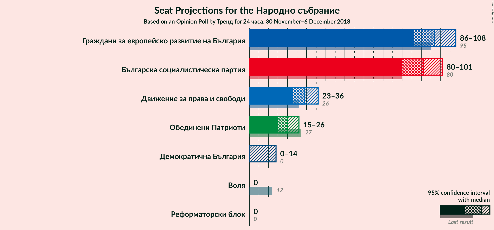
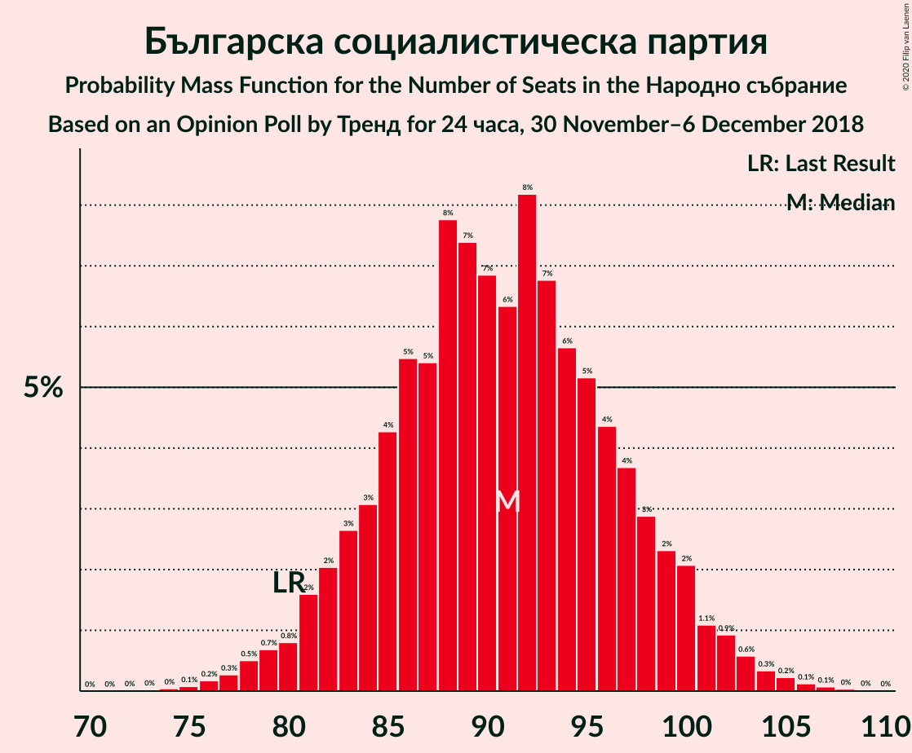
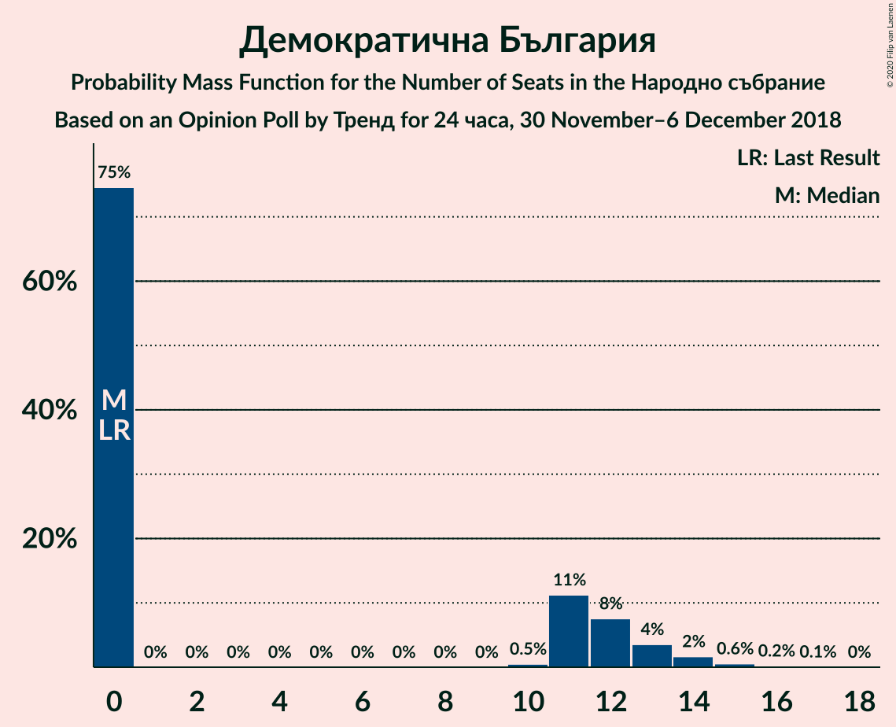
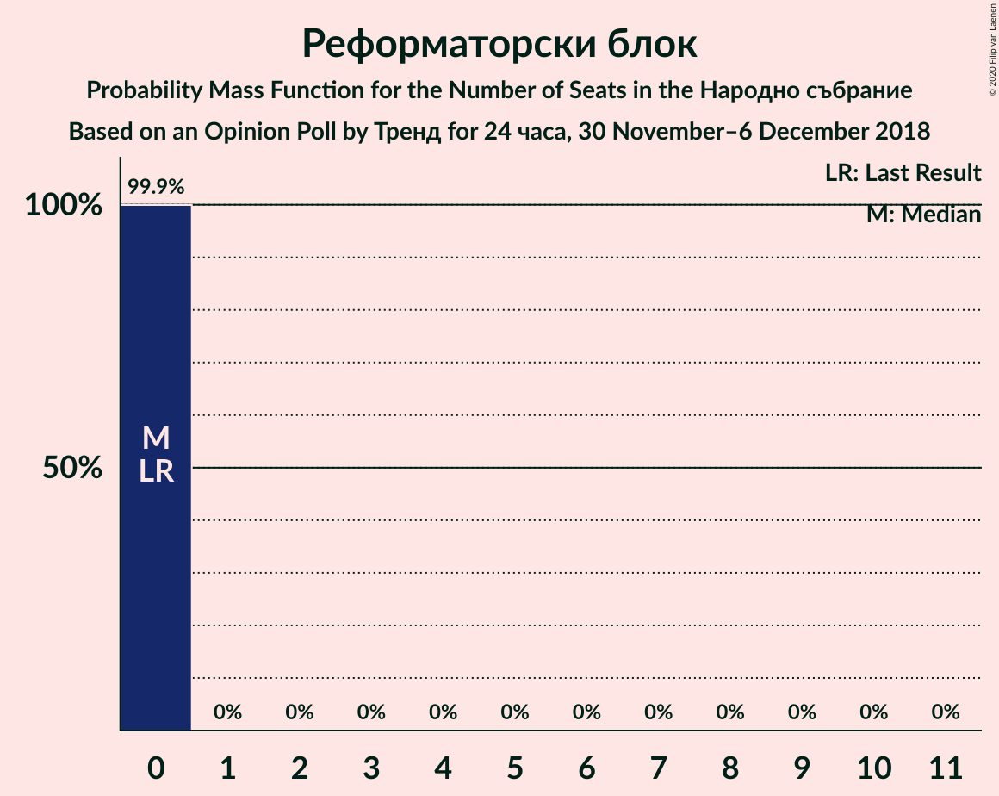
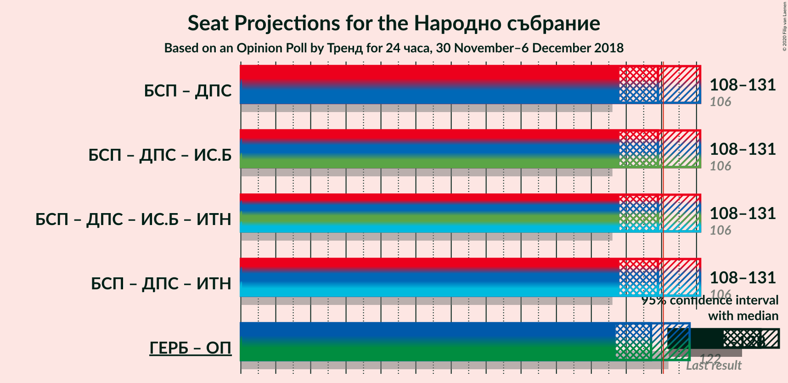

# Opinion Poll by Тренд for 24 часа, 30 November–6 December 2018

<a href="#voting-intentions">Voting Intentions</a> | <a href="#seats">Seats</a> | <a href="#coalitions">Coalitions</a> | <a href="#technical-information">Technical Information</a>

## Voting Intentions

### Confidence Intervals

| Party | Last Result | Poll Result | 80% Confidence Interval | 90% Confidence Interval | 95% Confidence Interval | 99% Confidence Interval |
|:-----:|:-----------:|:-----------:|:-----------------------:|:-----------------------:|:-----------------------:|:-----------------------:|
| Граждани за европейско развитие на България | 33.5% | 36.0% | 33.6–38.6% |32.9–39.3% |32.3–39.9% |31.2–41.1% |
| Българска социалистическа партия | 27.9% | 33.6% | 31.2–36.1% |30.6–36.8% |30.0–37.4% |28.9–38.6% |
| Движение за права и свободи | 9.2% | 10.7% | 9.2–12.4% |8.8–12.9% |8.5–13.4% |7.8–14.2% |
| Обединени Патриоти | 9.3% | 7.3% | 6.1–8.8% |5.8–9.2% |5.5–9.6% |5.0–10.4% |
| Демократична България | 0.0% | 3.4% | 2.6–4.5% |2.4–4.8% |2.2–5.1% |1.9–5.7% |
| Воля | 4.3% | 2.3% | 1.7–3.2% |1.5–3.5% |1.4–3.8% |1.1–4.3% |
| Реформаторски блок | 3.1% | 1.6% | 1.1–2.5% |1.0–2.7% |0.9–3.0% |0.7–3.4% |

*Note:* The poll result column reflects the actual value used in the calculations. Published results may vary slightly, and in addition be rounded to fewer digits.

## Seats

### Confidence Intervals

| Party | Last Result | Median | 80% Confidence Interval | 90% Confidence Interval | 95% Confidence Interval | 99% Confidence Interval |
|:-----:|:-----------:|:------:|:-----------------------:|:-----------------------:|:-----------------------:|:-----------------------:|
| <a href="#граждани-за-европейско-развитие-на-българия">Граждани за европейско развитие на България</a> | 95 | 96 | 90–103 |89–107 |87–108 |84–112 |
| <a href="#българска-социалистическа-партия">Българска социалистическа партия</a> | 80 | 91 | 84–99 |82–100 |81–101 |77–104 |
| <a href="#движение-за-права-и-свободи">Движение за права и свободи</a> | 26 | 28 | 25–34 |23–36 |23–37 |21–39 |
| <a href="#обединени-патриоти">Обединени Патриоти</a> | 27 | 19 | 16–24 |15–25 |14–26 |13–28 |
| <a href="#демократична-българия">Демократична България</a> | 0 | 0 | 0–12 |0–13 |0–13 |0–15 |
| <a href="#воля">Воля</a> | 12 | 0 | 0 |0 |0 |0–11 |
| <a href="#реформаторски-блок">Реформаторски блок</a> | 0 | 0 | 0 |0 |0 |0 |

### Граждани за европейско развитие на България

*For a full overview of the results for this party, see the [Граждани за европейско развитие на България](party-гражданизаевропейскоразвитиенабългария.html) page.*

| Number of Seats | Probability | Accumulated | Special Marks |
|:---------------:|:-----------:|:-----------:|:-------------:|
| 79 | 0% | 100% |  |
| 80 | 0% | 99.9% |  |
| 81 | 0.1% | 99.9% |  |
| 82 | 0.2% | 99.8% |  |
| 83 | 0.1% | 99.7% |  |
| 84 | 0.3% | 99.5% |  |
| 85 | 0.3% | 99.3% |  |
| 86 | 1.0% | 99.0% |  |
| 87 | 1.3% | 98% |  |
| 88 | 1.0% | 97% |  |
| 89 | 4% | 96% |  |
| 90 | 5% | 92% |  |
| 91 | 4% | 87% |  |
| 92 | 2% | 83% |  |
| 93 | 5% | 80% |  |
| 94 | 11% | 76% |  |
| 95 | 11% | 65% | Last Result |
| 96 | 10% | 54% | Median |
| 97 | 12% | 44% |  |
| 98 | 4% | 32% |  |
| 99 | 2% | 28% |  |
| 100 | 5% | 26% |  |
| 101 | 6% | 21% |  |
| 102 | 2% | 15% |  |
| 103 | 3% | 13% |  |
| 104 | 3% | 10% |  |
| 105 | 1.3% | 7% |  |
| 106 | 0.4% | 5% |  |
| 107 | 1.0% | 5% |  |
| 108 | 2% | 4% |  |
| 109 | 0.4% | 2% |  |
| 110 | 1.0% | 2% |  |
| 111 | 0.4% | 1.0% |  |
| 112 | 0.3% | 0.6% |  |
| 113 | 0% | 0.3% |  |
| 114 | 0.2% | 0.3% |  |
| 115 | 0.1% | 0.1% |  |
| 116 | 0% | 0% |  |

### Българска социалистическа партия

*For a full overview of the results for this party, see the [Българска социалистическа партия](party-българскасоциалистическапартия.html) page.*

| Number of Seats | Probability | Accumulated | Special Marks |
|:---------------:|:-----------:|:-----------:|:-------------:|
| 74 | 0% | 100% |  |
| 75 | 0.1% | 99.9% |  |
| 76 | 0.2% | 99.8% |  |
| 77 | 0.2% | 99.6% |  |
| 78 | 0.5% | 99.5% |  |
| 79 | 0.5% | 99.0% |  |
| 80 | 0.8% | 98.5% | Last Result |
| 81 | 2% | 98% |  |
| 82 | 4% | 96% |  |
| 83 | 1.4% | 91% |  |
| 84 | 3% | 90% |  |
| 85 | 4% | 87% |  |
| 86 | 4% | 84% |  |
| 87 | 2% | 80% |  |
| 88 | 10% | 78% |  |
| 89 | 11% | 68% |  |
| 90 | 5% | 57% |  |
| 91 | 7% | 52% | Median |
| 92 | 8% | 45% |  |
| 93 | 5% | 37% |  |
| 94 | 3% | 31% |  |
| 95 | 3% | 28% |  |
| 96 | 8% | 25% |  |
| 97 | 3% | 17% |  |
| 98 | 1.0% | 14% |  |
| 99 | 7% | 13% |  |
| 100 | 3% | 6% |  |
| 101 | 1.4% | 3% |  |
| 102 | 0.6% | 2% |  |
| 103 | 0.5% | 1.1% |  |
| 104 | 0.2% | 0.6% |  |
| 105 | 0.1% | 0.3% |  |
| 106 | 0.1% | 0.2% |  |
| 107 | 0.1% | 0.1% |  |
| 108 | 0% | 0% |  |

### Движение за права и свободи

*For a full overview of the results for this party, see the [Движение за права и свободи](party-движениезаправаисвободи.html) page.*

| Number of Seats | Probability | Accumulated | Special Marks |
|:---------------:|:-----------:|:-----------:|:-------------:|
| 19 | 0.1% | 100% |  |
| 20 | 0.2% | 99.9% |  |
| 21 | 0.3% | 99.7% |  |
| 22 | 2% | 99.4% |  |
| 23 | 4% | 98% |  |
| 24 | 3% | 94% |  |
| 25 | 6% | 91% |  |
| 26 | 8% | 85% | Last Result |
| 27 | 17% | 77% |  |
| 28 | 11% | 61% | Median |
| 29 | 7% | 49% |  |
| 30 | 8% | 42% |  |
| 31 | 6% | 34% |  |
| 32 | 11% | 28% |  |
| 33 | 5% | 17% |  |
| 34 | 4% | 12% |  |
| 35 | 2% | 8% |  |
| 36 | 1.4% | 6% |  |
| 37 | 4% | 4% |  |
| 38 | 0.2% | 0.7% |  |
| 39 | 0.3% | 0.5% |  |
| 40 | 0.1% | 0.2% |  |
| 41 | 0.1% | 0.1% |  |
| 42 | 0% | 0% |  |

### Обединени Патриоти

*For a full overview of the results for this party, see the [Обединени Патриоти](party-обединенипатриоти.html) page.*

| Number of Seats | Probability | Accumulated | Special Marks |
|:---------------:|:-----------:|:-----------:|:-------------:|
| 12 | 0.1% | 100% |  |
| 13 | 0.5% | 99.9% |  |
| 14 | 2% | 99.3% |  |
| 15 | 2% | 97% |  |
| 16 | 5% | 95% |  |
| 17 | 9% | 89% |  |
| 18 | 24% | 80% |  |
| 19 | 7% | 56% | Median |
| 20 | 7% | 48% |  |
| 21 | 14% | 41% |  |
| 22 | 12% | 27% |  |
| 23 | 4% | 15% |  |
| 24 | 2% | 11% |  |
| 25 | 4% | 8% |  |
| 26 | 3% | 4% |  |
| 27 | 0.8% | 1.4% | Last Result |
| 28 | 0.3% | 0.6% |  |
| 29 | 0.2% | 0.4% |  |
| 30 | 0.2% | 0.2% |  |
| 31 | 0% | 0% |  |

### Демократична България

*For a full overview of the results for this party, see the [Демократична България](party-демократичнабългария.html) page.*

| Number of Seats | Probability | Accumulated | Special Marks |
|:---------------:|:-----------:|:-----------:|:-------------:|
| 0 | 69% | 100% | Last Result, Median |
| 1 | 0% | 31% |  |
| 2 | 0% | 31% |  |
| 3 | 0% | 31% |  |
| 4 | 0% | 31% |  |
| 5 | 0% | 31% |  |
| 6 | 0% | 31% |  |
| 7 | 0% | 31% |  |
| 8 | 0% | 31% |  |
| 9 | 0% | 31% |  |
| 10 | 0.1% | 31% |  |
| 11 | 15% | 31% |  |
| 12 | 10% | 16% |  |
| 13 | 3% | 6% |  |
| 14 | 1.4% | 2% |  |
| 15 | 0.6% | 0.9% |  |
| 16 | 0.2% | 0.3% |  |
| 17 | 0.1% | 0.1% |  |
| 18 | 0% | 0% |  |

### Воля

*For a full overview of the results for this party, see the [Воля](party-воля.html) page.*

| Number of Seats | Probability | Accumulated | Special Marks |
|:---------------:|:-----------:|:-----------:|:-------------:|
| 0 | 98.9% | 100% | Median |
| 1 | 0% | 1.1% |  |
| 2 | 0% | 1.1% |  |
| 3 | 0% | 1.1% |  |
| 4 | 0% | 1.1% |  |
| 5 | 0% | 1.1% |  |
| 6 | 0% | 1.1% |  |
| 7 | 0% | 1.1% |  |
| 8 | 0% | 1.1% |  |
| 9 | 0% | 1.1% |  |
| 10 | 0% | 1.1% |  |
| 11 | 0.8% | 1.1% |  |
| 12 | 0.2% | 0.3% | Last Result |
| 13 | 0.1% | 0.1% |  |
| 14 | 0% | 0% |  |

### Реформаторски блок

*For a full overview of the results for this party, see the [Реформаторски блок](party-реформаторскиблок.html) page.*

| Number of Seats | Probability | Accumulated | Special Marks |
|:---------------:|:-----------:|:-----------:|:-------------:|
| 0 | 100% | 100% | Last Result, Median |

## Coalitions

### Confidence Intervals

| Coalition | Last Result | Median | Majority? | 80% Confidence Interval | 90% Confidence Interval | 95% Confidence Interval | 99% Confidence Interval |
|:---------:|:-----------:|:------:|:---------:|:-----------------------:|:-----------------------:|:-----------------------:|:-----------------------:|
| Българска социалистическа партия – Движение за права и свободи | 106 | 121 | 51% | 112–128 | 111–129 | 110–130 | 104–131 |
| Граждани за европейско развитие на България – Обединени Патриоти | 122 | 115 | 19% | 111–126 | 110–128 | 110–129 | 101–130 |

### Българска социалистическа партия – Движение за права и свободи

| Number of Seats | Probability | Accumulated | Special Marks |
|:---------------:|:-----------:|:-----------:|:-------------:|
| 100 | 0% | 100% |  |
| 101 | 0.1% | 99.9% |  |
| 102 | 0.1% | 99.8% |  |
| 103 | 0% | 99.8% |  |
| 104 | 0.3% | 99.8% |  |
| 105 | 0.4% | 99.5% |  |
| 106 | 0.2% | 99.1% | Last Result |
| 107 | 0.3% | 98.9% |  |
| 108 | 0.4% | 98.6% |  |
| 109 | 0.5% | 98% |  |
| 110 | 3% | 98% |  |
| 111 | 4% | 95% |  |
| 112 | 2% | 91% |  |
| 113 | 2% | 90% |  |
| 114 | 7% | 87% |  |
| 115 | 10% | 81% |  |
| 116 | 11% | 70% |  |
| 117 | 3% | 60% |  |
| 118 | 3% | 57% |  |
| 119 | 3% | 54% | Median |
| 120 | 0.5% | 52% |  |
| 121 | 2% | 51% | Majority |
| 122 | 6% | 50% |  |
| 123 | 3% | 43% |  |
| 124 | 4% | 40% |  |
| 125 | 15% | 36% |  |
| 126 | 8% | 22% |  |
| 127 | 3% | 14% |  |
| 128 | 4% | 11% |  |
| 129 | 5% | 8% |  |
| 130 | 2% | 3% |  |
| 131 | 0.1% | 0.5% |  |
| 132 | 0.1% | 0.5% |  |
| 133 | 0.2% | 0.4% |  |
| 134 | 0% | 0.1% |  |
| 135 | 0% | 0.1% |  |
| 136 | 0% | 0.1% |  |
| 137 | 0% | 0.1% |  |
| 138 | 0% | 0.1% |  |
| 139 | 0% | 0.1% |  |
| 140 | 0% | 0% |  |

### Граждани за европейско развитие на България – Обединени Патриоти

| Number of Seats | Probability | Accumulated | Special Marks |
|:---------------:|:-----------:|:-----------:|:-------------:|
| 98 | 0% | 100% |  |
| 99 | 0.2% | 99.9% |  |
| 100 | 0% | 99.7% |  |
| 101 | 0.3% | 99.7% |  |
| 102 | 0.3% | 99.4% |  |
| 103 | 0% | 99.1% |  |
| 104 | 0.2% | 99.1% |  |
| 105 | 0.2% | 98.9% |  |
| 106 | 0.1% | 98.7% |  |
| 107 | 0.3% | 98.6% |  |
| 108 | 0.4% | 98% |  |
| 109 | 0.4% | 98% |  |
| 110 | 4% | 98% |  |
| 111 | 6% | 93% |  |
| 112 | 4% | 87% |  |
| 113 | 22% | 83% |  |
| 114 | 9% | 61% |  |
| 115 | 15% | 53% | Median |
| 116 | 6% | 38% |  |
| 117 | 4% | 31% |  |
| 118 | 6% | 27% |  |
| 119 | 1.5% | 21% |  |
| 120 | 0.1% | 20% |  |
| 121 | 0.6% | 19% | Majority |
| 122 | 2% | 19% | Last Result |
| 123 | 2% | 17% |  |
| 124 | 0.9% | 15% |  |
| 125 | 3% | 14% |  |
| 126 | 5% | 12% |  |
| 127 | 1.4% | 7% |  |
| 128 | 1.0% | 5% |  |
| 129 | 2% | 4% |  |
| 130 | 1.4% | 2% |  |
| 131 | 0.1% | 0.4% |  |
| 132 | 0.1% | 0.3% |  |
| 133 | 0.2% | 0.2% |  |
| 134 | 0% | 0% |  |

## Technical Information

### Opinion Poll

+ **Polling firm:** Тренд
+ **Commissioner(s):** 24 часа
+ **Fieldwork period:** 30 November–6 December 2018

### Calculations

+ **Sample size:** 619
+ **Simulations done:** 131,072
+ **Error estimate:** 2.04%

