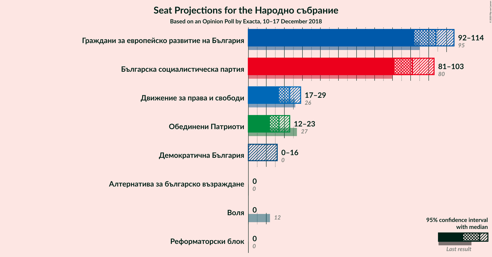
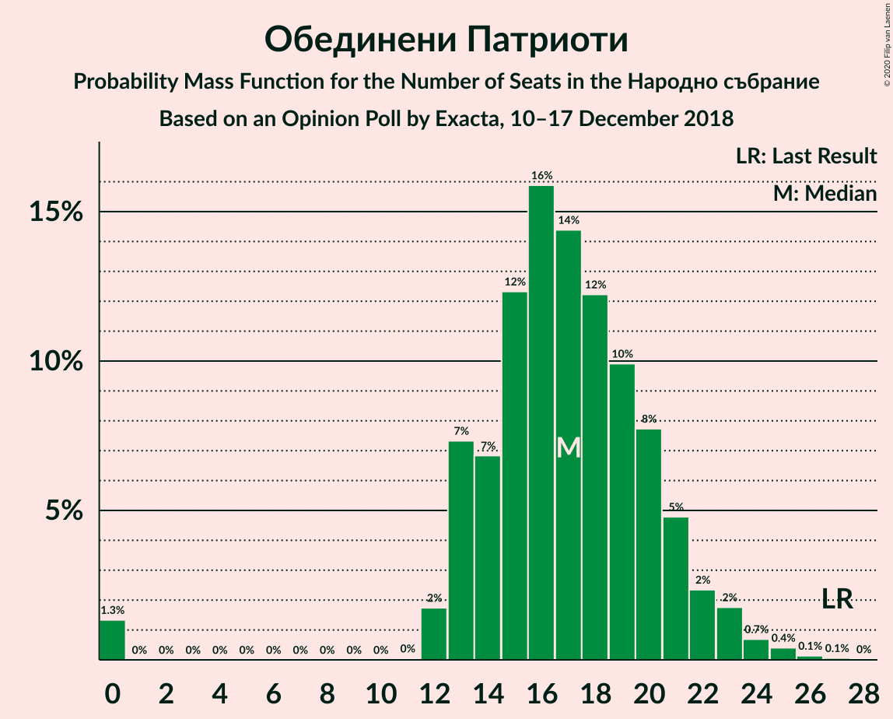

# Opinion Poll by Exacta, 10–17 December 2018

<a href="#voting-intentions">Voting Intentions</a> | <a href="#seats">Seats</a> | <a href="#coalitions">Coalitions</a> | <a href="#technical-information">Technical Information</a>

## Voting Intentions

### Confidence Intervals

| Party | Last Result | Poll Result | 80% Confidence Interval | 90% Confidence Interval | 95% Confidence Interval | 99% Confidence Interval |
|:-----:|:-----------:|:-----------:|:-----------------------:|:-----------------------:|:-----------------------:|:-----------------------:|
| Граждани за европейско развитие на България | 33.5% | 35.8% | 33.4–38.2% |32.8–38.9% |32.2–39.5% |31.1–40.7% |
| Българска социалистическа партия | 27.9% | 31.7% | 29.4–34.1% |28.8–34.7% |28.2–35.3% |27.2–36.5% |
| Движение за права и свободи | 9.2% | 7.7% | 6.5–9.2% |6.2–9.6% |5.9–10.0% |5.4–10.8% |
| Обединени Патриоти | 9.3% | 5.8% | 4.7–7.1% |4.5–7.5% |4.2–7.8% |3.8–8.5% |
| Демократична България | 0.0% | 3.8% | 3.0–4.9% |2.8–5.2% |2.6–5.5% |2.2–6.1% |
| Алтернатива за българско възраждане | 1.6% | 1.5% | 1.1–2.3% |0.9–2.6% |0.8–2.8% |0.7–3.2% |
| Воля | 4.3% | 1.5% | 1.1–2.3% |0.9–2.6% |0.8–2.8% |0.7–3.2% |
| Реформаторски блок | 3.1% | 1.5% | 1.1–2.3% |0.9–2.6% |0.8–2.8% |0.7–3.2% |

*Note:* The poll result column reflects the actual value used in the calculations. Published results may vary slightly, and in addition be rounded to fewer digits.

## Seats

### Confidence Intervals

| Party | Last Result | Median | 80% Confidence Interval | 90% Confidence Interval | 95% Confidence Interval | 99% Confidence Interval |
|:-----:|:-----------:|:------:|:-----------------------:|:-----------------------:|:-----------------------:|:-----------------------:|
| <a href="#граждани-за-европейско-развитие-на-българия">Граждани за европейско развитие на България</a> | 95 | 108 | 95–114 |93–115 |93–115 |91–117 |
| <a href="#българска-социалистическа-партия">Българска социалистическа партия</a> | 80 | 88 | 82–99 |79–105 |78–105 |77–106 |
| <a href="#движение-за-права-и-свободи">Движение за права и свободи</a> | 26 | 20 | 19–27 |18–28 |16–31 |14–31 |
| <a href="#обединени-патриоти">Обединени Патриоти</a> | 27 | 18 | 12–23 |12–23 |0–23 |0–24 |
| <a href="#демократична-българия">Демократична България</a> | 0 | 0 | 0–13 |0–15 |0–17 |0–17 |
| <a href="#алтернатива-за-българско-възраждане">Алтернатива за българско възраждане</a> | 0 | 0 | 0 |0 |0 |0 |
| <a href="#воля">Воля</a> | 12 | 0 | 0 |0 |0 |0 |
| <a href="#реформаторски-блок">Реформаторски блок</a> | 0 | 0 | 0 |0 |0 |0 |

### Граждани за европейско развитие на България

*For a full overview of the results for this party, see the [Граждани за европейско развитие на България](party-гражданизаевропейскоразвитиенабългария.html) page.*

| Number of Seats | Probability | Accumulated | Special Marks |
|:---------------:|:-----------:|:-----------:|:-------------:|
| 87 | 0.1% | 100% |  |
| 88 | 0% | 99.9% |  |
| 89 | 0% | 99.9% |  |
| 90 | 0.1% | 99.8% |  |
| 91 | 0.9% | 99.7% |  |
| 92 | 1.1% | 98.8% |  |
| 93 | 3% | 98% |  |
| 94 | 0.6% | 95% |  |
| 95 | 5% | 94% | Last Result |
| 96 | 0.5% | 89% |  |
| 97 | 0.8% | 88% |  |
| 98 | 6% | 87% |  |
| 99 | 7% | 81% |  |
| 100 | 0.5% | 74% |  |
| 101 | 0.7% | 73% |  |
| 102 | 2% | 73% |  |
| 103 | 7% | 71% |  |
| 104 | 2% | 64% |  |
| 105 | 0.7% | 62% |  |
| 106 | 2% | 62% |  |
| 107 | 7% | 59% |  |
| 108 | 4% | 53% | Median |
| 109 | 2% | 48% |  |
| 110 | 0.4% | 46% |  |
| 111 | 2% | 45% |  |
| 112 | 2% | 43% |  |
| 113 | 2% | 41% |  |
| 114 | 31% | 39% |  |
| 115 | 8% | 9% |  |
| 116 | 0.1% | 0.9% |  |
| 117 | 0.3% | 0.8% |  |
| 118 | 0.2% | 0.5% |  |
| 119 | 0.1% | 0.3% |  |
| 120 | 0.1% | 0.2% |  |
| 121 | 0% | 0.2% | Majority |
| 122 | 0% | 0.2% |  |
| 123 | 0.1% | 0.2% |  |
| 124 | 0% | 0% |  |

### Българска социалистическа партия

*For a full overview of the results for this party, see the [Българска социалистическа партия](party-българскасоциалистическапартия.html) page.*

| Number of Seats | Probability | Accumulated | Special Marks |
|:---------------:|:-----------:|:-----------:|:-------------:|
| 73 | 0.3% | 100% |  |
| 74 | 0% | 99.7% |  |
| 75 | 0% | 99.7% |  |
| 76 | 0.1% | 99.7% |  |
| 77 | 2% | 99.6% |  |
| 78 | 0.2% | 98% |  |
| 79 | 4% | 97% |  |
| 80 | 0.3% | 94% | Last Result |
| 81 | 0.1% | 93% |  |
| 82 | 8% | 93% |  |
| 83 | 5% | 86% |  |
| 84 | 0.9% | 81% |  |
| 85 | 0.6% | 80% |  |
| 86 | 1.5% | 79% |  |
| 87 | 0.4% | 78% |  |
| 88 | 31% | 77% | Median |
| 89 | 14% | 46% |  |
| 90 | 7% | 33% |  |
| 91 | 2% | 25% |  |
| 92 | 3% | 23% |  |
| 93 | 6% | 20% |  |
| 94 | 0.1% | 14% |  |
| 95 | 0.8% | 14% |  |
| 96 | 0.4% | 13% |  |
| 97 | 2% | 13% |  |
| 98 | 0.6% | 11% |  |
| 99 | 1.1% | 10% |  |
| 100 | 2% | 9% |  |
| 101 | 0.5% | 7% |  |
| 102 | 0.1% | 6% |  |
| 103 | 0% | 6% |  |
| 104 | 0.4% | 6% |  |
| 105 | 5% | 6% |  |
| 106 | 0.1% | 0.5% |  |
| 107 | 0% | 0.4% |  |
| 108 | 0% | 0.4% |  |
| 109 | 0.2% | 0.4% |  |
| 110 | 0% | 0.2% |  |
| 111 | 0.1% | 0.1% |  |
| 112 | 0% | 0% |  |

### Движение за права и свободи

*For a full overview of the results for this party, see the [Движение за права и свободи](party-движениезаправаисвободи.html) page.*

| Number of Seats | Probability | Accumulated | Special Marks |
|:---------------:|:-----------:|:-----------:|:-------------:|
| 13 | 0.1% | 100% |  |
| 14 | 1.1% | 99.9% |  |
| 15 | 0.9% | 98.9% |  |
| 16 | 0.9% | 98% |  |
| 17 | 1.0% | 97% |  |
| 18 | 1.1% | 96% |  |
| 19 | 19% | 95% |  |
| 20 | 34% | 76% | Median |
| 21 | 5% | 43% |  |
| 22 | 4% | 37% |  |
| 23 | 4% | 33% |  |
| 24 | 4% | 29% |  |
| 25 | 7% | 25% |  |
| 26 | 2% | 18% | Last Result |
| 27 | 7% | 16% |  |
| 28 | 6% | 9% |  |
| 29 | 0.2% | 4% |  |
| 30 | 0.9% | 4% |  |
| 31 | 2% | 3% |  |
| 32 | 0% | 0.3% |  |
| 33 | 0.1% | 0.3% |  |
| 34 | 0% | 0.2% |  |
| 35 | 0.2% | 0.2% |  |
| 36 | 0% | 0% |  |

### Обединени Патриоти

*For a full overview of the results for this party, see the [Обединени Патриоти](party-обединенипатриоти.html) page.*

| Number of Seats | Probability | Accumulated | Special Marks |
|:---------------:|:-----------:|:-----------:|:-------------:|
| 0 | 3% | 100% |  |
| 1 | 0% | 97% |  |
| 2 | 0% | 97% |  |
| 3 | 0% | 97% |  |
| 4 | 0% | 97% |  |
| 5 | 0% | 97% |  |
| 6 | 0% | 97% |  |
| 7 | 0% | 97% |  |
| 8 | 0% | 97% |  |
| 9 | 0% | 97% |  |
| 10 | 0% | 97% |  |
| 11 | 0% | 97% |  |
| 12 | 7% | 97% |  |
| 13 | 8% | 90% |  |
| 14 | 2% | 82% |  |
| 15 | 8% | 80% |  |
| 16 | 0.7% | 72% |  |
| 17 | 9% | 71% |  |
| 18 | 33% | 62% | Median |
| 19 | 14% | 30% |  |
| 20 | 0.5% | 16% |  |
| 21 | 3% | 16% |  |
| 22 | 1.1% | 12% |  |
| 23 | 10% | 11% |  |
| 24 | 0.9% | 1.2% |  |
| 25 | 0.1% | 0.3% |  |
| 26 | 0% | 0.2% |  |
| 27 | 0.1% | 0.2% | Last Result |
| 28 | 0% | 0.1% |  |
| 29 | 0% | 0.1% |  |
| 30 | 0.1% | 0.1% |  |
| 31 | 0% | 0% |  |

### Демократична България

*For a full overview of the results for this party, see the [Демократична България](party-демократичнабългария.html) page.*

| Number of Seats | Probability | Accumulated | Special Marks |
|:---------------:|:-----------:|:-----------:|:-------------:|
| 0 | 62% | 100% | Last Result, Median |
| 1 | 0% | 38% |  |
| 2 | 0% | 38% |  |
| 3 | 0% | 38% |  |
| 4 | 0% | 38% |  |
| 5 | 0% | 38% |  |
| 6 | 0% | 38% |  |
| 7 | 0% | 38% |  |
| 8 | 0% | 38% |  |
| 9 | 0% | 38% |  |
| 10 | 0% | 38% |  |
| 11 | 3% | 38% |  |
| 12 | 18% | 35% |  |
| 13 | 10% | 16% |  |
| 14 | 0.4% | 6% |  |
| 15 | 1.3% | 6% |  |
| 16 | 1.0% | 5% |  |
| 17 | 3% | 4% |  |
| 18 | 0.1% | 0.3% |  |
| 19 | 0.1% | 0.2% |  |
| 20 | 0.1% | 0.1% |  |
| 21 | 0% | 0% |  |

### Алтернатива за българско възраждане

*For a full overview of the results for this party, see the [Алтернатива за българско възраждане](party-алтернативазабългарсковъзраждане.html) page.*

| Number of Seats | Probability | Accumulated | Special Marks |
|:---------------:|:-----------:|:-----------:|:-------------:|
| 0 | 99.9% | 100% | Last Result, Median |
| 1 | 0% | 0.1% |  |
| 2 | 0% | 0.1% |  |
| 3 | 0% | 0.1% |  |
| 4 | 0% | 0.1% |  |
| 5 | 0% | 0.1% |  |
| 6 | 0% | 0.1% |  |
| 7 | 0% | 0.1% |  |
| 8 | 0% | 0.1% |  |
| 9 | 0% | 0.1% |  |
| 10 | 0% | 0.1% |  |
| 11 | 0% | 0.1% |  |
| 12 | 0% | 0% |  |

### Воля

*For a full overview of the results for this party, see the [Воля](party-воля.html) page.*

| Number of Seats | Probability | Accumulated | Special Marks |
|:---------------:|:-----------:|:-----------:|:-------------:|
| 0 | 99.8% | 100% | Median |
| 1 | 0% | 0.2% |  |
| 2 | 0% | 0.2% |  |
| 3 | 0% | 0.2% |  |
| 4 | 0% | 0.2% |  |
| 5 | 0% | 0.2% |  |
| 6 | 0% | 0.2% |  |
| 7 | 0% | 0.2% |  |
| 8 | 0% | 0.2% |  |
| 9 | 0% | 0.2% |  |
| 10 | 0% | 0.2% |  |
| 11 | 0% | 0.2% |  |
| 12 | 0.2% | 0.2% | Last Result |
| 13 | 0% | 0% |  |

### Реформаторски блок

*For a full overview of the results for this party, see the [Реформаторски блок](party-реформаторскиблок.html) page.*

| Number of Seats | Probability | Accumulated | Special Marks |
|:---------------:|:-----------:|:-----------:|:-------------:|
| 0 | 100% | 100% | Last Result, Median |

## Coalitions

### Confidence Intervals

| Coalition | Last Result | Median | Majority? | 80% Confidence Interval | 90% Confidence Interval | 95% Confidence Interval | 99% Confidence Interval |
|:---------:|:-----------:|:------:|:---------:|:-----------------------:|:-----------------------:|:-----------------------:|:-----------------------:|
| Граждани за европейско развитие на България – Обединени Патриоти | 122 | 126 | 69% | 110–132 | 110–132 | 109–132 | 104–137 |
| Българска социалистическа партия – Движение за права и свободи | 106 | 108 | 10% | 101–123 | 101–130 | 98–131 | 98–131 |

### Граждани за европейско развитие на България – Обединени Патриоти

| Number of Seats | Probability | Accumulated | Special Marks |
|:---------------:|:-----------:|:-----------:|:-------------:|
| 99 | 0.2% | 100% |  |
| 100 | 0% | 99.7% |  |
| 101 | 0% | 99.7% |  |
| 102 | 0% | 99.7% |  |
| 103 | 0.1% | 99.7% |  |
| 104 | 0.1% | 99.5% |  |
| 105 | 2% | 99.4% |  |
| 106 | 0.1% | 98% |  |
| 107 | 0% | 98% |  |
| 108 | 0% | 98% |  |
| 109 | 2% | 98% |  |
| 110 | 6% | 95% |  |
| 111 | 13% | 90% |  |
| 112 | 3% | 77% |  |
| 113 | 0.2% | 74% |  |
| 114 | 0.2% | 74% |  |
| 115 | 0.4% | 74% |  |
| 116 | 0.2% | 73% |  |
| 117 | 3% | 73% |  |
| 118 | 1.0% | 70% |  |
| 119 | 0.1% | 69% |  |
| 120 | 0.5% | 69% |  |
| 121 | 2% | 69% | Majority |
| 122 | 0.1% | 67% | Last Result |
| 123 | 0.2% | 67% |  |
| 124 | 1.1% | 67% |  |
| 125 | 0.7% | 65% |  |
| 126 | 15% | 65% | Median |
| 127 | 2% | 49% |  |
| 128 | 0.1% | 47% |  |
| 129 | 0.7% | 47% |  |
| 130 | 1.1% | 47% |  |
| 131 | 6% | 46% |  |
| 132 | 38% | 40% |  |
| 133 | 0.7% | 2% |  |
| 134 | 0.1% | 0.9% |  |
| 135 | 0.1% | 0.9% |  |
| 136 | 0% | 0.8% |  |
| 137 | 0.7% | 0.8% |  |
| 138 | 0% | 0.1% |  |
| 139 | 0% | 0.1% |  |
| 140 | 0% | 0.1% |  |
| 141 | 0% | 0.1% |  |
| 142 | 0% | 0% |  |

### Българска социалистическа партия – Движение за права и свободи

| Number of Seats | Probability | Accumulated | Special Marks |
|:---------------:|:-----------:|:-----------:|:-------------:|
| 95 | 0.2% | 100% |  |
| 96 | 0.2% | 99.7% |  |
| 97 | 0.1% | 99.6% |  |
| 98 | 4% | 99.5% |  |
| 99 | 0% | 96% |  |
| 100 | 0.1% | 96% |  |
| 101 | 9% | 96% |  |
| 102 | 1.4% | 87% |  |
| 103 | 0.8% | 85% |  |
| 104 | 0.1% | 85% |  |
| 105 | 0.1% | 85% |  |
| 106 | 1.5% | 84% | Last Result |
| 107 | 2% | 83% |  |
| 108 | 38% | 81% | Median |
| 109 | 3% | 42% |  |
| 110 | 1.3% | 39% |  |
| 111 | 3% | 38% |  |
| 112 | 1.0% | 35% |  |
| 113 | 0.3% | 34% |  |
| 114 | 8% | 33% |  |
| 115 | 0.2% | 26% |  |
| 116 | 1.1% | 26% |  |
| 117 | 13% | 24% |  |
| 118 | 0.1% | 12% |  |
| 119 | 0.1% | 12% |  |
| 120 | 1.2% | 12% |  |
| 121 | 0% | 10% | Majority |
| 122 | 0.1% | 10% |  |
| 123 | 1.3% | 10% |  |
| 124 | 0.2% | 9% |  |
| 125 | 0.1% | 9% |  |
| 126 | 0.1% | 9% |  |
| 127 | 0% | 9% |  |
| 128 | 0.3% | 9% |  |
| 129 | 0.1% | 8% |  |
| 130 | 6% | 8% |  |
| 131 | 2% | 3% |  |
| 132 | 0% | 0.2% |  |
| 133 | 0% | 0.2% |  |
| 134 | 0.1% | 0.2% |  |
| 135 | 0% | 0.2% |  |
| 136 | 0% | 0.1% |  |
| 137 | 0.1% | 0.1% |  |
| 138 | 0% | 0% |  |

## Technical Information

### Opinion Poll

+ **Polling firm:** Exacta
+ **Commissioner(s):** —
+ **Fieldwork period:** 10–17 December 2018

### Calculations

+ **Sample size:** 660
+ **Simulations done:** 16,384
+ **Error estimate:** 4.42%

