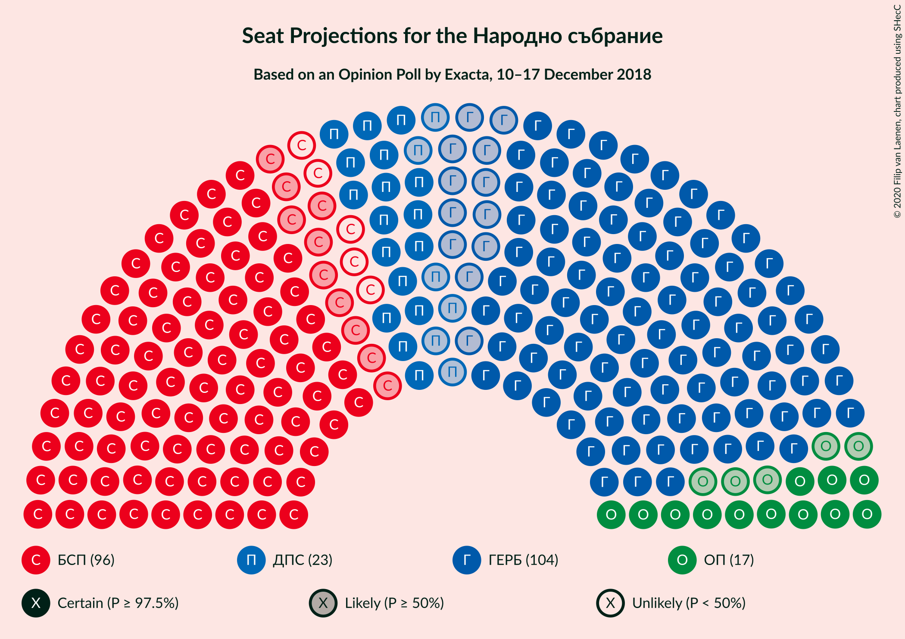
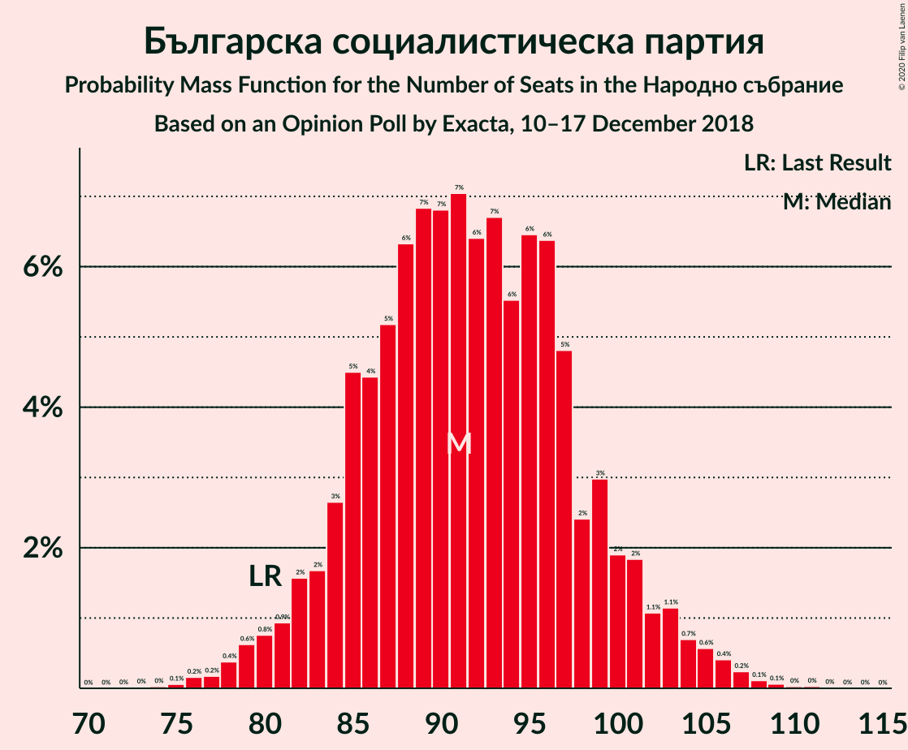
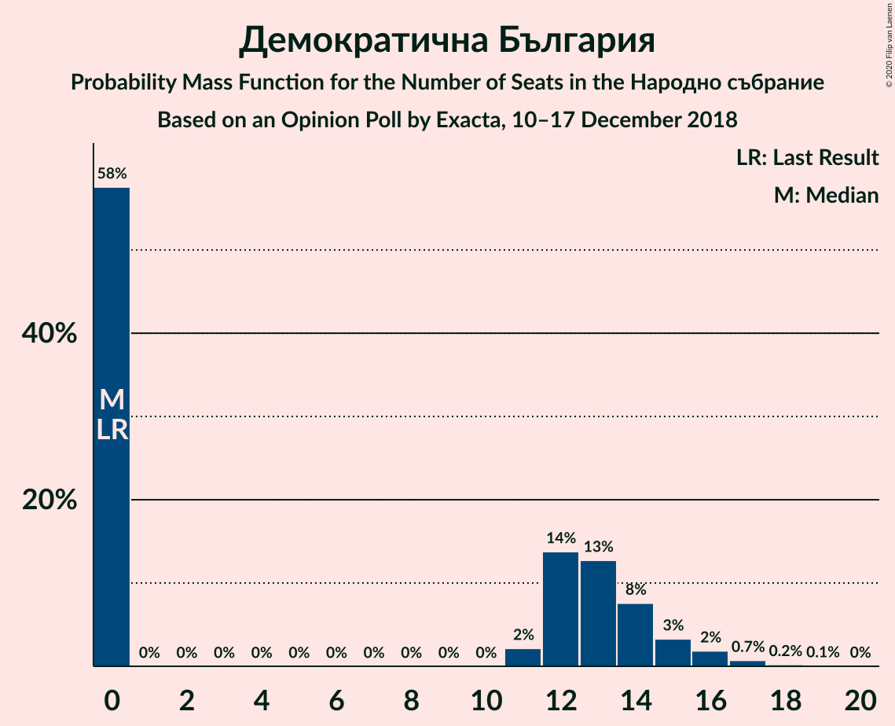
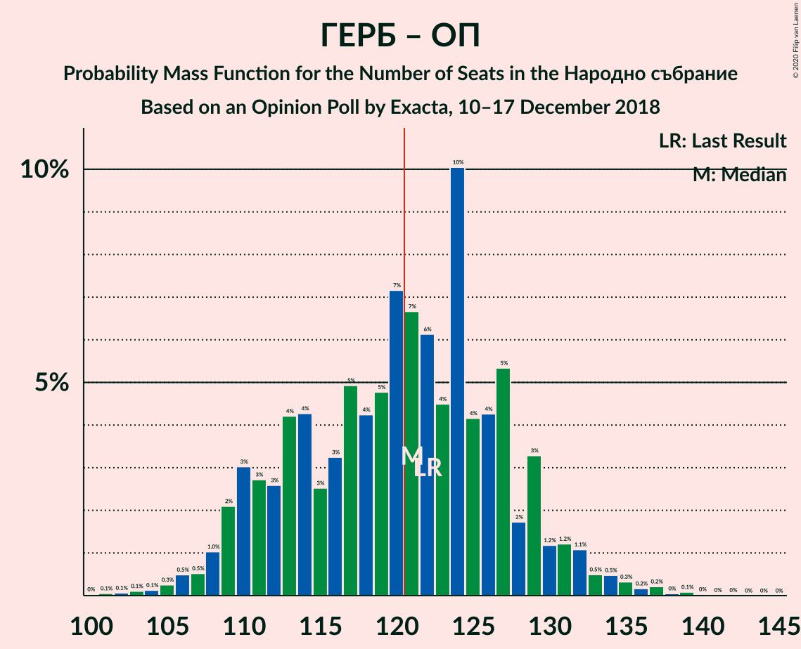

# Opinion Poll by Exacta, 10–17 December 2018

<a href="#voting-intentions">Voting Intentions</a> | <a href="#seats">Seats</a> | <a href="#coalitions">Coalitions</a> | <a href="#technical-information">Technical Information</a>

## Voting Intentions

### Confidence Intervals

| Party | Last Result | Poll Result | 80% Confidence Interval | 90% Confidence Interval | 95% Confidence Interval | 99% Confidence Interval |
|:-----:|:-----------:|:-----------:|:-----------------------:|:-----------------------:|:-----------------------:|:-----------------------:|
| Граждани за европейско развитие на България | 33.5% | 35.8% | 33.4–38.2% |32.8–38.9% |32.2–39.5% |31.1–40.7% |
| Българска социалистическа партия | 27.9% | 31.7% | 29.4–34.1% |28.8–34.7% |28.2–35.3% |27.2–36.5% |
| Движение за права и свободи | 9.2% | 7.7% | 6.5–9.2% |6.2–9.6% |5.9–10.0% |5.4–10.8% |
| Обединени Патриоти | 9.3% | 5.8% | 4.7–7.1% |4.5–7.5% |4.2–7.8% |3.8–8.5% |
| Демократична България | 0.0% | 3.8% | 3.0–4.9% |2.8–5.2% |2.6–5.5% |2.2–6.1% |
| Алтернатива за българско възраждане | 1.6% | 1.5% | 1.1–2.3% |0.9–2.6% |0.8–2.8% |0.7–3.2% |
| Воля | 4.3% | 1.5% | 1.1–2.3% |0.9–2.6% |0.8–2.8% |0.7–3.2% |
| Реформаторски блок | 3.1% | 1.5% | 1.1–2.3% |0.9–2.6% |0.8–2.8% |0.7–3.2% |

*Note:* The poll result column reflects the actual value used in the calculations. Published results may vary slightly, and in addition be rounded to fewer digits.

## Seats

### Confidence Intervals

| Party | Last Result | Median | 80% Confidence Interval | 90% Confidence Interval | 95% Confidence Interval | 99% Confidence Interval |
|:-----:|:-----------:|:------:|:-----------------------:|:-----------------------:|:-----------------------:|:-----------------------:|
| <a href="#граждани-за-европейско-развитие-на-българия">Граждани за европейско развитие на България</a> | 95 | 104 | 95–111 |94–113 |92–114 |89–118 |
| <a href="#българска-социалистическа-партия">Българска социалистическа партия</a> | 80 | 91 | 85–99 |83–101 |81–103 |78–106 |
| <a href="#движение-за-права-и-свободи">Движение за права и свободи</a> | 26 | 23 | 19–27 |17–28 |17–29 |15–31 |
| <a href="#обединени-патриоти">Обединени Патриоти</a> | 27 | 17 | 13–21 |13–22 |12–23 |0–25 |
| <a href="#демократична-българия">Демократична България</a> | 0 | 0 | 0–14 |0–15 |0–16 |0–17 |
| <a href="#алтернатива-за-българско-възраждане">Алтернатива за българско възраждане</a> | 0 | 0 | 0 |0 |0 |0 |
| <a href="#воля">Воля</a> | 12 | 0 | 0 |0 |0 |0 |
| <a href="#реформаторски-блок">Реформаторски блок</a> | 0 | 0 | 0 |0 |0 |0 |

### Граждани за европейско развитие на България

*For a full overview of the results for this party, see the [Граждани за европейско развитие на България](party-гражданизаевропейскоразвитиенабългария.html) page.*

| Number of Seats | Probability | Accumulated | Special Marks |
|:---------------:|:-----------:|:-----------:|:-------------:|
| 85 | 0% | 100% |  |
| 86 | 0.1% | 99.9% |  |
| 87 | 0.1% | 99.9% |  |
| 88 | 0.3% | 99.8% |  |
| 89 | 0.5% | 99.5% |  |
| 90 | 0.5% | 99.0% |  |
| 91 | 0.7% | 98.5% |  |
| 92 | 1.2% | 98% |  |
| 93 | 1.3% | 97% |  |
| 94 | 2% | 95% |  |
| 95 | 3% | 93% | Last Result |
| 96 | 3% | 90% |  |
| 97 | 3% | 87% |  |
| 98 | 5% | 84% |  |
| 99 | 5% | 79% |  |
| 100 | 6% | 74% |  |
| 101 | 6% | 68% |  |
| 102 | 5% | 62% |  |
| 103 | 6% | 57% |  |
| 104 | 8% | 51% | Median |
| 105 | 6% | 43% |  |
| 106 | 5% | 37% |  |
| 107 | 6% | 32% |  |
| 108 | 6% | 25% |  |
| 109 | 4% | 19% |  |
| 110 | 4% | 15% |  |
| 111 | 3% | 11% |  |
| 112 | 2% | 8% |  |
| 113 | 2% | 6% |  |
| 114 | 1.3% | 4% |  |
| 115 | 0.7% | 2% |  |
| 116 | 0.5% | 2% |  |
| 117 | 0.5% | 1.3% |  |
| 118 | 0.3% | 0.8% |  |
| 119 | 0.2% | 0.5% |  |
| 120 | 0.1% | 0.3% |  |
| 121 | 0.1% | 0.2% | Majority |
| 122 | 0% | 0.1% |  |
| 123 | 0% | 0.1% |  |
| 124 | 0% | 0% |  |

### Българска социалистическа партия

*For a full overview of the results for this party, see the [Българска социалистическа партия](party-българскасоциалистическапартия.html) page.*

| Number of Seats | Probability | Accumulated | Special Marks |
|:---------------:|:-----------:|:-----------:|:-------------:|
| 74 | 0% | 100% |  |
| 75 | 0.1% | 99.9% |  |
| 76 | 0.2% | 99.9% |  |
| 77 | 0.2% | 99.7% |  |
| 78 | 0.4% | 99.5% |  |
| 79 | 0.6% | 99.2% |  |
| 80 | 0.8% | 98.5% | Last Result |
| 81 | 0.9% | 98% |  |
| 82 | 2% | 97% |  |
| 83 | 2% | 95% |  |
| 84 | 3% | 94% |  |
| 85 | 5% | 91% |  |
| 86 | 4% | 86% |  |
| 87 | 5% | 82% |  |
| 88 | 6% | 77% |  |
| 89 | 7% | 71% |  |
| 90 | 7% | 64% |  |
| 91 | 7% | 57% | Median |
| 92 | 6% | 50% |  |
| 93 | 7% | 43% |  |
| 94 | 6% | 37% |  |
| 95 | 6% | 31% |  |
| 96 | 6% | 25% |  |
| 97 | 5% | 18% |  |
| 98 | 2% | 14% |  |
| 99 | 3% | 11% |  |
| 100 | 2% | 8% |  |
| 101 | 2% | 6% |  |
| 102 | 1.1% | 4% |  |
| 103 | 1.1% | 3% |  |
| 104 | 0.7% | 2% |  |
| 105 | 0.6% | 1.5% |  |
| 106 | 0.4% | 0.9% |  |
| 107 | 0.2% | 0.5% |  |
| 108 | 0.1% | 0.3% |  |
| 109 | 0.1% | 0.1% |  |
| 110 | 0% | 0.1% |  |
| 111 | 0% | 0.1% |  |
| 112 | 0% | 0% |  |

### Движение за права и свободи

*For a full overview of the results for this party, see the [Движение за права и свободи](party-движениезаправаисвободи.html) page.*

| Number of Seats | Probability | Accumulated | Special Marks |
|:---------------:|:-----------:|:-----------:|:-------------:|
| 14 | 0.1% | 100% |  |
| 15 | 0.4% | 99.8% |  |
| 16 | 1.0% | 99.4% |  |
| 17 | 3% | 98% |  |
| 18 | 4% | 95% |  |
| 19 | 7% | 91% |  |
| 20 | 12% | 84% |  |
| 21 | 11% | 71% |  |
| 22 | 9% | 60% |  |
| 23 | 12% | 51% | Median |
| 24 | 11% | 38% |  |
| 25 | 10% | 27% |  |
| 26 | 7% | 18% | Last Result |
| 27 | 5% | 11% |  |
| 28 | 3% | 6% |  |
| 29 | 1.2% | 3% |  |
| 30 | 0.6% | 2% |  |
| 31 | 0.6% | 1.0% |  |
| 32 | 0.2% | 0.4% |  |
| 33 | 0.1% | 0.2% |  |
| 34 | 0.1% | 0.1% |  |
| 35 | 0% | 0% |  |

### Обединени Патриоти

*For a full overview of the results for this party, see the [Обединени Патриоти](party-обединенипатриоти.html) page.*

| Number of Seats | Probability | Accumulated | Special Marks |
|:---------------:|:-----------:|:-----------:|:-------------:|
| 0 | 1.3% | 100% |  |
| 1 | 0% | 98.7% |  |
| 2 | 0% | 98.7% |  |
| 3 | 0% | 98.7% |  |
| 4 | 0% | 98.7% |  |
| 5 | 0% | 98.7% |  |
| 6 | 0% | 98.7% |  |
| 7 | 0% | 98.7% |  |
| 8 | 0% | 98.7% |  |
| 9 | 0% | 98.7% |  |
| 10 | 0% | 98.7% |  |
| 11 | 0% | 98.7% |  |
| 12 | 2% | 98.6% |  |
| 13 | 7% | 97% |  |
| 14 | 7% | 90% |  |
| 15 | 12% | 83% |  |
| 16 | 16% | 70% |  |
| 17 | 14% | 54% | Median |
| 18 | 12% | 40% |  |
| 19 | 10% | 28% |  |
| 20 | 8% | 18% |  |
| 21 | 5% | 10% |  |
| 22 | 2% | 5% |  |
| 23 | 2% | 3% |  |
| 24 | 0.7% | 1.3% |  |
| 25 | 0.4% | 0.6% |  |
| 26 | 0.1% | 0.2% |  |
| 27 | 0.1% | 0.1% | Last Result |
| 28 | 0% | 0% |  |

### Демократична България

*For a full overview of the results for this party, see the [Демократична България](party-демократичнабългария.html) page.*

| Number of Seats | Probability | Accumulated | Special Marks |
|:---------------:|:-----------:|:-----------:|:-------------:|
| 0 | 58% | 100% | Last Result, Median |
| 1 | 0% | 42% |  |
| 2 | 0% | 42% |  |
| 3 | 0% | 42% |  |
| 4 | 0% | 42% |  |
| 5 | 0% | 42% |  |
| 6 | 0% | 42% |  |
| 7 | 0% | 42% |  |
| 8 | 0% | 42% |  |
| 9 | 0% | 42% |  |
| 10 | 0% | 42% |  |
| 11 | 2% | 42% |  |
| 12 | 14% | 40% |  |
| 13 | 13% | 27% |  |
| 14 | 8% | 14% |  |
| 15 | 3% | 6% |  |
| 16 | 2% | 3% |  |
| 17 | 0.7% | 1.0% |  |
| 18 | 0.2% | 0.3% |  |
| 19 | 0.1% | 0.1% |  |
| 20 | 0% | 0% |  |

### Алтернатива за българско възраждане

*For a full overview of the results for this party, see the [Алтернатива за българско възраждане](party-алтернативазабългарсковъзраждане.html) page.*

| Number of Seats | Probability | Accumulated | Special Marks |
|:---------------:|:-----------:|:-----------:|:-------------:|
| 0 | 100% | 100% | Last Result, Median |

### Воля

*For a full overview of the results for this party, see the [Воля](party-воля.html) page.*

| Number of Seats | Probability | Accumulated | Special Marks |
|:---------------:|:-----------:|:-----------:|:-------------:|
| 0 | 99.9% | 100% | Median |
| 1 | 0% | 0.1% |  |
| 2 | 0% | 0.1% |  |
| 3 | 0% | 0.1% |  |
| 4 | 0% | 0.1% |  |
| 5 | 0% | 0.1% |  |
| 6 | 0% | 0.1% |  |
| 7 | 0% | 0.1% |  |
| 8 | 0% | 0.1% |  |
| 9 | 0% | 0.1% |  |
| 10 | 0% | 0.1% |  |
| 11 | 0% | 0.1% |  |
| 12 | 0.1% | 0.1% | Last Result |
| 13 | 0% | 0% |  |

### Реформаторски блок

*For a full overview of the results for this party, see the [Реформаторски блок](party-реформаторскиблок.html) page.*

| Number of Seats | Probability | Accumulated | Special Marks |
|:---------------:|:-----------:|:-----------:|:-------------:|
| 0 | 100% | 100% | Last Result, Median |

## Coalitions

### Confidence Intervals

| Coalition | Last Result | Median | Majority? | 80% Confidence Interval | 90% Confidence Interval | 95% Confidence Interval | 99% Confidence Interval |
|:---------:|:-----------:|:------:|:---------:|:-----------------------:|:-----------------------:|:-----------------------:|:-----------------------:|
| Граждани за европейско развитие на България – Обединени Патриоти | 122 | 121 | 51% | 111–128 | 110–130 | 108–132 | 105–136 |
| Българска социалистическа партия – Движение за права и свободи | 106 | 114 | 13% | 106–122 | 105–125 | 103–127 | 99–130 |

### Граждани за европейско развитие на България – Обединени Патриоти

| Number of Seats | Probability | Accumulated | Special Marks |
|:---------------:|:-----------:|:-----------:|:-------------:|
| 100 | 0% | 100% |  |
| 101 | 0.1% | 99.9% |  |
| 102 | 0.1% | 99.9% |  |
| 103 | 0.1% | 99.8% |  |
| 104 | 0.1% | 99.7% |  |
| 105 | 0.3% | 99.6% |  |
| 106 | 0.5% | 99.3% |  |
| 107 | 0.5% | 98.8% |  |
| 108 | 1.0% | 98% |  |
| 109 | 2% | 97% |  |
| 110 | 3% | 95% |  |
| 111 | 3% | 92% |  |
| 112 | 3% | 89% |  |
| 113 | 4% | 87% |  |
| 114 | 4% | 83% |  |
| 115 | 3% | 78% |  |
| 116 | 3% | 76% |  |
| 117 | 5% | 73% |  |
| 118 | 4% | 68% |  |
| 119 | 5% | 63% |  |
| 120 | 7% | 59% |  |
| 121 | 7% | 51% | Median, Majority |
| 122 | 6% | 45% | Last Result |
| 123 | 4% | 39% |  |
| 124 | 10% | 34% |  |
| 125 | 4% | 24% |  |
| 126 | 4% | 20% |  |
| 127 | 5% | 16% |  |
| 128 | 2% | 10% |  |
| 129 | 3% | 9% |  |
| 130 | 1.2% | 5% |  |
| 131 | 1.2% | 4% |  |
| 132 | 1.1% | 3% |  |
| 133 | 0.5% | 2% |  |
| 134 | 0.5% | 1.4% |  |
| 135 | 0.3% | 0.9% |  |
| 136 | 0.2% | 0.6% |  |
| 137 | 0.2% | 0.4% |  |
| 138 | 0% | 0.2% |  |
| 139 | 0.1% | 0.1% |  |
| 140 | 0% | 0.1% |  |
| 141 | 0% | 0% |  |

### Българска социалистическа партия – Движение за права и свободи

| Number of Seats | Probability | Accumulated | Special Marks |
|:---------------:|:-----------:|:-----------:|:-------------:|
| 96 | 0% | 100% |  |
| 97 | 0.1% | 99.9% |  |
| 98 | 0.1% | 99.8% |  |
| 99 | 0.2% | 99.7% |  |
| 100 | 0.4% | 99.5% |  |
| 101 | 0.5% | 99.1% |  |
| 102 | 0.9% | 98.6% |  |
| 103 | 1.1% | 98% |  |
| 104 | 1.0% | 97% |  |
| 105 | 3% | 96% |  |
| 106 | 3% | 92% | Last Result |
| 107 | 5% | 90% |  |
| 108 | 5% | 85% |  |
| 109 | 4% | 80% |  |
| 110 | 4% | 77% |  |
| 111 | 6% | 73% |  |
| 112 | 4% | 67% |  |
| 113 | 7% | 63% |  |
| 114 | 6% | 56% | Median |
| 115 | 6% | 49% |  |
| 116 | 10% | 43% |  |
| 117 | 6% | 33% |  |
| 118 | 5% | 27% |  |
| 119 | 5% | 22% |  |
| 120 | 4% | 17% |  |
| 121 | 3% | 13% | Majority |
| 122 | 1.1% | 11% |  |
| 123 | 2% | 9% |  |
| 124 | 2% | 8% |  |
| 125 | 1.0% | 6% |  |
| 126 | 2% | 5% |  |
| 127 | 0.7% | 3% |  |
| 128 | 1.1% | 2% |  |
| 129 | 0.7% | 1.3% |  |
| 130 | 0.4% | 0.7% |  |
| 131 | 0.1% | 0.3% |  |
| 132 | 0% | 0.2% |  |
| 133 | 0.1% | 0.1% |  |
| 134 | 0% | 0.1% |  |
| 135 | 0% | 0% |  |

## Technical Information

### Opinion Poll

+ **Polling firm:** Exacta
+ **Commissioner(s):** —
+ **Fieldwork period:** 10–17 December 2018

### Calculations

+ **Sample size:** 660
+ **Simulations done:** 1,048,576
+ **Error estimate:** 1.55%

