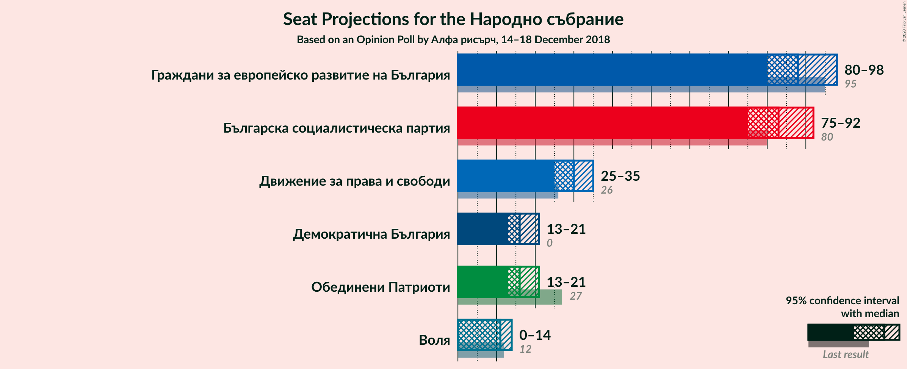
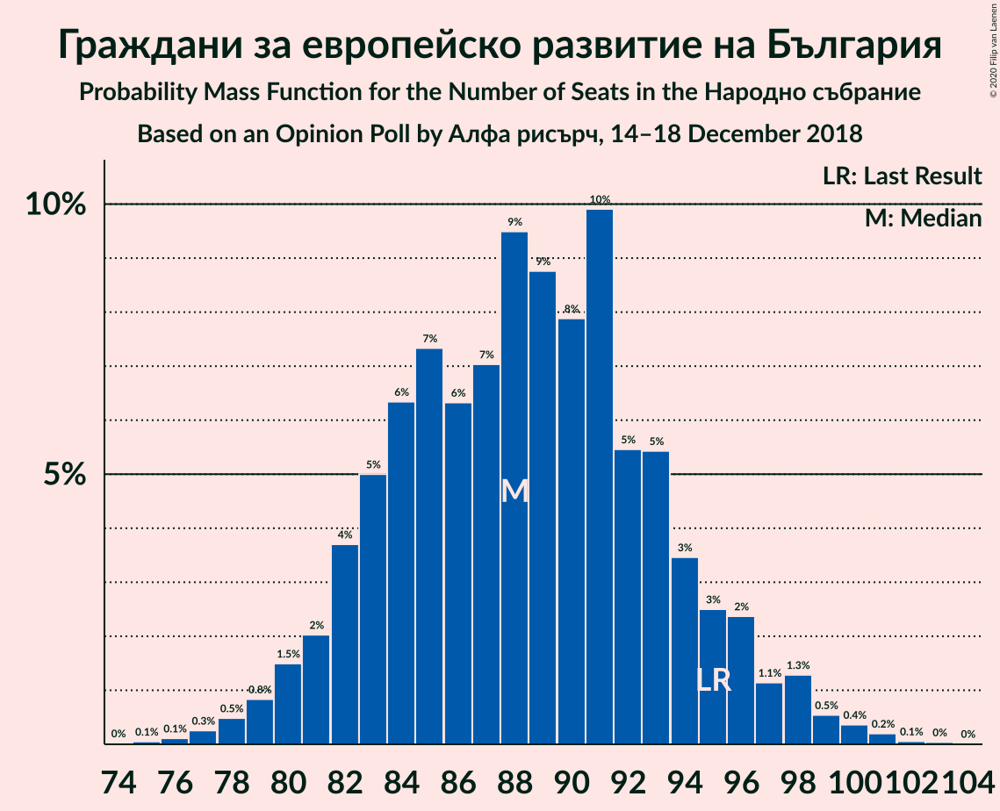
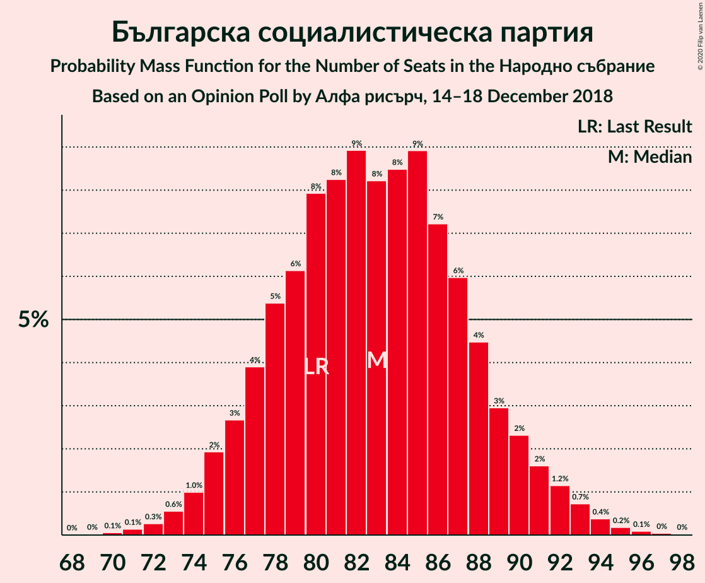
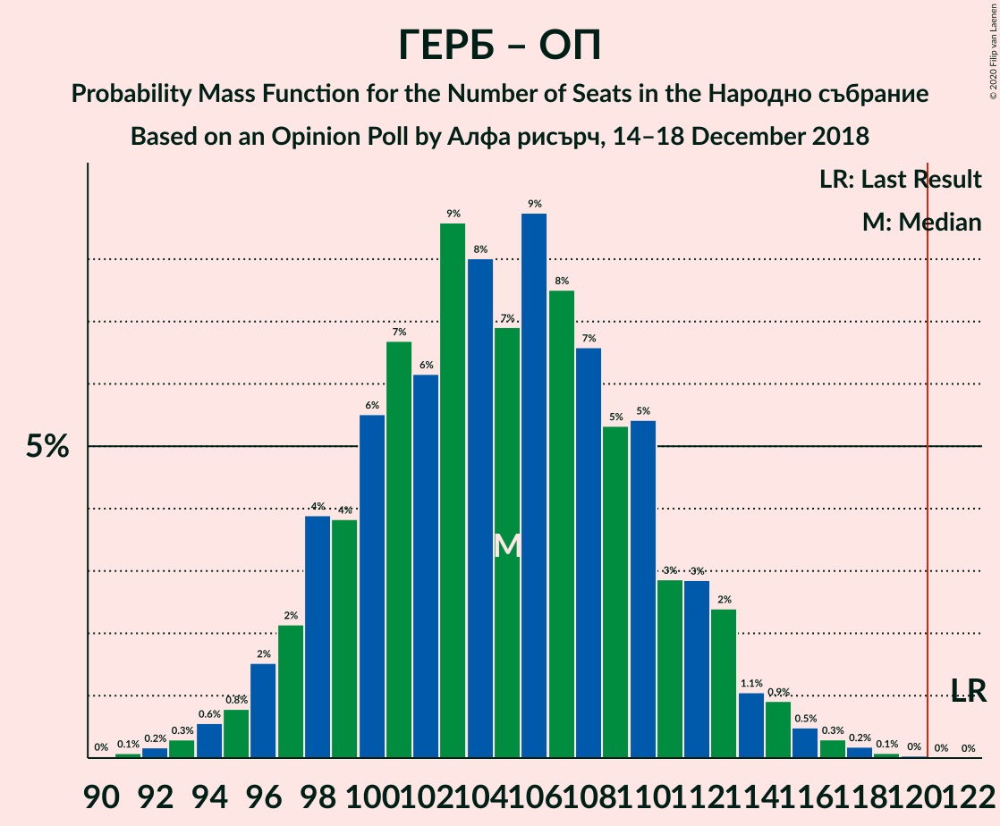

# Opinion Poll by Алфа рисърч, 14–18 December 2018

<a href="#voting-intentions">Voting Intentions</a> | <a href="#seats">Seats</a> | <a href="#coalitions">Coalitions</a> | <a href="#technical-information">Technical Information</a>

## Voting Intentions

### Confidence Intervals

| Party | Last Result | Poll Result | 80% Confidence Interval | 90% Confidence Interval | 95% Confidence Interval | 99% Confidence Interval |
|:-----:|:-----------:|:-----------:|:-----------------------:|:-----------------------:|:-----------------------:|:-----------------------:|
| Граждани за европейско развитие на България | 33.5% | 33.0% | 31.2–34.9% |30.6–35.5% |30.2–36.0% |29.3–36.9% |
| Българска социалистическа партия | 27.9% | 31.0% | 29.2–32.9% |28.6–33.4% |28.2–33.9% |27.4–34.8% |
| Движение за права и свободи | 9.2% | 11.0% | 9.8–12.4% |9.5–12.7% |9.2–13.1% |8.7–13.7% |
| Обединени Патриоти | 9.3% | 6.0% | 5.2–7.1% |4.9–7.4% |4.7–7.7% |4.4–8.2% |
| Демократична България | 0.0% | 6.0% | 5.2–7.1% |4.9–7.4% |4.7–7.7% |4.4–8.2% |
| Воля | 4.3% | 4.0% | 3.3–4.9% |3.1–5.2% |3.0–5.4% |2.7–5.8% |

*Note:* The poll result column reflects the actual value used in the calculations. Published results may vary slightly, and in addition be rounded to fewer digits.

## Seats

### Confidence Intervals

| Party | Last Result | Median | 80% Confidence Interval | 90% Confidence Interval | 95% Confidence Interval | 99% Confidence Interval |
|:-----:|:-----------:|:------:|:-----------------------:|:-----------------------:|:-----------------------:|:-----------------------:|
| <a href="#граждани-за-европейско-развитие-на-българия">Граждани за европейско развитие на България</a> | 95 | 88 | 83–94 |81–96 |80–98 |78–100 |
| <a href="#българска-социалистическа-партия">Българска социалистическа партия</a> | 80 | 83 | 77–88 |76–90 |75–92 |72–94 |
| <a href="#движение-за-права-и-свободи">Движение за права и свободи</a> | 26 | 30 | 26–33 |25–34 |25–35 |23–37 |
| <a href="#обединени-патриоти">Обединени Патриоти</a> | 27 | 16 | 14–19 |13–20 |13–21 |12–22 |
| <a href="#демократична-българия">Демократична България</a> | 0 | 16 | 14–19 |13–20 |13–21 |12–22 |
| <a href="#воля">Воля</a> | 12 | 11 | 0–13 |0–13 |0–14 |0–15 |

### Граждани за европейско развитие на България

*For a full overview of the results for this party, see the [Граждани за европейско развитие на България](party-гражданизаевропейскоразвитиенабългария.html) page.*

| Number of Seats | Probability | Accumulated | Special Marks |
|:---------------:|:-----------:|:-----------:|:-------------:|
| 75 | 0.1% | 100% |  |
| 76 | 0.1% | 99.9% |  |
| 77 | 0.3% | 99.8% |  |
| 78 | 0.5% | 99.5% |  |
| 79 | 0.8% | 99.1% |  |
| 80 | 1.5% | 98% |  |
| 81 | 2% | 97% |  |
| 82 | 4% | 95% |  |
| 83 | 5% | 91% |  |
| 84 | 6% | 86% |  |
| 85 | 7% | 80% |  |
| 86 | 6% | 72% |  |
| 87 | 7% | 66% |  |
| 88 | 9% | 59% | Median |
| 89 | 9% | 49% |  |
| 90 | 8% | 41% |  |
| 91 | 10% | 33% |  |
| 92 | 5% | 23% |  |
| 93 | 5% | 17% |  |
| 94 | 3% | 12% |  |
| 95 | 3% | 9% | Last Result |
| 96 | 2% | 6% |  |
| 97 | 1.1% | 4% |  |
| 98 | 1.3% | 3% |  |
| 99 | 0.5% | 1.2% |  |
| 100 | 0.4% | 0.7% |  |
| 101 | 0.2% | 0.3% |  |
| 102 | 0.1% | 0.1% |  |
| 103 | 0% | 0.1% |  |
| 104 | 0% | 0% |  |

### Българска социалистическа партия

*For a full overview of the results for this party, see the [Българска социалистическа партия](party-българскасоциалистическапартия.html) page.*

| Number of Seats | Probability | Accumulated | Special Marks |
|:---------------:|:-----------:|:-----------:|:-------------:|
| 70 | 0.1% | 100% |  |
| 71 | 0.1% | 99.9% |  |
| 72 | 0.3% | 99.8% |  |
| 73 | 0.6% | 99.5% |  |
| 74 | 1.0% | 98.9% |  |
| 75 | 2% | 98% |  |
| 76 | 3% | 96% |  |
| 77 | 4% | 93% |  |
| 78 | 5% | 89% |  |
| 79 | 6% | 84% |  |
| 80 | 8% | 78% | Last Result |
| 81 | 8% | 70% |  |
| 82 | 9% | 62% |  |
| 83 | 8% | 53% | Median |
| 84 | 8% | 45% |  |
| 85 | 9% | 36% |  |
| 86 | 7% | 27% |  |
| 87 | 6% | 20% |  |
| 88 | 4% | 14% |  |
| 89 | 3% | 9% |  |
| 90 | 2% | 7% |  |
| 91 | 2% | 4% |  |
| 92 | 1.2% | 3% |  |
| 93 | 0.7% | 1.5% |  |
| 94 | 0.4% | 0.7% |  |
| 95 | 0.2% | 0.4% |  |
| 96 | 0.1% | 0.2% |  |
| 97 | 0% | 0.1% |  |
| 98 | 0% | 0% |  |

### Движение за права и свободи

*For a full overview of the results for this party, see the [Движение за права и свободи](party-движениезаправаисвободи.html) page.*

| Number of Seats | Probability | Accumulated | Special Marks |
|:---------------:|:-----------:|:-----------:|:-------------:|
| 22 | 0.2% | 100% |  |
| 23 | 0.5% | 99.8% |  |
| 24 | 2% | 99.2% |  |
| 25 | 4% | 98% |  |
| 26 | 6% | 94% | Last Result |
| 27 | 10% | 88% |  |
| 28 | 13% | 78% |  |
| 29 | 15% | 65% |  |
| 30 | 15% | 50% | Median |
| 31 | 12% | 36% |  |
| 32 | 9% | 23% |  |
| 33 | 6% | 14% |  |
| 34 | 4% | 8% |  |
| 35 | 2% | 4% |  |
| 36 | 1.2% | 2% |  |
| 37 | 0.5% | 0.8% |  |
| 38 | 0.2% | 0.3% |  |
| 39 | 0.1% | 0.1% |  |
| 40 | 0% | 0% |  |

### Обединени Патриоти

*For a full overview of the results for this party, see the [Обединени Патриоти](party-обединенипатриоти.html) page.*

| Number of Seats | Probability | Accumulated | Special Marks |
|:---------------:|:-----------:|:-----------:|:-------------:|
| 0 | 0.1% | 100% |  |
| 1 | 0% | 99.9% |  |
| 2 | 0% | 99.9% |  |
| 3 | 0% | 99.9% |  |
| 4 | 0% | 99.9% |  |
| 5 | 0% | 99.9% |  |
| 6 | 0% | 99.9% |  |
| 7 | 0% | 99.9% |  |
| 8 | 0% | 99.9% |  |
| 9 | 0% | 99.9% |  |
| 10 | 0% | 99.9% |  |
| 11 | 0.4% | 99.9% |  |
| 12 | 2% | 99.5% |  |
| 13 | 5% | 98% |  |
| 14 | 12% | 93% |  |
| 15 | 15% | 81% |  |
| 16 | 18% | 66% | Median |
| 17 | 17% | 48% |  |
| 18 | 17% | 31% |  |
| 19 | 8% | 14% |  |
| 20 | 4% | 6% |  |
| 21 | 2% | 3% |  |
| 22 | 0.6% | 0.9% |  |
| 23 | 0.2% | 0.3% |  |
| 24 | 0.1% | 0.1% |  |
| 25 | 0% | 0% |  |
| 26 | 0% | 0% |  |
| 27 | 0% | 0% | Last Result |

### Демократична България

*For a full overview of the results for this party, see the [Демократична България](party-демократичнабългария.html) page.*

| Number of Seats | Probability | Accumulated | Special Marks |
|:---------------:|:-----------:|:-----------:|:-------------:|
| 0 | 0.1% | 100% | Last Result |
| 1 | 0% | 99.9% |  |
| 2 | 0% | 99.9% |  |
| 3 | 0% | 99.9% |  |
| 4 | 0% | 99.9% |  |
| 5 | 0% | 99.9% |  |
| 6 | 0% | 99.9% |  |
| 7 | 0% | 99.9% |  |
| 8 | 0% | 99.9% |  |
| 9 | 0% | 99.9% |  |
| 10 | 0% | 99.9% |  |
| 11 | 0.3% | 99.9% |  |
| 12 | 2% | 99.6% |  |
| 13 | 6% | 98% |  |
| 14 | 11% | 92% |  |
| 15 | 16% | 82% |  |
| 16 | 19% | 66% | Median |
| 17 | 18% | 46% |  |
| 18 | 13% | 28% |  |
| 19 | 7% | 15% |  |
| 20 | 4% | 7% |  |
| 21 | 2% | 3% |  |
| 22 | 0.7% | 1.0% |  |
| 23 | 0.2% | 0.3% |  |
| 24 | 0.1% | 0.1% |  |
| 25 | 0% | 0% |  |

### Воля

*For a full overview of the results for this party, see the [Воля](party-воля.html) page.*

| Number of Seats | Probability | Accumulated | Special Marks |
|:---------------:|:-----------:|:-----------:|:-------------:|
| 0 | 47% | 100% |  |
| 1 | 0% | 53% |  |
| 2 | 0% | 53% |  |
| 3 | 0% | 53% |  |
| 4 | 0% | 53% |  |
| 5 | 0% | 53% |  |
| 6 | 0% | 53% |  |
| 7 | 0% | 53% |  |
| 8 | 0% | 53% |  |
| 9 | 0% | 53% |  |
| 10 | 1.0% | 53% |  |
| 11 | 21% | 52% | Median |
| 12 | 18% | 31% | Last Result |
| 13 | 8% | 13% |  |
| 14 | 3% | 5% |  |
| 15 | 1.2% | 2% |  |
| 16 | 0.3% | 0.4% |  |
| 17 | 0.1% | 0.1% |  |
| 18 | 0% | 0% |  |

## Coalitions

### Confidence Intervals

| Coalition | Last Result | Median | Majority? | 80% Confidence Interval | 90% Confidence Interval | 95% Confidence Interval | 99% Confidence Interval |
|:---------:|:-----------:|:------:|:---------:|:-----------------------:|:-----------------------:|:-----------------------:|:-----------------------:|
| Българска социалистическа партия – Движение за права и свободи | 106 | 112 | 6% | 106–119 | 105–121 | 103–122 | 101–125 |
| Граждани за европейско развитие на България – Обединени Патриоти | 122 | 105 | 0% | 99–111 | 97–113 | 96–114 | 93–117 |

### Българска социалистическа партия – Движение за права и свободи

| Number of Seats | Probability | Accumulated | Special Marks |
|:---------------:|:-----------:|:-----------:|:-------------:|
| 98 | 0.1% | 100% |  |
| 99 | 0.1% | 99.9% |  |
| 100 | 0.2% | 99.8% |  |
| 101 | 0.4% | 99.6% |  |
| 102 | 0.6% | 99.2% |  |
| 103 | 1.3% | 98.6% |  |
| 104 | 2% | 97% |  |
| 105 | 2% | 96% |  |
| 106 | 4% | 93% | Last Result |
| 107 | 5% | 89% |  |
| 108 | 5% | 84% |  |
| 109 | 7% | 79% |  |
| 110 | 7% | 72% |  |
| 111 | 8% | 65% |  |
| 112 | 9% | 56% |  |
| 113 | 6% | 48% | Median |
| 114 | 6% | 42% |  |
| 115 | 9% | 35% |  |
| 116 | 6% | 27% |  |
| 117 | 6% | 21% |  |
| 118 | 4% | 15% |  |
| 119 | 3% | 11% |  |
| 120 | 2% | 8% |  |
| 121 | 2% | 6% | Majority |
| 122 | 2% | 4% |  |
| 123 | 0.6% | 2% |  |
| 124 | 0.7% | 1.4% |  |
| 125 | 0.5% | 0.8% |  |
| 126 | 0.2% | 0.3% |  |
| 127 | 0.1% | 0.2% |  |
| 128 | 0.1% | 0.1% |  |
| 129 | 0% | 0% |  |

### Граждани за европейско развитие на България – Обединени Патриоти

| Number of Seats | Probability | Accumulated | Special Marks |
|:---------------:|:-----------:|:-----------:|:-------------:|
| 90 | 0% | 100% |  |
| 91 | 0.1% | 99.9% |  |
| 92 | 0.2% | 99.9% |  |
| 93 | 0.3% | 99.7% |  |
| 94 | 0.6% | 99.4% |  |
| 95 | 0.8% | 98.8% |  |
| 96 | 2% | 98% |  |
| 97 | 2% | 97% |  |
| 98 | 4% | 94% |  |
| 99 | 4% | 90% |  |
| 100 | 6% | 87% |  |
| 101 | 7% | 81% |  |
| 102 | 6% | 74% |  |
| 103 | 9% | 68% |  |
| 104 | 8% | 60% | Median |
| 105 | 7% | 52% |  |
| 106 | 9% | 45% |  |
| 107 | 8% | 36% |  |
| 108 | 7% | 29% |  |
| 109 | 5% | 22% |  |
| 110 | 5% | 17% |  |
| 111 | 3% | 11% |  |
| 112 | 3% | 8% |  |
| 113 | 2% | 5% |  |
| 114 | 1.1% | 3% |  |
| 115 | 0.9% | 2% |  |
| 116 | 0.5% | 1.1% |  |
| 117 | 0.3% | 0.6% |  |
| 118 | 0.2% | 0.3% |  |
| 119 | 0.1% | 0.1% |  |
| 120 | 0% | 0.1% |  |
| 121 | 0% | 0% | Majority |
| 122 | 0% | 0% | Last Result |

## Technical Information

### Opinion Poll

+ **Polling firm:** Алфа рисърч
+ **Commissioner(s):** —
+ **Fieldwork period:** 14–18 December 2018

### Calculations

+ **Sample size:** 1027
+ **Simulations done:** 1,048,576
+ **Error estimate:** 1.04%

