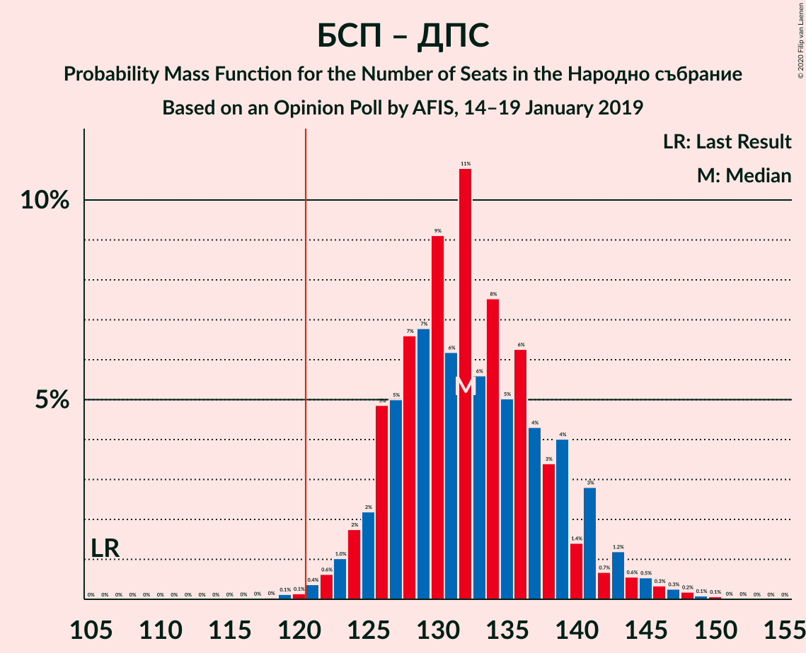
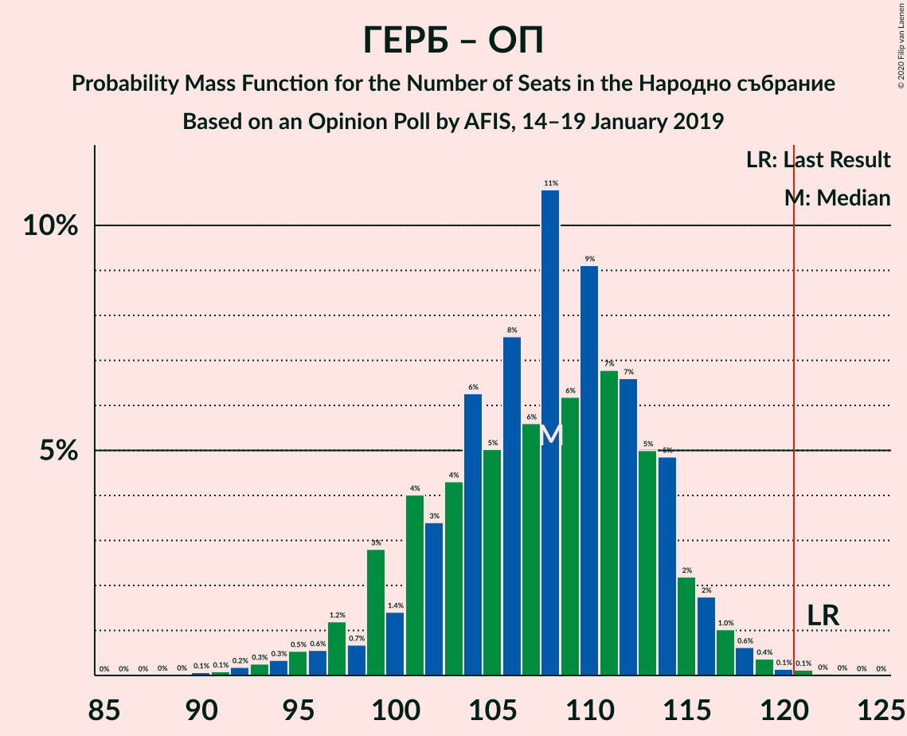

# Opinion Poll by AFIS, 14–19 January 2019

<a href="#voting-intentions">Voting Intentions</a> | <a href="#seats">Seats</a> | <a href="#coalitions">Coalitions</a> | <a href="#technical-information">Technical Information</a>

## Voting Intentions

### Confidence Intervals

| Party | Last Result | Poll Result | 80% Confidence Interval | 90% Confidence Interval | 95% Confidence Interval | 99% Confidence Interval |
|:-----:|:-----------:|:-----------:|:-----------------------:|:-----------------------:|:-----------------------:|:-----------------------:|
| Българска социалистическа партия | 27.9% | 34.6% | 32.7–36.5% |32.1–37.1% |31.7–37.6% |30.8–38.5% |
| Граждани за европейско развитие на България | 33.5% | 32.9% | 31.0–34.8% |30.5–35.4% |30.0–35.8% |29.2–36.8% |
| Движение за права и свободи | 9.2% | 11.0% | 9.8–12.4% |9.5–12.7% |9.2–13.1% |8.7–13.7% |
| Обединени Патриоти | 9.3% | 4.7% | 3.9–5.6% |3.7–5.9% |3.5–6.1% |3.2–6.6% |
| Реформаторски блок | 3.1% | 2.0% | 1.5–2.7% |1.4–2.9% |1.3–3.0% |1.1–3.4% |
| Воля | 4.3% | 1.4% | 1.0–2.0% |0.9–2.2% |0.8–2.3% |0.7–2.7% |
| Демократична България | 0.0% | 1.4% | 1.0–2.0% |0.9–2.2% |0.8–2.3% |0.7–2.7% |

*Note:* The poll result column reflects the actual value used in the calculations. Published results may vary slightly, and in addition be rounded to fewer digits.

## Seats

### Confidence Intervals

| Party | Last Result | Median | 80% Confidence Interval | 90% Confidence Interval | 95% Confidence Interval | 99% Confidence Interval |
|:-----:|:-----------:|:------:|:-----------------------:|:-----------------------:|:-----------------------:|:-----------------------:|
| <a href="#българска-социалистическа-партия">Българска социалистическа партия</a> | 80 | 100 | 95–107 |93–108 |92–110 |89–113 |
| <a href="#граждани-за-европейско-развитие-на-българия">Граждани за европейско развитие на България</a> | 95 | 95 | 90–101 |88–103 |87–105 |85–108 |
| <a href="#движение-за-права-и-свободи">Движение за права и свободи</a> | 26 | 32 | 29–36 |28–37 |27–38 |25–40 |
| <a href="#обединени-патриоти">Обединени Патриоти</a> | 27 | 14 | 0–16 |0–17 |0–18 |0–19 |
| <a href="#реформаторски-блок">Реформаторски блок</a> | 0 | 0 | 0 |0 |0 |0 |
| <a href="#воля">Воля</a> | 12 | 0 | 0 |0 |0 |0 |
| <a href="#демократична-българия">Демократична България</a> | 0 | 0 | 0 |0 |0 |0 |

### Българска социалистическа партия

*For a full overview of the results for this party, see the [Българска социалистическа партия](party-българскасоциалистическапартия.html) page.*

| Number of Seats | Probability | Accumulated | Special Marks |
|:---------------:|:-----------:|:-----------:|:-------------:|
| 80 | 0% | 100% | Last Result |
| 81 | 0% | 100% |  |
| 82 | 0% | 100% |  |
| 83 | 0% | 100% |  |
| 84 | 0% | 100% |  |
| 85 | 0% | 100% |  |
| 86 | 0% | 100% |  |
| 87 | 0.1% | 99.9% |  |
| 88 | 0.2% | 99.9% |  |
| 89 | 0.3% | 99.7% |  |
| 90 | 0.6% | 99.4% |  |
| 91 | 1.0% | 98.8% |  |
| 92 | 2% | 98% |  |
| 93 | 2% | 96% |  |
| 94 | 4% | 94% |  |
| 95 | 5% | 90% |  |
| 96 | 5% | 85% |  |
| 97 | 8% | 80% |  |
| 98 | 10% | 72% |  |
| 99 | 9% | 62% |  |
| 100 | 10% | 53% | Median |
| 101 | 8% | 44% |  |
| 102 | 6% | 36% |  |
| 103 | 7% | 30% |  |
| 104 | 5% | 24% |  |
| 105 | 4% | 18% |  |
| 106 | 3% | 14% |  |
| 107 | 3% | 10% |  |
| 108 | 2% | 7% |  |
| 109 | 2% | 5% |  |
| 110 | 1.0% | 3% |  |
| 111 | 0.6% | 2% |  |
| 112 | 0.7% | 1.3% |  |
| 113 | 0.2% | 0.6% |  |
| 114 | 0.2% | 0.5% |  |
| 115 | 0.1% | 0.2% |  |
| 116 | 0.1% | 0.2% |  |
| 117 | 0% | 0.1% |  |
| 118 | 0% | 0% |  |

### Граждани за европейско развитие на България

*For a full overview of the results for this party, see the [Граждани за европейско развитие на България](party-гражданизаевропейскоразвитиенабългария.html) page.*

| Number of Seats | Probability | Accumulated | Special Marks |
|:---------------:|:-----------:|:-----------:|:-------------:|
| 82 | 0.1% | 100% |  |
| 83 | 0.1% | 99.9% |  |
| 84 | 0.2% | 99.8% |  |
| 85 | 0.5% | 99.6% |  |
| 86 | 0.8% | 99.1% |  |
| 87 | 1.3% | 98% |  |
| 88 | 3% | 97% |  |
| 89 | 4% | 94% |  |
| 90 | 4% | 90% |  |
| 91 | 6% | 86% |  |
| 92 | 6% | 80% |  |
| 93 | 8% | 73% |  |
| 94 | 9% | 66% |  |
| 95 | 8% | 57% | Last Result, Median |
| 96 | 8% | 48% |  |
| 97 | 8% | 41% |  |
| 98 | 6% | 32% |  |
| 99 | 7% | 26% |  |
| 100 | 5% | 19% |  |
| 101 | 5% | 14% |  |
| 102 | 3% | 9% |  |
| 103 | 2% | 6% |  |
| 104 | 1.2% | 4% |  |
| 105 | 1.0% | 3% |  |
| 106 | 0.9% | 2% |  |
| 107 | 0.4% | 1.1% |  |
| 108 | 0.2% | 0.6% |  |
| 109 | 0.2% | 0.4% |  |
| 110 | 0.1% | 0.2% |  |
| 111 | 0.1% | 0.1% |  |
| 112 | 0% | 0.1% |  |
| 113 | 0% | 0.1% |  |
| 114 | 0% | 0% |  |

### Движение за права и свободи

*For a full overview of the results for this party, see the [Движение за права и свободи](party-движениезаправаисвободи.html) page.*

| Number of Seats | Probability | Accumulated | Special Marks |
|:---------------:|:-----------:|:-----------:|:-------------:|
| 23 | 0% | 100% |  |
| 24 | 0.2% | 99.9% |  |
| 25 | 0.6% | 99.8% |  |
| 26 | 1.4% | 99.2% | Last Result |
| 27 | 2% | 98% |  |
| 28 | 5% | 96% |  |
| 29 | 9% | 90% |  |
| 30 | 11% | 82% |  |
| 31 | 11% | 70% |  |
| 32 | 13% | 60% | Median |
| 33 | 19% | 47% |  |
| 34 | 9% | 27% |  |
| 35 | 6% | 18% |  |
| 36 | 6% | 12% |  |
| 37 | 3% | 6% |  |
| 38 | 1.2% | 3% |  |
| 39 | 0.7% | 2% |  |
| 40 | 0.7% | 1.1% |  |
| 41 | 0.3% | 0.4% |  |
| 42 | 0.1% | 0.1% |  |
| 43 | 0% | 0.1% |  |
| 44 | 0% | 0% |  |

### Обединени Патриоти

*For a full overview of the results for this party, see the [Обединени Патриоти](party-обединенипатриоти.html) page.*

| Number of Seats | Probability | Accumulated | Special Marks |
|:---------------:|:-----------:|:-----------:|:-------------:|
| 0 | 14% | 100% |  |
| 1 | 0% | 86% |  |
| 2 | 0% | 86% |  |
| 3 | 0% | 86% |  |
| 4 | 0% | 86% |  |
| 5 | 0% | 86% |  |
| 6 | 0% | 86% |  |
| 7 | 0% | 86% |  |
| 8 | 0% | 86% |  |
| 9 | 0% | 86% |  |
| 10 | 0% | 86% |  |
| 11 | 0.4% | 86% |  |
| 12 | 13% | 85% |  |
| 13 | 21% | 72% |  |
| 14 | 18% | 51% | Median |
| 15 | 17% | 33% |  |
| 16 | 9% | 16% |  |
| 17 | 4% | 7% |  |
| 18 | 2% | 3% |  |
| 19 | 0.7% | 1.0% |  |
| 20 | 0.2% | 0.3% |  |
| 21 | 0.1% | 0.1% |  |
| 22 | 0% | 0% |  |
| 23 | 0% | 0% |  |
| 24 | 0% | 0% |  |
| 25 | 0% | 0% |  |
| 26 | 0% | 0% |  |
| 27 | 0% | 0% | Last Result |

### Реформаторски блок

*For a full overview of the results for this party, see the [Реформаторски блок](party-реформаторскиблок.html) page.*

| Number of Seats | Probability | Accumulated | Special Marks |
|:---------------:|:-----------:|:-----------:|:-------------:|
| 0 | 100% | 100% | Last Result, Median |

### Воля

*For a full overview of the results for this party, see the [Воля](party-воля.html) page.*

| Number of Seats | Probability | Accumulated | Special Marks |
|:---------------:|:-----------:|:-----------:|:-------------:|
| 0 | 100% | 100% | Median |
| 1 | 0% | 0% |  |
| 2 | 0% | 0% |  |
| 3 | 0% | 0% |  |
| 4 | 0% | 0% |  |
| 5 | 0% | 0% |  |
| 6 | 0% | 0% |  |
| 7 | 0% | 0% |  |
| 8 | 0% | 0% |  |
| 9 | 0% | 0% |  |
| 10 | 0% | 0% |  |
| 11 | 0% | 0% |  |
| 12 | 0% | 0% | Last Result |

### Демократична България

*For a full overview of the results for this party, see the [Демократична България](party-демократичнабългария.html) page.*

| Number of Seats | Probability | Accumulated | Special Marks |
|:---------------:|:-----------:|:-----------:|:-------------:|
| 0 | 100% | 100% | Last Result, Median |

## Coalitions

### Confidence Intervals

| Coalition | Last Result | Median | Majority? | 80% Confidence Interval | 90% Confidence Interval | 95% Confidence Interval | 99% Confidence Interval |
|:---------:|:-----------:|:------:|:---------:|:-----------------------:|:-----------------------:|:-----------------------:|:-----------------------:|
| Българска социалистическа партия – Движение за права и свободи | 106 | 132 | 99.7% | 126–139 | 125–141 | 124–143 | 121–147 |
| Граждани за европейско развитие на България – Обединени Патриоти | 122 | 108 | 0.2% | 101–114 | 99–115 | 97–116 | 93–119 |

### Българска социалистическа партия – Движение за права и свободи

| Number of Seats | Probability | Accumulated | Special Marks |
|:---------------:|:-----------:|:-----------:|:-------------:|
| 106 | 0% | 100% | Last Result |
| 107 | 0% | 100% |  |
| 108 | 0% | 100% |  |
| 109 | 0% | 100% |  |
| 110 | 0% | 100% |  |
| 111 | 0% | 100% |  |
| 112 | 0% | 100% |  |
| 113 | 0% | 100% |  |
| 114 | 0% | 100% |  |
| 115 | 0% | 100% |  |
| 116 | 0% | 100% |  |
| 117 | 0% | 100% |  |
| 118 | 0% | 100% |  |
| 119 | 0.1% | 99.9% |  |
| 120 | 0.1% | 99.8% |  |
| 121 | 0.4% | 99.7% | Majority |
| 122 | 0.6% | 99.3% |  |
| 123 | 1.0% | 98.7% |  |
| 124 | 2% | 98% |  |
| 125 | 2% | 96% |  |
| 126 | 5% | 94% |  |
| 127 | 5% | 89% |  |
| 128 | 7% | 84% |  |
| 129 | 7% | 77% |  |
| 130 | 9% | 70% |  |
| 131 | 6% | 61% |  |
| 132 | 11% | 55% | Median |
| 133 | 6% | 44% |  |
| 134 | 8% | 39% |  |
| 135 | 5% | 31% |  |
| 136 | 6% | 26% |  |
| 137 | 4% | 20% |  |
| 138 | 3% | 16% |  |
| 139 | 4% | 12% |  |
| 140 | 1.4% | 8% |  |
| 141 | 3% | 7% |  |
| 142 | 0.7% | 4% |  |
| 143 | 1.2% | 3% |  |
| 144 | 0.6% | 2% |  |
| 145 | 0.5% | 2% |  |
| 146 | 0.3% | 1.0% |  |
| 147 | 0.3% | 0.7% |  |
| 148 | 0.2% | 0.4% |  |
| 149 | 0.1% | 0.2% |  |
| 150 | 0.1% | 0.1% |  |
| 151 | 0% | 0% |  |

### Граждани за европейско развитие на България – Обединени Патриоти

| Number of Seats | Probability | Accumulated | Special Marks |
|:---------------:|:-----------:|:-----------:|:-------------:|
| 90 | 0.1% | 100% |  |
| 91 | 0.1% | 99.9% |  |
| 92 | 0.2% | 99.8% |  |
| 93 | 0.3% | 99.6% |  |
| 94 | 0.3% | 99.3% |  |
| 95 | 0.5% | 99.0% |  |
| 96 | 0.6% | 98% |  |
| 97 | 1.2% | 98% |  |
| 98 | 0.7% | 97% |  |
| 99 | 3% | 96% |  |
| 100 | 1.4% | 93% |  |
| 101 | 4% | 92% |  |
| 102 | 3% | 88% |  |
| 103 | 4% | 84% |  |
| 104 | 6% | 80% |  |
| 105 | 5% | 74% |  |
| 106 | 8% | 69% |  |
| 107 | 6% | 61% |  |
| 108 | 11% | 56% |  |
| 109 | 6% | 45% | Median |
| 110 | 9% | 39% |  |
| 111 | 7% | 30% |  |
| 112 | 7% | 23% |  |
| 113 | 5% | 16% |  |
| 114 | 5% | 11% |  |
| 115 | 2% | 6% |  |
| 116 | 2% | 4% |  |
| 117 | 1.0% | 2% |  |
| 118 | 0.6% | 1.3% |  |
| 119 | 0.4% | 0.7% |  |
| 120 | 0.1% | 0.3% |  |
| 121 | 0.1% | 0.2% | Majority |
| 122 | 0% | 0.1% | Last Result |
| 123 | 0% | 0% |  |

## Technical Information

### Opinion Poll

+ **Polling firm:** AFIS
+ **Commissioner(s):** —
+ **Fieldwork period:** 14–19 January 2019

### Calculations

+ **Sample size:** 1010
+ **Simulations done:** 1,048,576
+ **Error estimate:** 1.01%

