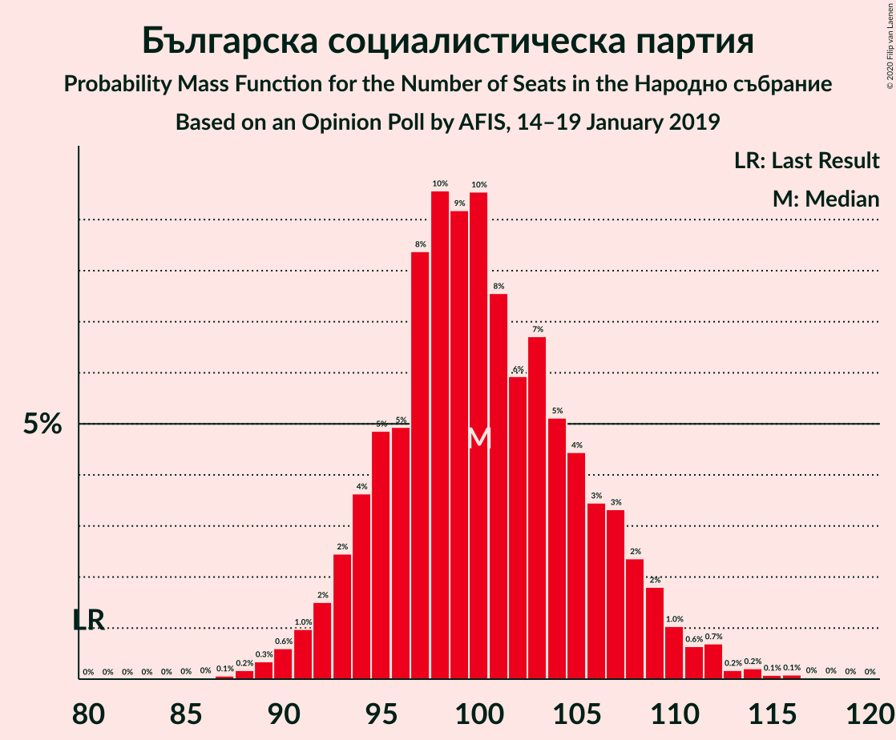
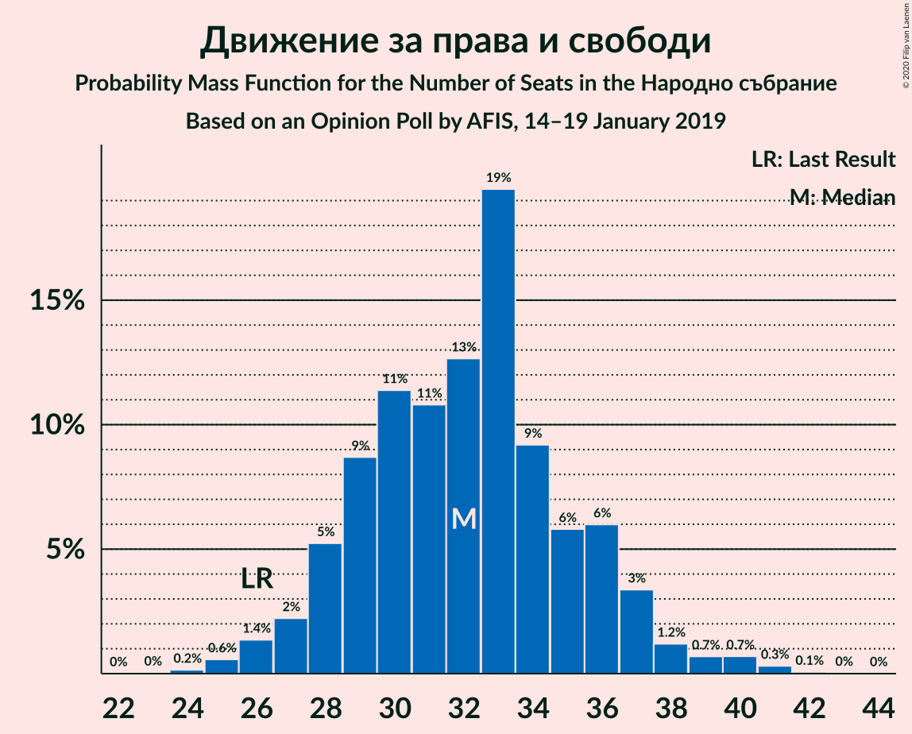
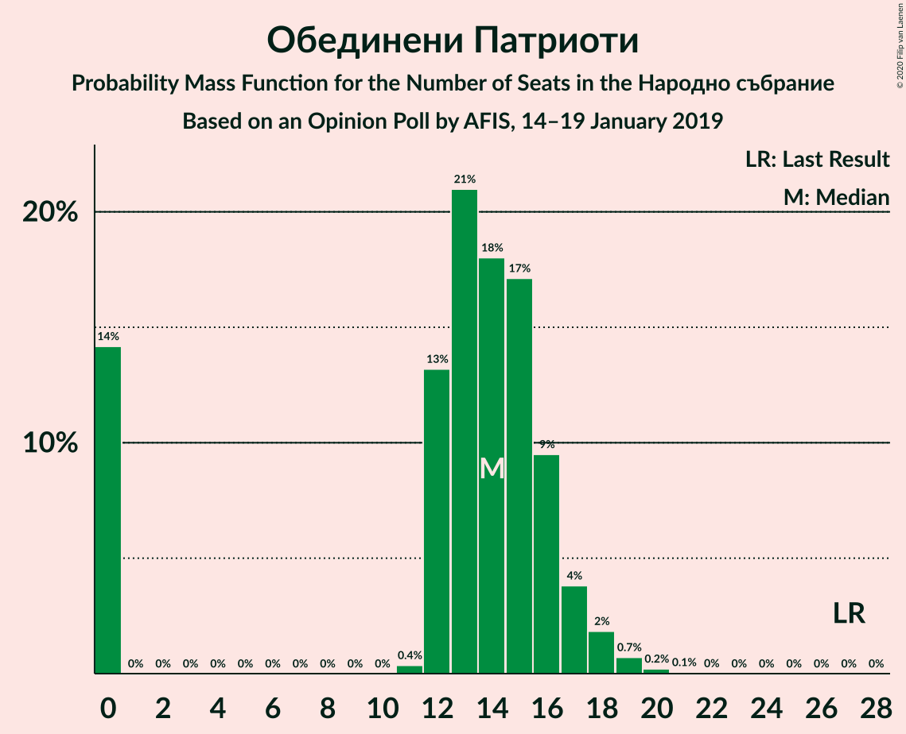

# Opinion Poll by AFIS, 14–19 January 2019

<a href="#voting-intentions">Voting Intentions</a> | <a href="#seats">Seats</a> | <a href="#coalitions">Coalitions</a> | <a href="#technical-information">Technical Information</a>

## Voting Intentions

### Confidence Intervals

| Party | Last Result | Poll Result | 80% Confidence Interval | 90% Confidence Interval | 95% Confidence Interval | 99% Confidence Interval |
|:-----:|:-----------:|:-----------:|:-----------------------:|:-----------------------:|:-----------------------:|:-----------------------:|
| Българска социалистическа партия | 27.9% | 34.6% | 32.7–36.5% |32.1–37.1% |31.7–37.6% |30.8–38.5% |
| Граждани за европейско развитие на България | 33.5% | 32.9% | 31.0–34.8% |30.5–35.4% |30.0–35.8% |29.2–36.8% |
| Движение за права и свободи | 9.2% | 11.0% | 9.8–12.4% |9.5–12.7% |9.2–13.1% |8.7–13.7% |
| Обединени Патриоти | 9.3% | 4.7% | 3.9–5.6% |3.7–5.9% |3.5–6.1% |3.2–6.6% |
| Реформаторски блок | 3.1% | 2.0% | 1.5–2.7% |1.4–2.9% |1.3–3.0% |1.1–3.4% |
| Воля | 4.3% | 1.4% | 1.0–2.0% |0.9–2.2% |0.8–2.3% |0.7–2.7% |
| Демократична България | 0.0% | 1.4% | 1.0–2.0% |0.9–2.2% |0.8–2.3% |0.7–2.7% |

*Note:* The poll result column reflects the actual value used in the calculations. Published results may vary slightly, and in addition be rounded to fewer digits.

## Seats

### Confidence Intervals

| Party | Last Result | Median | 80% Confidence Interval | 90% Confidence Interval | 95% Confidence Interval | 99% Confidence Interval |
|:-----:|:-----------:|:------:|:-----------------------:|:-----------------------:|:-----------------------:|:-----------------------:|
| <a href="#българска-социалистическа-партия">Българска социалистическа партия</a> | 80 | 101 | 94–106 |93–109 |92–111 |90–114 |
| <a href="#граждани-за-европейско-развитие-на-българия">Граждани за европейско развитие на България</a> | 95 | 96 | 89–101 |88–103 |87–104 |85–107 |
| <a href="#движение-за-права-и-свободи">Движение за права и свободи</a> | 26 | 32 | 28–36 |27–36 |26–37 |25–40 |
| <a href="#обединени-патриоти">Обединени Патриоти</a> | 27 | 13 | 0–16 |0–17 |0–18 |0–19 |
| <a href="#реформаторски-блок">Реформаторски блок</a> | 0 | 0 | 0 |0 |0 |0 |
| <a href="#воля">Воля</a> | 12 | 0 | 0 |0 |0 |0 |
| <a href="#демократична-българия">Демократична България</a> | 0 | 0 | 0 |0 |0 |0 |

### Българска социалистическа партия

*For a full overview of the results for this party, see the [Българска социалистическа партия](party-българскасоциалистическапартия.html) page.*

| Number of Seats | Probability | Accumulated | Special Marks |
|:---------------:|:-----------:|:-----------:|:-------------:|
| 80 | 0% | 100% | Last Result |
| 81 | 0% | 100% |  |
| 82 | 0% | 100% |  |
| 83 | 0% | 100% |  |
| 84 | 0% | 100% |  |
| 85 | 0% | 100% |  |
| 86 | 0% | 100% |  |
| 87 | 0.1% | 100% |  |
| 88 | 0.1% | 99.9% |  |
| 89 | 0.1% | 99.8% |  |
| 90 | 0.5% | 99.6% |  |
| 91 | 1.4% | 99.2% |  |
| 92 | 2% | 98% |  |
| 93 | 3% | 96% |  |
| 94 | 4% | 93% |  |
| 95 | 4% | 89% |  |
| 96 | 2% | 85% |  |
| 97 | 3% | 83% |  |
| 98 | 6% | 79% |  |
| 99 | 7% | 73% |  |
| 100 | 13% | 66% |  |
| 101 | 4% | 52% | Median |
| 102 | 10% | 49% |  |
| 103 | 12% | 38% |  |
| 104 | 9% | 27% |  |
| 105 | 3% | 17% |  |
| 106 | 4% | 14% |  |
| 107 | 1.5% | 10% |  |
| 108 | 3% | 8% |  |
| 109 | 2% | 5% |  |
| 110 | 1.1% | 4% |  |
| 111 | 1.0% | 3% |  |
| 112 | 0.5% | 2% |  |
| 113 | 0.3% | 1.0% |  |
| 114 | 0.5% | 0.8% |  |
| 115 | 0.2% | 0.3% |  |
| 116 | 0% | 0.1% |  |
| 117 | 0% | 0.1% |  |
| 118 | 0% | 0.1% |  |
| 119 | 0% | 0% |  |

### Граждани за европейско развитие на България

*For a full overview of the results for this party, see the [Граждани за европейско развитие на България](party-гражданизаевропейскоразвитиенабългария.html) page.*

| Number of Seats | Probability | Accumulated | Special Marks |
|:---------------:|:-----------:|:-----------:|:-------------:|
| 81 | 0.1% | 100% |  |
| 82 | 0.1% | 99.9% |  |
| 83 | 0% | 99.8% |  |
| 84 | 0% | 99.8% |  |
| 85 | 0.4% | 99.7% |  |
| 86 | 0.6% | 99.4% |  |
| 87 | 1.5% | 98.7% |  |
| 88 | 4% | 97% |  |
| 89 | 10% | 93% |  |
| 90 | 9% | 83% |  |
| 91 | 5% | 74% |  |
| 92 | 1.2% | 70% |  |
| 93 | 3% | 68% |  |
| 94 | 5% | 65% |  |
| 95 | 3% | 60% | Last Result |
| 96 | 10% | 57% | Median |
| 97 | 6% | 47% |  |
| 98 | 19% | 41% |  |
| 99 | 6% | 22% |  |
| 100 | 2% | 16% |  |
| 101 | 5% | 14% |  |
| 102 | 2% | 8% |  |
| 103 | 3% | 7% |  |
| 104 | 2% | 4% |  |
| 105 | 0.5% | 2% |  |
| 106 | 0.4% | 1.2% |  |
| 107 | 0.3% | 0.7% |  |
| 108 | 0.1% | 0.4% |  |
| 109 | 0.1% | 0.3% |  |
| 110 | 0% | 0.2% |  |
| 111 | 0.1% | 0.1% |  |
| 112 | 0.1% | 0.1% |  |
| 113 | 0% | 0% |  |

### Движение за права и свободи

*For a full overview of the results for this party, see the [Движение за права и свободи](party-движениезаправаисвободи.html) page.*

| Number of Seats | Probability | Accumulated | Special Marks |
|:---------------:|:-----------:|:-----------:|:-------------:|
| 23 | 0% | 100% |  |
| 24 | 0.2% | 99.9% |  |
| 25 | 0.5% | 99.8% |  |
| 26 | 2% | 99.3% | Last Result |
| 27 | 2% | 97% |  |
| 28 | 5% | 95% |  |
| 29 | 14% | 89% |  |
| 30 | 8% | 75% |  |
| 31 | 11% | 67% |  |
| 32 | 11% | 56% | Median |
| 33 | 17% | 44% |  |
| 34 | 8% | 27% |  |
| 35 | 7% | 19% |  |
| 36 | 7% | 12% |  |
| 37 | 2% | 5% |  |
| 38 | 0.8% | 2% |  |
| 39 | 0.7% | 2% |  |
| 40 | 0.5% | 0.9% |  |
| 41 | 0.2% | 0.4% |  |
| 42 | 0.2% | 0.2% |  |
| 43 | 0% | 0% |  |

### Обединени Патриоти

*For a full overview of the results for this party, see the [Обединени Патриоти](party-обединенипатриоти.html) page.*

| Number of Seats | Probability | Accumulated | Special Marks |
|:---------------:|:-----------:|:-----------:|:-------------:|
| 0 | 15% | 100% |  |
| 1 | 0% | 85% |  |
| 2 | 0% | 85% |  |
| 3 | 0% | 85% |  |
| 4 | 0% | 85% |  |
| 5 | 0% | 85% |  |
| 6 | 0% | 85% |  |
| 7 | 0% | 85% |  |
| 8 | 0% | 85% |  |
| 9 | 0% | 85% |  |
| 10 | 0% | 85% |  |
| 11 | 0.4% | 85% |  |
| 12 | 15% | 84% |  |
| 13 | 24% | 69% | Median |
| 14 | 12% | 45% |  |
| 15 | 15% | 33% |  |
| 16 | 12% | 18% |  |
| 17 | 3% | 6% |  |
| 18 | 2% | 3% |  |
| 19 | 0.5% | 0.8% |  |
| 20 | 0.2% | 0.3% |  |
| 21 | 0.1% | 0.1% |  |
| 22 | 0% | 0% |  |
| 23 | 0% | 0% |  |
| 24 | 0% | 0% |  |
| 25 | 0% | 0% |  |
| 26 | 0% | 0% |  |
| 27 | 0% | 0% | Last Result |

### Реформаторски блок

*For a full overview of the results for this party, see the [Реформаторски блок](party-реформаторскиблок.html) page.*

| Number of Seats | Probability | Accumulated | Special Marks |
|:---------------:|:-----------:|:-----------:|:-------------:|
| 0 | 100% | 100% | Last Result, Median |

### Воля

*For a full overview of the results for this party, see the [Воля](party-воля.html) page.*

| Number of Seats | Probability | Accumulated | Special Marks |
|:---------------:|:-----------:|:-----------:|:-------------:|
| 0 | 100% | 100% | Median |
| 1 | 0% | 0% |  |
| 2 | 0% | 0% |  |
| 3 | 0% | 0% |  |
| 4 | 0% | 0% |  |
| 5 | 0% | 0% |  |
| 6 | 0% | 0% |  |
| 7 | 0% | 0% |  |
| 8 | 0% | 0% |  |
| 9 | 0% | 0% |  |
| 10 | 0% | 0% |  |
| 11 | 0% | 0% |  |
| 12 | 0% | 0% | Last Result |

### Демократична България

*For a full overview of the results for this party, see the [Демократична България](party-демократичнабългария.html) page.*

| Number of Seats | Probability | Accumulated | Special Marks |
|:---------------:|:-----------:|:-----------:|:-------------:|
| 0 | 100% | 100% | Last Result, Median |

## Coalitions

### Confidence Intervals

| Coalition | Last Result | Median | Majority? | 80% Confidence Interval | 90% Confidence Interval | 95% Confidence Interval | 99% Confidence Interval |
|:---------:|:-----------:|:------:|:---------:|:-----------------------:|:-----------------------:|:-----------------------:|:-----------------------:|
| Българска социалистическа партия – Движение за права и свободи | 106 | 132 | 99.8% | 127–139 | 126–140 | 124–142 | 121–147 |
| Граждани за европейско развитие на България – Обединени Патриоти | 122 | 108 | 0.1% | 101–113 | 100–114 | 98–116 | 93–119 |

### Българска социалистическа партия – Движение за права и свободи

| Number of Seats | Probability | Accumulated | Special Marks |
|:---------------:|:-----------:|:-----------:|:-------------:|
| 106 | 0% | 100% | Last Result |
| 107 | 0% | 100% |  |
| 108 | 0% | 100% |  |
| 109 | 0% | 100% |  |
| 110 | 0% | 100% |  |
| 111 | 0% | 100% |  |
| 112 | 0% | 100% |  |
| 113 | 0% | 100% |  |
| 114 | 0% | 100% |  |
| 115 | 0% | 100% |  |
| 116 | 0% | 100% |  |
| 117 | 0% | 100% |  |
| 118 | 0% | 100% |  |
| 119 | 0% | 99.9% |  |
| 120 | 0.1% | 99.9% |  |
| 121 | 0.5% | 99.8% | Majority |
| 122 | 0.5% | 99.3% |  |
| 123 | 0.6% | 98.8% |  |
| 124 | 1.1% | 98% |  |
| 125 | 1.3% | 97% |  |
| 126 | 6% | 96% |  |
| 127 | 2% | 90% |  |
| 128 | 7% | 88% |  |
| 129 | 14% | 80% |  |
| 130 | 7% | 66% |  |
| 131 | 3% | 59% |  |
| 132 | 7% | 56% |  |
| 133 | 5% | 50% | Median |
| 134 | 5% | 45% |  |
| 135 | 7% | 40% |  |
| 136 | 6% | 33% |  |
| 137 | 9% | 28% |  |
| 138 | 3% | 19% |  |
| 139 | 10% | 16% |  |
| 140 | 1.0% | 5% |  |
| 141 | 2% | 4% |  |
| 142 | 0.3% | 3% |  |
| 143 | 0.2% | 2% |  |
| 144 | 0.6% | 2% |  |
| 145 | 0.1% | 2% |  |
| 146 | 0.4% | 2% |  |
| 147 | 0.8% | 1.2% |  |
| 148 | 0.1% | 0.4% |  |
| 149 | 0.2% | 0.3% |  |
| 150 | 0.1% | 0.1% |  |
| 151 | 0% | 0% |  |

### Граждани за европейско развитие на България – Обединени Патриоти

| Number of Seats | Probability | Accumulated | Special Marks |
|:---------------:|:-----------:|:-----------:|:-------------:|
| 90 | 0.1% | 100% |  |
| 91 | 0.2% | 99.9% |  |
| 92 | 0.1% | 99.7% |  |
| 93 | 0.8% | 99.6% |  |
| 94 | 0.4% | 98.8% |  |
| 95 | 0.1% | 98% |  |
| 96 | 0.6% | 98% |  |
| 97 | 0.2% | 98% |  |
| 98 | 0.3% | 98% |  |
| 99 | 2% | 97% |  |
| 100 | 1.0% | 96% |  |
| 101 | 10% | 95% |  |
| 102 | 3% | 84% |  |
| 103 | 9% | 81% |  |
| 104 | 6% | 72% |  |
| 105 | 7% | 67% |  |
| 106 | 5% | 60% |  |
| 107 | 5% | 55% |  |
| 108 | 7% | 50% |  |
| 109 | 3% | 44% | Median |
| 110 | 7% | 41% |  |
| 111 | 14% | 34% |  |
| 112 | 7% | 20% |  |
| 113 | 2% | 12% |  |
| 114 | 6% | 10% |  |
| 115 | 1.3% | 4% |  |
| 116 | 1.1% | 3% |  |
| 117 | 0.6% | 2% |  |
| 118 | 0.5% | 1.2% |  |
| 119 | 0.5% | 0.7% |  |
| 120 | 0.1% | 0.2% |  |
| 121 | 0% | 0.1% | Majority |
| 122 | 0% | 0.1% | Last Result |
| 123 | 0% | 0% |  |

## Technical Information

### Opinion Poll

+ **Polling firm:** AFIS
+ **Commissioner(s):** —
+ **Fieldwork period:** 14–19 January 2019

### Calculations

+ **Sample size:** 1010
+ **Simulations done:** 131,072
+ **Error estimate:** 1.07%

