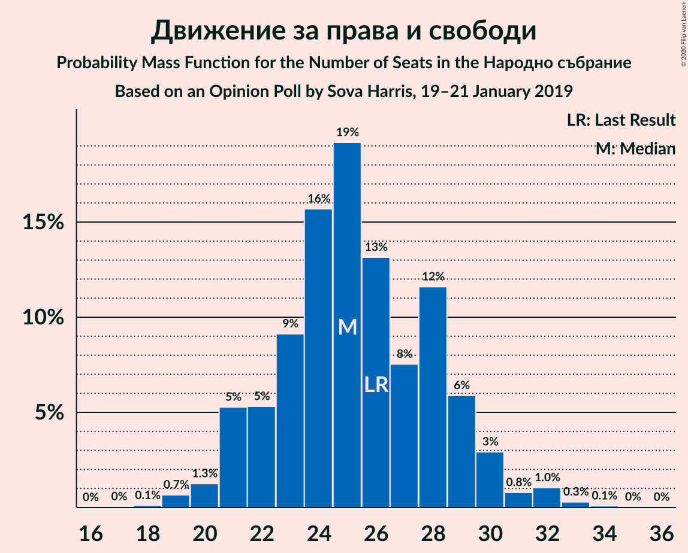
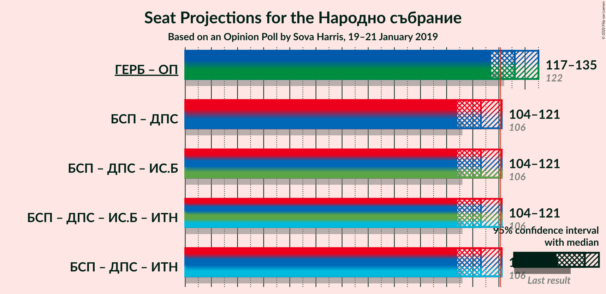
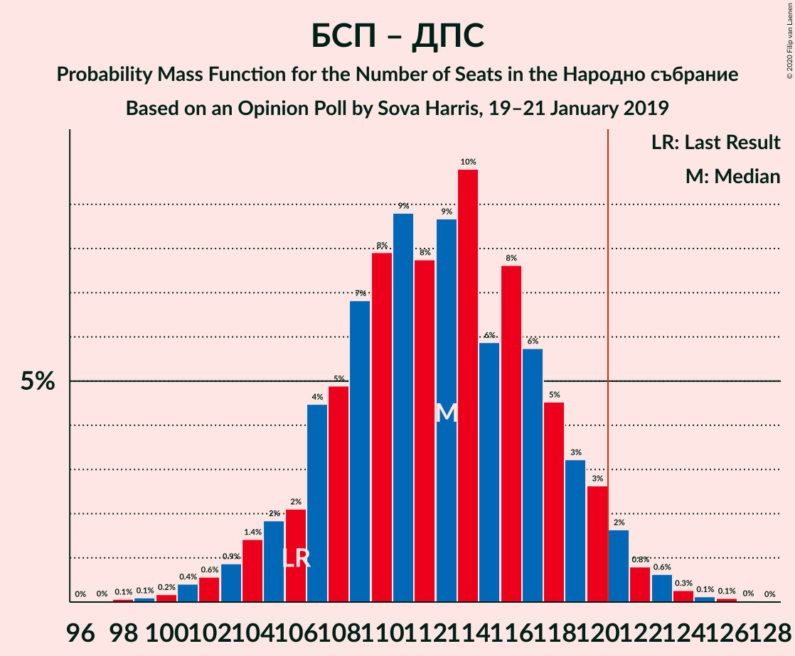

# Opinion Poll by Sova Harris, 19–21 January 2019

<a href="#voting-intentions">Voting Intentions</a> | <a href="#seats">Seats</a> | <a href="#coalitions">Coalitions</a> | <a href="#technical-information">Technical Information</a>

## Voting Intentions

### Confidence Intervals

| Party | Last Result | Poll Result | 80% Confidence Interval | 90% Confidence Interval | 95% Confidence Interval | 99% Confidence Interval |
|:-----:|:-----------:|:-----------:|:-----------------------:|:-----------------------:|:-----------------------:|:-----------------------:|
| Граждани за европейско развитие на България | 33.5% | 36.2% | 34.3–38.2% |33.8–38.8% |33.3–39.3% |32.4–40.3% |
| Българска социалистическа партия | 27.9% | 31.4% | 29.5–33.3% |29.0–33.9% |28.5–34.3% |27.7–35.3% |
| Обединени Патриоти | 9.3% | 9.0% | 8.0–10.3% |7.7–10.7% |7.4–11.0% |6.9–11.6% |
| Движение за права и свободи | 9.2% | 9.0% | 8.0–10.3% |7.7–10.7% |7.4–11.0% |6.9–11.6% |
| Демократична България | 0.0% | 3.0% | 2.4–3.9% |2.3–4.1% |2.1–4.3% |1.9–4.8% |
| Воля | 4.3% | 2.8% | 2.3–3.7% |2.1–3.9% |2.0–4.1% |1.7–4.5% |
| Алтернатива за българско възраждане | 1.6% | 1.3% | 1.0–1.9% |0.9–2.1% |0.8–2.3% |0.6–2.6% |

*Note:* The poll result column reflects the actual value used in the calculations. Published results may vary slightly, and in addition be rounded to fewer digits.

## Seats

### Confidence Intervals

| Party | Last Result | Median | 80% Confidence Interval | 90% Confidence Interval | 95% Confidence Interval | 99% Confidence Interval |
|:-----:|:-----------:|:------:|:-----------------------:|:-----------------------:|:-----------------------:|:-----------------------:|
| <a href="#граждани-за-европейско-развитие-на-българия">Граждани за европейско развитие на България</a> | 95 | 101 | 95–106 |94–108 |92–109 |89–112 |
| <a href="#българска-социалистическа-партия">Българска социалистическа партия</a> | 80 | 87 | 82–93 |80–94 |79–95 |76–98 |
| <a href="#обединени-патриоти">Обединени Патриоти</a> | 27 | 25 | 22–29 |21–30 |20–31 |19–32 |
| <a href="#движение-за-права-и-свободи">Движение за права и свободи</a> | 26 | 25 | 22–29 |21–30 |21–30 |19–32 |
| <a href="#демократична-българия">Демократична България</a> | 0 | 0 | 0 |0–11 |0–12 |0–13 |
| <a href="#воля">Воля</a> | 12 | 0 | 0 |0 |0–11 |0–12 |
| <a href="#алтернатива-за-българско-възраждане">Алтернатива за българско възраждане</a> | 0 | 0 | 0 |0 |0 |0 |

### Граждани за европейско развитие на България

*For a full overview of the results for this party, see the [Граждани за европейско развитие на България](party-гражданизаевропейскоразвитиенабългария.html) page.*

| Number of Seats | Probability | Accumulated | Special Marks |
|:---------------:|:-----------:|:-----------:|:-------------:|
| 86 | 0% | 100% |  |
| 87 | 0.1% | 99.9% |  |
| 88 | 0.1% | 99.9% |  |
| 89 | 0.2% | 99.7% |  |
| 90 | 0.5% | 99.5% |  |
| 91 | 0.7% | 98.9% |  |
| 92 | 1.1% | 98% |  |
| 93 | 2% | 97% |  |
| 94 | 3% | 95% |  |
| 95 | 3% | 93% | Last Result |
| 96 | 5% | 89% |  |
| 97 | 5% | 84% |  |
| 98 | 8% | 79% |  |
| 99 | 8% | 71% |  |
| 100 | 9% | 63% |  |
| 101 | 9% | 54% | Median |
| 102 | 9% | 45% |  |
| 103 | 8% | 37% |  |
| 104 | 8% | 28% |  |
| 105 | 6% | 20% |  |
| 106 | 5% | 15% |  |
| 107 | 4% | 10% |  |
| 108 | 2% | 6% |  |
| 109 | 2% | 4% |  |
| 110 | 0.9% | 2% |  |
| 111 | 0.5% | 1.2% |  |
| 112 | 0.3% | 0.6% |  |
| 113 | 0.2% | 0.3% |  |
| 114 | 0.1% | 0.1% |  |
| 115 | 0% | 0.1% |  |
| 116 | 0% | 0% |  |

### Българска социалистическа партия

*For a full overview of the results for this party, see the [Българска социалистическа партия](party-българскасоциалистическапартия.html) page.*

| Number of Seats | Probability | Accumulated | Special Marks |
|:---------------:|:-----------:|:-----------:|:-------------:|
| 73 | 0% | 100% |  |
| 74 | 0.1% | 99.9% |  |
| 75 | 0.1% | 99.9% |  |
| 76 | 0.3% | 99.8% |  |
| 77 | 0.4% | 99.5% |  |
| 78 | 0.8% | 99.1% |  |
| 79 | 1.5% | 98% |  |
| 80 | 2% | 97% | Last Result |
| 81 | 3% | 95% |  |
| 82 | 4% | 92% |  |
| 83 | 5% | 88% |  |
| 84 | 7% | 83% |  |
| 85 | 8% | 75% |  |
| 86 | 11% | 67% |  |
| 87 | 9% | 57% | Median |
| 88 | 8% | 47% |  |
| 89 | 9% | 39% |  |
| 90 | 7% | 30% |  |
| 91 | 6% | 23% |  |
| 92 | 6% | 17% |  |
| 93 | 4% | 11% |  |
| 94 | 3% | 7% |  |
| 95 | 2% | 4% |  |
| 96 | 1.2% | 2% |  |
| 97 | 0.5% | 1.2% |  |
| 98 | 0.4% | 0.7% |  |
| 99 | 0.2% | 0.3% |  |
| 100 | 0.1% | 0.2% |  |
| 101 | 0% | 0.1% |  |
| 102 | 0% | 0% |  |

### Обединени Патриоти

*For a full overview of the results for this party, see the [Обединени Патриоти](party-обединенипатриоти.html) page.*

| Number of Seats | Probability | Accumulated | Special Marks |
|:---------------:|:-----------:|:-----------:|:-------------:|
| 18 | 0.1% | 100% |  |
| 19 | 0.6% | 99.8% |  |
| 20 | 2% | 99.2% |  |
| 21 | 3% | 97% |  |
| 22 | 6% | 94% |  |
| 23 | 14% | 88% |  |
| 24 | 15% | 75% |  |
| 25 | 11% | 59% | Median |
| 26 | 12% | 48% |  |
| 27 | 15% | 36% | Last Result |
| 28 | 12% | 22% |  |
| 29 | 5% | 10% |  |
| 30 | 2% | 5% |  |
| 31 | 2% | 3% |  |
| 32 | 0.8% | 1.1% |  |
| 33 | 0.2% | 0.4% |  |
| 34 | 0.1% | 0.1% |  |
| 35 | 0% | 0% |  |

### Движение за права и свободи

*For a full overview of the results for this party, see the [Движение за права и свободи](party-движениезаправаисвободи.html) page.*

| Number of Seats | Probability | Accumulated | Special Marks |
|:---------------:|:-----------:|:-----------:|:-------------:|
| 18 | 0.1% | 100% |  |
| 19 | 0.7% | 99.8% |  |
| 20 | 1.3% | 99.2% |  |
| 21 | 5% | 98% |  |
| 22 | 5% | 93% |  |
| 23 | 9% | 87% |  |
| 24 | 16% | 78% |  |
| 25 | 19% | 63% | Median |
| 26 | 13% | 43% | Last Result |
| 27 | 8% | 30% |  |
| 28 | 12% | 23% |  |
| 29 | 6% | 11% |  |
| 30 | 3% | 5% |  |
| 31 | 0.8% | 2% |  |
| 32 | 1.0% | 1.5% |  |
| 33 | 0.3% | 0.4% |  |
| 34 | 0.1% | 0.1% |  |
| 35 | 0% | 0% |  |

### Демократична България

*For a full overview of the results for this party, see the [Демократична България](party-демократичнабългария.html) page.*

| Number of Seats | Probability | Accumulated | Special Marks |
|:---------------:|:-----------:|:-----------:|:-------------:|
| 0 | 94% | 100% | Last Result, Median |
| 1 | 0% | 6% |  |
| 2 | 0% | 6% |  |
| 3 | 0% | 6% |  |
| 4 | 0% | 6% |  |
| 5 | 0% | 6% |  |
| 6 | 0% | 6% |  |
| 7 | 0% | 6% |  |
| 8 | 0% | 6% |  |
| 9 | 0% | 6% |  |
| 10 | 0% | 6% |  |
| 11 | 3% | 6% |  |
| 12 | 2% | 3% |  |
| 13 | 0.6% | 0.7% |  |
| 14 | 0.1% | 0.2% |  |
| 15 | 0% | 0% |  |

### Воля

*For a full overview of the results for this party, see the [Воля](party-воля.html) page.*

| Number of Seats | Probability | Accumulated | Special Marks |
|:---------------:|:-----------:|:-----------:|:-------------:|
| 0 | 97% | 100% | Median |
| 1 | 0% | 3% |  |
| 2 | 0% | 3% |  |
| 3 | 0% | 3% |  |
| 4 | 0% | 3% |  |
| 5 | 0% | 3% |  |
| 6 | 0% | 3% |  |
| 7 | 0% | 3% |  |
| 8 | 0% | 3% |  |
| 9 | 0% | 3% |  |
| 10 | 0% | 3% |  |
| 11 | 2% | 3% |  |
| 12 | 0.8% | 1.2% | Last Result |
| 13 | 0.3% | 0.3% |  |
| 14 | 0% | 0% |  |

### Алтернатива за българско възраждане

*For a full overview of the results for this party, see the [Алтернатива за българско възраждане](party-алтернативазабългарсковъзраждане.html) page.*

| Number of Seats | Probability | Accumulated | Special Marks |
|:---------------:|:-----------:|:-----------:|:-------------:|
| 0 | 100% | 100% | Last Result, Median |

## Coalitions

### Confidence Intervals

| Coalition | Last Result | Median | Majority? | 80% Confidence Interval | 90% Confidence Interval | 95% Confidence Interval | 99% Confidence Interval |
|:---------:|:-----------:|:------:|:---------:|:-----------------------:|:-----------------------:|:-----------------------:|:-----------------------:|
| Граждани за европейско развитие на България – Обединени Патриоти | 122 | 126 | 89% | 120–132 | 119–133 | 117–135 | 114–137 |
| Българска социалистическа партия – Движение за права и свободи | 106 | 113 | 4% | 107–118 | 105–120 | 104–121 | 101–124 |

### Граждани за европейско развитие на България – Обединени Патриоти

| Number of Seats | Probability | Accumulated | Special Marks |
|:---------------:|:-----------:|:-----------:|:-------------:|
| 110 | 0% | 100% |  |
| 111 | 0.1% | 99.9% |  |
| 112 | 0.1% | 99.9% |  |
| 113 | 0.2% | 99.8% |  |
| 114 | 0.3% | 99.5% |  |
| 115 | 0.5% | 99.2% |  |
| 116 | 0.7% | 98.7% |  |
| 117 | 1.2% | 98% |  |
| 118 | 1.4% | 97% |  |
| 119 | 3% | 95% |  |
| 120 | 3% | 93% |  |
| 121 | 4% | 89% | Majority |
| 122 | 5% | 85% | Last Result |
| 123 | 6% | 80% |  |
| 124 | 8% | 74% |  |
| 125 | 6% | 66% |  |
| 126 | 10% | 59% | Median |
| 127 | 9% | 50% |  |
| 128 | 8% | 41% |  |
| 129 | 8% | 33% |  |
| 130 | 7% | 25% |  |
| 131 | 6% | 18% |  |
| 132 | 4% | 12% |  |
| 133 | 4% | 8% |  |
| 134 | 1.4% | 4% |  |
| 135 | 1.2% | 3% |  |
| 136 | 0.9% | 2% |  |
| 137 | 0.4% | 0.8% |  |
| 138 | 0.2% | 0.4% |  |
| 139 | 0.1% | 0.2% |  |
| 140 | 0.1% | 0.1% |  |
| 141 | 0% | 0% |  |

### Българска социалистическа партия – Движение за права и свободи

| Number of Seats | Probability | Accumulated | Special Marks |
|:---------------:|:-----------:|:-----------:|:-------------:|
| 97 | 0% | 100% |  |
| 98 | 0.1% | 99.9% |  |
| 99 | 0.1% | 99.9% |  |
| 100 | 0.2% | 99.8% |  |
| 101 | 0.4% | 99.6% |  |
| 102 | 0.6% | 99.2% |  |
| 103 | 0.9% | 98.6% |  |
| 104 | 1.4% | 98% |  |
| 105 | 2% | 96% |  |
| 106 | 2% | 94% | Last Result |
| 107 | 4% | 92% |  |
| 108 | 5% | 88% |  |
| 109 | 7% | 83% |  |
| 110 | 8% | 76% |  |
| 111 | 9% | 68% |  |
| 112 | 8% | 59% | Median |
| 113 | 9% | 52% |  |
| 114 | 10% | 43% |  |
| 115 | 6% | 33% |  |
| 116 | 8% | 27% |  |
| 117 | 6% | 20% |  |
| 118 | 5% | 14% |  |
| 119 | 3% | 9% |  |
| 120 | 3% | 6% |  |
| 121 | 2% | 4% | Majority |
| 122 | 0.8% | 2% |  |
| 123 | 0.6% | 1.2% |  |
| 124 | 0.3% | 0.5% |  |
| 125 | 0.1% | 0.3% |  |
| 126 | 0.1% | 0.1% |  |
| 127 | 0% | 0.1% |  |
| 128 | 0% | 0% |  |

## Technical Information

### Opinion Poll

+ **Polling firm:** Sova Harris
+ **Commissioner(s):** —
+ **Fieldwork period:** 19–21 January 2019

### Calculations

+ **Sample size:** 985
+ **Simulations done:** 1,048,576
+ **Error estimate:** 1.04%

