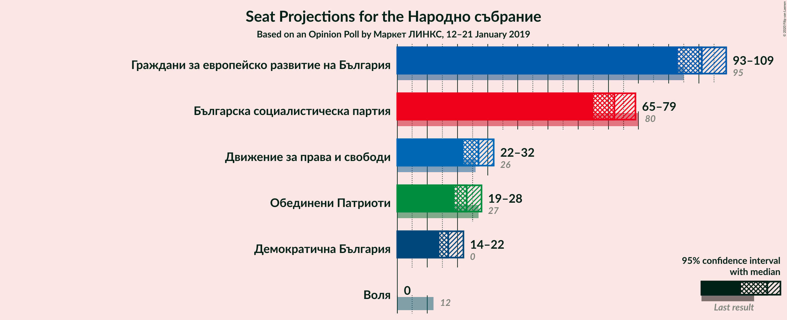
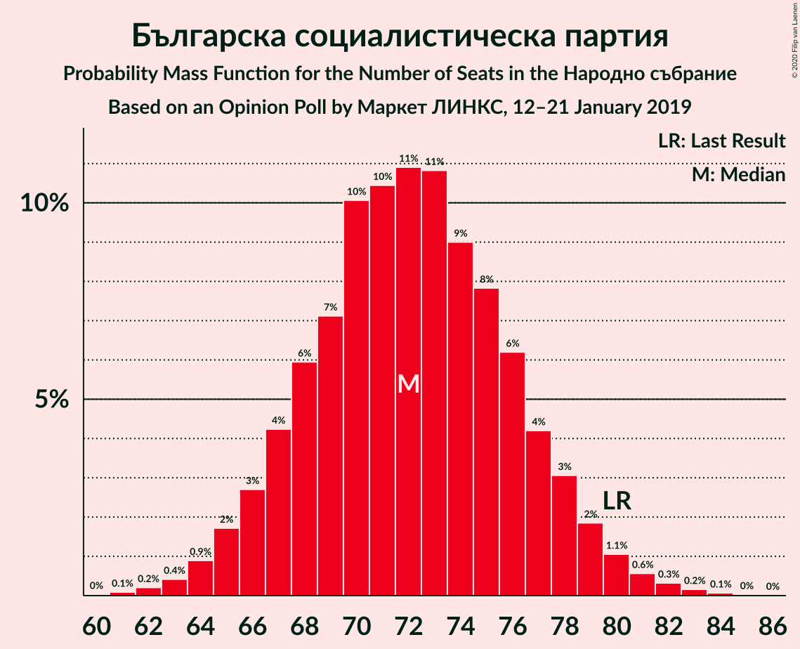
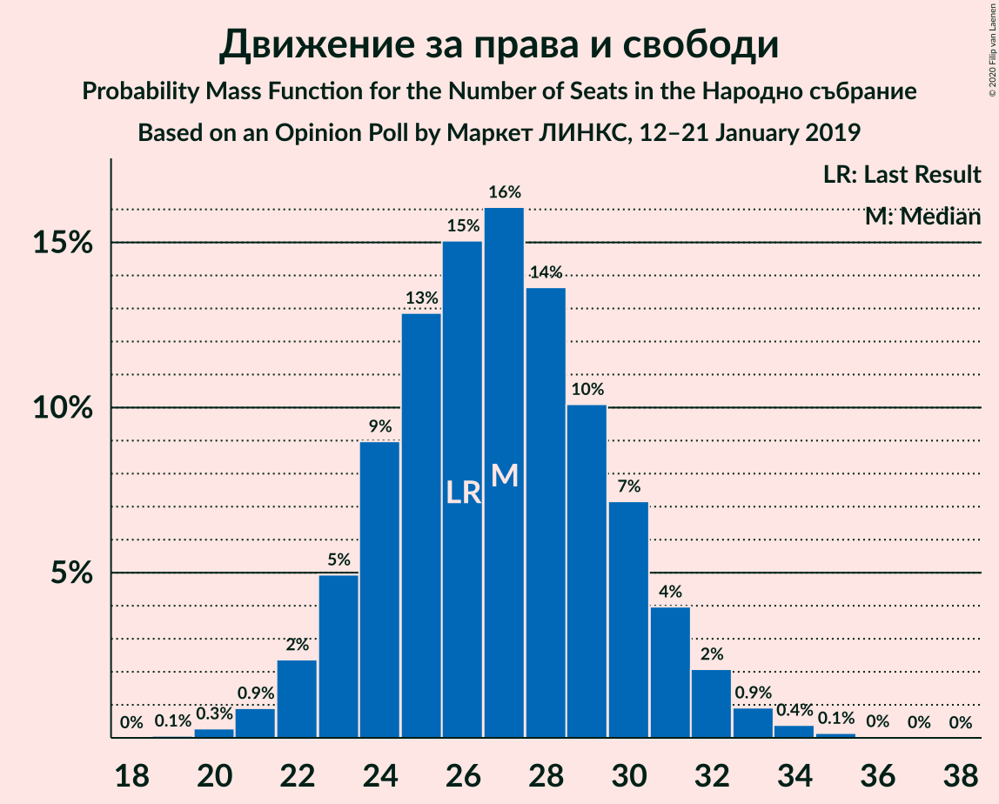
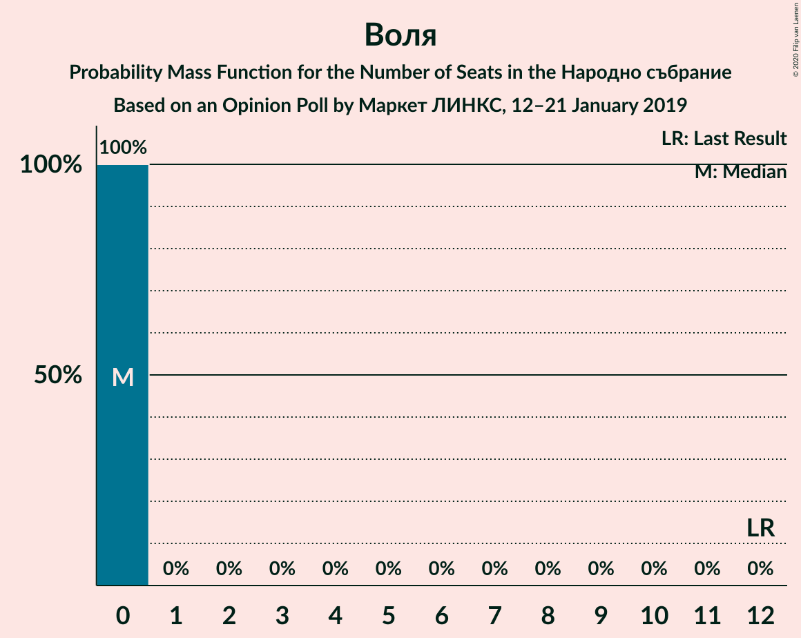
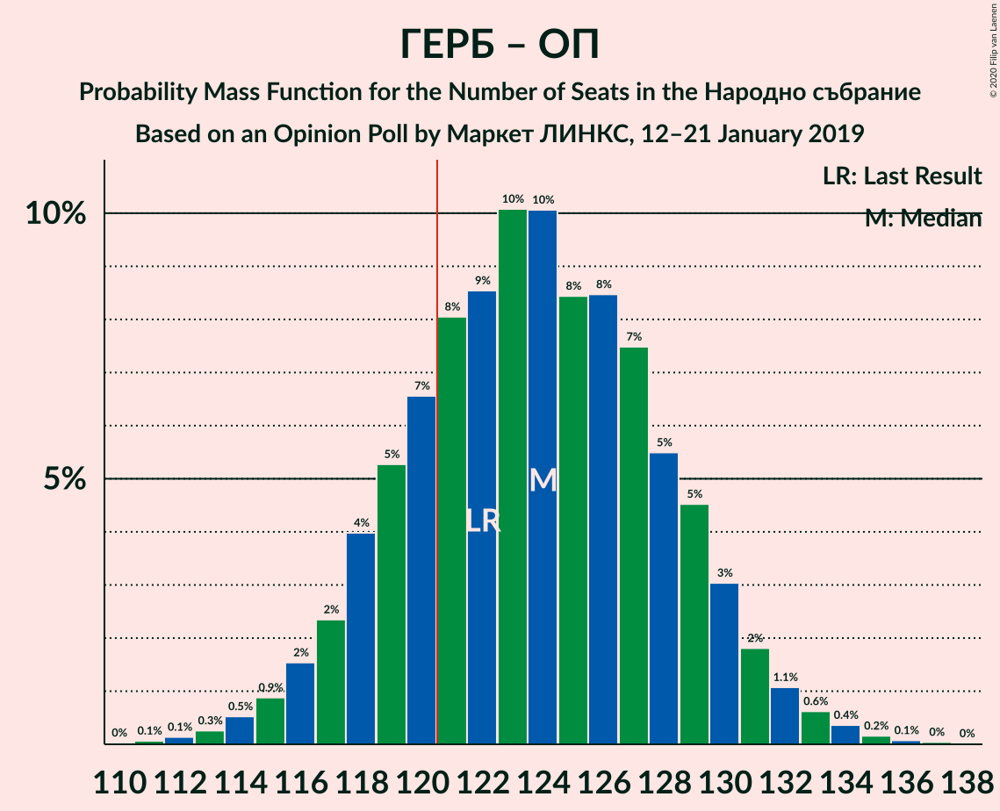
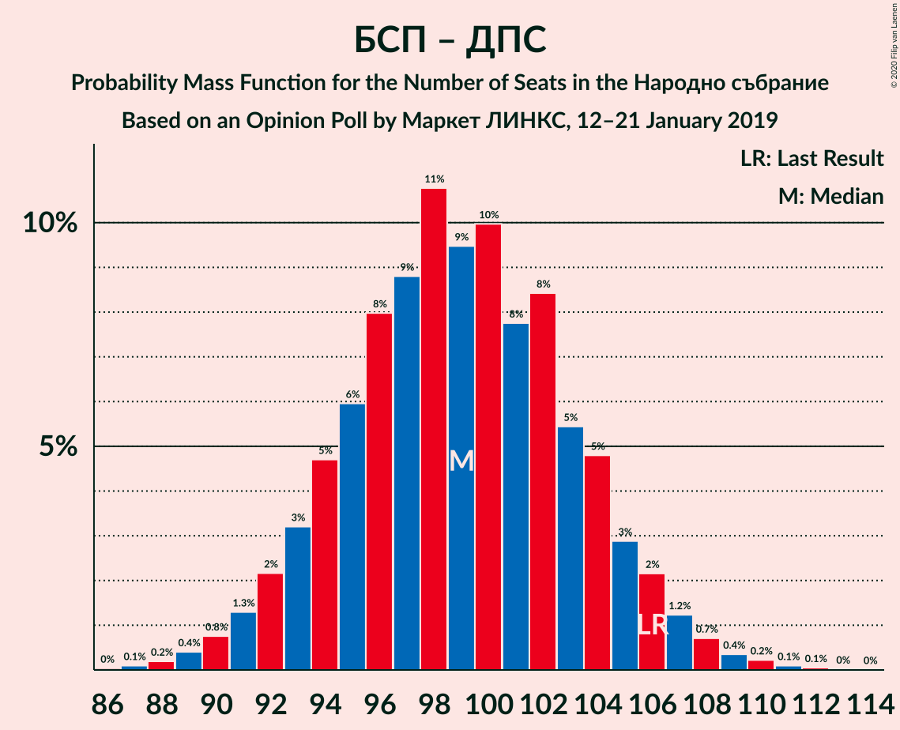

# Opinion Poll by Маркет ЛИНКС, 12–21 January 2019

<a href="#voting-intentions">Voting Intentions</a> | <a href="#seats">Seats</a> | <a href="#coalitions">Coalitions</a> | <a href="#technical-information">Technical Information</a>

## Voting Intentions

### Confidence Intervals

| Party | Last Result | Poll Result | 80% Confidence Interval | 90% Confidence Interval | 95% Confidence Interval | 99% Confidence Interval |
|:-----:|:-----------:|:-----------:|:-----------------------:|:-----------------------:|:-----------------------:|:-----------------------:|
| Граждани за европейско развитие на България | 33.5% | 37.9% | 36.0–39.9% |35.5–40.5% |35.0–41.0% |34.1–41.9% |
| Българска социалистическа партия | 27.9% | 27.1% | 25.4–29.0% |24.9–29.5% |24.4–29.9% |23.6–30.8% |
| Движение за права и свободи | 9.2% | 10.0% | 8.9–11.4% |8.6–11.7% |8.3–12.1% |7.8–12.7% |
| Обединени Патриоти | 9.3% | 8.5% | 7.5–9.8% |7.2–10.1% |7.0–10.4% |6.5–11.1% |
| Демократична България | 0.0% | 6.5% | 5.6–7.6% |5.3–7.9% |5.1–8.2% |4.7–8.7% |
| Воля | 4.3% | 1.3% | 0.9–1.9% |0.8–2.1% |0.7–2.2% |0.6–2.5% |

*Note:* The poll result column reflects the actual value used in the calculations. Published results may vary slightly, and in addition be rounded to fewer digits.

## Seats

### Confidence Intervals

| Party | Last Result | Median | 80% Confidence Interval | 90% Confidence Interval | 95% Confidence Interval | 99% Confidence Interval |
|:-----:|:-----------:|:------:|:-----------------------:|:-----------------------:|:-----------------------:|:-----------------------:|
| <a href="#граждани-за-европейско-развитие-на-българия">Граждани за европейско развитие на България</a> | 95 | 101 | 96–106 |94–107 |93–108 |91–111 |
| <a href="#българска-социалистическа-партия">Българска социалистическа партия</a> | 80 | 72 | 67–77 |66–78 |65–79 |63–82 |
| <a href="#движение-за-права-и-свободи">Движение за права и свободи</a> | 26 | 27 | 24–30 |23–31 |22–32 |21–34 |
| <a href="#обединени-патриоти">Обединени Патриоти</a> | 27 | 23 | 20–26 |19–27 |19–28 |17–29 |
| <a href="#демократична-българия">Демократична България</a> | 0 | 18 | 15–20 |14–21 |14–22 |13–23 |
| <a href="#воля">Воля</a> | 12 | 0 | 0 |0 |0 |0 |

### Граждани за европейско развитие на България

*For a full overview of the results for this party, see the [Граждани за европейско развитие на България](party-гражданизаевропейскоразвитиенабългария.html) page.*

| Number of Seats | Probability | Accumulated | Special Marks |
|:---------------:|:-----------:|:-----------:|:-------------:|
| 88 | 0% | 100% |  |
| 89 | 0.1% | 99.9% |  |
| 90 | 0.2% | 99.8% |  |
| 91 | 0.4% | 99.6% |  |
| 92 | 0.8% | 99.2% |  |
| 93 | 1.2% | 98% |  |
| 94 | 3% | 97% |  |
| 95 | 4% | 95% | Last Result |
| 96 | 4% | 90% |  |
| 97 | 7% | 86% |  |
| 98 | 7% | 79% |  |
| 99 | 11% | 73% |  |
| 100 | 9% | 62% |  |
| 101 | 11% | 53% | Median |
| 102 | 8% | 42% |  |
| 103 | 9% | 34% |  |
| 104 | 8% | 25% |  |
| 105 | 6% | 17% |  |
| 106 | 3% | 10% |  |
| 107 | 3% | 7% |  |
| 108 | 2% | 4% |  |
| 109 | 1.1% | 2% |  |
| 110 | 0.6% | 1.3% |  |
| 111 | 0.3% | 0.7% |  |
| 112 | 0.2% | 0.4% |  |
| 113 | 0.1% | 0.2% |  |
| 114 | 0.1% | 0.1% |  |
| 115 | 0% | 0% |  |

### Българска социалистическа партия

*For a full overview of the results for this party, see the [Българска социалистическа партия](party-българскасоциалистическапартия.html) page.*

| Number of Seats | Probability | Accumulated | Special Marks |
|:---------------:|:-----------:|:-----------:|:-------------:|
| 61 | 0.1% | 100% |  |
| 62 | 0.2% | 99.9% |  |
| 63 | 0.4% | 99.6% |  |
| 64 | 0.8% | 99.2% |  |
| 65 | 1.4% | 98% |  |
| 66 | 3% | 97% |  |
| 67 | 7% | 94% |  |
| 68 | 4% | 88% |  |
| 69 | 6% | 84% |  |
| 70 | 10% | 78% |  |
| 71 | 11% | 68% |  |
| 72 | 14% | 57% | Median |
| 73 | 10% | 43% |  |
| 74 | 7% | 33% |  |
| 75 | 9% | 26% |  |
| 76 | 6% | 17% |  |
| 77 | 4% | 11% |  |
| 78 | 4% | 7% |  |
| 79 | 1.4% | 3% |  |
| 80 | 1.0% | 2% | Last Result |
| 81 | 0.5% | 1.0% |  |
| 82 | 0.2% | 0.5% |  |
| 83 | 0.2% | 0.3% |  |
| 84 | 0.1% | 0.2% |  |
| 85 | 0% | 0% |  |

### Движение за права и свободи

*For a full overview of the results for this party, see the [Движение за права и свободи](party-движениезаправаисвободи.html) page.*

| Number of Seats | Probability | Accumulated | Special Marks |
|:---------------:|:-----------:|:-----------:|:-------------:|
| 19 | 0.1% | 100% |  |
| 20 | 0.2% | 99.9% |  |
| 21 | 0.9% | 99.7% |  |
| 22 | 3% | 98.8% |  |
| 23 | 5% | 96% |  |
| 24 | 8% | 91% |  |
| 25 | 10% | 83% |  |
| 26 | 15% | 73% | Last Result |
| 27 | 20% | 57% | Median |
| 28 | 15% | 37% |  |
| 29 | 8% | 22% |  |
| 30 | 5% | 13% |  |
| 31 | 4% | 8% |  |
| 32 | 2% | 4% |  |
| 33 | 1.2% | 2% |  |
| 34 | 0.4% | 0.5% |  |
| 35 | 0.1% | 0.2% |  |
| 36 | 0% | 0% |  |

### Обединени Патриоти

*For a full overview of the results for this party, see the [Обединени Патриоти](party-обединенипатриоти.html) page.*

| Number of Seats | Probability | Accumulated | Special Marks |
|:---------------:|:-----------:|:-----------:|:-------------:|
| 16 | 0.1% | 100% |  |
| 17 | 0.6% | 99.9% |  |
| 18 | 2% | 99.3% |  |
| 19 | 3% | 98% |  |
| 20 | 9% | 94% |  |
| 21 | 14% | 86% |  |
| 22 | 16% | 72% |  |
| 23 | 16% | 55% | Median |
| 24 | 16% | 40% |  |
| 25 | 9% | 24% |  |
| 26 | 8% | 14% |  |
| 27 | 3% | 7% | Last Result |
| 28 | 2% | 3% |  |
| 29 | 0.6% | 1.0% |  |
| 30 | 0.3% | 0.4% |  |
| 31 | 0.1% | 0.1% |  |
| 32 | 0% | 0% |  |

### Демократична България

*For a full overview of the results for this party, see the [Демократична България](party-демократичнабългария.html) page.*

| Number of Seats | Probability | Accumulated | Special Marks |
|:---------------:|:-----------:|:-----------:|:-------------:|
| 0 | 0% | 100% | Last Result |
| 1 | 0% | 100% |  |
| 2 | 0% | 100% |  |
| 3 | 0% | 100% |  |
| 4 | 0% | 100% |  |
| 5 | 0% | 100% |  |
| 6 | 0% | 100% |  |
| 7 | 0% | 100% |  |
| 8 | 0% | 100% |  |
| 9 | 0% | 100% |  |
| 10 | 0% | 100% |  |
| 11 | 0.1% | 100% |  |
| 12 | 0.4% | 99.9% |  |
| 13 | 1.5% | 99.5% |  |
| 14 | 7% | 98% |  |
| 15 | 10% | 91% |  |
| 16 | 11% | 80% |  |
| 17 | 19% | 69% |  |
| 18 | 26% | 51% | Median |
| 19 | 11% | 25% |  |
| 20 | 6% | 14% |  |
| 21 | 5% | 8% |  |
| 22 | 2% | 3% |  |
| 23 | 0.7% | 1.0% |  |
| 24 | 0.2% | 0.3% |  |
| 25 | 0.1% | 0.1% |  |
| 26 | 0% | 0% |  |

### Воля

*For a full overview of the results for this party, see the [Воля](party-воля.html) page.*

| Number of Seats | Probability | Accumulated | Special Marks |
|:---------------:|:-----------:|:-----------:|:-------------:|
| 0 | 100% | 100% | Median |
| 1 | 0% | 0% |  |
| 2 | 0% | 0% |  |
| 3 | 0% | 0% |  |
| 4 | 0% | 0% |  |
| 5 | 0% | 0% |  |
| 6 | 0% | 0% |  |
| 7 | 0% | 0% |  |
| 8 | 0% | 0% |  |
| 9 | 0% | 0% |  |
| 10 | 0% | 0% |  |
| 11 | 0% | 0% |  |
| 12 | 0% | 0% | Last Result |

## Coalitions

### Confidence Intervals

| Coalition | Last Result | Median | Majority? | 80% Confidence Interval | 90% Confidence Interval | 95% Confidence Interval | 99% Confidence Interval |
|:---------:|:-----------:|:------:|:---------:|:-----------------------:|:-----------------------:|:-----------------------:|:-----------------------:|
| Граждани за европейско развитие на България – Обединени Патриоти | 122 | 124 | 78% | 119–129 | 117–130 | 116–131 | 114–134 |
| Българска социалистическа партия – Движение за права и свободи | 106 | 99 | 0% | 94–104 | 92–105 | 91–107 | 89–109 |

### Граждани за европейско развитие на България – Обединени Патриоти

| Number of Seats | Probability | Accumulated | Special Marks |
|:---------------:|:-----------:|:-----------:|:-------------:|
| 111 | 0.1% | 100% |  |
| 112 | 0.1% | 99.9% |  |
| 113 | 0.1% | 99.7% |  |
| 114 | 0.7% | 99.6% |  |
| 115 | 0.9% | 98.9% |  |
| 116 | 1.4% | 98% |  |
| 117 | 2% | 97% |  |
| 118 | 3% | 95% |  |
| 119 | 5% | 92% |  |
| 120 | 8% | 86% |  |
| 121 | 9% | 78% | Majority |
| 122 | 6% | 70% | Last Result |
| 123 | 14% | 64% |  |
| 124 | 11% | 50% | Median |
| 125 | 8% | 39% |  |
| 126 | 8% | 31% |  |
| 127 | 6% | 23% |  |
| 128 | 5% | 17% |  |
| 129 | 4% | 12% |  |
| 130 | 3% | 8% |  |
| 131 | 2% | 5% |  |
| 132 | 0.9% | 2% |  |
| 133 | 0.9% | 2% |  |
| 134 | 0.4% | 0.7% |  |
| 135 | 0.2% | 0.3% |  |
| 136 | 0.1% | 0.1% |  |
| 137 | 0% | 0.1% |  |
| 138 | 0% | 0% |  |

### Българска социалистическа партия – Движение за права и свободи

| Number of Seats | Probability | Accumulated | Special Marks |
|:---------------:|:-----------:|:-----------:|:-------------:|
| 86 | 0% | 100% |  |
| 87 | 0.1% | 99.9% |  |
| 88 | 0.1% | 99.8% |  |
| 89 | 0.3% | 99.7% |  |
| 90 | 1.0% | 99.4% |  |
| 91 | 2% | 98% |  |
| 92 | 3% | 97% |  |
| 93 | 3% | 94% |  |
| 94 | 4% | 91% |  |
| 95 | 5% | 86% |  |
| 96 | 7% | 81% |  |
| 97 | 6% | 74% |  |
| 98 | 10% | 68% |  |
| 99 | 16% | 58% | Median |
| 100 | 10% | 41% |  |
| 101 | 5% | 32% |  |
| 102 | 10% | 27% |  |
| 103 | 6% | 17% |  |
| 104 | 3% | 11% |  |
| 105 | 3% | 8% |  |
| 106 | 2% | 5% | Last Result |
| 107 | 2% | 3% |  |
| 108 | 0.6% | 1.3% |  |
| 109 | 0.3% | 0.7% |  |
| 110 | 0.2% | 0.4% |  |
| 111 | 0.1% | 0.2% |  |
| 112 | 0% | 0.1% |  |
| 113 | 0% | 0% |  |

## Technical Information

### Opinion Poll

+ **Polling firm:** Маркет ЛИНКС
+ **Commissioner(s):** —
+ **Fieldwork period:** 12–21 January 2019

### Calculations

+ **Sample size:** 1007
+ **Simulations done:** 131,072
+ **Error estimate:** 1.33%

