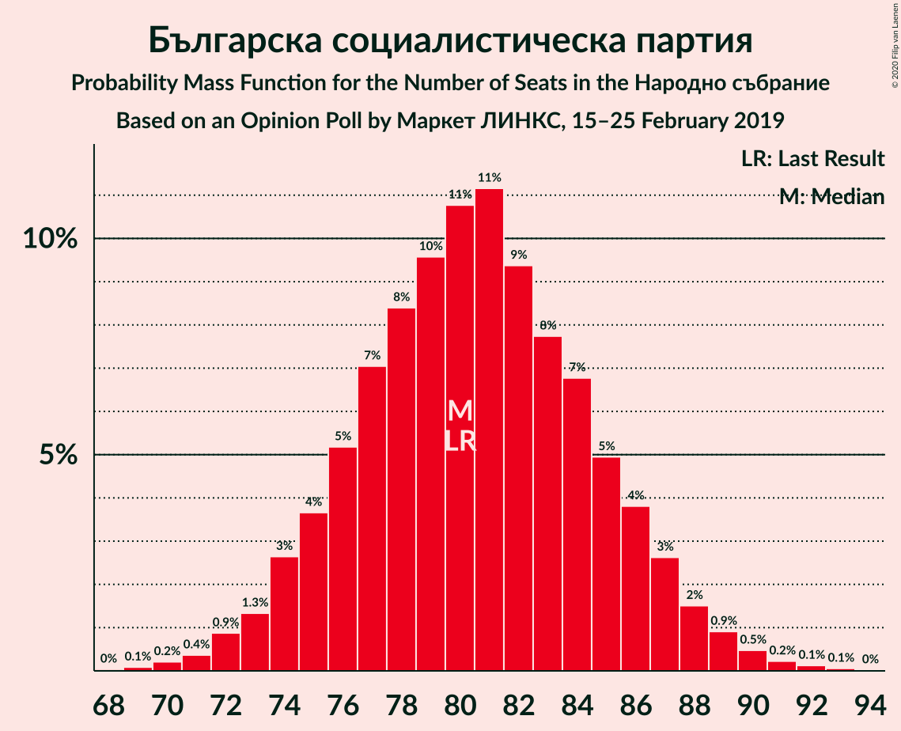
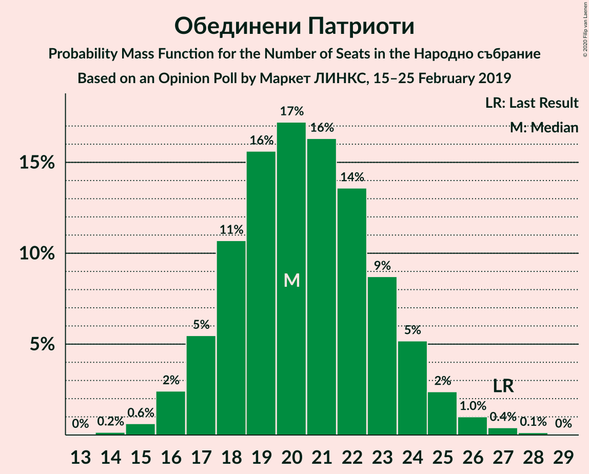
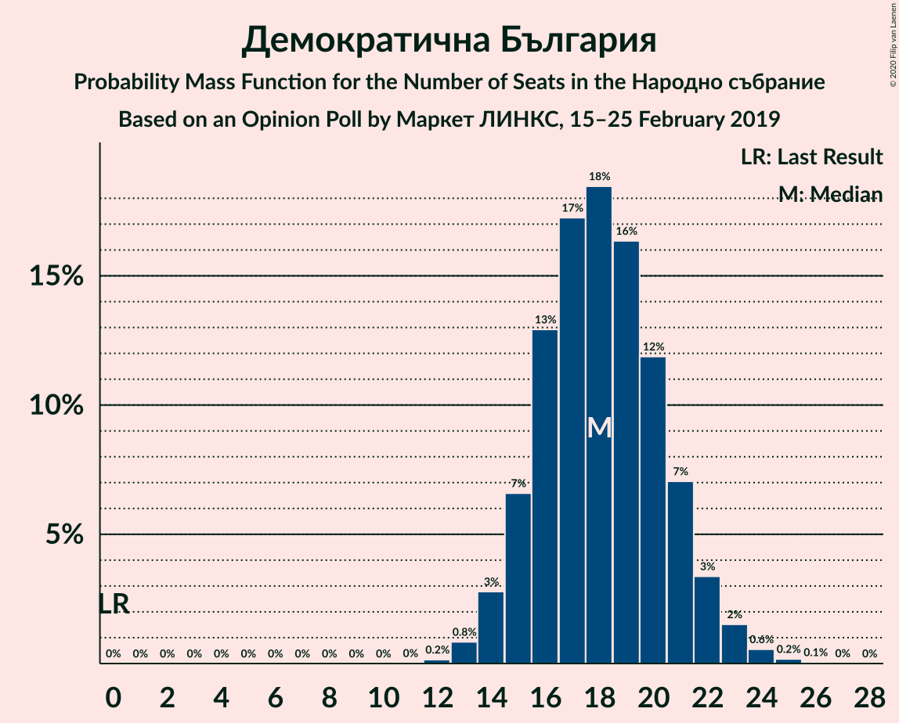
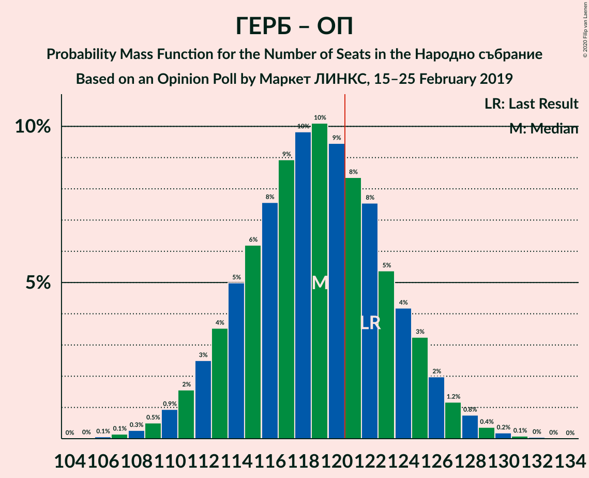
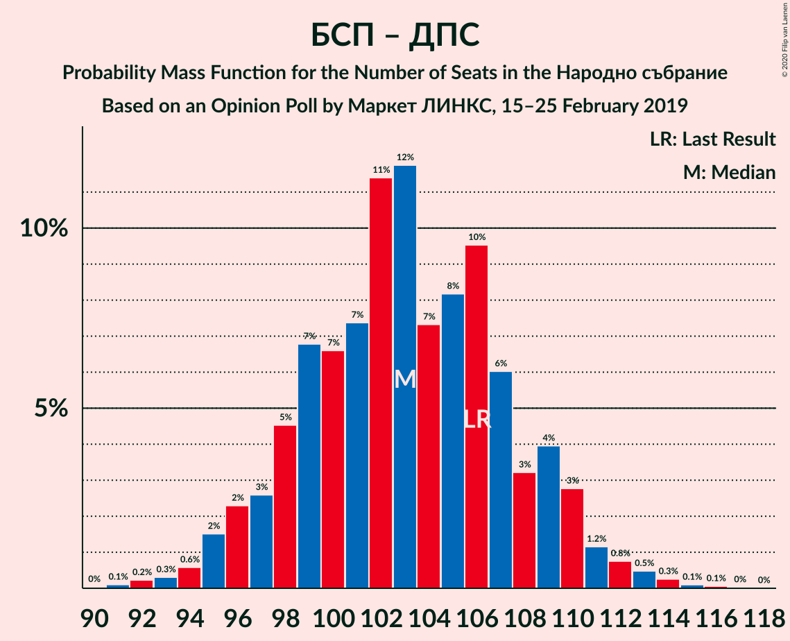

# Opinion Poll by Маркет ЛИНКС, 15–25 February 2019

<a href="#voting-intentions">Voting Intentions</a> | <a href="#seats">Seats</a> | <a href="#coalitions">Coalitions</a> | <a href="#technical-information">Technical Information</a>

## Voting Intentions

### Confidence Intervals

| Party | Last Result | Poll Result | 80% Confidence Interval | 90% Confidence Interval | 95% Confidence Interval | 99% Confidence Interval |
|:-----:|:-----------:|:-----------:|:-----------------------:|:-----------------------:|:-----------------------:|:-----------------------:|
| Граждани за европейско развитие на България | 33.5% | 36.2% | 34.3–38.2% |33.8–38.8% |33.3–39.3% |32.4–40.2% |
| Българска социалистическа партия | 27.9% | 29.7% | 27.9–31.6% |27.4–32.1% |26.9–32.6% |26.1–33.5% |
| Движение за права и свободи | 9.2% | 8.3% | 7.2–9.5% |7.0–9.8% |6.7–10.1% |6.2–10.7% |
| Обединени Патриоти | 9.3% | 7.5% | 6.5–8.6% |6.2–9.0% |6.0–9.3% |5.6–9.8% |
| Демократична България | 0.0% | 6.6% | 5.7–7.7% |5.4–8.0% |5.2–8.3% |4.8–8.8% |
| Воля | 4.3% | 2.5% | 1.9–3.2% |1.8–3.4% |1.7–3.6% |1.4–4.0% |

*Note:* The poll result column reflects the actual value used in the calculations. Published results may vary slightly, and in addition be rounded to fewer digits.

## Seats

### Confidence Intervals

| Party | Last Result | Median | 80% Confidence Interval | 90% Confidence Interval | 95% Confidence Interval | 99% Confidence Interval |
|:-----:|:-----------:|:------:|:-----------------------:|:-----------------------:|:-----------------------:|:-----------------------:|
| <a href="#граждани-за-европейско-развитие-на-българия">Граждани за европейско развитие на България</a> | 95 | 98 | 94–103 |92–105 |90–107 |88–108 |
| <a href="#българска-социалистическа-партия">Българска социалистическа партия</a> | 80 | 81 | 76–85 |75–87 |73–88 |71–90 |
| <a href="#движение-за-права-и-свободи">Движение за права и свободи</a> | 26 | 22 | 20–26 |19–27 |18–27 |17–29 |
| <a href="#обединени-патриоти">Обединени Патриоти</a> | 27 | 20 | 18–23 |17–24 |16–25 |15–27 |
| <a href="#демократична-българия">Демократична България</a> | 0 | 18 | 15–21 |15–22 |14–23 |13–24 |
| <a href="#воля">Воля</a> | 12 | 0 | 0 |0 |0 |0 |

### Граждани за европейско развитие на България

*For a full overview of the results for this party, see the [Граждани за европейско развитие на България](party-гражданизаевропейскоразвитиенабългария.html) page.*

| Number of Seats | Probability | Accumulated | Special Marks |
|:---------------:|:-----------:|:-----------:|:-------------:|
| 85 | 0% | 100% |  |
| 86 | 0% | 99.9% |  |
| 87 | 0.1% | 99.9% |  |
| 88 | 0.4% | 99.8% |  |
| 89 | 1.1% | 99.5% |  |
| 90 | 2% | 98% |  |
| 91 | 1.3% | 97% |  |
| 92 | 1.1% | 95% |  |
| 93 | 2% | 94% |  |
| 94 | 6% | 92% |  |
| 95 | 12% | 87% | Last Result |
| 96 | 13% | 75% |  |
| 97 | 8% | 61% |  |
| 98 | 4% | 53% | Median |
| 99 | 4% | 49% |  |
| 100 | 11% | 45% |  |
| 101 | 12% | 34% |  |
| 102 | 10% | 22% |  |
| 103 | 5% | 12% |  |
| 104 | 1.0% | 6% |  |
| 105 | 0.8% | 5% |  |
| 106 | 2% | 5% |  |
| 107 | 2% | 3% |  |
| 108 | 0.8% | 1.1% |  |
| 109 | 0.2% | 0.3% |  |
| 110 | 0% | 0.1% |  |
| 111 | 0% | 0.1% |  |
| 112 | 0% | 0.1% |  |
| 113 | 0% | 0% |  |

### Българска социалистическа партия

*For a full overview of the results for this party, see the [Българска социалистическа партия](party-българскасоциалистическапартия.html) page.*

| Number of Seats | Probability | Accumulated | Special Marks |
|:---------------:|:-----------:|:-----------:|:-------------:|
| 68 | 0% | 100% |  |
| 69 | 0.1% | 99.9% |  |
| 70 | 0.3% | 99.9% |  |
| 71 | 0.3% | 99.5% |  |
| 72 | 0.5% | 99.3% |  |
| 73 | 2% | 98.8% |  |
| 74 | 2% | 97% |  |
| 75 | 4% | 95% |  |
| 76 | 7% | 92% |  |
| 77 | 6% | 84% |  |
| 78 | 10% | 78% |  |
| 79 | 9% | 68% |  |
| 80 | 6% | 59% | Last Result |
| 81 | 14% | 53% | Median |
| 82 | 13% | 38% |  |
| 83 | 5% | 25% |  |
| 84 | 7% | 21% |  |
| 85 | 5% | 14% |  |
| 86 | 2% | 9% |  |
| 87 | 4% | 7% |  |
| 88 | 1.4% | 3% |  |
| 89 | 1.0% | 2% |  |
| 90 | 0.6% | 0.9% |  |
| 91 | 0.1% | 0.3% |  |
| 92 | 0.1% | 0.2% |  |
| 93 | 0.1% | 0.1% |  |
| 94 | 0% | 0% |  |

### Движение за права и свободи

*For a full overview of the results for this party, see the [Движение за права и свободи](party-движениезаправаисвободи.html) page.*

| Number of Seats | Probability | Accumulated | Special Marks |
|:---------------:|:-----------:|:-----------:|:-------------:|
| 16 | 0.2% | 100% |  |
| 17 | 0.8% | 99.7% |  |
| 18 | 2% | 98.9% |  |
| 19 | 7% | 97% |  |
| 20 | 11% | 90% |  |
| 21 | 12% | 79% |  |
| 22 | 17% | 67% | Median |
| 23 | 15% | 49% |  |
| 24 | 13% | 34% |  |
| 25 | 11% | 22% |  |
| 26 | 5% | 10% | Last Result |
| 27 | 3% | 5% |  |
| 28 | 2% | 2% |  |
| 29 | 0.5% | 0.8% |  |
| 30 | 0.2% | 0.2% |  |
| 31 | 0.1% | 0.1% |  |
| 32 | 0% | 0% |  |

### Обединени Патриоти

*For a full overview of the results for this party, see the [Обединени Патриоти](party-обединенипатриоти.html) page.*

| Number of Seats | Probability | Accumulated | Special Marks |
|:---------------:|:-----------:|:-----------:|:-------------:|
| 14 | 0.2% | 100% |  |
| 15 | 0.6% | 99.8% |  |
| 16 | 2% | 99.2% |  |
| 17 | 6% | 97% |  |
| 18 | 10% | 91% |  |
| 19 | 18% | 81% |  |
| 20 | 17% | 63% | Median |
| 21 | 14% | 46% |  |
| 22 | 12% | 32% |  |
| 23 | 10% | 20% |  |
| 24 | 6% | 9% |  |
| 25 | 2% | 4% |  |
| 26 | 1.0% | 2% |  |
| 27 | 0.4% | 0.6% | Last Result |
| 28 | 0.2% | 0.2% |  |
| 29 | 0% | 0% |  |

### Демократична България

*For a full overview of the results for this party, see the [Демократична България](party-демократичнабългария.html) page.*

| Number of Seats | Probability | Accumulated | Special Marks |
|:---------------:|:-----------:|:-----------:|:-------------:|
| 0 | 0% | 100% | Last Result |
| 1 | 0% | 100% |  |
| 2 | 0% | 100% |  |
| 3 | 0% | 100% |  |
| 4 | 0% | 100% |  |
| 5 | 0% | 100% |  |
| 6 | 0% | 100% |  |
| 7 | 0% | 100% |  |
| 8 | 0% | 100% |  |
| 9 | 0% | 100% |  |
| 10 | 0% | 100% |  |
| 11 | 0% | 100% |  |
| 12 | 0.2% | 100% |  |
| 13 | 1.0% | 99.8% |  |
| 14 | 2% | 98.8% |  |
| 15 | 7% | 96% |  |
| 16 | 13% | 90% |  |
| 17 | 16% | 77% |  |
| 18 | 18% | 61% | Median |
| 19 | 15% | 43% |  |
| 20 | 13% | 27% |  |
| 21 | 7% | 14% |  |
| 22 | 4% | 6% |  |
| 23 | 2% | 3% |  |
| 24 | 0.6% | 0.9% |  |
| 25 | 0.2% | 0.3% |  |
| 26 | 0.1% | 0.1% |  |
| 27 | 0% | 0% |  |

### Воля

*For a full overview of the results for this party, see the [Воля](party-воля.html) page.*

| Number of Seats | Probability | Accumulated | Special Marks |
|:---------------:|:-----------:|:-----------:|:-------------:|
| 0 | 99.6% | 100% | Median |
| 1 | 0% | 0.4% |  |
| 2 | 0% | 0.4% |  |
| 3 | 0% | 0.4% |  |
| 4 | 0% | 0.4% |  |
| 5 | 0% | 0.4% |  |
| 6 | 0% | 0.4% |  |
| 7 | 0% | 0.4% |  |
| 8 | 0% | 0.4% |  |
| 9 | 0% | 0.4% |  |
| 10 | 0% | 0.4% |  |
| 11 | 0.3% | 0.3% |  |
| 12 | 0.1% | 0.1% | Last Result |
| 13 | 0% | 0% |  |

## Coalitions

### Confidence Intervals

| Coalition | Last Result | Median | Majority? | 80% Confidence Interval | 90% Confidence Interval | 95% Confidence Interval | 99% Confidence Interval |
|:---------:|:-----------:|:------:|:---------:|:-----------------------:|:-----------------------:|:-----------------------:|:-----------------------:|
| Граждани за европейско развитие на България – Обединени Патриоти | 122 | 119 | 35% | 113–124 | 112–125 | 111–127 | 108–129 |
| Българска социалистическа партия – Движение за права и свободи | 106 | 103 | 0% | 98–108 | 96–110 | 96–111 | 93–114 |

### Граждани за европейско развитие на България – Обединени Патриоти

| Number of Seats | Probability | Accumulated | Special Marks |
|:---------------:|:-----------:|:-----------:|:-------------:|
| 106 | 0.1% | 100% |  |
| 107 | 0.1% | 99.9% |  |
| 108 | 0.3% | 99.8% |  |
| 109 | 0.4% | 99.5% |  |
| 110 | 1.1% | 99.1% |  |
| 111 | 2% | 98% |  |
| 112 | 3% | 96% |  |
| 113 | 4% | 94% |  |
| 114 | 5% | 90% |  |
| 115 | 7% | 85% |  |
| 116 | 8% | 78% |  |
| 117 | 6% | 69% |  |
| 118 | 10% | 63% | Median |
| 119 | 8% | 53% |  |
| 120 | 10% | 45% |  |
| 121 | 9% | 35% | Majority |
| 122 | 7% | 26% | Last Result |
| 123 | 6% | 19% |  |
| 124 | 5% | 13% |  |
| 125 | 2% | 7% |  |
| 126 | 2% | 5% |  |
| 127 | 0.9% | 3% |  |
| 128 | 0.8% | 2% |  |
| 129 | 0.4% | 0.7% |  |
| 130 | 0.2% | 0.4% |  |
| 131 | 0.1% | 0.1% |  |
| 132 | 0% | 0.1% |  |
| 133 | 0% | 0% |  |

### Българска социалистическа партия – Движение за права и свободи

| Number of Seats | Probability | Accumulated | Special Marks |
|:---------------:|:-----------:|:-----------:|:-------------:|
| 90 | 0% | 100% |  |
| 91 | 0.1% | 99.9% |  |
| 92 | 0.3% | 99.9% |  |
| 93 | 0.5% | 99.6% |  |
| 94 | 0.5% | 99.1% |  |
| 95 | 0.9% | 98.7% |  |
| 96 | 4% | 98% |  |
| 97 | 3% | 94% |  |
| 98 | 3% | 91% |  |
| 99 | 6% | 88% |  |
| 100 | 10% | 82% |  |
| 101 | 8% | 73% |  |
| 102 | 10% | 64% |  |
| 103 | 12% | 55% | Median |
| 104 | 8% | 43% |  |
| 105 | 5% | 35% |  |
| 106 | 10% | 30% | Last Result |
| 107 | 9% | 20% |  |
| 108 | 3% | 11% |  |
| 109 | 2% | 8% |  |
| 110 | 3% | 6% |  |
| 111 | 2% | 3% |  |
| 112 | 0.5% | 1.3% |  |
| 113 | 0.3% | 0.8% |  |
| 114 | 0.3% | 0.5% |  |
| 115 | 0.2% | 0.3% |  |
| 116 | 0% | 0.1% |  |
| 117 | 0% | 0% |  |

## Technical Information

### Opinion Poll

+ **Polling firm:** Маркет ЛИНКС
+ **Commissioner(s):** —
+ **Fieldwork period:** 15–25 February 2019

### Calculations

+ **Sample size:** 1018
+ **Simulations done:** 131,072
+ **Error estimate:** 0.98%

