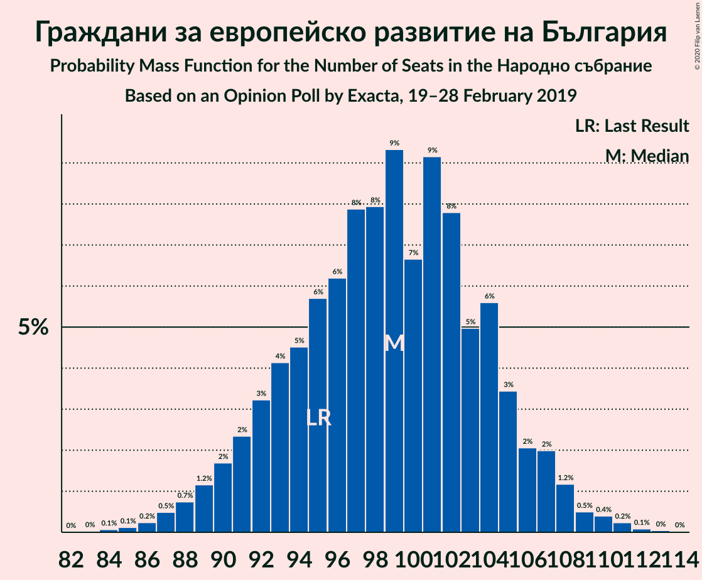
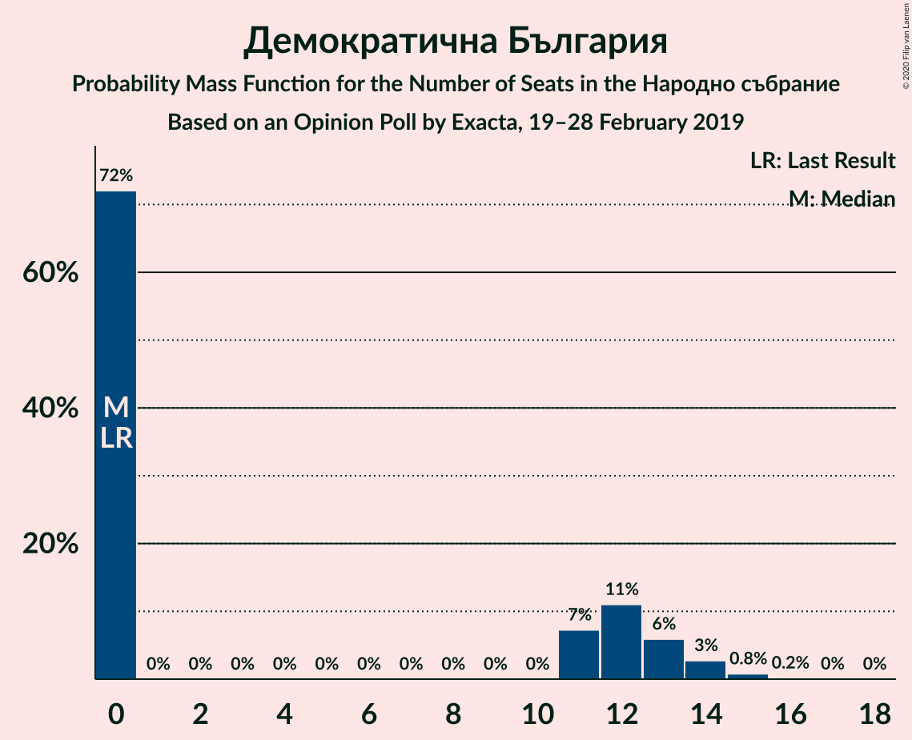

# Opinion Poll by Exacta, 19–28 February 2019

<a href="#voting-intentions">Voting Intentions</a> | <a href="#seats">Seats</a> | <a href="#coalitions">Coalitions</a> | <a href="#technical-information">Technical Information</a>

## Voting Intentions

### Confidence Intervals

| Party | Last Result | Poll Result | 80% Confidence Interval | 90% Confidence Interval | 95% Confidence Interval | 99% Confidence Interval |
|:-----:|:-----------:|:-----------:|:-----------------------:|:-----------------------:|:-----------------------:|:-----------------------:|
| Граждани за европейско развитие на България | 33.5% | 35.1% | 33.2–37.1% |32.7–37.6% |32.2–38.1% |31.3–39.1% |
| Българска социалистическа партия | 27.9% | 29.0% | 27.2–30.9% |26.7–31.4% |26.3–31.9% |25.4–32.8% |
| Движение за права и свободи | 9.2% | 10.3% | 9.2–11.6% |8.8–12.0% |8.6–12.3% |8.0–13.0% |
| Обединени Патриоти | 9.3% | 9.6% | 8.5–10.9% |8.2–11.3% |7.9–11.6% |7.4–12.2% |
| Демократична България | 0.0% | 3.7% | 3.0–4.6% |2.9–4.8% |2.7–5.1% |2.4–5.5% |
| Алтернатива за българско възраждане | 1.6% | 1.5% | 1.1–2.1% |1.0–2.3% |0.9–2.5% |0.7–2.8% |
| Воля | 4.3% | 1.5% | 1.1–2.1% |1.0–2.3% |0.9–2.5% |0.7–2.8% |

*Note:* The poll result column reflects the actual value used in the calculations. Published results may vary slightly, and in addition be rounded to fewer digits.

## Seats

### Confidence Intervals

| Party | Last Result | Median | 80% Confidence Interval | 90% Confidence Interval | 95% Confidence Interval | 99% Confidence Interval |
|:-----:|:-----------:|:------:|:-----------------------:|:-----------------------:|:-----------------------:|:-----------------------:|
| <a href="#граждани-за-европейско-развитие-на-българия">Граждани за европейско развитие на България</a> | 95 | 99 | 92–104 |91–106 |89–107 |87–110 |
| <a href="#българска-социалистическа-партия">Българска социалистическа партия</a> | 80 | 82 | 76–87 |74–89 |73–90 |70–92 |
| <a href="#движение-за-права-и-свободи">Движение за права и свободи</a> | 26 | 29 | 26–33 |25–34 |24–35 |22–37 |
| <a href="#обединени-патриоти">Обединени Патриоти</a> | 27 | 27 | 24–31 |23–32 |22–33 |21–35 |
| <a href="#демократична-българия">Демократична България</a> | 0 | 0 | 0–12 |0–13 |0–14 |0–15 |
| <a href="#алтернатива-за-българско-възраждане">Алтернатива за българско възраждане</a> | 0 | 0 | 0 |0 |0 |0 |
| <a href="#воля">Воля</a> | 12 | 0 | 0 |0 |0 |0 |

### Граждани за европейско развитие на България

*For a full overview of the results for this party, see the [Граждани за европейско развитие на България](party-гражданизаевропейскоразвитиенабългария.html) page.*

| Number of Seats | Probability | Accumulated | Special Marks |
|:---------------:|:-----------:|:-----------:|:-------------:|
| 84 | 0.1% | 100% |  |
| 85 | 0.1% | 99.9% |  |
| 86 | 0.2% | 99.8% |  |
| 87 | 0.5% | 99.5% |  |
| 88 | 0.7% | 99.0% |  |
| 89 | 1.2% | 98% |  |
| 90 | 2% | 97% |  |
| 91 | 2% | 95% |  |
| 92 | 3% | 93% |  |
| 93 | 4% | 90% |  |
| 94 | 5% | 86% |  |
| 95 | 6% | 81% | Last Result |
| 96 | 6% | 76% |  |
| 97 | 8% | 69% |  |
| 98 | 8% | 61% |  |
| 99 | 9% | 53% | Median |
| 100 | 7% | 44% |  |
| 101 | 9% | 37% |  |
| 102 | 8% | 28% |  |
| 103 | 5% | 21% |  |
| 104 | 6% | 16% |  |
| 105 | 3% | 10% |  |
| 106 | 2% | 7% |  |
| 107 | 2% | 4% |  |
| 108 | 1.2% | 2% |  |
| 109 | 0.5% | 1.3% |  |
| 110 | 0.4% | 0.8% |  |
| 111 | 0.2% | 0.4% |  |
| 112 | 0.1% | 0.2% |  |
| 113 | 0% | 0.1% |  |
| 114 | 0% | 0% |  |

### Българска социалистическа партия

*For a full overview of the results for this party, see the [Българска социалистическа партия](party-българскасоциалистическапартия.html) page.*

| Number of Seats | Probability | Accumulated | Special Marks |
|:---------------:|:-----------:|:-----------:|:-------------:|
| 68 | 0.1% | 100% |  |
| 69 | 0.1% | 99.9% |  |
| 70 | 0.3% | 99.8% |  |
| 71 | 0.4% | 99.5% |  |
| 72 | 0.9% | 99.0% |  |
| 73 | 1.1% | 98% |  |
| 74 | 2% | 97% |  |
| 75 | 3% | 95% |  |
| 76 | 3% | 91% |  |
| 77 | 7% | 88% |  |
| 78 | 5% | 81% |  |
| 79 | 7% | 76% |  |
| 80 | 9% | 69% | Last Result |
| 81 | 8% | 59% |  |
| 82 | 10% | 51% | Median |
| 83 | 9% | 41% |  |
| 84 | 7% | 32% |  |
| 85 | 7% | 25% |  |
| 86 | 6% | 18% |  |
| 87 | 4% | 12% |  |
| 88 | 3% | 8% |  |
| 89 | 2% | 5% |  |
| 90 | 1.3% | 3% |  |
| 91 | 1.0% | 2% |  |
| 92 | 0.4% | 0.9% |  |
| 93 | 0.2% | 0.5% |  |
| 94 | 0.1% | 0.2% |  |
| 95 | 0% | 0.1% |  |
| 96 | 0% | 0.1% |  |
| 97 | 0% | 0% |  |

### Движение за права и свободи

*For a full overview of the results for this party, see the [Движение за права и свободи](party-движениезаправаисвободи.html) page.*

| Number of Seats | Probability | Accumulated | Special Marks |
|:---------------:|:-----------:|:-----------:|:-------------:|
| 21 | 0.1% | 100% |  |
| 22 | 0.4% | 99.9% |  |
| 23 | 0.8% | 99.4% |  |
| 24 | 2% | 98.6% |  |
| 25 | 5% | 96% |  |
| 26 | 7% | 91% | Last Result |
| 27 | 12% | 84% |  |
| 28 | 15% | 72% |  |
| 29 | 14% | 57% | Median |
| 30 | 12% | 43% |  |
| 31 | 12% | 31% |  |
| 32 | 9% | 19% |  |
| 33 | 4% | 11% |  |
| 34 | 4% | 7% |  |
| 35 | 1.5% | 3% |  |
| 36 | 0.9% | 1.4% |  |
| 37 | 0.3% | 0.5% |  |
| 38 | 0.2% | 0.3% |  |
| 39 | 0.1% | 0.1% |  |
| 40 | 0% | 0% |  |

### Обединени Патриоти

*For a full overview of the results for this party, see the [Обединени Патриоти](party-обединенипатриоти.html) page.*

| Number of Seats | Probability | Accumulated | Special Marks |
|:---------------:|:-----------:|:-----------:|:-------------:|
| 19 | 0.1% | 100% |  |
| 20 | 0.3% | 99.9% |  |
| 21 | 1.0% | 99.6% |  |
| 22 | 2% | 98.6% |  |
| 23 | 5% | 97% |  |
| 24 | 7% | 92% |  |
| 25 | 11% | 85% |  |
| 26 | 13% | 73% |  |
| 27 | 16% | 60% | Last Result, Median |
| 28 | 14% | 44% |  |
| 29 | 12% | 30% |  |
| 30 | 7% | 18% |  |
| 31 | 5% | 11% |  |
| 32 | 3% | 6% |  |
| 33 | 1.4% | 3% |  |
| 34 | 0.7% | 1.3% |  |
| 35 | 0.4% | 0.5% |  |
| 36 | 0.1% | 0.2% |  |
| 37 | 0% | 0.1% |  |
| 38 | 0% | 0% |  |

### Демократична България

*For a full overview of the results for this party, see the [Демократична България](party-демократичнабългария.html) page.*

| Number of Seats | Probability | Accumulated | Special Marks |
|:---------------:|:-----------:|:-----------:|:-------------:|
| 0 | 72% | 100% | Last Result, Median |
| 1 | 0% | 28% |  |
| 2 | 0% | 28% |  |
| 3 | 0% | 28% |  |
| 4 | 0% | 28% |  |
| 5 | 0% | 28% |  |
| 6 | 0% | 28% |  |
| 7 | 0% | 28% |  |
| 8 | 0% | 28% |  |
| 9 | 0% | 28% |  |
| 10 | 0% | 28% |  |
| 11 | 7% | 28% |  |
| 12 | 11% | 21% |  |
| 13 | 6% | 10% |  |
| 14 | 3% | 4% |  |
| 15 | 0.8% | 1.0% |  |
| 16 | 0.2% | 0.2% |  |
| 17 | 0% | 0% |  |

### Алтернатива за българско възраждане

*For a full overview of the results for this party, see the [Алтернатива за българско възраждане](party-алтернативазабългарсковъзраждане.html) page.*

| Number of Seats | Probability | Accumulated | Special Marks |
|:---------------:|:-----------:|:-----------:|:-------------:|
| 0 | 100% | 100% | Last Result, Median |

### Воля

*For a full overview of the results for this party, see the [Воля](party-воля.html) page.*

| Number of Seats | Probability | Accumulated | Special Marks |
|:---------------:|:-----------:|:-----------:|:-------------:|
| 0 | 100% | 100% | Median |
| 1 | 0% | 0% |  |
| 2 | 0% | 0% |  |
| 3 | 0% | 0% |  |
| 4 | 0% | 0% |  |
| 5 | 0% | 0% |  |
| 6 | 0% | 0% |  |
| 7 | 0% | 0% |  |
| 8 | 0% | 0% |  |
| 9 | 0% | 0% |  |
| 10 | 0% | 0% |  |
| 11 | 0% | 0% |  |
| 12 | 0% | 0% | Last Result |

## Coalitions

### Confidence Intervals

| Coalition | Last Result | Median | Majority? | 80% Confidence Interval | 90% Confidence Interval | 95% Confidence Interval | 99% Confidence Interval |
|:---------:|:-----------:|:------:|:---------:|:-----------------------:|:-----------------------:|:-----------------------:|:-----------------------:|
| Граждани за европейско развитие на България – Обединени Патриоти | 122 | 126 | 85% | 119–132 | 117–134 | 115–135 | 112–138 |
| Българска социалистическа партия – Движение за права и свободи | 106 | 111 | 2% | 104–117 | 102–118 | 101–120 | 98–122 |

### Граждани за европейско развитие на България – Обединени Патриоти

| Number of Seats | Probability | Accumulated | Special Marks |
|:---------------:|:-----------:|:-----------:|:-------------:|
| 109 | 0% | 100% |  |
| 110 | 0% | 99.9% |  |
| 111 | 0.2% | 99.9% |  |
| 112 | 0.2% | 99.7% |  |
| 113 | 0.3% | 99.5% |  |
| 114 | 0.9% | 99.2% |  |
| 115 | 1.0% | 98% |  |
| 116 | 1.1% | 97% |  |
| 117 | 2% | 96% |  |
| 118 | 3% | 94% |  |
| 119 | 3% | 92% |  |
| 120 | 3% | 88% |  |
| 121 | 5% | 85% | Majority |
| 122 | 6% | 80% | Last Result |
| 123 | 5% | 75% |  |
| 124 | 8% | 70% |  |
| 125 | 6% | 62% |  |
| 126 | 8% | 56% | Median |
| 127 | 8% | 48% |  |
| 128 | 9% | 40% |  |
| 129 | 5% | 31% |  |
| 130 | 8% | 25% |  |
| 131 | 5% | 18% |  |
| 132 | 4% | 13% |  |
| 133 | 3% | 9% |  |
| 134 | 2% | 5% |  |
| 135 | 2% | 4% |  |
| 136 | 1.1% | 2% |  |
| 137 | 0.5% | 1.1% |  |
| 138 | 0.2% | 0.6% |  |
| 139 | 0.3% | 0.4% |  |
| 140 | 0.1% | 0.1% |  |
| 141 | 0% | 0.1% |  |
| 142 | 0% | 0% |  |

### Българска социалистическа партия – Движение за права и свободи

| Number of Seats | Probability | Accumulated | Special Marks |
|:---------------:|:-----------:|:-----------:|:-------------:|
| 95 | 0% | 100% |  |
| 96 | 0.1% | 99.9% |  |
| 97 | 0.1% | 99.9% |  |
| 98 | 0.3% | 99.7% |  |
| 99 | 0.6% | 99.5% |  |
| 100 | 0.8% | 98.9% |  |
| 101 | 1.3% | 98% |  |
| 102 | 2% | 97% |  |
| 103 | 2% | 95% |  |
| 104 | 3% | 93% |  |
| 105 | 4% | 89% |  |
| 106 | 5% | 86% | Last Result |
| 107 | 6% | 81% |  |
| 108 | 6% | 74% |  |
| 109 | 7% | 69% |  |
| 110 | 9% | 61% |  |
| 111 | 7% | 52% | Median |
| 112 | 9% | 45% |  |
| 113 | 7% | 36% |  |
| 114 | 8% | 29% |  |
| 115 | 5% | 21% |  |
| 116 | 6% | 16% |  |
| 117 | 3% | 11% |  |
| 118 | 3% | 7% |  |
| 119 | 1.5% | 4% |  |
| 120 | 1.2% | 3% |  |
| 121 | 0.7% | 2% | Majority |
| 122 | 0.4% | 0.8% |  |
| 123 | 0.2% | 0.4% |  |
| 124 | 0.2% | 0.2% |  |
| 125 | 0% | 0.1% |  |
| 126 | 0% | 0% |  |

## Technical Information

### Opinion Poll

+ **Polling firm:** Exacta
+ **Commissioner(s):** —
+ **Fieldwork period:** 19–28 February 2019

### Calculations

+ **Sample size:** 1000
+ **Simulations done:** 1,048,576
+ **Error estimate:** 1.42%

