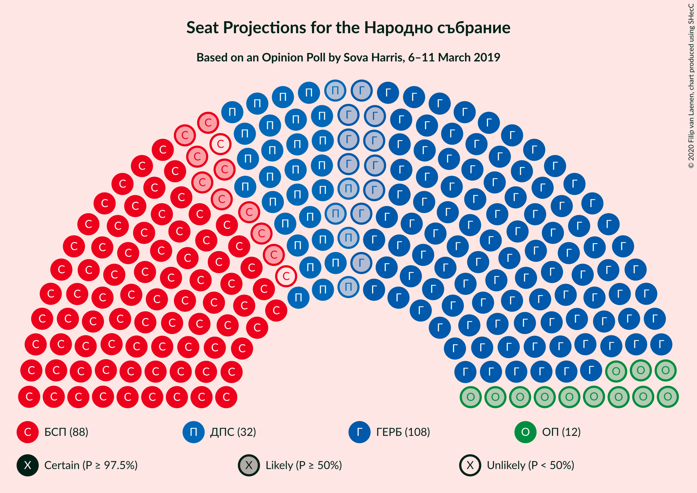
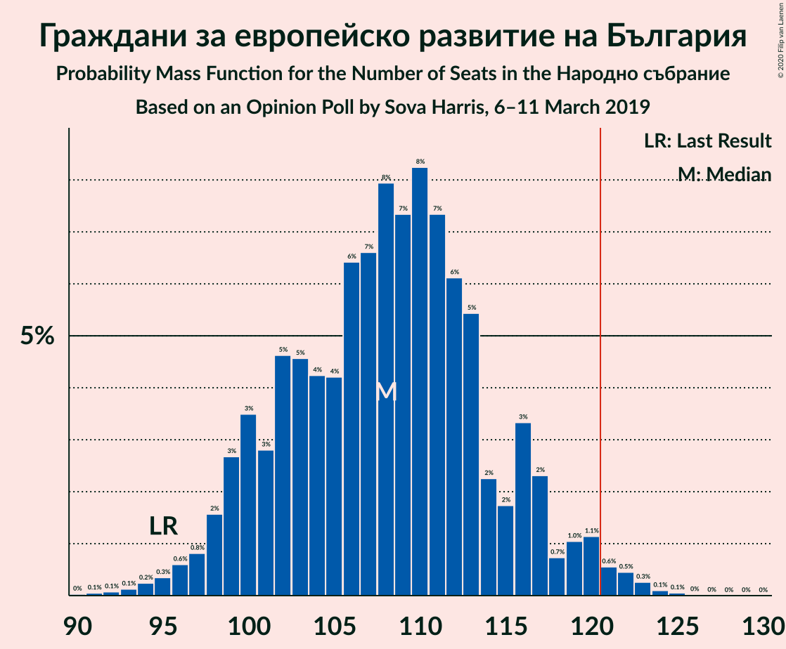
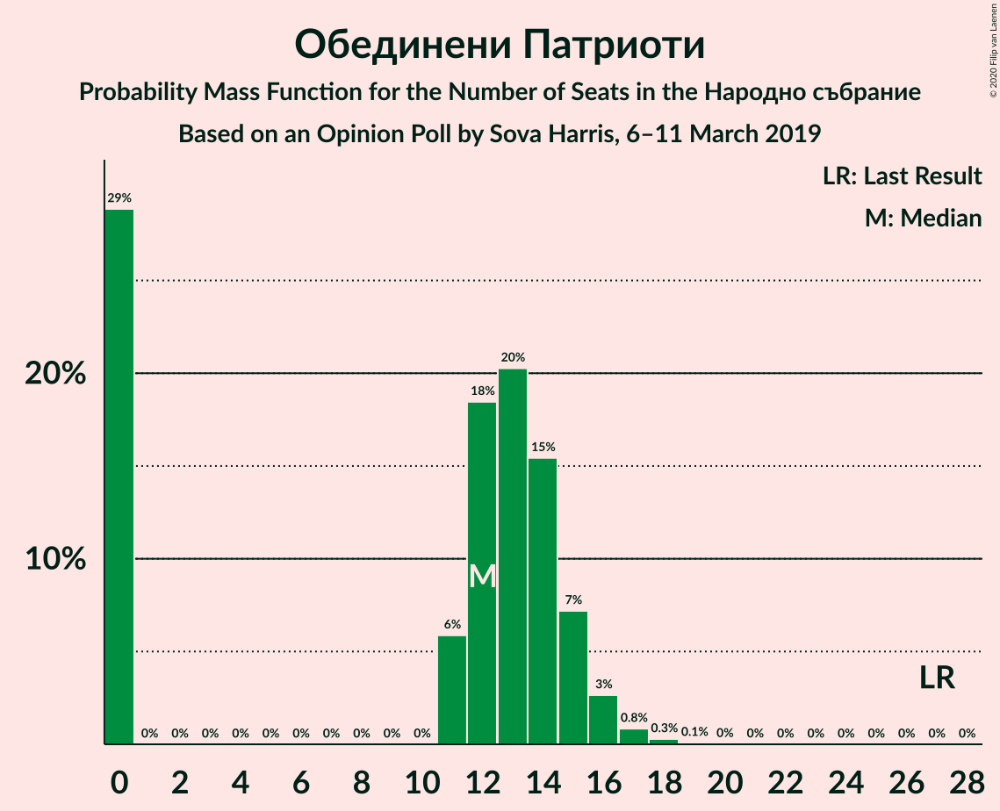
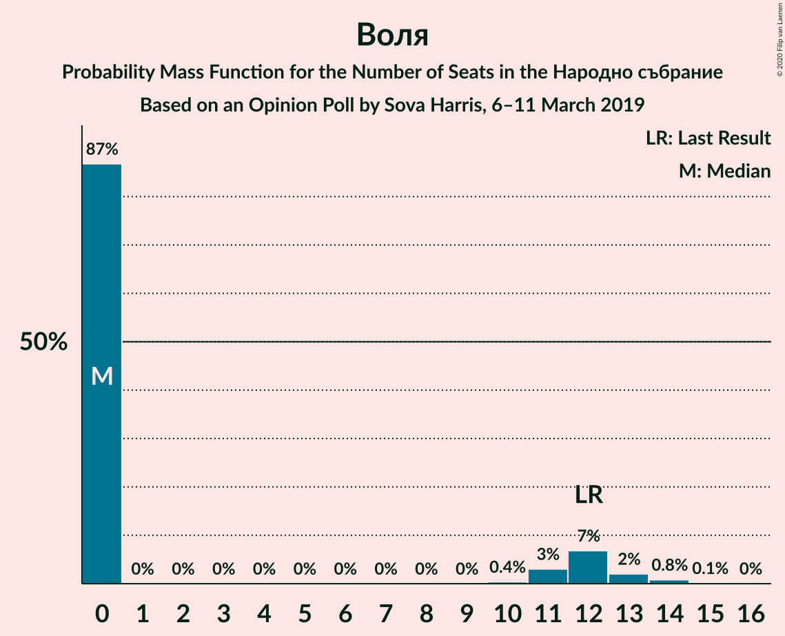
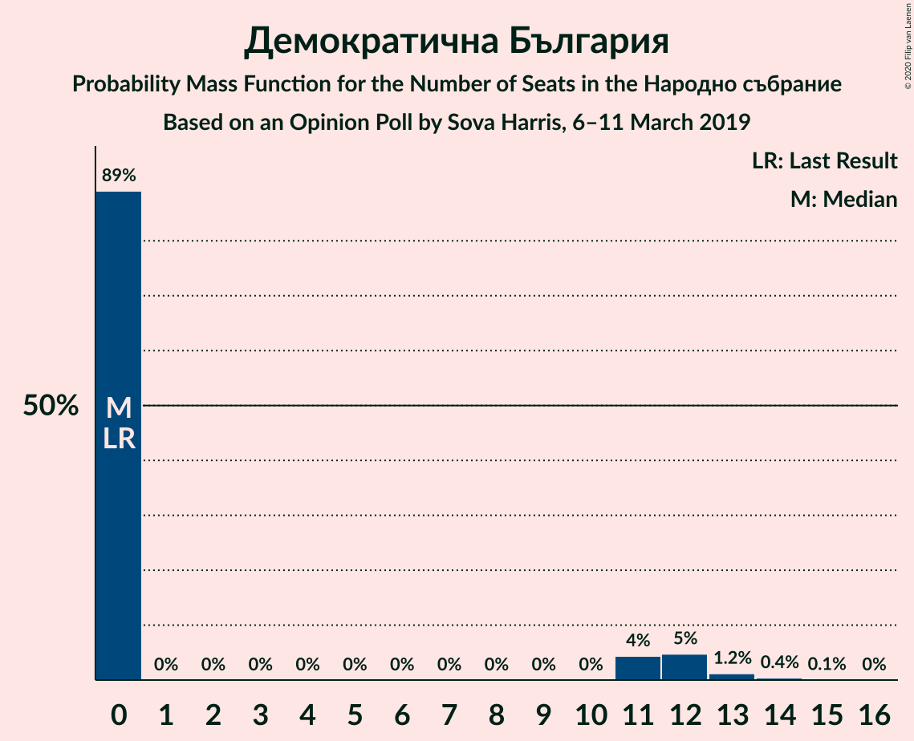
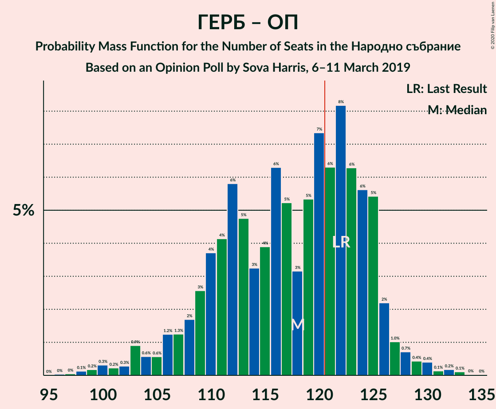

# Opinion Poll by Sova Harris, 6–11 March 2019

<a href="#voting-intentions">Voting Intentions</a> | <a href="#seats">Seats</a> | <a href="#coalitions">Coalitions</a> | <a href="#technical-information">Technical Information</a>

## Voting Intentions

### Confidence Intervals

| Party | Last Result | Poll Result | 80% Confidence Interval | 90% Confidence Interval | 95% Confidence Interval | 99% Confidence Interval |
|:-----:|:-----------:|:-----------:|:-----------------------:|:-----------------------:|:-----------------------:|:-----------------------:|
| Граждани за европейско развитие на България | 33.5% | 38.2% | 36.3–40.2% |35.7–40.8% |35.2–41.3% |34.3–42.2% |
| Българска социалистическа партия | 27.9% | 30.6% | 28.8–32.5% |28.3–33.1% |27.8–33.5% |27.0–34.5% |
| Движение за права и свободи | 9.2% | 11.5% | 10.3–12.9% |10.0–13.3% |9.7–13.6% |9.1–14.3% |
| Обединени Патриоти | 9.3% | 4.3% | 3.6–5.2% |3.4–5.5% |3.2–5.7% |2.9–6.2% |
| Воля | 4.3% | 3.3% | 2.7–4.1% |2.5–4.4% |2.4–4.6% |2.1–5.0% |
| Демократична България | 0.0% | 3.2% | 2.6–4.0% |2.4–4.3% |2.3–4.5% |2.0–4.9% |
| Атака | 0.0% | 3.0% | 2.4–3.8% |2.2–4.1% |2.1–4.3% |1.9–4.7% |
| Алтернатива за българско възраждане | 1.6% | 1.3% | 0.9–1.9% |0.8–2.1% |0.8–2.2% |0.6–2.5% |

*Note:* The poll result column reflects the actual value used in the calculations. Published results may vary slightly, and in addition be rounded to fewer digits.

## Seats

### Confidence Intervals

| Party | Last Result | Median | 80% Confidence Interval | 90% Confidence Interval | 95% Confidence Interval | 99% Confidence Interval |
|:-----:|:-----------:|:------:|:-----------------------:|:-----------------------:|:-----------------------:|:-----------------------:|
| <a href="#граждани-за-европейско-развитие-на-българия">Граждани за европейско развитие на България</a> | 95 | 109 | 101–115 |99–117 |98–119 |94–121 |
| <a href="#българска-социалистическа-партия">Българска социалистическа партия</a> | 80 | 87 | 80–93 |77–95 |76–98 |73–99 |
| <a href="#движение-за-права-и-свободи">Движение за права и свободи</a> | 26 | 32 | 29–37 |28–38 |27–39 |26–43 |
| <a href="#обединени-патриоти">Обединени Патриоти</a> | 27 | 13 | 0–15 |0–15 |0–16 |0–17 |
| <a href="#воля">Воля</a> | 12 | 0 | 0–11 |0–12 |0–13 |0–14 |
| <a href="#демократична-българия">Демократична България</a> | 0 | 0 | 0 |0–12 |0–12 |0–14 |
| <a href="#атака">Атака</a> | 0 | 0 | 0 |0 |0–11 |0–13 |
| <a href="#алтернатива-за-българско-възраждане">Алтернатива за българско възраждане</a> | 0 | 0 | 0 |0 |0 |0 |

### Граждани за европейско развитие на България

*For a full overview of the results for this party, see the [Граждани за европейско развитие на България](party-гражданизаевропейскоразвитиенабългария.html) page.*

| Number of Seats | Probability | Accumulated | Special Marks |
|:---------------:|:-----------:|:-----------:|:-------------:|
| 89 | 0.1% | 100% |  |
| 90 | 0% | 99.9% |  |
| 91 | 0% | 99.9% |  |
| 92 | 0% | 99.9% |  |
| 93 | 0.2% | 99.8% |  |
| 94 | 0.5% | 99.6% |  |
| 95 | 0.2% | 99.1% | Last Result |
| 96 | 0.3% | 98.9% |  |
| 97 | 0.4% | 98.6% |  |
| 98 | 1.1% | 98% |  |
| 99 | 2% | 97% |  |
| 100 | 5% | 95% |  |
| 101 | 2% | 90% |  |
| 102 | 2% | 88% |  |
| 103 | 1.0% | 87% |  |
| 104 | 4% | 86% |  |
| 105 | 4% | 82% |  |
| 106 | 9% | 78% |  |
| 107 | 9% | 69% |  |
| 108 | 8% | 60% |  |
| 109 | 4% | 51% | Median |
| 110 | 21% | 47% |  |
| 111 | 11% | 26% |  |
| 112 | 2% | 16% |  |
| 113 | 2% | 14% |  |
| 114 | 0.6% | 11% |  |
| 115 | 1.1% | 11% |  |
| 116 | 1.0% | 10% |  |
| 117 | 4% | 9% |  |
| 118 | 2% | 5% |  |
| 119 | 2% | 3% |  |
| 120 | 0.3% | 1.0% |  |
| 121 | 0.4% | 0.7% | Majority |
| 122 | 0% | 0.3% |  |
| 123 | 0.2% | 0.3% |  |
| 124 | 0% | 0.1% |  |
| 125 | 0% | 0.1% |  |
| 126 | 0% | 0.1% |  |
| 127 | 0% | 0% |  |

### Българска социалистическа партия

*For a full overview of the results for this party, see the [Българска социалистическа партия](party-българскасоциалистическапартия.html) page.*

| Number of Seats | Probability | Accumulated | Special Marks |
|:---------------:|:-----------:|:-----------:|:-------------:|
| 69 | 0% | 100% |  |
| 70 | 0% | 99.9% |  |
| 71 | 0.1% | 99.9% |  |
| 72 | 0.1% | 99.9% |  |
| 73 | 0.3% | 99.7% |  |
| 74 | 0.3% | 99.5% |  |
| 75 | 0.9% | 99.2% |  |
| 76 | 2% | 98% |  |
| 77 | 2% | 96% |  |
| 78 | 1.1% | 94% |  |
| 79 | 0.6% | 93% |  |
| 80 | 3% | 93% | Last Result |
| 81 | 3% | 89% |  |
| 82 | 2% | 86% |  |
| 83 | 1.3% | 84% |  |
| 84 | 7% | 83% |  |
| 85 | 12% | 76% |  |
| 86 | 13% | 64% |  |
| 87 | 3% | 51% | Median |
| 88 | 16% | 47% |  |
| 89 | 9% | 31% |  |
| 90 | 2% | 22% |  |
| 91 | 1.3% | 20% |  |
| 92 | 1.4% | 19% |  |
| 93 | 8% | 18% |  |
| 94 | 3% | 10% |  |
| 95 | 2% | 7% |  |
| 96 | 2% | 5% |  |
| 97 | 0.3% | 3% |  |
| 98 | 0.3% | 3% |  |
| 99 | 2% | 2% |  |
| 100 | 0% | 0.2% |  |
| 101 | 0% | 0.1% |  |
| 102 | 0% | 0.1% |  |
| 103 | 0% | 0.1% |  |
| 104 | 0% | 0.1% |  |
| 105 | 0% | 0.1% |  |
| 106 | 0% | 0% |  |

### Движение за права и свободи

*For a full overview of the results for this party, see the [Движение за права и свободи](party-движениезаправаисвободи.html) page.*

| Number of Seats | Probability | Accumulated | Special Marks |
|:---------------:|:-----------:|:-----------:|:-------------:|
| 24 | 0.2% | 100% |  |
| 25 | 0.2% | 99.8% |  |
| 26 | 1.4% | 99.5% | Last Result |
| 27 | 2% | 98% |  |
| 28 | 3% | 96% |  |
| 29 | 3% | 93% |  |
| 30 | 10% | 90% |  |
| 31 | 10% | 80% |  |
| 32 | 22% | 70% | Median |
| 33 | 9% | 48% |  |
| 34 | 5% | 39% |  |
| 35 | 14% | 34% |  |
| 36 | 6% | 20% |  |
| 37 | 8% | 13% |  |
| 38 | 2% | 5% |  |
| 39 | 2% | 3% |  |
| 40 | 0.7% | 2% |  |
| 41 | 0.2% | 0.8% |  |
| 42 | 0.1% | 0.7% |  |
| 43 | 0.5% | 0.5% |  |
| 44 | 0% | 0% |  |

### Обединени Патриоти

*For a full overview of the results for this party, see the [Обединени Патриоти](party-обединенипатриоти.html) page.*

| Number of Seats | Probability | Accumulated | Special Marks |
|:---------------:|:-----------:|:-----------:|:-------------:|
| 0 | 31% | 100% |  |
| 1 | 0% | 69% |  |
| 2 | 0% | 69% |  |
| 3 | 0% | 69% |  |
| 4 | 0% | 69% |  |
| 5 | 0% | 69% |  |
| 6 | 0% | 69% |  |
| 7 | 0% | 69% |  |
| 8 | 0% | 69% |  |
| 9 | 0% | 69% |  |
| 10 | 0% | 69% |  |
| 11 | 2% | 69% |  |
| 12 | 16% | 68% |  |
| 13 | 30% | 52% | Median |
| 14 | 4% | 22% |  |
| 15 | 14% | 18% |  |
| 16 | 2% | 3% |  |
| 17 | 1.1% | 2% |  |
| 18 | 0.2% | 0.4% |  |
| 19 | 0.1% | 0.2% |  |
| 20 | 0.1% | 0.1% |  |
| 21 | 0% | 0% |  |
| 22 | 0% | 0% |  |
| 23 | 0% | 0% |  |
| 24 | 0% | 0% |  |
| 25 | 0% | 0% |  |
| 26 | 0% | 0% |  |
| 27 | 0% | 0% | Last Result |

### Воля

*For a full overview of the results for this party, see the [Воля](party-воля.html) page.*

| Number of Seats | Probability | Accumulated | Special Marks |
|:---------------:|:-----------:|:-----------:|:-------------:|
| 0 | 90% | 100% | Median |
| 1 | 0% | 10% |  |
| 2 | 0% | 10% |  |
| 3 | 0% | 10% |  |
| 4 | 0% | 10% |  |
| 5 | 0% | 10% |  |
| 6 | 0% | 10% |  |
| 7 | 0% | 10% |  |
| 8 | 0% | 10% |  |
| 9 | 0% | 10% |  |
| 10 | 0% | 10% |  |
| 11 | 4% | 10% |  |
| 12 | 3% | 6% | Last Result |
| 13 | 2% | 3% |  |
| 14 | 0.5% | 0.7% |  |
| 15 | 0.1% | 0.1% |  |
| 16 | 0% | 0% |  |

### Демократична България

*For a full overview of the results for this party, see the [Демократична България](party-демократичнабългария.html) page.*

| Number of Seats | Probability | Accumulated | Special Marks |
|:---------------:|:-----------:|:-----------:|:-------------:|
| 0 | 92% | 100% | Last Result, Median |
| 1 | 0% | 8% |  |
| 2 | 0% | 8% |  |
| 3 | 0% | 8% |  |
| 4 | 0% | 8% |  |
| 5 | 0% | 8% |  |
| 6 | 0% | 8% |  |
| 7 | 0% | 8% |  |
| 8 | 0% | 8% |  |
| 9 | 0% | 8% |  |
| 10 | 0% | 8% |  |
| 11 | 2% | 8% |  |
| 12 | 4% | 6% |  |
| 13 | 0.7% | 1.4% |  |
| 14 | 0.5% | 0.7% |  |
| 15 | 0.1% | 0.1% |  |
| 16 | 0% | 0% |  |

### Атака

*For a full overview of the results for this party, see the [Атака](party-атака.html) page.*

| Number of Seats | Probability | Accumulated | Special Marks |
|:---------------:|:-----------:|:-----------:|:-------------:|
| 0 | 96% | 100% | Last Result, Median |
| 1 | 0% | 4% |  |
| 2 | 0% | 4% |  |
| 3 | 0% | 4% |  |
| 4 | 0% | 4% |  |
| 5 | 0% | 4% |  |
| 6 | 0% | 4% |  |
| 7 | 0% | 4% |  |
| 8 | 0% | 4% |  |
| 9 | 0% | 4% |  |
| 10 | 0.1% | 4% |  |
| 11 | 2% | 3% |  |
| 12 | 1.0% | 2% |  |
| 13 | 0.4% | 0.6% |  |
| 14 | 0.1% | 0.1% |  |
| 15 | 0% | 0.1% |  |
| 16 | 0% | 0% |  |

### Алтернатива за българско възраждане

*For a full overview of the results for this party, see the [Алтернатива за българско възраждане](party-алтернативазабългарсковъзраждане.html) page.*

| Number of Seats | Probability | Accumulated | Special Marks |
|:---------------:|:-----------:|:-----------:|:-------------:|
| 0 | 100% | 100% | Last Result, Median |

## Coalitions

### Confidence Intervals

| Coalition | Last Result | Median | Majority? | 80% Confidence Interval | 90% Confidence Interval | 95% Confidence Interval | 99% Confidence Interval |
|:---------:|:-----------:|:------:|:---------:|:-----------------------:|:-----------------------:|:-----------------------:|:-----------------------:|
| Българска социалистическа партия – Движение за права и свободи | 106 | 119 | 35% | 113–130 | 108–130 | 106–132 | 103–134 |
| Граждани за европейско развитие на България – Обединени Патриоти | 122 | 120 | 40% | 109–124 | 107–125 | 105–126 | 99–129 |

### Българска социалистическа партия – Движение за права и свободи

| Number of Seats | Probability | Accumulated | Special Marks |
|:---------------:|:-----------:|:-----------:|:-------------:|
| 99 | 0% | 100% |  |
| 100 | 0% | 99.9% |  |
| 101 | 0% | 99.9% |  |
| 102 | 0.1% | 99.9% |  |
| 103 | 0.4% | 99.8% |  |
| 104 | 0.3% | 99.4% |  |
| 105 | 1.1% | 99.1% |  |
| 106 | 0.9% | 98% | Last Result |
| 107 | 1.4% | 97% |  |
| 108 | 0.8% | 96% |  |
| 109 | 0.7% | 95% |  |
| 110 | 0.9% | 94% |  |
| 111 | 0.9% | 93% |  |
| 112 | 2% | 92% |  |
| 113 | 0.6% | 90% |  |
| 114 | 4% | 90% |  |
| 115 | 3% | 86% |  |
| 116 | 7% | 83% |  |
| 117 | 5% | 76% |  |
| 118 | 12% | 71% |  |
| 119 | 11% | 59% | Median |
| 120 | 13% | 48% |  |
| 121 | 5% | 35% | Majority |
| 122 | 4% | 30% |  |
| 123 | 5% | 26% |  |
| 124 | 1.0% | 21% |  |
| 125 | 1.3% | 20% |  |
| 126 | 1.3% | 19% |  |
| 127 | 3% | 18% |  |
| 128 | 1.2% | 14% |  |
| 129 | 2% | 13% |  |
| 130 | 7% | 11% |  |
| 131 | 2% | 4% |  |
| 132 | 0.7% | 3% |  |
| 133 | 0.1% | 2% |  |
| 134 | 2% | 2% |  |
| 135 | 0% | 0.2% |  |
| 136 | 0.1% | 0.2% |  |
| 137 | 0% | 0.1% |  |
| 138 | 0% | 0% |  |

### Граждани за европейско развитие на България – Обединени Патриоти

| Number of Seats | Probability | Accumulated | Special Marks |
|:---------------:|:-----------:|:-----------:|:-------------:|
| 97 | 0.1% | 100% |  |
| 98 | 0.3% | 99.8% |  |
| 99 | 0% | 99.5% |  |
| 100 | 0.7% | 99.5% |  |
| 101 | 0.1% | 98.8% |  |
| 102 | 0.3% | 98.7% |  |
| 103 | 0.3% | 98% |  |
| 104 | 0.6% | 98% |  |
| 105 | 0.5% | 98% |  |
| 106 | 2% | 97% |  |
| 107 | 0.5% | 95% |  |
| 108 | 2% | 95% |  |
| 109 | 3% | 92% |  |
| 110 | 8% | 89% |  |
| 111 | 4% | 82% |  |
| 112 | 2% | 78% |  |
| 113 | 5% | 76% |  |
| 114 | 1.4% | 72% |  |
| 115 | 2% | 70% |  |
| 116 | 1.3% | 68% |  |
| 117 | 6% | 67% |  |
| 118 | 3% | 61% |  |
| 119 | 5% | 58% |  |
| 120 | 12% | 52% |  |
| 121 | 11% | 40% | Majority |
| 122 | 12% | 29% | Last Result, Median |
| 123 | 3% | 17% |  |
| 124 | 8% | 14% |  |
| 125 | 2% | 6% |  |
| 126 | 3% | 5% |  |
| 127 | 0.3% | 2% |  |
| 128 | 0.7% | 1.3% |  |
| 129 | 0.1% | 0.6% |  |
| 130 | 0.1% | 0.4% |  |
| 131 | 0.1% | 0.3% |  |
| 132 | 0.1% | 0.2% |  |
| 133 | 0.1% | 0.1% |  |
| 134 | 0% | 0% |  |

## Technical Information

### Opinion Poll

+ **Polling firm:** Sova Harris
+ **Commissioner(s):** —
+ **Fieldwork period:** 6–11 March 2019

### Calculations

+ **Sample size:** 1000
+ **Simulations done:** 131,072
+ **Error estimate:** 1.16%

