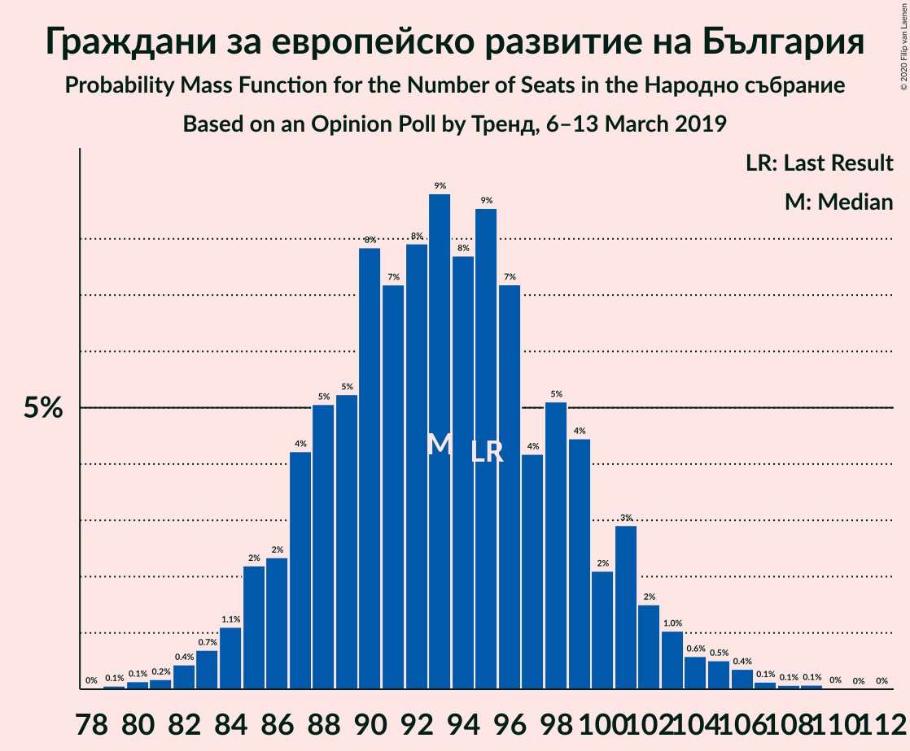
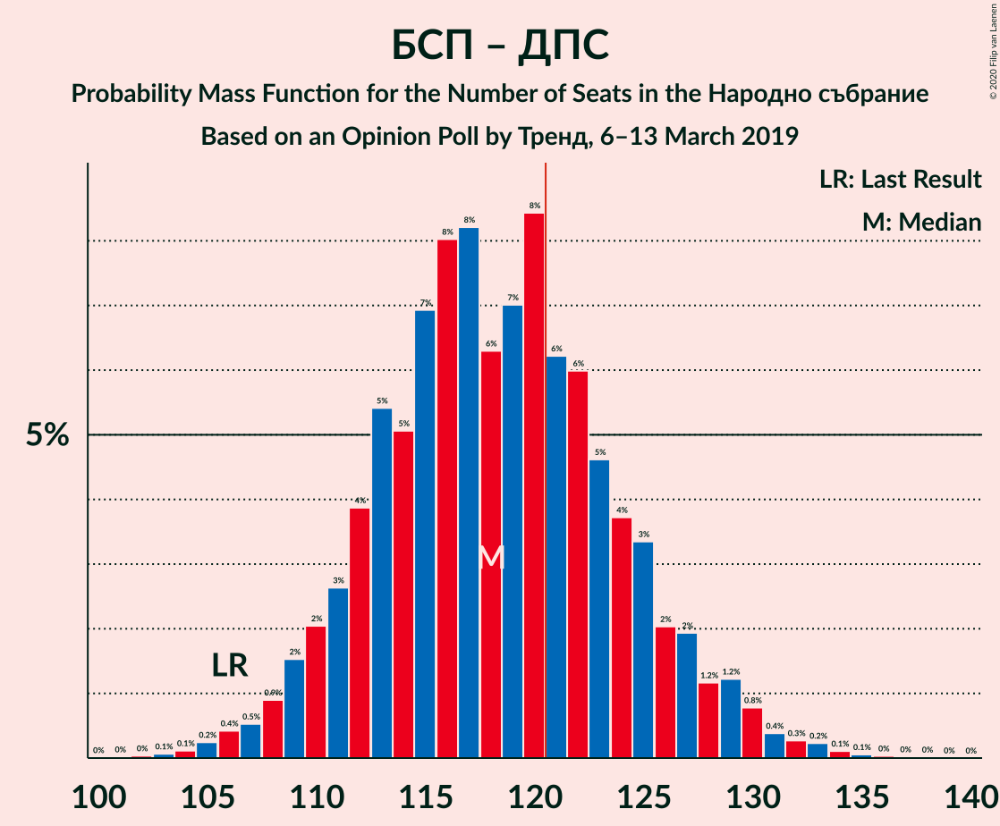
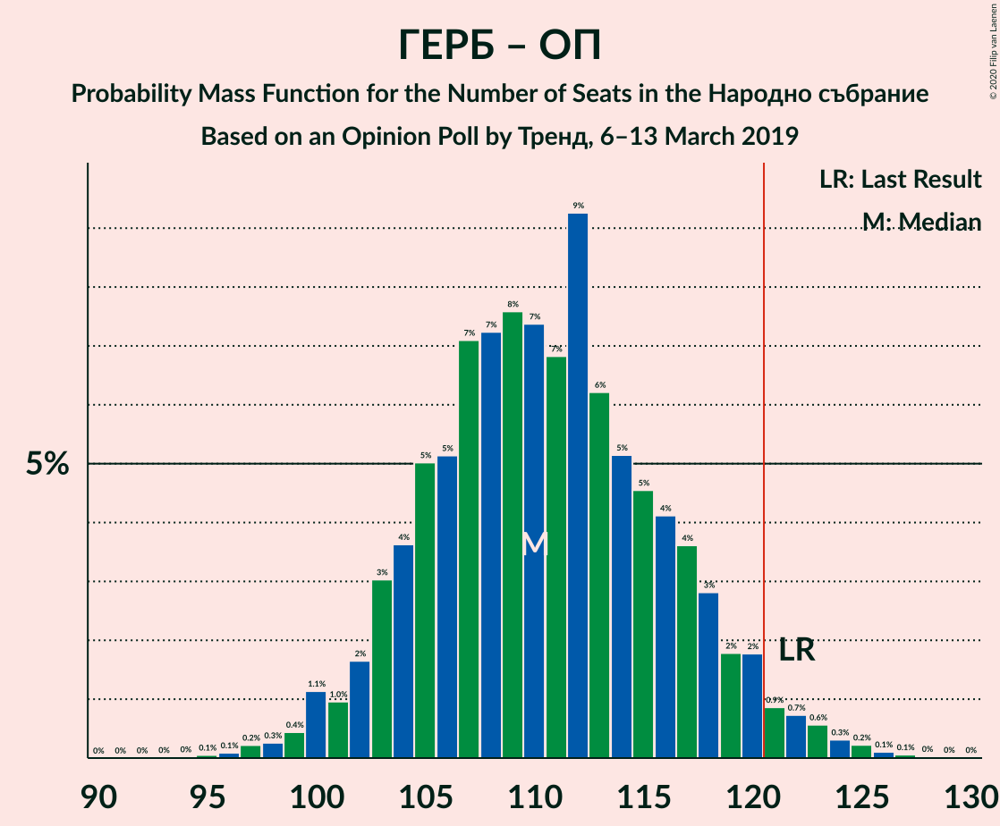

# Opinion Poll by Тренд, 6–13 March 2019

<a href="#voting-intentions">Voting Intentions</a> | <a href="#seats">Seats</a> | <a href="#coalitions">Coalitions</a> | <a href="#technical-information">Technical Information</a>

## Voting Intentions

### Confidence Intervals

| Party | Last Result | Poll Result | 80% Confidence Interval | 90% Confidence Interval | 95% Confidence Interval | 99% Confidence Interval |
|:-----:|:-----------:|:-----------:|:-----------------------:|:-----------------------:|:-----------------------:|:-----------------------:|
| Граждани за европейско развитие на България | 33.5% | 33.6% | 31.8–35.6% |31.2–36.1% |30.8–36.6% |29.9–37.6% |
| Българска социалистическа партия | 27.9% | 30.4% | 28.6–32.4% |28.1–32.9% |27.7–33.4% |26.8–34.3% |
| Движение за права и свободи | 9.2% | 12.1% | 10.9–13.6% |10.5–14.0% |10.3–14.3% |9.7–15.0% |
| Обединени Патриоти | 9.3% | 6.2% | 5.3–7.3% |5.0–7.6% |4.8–7.8% |4.5–8.4% |
| Демократична България | 0.0% | 4.4% | 3.6–5.3% |3.4–5.6% |3.3–5.8% |3.0–6.3% |
| Воля | 4.3% | 3.2% | 2.6–4.0% |2.4–4.3% |2.3–4.5% |2.0–4.9% |
| Атака | 0.0% | 2.3% | 1.8–3.0% |1.6–3.2% |1.5–3.4% |1.3–3.8% |

*Note:* The poll result column reflects the actual value used in the calculations. Published results may vary slightly, and in addition be rounded to fewer digits.

## Seats

### Confidence Intervals

| Party | Last Result | Median | 80% Confidence Interval | 90% Confidence Interval | 95% Confidence Interval | 99% Confidence Interval |
|:-----:|:-----------:|:------:|:-----------------------:|:-----------------------:|:-----------------------:|:-----------------------:|
| <a href="#граждани-за-европейско-развитие-на-българия">Граждани за европейско развитие на България</a> | 95 | 92 | 87–98 |85–100 |85–103 |82–104 |
| <a href="#българска-социалистическа-партия">Българска социалистическа партия</a> | 80 | 84 | 79–90 |77–92 |76–94 |73–98 |
| <a href="#движение-за-права-и-свободи">Движение за права и свободи</a> | 26 | 34 | 30–38 |30–39 |28–39 |27–42 |
| <a href="#обединени-патриоти">Обединени Патриоти</a> | 27 | 17 | 14–20 |14–21 |13–22 |12–24 |
| <a href="#демократична-българия">Демократична България</a> | 0 | 13 | 0–15 |0–15 |0–15 |0–17 |
| <a href="#воля">Воля</a> | 12 | 0 | 0 |0–12 |0–12 |0–13 |
| <a href="#атака">Атака</a> | 0 | 0 | 0 |0 |0 |0 |

### Граждани за европейско развитие на България

*For a full overview of the results for this party, see the [Граждани за европейско развитие на България](party-гражданизаевропейскоразвитиенабългария.html) page.*

| Number of Seats | Probability | Accumulated | Special Marks |
|:---------------:|:-----------:|:-----------:|:-------------:|
| 79 | 0.1% | 100% |  |
| 80 | 0.1% | 99.8% |  |
| 81 | 0.2% | 99.8% |  |
| 82 | 0.1% | 99.5% |  |
| 83 | 1.1% | 99.4% |  |
| 84 | 0.3% | 98% |  |
| 85 | 3% | 98% |  |
| 86 | 2% | 95% |  |
| 87 | 3% | 92% |  |
| 88 | 9% | 90% |  |
| 89 | 1.2% | 81% |  |
| 90 | 17% | 80% |  |
| 91 | 3% | 63% |  |
| 92 | 12% | 60% | Median |
| 93 | 6% | 48% |  |
| 94 | 4% | 41% |  |
| 95 | 14% | 38% | Last Result |
| 96 | 3% | 23% |  |
| 97 | 9% | 20% |  |
| 98 | 3% | 12% |  |
| 99 | 1.1% | 9% |  |
| 100 | 3% | 7% |  |
| 101 | 1.4% | 5% |  |
| 102 | 0.6% | 3% |  |
| 103 | 2% | 3% |  |
| 104 | 0.3% | 0.7% |  |
| 105 | 0.1% | 0.4% |  |
| 106 | 0.3% | 0.3% |  |
| 107 | 0% | 0.1% |  |
| 108 | 0% | 0.1% |  |
| 109 | 0% | 0% |  |

### Българска социалистическа партия

*For a full overview of the results for this party, see the [Българска социалистическа партия](party-българскасоциалистическапартия.html) page.*

| Number of Seats | Probability | Accumulated | Special Marks |
|:---------------:|:-----------:|:-----------:|:-------------:|
| 70 | 0% | 100% |  |
| 71 | 0.1% | 99.9% |  |
| 72 | 0.1% | 99.9% |  |
| 73 | 0.4% | 99.8% |  |
| 74 | 0.5% | 99.4% |  |
| 75 | 0.5% | 99.0% |  |
| 76 | 2% | 98% |  |
| 77 | 3% | 96% |  |
| 78 | 3% | 94% |  |
| 79 | 4% | 90% |  |
| 80 | 6% | 87% | Last Result |
| 81 | 9% | 81% |  |
| 82 | 7% | 72% |  |
| 83 | 6% | 65% |  |
| 84 | 13% | 59% | Median |
| 85 | 7% | 46% |  |
| 86 | 8% | 39% |  |
| 87 | 8% | 31% |  |
| 88 | 7% | 23% |  |
| 89 | 4% | 17% |  |
| 90 | 5% | 13% |  |
| 91 | 2% | 8% |  |
| 92 | 2% | 6% |  |
| 93 | 1.2% | 4% |  |
| 94 | 1.0% | 3% |  |
| 95 | 1.2% | 2% |  |
| 96 | 0.2% | 0.8% |  |
| 97 | 0.1% | 0.7% |  |
| 98 | 0.3% | 0.5% |  |
| 99 | 0.1% | 0.2% |  |
| 100 | 0% | 0.1% |  |
| 101 | 0% | 0.1% |  |
| 102 | 0% | 0% |  |

### Движение за права и свободи

*For a full overview of the results for this party, see the [Движение за права и свободи](party-движениезаправаисвободи.html) page.*

| Number of Seats | Probability | Accumulated | Special Marks |
|:---------------:|:-----------:|:-----------:|:-------------:|
| 25 | 0% | 100% |  |
| 26 | 0.3% | 99.9% | Last Result |
| 27 | 1.3% | 99.6% |  |
| 28 | 0.9% | 98% |  |
| 29 | 2% | 97% |  |
| 30 | 8% | 96% |  |
| 31 | 11% | 87% |  |
| 32 | 8% | 77% |  |
| 33 | 15% | 69% |  |
| 34 | 8% | 53% | Median |
| 35 | 11% | 46% |  |
| 36 | 18% | 35% |  |
| 37 | 6% | 16% |  |
| 38 | 3% | 10% |  |
| 39 | 5% | 7% |  |
| 40 | 1.2% | 2% |  |
| 41 | 0.4% | 1.0% |  |
| 42 | 0.3% | 0.6% |  |
| 43 | 0.1% | 0.3% |  |
| 44 | 0.1% | 0.1% |  |
| 45 | 0% | 0.1% |  |
| 46 | 0% | 0% |  |

### Обединени Патриоти

*For a full overview of the results for this party, see the [Обединени Патриоти](party-обединенипатриоти.html) page.*

| Number of Seats | Probability | Accumulated | Special Marks |
|:---------------:|:-----------:|:-----------:|:-------------:|
| 0 | 0.1% | 100% |  |
| 1 | 0% | 99.9% |  |
| 2 | 0% | 99.9% |  |
| 3 | 0% | 99.9% |  |
| 4 | 0% | 99.9% |  |
| 5 | 0% | 99.9% |  |
| 6 | 0% | 99.9% |  |
| 7 | 0% | 99.9% |  |
| 8 | 0% | 99.9% |  |
| 9 | 0% | 99.9% |  |
| 10 | 0% | 99.9% |  |
| 11 | 0.1% | 99.9% |  |
| 12 | 0.5% | 99.9% |  |
| 13 | 3% | 99.4% |  |
| 14 | 7% | 96% |  |
| 15 | 9% | 90% |  |
| 16 | 14% | 81% |  |
| 17 | 26% | 67% | Median |
| 18 | 15% | 41% |  |
| 19 | 10% | 26% |  |
| 20 | 6% | 16% |  |
| 21 | 6% | 10% |  |
| 22 | 2% | 3% |  |
| 23 | 0.8% | 1.4% |  |
| 24 | 0.4% | 0.6% |  |
| 25 | 0.1% | 0.2% |  |
| 26 | 0% | 0% |  |
| 27 | 0% | 0% | Last Result |

### Демократична България

*For a full overview of the results for this party, see the [Демократична България](party-демократичнабългария.html) page.*

| Number of Seats | Probability | Accumulated | Special Marks |
|:---------------:|:-----------:|:-----------:|:-------------:|
| 0 | 19% | 100% | Last Result |
| 1 | 0% | 81% |  |
| 2 | 0% | 81% |  |
| 3 | 0% | 81% |  |
| 4 | 0% | 81% |  |
| 5 | 0% | 81% |  |
| 6 | 0% | 81% |  |
| 7 | 0% | 81% |  |
| 8 | 0% | 81% |  |
| 9 | 0% | 81% |  |
| 10 | 0.1% | 81% |  |
| 11 | 4% | 81% |  |
| 12 | 15% | 77% |  |
| 13 | 35% | 61% | Median |
| 14 | 16% | 27% |  |
| 15 | 9% | 11% |  |
| 16 | 0.8% | 2% |  |
| 17 | 1.0% | 1.3% |  |
| 18 | 0.2% | 0.3% |  |
| 19 | 0.1% | 0.1% |  |
| 20 | 0% | 0% |  |

### Воля

*For a full overview of the results for this party, see the [Воля](party-воля.html) page.*

| Number of Seats | Probability | Accumulated | Special Marks |
|:---------------:|:-----------:|:-----------:|:-------------:|
| 0 | 91% | 100% | Median |
| 1 | 0% | 9% |  |
| 2 | 0% | 9% |  |
| 3 | 0% | 9% |  |
| 4 | 0% | 9% |  |
| 5 | 0% | 9% |  |
| 6 | 0% | 9% |  |
| 7 | 0% | 9% |  |
| 8 | 0% | 9% |  |
| 9 | 0% | 9% |  |
| 10 | 0.4% | 9% |  |
| 11 | 3% | 8% |  |
| 12 | 4% | 5% | Last Result |
| 13 | 1.0% | 1.4% |  |
| 14 | 0.3% | 0.4% |  |
| 15 | 0.1% | 0.1% |  |
| 16 | 0% | 0% |  |

### Атака

*For a full overview of the results for this party, see the [Атака](party-атака.html) page.*

| Number of Seats | Probability | Accumulated | Special Marks |
|:---------------:|:-----------:|:-----------:|:-------------:|
| 0 | 99.8% | 100% | Last Result, Median |
| 1 | 0% | 0.2% |  |
| 2 | 0% | 0.2% |  |
| 3 | 0% | 0.2% |  |
| 4 | 0% | 0.2% |  |
| 5 | 0% | 0.2% |  |
| 6 | 0% | 0.2% |  |
| 7 | 0% | 0.2% |  |
| 8 | 0% | 0.2% |  |
| 9 | 0% | 0.2% |  |
| 10 | 0% | 0.2% |  |
| 11 | 0.1% | 0.2% |  |
| 12 | 0% | 0.1% |  |
| 13 | 0% | 0% |  |

## Coalitions

### Confidence Intervals

| Coalition | Last Result | Median | Majority? | 80% Confidence Interval | 90% Confidence Interval | 95% Confidence Interval | 99% Confidence Interval |
|:---------:|:-----------:|:------:|:---------:|:-----------------------:|:-----------------------:|:-----------------------:|:-----------------------:|
| Българска социалистическа партия – Движение за права и свободи | 106 | 118 | 31% | 112–125 | 110–127 | 109–129 | 106–132 |
| Граждани за европейско развитие на България – Обединени Патриоти | 122 | 110 | 2% | 104–117 | 103–118 | 101–120 | 98–124 |

### Българска социалистическа партия – Движение за права и свободи

| Number of Seats | Probability | Accumulated | Special Marks |
|:---------------:|:-----------:|:-----------:|:-------------:|
| 102 | 0.1% | 100% |  |
| 103 | 0% | 99.9% |  |
| 104 | 0.1% | 99.9% |  |
| 105 | 0.1% | 99.8% |  |
| 106 | 0.2% | 99.7% | Last Result |
| 107 | 0.6% | 99.4% |  |
| 108 | 0.9% | 98.8% |  |
| 109 | 2% | 98% |  |
| 110 | 2% | 96% |  |
| 111 | 2% | 94% |  |
| 112 | 4% | 92% |  |
| 113 | 6% | 88% |  |
| 114 | 3% | 82% |  |
| 115 | 12% | 79% |  |
| 116 | 4% | 67% |  |
| 117 | 7% | 63% |  |
| 118 | 8% | 56% | Median |
| 119 | 6% | 48% |  |
| 120 | 12% | 43% |  |
| 121 | 5% | 31% | Majority |
| 122 | 8% | 26% |  |
| 123 | 5% | 19% |  |
| 124 | 2% | 13% |  |
| 125 | 3% | 11% |  |
| 126 | 3% | 8% |  |
| 127 | 0.9% | 5% |  |
| 128 | 0.8% | 4% |  |
| 129 | 2% | 4% |  |
| 130 | 0.2% | 1.3% |  |
| 131 | 0.4% | 1.1% |  |
| 132 | 0.3% | 0.7% |  |
| 133 | 0.1% | 0.4% |  |
| 134 | 0.1% | 0.2% |  |
| 135 | 0.1% | 0.1% |  |
| 136 | 0% | 0.1% |  |
| 137 | 0% | 0.1% |  |
| 138 | 0% | 0% |  |

### Граждани за европейско развитие на България – Обединени Патриоти

| Number of Seats | Probability | Accumulated | Special Marks |
|:---------------:|:-----------:|:-----------:|:-------------:|
| 95 | 0% | 100% |  |
| 96 | 0.1% | 99.9% |  |
| 97 | 0.3% | 99.8% |  |
| 98 | 0.2% | 99.5% |  |
| 99 | 0.2% | 99.4% |  |
| 100 | 0.9% | 99.2% |  |
| 101 | 1.1% | 98% |  |
| 102 | 1.5% | 97% |  |
| 103 | 3% | 96% |  |
| 104 | 4% | 92% |  |
| 105 | 6% | 89% |  |
| 106 | 5% | 83% |  |
| 107 | 11% | 78% |  |
| 108 | 7% | 66% |  |
| 109 | 8% | 60% | Median |
| 110 | 8% | 51% |  |
| 111 | 9% | 44% |  |
| 112 | 6% | 34% |  |
| 113 | 6% | 28% |  |
| 114 | 7% | 23% |  |
| 115 | 2% | 15% |  |
| 116 | 3% | 13% |  |
| 117 | 4% | 10% |  |
| 118 | 2% | 6% |  |
| 119 | 1.0% | 5% |  |
| 120 | 1.5% | 4% |  |
| 121 | 0.3% | 2% | Majority |
| 122 | 0.5% | 2% | Last Result |
| 123 | 0.2% | 1.4% |  |
| 124 | 0.9% | 1.2% |  |
| 125 | 0.1% | 0.3% |  |
| 126 | 0.2% | 0.3% |  |
| 127 | 0% | 0.1% |  |
| 128 | 0% | 0% |  |

## Technical Information

### Opinion Poll

+ **Polling firm:** Тренд
+ **Commissioner(s):** —
+ **Fieldwork period:** 6–13 March 2019

### Calculations

+ **Sample size:** 1005
+ **Simulations done:** 131,072
+ **Error estimate:** 1.19%

