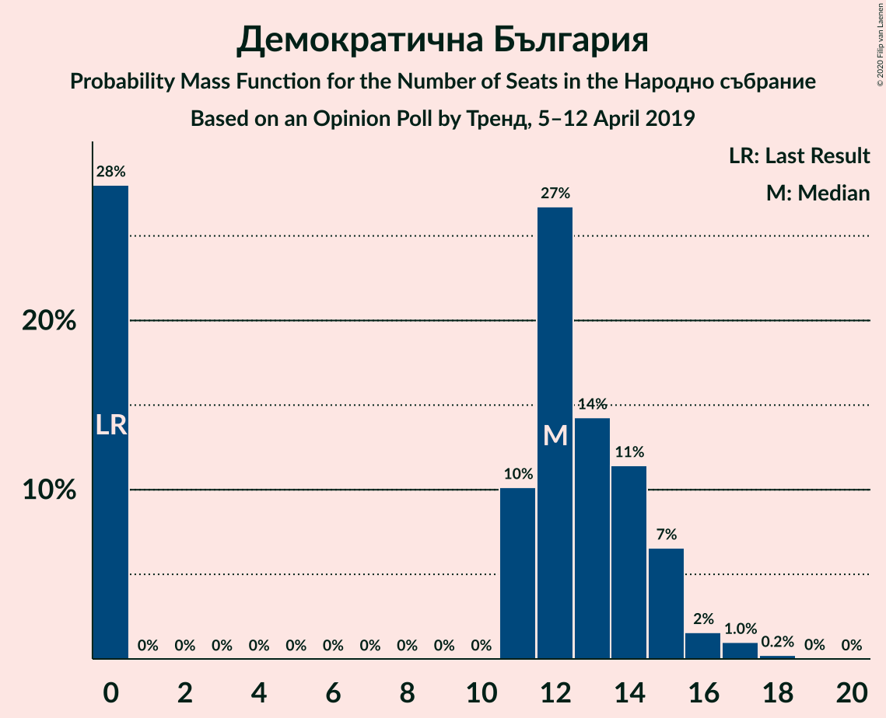

# Opinion Poll by Тренд, 5–12 April 2019

<a href="#voting-intentions">Voting Intentions</a> | <a href="#seats">Seats</a> | <a href="#coalitions">Coalitions</a> | <a href="#technical-information">Technical Information</a>

## Voting Intentions

### Confidence Intervals

| Party | Last Result | Poll Result | 80% Confidence Interval | 90% Confidence Interval | 95% Confidence Interval | 99% Confidence Interval |
|:-----:|:-----------:|:-----------:|:-----------------------:|:-----------------------:|:-----------------------:|:-----------------------:|
| Българска социалистическа партия | 27.9% | 31.3% | 29.5–33.3% |29.0–33.8% |28.5–34.3% |27.7–35.2% |
| Граждани за европейско развитие на България | 33.5% | 30.5% | 28.6–32.4% |28.1–32.9% |27.7–33.4% |26.8–34.3% |
| Движение за права и свободи | 9.2% | 12.7% | 11.4–14.1% |11.1–14.5% |10.8–14.9% |10.2–15.6% |
| Обединени Патриоти | 9.3% | 6.7% | 5.8–7.9% |5.6–8.2% |5.3–8.5% |4.9–9.0% |
| Демократична България | 0.0% | 4.3% | 3.6–5.2% |3.4–5.5% |3.2–5.7% |2.9–6.2% |
| Воля | 4.3% | 3.6% | 2.9–4.5% |2.7–4.7% |2.6–4.9% |2.3–5.4% |
| Атака | 0.0% | 2.0% | 1.5–2.7% |1.4–2.9% |1.3–3.0% |1.1–3.4% |
| Алтернатива за българско възраждане | 1.6% | 1.3% | 0.9–1.9% |0.8–2.0% |0.7–2.2% |0.6–2.5% |

*Note:* The poll result column reflects the actual value used in the calculations. Published results may vary slightly, and in addition be rounded to fewer digits.

## Seats

### Confidence Intervals

| Party | Last Result | Median | 80% Confidence Interval | 90% Confidence Interval | 95% Confidence Interval | 99% Confidence Interval |
|:-----:|:-----------:|:------:|:-----------------------:|:-----------------------:|:-----------------------:|:-----------------------:|
| <a href="#българска-социалистическа-партия">Българска социалистическа партия</a> | 80 | 87 | 81–94 |80–97 |78–99 |76–102 |
| <a href="#граждани-за-европейско-развитие-на-българия">Граждани за европейско развитие на България</a> | 95 | 85 | 79–92 |77–93 |76–95 |74–99 |
| <a href="#движение-за-права-и-свободи">Движение за права и свободи</a> | 26 | 34 | 30–38 |30–39 |29–40 |28–42 |
| <a href="#обединени-патриоти">Обединени Патриоти</a> | 27 | 18 | 15–20 |15–21 |14–22 |13–24 |
| <a href="#демократична-българия">Демократична България</a> | 0 | 12 | 0–14 |0–15 |0–16 |0–17 |
| <a href="#воля">Воля</a> | 12 | 0 | 0–13 |0–14 |0–14 |0–15 |
| <a href="#атака">Атака</a> | 0 | 0 | 0 |0 |0 |0 |
| <a href="#алтернатива-за-българско-възраждане">Алтернатива за българско възраждане</a> | 0 | 0 | 0 |0 |0 |0 |

### Българска социалистическа партия

*For a full overview of the results for this party, see the [Българска социалистическа партия](party-българскасоциалистическапартия.html) page.*

| Number of Seats | Probability | Accumulated | Special Marks |
|:---------------:|:-----------:|:-----------:|:-------------:|
| 73 | 0% | 100% |  |
| 74 | 0.2% | 99.9% |  |
| 75 | 0.2% | 99.8% |  |
| 76 | 0.7% | 99.6% |  |
| 77 | 0.6% | 98.9% |  |
| 78 | 1.1% | 98% |  |
| 79 | 2% | 97% |  |
| 80 | 2% | 95% | Last Result |
| 81 | 4% | 93% |  |
| 82 | 3% | 89% |  |
| 83 | 7% | 86% |  |
| 84 | 6% | 79% |  |
| 85 | 7% | 73% |  |
| 86 | 8% | 66% |  |
| 87 | 9% | 58% | Median |
| 88 | 7% | 49% |  |
| 89 | 7% | 43% |  |
| 90 | 7% | 36% |  |
| 91 | 6% | 29% |  |
| 92 | 7% | 23% |  |
| 93 | 4% | 16% |  |
| 94 | 2% | 11% |  |
| 95 | 2% | 9% |  |
| 96 | 1.4% | 7% |  |
| 97 | 2% | 5% |  |
| 98 | 1.1% | 4% |  |
| 99 | 0.9% | 3% |  |
| 100 | 0.4% | 2% |  |
| 101 | 0.6% | 1.2% |  |
| 102 | 0.4% | 0.6% |  |
| 103 | 0.1% | 0.3% |  |
| 104 | 0.1% | 0.2% |  |
| 105 | 0% | 0.1% |  |
| 106 | 0% | 0.1% |  |
| 107 | 0% | 0% |  |

### Граждани за европейско развитие на България

*For a full overview of the results for this party, see the [Граждани за европейско развитие на България](party-гражданизаевропейскоразвитиенабългария.html) page.*

| Number of Seats | Probability | Accumulated | Special Marks |
|:---------------:|:-----------:|:-----------:|:-------------:|
| 71 | 0.1% | 100% |  |
| 72 | 0.2% | 99.9% |  |
| 73 | 0.2% | 99.7% |  |
| 74 | 0.5% | 99.5% |  |
| 75 | 1.1% | 99.0% |  |
| 76 | 1.1% | 98% |  |
| 77 | 2% | 97% |  |
| 78 | 3% | 95% |  |
| 79 | 4% | 92% |  |
| 80 | 5% | 87% |  |
| 81 | 6% | 82% |  |
| 82 | 7% | 77% |  |
| 83 | 6% | 69% |  |
| 84 | 8% | 63% |  |
| 85 | 8% | 55% | Median |
| 86 | 8% | 46% |  |
| 87 | 7% | 39% |  |
| 88 | 6% | 32% |  |
| 89 | 6% | 26% |  |
| 90 | 3% | 20% |  |
| 91 | 5% | 16% |  |
| 92 | 4% | 11% |  |
| 93 | 2% | 7% |  |
| 94 | 1.3% | 5% |  |
| 95 | 1.2% | 3% | Last Result |
| 96 | 0.9% | 2% |  |
| 97 | 0.6% | 1.4% |  |
| 98 | 0.2% | 0.8% |  |
| 99 | 0.4% | 0.6% |  |
| 100 | 0.1% | 0.2% |  |
| 101 | 0% | 0.1% |  |
| 102 | 0% | 0.1% |  |
| 103 | 0% | 0% |  |

### Движение за права и свободи

*For a full overview of the results for this party, see the [Движение за права и свободи](party-движениезаправаисвободи.html) page.*

| Number of Seats | Probability | Accumulated | Special Marks |
|:---------------:|:-----------:|:-----------:|:-------------:|
| 26 | 0.2% | 100% | Last Result |
| 27 | 0.2% | 99.8% |  |
| 28 | 0.8% | 99.5% |  |
| 29 | 3% | 98.7% |  |
| 30 | 7% | 96% |  |
| 31 | 14% | 89% |  |
| 32 | 13% | 75% |  |
| 33 | 9% | 62% |  |
| 34 | 13% | 54% | Median |
| 35 | 14% | 41% |  |
| 36 | 6% | 27% |  |
| 37 | 10% | 21% |  |
| 38 | 6% | 11% |  |
| 39 | 2% | 5% |  |
| 40 | 1.4% | 3% |  |
| 41 | 0.7% | 2% |  |
| 42 | 0.4% | 0.9% |  |
| 43 | 0.2% | 0.5% |  |
| 44 | 0.1% | 0.2% |  |
| 45 | 0.1% | 0.1% |  |
| 46 | 0% | 0.1% |  |
| 47 | 0% | 0% |  |

### Обединени Патриоти

*For a full overview of the results for this party, see the [Обединени Патриоти](party-обединенипатриоти.html) page.*

| Number of Seats | Probability | Accumulated | Special Marks |
|:---------------:|:-----------:|:-----------:|:-------------:|
| 12 | 0.1% | 100% |  |
| 13 | 0.6% | 99.9% |  |
| 14 | 3% | 99.2% |  |
| 15 | 7% | 96% |  |
| 16 | 14% | 89% |  |
| 17 | 18% | 75% |  |
| 18 | 19% | 57% | Median |
| 19 | 18% | 38% |  |
| 20 | 11% | 20% |  |
| 21 | 5% | 9% |  |
| 22 | 2% | 4% |  |
| 23 | 0.9% | 2% |  |
| 24 | 0.4% | 0.8% |  |
| 25 | 0.2% | 0.4% |  |
| 26 | 0.1% | 0.2% |  |
| 27 | 0% | 0.1% | Last Result |
| 28 | 0% | 0.1% |  |
| 29 | 0% | 0% |  |

### Демократична България

*For a full overview of the results for this party, see the [Демократична България](party-демократичнабългария.html) page.*

| Number of Seats | Probability | Accumulated | Special Marks |
|:---------------:|:-----------:|:-----------:|:-------------:|
| 0 | 28% | 100% | Last Result |
| 1 | 0% | 72% |  |
| 2 | 0% | 72% |  |
| 3 | 0% | 72% |  |
| 4 | 0% | 72% |  |
| 5 | 0% | 72% |  |
| 6 | 0% | 72% |  |
| 7 | 0% | 72% |  |
| 8 | 0% | 72% |  |
| 9 | 0% | 72% |  |
| 10 | 0% | 72% |  |
| 11 | 10% | 72% |  |
| 12 | 27% | 62% | Median |
| 13 | 14% | 35% |  |
| 14 | 11% | 21% |  |
| 15 | 7% | 9% |  |
| 16 | 2% | 3% |  |
| 17 | 1.0% | 1.3% |  |
| 18 | 0.2% | 0.3% |  |
| 19 | 0% | 0.1% |  |
| 20 | 0% | 0% |  |

### Воля

*For a full overview of the results for this party, see the [Воля](party-воля.html) page.*

| Number of Seats | Probability | Accumulated | Special Marks |
|:---------------:|:-----------:|:-----------:|:-------------:|
| 0 | 51% | 100% | Median |
| 1 | 0% | 49% |  |
| 2 | 0% | 49% |  |
| 3 | 0% | 49% |  |
| 4 | 0% | 49% |  |
| 5 | 0% | 49% |  |
| 6 | 0% | 49% |  |
| 7 | 0% | 49% |  |
| 8 | 0% | 49% |  |
| 9 | 0% | 49% |  |
| 10 | 0% | 49% |  |
| 11 | 13% | 49% |  |
| 12 | 20% | 37% | Last Result |
| 13 | 10% | 17% |  |
| 14 | 6% | 7% |  |
| 15 | 1.0% | 1.3% |  |
| 16 | 0.2% | 0.3% |  |
| 17 | 0% | 0.1% |  |
| 18 | 0% | 0% |  |

### Атака

*For a full overview of the results for this party, see the [Атака](party-атака.html) page.*

| Number of Seats | Probability | Accumulated | Special Marks |
|:---------------:|:-----------:|:-----------:|:-------------:|
| 0 | 100% | 100% | Last Result, Median |

### Алтернатива за българско възраждане

*For a full overview of the results for this party, see the [Алтернатива за българско възраждане](party-алтернативазабългарсковъзраждане.html) page.*

| Number of Seats | Probability | Accumulated | Special Marks |
|:---------------:|:-----------:|:-----------:|:-------------:|
| 0 | 100% | 100% | Last Result, Median |

## Coalitions

### Confidence Intervals

| Coalition | Last Result | Median | Majority? | 80% Confidence Interval | 90% Confidence Interval | 95% Confidence Interval | 99% Confidence Interval |
|:---------:|:-----------:|:------:|:---------:|:-----------------------:|:-----------------------:|:-----------------------:|:-----------------------:|
| Българска социалистическа партия – Движение за права и свободи | 106 | 121 | 56% | 114–129 | 112–132 | 111–135 | 108–138 |
| Граждани за европейско развитие на България – Обединени Патриоти | 122 | 103 | 0.1% | 96–110 | 94–112 | 93–114 | 90–117 |

### Българска социалистическа партия – Движение за права и свободи

| Number of Seats | Probability | Accumulated | Special Marks |
|:---------------:|:-----------:|:-----------:|:-------------:|
| 105 | 0% | 100% |  |
| 106 | 0.1% | 99.9% | Last Result |
| 107 | 0.2% | 99.9% |  |
| 108 | 0.2% | 99.7% |  |
| 109 | 0.6% | 99.5% |  |
| 110 | 1.0% | 98.9% |  |
| 111 | 0.7% | 98% |  |
| 112 | 2% | 97% |  |
| 113 | 2% | 95% |  |
| 114 | 5% | 93% |  |
| 115 | 4% | 88% |  |
| 116 | 5% | 84% |  |
| 117 | 6% | 79% |  |
| 118 | 5% | 73% |  |
| 119 | 7% | 68% |  |
| 120 | 6% | 61% |  |
| 121 | 7% | 56% | Median, Majority |
| 122 | 7% | 49% |  |
| 123 | 6% | 42% |  |
| 124 | 6% | 36% |  |
| 125 | 6% | 30% |  |
| 126 | 4% | 24% |  |
| 127 | 3% | 20% |  |
| 128 | 4% | 17% |  |
| 129 | 4% | 13% |  |
| 130 | 1.4% | 9% |  |
| 131 | 2% | 8% |  |
| 132 | 1.4% | 5% |  |
| 133 | 0.6% | 4% |  |
| 134 | 0.8% | 3% |  |
| 135 | 1.3% | 3% |  |
| 136 | 0.3% | 1.3% |  |
| 137 | 0.1% | 1.0% |  |
| 138 | 0.5% | 0.9% |  |
| 139 | 0.3% | 0.4% |  |
| 140 | 0.1% | 0.1% |  |
| 141 | 0% | 0.1% |  |
| 142 | 0% | 0.1% |  |
| 143 | 0% | 0% |  |

### Граждани за европейско развитие на България – Обединени Патриоти

| Number of Seats | Probability | Accumulated | Special Marks |
|:---------------:|:-----------:|:-----------:|:-------------:|
| 87 | 0% | 100% |  |
| 88 | 0.1% | 99.9% |  |
| 89 | 0.1% | 99.9% |  |
| 90 | 0.3% | 99.7% |  |
| 91 | 0.4% | 99.5% |  |
| 92 | 0.9% | 99.1% |  |
| 93 | 1.1% | 98% |  |
| 94 | 2% | 97% |  |
| 95 | 3% | 95% |  |
| 96 | 3% | 92% |  |
| 97 | 3% | 89% |  |
| 98 | 3% | 85% |  |
| 99 | 5% | 82% |  |
| 100 | 9% | 77% |  |
| 101 | 6% | 68% |  |
| 102 | 8% | 62% |  |
| 103 | 9% | 54% | Median |
| 104 | 7% | 45% |  |
| 105 | 7% | 38% |  |
| 106 | 5% | 31% |  |
| 107 | 4% | 26% |  |
| 108 | 5% | 22% |  |
| 109 | 6% | 17% |  |
| 110 | 1.4% | 11% |  |
| 111 | 3% | 9% |  |
| 112 | 2% | 6% |  |
| 113 | 1.4% | 4% |  |
| 114 | 0.6% | 3% |  |
| 115 | 0.7% | 2% |  |
| 116 | 0.6% | 1.3% |  |
| 117 | 0.4% | 0.7% |  |
| 118 | 0.2% | 0.3% |  |
| 119 | 0% | 0.2% |  |
| 120 | 0% | 0.1% |  |
| 121 | 0% | 0.1% | Majority |
| 122 | 0% | 0% | Last Result |

## Technical Information

### Opinion Poll

+ **Polling firm:** Тренд
+ **Commissioner(s):** —
+ **Fieldwork period:** 5–12 April 2019

### Calculations

+ **Sample size:** 1008
+ **Simulations done:** 1,048,576
+ **Error estimate:** 2.01%

