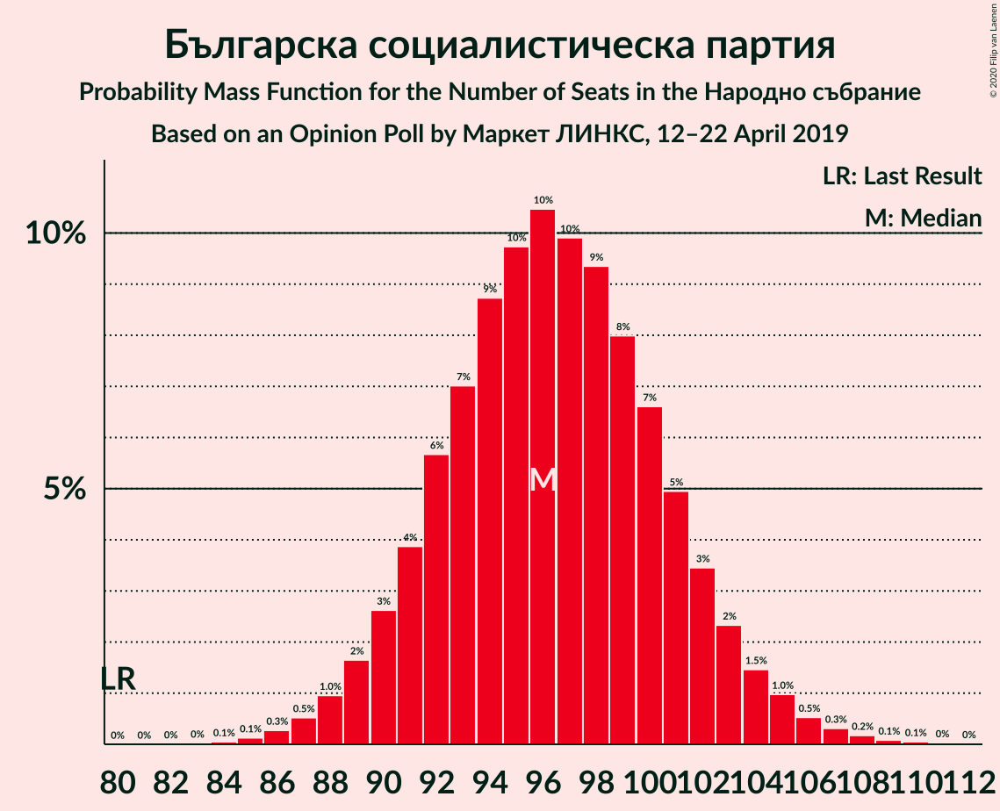
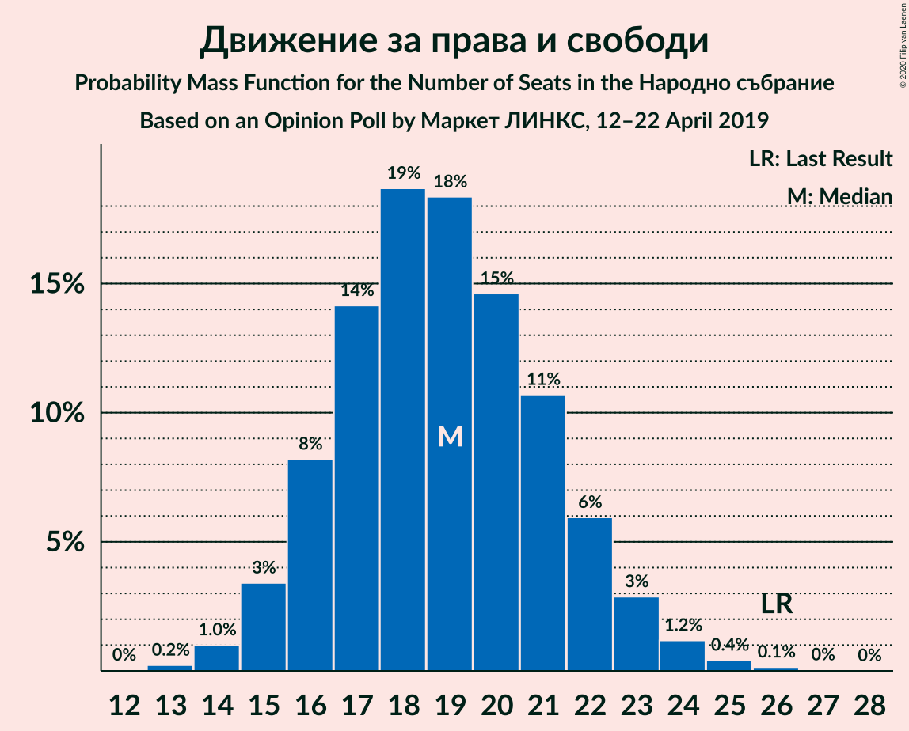

# Opinion Poll by Маркет ЛИНКС, 12–22 April 2019

<a href="#voting-intentions">Voting Intentions</a> | <a href="#seats">Seats</a> | <a href="#coalitions">Coalitions</a> | <a href="#technical-information">Technical Information</a>

## Voting Intentions

### Confidence Intervals

| Party | Last Result | Poll Result | 80% Confidence Interval | 90% Confidence Interval | 95% Confidence Interval | 99% Confidence Interval |
|:-----:|:-----------:|:-----------:|:-----------------------:|:-----------------------:|:-----------------------:|:-----------------------:|
| Българска социалистическа партия | 27.9% | 35.9% | 34.1–37.9% |33.5–38.4% |33.1–38.9% |32.2–39.8% |
| Граждани за европейско развитие на България | 33.5% | 35.4% | 33.5–37.3% |33.0–37.8% |32.5–38.3% |31.6–39.2% |
| Движение за права и свободи | 9.2% | 7.0% | 6.0–8.1% |5.8–8.4% |5.6–8.7% |5.2–9.2% |
| Обединени Патриоти | 9.3% | 5.7% | 4.9–6.8% |4.7–7.0% |4.5–7.3% |4.1–7.8% |
| Демократична България | 0.0% | 5.3% | 4.5–6.3% |4.3–6.6% |4.1–6.9% |3.8–7.4% |
| Воля | 4.3% | 1.9% | 1.5–2.6% |1.3–2.8% |1.2–2.9% |1.1–3.3% |

*Note:* The poll result column reflects the actual value used in the calculations. Published results may vary slightly, and in addition be rounded to fewer digits.

## Seats

### Confidence Intervals

| Party | Last Result | Median | 80% Confidence Interval | 90% Confidence Interval | 95% Confidence Interval | 99% Confidence Interval |
|:-----:|:-----------:|:------:|:-----------------------:|:-----------------------:|:-----------------------:|:-----------------------:|
| <a href="#българска-социалистическа-партия">Българска социалистическа партия</a> | 80 | 96 | 91–101 |90–103 |89–104 |87–107 |
| <a href="#граждани-за-европейско-развитие-на-българия">Граждани за европейско развитие на България</a> | 95 | 95 | 90–100 |89–101 |87–103 |85–105 |
| <a href="#движение-за-права-и-свободи">Движение за права и свободи</a> | 26 | 19 | 16–22 |16–22 |15–23 |14–25 |
| <a href="#обединени-патриоти">Обединени Патриоти</a> | 27 | 16 | 13–18 |13–19 |12–20 |11–21 |
| <a href="#демократична-българия">Демократична България</a> | 0 | 14 | 12–17 |12–18 |11–18 |0–20 |
| <a href="#воля">Воля</a> | 12 | 0 | 0 |0 |0 |0 |

### Българска социалистическа партия

*For a full overview of the results for this party, see the [Българска социалистическа партия](party-българскасоциалистическапартия.html) page.*

| Number of Seats | Probability | Accumulated | Special Marks |
|:---------------:|:-----------:|:-----------:|:-------------:|
| 80 | 0% | 100% | Last Result |
| 81 | 0% | 100% |  |
| 82 | 0% | 100% |  |
| 83 | 0% | 100% |  |
| 84 | 0.1% | 100% |  |
| 85 | 0.1% | 99.9% |  |
| 86 | 0.3% | 99.8% |  |
| 87 | 0.5% | 99.5% |  |
| 88 | 1.0% | 99.0% |  |
| 89 | 2% | 98% |  |
| 90 | 3% | 96% |  |
| 91 | 4% | 94% |  |
| 92 | 6% | 90% |  |
| 93 | 7% | 84% |  |
| 94 | 9% | 77% |  |
| 95 | 10% | 68% |  |
| 96 | 10% | 59% | Median |
| 97 | 10% | 48% |  |
| 98 | 9% | 38% |  |
| 99 | 8% | 29% |  |
| 100 | 7% | 21% |  |
| 101 | 5% | 14% |  |
| 102 | 3% | 9% |  |
| 103 | 2% | 6% |  |
| 104 | 1.5% | 4% |  |
| 105 | 1.0% | 2% |  |
| 106 | 0.5% | 1.2% |  |
| 107 | 0.3% | 0.7% |  |
| 108 | 0.2% | 0.4% |  |
| 109 | 0.1% | 0.2% |  |
| 110 | 0.1% | 0.1% |  |
| 111 | 0% | 0.1% |  |
| 112 | 0% | 0% |  |

### Граждани за европейско развитие на България

*For a full overview of the results for this party, see the [Граждани за европейско развитие на България](party-гражданизаевропейскоразвитиенабългария.html) page.*

| Number of Seats | Probability | Accumulated | Special Marks |
|:---------------:|:-----------:|:-----------:|:-------------:|
| 82 | 0% | 100% |  |
| 83 | 0.1% | 99.9% |  |
| 84 | 0.2% | 99.9% |  |
| 85 | 0.4% | 99.7% |  |
| 86 | 0.7% | 99.3% |  |
| 87 | 1.3% | 98.6% |  |
| 88 | 2% | 97% |  |
| 89 | 3% | 95% |  |
| 90 | 5% | 92% |  |
| 91 | 6% | 87% |  |
| 92 | 8% | 81% |  |
| 93 | 9% | 73% |  |
| 94 | 11% | 63% |  |
| 95 | 10% | 53% | Last Result, Median |
| 96 | 11% | 43% |  |
| 97 | 8% | 32% |  |
| 98 | 7% | 24% |  |
| 99 | 6% | 17% |  |
| 100 | 4% | 12% |  |
| 101 | 3% | 7% |  |
| 102 | 2% | 5% |  |
| 103 | 1.3% | 3% |  |
| 104 | 0.7% | 1.4% |  |
| 105 | 0.3% | 0.8% |  |
| 106 | 0.2% | 0.4% |  |
| 107 | 0.1% | 0.2% |  |
| 108 | 0.1% | 0.1% |  |
| 109 | 0% | 0.1% |  |
| 110 | 0% | 0% |  |

### Движение за права и свободи

*For a full overview of the results for this party, see the [Движение за права и свободи](party-движениезаправаисвободи.html) page.*

| Number of Seats | Probability | Accumulated | Special Marks |
|:---------------:|:-----------:|:-----------:|:-------------:|
| 13 | 0.2% | 100% |  |
| 14 | 1.0% | 99.7% |  |
| 15 | 3% | 98.7% |  |
| 16 | 8% | 95% |  |
| 17 | 14% | 87% |  |
| 18 | 19% | 73% |  |
| 19 | 18% | 54% | Median |
| 20 | 15% | 36% |  |
| 21 | 11% | 21% |  |
| 22 | 6% | 11% |  |
| 23 | 3% | 5% |  |
| 24 | 1.2% | 2% |  |
| 25 | 0.4% | 0.6% |  |
| 26 | 0.1% | 0.2% | Last Result |
| 27 | 0% | 0.1% |  |
| 28 | 0% | 0% |  |

### Обединени Патриоти

*For a full overview of the results for this party, see the [Обединени Патриоти](party-обединенипатриоти.html) page.*

| Number of Seats | Probability | Accumulated | Special Marks |
|:---------------:|:-----------:|:-----------:|:-------------:|
| 0 | 0.3% | 100% |  |
| 1 | 0% | 99.7% |  |
| 2 | 0% | 99.7% |  |
| 3 | 0% | 99.7% |  |
| 4 | 0% | 99.7% |  |
| 5 | 0% | 99.7% |  |
| 6 | 0% | 99.7% |  |
| 7 | 0% | 99.7% |  |
| 8 | 0% | 99.7% |  |
| 9 | 0% | 99.7% |  |
| 10 | 0% | 99.7% |  |
| 11 | 1.0% | 99.7% |  |
| 12 | 3% | 98.7% |  |
| 13 | 9% | 95% |  |
| 14 | 17% | 86% |  |
| 15 | 17% | 70% |  |
| 16 | 22% | 52% | Median |
| 17 | 14% | 30% |  |
| 18 | 9% | 16% |  |
| 19 | 5% | 7% |  |
| 20 | 2% | 3% |  |
| 21 | 0.6% | 0.9% |  |
| 22 | 0.2% | 0.3% |  |
| 23 | 0% | 0.1% |  |
| 24 | 0% | 0% |  |
| 25 | 0% | 0% |  |
| 26 | 0% | 0% |  |
| 27 | 0% | 0% | Last Result |

### Демократична България

*For a full overview of the results for this party, see the [Демократична България](party-демократичнабългария.html) page.*

| Number of Seats | Probability | Accumulated | Special Marks |
|:---------------:|:-----------:|:-----------:|:-------------:|
| 0 | 2% | 100% | Last Result |
| 1 | 0% | 98% |  |
| 2 | 0% | 98% |  |
| 3 | 0% | 98% |  |
| 4 | 0% | 98% |  |
| 5 | 0% | 98% |  |
| 6 | 0% | 98% |  |
| 7 | 0% | 98% |  |
| 8 | 0% | 98% |  |
| 9 | 0% | 98% |  |
| 10 | 0% | 98% |  |
| 11 | 3% | 98% |  |
| 12 | 9% | 95% |  |
| 13 | 17% | 87% |  |
| 14 | 22% | 70% | Median |
| 15 | 19% | 48% |  |
| 16 | 15% | 29% |  |
| 17 | 8% | 14% |  |
| 18 | 4% | 6% |  |
| 19 | 2% | 2% |  |
| 20 | 0.5% | 0.7% |  |
| 21 | 0.1% | 0.2% |  |
| 22 | 0% | 0% |  |

### Воля

*For a full overview of the results for this party, see the [Воля](party-воля.html) page.*

| Number of Seats | Probability | Accumulated | Special Marks |
|:---------------:|:-----------:|:-----------:|:-------------:|
| 0 | 100% | 100% | Median |
| 1 | 0% | 0% |  |
| 2 | 0% | 0% |  |
| 3 | 0% | 0% |  |
| 4 | 0% | 0% |  |
| 5 | 0% | 0% |  |
| 6 | 0% | 0% |  |
| 7 | 0% | 0% |  |
| 8 | 0% | 0% |  |
| 9 | 0% | 0% |  |
| 10 | 0% | 0% |  |
| 11 | 0% | 0% |  |
| 12 | 0% | 0% | Last Result |

## Coalitions

### Confidence Intervals

| Coalition | Last Result | Median | Majority? | 80% Confidence Interval | 90% Confidence Interval | 95% Confidence Interval | 99% Confidence Interval |
|:---------:|:-----------:|:------:|:---------:|:-----------------------:|:-----------------------:|:-----------------------:|:-----------------------:|
| Българска социалистическа партия – Движение за права и свободи | 106 | 115 | 10% | 110–120 | 109–122 | 108–123 | 105–126 |
| Граждани за европейско развитие на България – Обединени Патриоти | 122 | 110 | 0.8% | 105–115 | 104–117 | 103–118 | 100–121 |

### Българска социалистическа партия – Движение за права и свободи

| Number of Seats | Probability | Accumulated | Special Marks |
|:---------------:|:-----------:|:-----------:|:-------------:|
| 102 | 0% | 100% |  |
| 103 | 0.1% | 99.9% |  |
| 104 | 0.2% | 99.9% |  |
| 105 | 0.4% | 99.7% |  |
| 106 | 0.6% | 99.3% | Last Result |
| 107 | 1.1% | 98.7% |  |
| 108 | 2% | 98% |  |
| 109 | 3% | 96% |  |
| 110 | 4% | 92% |  |
| 111 | 5% | 88% |  |
| 112 | 7% | 83% |  |
| 113 | 10% | 76% |  |
| 114 | 10% | 66% |  |
| 115 | 10% | 56% | Median |
| 116 | 9% | 46% |  |
| 117 | 9% | 37% |  |
| 118 | 8% | 28% |  |
| 119 | 7% | 20% |  |
| 120 | 4% | 14% |  |
| 121 | 3% | 10% | Majority |
| 122 | 2% | 6% |  |
| 123 | 2% | 4% |  |
| 124 | 1.0% | 2% |  |
| 125 | 0.5% | 1.3% |  |
| 126 | 0.4% | 0.8% |  |
| 127 | 0.2% | 0.4% |  |
| 128 | 0.1% | 0.2% |  |
| 129 | 0% | 0.1% |  |
| 130 | 0% | 0.1% |  |
| 131 | 0% | 0% |  |

### Граждани за европейско развитие на България – Обединени Патриоти

| Number of Seats | Probability | Accumulated | Special Marks |
|:---------------:|:-----------:|:-----------:|:-------------:|
| 97 | 0% | 100% |  |
| 98 | 0.1% | 99.9% |  |
| 99 | 0.2% | 99.8% |  |
| 100 | 0.3% | 99.7% |  |
| 101 | 0.6% | 99.3% |  |
| 102 | 1.0% | 98.8% |  |
| 103 | 2% | 98% |  |
| 104 | 3% | 96% |  |
| 105 | 4% | 93% |  |
| 106 | 5% | 89% |  |
| 107 | 7% | 84% |  |
| 108 | 8% | 76% |  |
| 109 | 9% | 68% |  |
| 110 | 11% | 60% |  |
| 111 | 11% | 49% | Median |
| 112 | 9% | 38% |  |
| 113 | 8% | 29% |  |
| 114 | 7% | 22% |  |
| 115 | 5% | 15% |  |
| 116 | 3% | 10% |  |
| 117 | 3% | 7% |  |
| 118 | 2% | 4% |  |
| 119 | 1.0% | 2% |  |
| 120 | 0.6% | 1.3% |  |
| 121 | 0.4% | 0.8% | Majority |
| 122 | 0.2% | 0.4% | Last Result |
| 123 | 0.1% | 0.2% |  |
| 124 | 0% | 0.1% |  |
| 125 | 0% | 0.1% |  |
| 126 | 0% | 0% |  |

## Technical Information

### Opinion Poll

+ **Polling firm:** Маркет ЛИНКС
+ **Commissioner(s):** —
+ **Fieldwork period:** 12–22 April 2019

### Calculations

+ **Sample size:** 1049
+ **Simulations done:** 1,048,576
+ **Error estimate:** 0.66%

