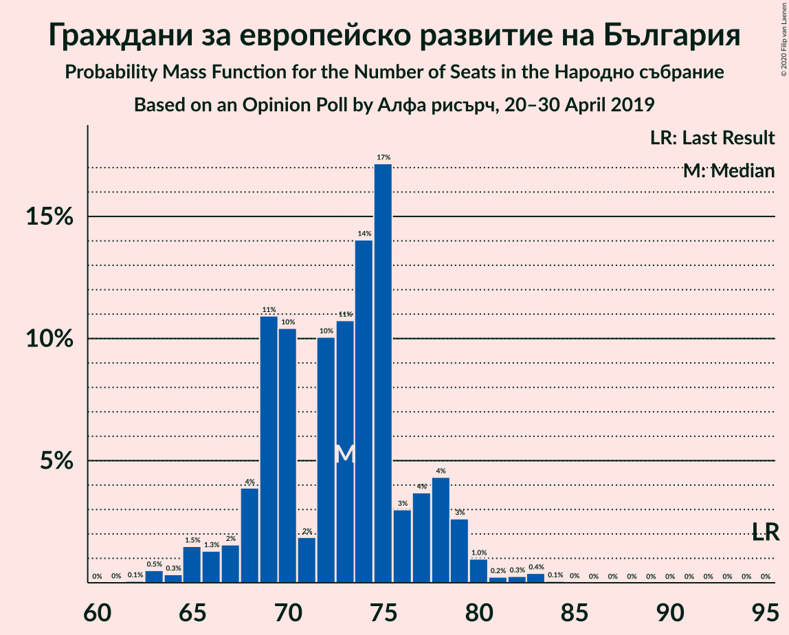
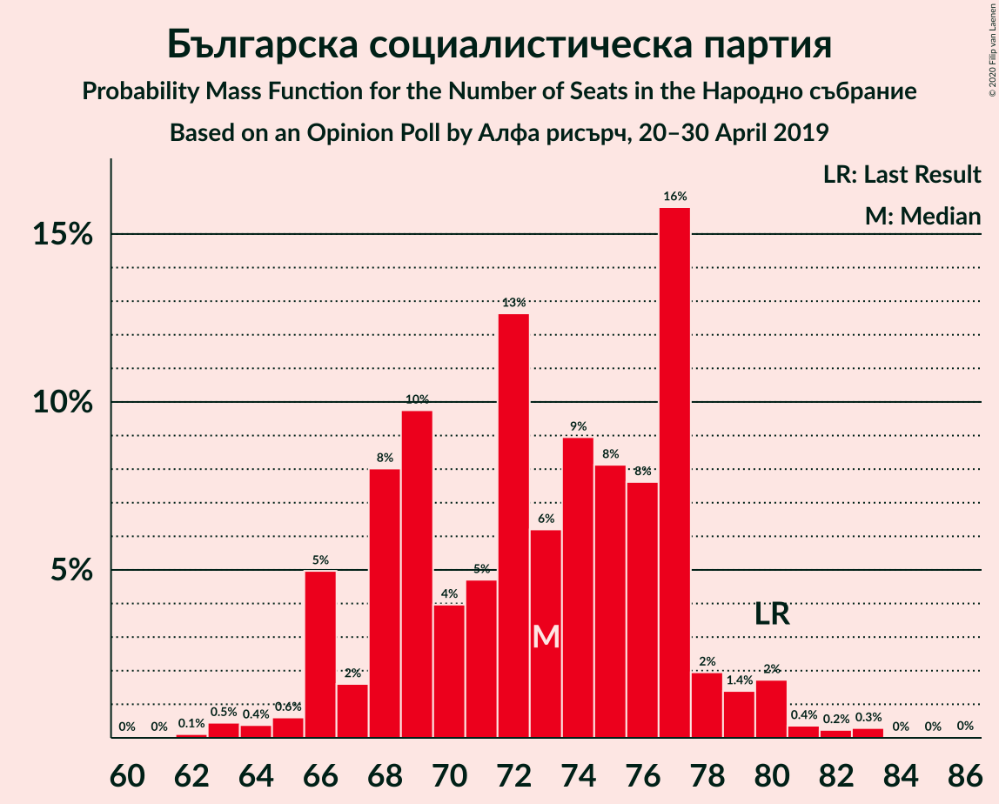

# Opinion Poll by Алфа рисърч, 20–30 April 2019

<a href="#voting-intentions">Voting Intentions</a> | <a href="#seats">Seats</a> | <a href="#coalitions">Coalitions</a> | <a href="#technical-information">Technical Information</a>

## Voting Intentions

### Confidence Intervals

| Party | Last Result | Poll Result | 80% Confidence Interval | 90% Confidence Interval | 95% Confidence Interval | 99% Confidence Interval |
|:-----:|:-----------:|:-----------:|:-----------------------:|:-----------------------:|:-----------------------:|:-----------------------:|
| Граждани за европейско развитие на България | 33.5% | 29.2% | 27.5–30.9% |27.0–31.4% |26.6–31.9% |25.8–32.7% |
| Българска социалистическа партия | 27.9% | 29.2% | 27.5–30.9% |27.0–31.4% |26.6–31.9% |25.8–32.7% |
| Атака | 0.0% | 18.5% | 17.1–20.1% |16.7–20.5% |16.4–20.9% |15.7–21.7% |
| Движение за права и свободи | 9.2% | 8.9% | 7.9–10.0% |7.6–10.4% |7.4–10.7% |6.9–11.2% |
| Обединени Патриоти | 9.3% | 7.0% | 6.2–8.1% |5.9–8.4% |5.7–8.7% |5.3–9.2% |
| Демократична България | 0.0% | 4.4% | 3.7–5.3% |3.6–5.6% |3.4–5.8% |3.1–6.2% |
| Воля | 4.3% | 1.7% | 1.3–2.3% |1.2–2.5% |1.1–2.7% |1.0–3.0% |
| Алтернатива за българско възраждане | 1.6% | 1.0% | 0.7–1.6% |0.7–1.7% |0.6–1.8% |0.5–2.1% |

*Note:* The poll result column reflects the actual value used in the calculations. Published results may vary slightly, and in addition be rounded to fewer digits.

## Seats

### Confidence Intervals

| Party | Last Result | Median | 80% Confidence Interval | 90% Confidence Interval | 95% Confidence Interval | 99% Confidence Interval |
|:-----:|:-----------:|:------:|:-----------------------:|:-----------------------:|:-----------------------:|:-----------------------:|
| <a href="#граждани-за-европейско-развитие-на-българия">Граждани за европейско развитие на България</a> | 95 | 73 | 69–77 |67–78 |66–79 |63–82 |
| <a href="#българска-социалистическа-партия">Българска социалистическа партия</a> | 80 | 73 | 68–77 |66–78 |66–80 |63–82 |
| <a href="#атака">Атака</a> | 0 | 47 | 42–50 |41–50 |41–51 |39–54 |
| <a href="#движение-за-права-и-свободи">Движение за права и свободи</a> | 26 | 22 | 20–25 |19–25 |18–26 |17–27 |
| <a href="#обединени-патриоти">Обединени Патриоти</a> | 27 | 18 | 15–20 |15–21 |14–22 |13–23 |
| <a href="#демократична-българия">Демократична България</a> | 0 | 11 | 0–13 |0–13 |0–14 |0–15 |
| <a href="#воля">Воля</a> | 12 | 0 | 0 |0 |0 |0 |
| <a href="#алтернатива-за-българско-възраждане">Алтернатива за българско възраждане</a> | 0 | 0 | 0 |0 |0 |0 |

### Граждани за европейско развитие на България

*For a full overview of the results for this party, see the [Граждани за европейско развитие на България](party-гражданизаевропейскоразвитиенабългария.html) page.*

| Number of Seats | Probability | Accumulated | Special Marks |
|:---------------:|:-----------:|:-----------:|:-------------:|
| 62 | 0.1% | 100% |  |
| 63 | 0.5% | 99.9% |  |
| 64 | 0.3% | 99.4% |  |
| 65 | 1.5% | 99.1% |  |
| 66 | 1.3% | 98% |  |
| 67 | 2% | 96% |  |
| 68 | 4% | 95% |  |
| 69 | 11% | 91% |  |
| 70 | 10% | 80% |  |
| 71 | 2% | 69% |  |
| 72 | 10% | 68% |  |
| 73 | 11% | 58% | Median |
| 74 | 14% | 47% |  |
| 75 | 17% | 33% |  |
| 76 | 3% | 16% |  |
| 77 | 4% | 13% |  |
| 78 | 4% | 9% |  |
| 79 | 3% | 5% |  |
| 80 | 1.0% | 2% |  |
| 81 | 0.2% | 1.0% |  |
| 82 | 0.3% | 0.8% |  |
| 83 | 0.4% | 0.5% |  |
| 84 | 0.1% | 0.1% |  |
| 85 | 0% | 0% |  |
| 86 | 0% | 0% |  |
| 87 | 0% | 0% |  |
| 88 | 0% | 0% |  |
| 89 | 0% | 0% |  |
| 90 | 0% | 0% |  |
| 91 | 0% | 0% |  |
| 92 | 0% | 0% |  |
| 93 | 0% | 0% |  |
| 94 | 0% | 0% |  |
| 95 | 0% | 0% | Last Result |

### Българска социалистическа партия

*For a full overview of the results for this party, see the [Българска социалистическа партия](party-българскасоциалистическапартия.html) page.*

| Number of Seats | Probability | Accumulated | Special Marks |
|:---------------:|:-----------:|:-----------:|:-------------:|
| 62 | 0.1% | 100% |  |
| 63 | 0.5% | 99.9% |  |
| 64 | 0.4% | 99.4% |  |
| 65 | 0.6% | 99.0% |  |
| 66 | 5% | 98% |  |
| 67 | 2% | 93% |  |
| 68 | 8% | 92% |  |
| 69 | 10% | 84% |  |
| 70 | 4% | 74% |  |
| 71 | 5% | 70% |  |
| 72 | 13% | 65% |  |
| 73 | 6% | 53% | Median |
| 74 | 9% | 47% |  |
| 75 | 8% | 38% |  |
| 76 | 8% | 29% |  |
| 77 | 16% | 22% |  |
| 78 | 2% | 6% |  |
| 79 | 1.4% | 4% |  |
| 80 | 2% | 3% | Last Result |
| 81 | 0.4% | 1.0% |  |
| 82 | 0.2% | 0.6% |  |
| 83 | 0.3% | 0.4% |  |
| 84 | 0% | 0.1% |  |
| 85 | 0% | 0.1% |  |
| 86 | 0% | 0% |  |

### Атака

*For a full overview of the results for this party, see the [Атака](party-атака.html) page.*

| Number of Seats | Probability | Accumulated | Special Marks |
|:---------------:|:-----------:|:-----------:|:-------------:|
| 0 | 0% | 100% | Last Result |
| 1 | 0% | 100% |  |
| 2 | 0% | 100% |  |
| 3 | 0% | 100% |  |
| 4 | 0% | 100% |  |
| 5 | 0% | 100% |  |
| 6 | 0% | 100% |  |
| 7 | 0% | 100% |  |
| 8 | 0% | 100% |  |
| 9 | 0% | 100% |  |
| 10 | 0% | 100% |  |
| 11 | 0% | 100% |  |
| 12 | 0% | 100% |  |
| 13 | 0% | 100% |  |
| 14 | 0% | 100% |  |
| 15 | 0% | 100% |  |
| 16 | 0% | 100% |  |
| 17 | 0% | 100% |  |
| 18 | 0% | 100% |  |
| 19 | 0% | 100% |  |
| 20 | 0% | 100% |  |
| 21 | 0% | 100% |  |
| 22 | 0% | 100% |  |
| 23 | 0% | 100% |  |
| 24 | 0% | 100% |  |
| 25 | 0% | 100% |  |
| 26 | 0% | 100% |  |
| 27 | 0% | 100% |  |
| 28 | 0% | 100% |  |
| 29 | 0% | 100% |  |
| 30 | 0% | 100% |  |
| 31 | 0% | 100% |  |
| 32 | 0% | 100% |  |
| 33 | 0% | 100% |  |
| 34 | 0% | 100% |  |
| 35 | 0% | 100% |  |
| 36 | 0% | 100% |  |
| 37 | 0.1% | 100% |  |
| 38 | 0.4% | 99.9% |  |
| 39 | 0.4% | 99.6% |  |
| 40 | 0.6% | 99.2% |  |
| 41 | 5% | 98.6% |  |
| 42 | 7% | 94% |  |
| 43 | 4% | 87% |  |
| 44 | 7% | 84% |  |
| 45 | 11% | 77% |  |
| 46 | 13% | 66% |  |
| 47 | 20% | 54% | Median |
| 48 | 6% | 33% |  |
| 49 | 12% | 28% |  |
| 50 | 11% | 16% |  |
| 51 | 3% | 5% |  |
| 52 | 2% | 2% |  |
| 53 | 0.2% | 0.8% |  |
| 54 | 0.2% | 0.6% |  |
| 55 | 0.2% | 0.4% |  |
| 56 | 0.1% | 0.2% |  |
| 57 | 0% | 0.1% |  |
| 58 | 0% | 0% |  |

### Движение за права и свободи

*For a full overview of the results for this party, see the [Движение за права и свободи](party-движениезаправаисвободи.html) page.*

| Number of Seats | Probability | Accumulated | Special Marks |
|:---------------:|:-----------:|:-----------:|:-------------:|
| 16 | 0.2% | 100% |  |
| 17 | 0.6% | 99.8% |  |
| 18 | 4% | 99.2% |  |
| 19 | 4% | 96% |  |
| 20 | 8% | 92% |  |
| 21 | 14% | 83% |  |
| 22 | 26% | 69% | Median |
| 23 | 20% | 43% |  |
| 24 | 9% | 23% |  |
| 25 | 10% | 14% |  |
| 26 | 2% | 4% | Last Result |
| 27 | 1.0% | 2% |  |
| 28 | 0.3% | 0.5% |  |
| 29 | 0.1% | 0.2% |  |
| 30 | 0% | 0.1% |  |
| 31 | 0% | 0% |  |

### Обединени Патриоти

*For a full overview of the results for this party, see the [Обединени Патриоти](party-обединенипатриоти.html) page.*

| Number of Seats | Probability | Accumulated | Special Marks |
|:---------------:|:-----------:|:-----------:|:-------------:|
| 12 | 0.1% | 100% |  |
| 13 | 0.8% | 99.9% |  |
| 14 | 2% | 99.0% |  |
| 15 | 9% | 97% |  |
| 16 | 13% | 88% |  |
| 17 | 19% | 75% |  |
| 18 | 18% | 56% | Median |
| 19 | 22% | 38% |  |
| 20 | 6% | 16% |  |
| 21 | 5% | 9% |  |
| 22 | 3% | 4% |  |
| 23 | 0.8% | 1.1% |  |
| 24 | 0.2% | 0.3% |  |
| 25 | 0.1% | 0.1% |  |
| 26 | 0% | 0% |  |
| 27 | 0% | 0% | Last Result |

### Демократична България

*For a full overview of the results for this party, see the [Демократична България](party-демократичнабългария.html) page.*

| Number of Seats | Probability | Accumulated | Special Marks |
|:---------------:|:-----------:|:-----------:|:-------------:|
| 0 | 33% | 100% | Last Result |
| 1 | 0% | 67% |  |
| 2 | 0% | 67% |  |
| 3 | 0% | 67% |  |
| 4 | 0% | 67% |  |
| 5 | 0% | 67% |  |
| 6 | 0% | 67% |  |
| 7 | 0% | 67% |  |
| 8 | 0% | 67% |  |
| 9 | 0% | 67% |  |
| 10 | 4% | 67% |  |
| 11 | 33% | 63% | Median |
| 12 | 9% | 30% |  |
| 13 | 18% | 21% |  |
| 14 | 2% | 4% |  |
| 15 | 2% | 2% |  |
| 16 | 0.2% | 0.2% |  |
| 17 | 0.1% | 0.1% |  |
| 18 | 0% | 0% |  |

### Воля

*For a full overview of the results for this party, see the [Воля](party-воля.html) page.*

| Number of Seats | Probability | Accumulated | Special Marks |
|:---------------:|:-----------:|:-----------:|:-------------:|
| 0 | 100% | 100% | Median |
| 1 | 0% | 0% |  |
| 2 | 0% | 0% |  |
| 3 | 0% | 0% |  |
| 4 | 0% | 0% |  |
| 5 | 0% | 0% |  |
| 6 | 0% | 0% |  |
| 7 | 0% | 0% |  |
| 8 | 0% | 0% |  |
| 9 | 0% | 0% |  |
| 10 | 0% | 0% |  |
| 11 | 0% | 0% |  |
| 12 | 0% | 0% | Last Result |

### Алтернатива за българско възраждане

*For a full overview of the results for this party, see the [Алтернатива за българско възраждане](party-алтернативазабългарсковъзраждане.html) page.*

| Number of Seats | Probability | Accumulated | Special Marks |
|:---------------:|:-----------:|:-----------:|:-------------:|
| 0 | 100% | 100% | Last Result, Median |

## Coalitions

### Confidence Intervals

| Coalition | Last Result | Median | Majority? | 80% Confidence Interval | 90% Confidence Interval | 95% Confidence Interval | 99% Confidence Interval |
|:---------:|:-----------:|:------:|:---------:|:-----------------------:|:-----------------------:|:-----------------------:|:-----------------------:|
| Българска социалистическа партия – Движение за права и свободи | 106 | 95 | 0% | 90–101 | 89–101 | 87–102 | 85–106 |
| Граждани за европейско развитие на България – Обединени Патриоти | 122 | 91 | 0% | 85–95 | 84–97 | 84–99 | 81–100 |

### Българска социалистическа партия – Движение за права и свободи

| Number of Seats | Probability | Accumulated | Special Marks |
|:---------------:|:-----------:|:-----------:|:-------------:|
| 83 | 0.1% | 100% |  |
| 84 | 0.2% | 99.9% |  |
| 85 | 0.8% | 99.7% |  |
| 86 | 0.4% | 98.9% |  |
| 87 | 2% | 98.5% |  |
| 88 | 1.4% | 97% |  |
| 89 | 2% | 95% |  |
| 90 | 13% | 93% |  |
| 91 | 9% | 81% |  |
| 92 | 4% | 72% |  |
| 93 | 4% | 67% |  |
| 94 | 8% | 64% |  |
| 95 | 9% | 56% | Median |
| 96 | 8% | 46% |  |
| 97 | 4% | 38% |  |
| 98 | 5% | 34% |  |
| 99 | 16% | 29% |  |
| 100 | 1.5% | 13% |  |
| 101 | 8% | 12% |  |
| 102 | 2% | 4% |  |
| 103 | 0.6% | 2% |  |
| 104 | 0.5% | 2% |  |
| 105 | 0.4% | 1.2% |  |
| 106 | 0.5% | 0.8% | Last Result |
| 107 | 0.2% | 0.3% |  |
| 108 | 0.1% | 0.1% |  |
| 109 | 0% | 0% |  |

### Граждани за европейско развитие на България – Обединени Патриоти

| Number of Seats | Probability | Accumulated | Special Marks |
|:---------------:|:-----------:|:-----------:|:-------------:|
| 79 | 0.1% | 100% |  |
| 80 | 0.2% | 99.9% |  |
| 81 | 0.4% | 99.6% |  |
| 82 | 0.6% | 99.2% |  |
| 83 | 0.6% | 98.6% |  |
| 84 | 5% | 98% |  |
| 85 | 5% | 93% |  |
| 86 | 8% | 89% |  |
| 87 | 5% | 81% |  |
| 88 | 4% | 76% |  |
| 89 | 8% | 72% |  |
| 90 | 12% | 64% |  |
| 91 | 7% | 52% | Median |
| 92 | 13% | 45% |  |
| 93 | 4% | 32% |  |
| 94 | 16% | 27% |  |
| 95 | 3% | 11% |  |
| 96 | 3% | 8% |  |
| 97 | 1.4% | 5% |  |
| 98 | 0.9% | 4% |  |
| 99 | 0.5% | 3% |  |
| 100 | 2% | 2% |  |
| 101 | 0.2% | 0.4% |  |
| 102 | 0.1% | 0.2% |  |
| 103 | 0.1% | 0.1% |  |
| 104 | 0% | 0% |  |
| 105 | 0% | 0% |  |
| 106 | 0% | 0% |  |
| 107 | 0% | 0% |  |
| 108 | 0% | 0% |  |
| 109 | 0% | 0% |  |
| 110 | 0% | 0% |  |
| 111 | 0% | 0% |  |
| 112 | 0% | 0% |  |
| 113 | 0% | 0% |  |
| 114 | 0% | 0% |  |
| 115 | 0% | 0% |  |
| 116 | 0% | 0% |  |
| 117 | 0% | 0% |  |
| 118 | 0% | 0% |  |
| 119 | 0% | 0% |  |
| 120 | 0% | 0% |  |
| 121 | 0% | 0% | Majority |
| 122 | 0% | 0% | Last Result |

## Technical Information

### Opinion Poll

+ **Polling firm:** Алфа рисърч
+ **Commissioner(s):** —
+ **Fieldwork period:** 20–30 April 2019

### Calculations

+ **Sample size:** 1149
+ **Simulations done:** 1,048,576
+ **Error estimate:** 1.92%

