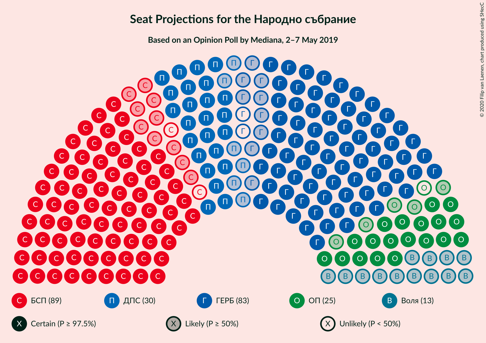
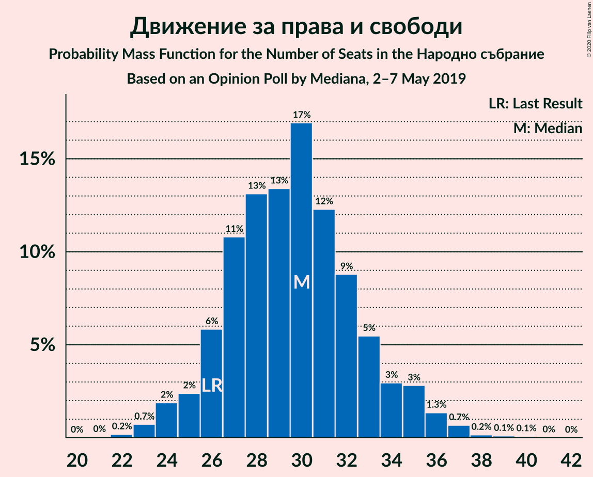
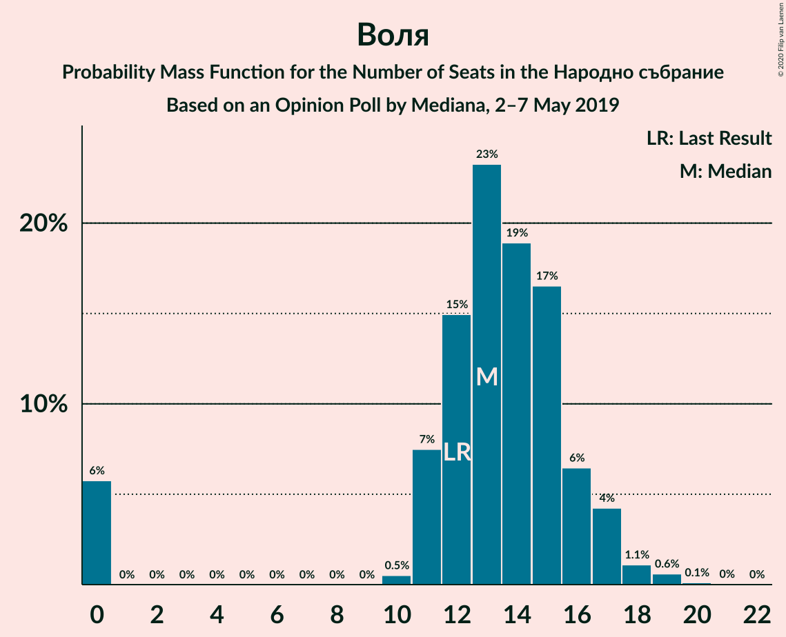
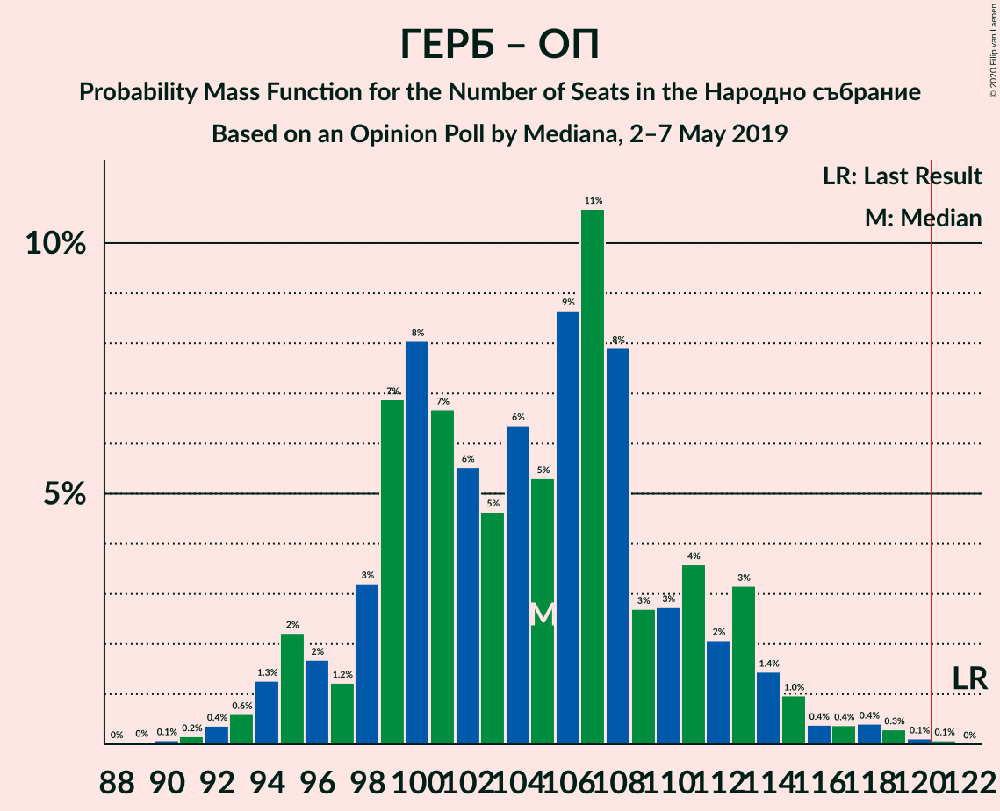

# Opinion Poll by Mediana, 2–7 May 2019

<a href="#voting-intentions">Voting Intentions</a> | <a href="#seats">Seats</a> | <a href="#coalitions">Coalitions</a> | <a href="#technical-information">Technical Information</a>

## Voting Intentions

### Confidence Intervals

| Party | Last Result | Poll Result | 80% Confidence Interval | 90% Confidence Interval | 95% Confidence Interval | 99% Confidence Interval |
|:-----:|:-----------:|:-----------:|:-----------------------:|:-----------------------:|:-----------------------:|:-----------------------:|
| Българска социалистическа партия | 27.9% | 32.0% | 30.2–34.0% |29.7–34.5% |29.2–35.0% |28.4–35.9% |
| Граждани за европейско развитие на България | 33.5% | 30.0% | 28.2–31.9% |27.6–32.4% |27.2–32.9% |26.4–33.8% |
| Движение за права и свободи | 9.2% | 11.0% | 9.8–12.4% |9.5–12.8% |9.2–13.1% |8.7–13.8% |
| Обединени Патриоти | 9.3% | 8.9% | 7.9–10.2% |7.6–10.5% |7.3–10.9% |6.8–11.5% |
| Воля | 4.3% | 5.0% | 4.2–6.0% |4.0–6.2% |3.8–6.5% |3.4–7.0% |
| Алтернатива за българско възраждане | 1.6% | 4.0% | 3.3–4.9% |3.1–5.1% |2.9–5.4% |2.6–5.8% |
| Атака | 0.0% | 3.0% | 2.4–3.8% |2.2–4.0% |2.1–4.2% |1.8–4.6% |
| Демократична България | 0.0% | 3.0% | 2.4–3.8% |2.2–4.0% |2.1–4.2% |1.8–4.6% |

*Note:* The poll result column reflects the actual value used in the calculations. Published results may vary slightly, and in addition be rounded to fewer digits.

## Seats

### Confidence Intervals

| Party | Last Result | Median | 80% Confidence Interval | 90% Confidence Interval | 95% Confidence Interval | 99% Confidence Interval |
|:-----:|:-----------:|:------:|:-----------------------:|:-----------------------:|:-----------------------:|:-----------------------:|
| <a href="#българска-социалистическа-партия">Българска социалистическа партия</a> | 80 | 88 | 81–90 |80–92 |79–94 |75–100 |
| <a href="#граждани-за-европейско-развитие-на-българия">Граждани за европейско развитие на България</a> | 95 | 81 | 75–86 |74–87 |72–88 |70–92 |
| <a href="#движение-за-права-и-свободи">Движение за права и свободи</a> | 26 | 30 | 27–32 |26–33 |25–35 |23–37 |
| <a href="#обединени-патриоти">Обединени Патриоти</a> | 27 | 24 | 22–27 |21–29 |21–30 |18–31 |
| <a href="#воля">Воля</a> | 12 | 13 | 12–15 |11–16 |11–16 |0–18 |
| <a href="#алтернатива-за-българско-възраждане">Алтернатива за българско възраждане</a> | 0 | 0 | 0–12 |0–13 |0–13 |0–14 |
| <a href="#атака">Атака</a> | 0 | 0 | 0 |0 |0–12 |0–12 |
| <a href="#демократична-българия">Демократична България</a> | 0 | 0 | 0 |0–10 |0–11 |0–11 |

### Българска социалистическа партия

*For a full overview of the results for this party, see the [Българска социалистическа партия](party-българскасоциалистическапартия.html) page.*

| Number of Seats | Probability | Accumulated | Special Marks |
|:---------------:|:-----------:|:-----------:|:-------------:|
| 72 | 0% | 100% |  |
| 73 | 0% | 99.9% |  |
| 74 | 0.1% | 99.9% |  |
| 75 | 0.4% | 99.8% |  |
| 76 | 0.3% | 99.4% |  |
| 77 | 0.6% | 99.2% |  |
| 78 | 1.0% | 98.6% |  |
| 79 | 2% | 98% |  |
| 80 | 2% | 96% | Last Result |
| 81 | 7% | 94% |  |
| 82 | 3% | 88% |  |
| 83 | 8% | 84% |  |
| 84 | 5% | 77% |  |
| 85 | 5% | 72% |  |
| 86 | 4% | 68% |  |
| 87 | 11% | 63% |  |
| 88 | 7% | 52% | Median |
| 89 | 14% | 45% |  |
| 90 | 23% | 31% |  |
| 91 | 2% | 8% |  |
| 92 | 2% | 6% |  |
| 93 | 1.5% | 4% |  |
| 94 | 1.4% | 3% |  |
| 95 | 0.3% | 2% |  |
| 96 | 0.2% | 1.4% |  |
| 97 | 0.4% | 1.2% |  |
| 98 | 0.1% | 0.7% |  |
| 99 | 0.1% | 0.7% |  |
| 100 | 0.5% | 0.6% |  |
| 101 | 0.1% | 0.1% |  |
| 102 | 0% | 0% |  |

### Граждани за европейско развитие на България

*For a full overview of the results for this party, see the [Граждани за европейско развитие на България](party-гражданизаевропейскоразвитиенабългария.html) page.*

| Number of Seats | Probability | Accumulated | Special Marks |
|:---------------:|:-----------:|:-----------:|:-------------:|
| 67 | 0% | 100% |  |
| 68 | 0.1% | 99.9% |  |
| 69 | 0.2% | 99.9% |  |
| 70 | 0.6% | 99.7% |  |
| 71 | 0.9% | 99.1% |  |
| 72 | 1.0% | 98% |  |
| 73 | 2% | 97% |  |
| 74 | 2% | 95% |  |
| 75 | 8% | 93% |  |
| 76 | 17% | 85% |  |
| 77 | 7% | 67% |  |
| 78 | 3% | 60% |  |
| 79 | 3% | 57% |  |
| 80 | 2% | 54% |  |
| 81 | 4% | 51% | Median |
| 82 | 23% | 47% |  |
| 83 | 5% | 24% |  |
| 84 | 1.1% | 19% |  |
| 85 | 5% | 18% |  |
| 86 | 6% | 13% |  |
| 87 | 2% | 6% |  |
| 88 | 2% | 4% |  |
| 89 | 0.8% | 2% |  |
| 90 | 0.3% | 1.5% |  |
| 91 | 0.1% | 1.2% |  |
| 92 | 1.0% | 1.1% |  |
| 93 | 0.1% | 0.1% |  |
| 94 | 0% | 0% |  |
| 95 | 0% | 0% | Last Result |

### Движение за права и свободи

*For a full overview of the results for this party, see the [Движение за права и свободи](party-движениезаправаисвободи.html) page.*

| Number of Seats | Probability | Accumulated | Special Marks |
|:---------------:|:-----------:|:-----------:|:-------------:|
| 22 | 0.2% | 100% |  |
| 23 | 0.8% | 99.8% |  |
| 24 | 0.8% | 99.0% |  |
| 25 | 1.1% | 98% |  |
| 26 | 5% | 97% | Last Result |
| 27 | 5% | 92% |  |
| 28 | 16% | 87% |  |
| 29 | 12% | 70% |  |
| 30 | 25% | 58% | Median |
| 31 | 15% | 33% |  |
| 32 | 10% | 19% |  |
| 33 | 4% | 9% |  |
| 34 | 2% | 5% |  |
| 35 | 2% | 3% |  |
| 36 | 0.7% | 1.3% |  |
| 37 | 0.4% | 0.7% |  |
| 38 | 0.1% | 0.2% |  |
| 39 | 0.1% | 0.1% |  |
| 40 | 0% | 0% |  |

### Обединени Патриоти

*For a full overview of the results for this party, see the [Обединени Патриоти](party-обединенипатриоти.html) page.*

| Number of Seats | Probability | Accumulated | Special Marks |
|:---------------:|:-----------:|:-----------:|:-------------:|
| 16 | 0.1% | 100% |  |
| 17 | 0.1% | 99.9% |  |
| 18 | 0.6% | 99.8% |  |
| 19 | 0.4% | 99.3% |  |
| 20 | 1.1% | 98.8% |  |
| 21 | 6% | 98% |  |
| 22 | 9% | 92% |  |
| 23 | 31% | 83% |  |
| 24 | 8% | 52% | Median |
| 25 | 30% | 44% |  |
| 26 | 1.2% | 14% |  |
| 27 | 3% | 12% | Last Result |
| 28 | 4% | 9% |  |
| 29 | 2% | 5% |  |
| 30 | 3% | 3% |  |
| 31 | 0.4% | 0.7% |  |
| 32 | 0.2% | 0.3% |  |
| 33 | 0% | 0% |  |

### Воля

*For a full overview of the results for this party, see the [Воля](party-воля.html) page.*

| Number of Seats | Probability | Accumulated | Special Marks |
|:---------------:|:-----------:|:-----------:|:-------------:|
| 0 | 1.3% | 100% |  |
| 1 | 0% | 98.7% |  |
| 2 | 0% | 98.7% |  |
| 3 | 0% | 98.7% |  |
| 4 | 0% | 98.7% |  |
| 5 | 0% | 98.7% |  |
| 6 | 0% | 98.7% |  |
| 7 | 0% | 98.7% |  |
| 8 | 0% | 98.7% |  |
| 9 | 0% | 98.7% |  |
| 10 | 0% | 98.7% |  |
| 11 | 5% | 98.6% |  |
| 12 | 8% | 94% | Last Result |
| 13 | 51% | 86% | Median |
| 14 | 16% | 34% |  |
| 15 | 12% | 19% |  |
| 16 | 5% | 6% |  |
| 17 | 0.6% | 1.3% |  |
| 18 | 0.4% | 0.7% |  |
| 19 | 0.2% | 0.3% |  |
| 20 | 0.1% | 0.2% |  |
| 21 | 0.1% | 0.1% |  |
| 22 | 0% | 0% |  |

### Алтернатива за българско възраждане

*For a full overview of the results for this party, see the [Алтернатива за българско възраждане](party-алтернативазабългарсковъзраждане.html) page.*

| Number of Seats | Probability | Accumulated | Special Marks |
|:---------------:|:-----------:|:-----------:|:-------------:|
| 0 | 58% | 100% | Last Result, Median |
| 1 | 0% | 42% |  |
| 2 | 0% | 42% |  |
| 3 | 0% | 42% |  |
| 4 | 0% | 42% |  |
| 5 | 0% | 42% |  |
| 6 | 0% | 42% |  |
| 7 | 0% | 42% |  |
| 8 | 0% | 42% |  |
| 9 | 0% | 42% |  |
| 10 | 0.1% | 42% |  |
| 11 | 23% | 42% |  |
| 12 | 12% | 19% |  |
| 13 | 7% | 8% |  |
| 14 | 0.6% | 1.1% |  |
| 15 | 0.3% | 0.4% |  |
| 16 | 0.1% | 0.2% |  |
| 17 | 0.1% | 0.1% |  |
| 18 | 0% | 0% |  |

### Атака

*For a full overview of the results for this party, see the [Атака](party-атака.html) page.*

| Number of Seats | Probability | Accumulated | Special Marks |
|:---------------:|:-----------:|:-----------:|:-------------:|
| 0 | 96% | 100% | Last Result, Median |
| 1 | 0% | 4% |  |
| 2 | 0% | 4% |  |
| 3 | 0% | 4% |  |
| 4 | 0% | 4% |  |
| 5 | 0% | 4% |  |
| 6 | 0% | 4% |  |
| 7 | 0% | 4% |  |
| 8 | 0% | 4% |  |
| 9 | 0% | 4% |  |
| 10 | 0% | 4% |  |
| 11 | 2% | 4% |  |
| 12 | 2% | 3% |  |
| 13 | 0.1% | 0.1% |  |
| 14 | 0% | 0.1% |  |
| 15 | 0% | 0% |  |

### Демократична България

*For a full overview of the results for this party, see the [Демократична България](party-демократичнабългария.html) page.*

| Number of Seats | Probability | Accumulated | Special Marks |
|:---------------:|:-----------:|:-----------:|:-------------:|
| 0 | 95% | 100% | Last Result, Median |
| 1 | 0% | 5% |  |
| 2 | 0% | 5% |  |
| 3 | 0% | 5% |  |
| 4 | 0% | 5% |  |
| 5 | 0% | 5% |  |
| 6 | 0% | 5% |  |
| 7 | 0% | 5% |  |
| 8 | 0% | 5% |  |
| 9 | 0% | 5% |  |
| 10 | 1.1% | 5% |  |
| 11 | 4% | 4% |  |
| 12 | 0.3% | 0.4% |  |
| 13 | 0.1% | 0.1% |  |
| 14 | 0.1% | 0.1% |  |
| 15 | 0% | 0% |  |

## Coalitions

### Confidence Intervals

| Coalition | Last Result | Median | Majority? | 80% Confidence Interval | 90% Confidence Interval | 95% Confidence Interval | 99% Confidence Interval |
|:---------:|:-----------:|:------:|:---------:|:-----------------------:|:-----------------------:|:-----------------------:|:-----------------------:|
| Българска социалистическа партия – Движение за права и свободи | 106 | 117 | 9% | 111–120 | 109–123 | 107–125 | 104–129 |
| Граждани за европейско развитие на България – Обединени Патриоти | 122 | 105 | 0% | 98–110 | 97–112 | 95–113 | 92–118 |

### Българска социалистическа партия – Движение за права и свободи

| Number of Seats | Probability | Accumulated | Special Marks |
|:---------------:|:-----------:|:-----------:|:-------------:|
| 100 | 0% | 100% |  |
| 101 | 0% | 99.9% |  |
| 102 | 0.1% | 99.9% |  |
| 103 | 0.3% | 99.8% |  |
| 104 | 0.6% | 99.6% |  |
| 105 | 0.3% | 99.0% |  |
| 106 | 0.6% | 98.7% | Last Result |
| 107 | 1.0% | 98% |  |
| 108 | 2% | 97% |  |
| 109 | 0.8% | 95% |  |
| 110 | 4% | 94% |  |
| 111 | 3% | 91% |  |
| 112 | 2% | 88% |  |
| 113 | 9% | 86% |  |
| 114 | 4% | 77% |  |
| 115 | 4% | 72% |  |
| 116 | 9% | 68% |  |
| 117 | 18% | 59% |  |
| 118 | 7% | 41% | Median |
| 119 | 4% | 34% |  |
| 120 | 21% | 30% |  |
| 121 | 1.2% | 9% | Majority |
| 122 | 0.8% | 8% |  |
| 123 | 2% | 7% |  |
| 124 | 0.6% | 5% |  |
| 125 | 2% | 4% |  |
| 126 | 0.1% | 2% |  |
| 127 | 1.0% | 2% |  |
| 128 | 0.1% | 1.0% |  |
| 129 | 0.6% | 0.9% |  |
| 130 | 0.1% | 0.3% |  |
| 131 | 0% | 0.2% |  |
| 132 | 0% | 0.2% |  |
| 133 | 0.1% | 0.2% |  |
| 134 | 0% | 0.1% |  |
| 135 | 0% | 0% |  |

### Граждани за европейско развитие на България – Обединени Патриоти

| Number of Seats | Probability | Accumulated | Special Marks |
|:---------------:|:-----------:|:-----------:|:-------------:|
| 90 | 0.1% | 100% |  |
| 91 | 0.1% | 99.9% |  |
| 92 | 0.5% | 99.8% |  |
| 93 | 0.3% | 99.2% |  |
| 94 | 0.9% | 99.0% |  |
| 95 | 2% | 98% |  |
| 96 | 0.5% | 96% |  |
| 97 | 2% | 95% |  |
| 98 | 4% | 94% |  |
| 99 | 16% | 90% |  |
| 100 | 8% | 74% |  |
| 101 | 4% | 66% |  |
| 102 | 5% | 62% |  |
| 103 | 2% | 57% |  |
| 104 | 4% | 55% |  |
| 105 | 2% | 50% | Median |
| 106 | 2% | 49% |  |
| 107 | 24% | 47% |  |
| 108 | 8% | 22% |  |
| 109 | 3% | 14% |  |
| 110 | 2% | 11% |  |
| 111 | 2% | 9% |  |
| 112 | 3% | 7% |  |
| 113 | 2% | 4% |  |
| 114 | 1.0% | 2% |  |
| 115 | 0.3% | 1.3% |  |
| 116 | 0.1% | 0.9% |  |
| 117 | 0.2% | 0.8% |  |
| 118 | 0.5% | 0.7% |  |
| 119 | 0.1% | 0.2% |  |
| 120 | 0.1% | 0.1% |  |
| 121 | 0% | 0% | Majority |
| 122 | 0% | 0% | Last Result |

## Technical Information

### Opinion Poll

+ **Polling firm:** Mediana
+ **Commissioner(s):** —
+ **Fieldwork period:** 2–7 May 2019

### Calculations

+ **Sample size:** 1008
+ **Simulations done:** 131,072
+ **Error estimate:** 0.90%

