# Opinion Poll by Спектър for IMP, 16–21 May 2019

<a href="#voting-intentions">Voting Intentions</a> | <a href="#seats">Seats</a> | <a href="#coalitions">Coalitions</a> | <a href="#technical-information">Technical Information</a>

## Voting Intentions

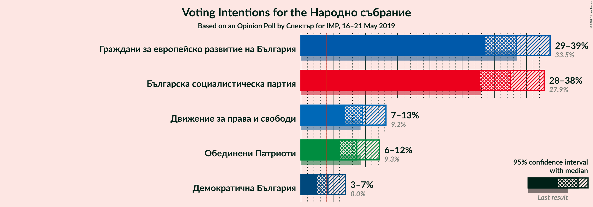

### Confidence Intervals

| Party | Last Result | Poll Result | 80% Confidence Interval | 90% Confidence Interval | 95% Confidence Interval | 99% Confidence Interval |
|:-----:|:-----------:|:-----------:|:-----------------------:|:-----------------------:|:-----------------------:|:-----------------------:|
| Граждани за европейско развитие на България | 33.5% | 33.4% | 30.3–36.9% |29.4–37.8% |28.6–38.7% |27.1–40.3% |
| Българска социалистическа партия | 27.9% | 32.5% | 29.4–35.9% |28.5–36.9% |27.7–37.7% |26.3–39.4% |
| Движение за права и свободи | 9.2% | 9.6% | 7.8–11.9% |7.3–12.6% |6.8–13.2% |6.1–14.4% |
| Обединени Патриоти | 9.3% | 8.7% | 7.0–10.9% |6.5–11.6% |6.1–12.2% |5.4–13.3% |
| Демократична България | 0.0% | 4.2% | 3.1–5.9% |2.8–6.4% |2.5–6.9% |2.1–7.8% |

*Note:* The poll result column reflects the actual value used in the calculations. Published results may vary slightly, and in addition be rounded to fewer digits.

## Seats

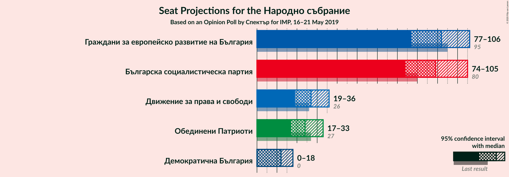

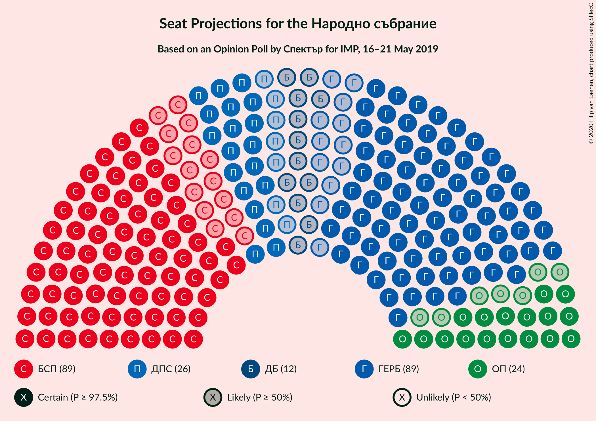

### Confidence Intervals

| Party | Last Result | Median | 80% Confidence Interval | 90% Confidence Interval | 95% Confidence Interval | 99% Confidence Interval |
|:-----:|:-----------:|:------:|:-----------------------:|:-----------------------:|:-----------------------:|:-----------------------:|
| <a href="#граждани-за-европейско-развитие-на-българия">Граждани за европейско развитие на България</a> | 95 | 92 | 83–101 |80–104 |77–106 |73–111 |
| <a href="#българска-социалистическа-партия">Българска социалистическа партия</a> | 80 | 89 | 81–98 |77–101 |74–105 |72–109 |
| <a href="#движение-за-права-и-свободи">Движение за права и свободи</a> | 26 | 27 | 21–33 |20–35 |19–36 |17–39 |
| <a href="#обединени-патриоти">Обединени Патриоти</a> | 27 | 24 | 19–30 |18–32 |17–33 |14–36 |
| <a href="#демократична-българия">Демократична България</a> | 0 | 12 | 0–16 |0–17 |0–18 |0–21 |

### Граждани за европейско развитие на България

*For a full overview of the results for this party, see the [Граждани за европейско развитие на България](party-гражданизаевропейскоразвитиенабългария.html) page.*

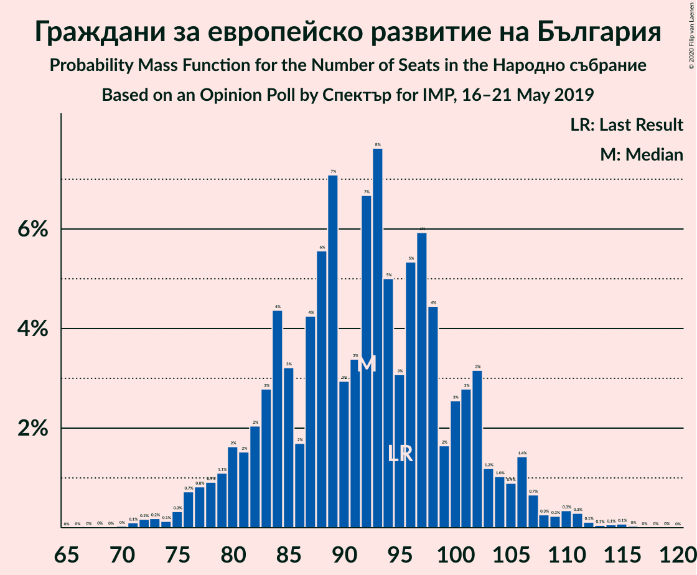

| Number of Seats | Probability | Accumulated | Special Marks |
|:---------------:|:-----------:|:-----------:|:-------------:|
| 69 | 0% | 100% |  |
| 70 | 0% | 99.9% |  |
| 71 | 0.1% | 99.9% |  |
| 72 | 0.2% | 99.8% |  |
| 73 | 0.2% | 99.6% |  |
| 74 | 0.1% | 99.5% |  |
| 75 | 0.3% | 99.3% |  |
| 76 | 0.7% | 99.0% |  |
| 77 | 0.8% | 98% |  |
| 78 | 0.9% | 97% |  |
| 79 | 1.1% | 97% |  |
| 80 | 2% | 95% |  |
| 81 | 2% | 94% |  |
| 82 | 2% | 92% |  |
| 83 | 3% | 90% |  |
| 84 | 4% | 87% |  |
| 85 | 3% | 83% |  |
| 86 | 2% | 80% |  |
| 87 | 4% | 78% |  |
| 88 | 6% | 74% |  |
| 89 | 7% | 68% |  |
| 90 | 3% | 61% |  |
| 91 | 3% | 58% |  |
| 92 | 7% | 55% | Median |
| 93 | 8% | 48% |  |
| 94 | 5% | 41% |  |
| 95 | 3% | 36% | Last Result |
| 96 | 5% | 33% |  |
| 97 | 6% | 27% |  |
| 98 | 4% | 21% |  |
| 99 | 2% | 17% |  |
| 100 | 3% | 15% |  |
| 101 | 3% | 13% |  |
| 102 | 3% | 10% |  |
| 103 | 1.2% | 7% |  |
| 104 | 1.0% | 6% |  |
| 105 | 0.9% | 4% |  |
| 106 | 1.4% | 4% |  |
| 107 | 0.7% | 2% |  |
| 108 | 0.3% | 1.5% |  |
| 109 | 0.2% | 1.2% |  |
| 110 | 0.3% | 1.0% |  |
| 111 | 0.3% | 0.7% |  |
| 112 | 0.1% | 0.4% |  |
| 113 | 0.1% | 0.3% |  |
| 114 | 0.1% | 0.2% |  |
| 115 | 0.1% | 0.1% |  |
| 116 | 0% | 0.1% |  |
| 117 | 0% | 0% |  |

### Българска социалистическа партия

*For a full overview of the results for this party, see the [Българска социалистическа партия](party-българскасоциалистическапартия.html) page.*

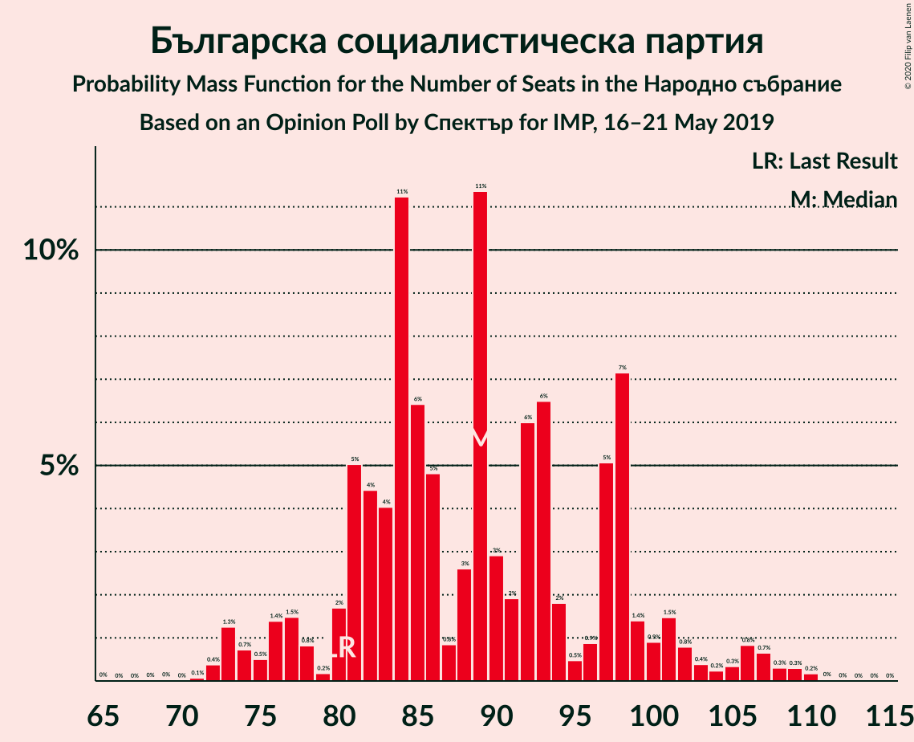

| Number of Seats | Probability | Accumulated | Special Marks |
|:---------------:|:-----------:|:-----------:|:-------------:|
| 67 | 0% | 100% |  |
| 68 | 0% | 99.9% |  |
| 69 | 0% | 99.9% |  |
| 70 | 0% | 99.9% |  |
| 71 | 0.1% | 99.9% |  |
| 72 | 0.4% | 99.8% |  |
| 73 | 1.3% | 99.4% |  |
| 74 | 0.7% | 98% |  |
| 75 | 0.5% | 97% |  |
| 76 | 1.4% | 97% |  |
| 77 | 1.5% | 96% |  |
| 78 | 0.8% | 94% |  |
| 79 | 0.2% | 93% |  |
| 80 | 2% | 93% | Last Result |
| 81 | 5% | 91% |  |
| 82 | 4% | 86% |  |
| 83 | 4% | 82% |  |
| 84 | 11% | 78% |  |
| 85 | 6% | 67% |  |
| 86 | 5% | 60% |  |
| 87 | 0.8% | 55% |  |
| 88 | 3% | 55% |  |
| 89 | 11% | 52% | Median |
| 90 | 3% | 41% |  |
| 91 | 2% | 38% |  |
| 92 | 6% | 36% |  |
| 93 | 6% | 30% |  |
| 94 | 2% | 23% |  |
| 95 | 0.5% | 21% |  |
| 96 | 0.9% | 21% |  |
| 97 | 5% | 20% |  |
| 98 | 7% | 15% |  |
| 99 | 1.4% | 8% |  |
| 100 | 0.9% | 6% |  |
| 101 | 1.5% | 6% |  |
| 102 | 0.8% | 4% |  |
| 103 | 0.4% | 3% |  |
| 104 | 0.2% | 3% |  |
| 105 | 0.3% | 3% |  |
| 106 | 0.8% | 2% |  |
| 107 | 0.7% | 2% |  |
| 108 | 0.3% | 0.9% |  |
| 109 | 0.3% | 0.6% |  |
| 110 | 0.2% | 0.3% |  |
| 111 | 0% | 0.1% |  |
| 112 | 0% | 0.1% |  |
| 113 | 0% | 0% |  |

### Движение за права и свободи

*For a full overview of the results for this party, see the [Движение за права и свободи](party-движениезаправаисвободи.html) page.*

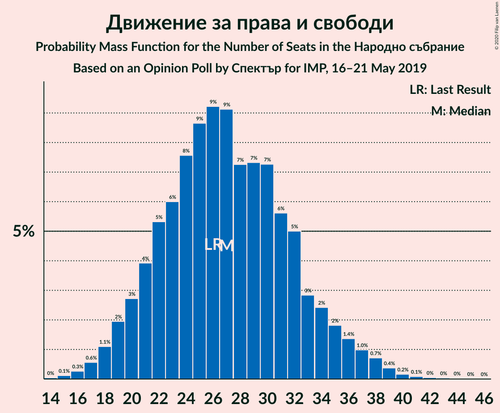

| Number of Seats | Probability | Accumulated | Special Marks |
|:---------------:|:-----------:|:-----------:|:-------------:|
| 14 | 0% | 100% |  |
| 15 | 0.1% | 99.9% |  |
| 16 | 0.3% | 99.8% |  |
| 17 | 0.6% | 99.6% |  |
| 18 | 1.1% | 99.0% |  |
| 19 | 2% | 98% |  |
| 20 | 3% | 96% |  |
| 21 | 4% | 93% |  |
| 22 | 5% | 89% |  |
| 23 | 6% | 84% |  |
| 24 | 8% | 78% |  |
| 25 | 9% | 70% |  |
| 26 | 9% | 62% | Last Result |
| 27 | 9% | 53% | Median |
| 28 | 7% | 43% |  |
| 29 | 7% | 36% |  |
| 30 | 7% | 29% |  |
| 31 | 6% | 22% |  |
| 32 | 5% | 16% |  |
| 33 | 3% | 11% |  |
| 34 | 2% | 8% |  |
| 35 | 2% | 6% |  |
| 36 | 1.4% | 4% |  |
| 37 | 1.0% | 2% |  |
| 38 | 0.7% | 1.5% |  |
| 39 | 0.4% | 0.8% |  |
| 40 | 0.2% | 0.4% |  |
| 41 | 0.1% | 0.2% |  |
| 42 | 0% | 0.1% |  |
| 43 | 0% | 0.1% |  |
| 44 | 0% | 0.1% |  |
| 45 | 0% | 0% |  |

### Обединени Патриоти

*For a full overview of the results for this party, see the [Обединени Патриоти](party-обединенипатриоти.html) page.*

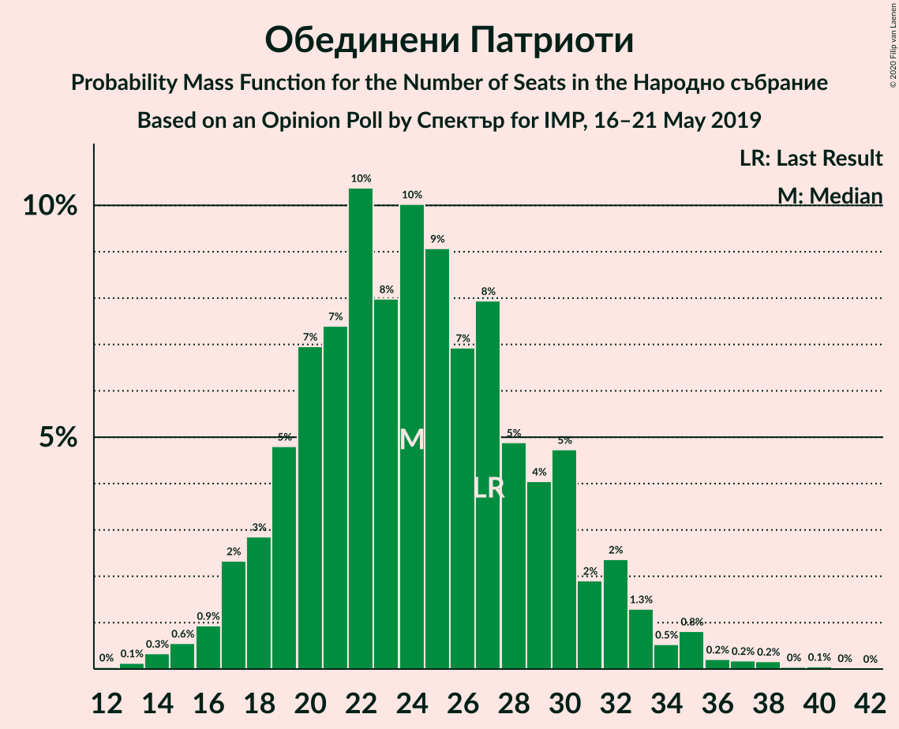

| Number of Seats | Probability | Accumulated | Special Marks |
|:---------------:|:-----------:|:-----------:|:-------------:|
| 12 | 0% | 100% |  |
| 13 | 0.1% | 99.9% |  |
| 14 | 0.3% | 99.8% |  |
| 15 | 0.6% | 99.5% |  |
| 16 | 0.9% | 98.9% |  |
| 17 | 2% | 98% |  |
| 18 | 3% | 96% |  |
| 19 | 5% | 93% |  |
| 20 | 7% | 88% |  |
| 21 | 7% | 81% |  |
| 22 | 10% | 74% |  |
| 23 | 8% | 63% |  |
| 24 | 10% | 55% | Median |
| 25 | 9% | 45% |  |
| 26 | 7% | 36% |  |
| 27 | 8% | 29% | Last Result |
| 28 | 5% | 21% |  |
| 29 | 4% | 16% |  |
| 30 | 5% | 12% |  |
| 31 | 2% | 8% |  |
| 32 | 2% | 6% |  |
| 33 | 1.3% | 3% |  |
| 34 | 0.5% | 2% |  |
| 35 | 0.8% | 2% |  |
| 36 | 0.2% | 0.7% |  |
| 37 | 0.2% | 0.5% |  |
| 38 | 0.2% | 0.3% |  |
| 39 | 0% | 0.2% |  |
| 40 | 0.1% | 0.1% |  |
| 41 | 0% | 0.1% |  |
| 42 | 0% | 0% |  |

### Демократична България

*For a full overview of the results for this party, see the [Демократична България](party-демократичнабългария.html) page.*

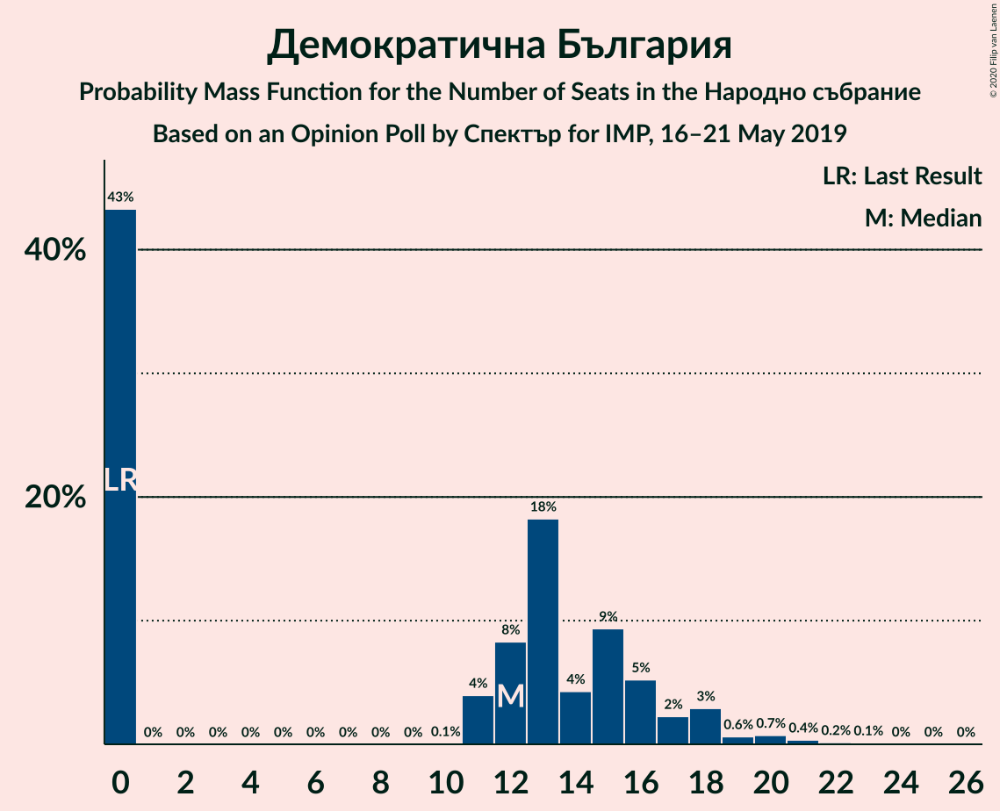

| Number of Seats | Probability | Accumulated | Special Marks |
|:---------------:|:-----------:|:-----------:|:-------------:|
| 0 | 43% | 100% | Last Result |
| 1 | 0% | 57% |  |
| 2 | 0% | 57% |  |
| 3 | 0% | 57% |  |
| 4 | 0% | 57% |  |
| 5 | 0% | 57% |  |
| 6 | 0% | 57% |  |
| 7 | 0% | 57% |  |
| 8 | 0% | 57% |  |
| 9 | 0% | 57% |  |
| 10 | 0.1% | 57% |  |
| 11 | 4% | 57% |  |
| 12 | 8% | 53% | Median |
| 13 | 18% | 44% |  |
| 14 | 4% | 26% |  |
| 15 | 9% | 22% |  |
| 16 | 5% | 12% |  |
| 17 | 2% | 7% |  |
| 18 | 3% | 5% |  |
| 19 | 0.6% | 2% |  |
| 20 | 0.7% | 1.4% |  |
| 21 | 0.4% | 0.7% |  |
| 22 | 0.2% | 0.3% |  |
| 23 | 0.1% | 0.2% |  |
| 24 | 0% | 0.1% |  |
| 25 | 0% | 0% |  |

## Coalitions

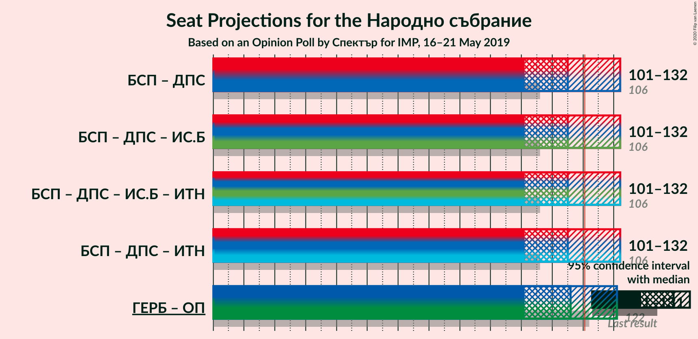

### Confidence Intervals

| Coalition | Last Result | Median | Majority? | 80% Confidence Interval | 90% Confidence Interval | 95% Confidence Interval | 99% Confidence Interval |
|:---------:|:-----------:|:------:|:---------:|:-----------------------:|:-----------------------:|:-----------------------:|:-----------------------:|
| Българска социалистическа партия – Движение за права и свободи | 106 | 115 | 28% | 106–125 | 104–130 | 101–132 | 96–136 |
| Граждани за европейско развитие на България – Обединени Патриоти | 122 | 116 | 26% | 107–126 | 104–129 | 101–131 | 97–137 |

### Българска социалистическа партия – Движение за права и свободи

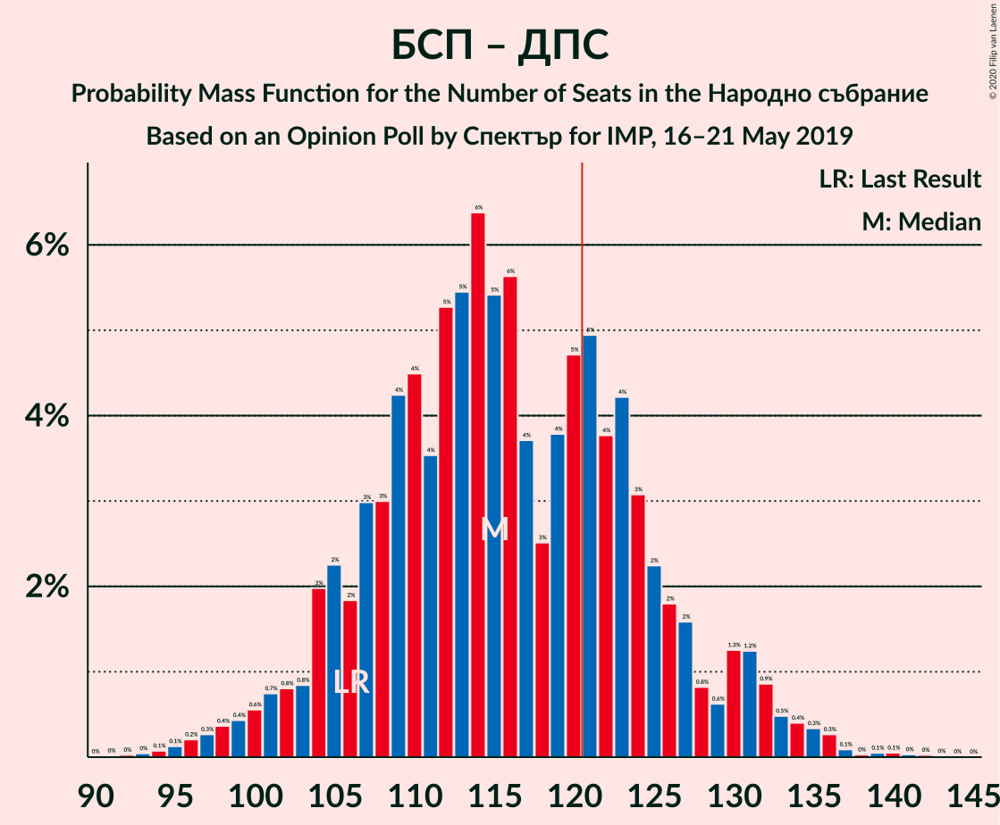

| Number of Seats | Probability | Accumulated | Special Marks |
|:---------------:|:-----------:|:-----------:|:-------------:|
| 92 | 0% | 100% |  |
| 93 | 0% | 99.9% |  |
| 94 | 0.1% | 99.9% |  |
| 95 | 0.1% | 99.8% |  |
| 96 | 0.2% | 99.7% |  |
| 97 | 0.3% | 99.5% |  |
| 98 | 0.4% | 99.2% |  |
| 99 | 0.4% | 98.8% |  |
| 100 | 0.6% | 98% |  |
| 101 | 0.7% | 98% |  |
| 102 | 0.8% | 97% |  |
| 103 | 0.8% | 96% |  |
| 104 | 2% | 95% |  |
| 105 | 2% | 93% |  |
| 106 | 2% | 91% | Last Result |
| 107 | 3% | 89% |  |
| 108 | 3% | 86% |  |
| 109 | 4% | 83% |  |
| 110 | 4% | 79% |  |
| 111 | 4% | 75% |  |
| 112 | 5% | 71% |  |
| 113 | 5% | 66% |  |
| 114 | 6% | 60% |  |
| 115 | 5% | 54% |  |
| 116 | 6% | 49% | Median |
| 117 | 4% | 43% |  |
| 118 | 3% | 39% |  |
| 119 | 4% | 37% |  |
| 120 | 5% | 33% |  |
| 121 | 5% | 28% | Majority |
| 122 | 4% | 23% |  |
| 123 | 4% | 20% |  |
| 124 | 3% | 15% |  |
| 125 | 2% | 12% |  |
| 126 | 2% | 10% |  |
| 127 | 2% | 8% |  |
| 128 | 0.8% | 7% |  |
| 129 | 0.6% | 6% |  |
| 130 | 1.3% | 5% |  |
| 131 | 1.2% | 4% |  |
| 132 | 0.9% | 3% |  |
| 133 | 0.5% | 2% |  |
| 134 | 0.4% | 1.3% |  |
| 135 | 0.3% | 0.9% |  |
| 136 | 0.3% | 0.6% |  |
| 137 | 0.1% | 0.3% |  |
| 138 | 0% | 0.2% |  |
| 139 | 0.1% | 0.2% |  |
| 140 | 0.1% | 0.1% |  |
| 141 | 0% | 0.1% |  |
| 142 | 0% | 0.1% |  |
| 143 | 0% | 0% |  |

### Граждани за европейско развитие на България – Обединени Патриоти

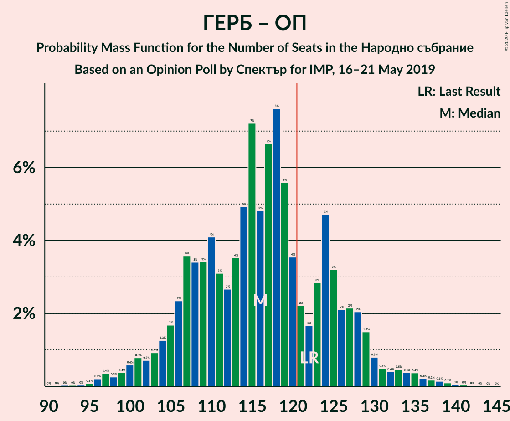

| Number of Seats | Probability | Accumulated | Special Marks |
|:---------------:|:-----------:|:-----------:|:-------------:|
| 92 | 0% | 100% |  |
| 93 | 0% | 99.9% |  |
| 94 | 0% | 99.9% |  |
| 95 | 0.1% | 99.9% |  |
| 96 | 0.2% | 99.8% |  |
| 97 | 0.4% | 99.6% |  |
| 98 | 0.3% | 99.2% |  |
| 99 | 0.4% | 99.0% |  |
| 100 | 0.6% | 98.6% |  |
| 101 | 0.8% | 98% |  |
| 102 | 0.7% | 97% |  |
| 103 | 0.9% | 96% |  |
| 104 | 1.3% | 96% |  |
| 105 | 2% | 94% |  |
| 106 | 2% | 93% |  |
| 107 | 4% | 90% |  |
| 108 | 3% | 87% |  |
| 109 | 3% | 83% |  |
| 110 | 4% | 80% |  |
| 111 | 3% | 76% |  |
| 112 | 3% | 73% |  |
| 113 | 4% | 70% |  |
| 114 | 5% | 66% |  |
| 115 | 7% | 62% |  |
| 116 | 5% | 54% | Median |
| 117 | 7% | 50% |  |
| 118 | 8% | 43% |  |
| 119 | 6% | 35% |  |
| 120 | 4% | 30% |  |
| 121 | 2% | 26% | Majority |
| 122 | 2% | 24% | Last Result |
| 123 | 3% | 22% |  |
| 124 | 5% | 19% |  |
| 125 | 3% | 15% |  |
| 126 | 2% | 11% |  |
| 127 | 2% | 9% |  |
| 128 | 2% | 7% |  |
| 129 | 1.5% | 5% |  |
| 130 | 0.8% | 4% |  |
| 131 | 0.5% | 3% |  |
| 132 | 0.4% | 2% |  |
| 133 | 0.5% | 2% |  |
| 134 | 0.4% | 2% |  |
| 135 | 0.4% | 1.1% |  |
| 136 | 0.2% | 0.8% |  |
| 137 | 0.2% | 0.5% |  |
| 138 | 0.1% | 0.4% |  |
| 139 | 0.1% | 0.2% |  |
| 140 | 0% | 0.1% |  |
| 141 | 0% | 0.1% |  |
| 142 | 0% | 0% |  |

## Technical Information

### Opinion Poll

+ **Polling firm:** Спектър
+ **Commissioner(s):** IMP
+ **Fieldwork period:** 16–21 May 2019

### Calculations

+ **Sample size:** 335
+ **Simulations done:** 131,072
+ **Error estimate:** 3.25%

