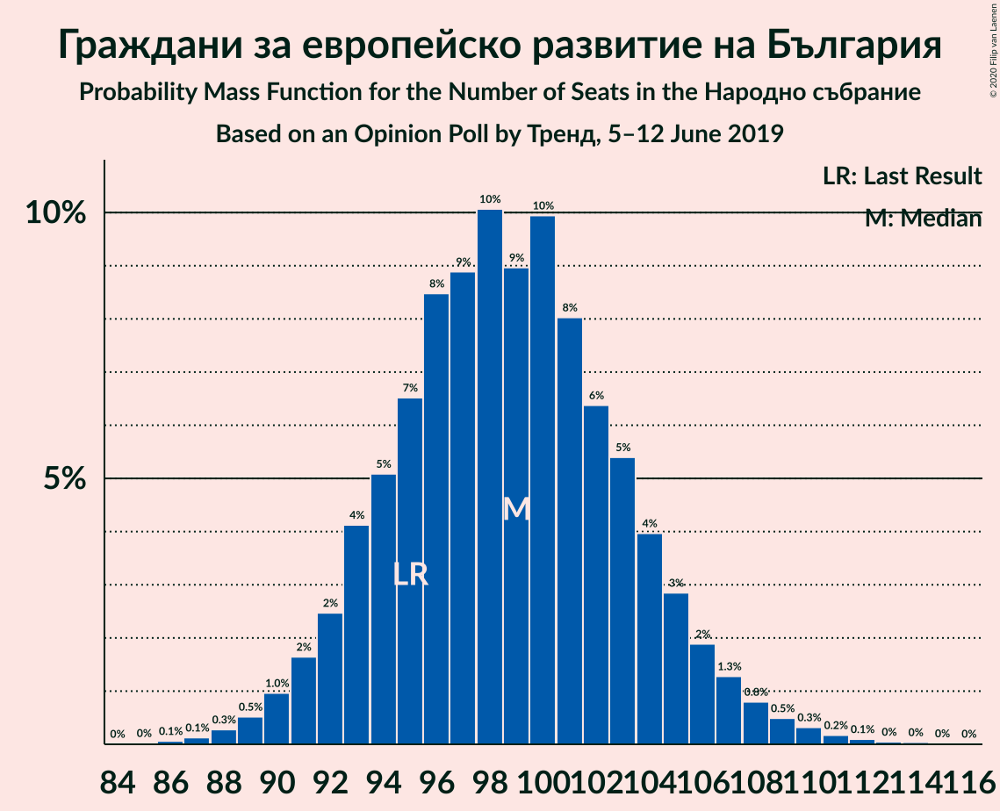
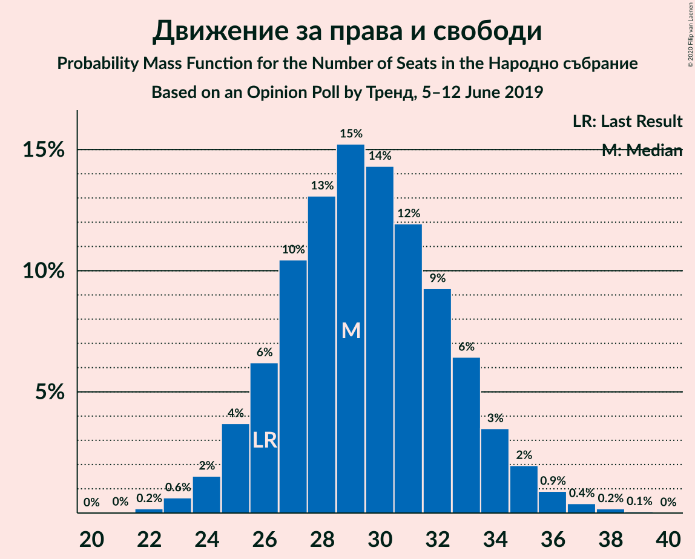

# Opinion Poll by Тренд, 5–12 June 2019

<a href="#voting-intentions">Voting Intentions</a> | <a href="#seats">Seats</a> | <a href="#coalitions">Coalitions</a> | <a href="#technical-information">Technical Information</a>

## Voting Intentions

### Confidence Intervals

| Party | Last Result | Poll Result | 80% Confidence Interval | 90% Confidence Interval | 95% Confidence Interval | 99% Confidence Interval |
|:-----:|:-----------:|:-----------:|:-----------------------:|:-----------------------:|:-----------------------:|:-----------------------:|
| Граждани за европейско развитие на България | 33.5% | 36.7% | 34.8–38.7% |34.2–39.2% |33.8–39.7% |32.9–40.7% |
| Българска социалистическа партия | 27.9% | 29.1% | 27.3–31.0% |26.8–31.5% |26.3–32.0% |25.5–32.9% |
| Движение за права и свободи | 9.2% | 10.9% | 9.7–12.3% |9.4–12.7% |9.1–13.0% |8.6–13.7% |
| Обединени Патриоти | 9.3% | 7.4% | 6.5–8.6% |6.2–8.9% |6.0–9.2% |5.5–9.8% |
| Демократична България | 0.0% | 5.1% | 4.3–6.1% |4.1–6.3% |3.9–6.6% |3.5–7.1% |
| Воля | 4.3% | 2.0% | 1.5–2.7% |1.4–2.9% |1.3–3.0% |1.1–3.4% |

*Note:* The poll result column reflects the actual value used in the calculations. Published results may vary slightly, and in addition be rounded to fewer digits.

## Seats

### Confidence Intervals

| Party | Last Result | Median | 80% Confidence Interval | 90% Confidence Interval | 95% Confidence Interval | 99% Confidence Interval |
|:-----:|:-----------:|:------:|:-----------------------:|:-----------------------:|:-----------------------:|:-----------------------:|
| <a href="#граждани-за-европейско-развитие-на-българия">Граждани за европейско развитие на България</a> | 95 | 99 | 93–104 |92–106 |91–107 |88–110 |
| <a href="#българска-социалистическа-партия">Българска социалистическа партия</a> | 80 | 78 | 73–83 |72–85 |71–86 |69–89 |
| <a href="#движение-за-права-и-свободи">Движение за права и свободи</a> | 26 | 29 | 26–33 |25–34 |25–35 |23–37 |
| <a href="#обединени-патриоти">Обединени Патриоти</a> | 27 | 20 | 17–23 |17–24 |16–25 |15–26 |
| <a href="#демократична-българия">Демократична България</a> | 0 | 14 | 11–16 |11–17 |0–18 |0–19 |
| <a href="#воля">Воля</a> | 12 | 0 | 0 |0 |0 |0 |

### Граждани за европейско развитие на България

*For a full overview of the results for this party, see the [Граждани за европейско развитие на България](party-гражданизаевропейскоразвитиенабългария.html) page.*

| Number of Seats | Probability | Accumulated | Special Marks |
|:---------------:|:-----------:|:-----------:|:-------------:|
| 86 | 0.1% | 100% |  |
| 87 | 0.1% | 99.9% |  |
| 88 | 0.3% | 99.8% |  |
| 89 | 0.5% | 99.5% |  |
| 90 | 1.0% | 99.0% |  |
| 91 | 2% | 98% |  |
| 92 | 2% | 96% |  |
| 93 | 4% | 94% |  |
| 94 | 5% | 90% |  |
| 95 | 7% | 85% | Last Result |
| 96 | 8% | 78% |  |
| 97 | 9% | 70% |  |
| 98 | 10% | 61% |  |
| 99 | 9% | 51% | Median |
| 100 | 10% | 42% |  |
| 101 | 8% | 32% |  |
| 102 | 6% | 24% |  |
| 103 | 5% | 17% |  |
| 104 | 4% | 12% |  |
| 105 | 3% | 8% |  |
| 106 | 2% | 5% |  |
| 107 | 1.3% | 3% |  |
| 108 | 0.8% | 2% |  |
| 109 | 0.5% | 1.2% |  |
| 110 | 0.3% | 0.7% |  |
| 111 | 0.2% | 0.4% |  |
| 112 | 0.1% | 0.2% |  |
| 113 | 0% | 0.1% |  |
| 114 | 0% | 0.1% |  |
| 115 | 0% | 0% |  |

### Българска социалистическа партия

*For a full overview of the results for this party, see the [Българска социалистическа партия](party-българскасоциалистическапартия.html) page.*

| Number of Seats | Probability | Accumulated | Special Marks |
|:---------------:|:-----------:|:-----------:|:-------------:|
| 66 | 0.1% | 100% |  |
| 67 | 0.1% | 99.9% |  |
| 68 | 0.3% | 99.8% |  |
| 69 | 0.5% | 99.6% |  |
| 70 | 1.1% | 99.0% |  |
| 71 | 2% | 98% |  |
| 72 | 3% | 96% |  |
| 73 | 4% | 93% |  |
| 74 | 6% | 89% |  |
| 75 | 7% | 83% |  |
| 76 | 8% | 76% |  |
| 77 | 12% | 67% |  |
| 78 | 10% | 56% | Median |
| 79 | 10% | 46% |  |
| 80 | 9% | 36% | Last Result |
| 81 | 8% | 27% |  |
| 82 | 7% | 20% |  |
| 83 | 4% | 13% |  |
| 84 | 3% | 9% |  |
| 85 | 2% | 6% |  |
| 86 | 1.5% | 3% |  |
| 87 | 0.8% | 2% |  |
| 88 | 0.5% | 1.1% |  |
| 89 | 0.3% | 0.6% |  |
| 90 | 0.2% | 0.3% |  |
| 91 | 0.1% | 0.2% |  |
| 92 | 0% | 0.1% |  |
| 93 | 0% | 0% |  |

### Движение за права и свободи

*For a full overview of the results for this party, see the [Движение за права и свободи](party-движениезаправаисвободи.html) page.*

| Number of Seats | Probability | Accumulated | Special Marks |
|:---------------:|:-----------:|:-----------:|:-------------:|
| 22 | 0.2% | 100% |  |
| 23 | 0.6% | 99.8% |  |
| 24 | 2% | 99.1% |  |
| 25 | 4% | 98% |  |
| 26 | 6% | 94% | Last Result |
| 27 | 10% | 88% |  |
| 28 | 13% | 77% |  |
| 29 | 15% | 64% | Median |
| 30 | 14% | 49% |  |
| 31 | 12% | 35% |  |
| 32 | 9% | 23% |  |
| 33 | 6% | 13% |  |
| 34 | 3% | 7% |  |
| 35 | 2% | 4% |  |
| 36 | 0.9% | 2% |  |
| 37 | 0.4% | 0.7% |  |
| 38 | 0.2% | 0.3% |  |
| 39 | 0.1% | 0.1% |  |
| 40 | 0% | 0% |  |

### Обединени Патриоти

*For a full overview of the results for this party, see the [Обединени Патриоти](party-обединенипатриоти.html) page.*

| Number of Seats | Probability | Accumulated | Special Marks |
|:---------------:|:-----------:|:-----------:|:-------------:|
| 14 | 0.2% | 100% |  |
| 15 | 1.0% | 99.7% |  |
| 16 | 3% | 98.8% |  |
| 17 | 7% | 96% |  |
| 18 | 12% | 89% |  |
| 19 | 16% | 77% |  |
| 20 | 18% | 61% | Median |
| 21 | 15% | 43% |  |
| 22 | 13% | 28% |  |
| 23 | 7% | 15% |  |
| 24 | 4% | 8% |  |
| 25 | 2% | 3% |  |
| 26 | 0.8% | 1.3% |  |
| 27 | 0.3% | 0.5% | Last Result |
| 28 | 0.1% | 0.1% |  |
| 29 | 0% | 0% |  |

### Демократична България

*For a full overview of the results for this party, see the [Демократична България](party-демократичнабългария.html) page.*

| Number of Seats | Probability | Accumulated | Special Marks |
|:---------------:|:-----------:|:-----------:|:-------------:|
| 0 | 4% | 100% | Last Result |
| 1 | 0% | 96% |  |
| 2 | 0% | 96% |  |
| 3 | 0% | 96% |  |
| 4 | 0% | 96% |  |
| 5 | 0% | 96% |  |
| 6 | 0% | 96% |  |
| 7 | 0% | 96% |  |
| 8 | 0% | 96% |  |
| 9 | 0% | 96% |  |
| 10 | 0% | 96% |  |
| 11 | 6% | 96% |  |
| 12 | 14% | 90% |  |
| 13 | 20% | 76% |  |
| 14 | 21% | 55% | Median |
| 15 | 16% | 35% |  |
| 16 | 10% | 18% |  |
| 17 | 5% | 8% |  |
| 18 | 2% | 3% |  |
| 19 | 0.7% | 1.0% |  |
| 20 | 0.2% | 0.3% |  |
| 21 | 0.1% | 0.1% |  |
| 22 | 0% | 0% |  |

### Воля

*For a full overview of the results for this party, see the [Воля](party-воля.html) page.*

| Number of Seats | Probability | Accumulated | Special Marks |
|:---------------:|:-----------:|:-----------:|:-------------:|
| 0 | 100% | 100% | Median |
| 1 | 0% | 0% |  |
| 2 | 0% | 0% |  |
| 3 | 0% | 0% |  |
| 4 | 0% | 0% |  |
| 5 | 0% | 0% |  |
| 6 | 0% | 0% |  |
| 7 | 0% | 0% |  |
| 8 | 0% | 0% |  |
| 9 | 0% | 0% |  |
| 10 | 0% | 0% |  |
| 11 | 0% | 0% |  |
| 12 | 0% | 0% | Last Result |

## Coalitions

### Confidence Intervals

| Coalition | Last Result | Median | Majority? | 80% Confidence Interval | 90% Confidence Interval | 95% Confidence Interval | 99% Confidence Interval |
|:---------:|:-----------:|:------:|:---------:|:-----------------------:|:-----------------------:|:-----------------------:|:-----------------------:|
| Граждани за европейско развитие на България – Обединени Патриоти | 122 | 119 | 32% | 113–124 | 112–126 | 111–128 | 108–131 |
| Българска социалистическа партия – Движение за права и свободи | 106 | 108 | 0.3% | 102–113 | 101–115 | 100–116 | 97–119 |

### Граждани за европейско развитие на България – Обединени Патриоти

| Number of Seats | Probability | Accumulated | Special Marks |
|:---------------:|:-----------:|:-----------:|:-------------:|
| 105 | 0% | 100% |  |
| 106 | 0% | 99.9% |  |
| 107 | 0.1% | 99.9% |  |
| 108 | 0.4% | 99.8% |  |
| 109 | 0.6% | 99.4% |  |
| 110 | 0.6% | 98.8% |  |
| 111 | 2% | 98% |  |
| 112 | 4% | 97% |  |
| 113 | 4% | 93% |  |
| 114 | 3% | 89% |  |
| 115 | 7% | 87% |  |
| 116 | 11% | 80% |  |
| 117 | 8% | 69% |  |
| 118 | 5% | 61% |  |
| 119 | 12% | 56% | Median |
| 120 | 12% | 44% |  |
| 121 | 6% | 32% | Majority |
| 122 | 5% | 25% | Last Result |
| 123 | 7% | 21% |  |
| 124 | 5% | 13% |  |
| 125 | 2% | 9% |  |
| 126 | 2% | 6% |  |
| 127 | 2% | 5% |  |
| 128 | 0.9% | 3% |  |
| 129 | 0.4% | 2% |  |
| 130 | 0.6% | 1.2% |  |
| 131 | 0.3% | 0.6% |  |
| 132 | 0.1% | 0.4% |  |
| 133 | 0.1% | 0.3% |  |
| 134 | 0.1% | 0.2% |  |
| 135 | 0% | 0.1% |  |
| 136 | 0% | 0% |  |

### Българска социалистическа партия – Движение за права и свободи

| Number of Seats | Probability | Accumulated | Special Marks |
|:---------------:|:-----------:|:-----------:|:-------------:|
| 95 | 0.1% | 100% |  |
| 96 | 0.1% | 99.9% |  |
| 97 | 0.3% | 99.7% |  |
| 98 | 0.6% | 99.4% |  |
| 99 | 1.0% | 98.8% |  |
| 100 | 2% | 98% |  |
| 101 | 2% | 96% |  |
| 102 | 4% | 94% |  |
| 103 | 5% | 90% |  |
| 104 | 6% | 84% |  |
| 105 | 8% | 78% |  |
| 106 | 9% | 70% | Last Result |
| 107 | 11% | 61% | Median |
| 108 | 9% | 50% |  |
| 109 | 8% | 41% |  |
| 110 | 8% | 33% |  |
| 111 | 8% | 25% |  |
| 112 | 5% | 17% |  |
| 113 | 4% | 13% |  |
| 114 | 3% | 9% |  |
| 115 | 2% | 6% |  |
| 116 | 1.1% | 3% |  |
| 117 | 0.9% | 2% |  |
| 118 | 0.6% | 1.5% |  |
| 119 | 0.4% | 0.8% |  |
| 120 | 0.1% | 0.5% |  |
| 121 | 0.1% | 0.3% | Majority |
| 122 | 0.1% | 0.2% |  |
| 123 | 0% | 0.1% |  |
| 124 | 0% | 0% |  |

## Technical Information

### Opinion Poll

+ **Polling firm:** Тренд
+ **Commissioner(s):** —
+ **Fieldwork period:** 5–12 June 2019

### Calculations

+ **Sample size:** 1008
+ **Simulations done:** 1,048,576
+ **Error estimate:** 1.65%

