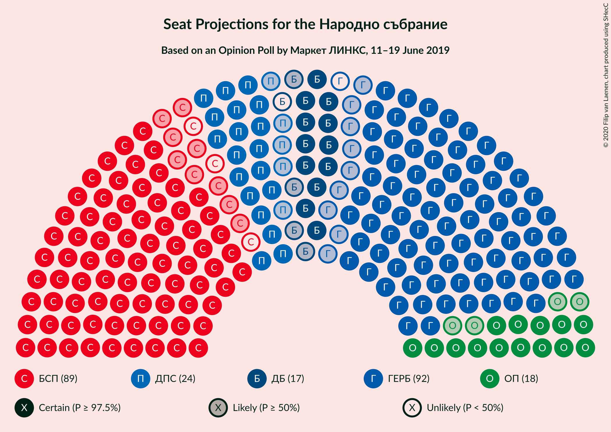
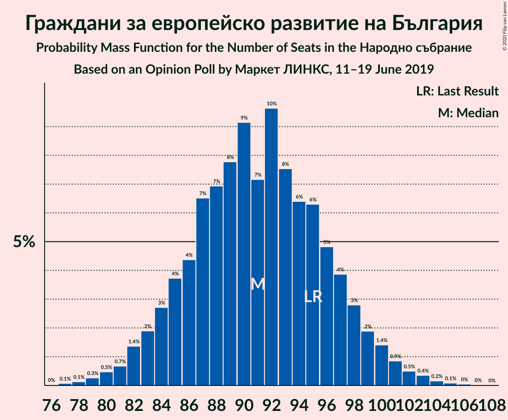
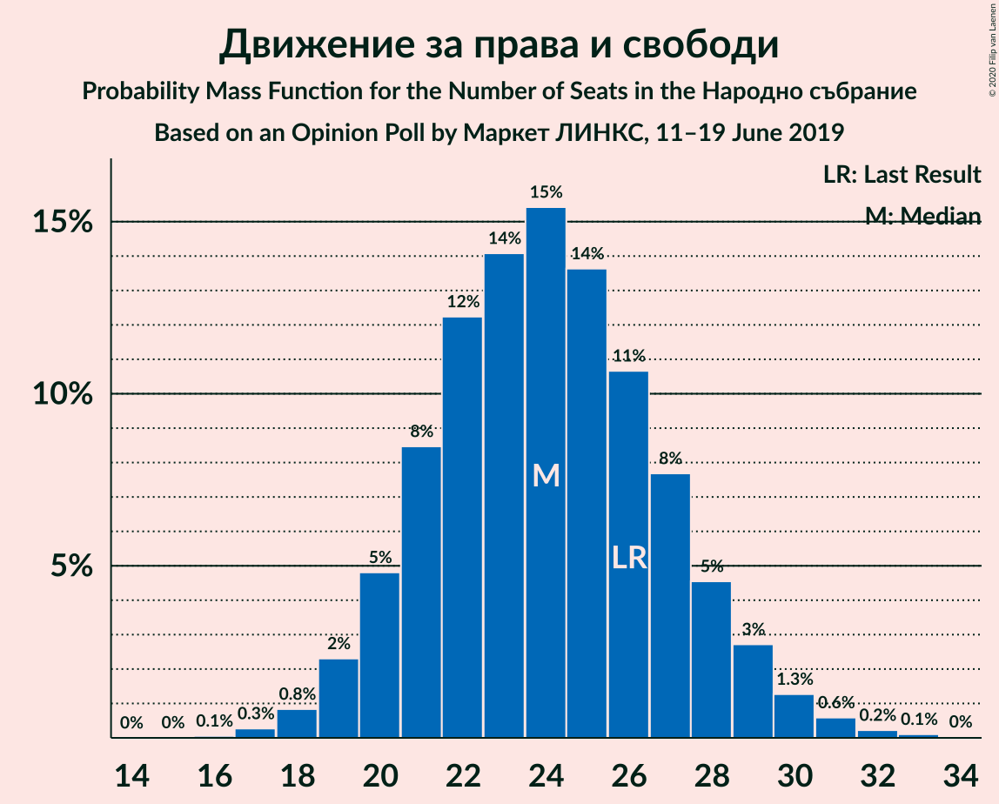
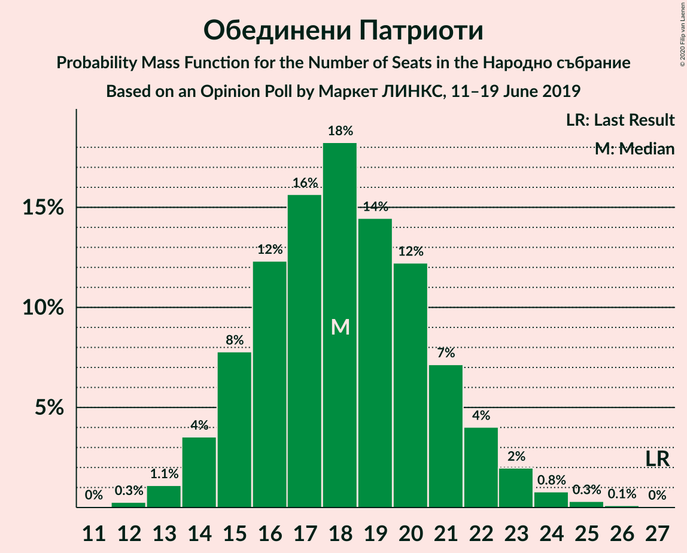
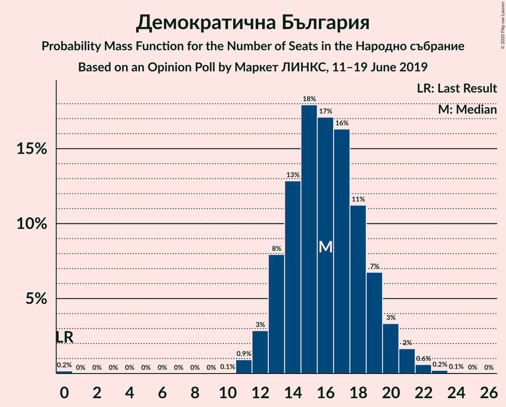
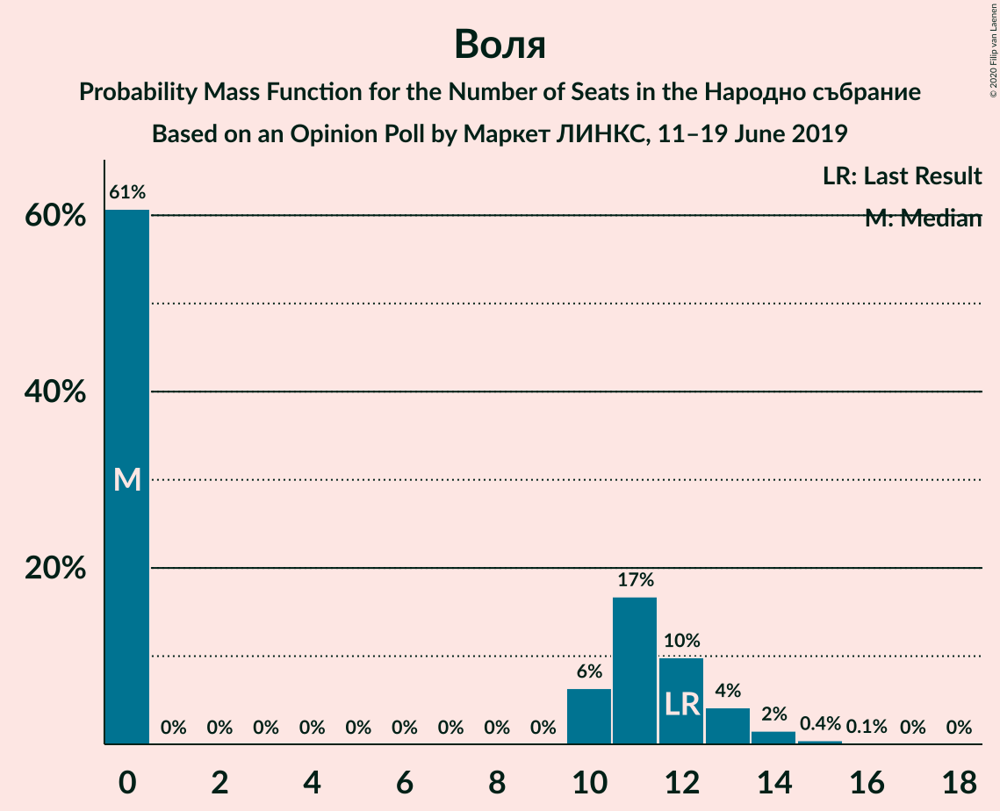
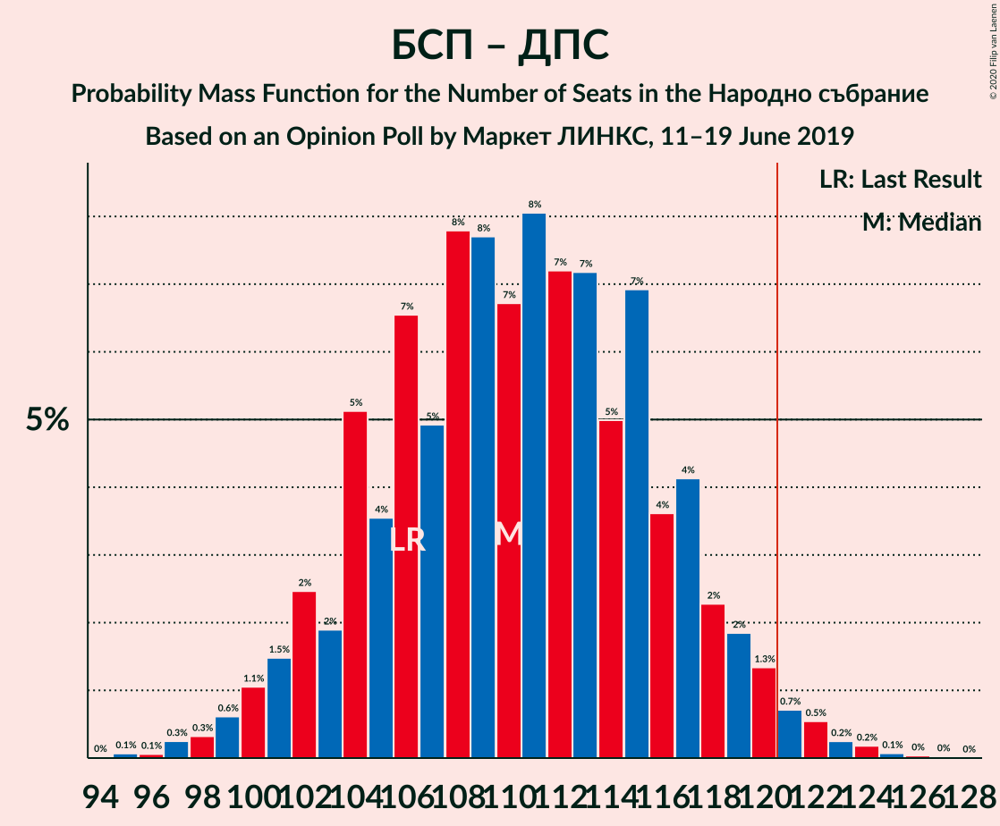

# Opinion Poll by Маркет ЛИНКС, 11–19 June 2019

<a href="#voting-intentions">Voting Intentions</a> | <a href="#seats">Seats</a> | <a href="#coalitions">Coalitions</a> | <a href="#technical-information">Technical Information</a>

## Voting Intentions

### Confidence Intervals

| Party | Last Result | Poll Result | 80% Confidence Interval | 90% Confidence Interval | 95% Confidence Interval | 99% Confidence Interval |
|:-----:|:-----------:|:-----------:|:-----------------------:|:-----------------------:|:-----------------------:|:-----------------------:|
| Граждани за европейско развитие на България | 33.5% | 34.9% | 32.8–37.0% |32.3–37.6% |31.8–38.1% |30.8–39.1% |
| Българска социалистическа партия | 27.9% | 33.0% | 31.0–35.1% |30.5–35.7% |30.0–36.2% |29.1–37.2% |
| Движение за права и свободи | 9.2% | 9.1% | 8.0–10.5% |7.7–10.9% |7.4–11.2% |6.9–11.9% |
| Обединени Патриоти | 9.3% | 6.8% | 5.9–8.1% |5.6–8.4% |5.3–8.7% |4.9–9.3% |
| Демократична България | 0.0% | 6.0% | 5.1–7.2% |4.9–7.5% |4.6–7.8% |4.2–8.4% |
| Воля | 4.3% | 3.8% | 3.0–4.7% |2.9–5.0% |2.7–5.2% |2.4–5.7% |

*Note:* The poll result column reflects the actual value used in the calculations. Published results may vary slightly, and in addition be rounded to fewer digits.

## Seats

### Confidence Intervals

| Party | Last Result | Median | 80% Confidence Interval | 90% Confidence Interval | 95% Confidence Interval | 99% Confidence Interval |
|:-----:|:-----------:|:------:|:-----------------------:|:-----------------------:|:-----------------------:|:-----------------------:|
| <a href="#граждани-за-европейско-развитие-на-българия">Граждани за европейско развитие на България</a> | 95 | 91 | 85–97 |84–99 |82–100 |79–103 |
| <a href="#българска-социалистическа-партия">Българска социалистическа партия</a> | 80 | 86 | 80–92 |79–94 |77–95 |75–98 |
| <a href="#движение-за-права-и-свободи">Движение за права и свободи</a> | 26 | 24 | 21–27 |20–28 |19–29 |18–31 |
| <a href="#обединени-патриоти">Обединени Патриоти</a> | 27 | 18 | 15–21 |15–22 |14–23 |13–24 |
| <a href="#демократична-българия">Демократична България</a> | 0 | 16 | 13–19 |13–20 |12–21 |11–22 |
| <a href="#воля">Воля</a> | 12 | 0 | 0–12 |0–13 |0–13 |0–15 |

### Граждани за европейско развитие на България

*For a full overview of the results for this party, see the [Граждани за европейско развитие на България](party-гражданизаевропейскоразвитиенабългария.html) page.*

| Number of Seats | Probability | Accumulated | Special Marks |
|:---------------:|:-----------:|:-----------:|:-------------:|
| 77 | 0.1% | 100% |  |
| 78 | 0.1% | 99.9% |  |
| 79 | 0.3% | 99.7% |  |
| 80 | 0.5% | 99.5% |  |
| 81 | 0.7% | 99.0% |  |
| 82 | 1.4% | 98% |  |
| 83 | 2% | 97% |  |
| 84 | 3% | 95% |  |
| 85 | 4% | 92% |  |
| 86 | 4% | 89% |  |
| 87 | 7% | 84% |  |
| 88 | 7% | 78% |  |
| 89 | 8% | 71% |  |
| 90 | 9% | 63% |  |
| 91 | 7% | 54% | Median |
| 92 | 10% | 47% |  |
| 93 | 8% | 37% |  |
| 94 | 6% | 30% |  |
| 95 | 6% | 23% | Last Result |
| 96 | 5% | 17% |  |
| 97 | 4% | 12% |  |
| 98 | 3% | 8% |  |
| 99 | 2% | 5% |  |
| 100 | 1.4% | 3% |  |
| 101 | 0.9% | 2% |  |
| 102 | 0.5% | 1.2% |  |
| 103 | 0.4% | 0.7% |  |
| 104 | 0.2% | 0.3% |  |
| 105 | 0.1% | 0.2% |  |
| 106 | 0% | 0.1% |  |
| 107 | 0% | 0% |  |

### Българска социалистическа партия

*For a full overview of the results for this party, see the [Българска социалистическа партия](party-българскасоциалистическапартия.html) page.*

| Number of Seats | Probability | Accumulated | Special Marks |
|:---------------:|:-----------:|:-----------:|:-------------:|
| 72 | 0% | 100% |  |
| 73 | 0.1% | 99.9% |  |
| 74 | 0.2% | 99.8% |  |
| 75 | 0.3% | 99.6% |  |
| 76 | 0.6% | 99.3% |  |
| 77 | 1.3% | 98.8% |  |
| 78 | 2% | 97% |  |
| 79 | 2% | 96% |  |
| 80 | 4% | 93% | Last Result |
| 81 | 5% | 90% |  |
| 82 | 6% | 84% |  |
| 83 | 7% | 79% |  |
| 84 | 8% | 72% |  |
| 85 | 8% | 64% |  |
| 86 | 8% | 57% | Median |
| 87 | 9% | 49% |  |
| 88 | 7% | 40% |  |
| 89 | 7% | 32% |  |
| 90 | 7% | 25% |  |
| 91 | 5% | 19% |  |
| 92 | 4% | 13% |  |
| 93 | 3% | 9% |  |
| 94 | 2% | 6% |  |
| 95 | 1.4% | 4% |  |
| 96 | 0.9% | 2% |  |
| 97 | 0.7% | 1.3% |  |
| 98 | 0.4% | 0.7% |  |
| 99 | 0.1% | 0.3% |  |
| 100 | 0.1% | 0.2% |  |
| 101 | 0.1% | 0.1% |  |
| 102 | 0% | 0% |  |

### Движение за права и свободи

*For a full overview of the results for this party, see the [Движение за права и свободи](party-движениезаправаисвободи.html) page.*

| Number of Seats | Probability | Accumulated | Special Marks |
|:---------------:|:-----------:|:-----------:|:-------------:|
| 16 | 0.1% | 100% |  |
| 17 | 0.3% | 99.9% |  |
| 18 | 0.8% | 99.7% |  |
| 19 | 2% | 98.8% |  |
| 20 | 5% | 97% |  |
| 21 | 8% | 92% |  |
| 22 | 12% | 83% |  |
| 23 | 14% | 71% |  |
| 24 | 15% | 57% | Median |
| 25 | 14% | 41% |  |
| 26 | 11% | 28% | Last Result |
| 27 | 8% | 17% |  |
| 28 | 5% | 10% |  |
| 29 | 3% | 5% |  |
| 30 | 1.3% | 2% |  |
| 31 | 0.6% | 1.0% |  |
| 32 | 0.2% | 0.4% |  |
| 33 | 0.1% | 0.1% |  |
| 34 | 0% | 0% |  |

### Обединени Патриоти

*For a full overview of the results for this party, see the [Обединени Патриоти](party-обединенипатриоти.html) page.*

| Number of Seats | Probability | Accumulated | Special Marks |
|:---------------:|:-----------:|:-----------:|:-------------:|
| 12 | 0.3% | 100% |  |
| 13 | 1.1% | 99.7% |  |
| 14 | 4% | 98.6% |  |
| 15 | 8% | 95% |  |
| 16 | 12% | 87% |  |
| 17 | 16% | 75% |  |
| 18 | 18% | 59% | Median |
| 19 | 14% | 41% |  |
| 20 | 12% | 27% |  |
| 21 | 7% | 14% |  |
| 22 | 4% | 7% |  |
| 23 | 2% | 3% |  |
| 24 | 0.8% | 1.2% |  |
| 25 | 0.3% | 0.5% |  |
| 26 | 0.1% | 0.1% |  |
| 27 | 0% | 0% | Last Result |

### Демократична България

*For a full overview of the results for this party, see the [Демократична България](party-демократичнабългария.html) page.*

| Number of Seats | Probability | Accumulated | Special Marks |
|:---------------:|:-----------:|:-----------:|:-------------:|
| 0 | 0.2% | 100% | Last Result |
| 1 | 0% | 99.8% |  |
| 2 | 0% | 99.8% |  |
| 3 | 0% | 99.8% |  |
| 4 | 0% | 99.8% |  |
| 5 | 0% | 99.8% |  |
| 6 | 0% | 99.8% |  |
| 7 | 0% | 99.8% |  |
| 8 | 0% | 99.8% |  |
| 9 | 0% | 99.8% |  |
| 10 | 0.1% | 99.8% |  |
| 11 | 0.9% | 99.8% |  |
| 12 | 3% | 98.9% |  |
| 13 | 8% | 96% |  |
| 14 | 13% | 88% |  |
| 15 | 18% | 75% |  |
| 16 | 17% | 57% | Median |
| 17 | 16% | 40% |  |
| 18 | 11% | 24% |  |
| 19 | 7% | 13% |  |
| 20 | 3% | 6% |  |
| 21 | 2% | 3% |  |
| 22 | 0.6% | 0.9% |  |
| 23 | 0.2% | 0.3% |  |
| 24 | 0.1% | 0.1% |  |
| 25 | 0% | 0% |  |

### Воля

*For a full overview of the results for this party, see the [Воля](party-воля.html) page.*

| Number of Seats | Probability | Accumulated | Special Marks |
|:---------------:|:-----------:|:-----------:|:-------------:|
| 0 | 61% | 100% | Median |
| 1 | 0% | 39% |  |
| 2 | 0% | 39% |  |
| 3 | 0% | 39% |  |
| 4 | 0% | 39% |  |
| 5 | 0% | 39% |  |
| 6 | 0% | 39% |  |
| 7 | 0% | 39% |  |
| 8 | 0% | 39% |  |
| 9 | 0% | 39% |  |
| 10 | 6% | 39% |  |
| 11 | 17% | 33% |  |
| 12 | 10% | 16% | Last Result |
| 13 | 4% | 6% |  |
| 14 | 2% | 2% |  |
| 15 | 0.4% | 0.6% |  |
| 16 | 0.1% | 0.1% |  |
| 17 | 0% | 0% |  |

## Coalitions

### Confidence Intervals

| Coalition | Last Result | Median | Majority? | 80% Confidence Interval | 90% Confidence Interval | 95% Confidence Interval | 99% Confidence Interval |
|:---------:|:-----------:|:------:|:---------:|:-----------------------:|:-----------------------:|:-----------------------:|:-----------------------:|
| Българска социалистическа партия – Движение за права и свободи | 106 | 110 | 2% | 104–117 | 102–119 | 101–120 | 98–123 |
| Граждани за европейско развитие на България – Обединени Патриоти | 122 | 109 | 1.1% | 103–116 | 101–117 | 99–119 | 97–122 |

### Българска социалистическа партия – Движение за права и свободи

| Number of Seats | Probability | Accumulated | Special Marks |
|:---------------:|:-----------:|:-----------:|:-------------:|
| 95 | 0.1% | 100% |  |
| 96 | 0.1% | 99.9% |  |
| 97 | 0.3% | 99.8% |  |
| 98 | 0.3% | 99.6% |  |
| 99 | 0.6% | 99.3% |  |
| 100 | 1.1% | 98.7% |  |
| 101 | 1.5% | 98% |  |
| 102 | 2% | 96% |  |
| 103 | 2% | 94% |  |
| 104 | 5% | 92% |  |
| 105 | 4% | 87% |  |
| 106 | 7% | 83% | Last Result |
| 107 | 5% | 77% |  |
| 108 | 8% | 72% |  |
| 109 | 8% | 64% |  |
| 110 | 7% | 56% | Median |
| 111 | 8% | 49% |  |
| 112 | 7% | 41% |  |
| 113 | 7% | 34% |  |
| 114 | 5% | 27% |  |
| 115 | 7% | 22% |  |
| 116 | 4% | 15% |  |
| 117 | 4% | 11% |  |
| 118 | 2% | 7% |  |
| 119 | 2% | 5% |  |
| 120 | 1.3% | 3% |  |
| 121 | 0.7% | 2% | Majority |
| 122 | 0.5% | 1.1% |  |
| 123 | 0.2% | 0.6% |  |
| 124 | 0.2% | 0.3% |  |
| 125 | 0.1% | 0.1% |  |
| 126 | 0% | 0.1% |  |
| 127 | 0% | 0% |  |

### Граждани за европейско развитие на България – Обединени Патриоти

| Number of Seats | Probability | Accumulated | Special Marks |
|:---------------:|:-----------:|:-----------:|:-------------:|
| 94 | 0.1% | 100% |  |
| 95 | 0.1% | 99.9% |  |
| 96 | 0.2% | 99.8% |  |
| 97 | 0.3% | 99.6% |  |
| 98 | 0.5% | 99.3% |  |
| 99 | 1.4% | 98.8% |  |
| 100 | 2% | 97% |  |
| 101 | 1.3% | 96% |  |
| 102 | 2% | 94% |  |
| 103 | 4% | 92% |  |
| 104 | 6% | 87% |  |
| 105 | 5% | 81% |  |
| 106 | 5% | 76% |  |
| 107 | 7% | 71% |  |
| 108 | 10% | 64% |  |
| 109 | 7% | 54% | Median |
| 110 | 6% | 47% |  |
| 111 | 8% | 41% |  |
| 112 | 8% | 32% |  |
| 113 | 6% | 24% |  |
| 114 | 3% | 18% |  |
| 115 | 4% | 15% |  |
| 116 | 5% | 11% |  |
| 117 | 3% | 6% |  |
| 118 | 1.2% | 4% |  |
| 119 | 0.7% | 3% |  |
| 120 | 0.8% | 2% |  |
| 121 | 0.6% | 1.1% | Majority |
| 122 | 0.3% | 0.5% | Last Result |
| 123 | 0.1% | 0.2% |  |
| 124 | 0.1% | 0.1% |  |
| 125 | 0% | 0.1% |  |
| 126 | 0% | 0% |  |

## Technical Information

### Opinion Poll

+ **Polling firm:** Маркет ЛИНКС
+ **Commissioner(s):** —
+ **Fieldwork period:** 11–19 June 2019

### Calculations

+ **Sample size:** 878
+ **Simulations done:** 1,048,576
+ **Error estimate:** 1.46%

