# Opinion Poll by Алфа рисърч, 10–16 September 2019

<a href="#voting-intentions">Voting Intentions</a> | <a href="#seats">Seats</a> | <a href="#coalitions">Coalitions</a> | <a href="#technical-information">Technical Information</a>

## Voting Intentions

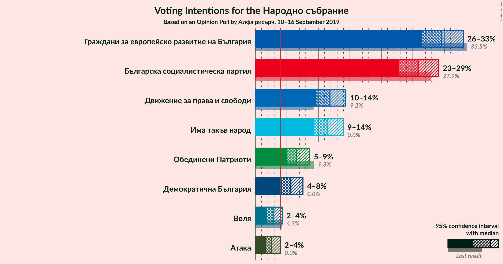

### Confidence Intervals

| Party | Last Result | Poll Result | 80% Confidence Interval | 90% Confidence Interval | 95% Confidence Interval | 99% Confidence Interval |
|:-----:|:-----------:|:-----------:|:-----------------------:|:-----------------------:|:-----------------------:|:-----------------------:|
| Граждани за европейско развитие на България | 33.5% | 29.6% | 27.5–31.8% |26.9–32.4% |26.4–33.0% |25.5–34.1% |
| Българска социалистическа партия | 27.9% | 25.8% | 23.9–28.0% |23.3–28.6% |22.8–29.1% |21.9–30.2% |
| Движение за права и свободи | 9.2% | 11.8% | 10.4–13.5% |10.0–14.0% |9.7–14.4% |9.1–15.2% |
| Има такъв народ | 0.0% | 11.4% | 10.1–13.1% |9.7–13.5% |9.3–13.9% |8.7–14.8% |
| Обединени Патриоти | 9.3% | 6.6% | 5.6–7.9% |5.3–8.3% |5.0–8.6% |4.6–9.3% |
| Демократична България | 0.0% | 5.7% | 4.7–6.9% |4.4–7.3% |4.2–7.6% |3.8–8.2% |
| Воля | 4.3% | 2.8% | 2.2–3.8% |2.0–4.1% |1.9–4.3% |1.6–4.8% |
| Атака | 0.0% | 2.6% | 2.0–3.5% |1.8–3.7% |1.6–4.0% |1.4–4.5% |

*Note:* The poll result column reflects the actual value used in the calculations. Published results may vary slightly, and in addition be rounded to fewer digits.

## Seats

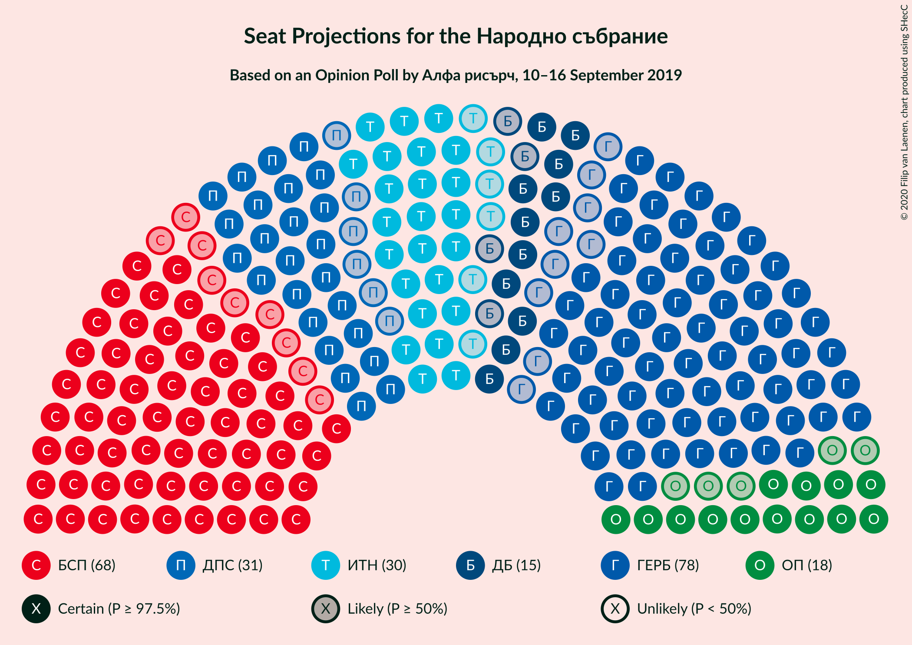

### Confidence Intervals

| Party | Last Result | Median | 80% Confidence Interval | 90% Confidence Interval | 95% Confidence Interval | 99% Confidence Interval |
|:-----:|:-----------:|:------:|:-----------------------:|:-----------------------:|:-----------------------:|:-----------------------:|
| <a href="#граждани-за-европейско-развитие-на-българия">Граждани за европейско развитие на България</a> | 95 | 78 | 72–84 |70–85 |69–87 |66–90 |
| <a href="#българска-социалистическа-партия">Българска социалистическа партия</a> | 80 | 68 | 62–74 |60–75 |59–77 |57–80 |
| <a href="#движение-за-права-и-свободи">Движение за права и свободи</a> | 26 | 32 | 27–34 |26–37 |26–38 |23–39 |
| <a href="#има-такъв-народ">Има такъв народ</a> | 0 | 31 | 27–34 |25–36 |25–37 |23–39 |
| <a href="#обединени-патриоти">Обединени Патриоти</a> | 27 | 18 | 14–21 |14–22 |13–22 |12–25 |
| <a href="#демократична-българия">Демократична България</a> | 0 | 15 | 12–18 |11–19 |11–20 |0–21 |
| <a href="#воля">Воля</a> | 12 | 0 | 0 |0–10 |0–11 |0–12 |
| <a href="#атака">Атака</a> | 0 | 0 | 0 |0 |0 |0–11 |

### Граждани за европейско развитие на България

*For a full overview of the results for this party, see the [Граждани за европейско развитие на България](party-гражданизаевропейскоразвитиенабългария.html) page.*

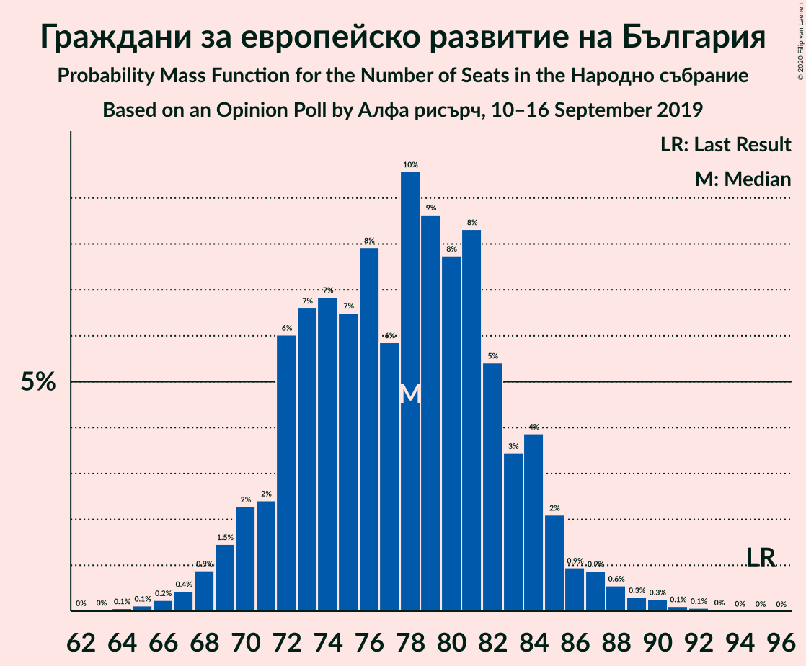

| Number of Seats | Probability | Accumulated | Special Marks |
|:---------------:|:-----------:|:-----------:|:-------------:|
| 63 | 0% | 100% |  |
| 64 | 0.1% | 99.9% |  |
| 65 | 0.2% | 99.9% |  |
| 66 | 0.2% | 99.7% |  |
| 67 | 0.3% | 99.4% |  |
| 68 | 1.0% | 99.1% |  |
| 69 | 0.9% | 98% |  |
| 70 | 3% | 97% |  |
| 71 | 2% | 94% |  |
| 72 | 8% | 92% |  |
| 73 | 4% | 84% |  |
| 74 | 3% | 80% |  |
| 75 | 12% | 77% |  |
| 76 | 7% | 65% |  |
| 77 | 7% | 58% |  |
| 78 | 8% | 51% | Median |
| 79 | 5% | 43% |  |
| 80 | 12% | 38% |  |
| 81 | 4% | 25% |  |
| 82 | 4% | 21% |  |
| 83 | 3% | 17% |  |
| 84 | 9% | 14% |  |
| 85 | 0.9% | 5% |  |
| 86 | 1.3% | 4% |  |
| 87 | 2% | 3% |  |
| 88 | 0.1% | 1.0% |  |
| 89 | 0.4% | 0.9% |  |
| 90 | 0.1% | 0.5% |  |
| 91 | 0.2% | 0.4% |  |
| 92 | 0.2% | 0.2% |  |
| 93 | 0% | 0% |  |
| 94 | 0% | 0% |  |
| 95 | 0% | 0% | Last Result |

### Българска социалистическа партия

*For a full overview of the results for this party, see the [Българска социалистическа партия](party-българскасоциалистическапартия.html) page.*

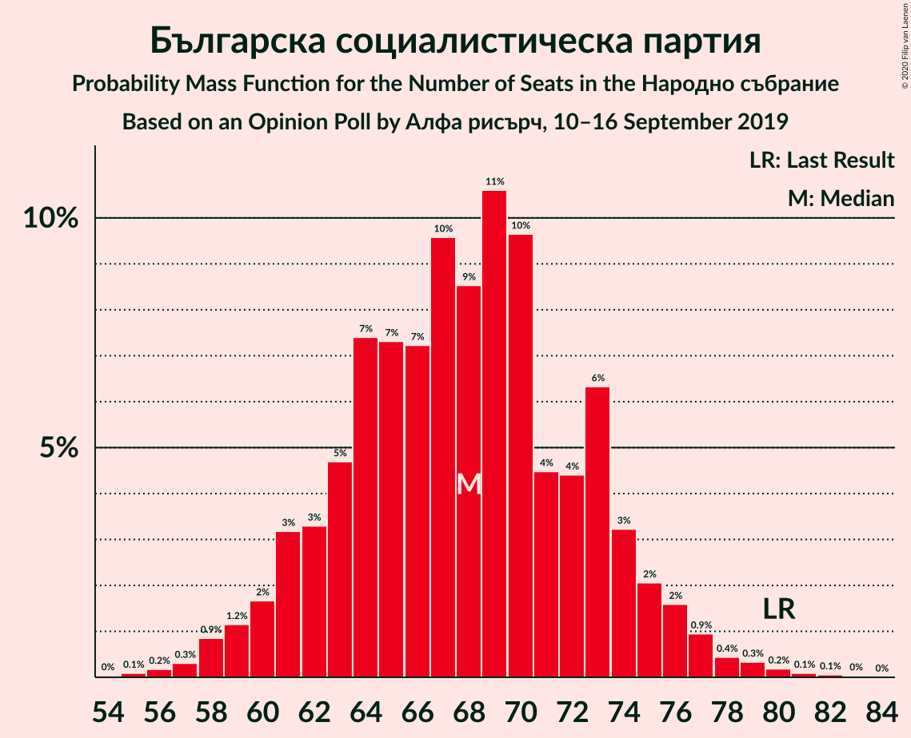

| Number of Seats | Probability | Accumulated | Special Marks |
|:---------------:|:-----------:|:-----------:|:-------------:|
| 54 | 0% | 100% |  |
| 55 | 0% | 99.9% |  |
| 56 | 0.2% | 99.9% |  |
| 57 | 0.5% | 99.7% |  |
| 58 | 0.2% | 99.2% |  |
| 59 | 2% | 99.0% |  |
| 60 | 2% | 97% |  |
| 61 | 1.0% | 95% |  |
| 62 | 13% | 94% |  |
| 63 | 6% | 81% |  |
| 64 | 1.0% | 75% |  |
| 65 | 6% | 74% |  |
| 66 | 15% | 67% |  |
| 67 | 2% | 53% |  |
| 68 | 7% | 51% | Median |
| 69 | 13% | 44% |  |
| 70 | 5% | 30% |  |
| 71 | 3% | 25% |  |
| 72 | 6% | 23% |  |
| 73 | 6% | 17% |  |
| 74 | 3% | 11% |  |
| 75 | 4% | 7% |  |
| 76 | 0.4% | 3% |  |
| 77 | 1.1% | 3% |  |
| 78 | 0.8% | 1.4% |  |
| 79 | 0.1% | 0.6% |  |
| 80 | 0.3% | 0.5% | Last Result |
| 81 | 0.1% | 0.2% |  |
| 82 | 0% | 0% |  |

### Движение за права и свободи

*For a full overview of the results for this party, see the [Движение за права и свободи](party-движениезаправаисвободи.html) page.*

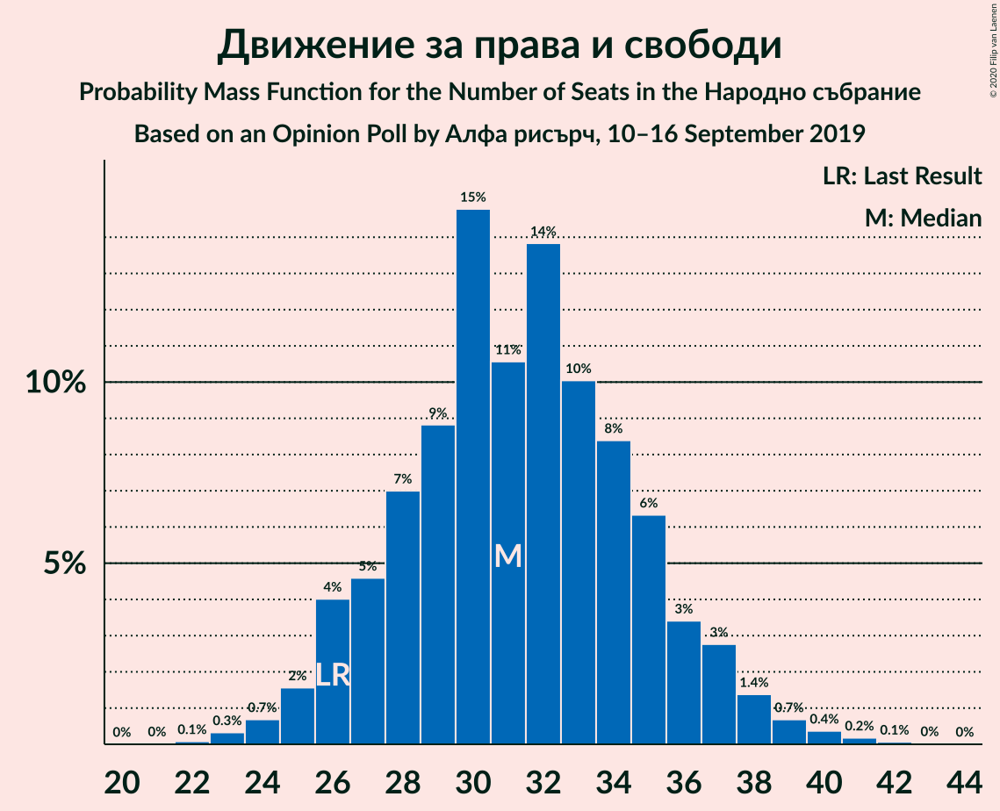

| Number of Seats | Probability | Accumulated | Special Marks |
|:---------------:|:-----------:|:-----------:|:-------------:|
| 22 | 0.1% | 100% |  |
| 23 | 0.7% | 99.8% |  |
| 24 | 0.5% | 99.2% |  |
| 25 | 0.6% | 98.7% |  |
| 26 | 6% | 98% | Last Result |
| 27 | 8% | 92% |  |
| 28 | 13% | 84% |  |
| 29 | 7% | 72% |  |
| 30 | 5% | 64% |  |
| 31 | 7% | 60% |  |
| 32 | 14% | 53% | Median |
| 33 | 20% | 39% |  |
| 34 | 10% | 19% |  |
| 35 | 1.5% | 9% |  |
| 36 | 0.9% | 7% |  |
| 37 | 3% | 6% |  |
| 38 | 2% | 3% |  |
| 39 | 0.7% | 1.1% |  |
| 40 | 0.2% | 0.4% |  |
| 41 | 0.1% | 0.2% |  |
| 42 | 0% | 0.1% |  |
| 43 | 0.1% | 0.1% |  |
| 44 | 0% | 0% |  |

### Има такъв народ

*For a full overview of the results for this party, see the [Има такъв народ](party-иматакъвнарод.html) page.*

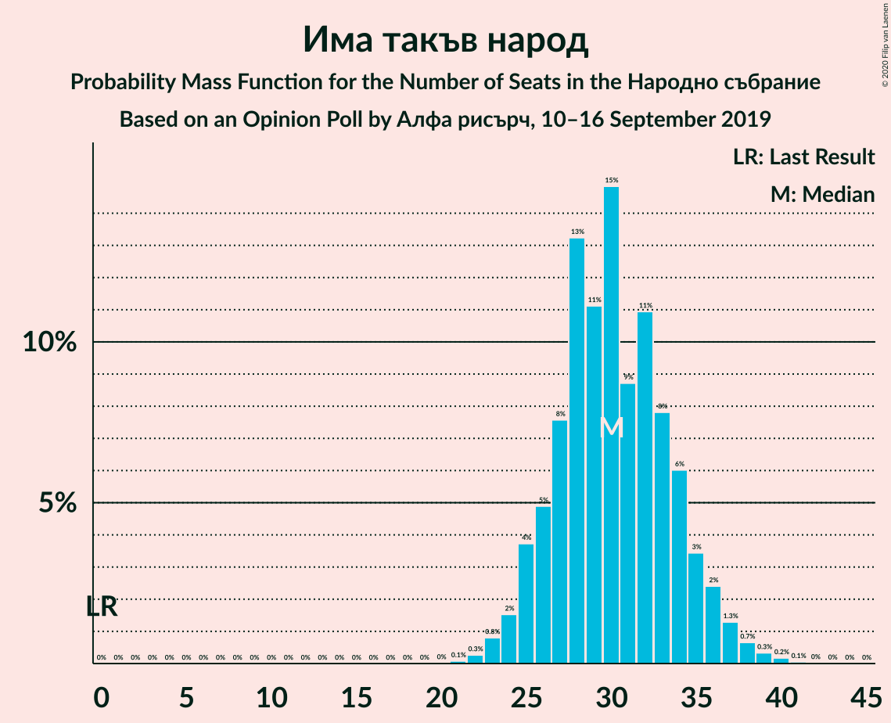

| Number of Seats | Probability | Accumulated | Special Marks |
|:---------------:|:-----------:|:-----------:|:-------------:|
| 0 | 0% | 100% | Last Result |
| 1 | 0% | 100% |  |
| 2 | 0% | 100% |  |
| 3 | 0% | 100% |  |
| 4 | 0% | 100% |  |
| 5 | 0% | 100% |  |
| 6 | 0% | 100% |  |
| 7 | 0% | 100% |  |
| 8 | 0% | 100% |  |
| 9 | 0% | 100% |  |
| 10 | 0% | 100% |  |
| 11 | 0% | 100% |  |
| 12 | 0% | 100% |  |
| 13 | 0% | 100% |  |
| 14 | 0% | 100% |  |
| 15 | 0% | 100% |  |
| 16 | 0% | 100% |  |
| 17 | 0% | 100% |  |
| 18 | 0% | 100% |  |
| 19 | 0% | 100% |  |
| 20 | 0% | 100% |  |
| 21 | 0.1% | 100% |  |
| 22 | 0.3% | 99.9% |  |
| 23 | 0.7% | 99.6% |  |
| 24 | 1.2% | 98.9% |  |
| 25 | 3% | 98% |  |
| 26 | 3% | 95% |  |
| 27 | 8% | 92% |  |
| 28 | 7% | 84% |  |
| 29 | 11% | 77% |  |
| 30 | 15% | 66% |  |
| 31 | 15% | 50% | Median |
| 32 | 16% | 35% |  |
| 33 | 5% | 19% |  |
| 34 | 5% | 14% |  |
| 35 | 3% | 9% |  |
| 36 | 3% | 6% |  |
| 37 | 0.7% | 3% |  |
| 38 | 2% | 2% |  |
| 39 | 0.4% | 0.7% |  |
| 40 | 0.2% | 0.2% |  |
| 41 | 0% | 0.1% |  |
| 42 | 0% | 0% |  |

### Обединени Патриоти

*For a full overview of the results for this party, see the [Обединени Патриоти](party-обединенипатриоти.html) page.*

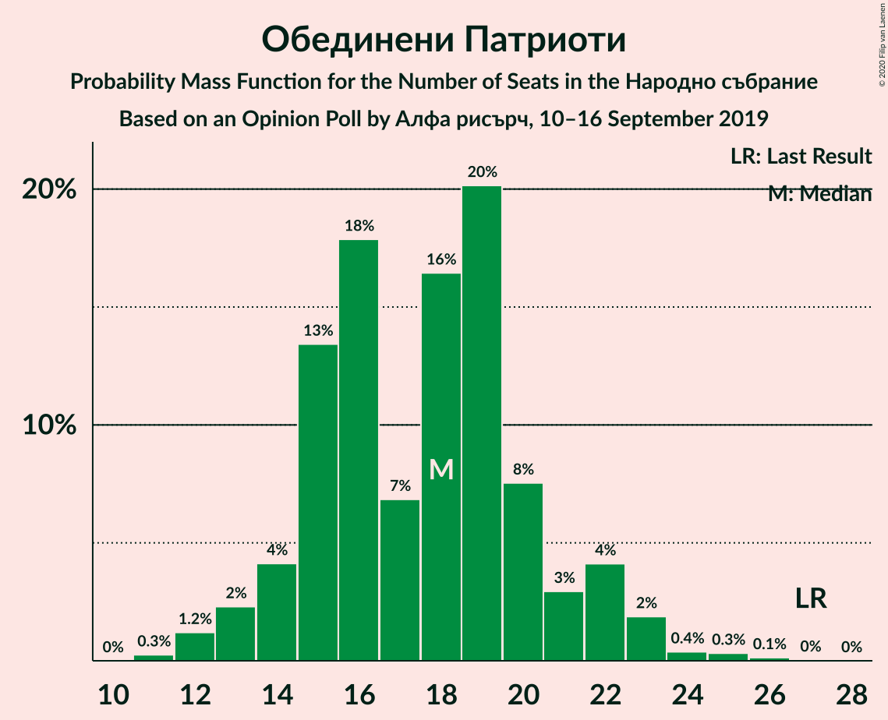

| Number of Seats | Probability | Accumulated | Special Marks |
|:---------------:|:-----------:|:-----------:|:-------------:|
| 11 | 0.3% | 100% |  |
| 12 | 2% | 99.7% |  |
| 13 | 1.0% | 98% |  |
| 14 | 9% | 97% |  |
| 15 | 14% | 88% |  |
| 16 | 8% | 74% |  |
| 17 | 7% | 65% |  |
| 18 | 25% | 59% | Median |
| 19 | 19% | 33% |  |
| 20 | 2% | 14% |  |
| 21 | 6% | 13% |  |
| 22 | 5% | 7% |  |
| 23 | 0.7% | 2% |  |
| 24 | 0.2% | 1.4% |  |
| 25 | 1.1% | 1.2% |  |
| 26 | 0% | 0.1% |  |
| 27 | 0% | 0% | Last Result |

### Демократична България

*For a full overview of the results for this party, see the [Демократична България](party-демократичнабългария.html) page.*

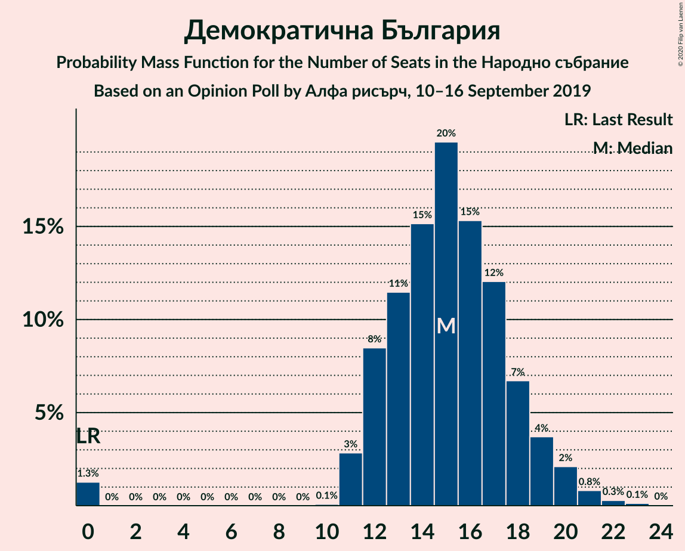

| Number of Seats | Probability | Accumulated | Special Marks |
|:---------------:|:-----------:|:-----------:|:-------------:|
| 0 | 1.1% | 100% | Last Result |
| 1 | 0% | 98.9% |  |
| 2 | 0% | 98.9% |  |
| 3 | 0% | 98.9% |  |
| 4 | 0% | 98.9% |  |
| 5 | 0% | 98.9% |  |
| 6 | 0% | 98.9% |  |
| 7 | 0% | 98.9% |  |
| 8 | 0% | 98.9% |  |
| 9 | 0% | 98.9% |  |
| 10 | 0% | 98.9% |  |
| 11 | 5% | 98.8% |  |
| 12 | 10% | 94% |  |
| 13 | 14% | 84% |  |
| 14 | 12% | 70% |  |
| 15 | 11% | 58% | Median |
| 16 | 22% | 47% |  |
| 17 | 10% | 25% |  |
| 18 | 8% | 16% |  |
| 19 | 4% | 8% |  |
| 20 | 3% | 4% |  |
| 21 | 0.8% | 1.2% |  |
| 22 | 0.2% | 0.5% |  |
| 23 | 0.2% | 0.2% |  |
| 24 | 0% | 0.1% |  |
| 25 | 0% | 0% |  |

### Воля

*For a full overview of the results for this party, see the [Воля](party-воля.html) page.*

| Number of Seats | Probability | Accumulated | Special Marks |
|:---------------:|:-----------:|:-----------:|:-------------:|
| 0 | 95% | 100% | Median |
| 1 | 0% | 5% |  |
| 2 | 0% | 5% |  |
| 3 | 0% | 5% |  |
| 4 | 0% | 5% |  |
| 5 | 0% | 5% |  |
| 6 | 0% | 5% |  |
| 7 | 0% | 5% |  |
| 8 | 0% | 5% |  |
| 9 | 0% | 5% |  |
| 10 | 0.4% | 5% |  |
| 11 | 4% | 5% |  |
| 12 | 0.5% | 1.0% | Last Result |
| 13 | 0.4% | 0.5% |  |
| 14 | 0% | 0.1% |  |
| 15 | 0% | 0% |  |

### Атака

*For a full overview of the results for this party, see the [Атака](party-атака.html) page.*

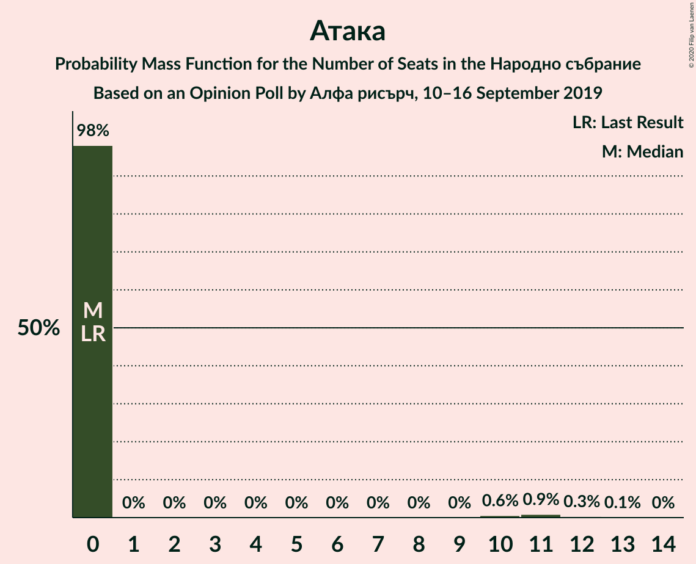

| Number of Seats | Probability | Accumulated | Special Marks |
|:---------------:|:-----------:|:-----------:|:-------------:|
| 0 | 98% | 100% | Last Result, Median |
| 1 | 0% | 2% |  |
| 2 | 0% | 2% |  |
| 3 | 0% | 2% |  |
| 4 | 0% | 2% |  |
| 5 | 0% | 2% |  |
| 6 | 0% | 2% |  |
| 7 | 0% | 2% |  |
| 8 | 0% | 2% |  |
| 9 | 0% | 2% |  |
| 10 | 0.3% | 2% |  |
| 11 | 2% | 2% |  |
| 12 | 0.2% | 0.3% |  |
| 13 | 0.1% | 0.1% |  |
| 14 | 0% | 0% |  |

## Coalitions

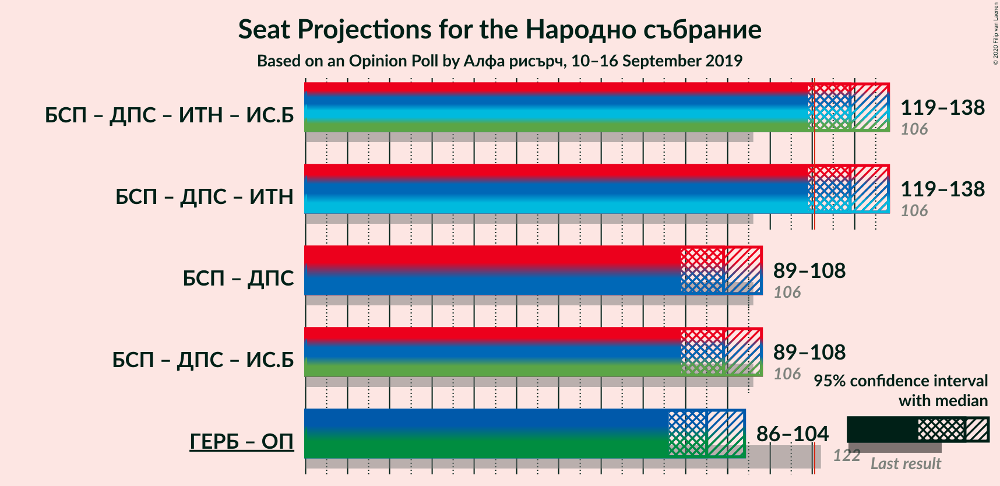

### Confidence Intervals

| Coalition | Last Result | Median | Majority? | 80% Confidence Interval | 90% Confidence Interval | 95% Confidence Interval | 99% Confidence Interval |
|:---------:|:-----------:|:------:|:---------:|:-----------------------:|:-----------------------:|:-----------------------:|:-----------------------:|
| Българска социалистическа партия – Движение за права и свободи | 106 | 98 | 0% | 93–106 | 91–107 | 90–109 | 87–111 |
| Граждани за европейско развитие на България – Обединени Патриоти | 122 | 95 | 0% | 89–101 | 87–102 | 86–103 | 83–107 |

### Българска социалистическа партия – Движение за права и свободи

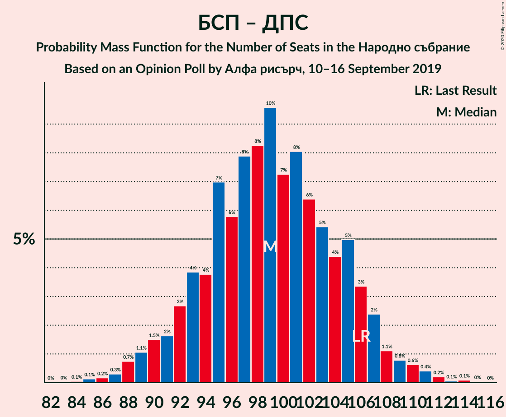

| Number of Seats | Probability | Accumulated | Special Marks |
|:---------------:|:-----------:|:-----------:|:-------------:|
| 83 | 0% | 100% |  |
| 84 | 0% | 99.9% |  |
| 85 | 0.1% | 99.9% |  |
| 86 | 0.1% | 99.8% |  |
| 87 | 0.4% | 99.7% |  |
| 88 | 0.6% | 99.3% |  |
| 89 | 0.9% | 98.7% |  |
| 90 | 2% | 98% |  |
| 91 | 2% | 96% |  |
| 92 | 2% | 94% |  |
| 93 | 5% | 92% |  |
| 94 | 6% | 87% |  |
| 95 | 14% | 80% |  |
| 96 | 6% | 66% |  |
| 97 | 6% | 60% |  |
| 98 | 11% | 54% |  |
| 99 | 3% | 44% |  |
| 100 | 7% | 41% | Median |
| 101 | 8% | 34% |  |
| 102 | 5% | 26% |  |
| 103 | 4% | 21% |  |
| 104 | 3% | 17% |  |
| 105 | 2% | 14% |  |
| 106 | 4% | 12% | Last Result |
| 107 | 4% | 8% |  |
| 108 | 0.6% | 4% |  |
| 109 | 1.2% | 3% |  |
| 110 | 0.6% | 2% |  |
| 111 | 0.9% | 1.4% |  |
| 112 | 0.3% | 0.5% |  |
| 113 | 0.1% | 0.2% |  |
| 114 | 0.1% | 0.1% |  |
| 115 | 0% | 0% |  |

### Граждани за европейско развитие на България – Обединени Патриоти

| Number of Seats | Probability | Accumulated | Special Marks |
|:---------------:|:-----------:|:-----------:|:-------------:|
| 79 | 0% | 100% |  |
| 80 | 0.1% | 99.9% |  |
| 81 | 0.1% | 99.9% |  |
| 82 | 0.3% | 99.8% |  |
| 83 | 0.1% | 99.6% |  |
| 84 | 0.4% | 99.4% |  |
| 85 | 0.6% | 99.0% |  |
| 86 | 3% | 98% |  |
| 87 | 2% | 95% |  |
| 88 | 2% | 93% |  |
| 89 | 5% | 91% |  |
| 90 | 2% | 86% |  |
| 91 | 10% | 84% |  |
| 92 | 6% | 74% |  |
| 93 | 7% | 69% |  |
| 94 | 9% | 62% |  |
| 95 | 7% | 53% |  |
| 96 | 3% | 46% | Median |
| 97 | 0.8% | 42% |  |
| 98 | 15% | 42% |  |
| 99 | 3% | 27% |  |
| 100 | 11% | 24% |  |
| 101 | 5% | 14% |  |
| 102 | 4% | 8% |  |
| 103 | 2% | 4% |  |
| 104 | 0.5% | 2% |  |
| 105 | 0.4% | 2% |  |
| 106 | 0.5% | 1.5% |  |
| 107 | 0.4% | 0.9% |  |
| 108 | 0.2% | 0.5% |  |
| 109 | 0.1% | 0.3% |  |
| 110 | 0.1% | 0.2% |  |
| 111 | 0% | 0.2% |  |
| 112 | 0.2% | 0.2% |  |
| 113 | 0% | 0% |  |
| 114 | 0% | 0% |  |
| 115 | 0% | 0% |  |
| 116 | 0% | 0% |  |
| 117 | 0% | 0% |  |
| 118 | 0% | 0% |  |
| 119 | 0% | 0% |  |
| 120 | 0% | 0% |  |
| 121 | 0% | 0% | Majority |
| 122 | 0% | 0% | Last Result |

## Technical Information

### Opinion Poll

+ **Polling firm:** Алфа рисърч
+ **Commissioner(s):** —
+ **Fieldwork period:** 10–16 September 2019

### Calculations

+ **Sample size:** 743
+ **Simulations done:** 131,072
+ **Error estimate:** 3.38%

