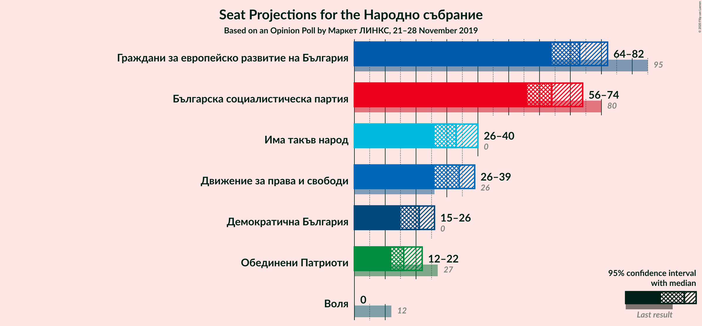
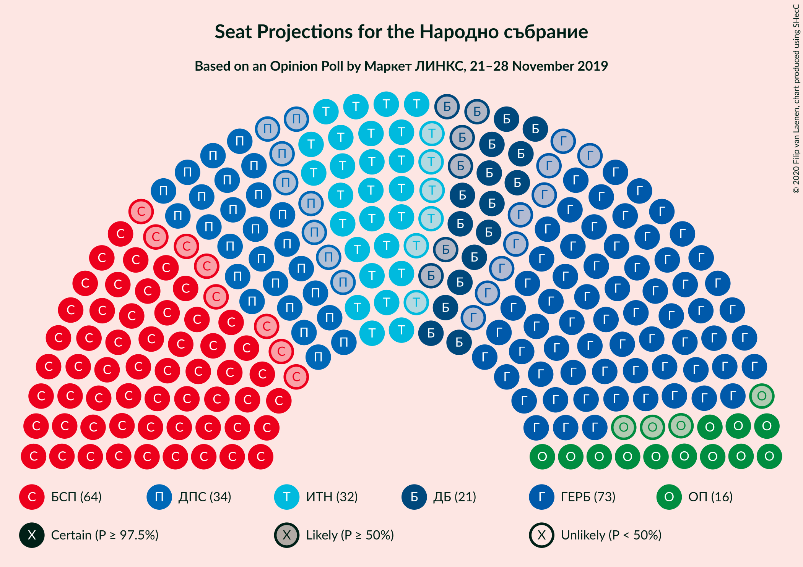
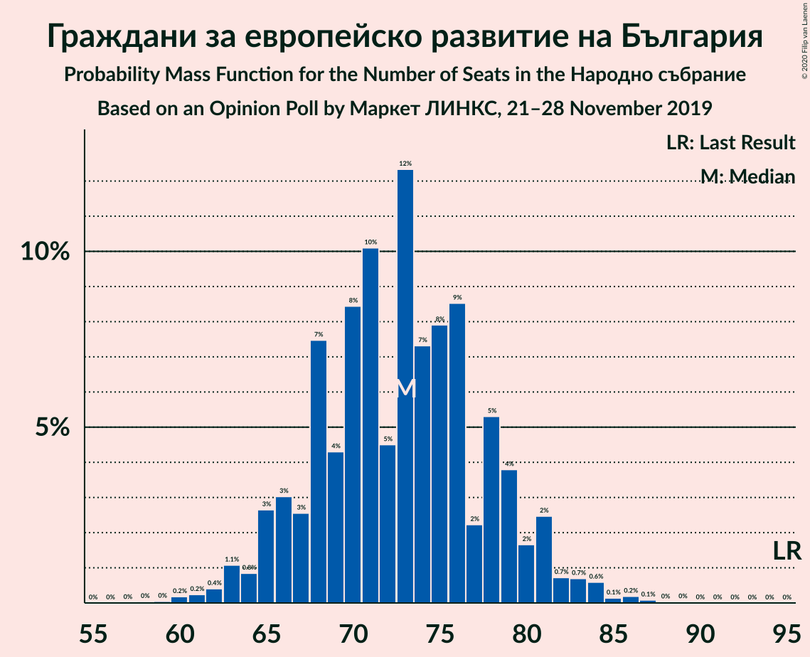
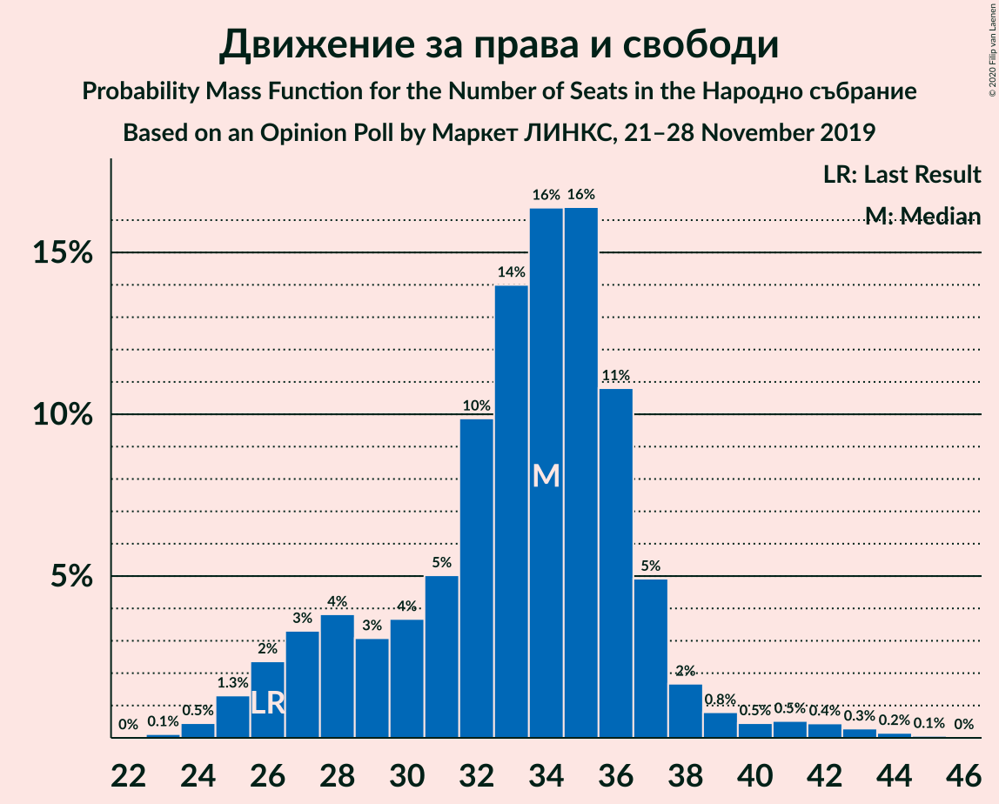
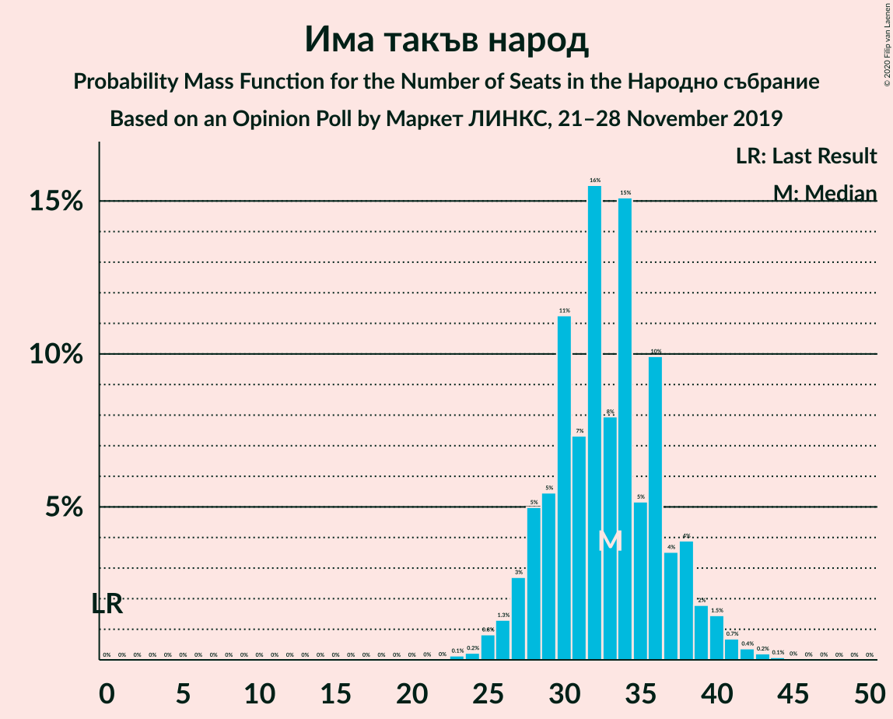
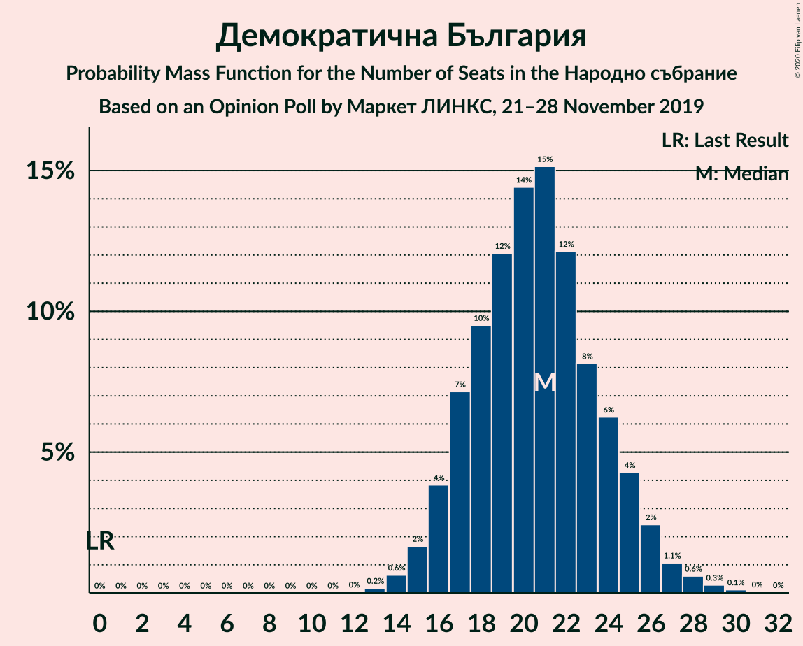
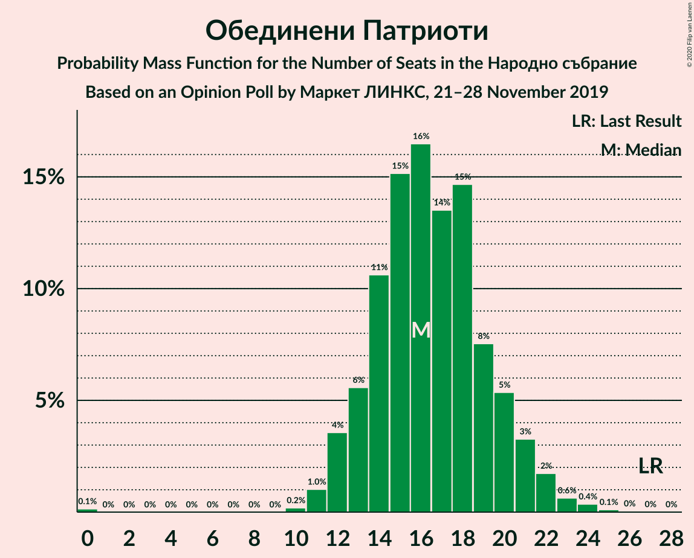
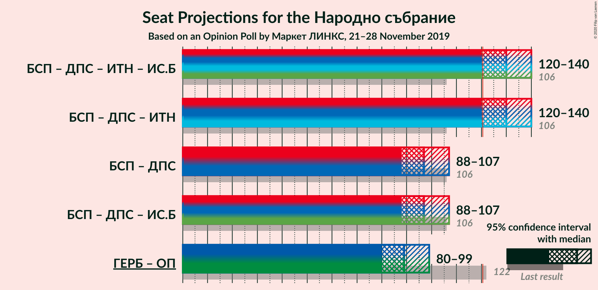
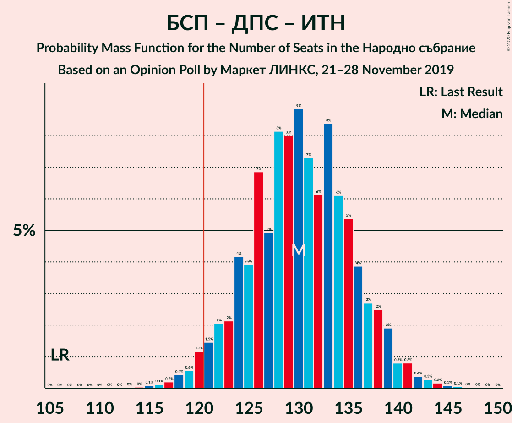
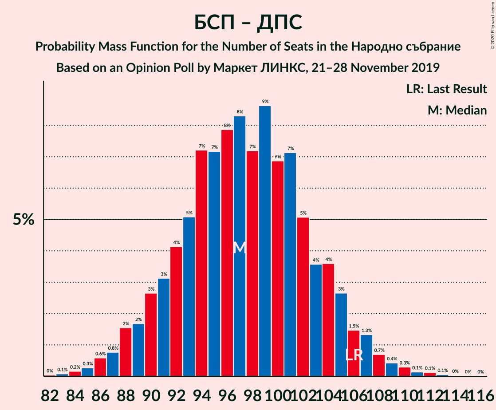

# Opinion Poll by Маркет ЛИНКС, 21–28 November 2019

<a href="#voting-intentions">Voting Intentions</a> | <a href="#seats">Seats</a> | <a href="#coalitions">Coalitions</a> | <a href="#technical-information">Technical Information</a>

## Voting Intentions

### Confidence Intervals

| Party | Last Result | Poll Result | 80% Confidence Interval | 90% Confidence Interval | 95% Confidence Interval | 99% Confidence Interval |
|:-----:|:-----------:|:-----------:|:-----------------------:|:-----------------------:|:-----------------------:|:-----------------------:|
| Граждани за европейско развитие на България | 33.5% | 29.0% | 26.7–31.4% |26.1–32.1% |25.6–32.7% |24.5–33.9% |
| Българска социалистическа партия | 27.9% | 25.8% | 23.6–28.1% |23.0–28.8% |22.5–29.4% |21.5–30.5% |
| Движение за права и свободи | 9.2% | 13.0% | 11.4–14.9% |10.9–15.4% |10.5–15.9% |9.8–16.8% |
| Има такъв народ | 0.0% | 13.0% | 11.4–14.9% |10.9–15.4% |10.5–15.9% |9.8–16.8% |
| Демократична България | 0.0% | 8.1% | 6.8–9.7% |6.5–10.1% |6.2–10.5% |5.6–11.3% |
| Обединени Патриоти | 9.3% | 6.5% | 5.4–7.9% |5.1–8.4% |4.8–8.7% |4.3–9.5% |
| Воля | 4.3% | 1.6% | 1.1–2.5% |1.0–2.7% |0.9–3.0% |0.7–3.4% |

*Note:* The poll result column reflects the actual value used in the calculations. Published results may vary slightly, and in addition be rounded to fewer digits.

## Seats

### Confidence Intervals

| Party | Last Result | Median | 80% Confidence Interval | 90% Confidence Interval | 95% Confidence Interval | 99% Confidence Interval |
|:-----:|:-----------:|:------:|:-----------------------:|:-----------------------:|:-----------------------:|:-----------------------:|
| <a href="#граждани-за-европейско-развитие-на-българия">Граждани за европейско развитие на България</a> | 95 | 73 | 67–79 |65–80 |64–82 |61–84 |
| <a href="#българска-социалистическа-партия">Българска социалистическа партия</a> | 80 | 64 | 59–70 |58–72 |56–74 |54–77 |
| <a href="#движение-за-права-и-свободи">Движение за права и свободи</a> | 26 | 34 | 28–36 |27–37 |26–39 |24–43 |
| <a href="#има-такъв-народ">Има такъв народ</a> | 0 | 33 | 28–37 |27–38 |26–40 |25–42 |
| <a href="#демократична-българия">Демократична България</a> | 0 | 21 | 17–24 |16–25 |15–26 |14–28 |
| <a href="#обединени-патриоти">Обединени Патриоти</a> | 27 | 16 | 13–20 |13–21 |12–22 |11–24 |
| <a href="#воля">Воля</a> | 12 | 0 | 0 |0 |0 |0 |

### Граждани за европейско развитие на България

*For a full overview of the results for this party, see the [Граждани за европейско развитие на България](party-гражданизаевропейскоразвитиенабългария.html) page.*

| Number of Seats | Probability | Accumulated | Special Marks |
|:---------------:|:-----------:|:-----------:|:-------------:|
| 58 | 0% | 100% |  |
| 59 | 0% | 99.9% |  |
| 60 | 0.2% | 99.9% |  |
| 61 | 0.2% | 99.7% |  |
| 62 | 0.4% | 99.5% |  |
| 63 | 1.1% | 99.1% |  |
| 64 | 0.8% | 98% |  |
| 65 | 3% | 97% |  |
| 66 | 3% | 94% |  |
| 67 | 3% | 91% |  |
| 68 | 7% | 89% |  |
| 69 | 4% | 81% |  |
| 70 | 8% | 77% |  |
| 71 | 10% | 69% |  |
| 72 | 5% | 59% |  |
| 73 | 12% | 54% | Median |
| 74 | 7% | 42% |  |
| 75 | 8% | 34% |  |
| 76 | 9% | 27% |  |
| 77 | 2% | 18% |  |
| 78 | 5% | 16% |  |
| 79 | 4% | 10% |  |
| 80 | 2% | 7% |  |
| 81 | 2% | 5% |  |
| 82 | 0.7% | 3% |  |
| 83 | 0.7% | 2% |  |
| 84 | 0.6% | 1.1% |  |
| 85 | 0.1% | 0.5% |  |
| 86 | 0.2% | 0.4% |  |
| 87 | 0.1% | 0.2% |  |
| 88 | 0% | 0.1% |  |
| 89 | 0% | 0.1% |  |
| 90 | 0% | 0% |  |
| 91 | 0% | 0% |  |
| 92 | 0% | 0% |  |
| 93 | 0% | 0% |  |
| 94 | 0% | 0% |  |
| 95 | 0% | 0% | Last Result |

### Българска социалистическа партия

*For a full overview of the results for this party, see the [Българска социалистическа партия](party-българскасоциалистическапартия.html) page.*

| Number of Seats | Probability | Accumulated | Special Marks |
|:---------------:|:-----------:|:-----------:|:-------------:|
| 51 | 0% | 100% |  |
| 52 | 0.1% | 99.9% |  |
| 53 | 0.2% | 99.8% |  |
| 54 | 0.3% | 99.6% |  |
| 55 | 0.5% | 99.3% |  |
| 56 | 2% | 98.7% |  |
| 57 | 2% | 97% |  |
| 58 | 3% | 95% |  |
| 59 | 5% | 92% |  |
| 60 | 5% | 87% |  |
| 61 | 11% | 83% |  |
| 62 | 7% | 72% |  |
| 63 | 10% | 65% |  |
| 64 | 12% | 56% | Median |
| 65 | 6% | 43% |  |
| 66 | 10% | 37% |  |
| 67 | 7% | 28% |  |
| 68 | 4% | 21% |  |
| 69 | 6% | 17% |  |
| 70 | 3% | 11% |  |
| 71 | 2% | 9% |  |
| 72 | 2% | 6% |  |
| 73 | 1.3% | 4% |  |
| 74 | 1.1% | 3% |  |
| 75 | 0.8% | 2% |  |
| 76 | 0.3% | 0.9% |  |
| 77 | 0.3% | 0.6% |  |
| 78 | 0.1% | 0.2% |  |
| 79 | 0.1% | 0.1% |  |
| 80 | 0% | 0.1% | Last Result |
| 81 | 0% | 0% |  |

### Движение за права и свободи

*For a full overview of the results for this party, see the [Движение за права и свободи](party-движениезаправаисвободи.html) page.*

| Number of Seats | Probability | Accumulated | Special Marks |
|:---------------:|:-----------:|:-----------:|:-------------:|
| 23 | 0.1% | 100% |  |
| 24 | 0.5% | 99.9% |  |
| 25 | 1.3% | 99.4% |  |
| 26 | 2% | 98% | Last Result |
| 27 | 3% | 96% |  |
| 28 | 4% | 92% |  |
| 29 | 3% | 89% |  |
| 30 | 4% | 86% |  |
| 31 | 5% | 82% |  |
| 32 | 10% | 77% |  |
| 33 | 14% | 67% |  |
| 34 | 16% | 53% | Median |
| 35 | 16% | 37% |  |
| 36 | 11% | 20% |  |
| 37 | 5% | 9% |  |
| 38 | 2% | 4% |  |
| 39 | 0.8% | 3% |  |
| 40 | 0.5% | 2% |  |
| 41 | 0.5% | 2% |  |
| 42 | 0.4% | 1.0% |  |
| 43 | 0.3% | 0.5% |  |
| 44 | 0.2% | 0.2% |  |
| 45 | 0.1% | 0.1% |  |
| 46 | 0% | 0% |  |

### Има такъв народ

*For a full overview of the results for this party, see the [Има такъв народ](party-иматакъвнарод.html) page.*

| Number of Seats | Probability | Accumulated | Special Marks |
|:---------------:|:-----------:|:-----------:|:-------------:|
| 0 | 0% | 100% | Last Result |
| 1 | 0% | 100% |  |
| 2 | 0% | 100% |  |
| 3 | 0% | 100% |  |
| 4 | 0% | 100% |  |
| 5 | 0% | 100% |  |
| 6 | 0% | 100% |  |
| 7 | 0% | 100% |  |
| 8 | 0% | 100% |  |
| 9 | 0% | 100% |  |
| 10 | 0% | 100% |  |
| 11 | 0% | 100% |  |
| 12 | 0% | 100% |  |
| 13 | 0% | 100% |  |
| 14 | 0% | 100% |  |
| 15 | 0% | 100% |  |
| 16 | 0% | 100% |  |
| 17 | 0% | 100% |  |
| 18 | 0% | 100% |  |
| 19 | 0% | 100% |  |
| 20 | 0% | 100% |  |
| 21 | 0% | 100% |  |
| 22 | 0% | 100% |  |
| 23 | 0.1% | 100% |  |
| 24 | 0.2% | 99.8% |  |
| 25 | 0.8% | 99.6% |  |
| 26 | 1.3% | 98.8% |  |
| 27 | 3% | 97% |  |
| 28 | 5% | 95% |  |
| 29 | 5% | 90% |  |
| 30 | 11% | 84% |  |
| 31 | 7% | 73% |  |
| 32 | 16% | 66% |  |
| 33 | 8% | 50% | Median |
| 34 | 15% | 42% |  |
| 35 | 5% | 27% |  |
| 36 | 10% | 22% |  |
| 37 | 4% | 12% |  |
| 38 | 4% | 9% |  |
| 39 | 2% | 5% |  |
| 40 | 1.5% | 3% |  |
| 41 | 0.7% | 1.4% |  |
| 42 | 0.4% | 0.7% |  |
| 43 | 0.2% | 0.4% |  |
| 44 | 0.1% | 0.1% |  |
| 45 | 0% | 0.1% |  |
| 46 | 0% | 0% |  |

### Демократична България

*For a full overview of the results for this party, see the [Демократична България](party-демократичнабългария.html) page.*

| Number of Seats | Probability | Accumulated | Special Marks |
|:---------------:|:-----------:|:-----------:|:-------------:|
| 0 | 0% | 100% | Last Result |
| 1 | 0% | 100% |  |
| 2 | 0% | 100% |  |
| 3 | 0% | 100% |  |
| 4 | 0% | 100% |  |
| 5 | 0% | 100% |  |
| 6 | 0% | 100% |  |
| 7 | 0% | 100% |  |
| 8 | 0% | 100% |  |
| 9 | 0% | 100% |  |
| 10 | 0% | 100% |  |
| 11 | 0% | 100% |  |
| 12 | 0% | 100% |  |
| 13 | 0.2% | 100% |  |
| 14 | 0.6% | 99.8% |  |
| 15 | 2% | 99.2% |  |
| 16 | 4% | 97% |  |
| 17 | 7% | 94% |  |
| 18 | 10% | 87% |  |
| 19 | 12% | 77% |  |
| 20 | 14% | 65% |  |
| 21 | 15% | 51% | Median |
| 22 | 12% | 35% |  |
| 23 | 8% | 23% |  |
| 24 | 6% | 15% |  |
| 25 | 4% | 9% |  |
| 26 | 2% | 5% |  |
| 27 | 1.1% | 2% |  |
| 28 | 0.6% | 1.1% |  |
| 29 | 0.3% | 0.5% |  |
| 30 | 0.1% | 0.2% |  |
| 31 | 0% | 0.1% |  |
| 32 | 0% | 0% |  |

### Обединени Патриоти

*For a full overview of the results for this party, see the [Обединени Патриоти](party-обединенипатриоти.html) page.*

| Number of Seats | Probability | Accumulated | Special Marks |
|:---------------:|:-----------:|:-----------:|:-------------:|
| 0 | 0.1% | 100% |  |
| 1 | 0% | 99.9% |  |
| 2 | 0% | 99.9% |  |
| 3 | 0% | 99.9% |  |
| 4 | 0% | 99.9% |  |
| 5 | 0% | 99.9% |  |
| 6 | 0% | 99.9% |  |
| 7 | 0% | 99.9% |  |
| 8 | 0% | 99.9% |  |
| 9 | 0% | 99.9% |  |
| 10 | 0.2% | 99.9% |  |
| 11 | 1.0% | 99.7% |  |
| 12 | 4% | 98.6% |  |
| 13 | 6% | 95% |  |
| 14 | 11% | 90% |  |
| 15 | 15% | 79% |  |
| 16 | 16% | 64% | Median |
| 17 | 14% | 47% |  |
| 18 | 15% | 34% |  |
| 19 | 8% | 19% |  |
| 20 | 5% | 12% |  |
| 21 | 3% | 6% |  |
| 22 | 2% | 3% |  |
| 23 | 0.6% | 1.2% |  |
| 24 | 0.4% | 0.5% |  |
| 25 | 0.1% | 0.2% |  |
| 26 | 0% | 0.1% |  |
| 27 | 0% | 0% | Last Result |

### Воля

*For a full overview of the results for this party, see the [Воля](party-воля.html) page.*

| Number of Seats | Probability | Accumulated | Special Marks |
|:---------------:|:-----------:|:-----------:|:-------------:|
| 0 | 99.9% | 100% | Median |
| 1 | 0% | 0.1% |  |
| 2 | 0% | 0.1% |  |
| 3 | 0% | 0.1% |  |
| 4 | 0% | 0.1% |  |
| 5 | 0% | 0.1% |  |
| 6 | 0% | 0.1% |  |
| 7 | 0% | 0.1% |  |
| 8 | 0% | 0.1% |  |
| 9 | 0% | 0.1% |  |
| 10 | 0% | 0.1% |  |
| 11 | 0% | 0% |  |
| 12 | 0% | 0% | Last Result |

## Coalitions

### Confidence Intervals

| Coalition | Last Result | Median | Majority? | 80% Confidence Interval | 90% Confidence Interval | 95% Confidence Interval | 99% Confidence Interval |
|:---------:|:-----------:|:------:|:---------:|:-----------------------:|:-----------------------:|:-----------------------:|:-----------------------:|
| Българска социалистическа партия – Движение за права и свободи – Има такъв народ | 106 | 130 | 97% | 124–136 | 122–138 | 120–140 | 118–143 |
| Българска социалистическа партия – Движение за права и свободи | 106 | 97 | 0% | 91–104 | 89–105 | 88–107 | 85–110 |
| Граждани за европейско развитие на България – Обединени Патриоти | 122 | 89 | 0% | 83–95 | 81–97 | 80–99 | 77–102 |

### Българска социалистическа партия – Движение за права и свободи – Има такъв народ

| Number of Seats | Probability | Accumulated | Special Marks |
|:---------------:|:-----------:|:-----------:|:-------------:|
| 106 | 0% | 100% | Last Result |
| 107 | 0% | 100% |  |
| 108 | 0% | 100% |  |
| 109 | 0% | 100% |  |
| 110 | 0% | 100% |  |
| 111 | 0% | 100% |  |
| 112 | 0% | 100% |  |
| 113 | 0% | 100% |  |
| 114 | 0% | 100% |  |
| 115 | 0.1% | 99.9% |  |
| 116 | 0.1% | 99.8% |  |
| 117 | 0.2% | 99.7% |  |
| 118 | 0.4% | 99.5% |  |
| 119 | 0.6% | 99.1% |  |
| 120 | 1.2% | 98.5% |  |
| 121 | 1.5% | 97% | Majority |
| 122 | 2% | 96% |  |
| 123 | 2% | 94% |  |
| 124 | 4% | 92% |  |
| 125 | 4% | 88% |  |
| 126 | 7% | 84% |  |
| 127 | 5% | 77% |  |
| 128 | 8% | 72% |  |
| 129 | 8% | 64% |  |
| 130 | 9% | 56% |  |
| 131 | 7% | 47% | Median |
| 132 | 6% | 40% |  |
| 133 | 8% | 33% |  |
| 134 | 6% | 25% |  |
| 135 | 5% | 19% |  |
| 136 | 4% | 14% |  |
| 137 | 3% | 10% |  |
| 138 | 2% | 7% |  |
| 139 | 2% | 4% |  |
| 140 | 0.8% | 3% |  |
| 141 | 0.8% | 2% |  |
| 142 | 0.4% | 1.0% |  |
| 143 | 0.3% | 0.6% |  |
| 144 | 0.2% | 0.3% |  |
| 145 | 0.1% | 0.2% |  |
| 146 | 0.1% | 0.1% |  |
| 147 | 0% | 0.1% |  |
| 148 | 0% | 0% |  |

### Българска социалистическа партия – Движение за права и свободи

| Number of Seats | Probability | Accumulated | Special Marks |
|:---------------:|:-----------:|:-----------:|:-------------:|
| 82 | 0% | 100% |  |
| 83 | 0.1% | 99.9% |  |
| 84 | 0.2% | 99.8% |  |
| 85 | 0.3% | 99.7% |  |
| 86 | 0.6% | 99.4% |  |
| 87 | 0.8% | 98.8% |  |
| 88 | 2% | 98% |  |
| 89 | 2% | 97% |  |
| 90 | 3% | 95% |  |
| 91 | 3% | 92% |  |
| 92 | 4% | 89% |  |
| 93 | 5% | 85% |  |
| 94 | 7% | 80% |  |
| 95 | 7% | 73% |  |
| 96 | 8% | 65% |  |
| 97 | 8% | 58% |  |
| 98 | 7% | 49% | Median |
| 99 | 9% | 42% |  |
| 100 | 7% | 33% |  |
| 101 | 7% | 27% |  |
| 102 | 5% | 19% |  |
| 103 | 4% | 14% |  |
| 104 | 4% | 11% |  |
| 105 | 3% | 7% |  |
| 106 | 1.5% | 5% | Last Result |
| 107 | 1.3% | 3% |  |
| 108 | 0.7% | 2% |  |
| 109 | 0.4% | 1.1% |  |
| 110 | 0.3% | 0.7% |  |
| 111 | 0.1% | 0.4% |  |
| 112 | 0.1% | 0.2% |  |
| 113 | 0.1% | 0.1% |  |
| 114 | 0% | 0.1% |  |
| 115 | 0% | 0% |  |

### Граждани за европейско развитие на България – Обединени Патриоти

| Number of Seats | Probability | Accumulated | Special Marks |
|:---------------:|:-----------:|:-----------:|:-------------:|
| 73 | 0% | 100% |  |
| 74 | 0% | 99.9% |  |
| 75 | 0.1% | 99.9% |  |
| 76 | 0.2% | 99.8% |  |
| 77 | 0.3% | 99.6% |  |
| 78 | 0.6% | 99.4% |  |
| 79 | 0.7% | 98.8% |  |
| 80 | 1.1% | 98% |  |
| 81 | 2% | 97% |  |
| 82 | 3% | 95% |  |
| 83 | 3% | 92% |  |
| 84 | 5% | 89% |  |
| 85 | 7% | 84% |  |
| 86 | 5% | 77% |  |
| 87 | 8% | 72% |  |
| 88 | 8% | 64% |  |
| 89 | 10% | 56% | Median |
| 90 | 7% | 47% |  |
| 91 | 9% | 40% |  |
| 92 | 7% | 31% |  |
| 93 | 6% | 24% |  |
| 94 | 5% | 18% |  |
| 95 | 4% | 13% |  |
| 96 | 4% | 9% |  |
| 97 | 2% | 6% |  |
| 98 | 1.3% | 4% |  |
| 99 | 1.3% | 3% |  |
| 100 | 0.6% | 2% |  |
| 101 | 0.4% | 0.9% |  |
| 102 | 0.2% | 0.5% |  |
| 103 | 0.2% | 0.3% |  |
| 104 | 0.1% | 0.1% |  |
| 105 | 0% | 0.1% |  |
| 106 | 0% | 0% |  |
| 107 | 0% | 0% |  |
| 108 | 0% | 0% |  |
| 109 | 0% | 0% |  |
| 110 | 0% | 0% |  |
| 111 | 0% | 0% |  |
| 112 | 0% | 0% |  |
| 113 | 0% | 0% |  |
| 114 | 0% | 0% |  |
| 115 | 0% | 0% |  |
| 116 | 0% | 0% |  |
| 117 | 0% | 0% |  |
| 118 | 0% | 0% |  |
| 119 | 0% | 0% |  |
| 120 | 0% | 0% |  |
| 121 | 0% | 0% | Majority |
| 122 | 0% | 0% | Last Result |

## Technical Information

### Opinion Poll

+ **Polling firm:** Маркет ЛИНКС
+ **Commissioner(s):** —
+ **Fieldwork period:** 21–28 November 2019

### Calculations

+ **Sample size:** 617
+ **Simulations done:** 1,048,576
+ **Error estimate:** 1.62%

