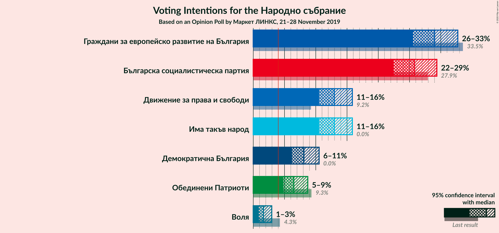
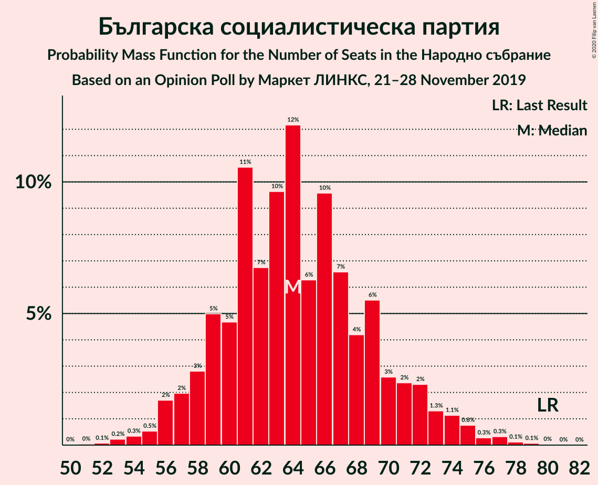
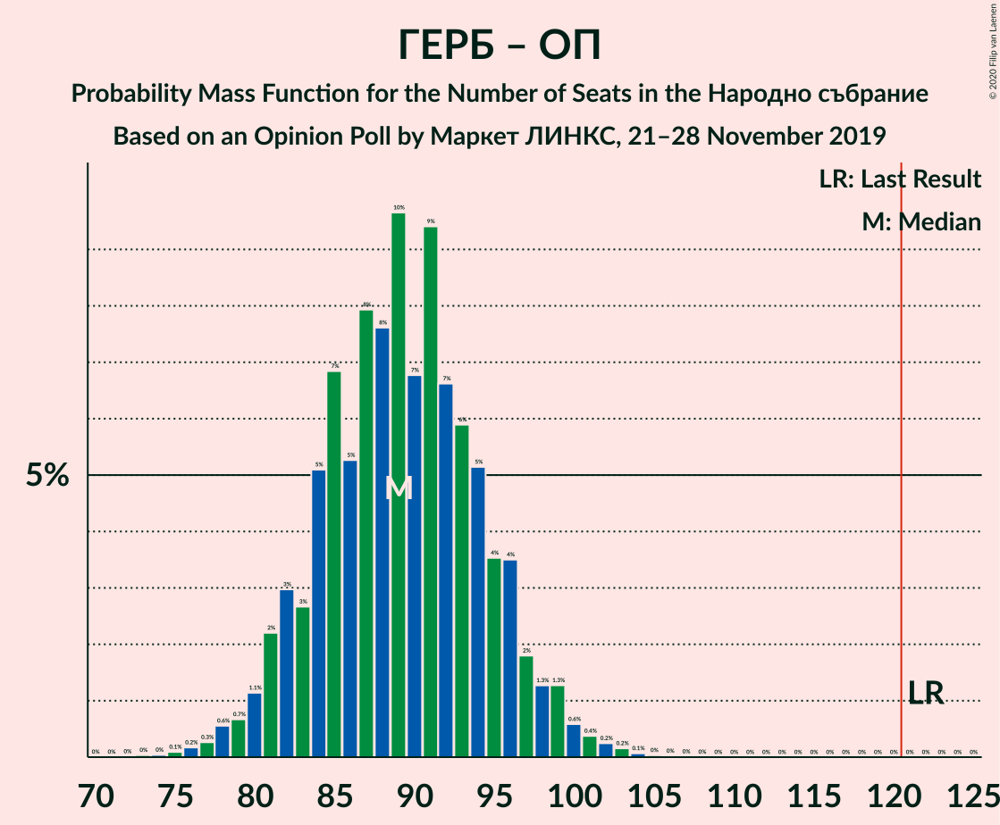

# Opinion Poll by Маркет ЛИНКС, 21–28 November 2019

<a href="#voting-intentions">Voting Intentions</a> | <a href="#seats">Seats</a> | <a href="#coalitions">Coalitions</a> | <a href="#technical-information">Technical Information</a>

## Voting Intentions

### Confidence Intervals

| Party | Last Result | Poll Result | 80% Confidence Interval | 90% Confidence Interval | 95% Confidence Interval | 99% Confidence Interval |
|:-----:|:-----------:|:-----------:|:-----------------------:|:-----------------------:|:-----------------------:|:-----------------------:|
| Граждани за европейско развитие на България | 33.5% | 29.0% | 26.7–31.4% |26.1–32.1% |25.6–32.7% |24.5–33.9% |
| Българска социалистическа партия | 27.9% | 25.8% | 23.6–28.1% |23.0–28.8% |22.5–29.4% |21.5–30.5% |
| Движение за права и свободи | 9.2% | 13.0% | 11.4–14.9% |10.9–15.4% |10.5–15.9% |9.8–16.8% |
| Има такъв народ | 0.0% | 13.0% | 11.4–14.9% |10.9–15.4% |10.5–15.9% |9.8–16.8% |
| Демократична България | 0.0% | 8.1% | 6.8–9.7% |6.5–10.1% |6.2–10.5% |5.6–11.3% |
| Обединени Патриоти | 9.3% | 6.5% | 5.4–7.9% |5.1–8.4% |4.8–8.7% |4.3–9.5% |
| Воля | 4.3% | 1.6% | 1.1–2.5% |1.0–2.7% |0.9–3.0% |0.7–3.4% |

*Note:* The poll result column reflects the actual value used in the calculations. Published results may vary slightly, and in addition be rounded to fewer digits.

## Seats

### Confidence Intervals

| Party | Last Result | Median | 80% Confidence Interval | 90% Confidence Interval | 95% Confidence Interval | 99% Confidence Interval |
|:-----:|:-----------:|:------:|:-----------------------:|:-----------------------:|:-----------------------:|:-----------------------:|
| <a href="#граждани-за-европейско-развитие-на-българия">Граждани за европейско развитие на България</a> | 95 | 74 | 68–79 |66–82 |64–82 |61–85 |
| <a href="#българска-социалистическа-партия">Българска социалистическа партия</a> | 80 | 64 | 59–69 |58–71 |57–73 |54–76 |
| <a href="#движение-за-права-и-свободи">Движение за права и свободи</a> | 26 | 33 | 30–36 |27–39 |25–41 |24–43 |
| <a href="#има-такъв-народ">Има такъв народ</a> | 0 | 34 | 28–37 |27–38 |26–40 |25–42 |
| <a href="#демократична-българия">Демократична България</a> | 0 | 21 | 16–24 |15–26 |15–27 |14–29 |
| <a href="#обединени-патриоти">Обединени Патриоти</a> | 27 | 15 | 13–20 |12–21 |12–22 |11–24 |
| <a href="#воля">Воля</a> | 12 | 0 | 0 |0 |0 |0 |

### Граждани за европейско развитие на България

*For a full overview of the results for this party, see the [Граждани за европейско развитие на България](party-гражданизаевропейскоразвитиенабългария.html) page.*

| Number of Seats | Probability | Accumulated | Special Marks |
|:---------------:|:-----------:|:-----------:|:-------------:|
| 58 | 0.1% | 100% |  |
| 59 | 0.1% | 99.9% |  |
| 60 | 0.1% | 99.8% |  |
| 61 | 0.5% | 99.7% |  |
| 62 | 0.2% | 99.2% |  |
| 63 | 1.0% | 99.0% |  |
| 64 | 1.1% | 98% |  |
| 65 | 0.3% | 97% |  |
| 66 | 4% | 97% |  |
| 67 | 2% | 93% |  |
| 68 | 2% | 91% |  |
| 69 | 10% | 89% |  |
| 70 | 1.1% | 80% |  |
| 71 | 13% | 79% |  |
| 72 | 4% | 66% |  |
| 73 | 3% | 62% |  |
| 74 | 22% | 59% | Median |
| 75 | 2% | 37% |  |
| 76 | 12% | 36% |  |
| 77 | 7% | 24% |  |
| 78 | 2% | 17% |  |
| 79 | 5% | 15% |  |
| 80 | 3% | 10% |  |
| 81 | 1.4% | 7% |  |
| 82 | 3% | 5% |  |
| 83 | 0.1% | 2% |  |
| 84 | 1.0% | 2% |  |
| 85 | 0.4% | 0.9% |  |
| 86 | 0% | 0.5% |  |
| 87 | 0.4% | 0.4% |  |
| 88 | 0% | 0.1% |  |
| 89 | 0% | 0.1% |  |
| 90 | 0% | 0% |  |
| 91 | 0% | 0% |  |
| 92 | 0% | 0% |  |
| 93 | 0% | 0% |  |
| 94 | 0% | 0% |  |
| 95 | 0% | 0% | Last Result |

### Българска социалистическа партия

*For a full overview of the results for this party, see the [Българска социалистическа партия](party-българскасоциалистическапартия.html) page.*

| Number of Seats | Probability | Accumulated | Special Marks |
|:---------------:|:-----------:|:-----------:|:-------------:|
| 51 | 0% | 100% |  |
| 52 | 0.1% | 99.9% |  |
| 53 | 0.2% | 99.9% |  |
| 54 | 0.4% | 99.6% |  |
| 55 | 0.6% | 99.2% |  |
| 56 | 0.7% | 98.6% |  |
| 57 | 2% | 98% |  |
| 58 | 2% | 96% |  |
| 59 | 5% | 94% |  |
| 60 | 5% | 89% |  |
| 61 | 5% | 84% |  |
| 62 | 11% | 79% |  |
| 63 | 9% | 68% |  |
| 64 | 12% | 59% | Median |
| 65 | 8% | 48% |  |
| 66 | 8% | 39% |  |
| 67 | 14% | 32% |  |
| 68 | 4% | 18% |  |
| 69 | 4% | 14% |  |
| 70 | 2% | 9% |  |
| 71 | 3% | 8% |  |
| 72 | 1.3% | 4% |  |
| 73 | 0.7% | 3% |  |
| 74 | 0.7% | 2% |  |
| 75 | 0.7% | 1.5% |  |
| 76 | 0.3% | 0.8% |  |
| 77 | 0.2% | 0.5% |  |
| 78 | 0.2% | 0.3% |  |
| 79 | 0% | 0.1% |  |
| 80 | 0.1% | 0.1% | Last Result |
| 81 | 0% | 0% |  |

### Движение за права и свободи

*For a full overview of the results for this party, see the [Движение за права и свободи](party-движениезаправаисвободи.html) page.*

| Number of Seats | Probability | Accumulated | Special Marks |
|:---------------:|:-----------:|:-----------:|:-------------:|
| 22 | 0.1% | 100% |  |
| 23 | 0.4% | 99.9% |  |
| 24 | 0.9% | 99.6% |  |
| 25 | 1.4% | 98.6% |  |
| 26 | 1.4% | 97% | Last Result |
| 27 | 1.2% | 96% |  |
| 28 | 1.2% | 95% |  |
| 29 | 2% | 93% |  |
| 30 | 7% | 91% |  |
| 31 | 15% | 85% |  |
| 32 | 16% | 70% |  |
| 33 | 18% | 54% | Median |
| 34 | 18% | 36% |  |
| 35 | 7% | 18% |  |
| 36 | 3% | 10% |  |
| 37 | 1.2% | 7% |  |
| 38 | 0.7% | 6% |  |
| 39 | 0.8% | 6% |  |
| 40 | 1.4% | 5% |  |
| 41 | 2% | 3% |  |
| 42 | 1.0% | 2% |  |
| 43 | 0.4% | 0.6% |  |
| 44 | 0.2% | 0.2% |  |
| 45 | 0% | 0.1% |  |
| 46 | 0% | 0% |  |

### Има такъв народ

*For a full overview of the results for this party, see the [Има такъв народ](party-иматакъвнарод.html) page.*

| Number of Seats | Probability | Accumulated | Special Marks |
|:---------------:|:-----------:|:-----------:|:-------------:|
| 0 | 0% | 100% | Last Result |
| 1 | 0% | 100% |  |
| 2 | 0% | 100% |  |
| 3 | 0% | 100% |  |
| 4 | 0% | 100% |  |
| 5 | 0% | 100% |  |
| 6 | 0% | 100% |  |
| 7 | 0% | 100% |  |
| 8 | 0% | 100% |  |
| 9 | 0% | 100% |  |
| 10 | 0% | 100% |  |
| 11 | 0% | 100% |  |
| 12 | 0% | 100% |  |
| 13 | 0% | 100% |  |
| 14 | 0% | 100% |  |
| 15 | 0% | 100% |  |
| 16 | 0% | 100% |  |
| 17 | 0% | 100% |  |
| 18 | 0% | 100% |  |
| 19 | 0% | 100% |  |
| 20 | 0% | 100% |  |
| 21 | 0% | 100% |  |
| 22 | 0% | 100% |  |
| 23 | 0.2% | 100% |  |
| 24 | 0.2% | 99.8% |  |
| 25 | 1.3% | 99.6% |  |
| 26 | 0.9% | 98% |  |
| 27 | 4% | 97% |  |
| 28 | 4% | 93% |  |
| 29 | 7% | 89% |  |
| 30 | 8% | 82% |  |
| 31 | 6% | 74% |  |
| 32 | 12% | 68% |  |
| 33 | 4% | 56% |  |
| 34 | 21% | 52% | Median |
| 35 | 4% | 32% |  |
| 36 | 15% | 28% |  |
| 37 | 3% | 13% |  |
| 38 | 5% | 10% |  |
| 39 | 0.9% | 5% |  |
| 40 | 3% | 4% |  |
| 41 | 0.4% | 1.2% |  |
| 42 | 0.5% | 0.8% |  |
| 43 | 0.2% | 0.3% |  |
| 44 | 0.1% | 0.1% |  |
| 45 | 0% | 0.1% |  |
| 46 | 0% | 0% |  |

### Демократична България

*For a full overview of the results for this party, see the [Демократична България](party-демократичнабългария.html) page.*

| Number of Seats | Probability | Accumulated | Special Marks |
|:---------------:|:-----------:|:-----------:|:-------------:|
| 0 | 0% | 100% | Last Result |
| 1 | 0% | 100% |  |
| 2 | 0% | 100% |  |
| 3 | 0% | 100% |  |
| 4 | 0% | 100% |  |
| 5 | 0% | 100% |  |
| 6 | 0% | 100% |  |
| 7 | 0% | 100% |  |
| 8 | 0% | 100% |  |
| 9 | 0% | 100% |  |
| 10 | 0% | 100% |  |
| 11 | 0% | 100% |  |
| 12 | 0.1% | 100% |  |
| 13 | 0.3% | 99.9% |  |
| 14 | 1.0% | 99.6% |  |
| 15 | 5% | 98.6% |  |
| 16 | 8% | 94% |  |
| 17 | 6% | 86% |  |
| 18 | 8% | 79% |  |
| 19 | 14% | 71% |  |
| 20 | 5% | 57% |  |
| 21 | 17% | 52% | Median |
| 22 | 14% | 35% |  |
| 23 | 4% | 20% |  |
| 24 | 8% | 16% |  |
| 25 | 1.2% | 8% |  |
| 26 | 4% | 7% |  |
| 27 | 2% | 3% |  |
| 28 | 0.9% | 2% |  |
| 29 | 0.4% | 0.7% |  |
| 30 | 0.2% | 0.3% |  |
| 31 | 0.1% | 0.1% |  |
| 32 | 0% | 0% |  |

### Обединени Патриоти

*For a full overview of the results for this party, see the [Обединени Патриоти](party-обединенипатриоти.html) page.*

| Number of Seats | Probability | Accumulated | Special Marks |
|:---------------:|:-----------:|:-----------:|:-------------:|
| 0 | 0.2% | 100% |  |
| 1 | 0% | 99.8% |  |
| 2 | 0% | 99.8% |  |
| 3 | 0% | 99.8% |  |
| 4 | 0% | 99.8% |  |
| 5 | 0% | 99.8% |  |
| 6 | 0% | 99.8% |  |
| 7 | 0% | 99.8% |  |
| 8 | 0% | 99.8% |  |
| 9 | 0% | 99.8% |  |
| 10 | 0.1% | 99.8% |  |
| 11 | 2% | 99.7% |  |
| 12 | 4% | 98% |  |
| 13 | 11% | 94% |  |
| 14 | 16% | 83% |  |
| 15 | 20% | 68% | Median |
| 16 | 11% | 48% |  |
| 17 | 16% | 37% |  |
| 18 | 5% | 21% |  |
| 19 | 5% | 16% |  |
| 20 | 4% | 11% |  |
| 21 | 3% | 7% |  |
| 22 | 1.5% | 3% |  |
| 23 | 1.0% | 2% |  |
| 24 | 0.6% | 0.9% |  |
| 25 | 0.1% | 0.2% |  |
| 26 | 0.1% | 0.1% |  |
| 27 | 0% | 0% | Last Result |

### Воля

*For a full overview of the results for this party, see the [Воля](party-воля.html) page.*

| Number of Seats | Probability | Accumulated | Special Marks |
|:---------------:|:-----------:|:-----------:|:-------------:|
| 0 | 99.9% | 100% | Median |
| 1 | 0% | 0.1% |  |
| 2 | 0% | 0.1% |  |
| 3 | 0% | 0.1% |  |
| 4 | 0% | 0.1% |  |
| 5 | 0% | 0.1% |  |
| 6 | 0% | 0.1% |  |
| 7 | 0% | 0.1% |  |
| 8 | 0% | 0.1% |  |
| 9 | 0% | 0.1% |  |
| 10 | 0% | 0.1% |  |
| 11 | 0% | 0% |  |
| 12 | 0% | 0% | Last Result |

## Coalitions

### Confidence Intervals

| Coalition | Last Result | Median | Majority? | 80% Confidence Interval | 90% Confidence Interval | 95% Confidence Interval | 99% Confidence Interval |
|:---------:|:-----------:|:------:|:---------:|:-----------------------:|:-----------------------:|:-----------------------:|:-----------------------:|
| Българска социалистическа партия – Движение за права и свободи | 106 | 97 | 0% | 90–103 | 89–106 | 87–106 | 85–110 |
| Граждани за европейско развитие на България – Обединени Патриоти | 122 | 89 | 0% | 84–96 | 82–97 | 80–99 | 77–102 |

### Българска социалистическа партия – Движение за права и свободи

| Number of Seats | Probability | Accumulated | Special Marks |
|:---------------:|:-----------:|:-----------:|:-------------:|
| 82 | 0.1% | 100% |  |
| 83 | 0% | 99.8% |  |
| 84 | 0.2% | 99.8% |  |
| 85 | 0.3% | 99.6% |  |
| 86 | 1.3% | 99.3% |  |
| 87 | 0.5% | 98% |  |
| 88 | 0.8% | 97% |  |
| 89 | 3% | 97% |  |
| 90 | 5% | 94% |  |
| 91 | 2% | 89% |  |
| 92 | 2% | 87% |  |
| 93 | 10% | 85% |  |
| 94 | 3% | 75% |  |
| 95 | 10% | 72% |  |
| 96 | 3% | 62% |  |
| 97 | 15% | 58% | Median |
| 98 | 4% | 44% |  |
| 99 | 6% | 40% |  |
| 100 | 4% | 34% |  |
| 101 | 13% | 30% |  |
| 102 | 6% | 17% |  |
| 103 | 1.4% | 11% |  |
| 104 | 2% | 10% |  |
| 105 | 2% | 8% |  |
| 106 | 3% | 6% | Last Result |
| 107 | 0.5% | 2% |  |
| 108 | 0.5% | 2% |  |
| 109 | 0.4% | 1.2% |  |
| 110 | 0.5% | 0.8% |  |
| 111 | 0.1% | 0.3% |  |
| 112 | 0.1% | 0.2% |  |
| 113 | 0.1% | 0.1% |  |
| 114 | 0% | 0.1% |  |
| 115 | 0% | 0% |  |

### Граждани за европейско развитие на България – Обединени Патриоти

| Number of Seats | Probability | Accumulated | Special Marks |
|:---------------:|:-----------:|:-----------:|:-------------:|
| 72 | 0% | 100% |  |
| 73 | 0% | 99.9% |  |
| 74 | 0% | 99.9% |  |
| 75 | 0% | 99.9% |  |
| 76 | 0.2% | 99.8% |  |
| 77 | 0.3% | 99.7% |  |
| 78 | 0.2% | 99.4% |  |
| 79 | 0.5% | 99.2% |  |
| 80 | 2% | 98.7% |  |
| 81 | 1.1% | 97% |  |
| 82 | 2% | 96% |  |
| 83 | 4% | 94% |  |
| 84 | 7% | 90% |  |
| 85 | 2% | 84% |  |
| 86 | 2% | 81% |  |
| 87 | 12% | 79% |  |
| 88 | 10% | 67% |  |
| 89 | 9% | 57% | Median |
| 90 | 11% | 48% |  |
| 91 | 6% | 38% |  |
| 92 | 7% | 31% |  |
| 93 | 3% | 24% |  |
| 94 | 6% | 21% |  |
| 95 | 4% | 15% |  |
| 96 | 4% | 11% |  |
| 97 | 3% | 7% |  |
| 98 | 1.0% | 5% |  |
| 99 | 2% | 4% |  |
| 100 | 0.8% | 2% |  |
| 101 | 0.2% | 1.0% |  |
| 102 | 0.5% | 0.9% |  |
| 103 | 0.2% | 0.4% |  |
| 104 | 0.1% | 0.2% |  |
| 105 | 0.1% | 0.1% |  |
| 106 | 0.1% | 0.1% |  |
| 107 | 0% | 0% |  |
| 108 | 0% | 0% |  |
| 109 | 0% | 0% |  |
| 110 | 0% | 0% |  |
| 111 | 0% | 0% |  |
| 112 | 0% | 0% |  |
| 113 | 0% | 0% |  |
| 114 | 0% | 0% |  |
| 115 | 0% | 0% |  |
| 116 | 0% | 0% |  |
| 117 | 0% | 0% |  |
| 118 | 0% | 0% |  |
| 119 | 0% | 0% |  |
| 120 | 0% | 0% |  |
| 121 | 0% | 0% | Majority |
| 122 | 0% | 0% | Last Result |

## Technical Information

### Opinion Poll

+ **Polling firm:** Маркет ЛИНКС
+ **Commissioner(s):** —
+ **Fieldwork period:** 21–28 November 2019

### Calculations

+ **Sample size:** 617
+ **Simulations done:** 131,072
+ **Error estimate:** 2.45%

