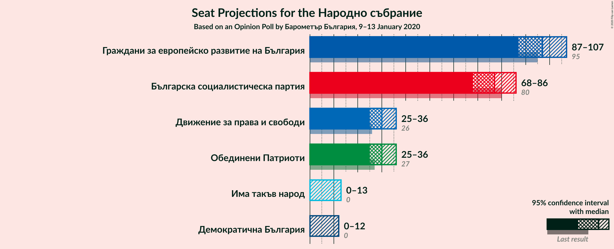
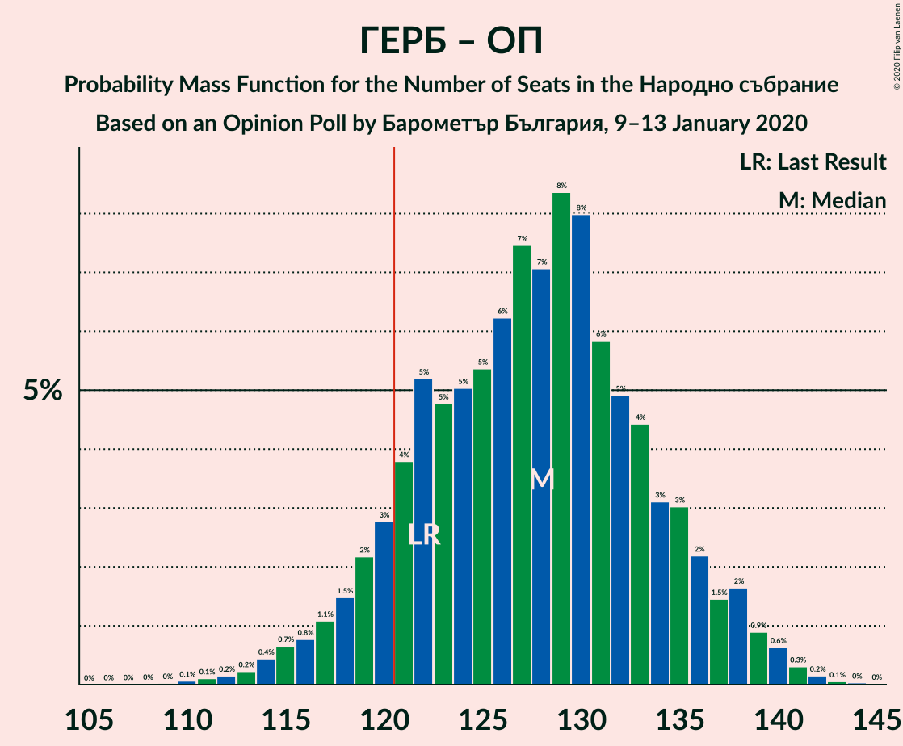

# Opinion Poll by Барометър България, 9–13 January 2020

<a href="#voting-intentions">Voting Intentions</a> | <a href="#seats">Seats</a> | <a href="#coalitions">Coalitions</a> | <a href="#technical-information">Technical Information</a>

## Voting Intentions

### Confidence Intervals

| Party | Last Result | Poll Result | 80% Confidence Interval | 90% Confidence Interval | 95% Confidence Interval | 99% Confidence Interval |
|:-----:|:-----------:|:-----------:|:-----------------------:|:-----------------------:|:-----------------------:|:-----------------------:|
| Граждани за европейско развитие на България | 33.5% | 35.5% | 33.5–37.6% |32.9–38.2% |32.4–38.7% |31.4–39.8% |
| Българска социалистическа партия | 27.9% | 28.2% | 26.3–30.2% |25.7–30.8% |25.3–31.3% |24.4–32.2% |
| Обединени Патриоти | 9.3% | 11.0% | 9.7–12.5% |9.4–12.9% |9.1–13.3% |8.5–14.0% |
| Движение за права и свободи | 9.2% | 11.0% | 9.7–12.5% |9.4–12.9% |9.1–13.3% |8.5–14.0% |
| Има такъв народ | 0.0% | 3.6% | 2.9–4.5% |2.7–4.8% |2.5–5.0% |2.2–5.5% |
| Демократична България | 0.0% | 3.2% | 2.6–4.1% |2.4–4.4% |2.2–4.6% |2.0–5.1% |

*Note:* The poll result column reflects the actual value used in the calculations. Published results may vary slightly, and in addition be rounded to fewer digits.

## Seats

### Confidence Intervals

| Party | Last Result | Median | 80% Confidence Interval | 90% Confidence Interval | 95% Confidence Interval | 99% Confidence Interval |
|:-----:|:-----------:|:------:|:-----------------------:|:-----------------------:|:-----------------------:|:-----------------------:|
| <a href="#граждани-за-европейско-развитие-на-българия">Граждани за европейско развитие на България</a> | 95 | 97 | 91–104 |89–106 |87–107 |84–110 |
| <a href="#българска-социалистическа-партия">Българска социалистическа партия</a> | 80 | 77 | 72–83 |70–85 |68–86 |66–89 |
| <a href="#обединени-патриоти">Обединени Патриоти</a> | 27 | 30 | 27–34 |26–35 |25–36 |23–39 |
| <a href="#движение-за-права-и-свободи">Движение за права и свободи</a> | 26 | 30 | 27–34 |26–35 |25–36 |23–38 |
| <a href="#има-такъв-народ">Има такъв народ</a> | 0 | 0 | 0–12 |0–13 |0–13 |0–15 |
| <a href="#демократична-българия">Демократична България</a> | 0 | 0 | 0–11 |0–12 |0–12 |0–13 |

### Граждани за европейско развитие на България

*For a full overview of the results for this party, see the [Граждани за европейско развитие на България](party-гражданизаевропейскоразвитиенабългария.html) page.*

| Number of Seats | Probability | Accumulated | Special Marks |
|:---------------:|:-----------:|:-----------:|:-------------:|
| 81 | 0% | 100% |  |
| 82 | 0.1% | 99.9% |  |
| 83 | 0.1% | 99.8% |  |
| 84 | 0.2% | 99.7% |  |
| 85 | 0.4% | 99.5% |  |
| 86 | 0.6% | 99.1% |  |
| 87 | 1.0% | 98% |  |
| 88 | 2% | 97% |  |
| 89 | 2% | 96% |  |
| 90 | 3% | 94% |  |
| 91 | 4% | 91% |  |
| 92 | 5% | 88% |  |
| 93 | 6% | 83% |  |
| 94 | 7% | 77% |  |
| 95 | 7% | 70% | Last Result |
| 96 | 8% | 64% |  |
| 97 | 7% | 56% | Median |
| 98 | 8% | 48% |  |
| 99 | 7% | 40% |  |
| 100 | 7% | 33% |  |
| 101 | 7% | 26% |  |
| 102 | 5% | 19% |  |
| 103 | 4% | 14% |  |
| 104 | 3% | 10% |  |
| 105 | 2% | 7% |  |
| 106 | 2% | 5% |  |
| 107 | 1.1% | 3% |  |
| 108 | 0.7% | 2% |  |
| 109 | 0.5% | 1.1% |  |
| 110 | 0.3% | 0.6% |  |
| 111 | 0.2% | 0.3% |  |
| 112 | 0.1% | 0.2% |  |
| 113 | 0% | 0.1% |  |
| 114 | 0% | 0% |  |

### Българска социалистическа партия

*For a full overview of the results for this party, see the [Българска социалистическа партия](party-българскасоциалистическапартия.html) page.*

| Number of Seats | Probability | Accumulated | Special Marks |
|:---------------:|:-----------:|:-----------:|:-------------:|
| 63 | 0% | 100% |  |
| 64 | 0.2% | 99.9% |  |
| 65 | 0.2% | 99.7% |  |
| 66 | 0.4% | 99.6% |  |
| 67 | 0.7% | 99.2% |  |
| 68 | 1.0% | 98% |  |
| 69 | 2% | 97% |  |
| 70 | 2% | 96% |  |
| 71 | 3% | 93% |  |
| 72 | 4% | 90% |  |
| 73 | 5% | 86% |  |
| 74 | 6% | 80% |  |
| 75 | 8% | 74% |  |
| 76 | 8% | 67% |  |
| 77 | 8% | 58% | Median |
| 78 | 9% | 50% |  |
| 79 | 7% | 40% |  |
| 80 | 9% | 34% | Last Result |
| 81 | 6% | 24% |  |
| 82 | 5% | 18% |  |
| 83 | 5% | 13% |  |
| 84 | 2% | 8% |  |
| 85 | 2% | 6% |  |
| 86 | 1.3% | 3% |  |
| 87 | 0.7% | 2% |  |
| 88 | 0.6% | 1.2% |  |
| 89 | 0.3% | 0.6% |  |
| 90 | 0.2% | 0.3% |  |
| 91 | 0.1% | 0.2% |  |
| 92 | 0% | 0.1% |  |
| 93 | 0% | 0% |  |

### Обединени Патриоти

*For a full overview of the results for this party, see the [Обединени Патриоти](party-обединенипатриоти.html) page.*

| Number of Seats | Probability | Accumulated | Special Marks |
|:---------------:|:-----------:|:-----------:|:-------------:|
| 21 | 0.1% | 100% |  |
| 22 | 0.2% | 99.9% |  |
| 23 | 0.5% | 99.8% |  |
| 24 | 1.4% | 99.3% |  |
| 25 | 3% | 98% |  |
| 26 | 4% | 95% |  |
| 27 | 8% | 91% | Last Result |
| 28 | 11% | 83% |  |
| 29 | 13% | 72% |  |
| 30 | 11% | 59% | Median |
| 31 | 12% | 47% |  |
| 32 | 13% | 35% |  |
| 33 | 8% | 22% |  |
| 34 | 5% | 14% |  |
| 35 | 4% | 9% |  |
| 36 | 3% | 5% |  |
| 37 | 1.1% | 2% |  |
| 38 | 0.6% | 1.1% |  |
| 39 | 0.3% | 0.5% |  |
| 40 | 0.1% | 0.2% |  |
| 41 | 0% | 0.1% |  |
| 42 | 0% | 0% |  |

### Движение за права и свободи

*For a full overview of the results for this party, see the [Движение за права и свободи](party-движениезаправаисвободи.html) page.*

| Number of Seats | Probability | Accumulated | Special Marks |
|:---------------:|:-----------:|:-----------:|:-------------:|
| 21 | 0% | 100% |  |
| 22 | 0.2% | 99.9% |  |
| 23 | 0.5% | 99.8% |  |
| 24 | 1.3% | 99.2% |  |
| 25 | 2% | 98% |  |
| 26 | 5% | 95% | Last Result |
| 27 | 7% | 91% |  |
| 28 | 11% | 84% |  |
| 29 | 13% | 73% |  |
| 30 | 12% | 60% | Median |
| 31 | 12% | 47% |  |
| 32 | 12% | 35% |  |
| 33 | 9% | 24% |  |
| 34 | 6% | 14% |  |
| 35 | 3% | 8% |  |
| 36 | 2% | 5% |  |
| 37 | 1.2% | 2% |  |
| 38 | 0.8% | 1.2% |  |
| 39 | 0.3% | 0.5% |  |
| 40 | 0.1% | 0.2% |  |
| 41 | 0.1% | 0.1% |  |
| 42 | 0% | 0% |  |

### Има такъв народ

*For a full overview of the results for this party, see the [Има такъв народ](party-иматакъвнарод.html) page.*

| Number of Seats | Probability | Accumulated | Special Marks |
|:---------------:|:-----------:|:-----------:|:-------------:|
| 0 | 73% | 100% | Last Result, Median |
| 1 | 0% | 27% |  |
| 2 | 0% | 27% |  |
| 3 | 0% | 27% |  |
| 4 | 0% | 27% |  |
| 5 | 0% | 27% |  |
| 6 | 0% | 27% |  |
| 7 | 0% | 27% |  |
| 8 | 0% | 27% |  |
| 9 | 0% | 27% |  |
| 10 | 0.3% | 27% |  |
| 11 | 12% | 27% |  |
| 12 | 9% | 15% |  |
| 13 | 4% | 6% |  |
| 14 | 1.4% | 2% |  |
| 15 | 0.5% | 0.6% |  |
| 16 | 0.1% | 0.1% |  |
| 17 | 0% | 0% |  |

### Демократична България

*For a full overview of the results for this party, see the [Демократична България](party-демократичнабългария.html) page.*

| Number of Seats | Probability | Accumulated | Special Marks |
|:---------------:|:-----------:|:-----------:|:-------------:|
| 0 | 88% | 100% | Last Result, Median |
| 1 | 0% | 12% |  |
| 2 | 0% | 12% |  |
| 3 | 0% | 12% |  |
| 4 | 0% | 12% |  |
| 5 | 0% | 12% |  |
| 6 | 0% | 12% |  |
| 7 | 0% | 12% |  |
| 8 | 0% | 12% |  |
| 9 | 0% | 12% |  |
| 10 | 0.4% | 12% |  |
| 11 | 7% | 12% |  |
| 12 | 4% | 5% |  |
| 13 | 1.3% | 2% |  |
| 14 | 0.4% | 0.5% |  |
| 15 | 0.1% | 0.1% |  |
| 16 | 0% | 0% |  |

## Coalitions

### Confidence Intervals

| Coalition | Last Result | Median | Majority? | 80% Confidence Interval | 90% Confidence Interval | 95% Confidence Interval | 99% Confidence Interval |
|:---------:|:-----------:|:------:|:---------:|:-----------------------:|:-----------------------:|:-----------------------:|:-----------------------:|
| Граждани за европейско развитие на България – Обединени Патриоти | 122 | 128 | 90% | 121–135 | 118–137 | 117–138 | 113–141 |
| Българска социалистическа партия – Движение за права и свободи – Има такъв народ | 106 | 111 | 4% | 104–118 | 102–120 | 100–121 | 97–125 |
| Българска социалистическа партия – Движение за права и свободи | 106 | 108 | 0.5% | 101–114 | 99–116 | 97–117 | 94–120 |

### Граждани за европейско развитие на България – Обединени Патриоти

| Number of Seats | Probability | Accumulated | Special Marks |
|:---------------:|:-----------:|:-----------:|:-------------:|
| 109 | 0% | 100% |  |
| 110 | 0.1% | 99.9% |  |
| 111 | 0.1% | 99.9% |  |
| 112 | 0.2% | 99.8% |  |
| 113 | 0.2% | 99.6% |  |
| 114 | 0.4% | 99.4% |  |
| 115 | 0.7% | 98.9% |  |
| 116 | 0.8% | 98% |  |
| 117 | 1.1% | 98% |  |
| 118 | 1.5% | 96% |  |
| 119 | 2% | 95% |  |
| 120 | 3% | 93% |  |
| 121 | 4% | 90% | Majority |
| 122 | 5% | 86% | Last Result |
| 123 | 5% | 81% |  |
| 124 | 5% | 76% |  |
| 125 | 5% | 71% |  |
| 126 | 6% | 66% |  |
| 127 | 7% | 60% | Median |
| 128 | 7% | 52% |  |
| 129 | 8% | 45% |  |
| 130 | 8% | 37% |  |
| 131 | 6% | 29% |  |
| 132 | 5% | 23% |  |
| 133 | 4% | 18% |  |
| 134 | 3% | 14% |  |
| 135 | 3% | 10% |  |
| 136 | 2% | 7% |  |
| 137 | 1.5% | 5% |  |
| 138 | 2% | 4% |  |
| 139 | 0.9% | 2% |  |
| 140 | 0.6% | 1.2% |  |
| 141 | 0.3% | 0.6% |  |
| 142 | 0.2% | 0.3% |  |
| 143 | 0.1% | 0.1% |  |
| 144 | 0% | 0.1% |  |
| 145 | 0% | 0% |  |

### Българска социалистическа партия – Движение за права и свободи – Има такъв народ

| Number of Seats | Probability | Accumulated | Special Marks |
|:---------------:|:-----------:|:-----------:|:-------------:|
| 94 | 0% | 100% |  |
| 95 | 0.1% | 99.9% |  |
| 96 | 0.2% | 99.8% |  |
| 97 | 0.2% | 99.6% |  |
| 98 | 0.4% | 99.5% |  |
| 99 | 0.7% | 99.0% |  |
| 100 | 1.2% | 98% |  |
| 101 | 1.4% | 97% |  |
| 102 | 2% | 96% |  |
| 103 | 2% | 93% |  |
| 104 | 3% | 91% |  |
| 105 | 4% | 88% |  |
| 106 | 4% | 84% | Last Result |
| 107 | 5% | 80% | Median |
| 108 | 6% | 75% |  |
| 109 | 6% | 69% |  |
| 110 | 8% | 62% |  |
| 111 | 8% | 54% |  |
| 112 | 7% | 46% |  |
| 113 | 7% | 39% |  |
| 114 | 6% | 31% |  |
| 115 | 5% | 25% |  |
| 116 | 4% | 20% |  |
| 117 | 4% | 16% |  |
| 118 | 4% | 13% |  |
| 119 | 3% | 9% |  |
| 120 | 2% | 6% |  |
| 121 | 1.5% | 4% | Majority |
| 122 | 1.0% | 2% |  |
| 123 | 0.6% | 1.5% |  |
| 124 | 0.4% | 0.9% |  |
| 125 | 0.2% | 0.6% |  |
| 126 | 0.2% | 0.3% |  |
| 127 | 0.1% | 0.2% |  |
| 128 | 0% | 0.1% |  |
| 129 | 0% | 0.1% |  |
| 130 | 0% | 0% |  |

### Българска социалистическа партия – Движение за права и свободи

| Number of Seats | Probability | Accumulated | Special Marks |
|:---------------:|:-----------:|:-----------:|:-------------:|
| 90 | 0% | 100% |  |
| 91 | 0% | 99.9% |  |
| 92 | 0.1% | 99.9% |  |
| 93 | 0.2% | 99.8% |  |
| 94 | 0.3% | 99.6% |  |
| 95 | 0.5% | 99.3% |  |
| 96 | 0.7% | 98.8% |  |
| 97 | 0.8% | 98% |  |
| 98 | 1.3% | 97% |  |
| 99 | 2% | 96% |  |
| 100 | 3% | 94% |  |
| 101 | 3% | 91% |  |
| 102 | 4% | 88% |  |
| 103 | 4% | 84% |  |
| 104 | 6% | 80% |  |
| 105 | 7% | 74% |  |
| 106 | 7% | 68% | Last Result |
| 107 | 8% | 61% | Median |
| 108 | 7% | 53% |  |
| 109 | 7% | 46% |  |
| 110 | 8% | 39% |  |
| 111 | 8% | 31% |  |
| 112 | 6% | 24% |  |
| 113 | 6% | 18% |  |
| 114 | 4% | 12% |  |
| 115 | 3% | 8% |  |
| 116 | 2% | 5% |  |
| 117 | 1.4% | 4% |  |
| 118 | 0.9% | 2% |  |
| 119 | 0.6% | 1.4% |  |
| 120 | 0.3% | 0.8% |  |
| 121 | 0.2% | 0.5% | Majority |
| 122 | 0.2% | 0.3% |  |
| 123 | 0.1% | 0.1% |  |
| 124 | 0% | 0.1% |  |
| 125 | 0% | 0% |  |

## Technical Information

### Opinion Poll

+ **Polling firm:** Барометър България
+ **Commissioner(s):** —
+ **Fieldwork period:** 9–13 January 2020

### Calculations

+ **Sample size:** 873
+ **Simulations done:** 1,048,576
+ **Error estimate:** 1.07%

