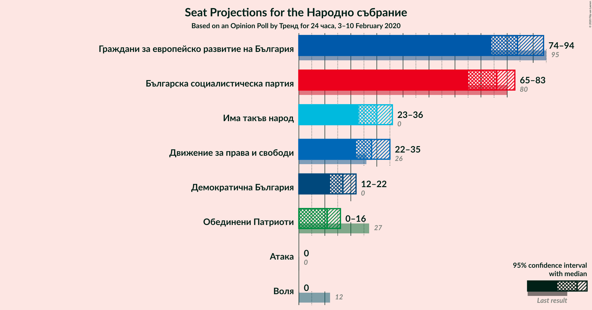
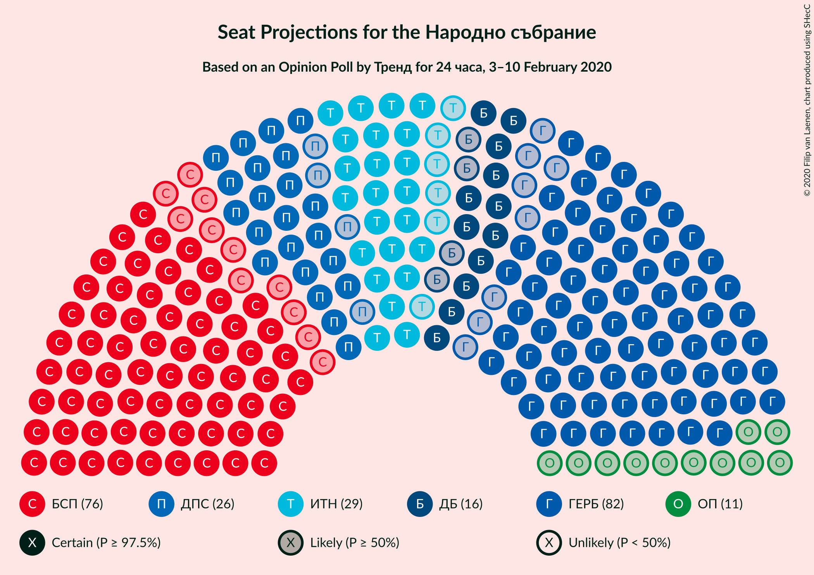
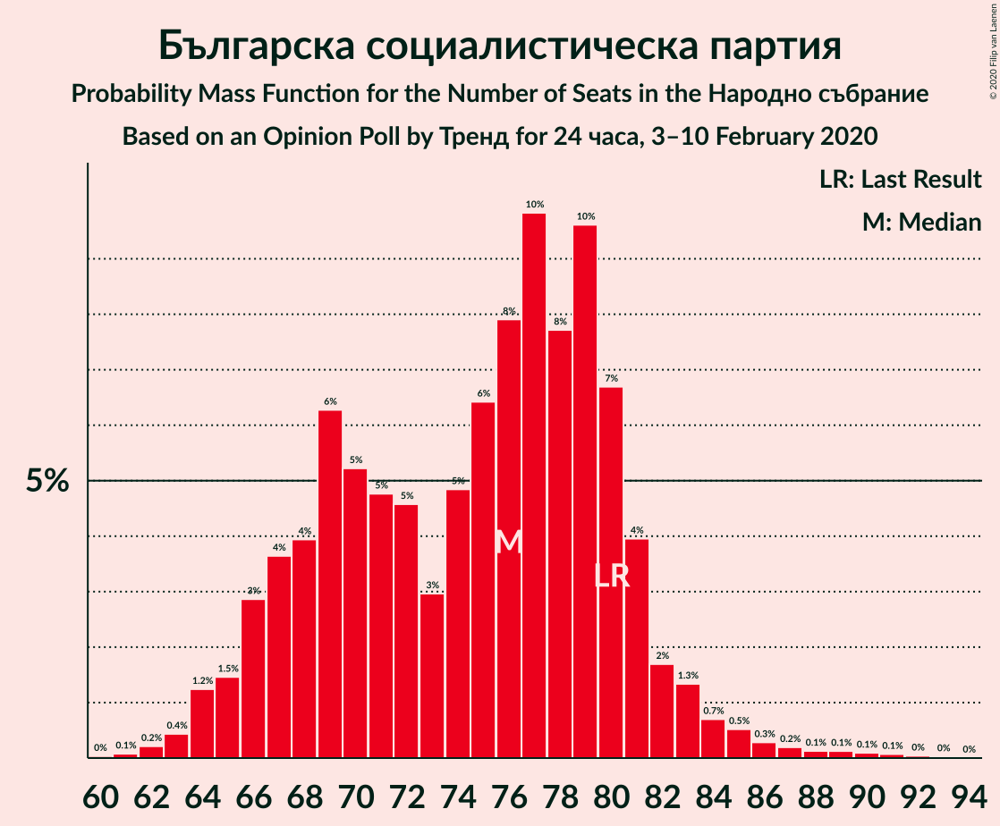
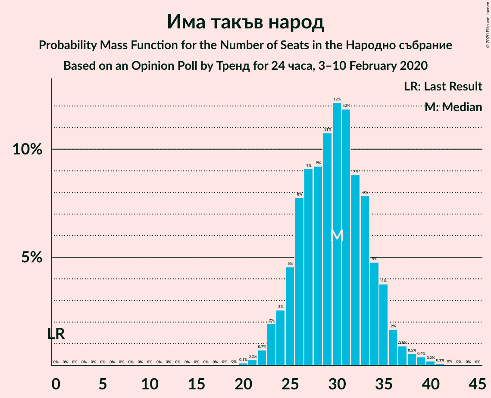
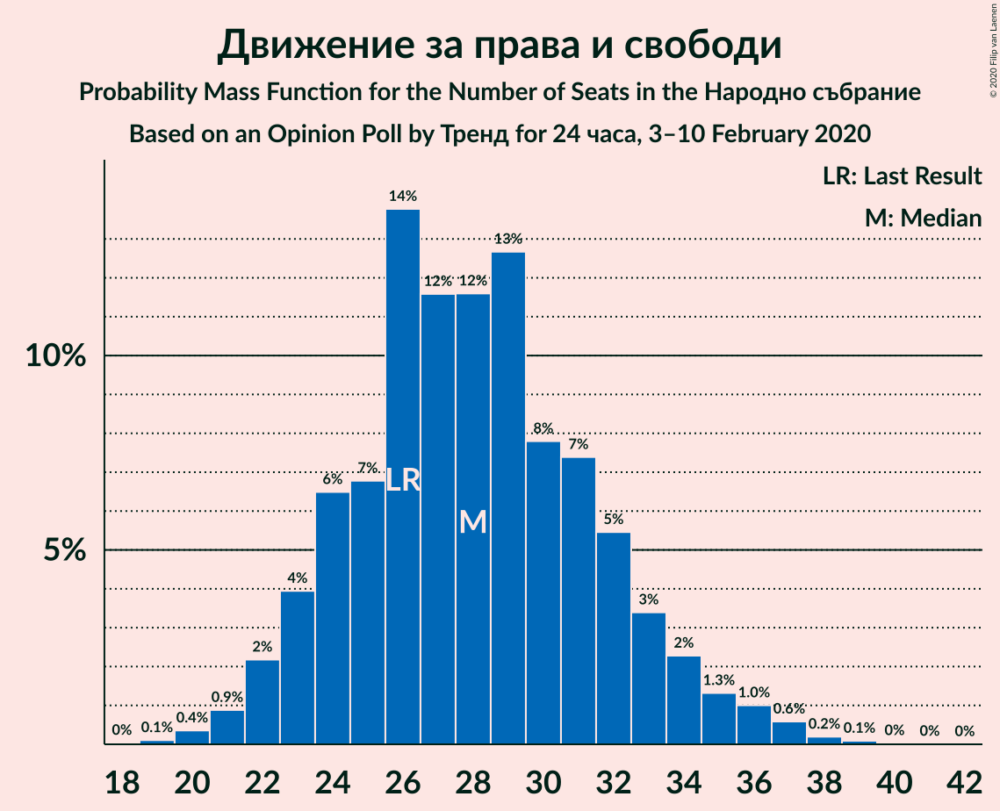

# Opinion Poll by Тренд for 24 часа, 3–10 February 2020

<a href="#voting-intentions">Voting Intentions</a> | <a href="#seats">Seats</a> | <a href="#coalitions">Coalitions</a> | <a href="#technical-information">Technical Information</a>

## Voting Intentions

### Confidence Intervals

| Party | Last Result | Poll Result | 80% Confidence Interval | 90% Confidence Interval | 95% Confidence Interval | 99% Confidence Interval |
|:-----:|:-----------:|:-----------:|:-----------------------:|:-----------------------:|:-----------------------:|:-----------------------:|
| Граждани за европейско развитие на България | 33.5% | 32.3% | 30.0–34.8% |29.4–35.5% |28.8–36.1% |27.8–37.3% |
| Българска социалистическа партия | 27.9% | 28.8% | 26.6–31.1% |25.9–31.8% |25.4–32.4% |24.4–33.5% |
| Има такъв народ | 0.0% | 11.4% | 9.9–13.1% |9.5–13.6% |9.1–14.1% |8.5–14.9% |
| Движение за права и свободи | 9.2% | 10.7% | 9.3–12.5% |8.9–12.9% |8.6–13.4% |7.9–14.2% |
| Демократична България | 0.0% | 6.4% | 5.3–7.8% |5.0–8.2% |4.7–8.6% |4.3–9.3% |
| Обединени Патриоти | 9.3% | 4.2% | N/A |N/A |N/A |N/A |
| Воля | 4.3% | 2.0% | 1.5–2.9% |1.3–3.2% |1.2–3.4% |1.0–3.9% |
| Атака | 0.0% | 1.6% | 1.1–2.4% |1.0–2.6% |0.9–2.9% |0.7–3.3% |

*Note:* The poll result column reflects the actual value used in the calculations. Published results may vary slightly, and in addition be rounded to fewer digits.

## Seats

### Confidence Intervals

| Party | Last Result | Median | 80% Confidence Interval | 90% Confidence Interval | 95% Confidence Interval | 99% Confidence Interval |
|:-----:|:-----------:|:------:|:-----------------------:|:-----------------------:|:-----------------------:|:-----------------------:|
| <a href="#граждани-за-европейско-развитие-на-българия">Граждани за европейско развитие на България</a> | 95 | 84 | 77–88 |74–95 |73–97 |71–98 |
| <a href="#българска-социалистическа-партия">Българска социалистическа партия</a> | 80 | 71 | 68–81 |67–83 |66–84 |65–89 |
| <a href="#има-такъв-народ">Има такъв народ</a> | 0 | 29 | 26–34 |25–35 |24–36 |22–39 |
| <a href="#движение-за-права-и-свободи">Движение за права и свободи</a> | 26 | 27 | 24–32 |23–33 |22–34 |21–37 |
| <a href="#демократична-българия">Демократична България</a> | 0 | 17 | 14–20 |14–21 |13–22 |11–23 |
| <a href="#обединени-патриоти">Обединени Патриоти</a> | 27 | N/A | N/A |N/A |N/A |N/A |
| <a href="#воля">Воля</a> | 12 | 0 | 0 |0 |0 |0 |
| <a href="#атака">Атака</a> | 0 | 0 | 0 |0 |0 |0 |

### Граждани за европейско развитие на България

*For a full overview of the results for this party, see the [Граждани за европейско развитие на България](party-гражданизаевропейскоразвитиенабългария.html) page.*

| Number of Seats | Probability | Accumulated | Special Marks |
|:---------------:|:-----------:|:-----------:|:-------------:|
| 69 | 0.1% | 100% |  |
| 70 | 0.3% | 99.9% |  |
| 71 | 0.4% | 99.6% |  |
| 72 | 0.4% | 99.2% |  |
| 73 | 2% | 98.8% |  |
| 74 | 2% | 96% |  |
| 75 | 2% | 95% |  |
| 76 | 2% | 93% |  |
| 77 | 1.1% | 91% |  |
| 78 | 1.3% | 90% |  |
| 79 | 2% | 88% |  |
| 80 | 3% | 86% |  |
| 81 | 2% | 84% |  |
| 82 | 16% | 81% |  |
| 83 | 14% | 65% |  |
| 84 | 17% | 52% | Median |
| 85 | 10% | 35% |  |
| 86 | 7% | 25% |  |
| 87 | 6% | 18% |  |
| 88 | 3% | 12% |  |
| 89 | 0.7% | 9% |  |
| 90 | 0.3% | 8% |  |
| 91 | 0.4% | 8% |  |
| 92 | 0.5% | 7% |  |
| 93 | 0.1% | 7% |  |
| 94 | 1.0% | 7% |  |
| 95 | 3% | 6% | Last Result |
| 96 | 0.7% | 3% |  |
| 97 | 2% | 3% |  |
| 98 | 0.5% | 0.8% |  |
| 99 | 0.1% | 0.3% |  |
| 100 | 0% | 0.2% |  |
| 101 | 0.1% | 0.2% |  |
| 102 | 0% | 0% |  |

### Българска социалистическа партия

*For a full overview of the results for this party, see the [Българска социалистическа партия](party-българскасоциалистическапартия.html) page.*

| Number of Seats | Probability | Accumulated | Special Marks |
|:---------------:|:-----------:|:-----------:|:-------------:|
| 61 | 0% | 100% |  |
| 62 | 0% | 99.9% |  |
| 63 | 0.1% | 99.9% |  |
| 64 | 0.2% | 99.8% |  |
| 65 | 2% | 99.5% |  |
| 66 | 2% | 98% |  |
| 67 | 6% | 96% |  |
| 68 | 5% | 90% |  |
| 69 | 12% | 85% |  |
| 70 | 15% | 72% |  |
| 71 | 12% | 58% | Median |
| 72 | 9% | 46% |  |
| 73 | 4% | 37% |  |
| 74 | 2% | 33% |  |
| 75 | 5% | 31% |  |
| 76 | 4% | 26% |  |
| 77 | 4% | 22% |  |
| 78 | 2% | 18% |  |
| 79 | 3% | 16% |  |
| 80 | 1.0% | 13% | Last Result |
| 81 | 5% | 12% |  |
| 82 | 1.2% | 7% |  |
| 83 | 2% | 6% |  |
| 84 | 3% | 4% |  |
| 85 | 0.6% | 1.4% |  |
| 86 | 0.2% | 0.8% |  |
| 87 | 0.1% | 0.7% |  |
| 88 | 0.1% | 0.6% |  |
| 89 | 0.2% | 0.5% |  |
| 90 | 0% | 0.3% |  |
| 91 | 0.2% | 0.3% |  |
| 92 | 0.1% | 0.1% |  |
| 93 | 0% | 0.1% |  |
| 94 | 0% | 0% |  |

### Има такъв народ

*For a full overview of the results for this party, see the [Има такъв народ](party-иматакъвнарод.html) page.*

| Number of Seats | Probability | Accumulated | Special Marks |
|:---------------:|:-----------:|:-----------:|:-------------:|
| 0 | 0% | 100% | Last Result |
| 1 | 0% | 100% |  |
| 2 | 0% | 100% |  |
| 3 | 0% | 100% |  |
| 4 | 0% | 100% |  |
| 5 | 0% | 100% |  |
| 6 | 0% | 100% |  |
| 7 | 0% | 100% |  |
| 8 | 0% | 100% |  |
| 9 | 0% | 100% |  |
| 10 | 0% | 100% |  |
| 11 | 0% | 100% |  |
| 12 | 0% | 100% |  |
| 13 | 0% | 100% |  |
| 14 | 0% | 100% |  |
| 15 | 0% | 100% |  |
| 16 | 0% | 100% |  |
| 17 | 0% | 100% |  |
| 18 | 0% | 100% |  |
| 19 | 0% | 100% |  |
| 20 | 0.1% | 100% |  |
| 21 | 0.2% | 99.9% |  |
| 22 | 0.4% | 99.6% |  |
| 23 | 1.4% | 99.3% |  |
| 24 | 2% | 98% |  |
| 25 | 4% | 96% |  |
| 26 | 8% | 92% |  |
| 27 | 13% | 84% |  |
| 28 | 10% | 71% |  |
| 29 | 12% | 62% | Median |
| 30 | 13% | 50% |  |
| 31 | 9% | 37% |  |
| 32 | 11% | 28% |  |
| 33 | 7% | 17% |  |
| 34 | 4% | 10% |  |
| 35 | 2% | 6% |  |
| 36 | 1.5% | 4% |  |
| 37 | 1.1% | 2% |  |
| 38 | 0.7% | 1.3% |  |
| 39 | 0.2% | 0.7% |  |
| 40 | 0.3% | 0.4% |  |
| 41 | 0.1% | 0.2% |  |
| 42 | 0.1% | 0.1% |  |
| 43 | 0% | 0% |  |

### Движение за права и свободи

*For a full overview of the results for this party, see the [Движение за права и свободи](party-движениезаправаисвободи.html) page.*

| Number of Seats | Probability | Accumulated | Special Marks |
|:---------------:|:-----------:|:-----------:|:-------------:|
| 19 | 0.1% | 100% |  |
| 20 | 0.2% | 99.9% |  |
| 21 | 1.1% | 99.7% |  |
| 22 | 2% | 98.6% |  |
| 23 | 5% | 96% |  |
| 24 | 9% | 91% |  |
| 25 | 7% | 82% |  |
| 26 | 19% | 75% | Last Result |
| 27 | 14% | 56% | Median |
| 28 | 9% | 42% |  |
| 29 | 8% | 32% |  |
| 30 | 4% | 24% |  |
| 31 | 7% | 20% |  |
| 32 | 5% | 13% |  |
| 33 | 4% | 9% |  |
| 34 | 2% | 4% |  |
| 35 | 0.7% | 2% |  |
| 36 | 0.6% | 1.1% |  |
| 37 | 0.3% | 0.5% |  |
| 38 | 0.1% | 0.3% |  |
| 39 | 0.1% | 0.1% |  |
| 40 | 0% | 0.1% |  |
| 41 | 0% | 0% |  |

### Демократична България

*For a full overview of the results for this party, see the [Демократична България](party-демократичнабългария.html) page.*

| Number of Seats | Probability | Accumulated | Special Marks |
|:---------------:|:-----------:|:-----------:|:-------------:|
| 0 | 0.1% | 100% | Last Result |
| 1 | 0% | 99.9% |  |
| 2 | 0% | 99.9% |  |
| 3 | 0% | 99.9% |  |
| 4 | 0% | 99.9% |  |
| 5 | 0% | 99.9% |  |
| 6 | 0% | 99.9% |  |
| 7 | 0% | 99.9% |  |
| 8 | 0% | 99.9% |  |
| 9 | 0% | 99.9% |  |
| 10 | 0.2% | 99.9% |  |
| 11 | 0.5% | 99.7% |  |
| 12 | 2% | 99.3% |  |
| 13 | 1.5% | 98% |  |
| 14 | 15% | 96% |  |
| 15 | 11% | 81% |  |
| 16 | 12% | 70% |  |
| 17 | 19% | 58% | Median |
| 18 | 11% | 39% |  |
| 19 | 9% | 28% |  |
| 20 | 13% | 19% |  |
| 21 | 2% | 6% |  |
| 22 | 2% | 4% |  |
| 23 | 1.3% | 2% |  |
| 24 | 0.1% | 0.3% |  |
| 25 | 0.1% | 0.2% |  |
| 26 | 0.1% | 0.1% |  |
| 27 | 0% | 0% |  |

### Обединени Патриоти

*For a full overview of the results for this party, see the [Обединени Патриоти](party-обединенипатриоти.html) page.*

### Воля

*For a full overview of the results for this party, see the [Воля](party-воля.html) page.*

| Number of Seats | Probability | Accumulated | Special Marks |
|:---------------:|:-----------:|:-----------:|:-------------:|
| 0 | 99.8% | 100% | Median |
| 1 | 0% | 0.2% |  |
| 2 | 0% | 0.2% |  |
| 3 | 0% | 0.2% |  |
| 4 | 0% | 0.2% |  |
| 5 | 0% | 0.2% |  |
| 6 | 0% | 0.2% |  |
| 7 | 0% | 0.2% |  |
| 8 | 0% | 0.2% |  |
| 9 | 0% | 0.2% |  |
| 10 | 0% | 0.2% |  |
| 11 | 0.1% | 0.2% |  |
| 12 | 0.1% | 0.1% | Last Result |
| 13 | 0% | 0% |  |

### Атака

*For a full overview of the results for this party, see the [Атака](party-атака.html) page.*

| Number of Seats | Probability | Accumulated | Special Marks |
|:---------------:|:-----------:|:-----------:|:-------------:|
| 0 | 100% | 100% | Last Result, Median |

## Coalitions

### Confidence Intervals

| Coalition | Last Result | Median | Majority? | 80% Confidence Interval | 90% Confidence Interval | 95% Confidence Interval | 99% Confidence Interval |
|:---------:|:-----------:|:------:|:---------:|:-----------------------:|:-----------------------:|:-----------------------:|:-----------------------:|
| Българска социалистическа партия – Движение за права и свободи | 106 | 98 | 0.1% | 94–108 | 94–111 | 93–112 | 91–118 |
| Граждани за европейско развитие на България – Обединени Патриоти | 122 | 84 | 0% | 77–88 | 74–95 | 73–97 | 71–98 |

### Българска социалистическа партия – Движение за права и свободи

| Number of Seats | Probability | Accumulated | Special Marks |
|:---------------:|:-----------:|:-----------:|:-------------:|
| 86 | 0.1% | 100% |  |
| 87 | 0% | 99.9% |  |
| 88 | 0.1% | 99.9% |  |
| 89 | 0.1% | 99.8% |  |
| 90 | 0.1% | 99.7% |  |
| 91 | 0.8% | 99.6% |  |
| 92 | 0.2% | 98.9% |  |
| 93 | 2% | 98.7% |  |
| 94 | 13% | 97% |  |
| 95 | 7% | 84% |  |
| 96 | 4% | 77% |  |
| 97 | 16% | 73% |  |
| 98 | 13% | 57% | Median |
| 99 | 4% | 44% |  |
| 100 | 4% | 40% |  |
| 101 | 2% | 36% |  |
| 102 | 0.6% | 34% |  |
| 103 | 1.3% | 34% |  |
| 104 | 5% | 32% |  |
| 105 | 3% | 27% |  |
| 106 | 3% | 25% | Last Result |
| 107 | 10% | 22% |  |
| 108 | 3% | 12% |  |
| 109 | 2% | 9% |  |
| 110 | 0.9% | 7% |  |
| 111 | 2% | 6% |  |
| 112 | 3% | 4% |  |
| 113 | 0.1% | 0.8% |  |
| 114 | 0.1% | 0.7% |  |
| 115 | 0% | 0.6% |  |
| 116 | 0.1% | 0.6% |  |
| 117 | 0% | 0.6% |  |
| 118 | 0.1% | 0.5% |  |
| 119 | 0.1% | 0.4% |  |
| 120 | 0.2% | 0.3% |  |
| 121 | 0% | 0.1% | Majority |
| 122 | 0% | 0.1% |  |
| 123 | 0% | 0% |  |

### Граждани за европейско развитие на България – Обединени Патриоти

| Number of Seats | Probability | Accumulated | Special Marks |
|:---------------:|:-----------:|:-----------:|:-------------:|
| 69 | 0.1% | 100% |  |
| 70 | 0.3% | 99.9% |  |
| 71 | 0.4% | 99.6% |  |
| 72 | 0.4% | 99.2% |  |
| 73 | 2% | 98.8% |  |
| 74 | 2% | 96% |  |
| 75 | 2% | 95% |  |
| 76 | 2% | 93% |  |
| 77 | 1.1% | 91% |  |
| 78 | 1.3% | 90% |  |
| 79 | 2% | 88% |  |
| 80 | 3% | 86% |  |
| 81 | 2% | 84% |  |
| 82 | 16% | 81% |  |
| 83 | 14% | 65% |  |
| 84 | 17% | 52% | Median |
| 85 | 10% | 35% |  |
| 86 | 7% | 25% |  |
| 87 | 6% | 18% |  |
| 88 | 3% | 12% |  |
| 89 | 0.7% | 9% |  |
| 90 | 0.3% | 8% |  |
| 91 | 0.4% | 8% |  |
| 92 | 0.5% | 7% |  |
| 93 | 0.1% | 7% |  |
| 94 | 1.0% | 7% |  |
| 95 | 3% | 6% |  |
| 96 | 0.7% | 3% |  |
| 97 | 2% | 3% |  |
| 98 | 0.5% | 0.8% |  |
| 99 | 0.1% | 0.3% |  |
| 100 | 0% | 0.2% |  |
| 101 | 0.1% | 0.2% |  |
| 102 | 0% | 0% |  |
| 103 | 0% | 0% |  |
| 104 | 0% | 0% |  |
| 105 | 0% | 0% |  |
| 106 | 0% | 0% |  |
| 107 | 0% | 0% |  |
| 108 | 0% | 0% |  |
| 109 | 0% | 0% |  |
| 110 | 0% | 0% |  |
| 111 | 0% | 0% |  |
| 112 | 0% | 0% |  |
| 113 | 0% | 0% |  |
| 114 | 0% | 0% |  |
| 115 | 0% | 0% |  |
| 116 | 0% | 0% |  |
| 117 | 0% | 0% |  |
| 118 | 0% | 0% |  |
| 119 | 0% | 0% |  |
| 120 | 0% | 0% |  |
| 121 | 0% | 0% | Majority |
| 122 | 0% | 0% | Last Result |

## Technical Information

### Opinion Poll

+ **Polling firm:** Тренд
+ **Commissioner(s):** 24 часа
+ **Fieldwork period:** 3–10 February 2020

### Calculations

+ **Sample size:** 643
+ **Simulations done:** 131,072
+ **Error estimate:** 1.48%

