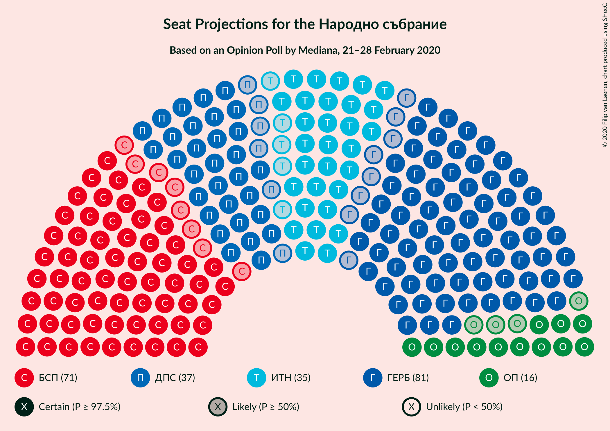

# Opinion Poll by Mediana, 21–28 February 2020

<a href="#voting-intentions">Voting Intentions</a> | <a href="#seats">Seats</a> | <a href="#coalitions">Coalitions</a> | <a href="#technical-information">Technical Information</a>

## Voting Intentions

### Confidence Intervals

| Party | Last Result | Poll Result | 80% Confidence Interval | 90% Confidence Interval | 95% Confidence Interval | 99% Confidence Interval |
|:-----:|:-----------:|:-----------:|:-----------------------:|:-----------------------:|:-----------------------:|:-----------------------:|
| Граждани за европейско развитие на България | 33.5% | 29.4% | 27.6–31.3% |27.1–31.8% |26.6–32.3% |25.8–33.2% |
| Българска социалистическа партия | 27.9% | 25.7% | 24.0–27.5% |23.5–28.0% |23.1–28.5% |22.3–29.4% |
| Движение за права и свободи | 9.2% | 13.3% | 12.0–14.8% |11.6–15.2% |11.3–15.5% |10.7–16.3% |
| Има такъв народ | 0.0% | 12.9% | 11.6–14.3% |11.3–14.8% |11.0–15.1% |10.4–15.8% |
| Обединени Патриоти | 9.3% | 5.9% | 5.0–6.9% |4.8–7.2% |4.6–7.5% |4.2–8.0% |
| Демократична България | 0.0% | 2.7% | 2.1–3.5% |2.0–3.7% |1.8–3.9% |1.6–4.3% |
| Воля | 4.3% | 1.9% | 1.4–2.6% |1.3–2.8% |1.2–2.9% |1.0–3.3% |

*Note:* The poll result column reflects the actual value used in the calculations. Published results may vary slightly, and in addition be rounded to fewer digits.

## Seats

### Confidence Intervals

| Party | Last Result | Median | 80% Confidence Interval | 90% Confidence Interval | 95% Confidence Interval | 99% Confidence Interval |
|:-----:|:-----------:|:------:|:-----------------------:|:-----------------------:|:-----------------------:|:-----------------------:|
| <a href="#граждани-за-европейско-развитие-на-българия">Граждани за европейско развитие на България</a> | 95 | 81 | 77–86 |75–87 |74–88 |71–90 |
| <a href="#българска-социалистическа-партия">Българска социалистическа партия</a> | 80 | 71 | 65–76 |64–78 |63–79 |61–81 |
| <a href="#движение-за-права-и-свободи">Движение за права и свободи</a> | 26 | 37 | 33–40 |32–41 |31–41 |30–44 |
| <a href="#има-такъв-народ">Има такъв народ</a> | 0 | 35 | 31–39 |31–40 |30–41 |28–43 |
| <a href="#обединени-патриоти">Обединени Патриоти</a> | 27 | 16 | 13–19 |12–20 |12–21 |11–22 |
| <a href="#демократична-българия">Демократична България</a> | 0 | 0 | 0 |0 |0 |0–11 |
| <a href="#воля">Воля</a> | 12 | 0 | 0 |0 |0 |0 |

### Граждани за европейско развитие на България

*For a full overview of the results for this party, see the [Граждани за европейско развитие на България](party-гражданизаевропейскоразвитиенабългария.html) page.*

| Number of Seats | Probability | Accumulated | Special Marks |
|:---------------:|:-----------:|:-----------:|:-------------:|
| 68 | 0.1% | 100% |  |
| 69 | 0.2% | 99.9% |  |
| 70 | 0.2% | 99.8% |  |
| 71 | 0.4% | 99.5% |  |
| 72 | 0.6% | 99.2% |  |
| 73 | 0.8% | 98.6% |  |
| 74 | 2% | 98% |  |
| 75 | 2% | 96% |  |
| 76 | 3% | 94% |  |
| 77 | 8% | 90% |  |
| 78 | 7% | 82% |  |
| 79 | 13% | 76% |  |
| 80 | 8% | 62% |  |
| 81 | 13% | 54% | Median |
| 82 | 8% | 41% |  |
| 83 | 9% | 33% |  |
| 84 | 5% | 23% |  |
| 85 | 8% | 18% |  |
| 86 | 4% | 10% |  |
| 87 | 3% | 6% |  |
| 88 | 2% | 3% |  |
| 89 | 0.7% | 2% |  |
| 90 | 0.6% | 1.0% |  |
| 91 | 0.2% | 0.4% |  |
| 92 | 0.1% | 0.3% |  |
| 93 | 0.1% | 0.2% |  |
| 94 | 0% | 0.1% |  |
| 95 | 0% | 0.1% | Last Result |
| 96 | 0% | 0% |  |

### Българска социалистическа партия

*For a full overview of the results for this party, see the [Българска социалистическа партия](party-българскасоциалистическапартия.html) page.*

| Number of Seats | Probability | Accumulated | Special Marks |
|:---------------:|:-----------:|:-----------:|:-------------:|
| 59 | 0.1% | 100% |  |
| 60 | 0.2% | 99.9% |  |
| 61 | 0.5% | 99.7% |  |
| 62 | 0.9% | 99.2% |  |
| 63 | 2% | 98% |  |
| 64 | 5% | 97% |  |
| 65 | 4% | 92% |  |
| 66 | 5% | 88% |  |
| 67 | 6% | 83% |  |
| 68 | 8% | 78% |  |
| 69 | 7% | 70% |  |
| 70 | 7% | 63% |  |
| 71 | 10% | 56% | Median |
| 72 | 8% | 45% |  |
| 73 | 12% | 37% |  |
| 74 | 7% | 26% |  |
| 75 | 6% | 18% |  |
| 76 | 3% | 13% |  |
| 77 | 3% | 9% |  |
| 78 | 2% | 7% |  |
| 79 | 3% | 5% |  |
| 80 | 0.6% | 2% | Last Result |
| 81 | 0.5% | 0.9% |  |
| 82 | 0.3% | 0.4% |  |
| 83 | 0.1% | 0.1% |  |
| 84 | 0% | 0.1% |  |
| 85 | 0% | 0% |  |

### Движение за права и свободи

*For a full overview of the results for this party, see the [Движение за права и свободи](party-движениезаправаисвободи.html) page.*

| Number of Seats | Probability | Accumulated | Special Marks |
|:---------------:|:-----------:|:-----------:|:-------------:|
| 26 | 0% | 100% | Last Result |
| 27 | 0% | 100% |  |
| 28 | 0.1% | 100% |  |
| 29 | 0.2% | 99.9% |  |
| 30 | 1.1% | 99.7% |  |
| 31 | 2% | 98.5% |  |
| 32 | 5% | 96% |  |
| 33 | 6% | 91% |  |
| 34 | 9% | 85% |  |
| 35 | 9% | 76% |  |
| 36 | 7% | 67% |  |
| 37 | 17% | 60% | Median |
| 38 | 17% | 43% |  |
| 39 | 14% | 26% |  |
| 40 | 7% | 12% |  |
| 41 | 4% | 6% |  |
| 42 | 0.9% | 2% |  |
| 43 | 0.7% | 1.3% |  |
| 44 | 0.3% | 0.7% |  |
| 45 | 0.2% | 0.3% |  |
| 46 | 0.1% | 0.2% |  |
| 47 | 0% | 0.1% |  |
| 48 | 0% | 0% |  |

### Има такъв народ

*For a full overview of the results for this party, see the [Има такъв народ](party-иматакъвнарод.html) page.*

| Number of Seats | Probability | Accumulated | Special Marks |
|:---------------:|:-----------:|:-----------:|:-------------:|
| 0 | 0% | 100% | Last Result |
| 1 | 0% | 100% |  |
| 2 | 0% | 100% |  |
| 3 | 0% | 100% |  |
| 4 | 0% | 100% |  |
| 5 | 0% | 100% |  |
| 6 | 0% | 100% |  |
| 7 | 0% | 100% |  |
| 8 | 0% | 100% |  |
| 9 | 0% | 100% |  |
| 10 | 0% | 100% |  |
| 11 | 0% | 100% |  |
| 12 | 0% | 100% |  |
| 13 | 0% | 100% |  |
| 14 | 0% | 100% |  |
| 15 | 0% | 100% |  |
| 16 | 0% | 100% |  |
| 17 | 0% | 100% |  |
| 18 | 0% | 100% |  |
| 19 | 0% | 100% |  |
| 20 | 0% | 100% |  |
| 21 | 0% | 100% |  |
| 22 | 0% | 100% |  |
| 23 | 0% | 100% |  |
| 24 | 0% | 100% |  |
| 25 | 0% | 100% |  |
| 26 | 0% | 100% |  |
| 27 | 0.1% | 100% |  |
| 28 | 0.4% | 99.9% |  |
| 29 | 1.2% | 99.4% |  |
| 30 | 1.5% | 98% |  |
| 31 | 7% | 97% |  |
| 32 | 11% | 90% |  |
| 33 | 12% | 78% |  |
| 34 | 13% | 67% |  |
| 35 | 11% | 54% | Median |
| 36 | 8% | 42% |  |
| 37 | 10% | 34% |  |
| 38 | 10% | 24% |  |
| 39 | 6% | 14% |  |
| 40 | 4% | 8% |  |
| 41 | 3% | 5% |  |
| 42 | 1.0% | 2% |  |
| 43 | 0.4% | 0.9% |  |
| 44 | 0.3% | 0.5% |  |
| 45 | 0.1% | 0.2% |  |
| 46 | 0% | 0.1% |  |
| 47 | 0% | 0% |  |

### Обединени Патриоти

*For a full overview of the results for this party, see the [Обединени Патриоти](party-обединенипатриоти.html) page.*

| Number of Seats | Probability | Accumulated | Special Marks |
|:---------------:|:-----------:|:-----------:|:-------------:|
| 0 | 0.3% | 100% |  |
| 1 | 0% | 99.7% |  |
| 2 | 0% | 99.7% |  |
| 3 | 0% | 99.7% |  |
| 4 | 0% | 99.7% |  |
| 5 | 0% | 99.7% |  |
| 6 | 0% | 99.7% |  |
| 7 | 0% | 99.7% |  |
| 8 | 0% | 99.7% |  |
| 9 | 0% | 99.7% |  |
| 10 | 0% | 99.7% |  |
| 11 | 0.5% | 99.7% |  |
| 12 | 4% | 99.2% |  |
| 13 | 8% | 95% |  |
| 14 | 14% | 87% |  |
| 15 | 13% | 72% |  |
| 16 | 11% | 59% | Median |
| 17 | 13% | 48% |  |
| 18 | 16% | 36% |  |
| 19 | 12% | 20% |  |
| 20 | 4% | 7% |  |
| 21 | 2% | 3% |  |
| 22 | 0.7% | 0.9% |  |
| 23 | 0.2% | 0.2% |  |
| 24 | 0% | 0% |  |
| 25 | 0% | 0% |  |
| 26 | 0% | 0% |  |
| 27 | 0% | 0% | Last Result |

### Демократична България

*For a full overview of the results for this party, see the [Демократична България](party-демократичнабългария.html) page.*

| Number of Seats | Probability | Accumulated | Special Marks |
|:---------------:|:-----------:|:-----------:|:-------------:|
| 0 | 98% | 100% | Last Result, Median |
| 1 | 0% | 2% |  |
| 2 | 0% | 2% |  |
| 3 | 0% | 2% |  |
| 4 | 0% | 2% |  |
| 5 | 0% | 2% |  |
| 6 | 0% | 2% |  |
| 7 | 0% | 2% |  |
| 8 | 0% | 2% |  |
| 9 | 0% | 2% |  |
| 10 | 0% | 2% |  |
| 11 | 2% | 2% |  |
| 12 | 0.4% | 0.5% |  |
| 13 | 0.1% | 0.1% |  |
| 14 | 0% | 0% |  |

### Воля

*For a full overview of the results for this party, see the [Воля](party-воля.html) page.*

| Number of Seats | Probability | Accumulated | Special Marks |
|:---------------:|:-----------:|:-----------:|:-------------:|
| 0 | 100% | 100% | Median |
| 1 | 0% | 0% |  |
| 2 | 0% | 0% |  |
| 3 | 0% | 0% |  |
| 4 | 0% | 0% |  |
| 5 | 0% | 0% |  |
| 6 | 0% | 0% |  |
| 7 | 0% | 0% |  |
| 8 | 0% | 0% |  |
| 9 | 0% | 0% |  |
| 10 | 0% | 0% |  |
| 11 | 0% | 0% |  |
| 12 | 0% | 0% | Last Result |

## Coalitions

### Confidence Intervals

| Coalition | Last Result | Median | Majority? | 80% Confidence Interval | 90% Confidence Interval | 95% Confidence Interval | 99% Confidence Interval |
|:---------:|:-----------:|:------:|:---------:|:-----------------------:|:-----------------------:|:-----------------------:|:-----------------------:|
| Българска социалистическа партия – Движение за права и свободи – Има такъв народ | 106 | 143 | 100% | 137–148 | 136–149 | 135–150 | 132–153 |
| Българска социалистическа партия – Движение за права и свободи | 106 | 108 | 0.1% | 101–113 | 100–114 | 99–116 | 96–119 |
| Граждани за европейско развитие на България – Обединени Патриоти | 122 | 97 | 0% | 92–102 | 91–104 | 90–104 | 87–107 |

### Българска социалистическа партия – Движение за права и свободи – Има такъв народ

| Number of Seats | Probability | Accumulated | Special Marks |
|:---------------:|:-----------:|:-----------:|:-------------:|
| 106 | 0% | 100% | Last Result |
| 107 | 0% | 100% |  |
| 108 | 0% | 100% |  |
| 109 | 0% | 100% |  |
| 110 | 0% | 100% |  |
| 111 | 0% | 100% |  |
| 112 | 0% | 100% |  |
| 113 | 0% | 100% |  |
| 114 | 0% | 100% |  |
| 115 | 0% | 100% |  |
| 116 | 0% | 100% |  |
| 117 | 0% | 100% |  |
| 118 | 0% | 100% |  |
| 119 | 0% | 100% |  |
| 120 | 0% | 100% |  |
| 121 | 0% | 100% | Majority |
| 122 | 0% | 100% |  |
| 123 | 0% | 100% |  |
| 124 | 0% | 100% |  |
| 125 | 0% | 100% |  |
| 126 | 0% | 100% |  |
| 127 | 0% | 100% |  |
| 128 | 0% | 100% |  |
| 129 | 0% | 99.9% |  |
| 130 | 0.1% | 99.9% |  |
| 131 | 0.1% | 99.8% |  |
| 132 | 0.3% | 99.7% |  |
| 133 | 0.5% | 99.3% |  |
| 134 | 0.6% | 98.8% |  |
| 135 | 1.2% | 98% |  |
| 136 | 5% | 97% |  |
| 137 | 4% | 92% |  |
| 138 | 4% | 88% |  |
| 139 | 4% | 84% |  |
| 140 | 8% | 80% |  |
| 141 | 10% | 72% |  |
| 142 | 11% | 62% |  |
| 143 | 9% | 51% | Median |
| 144 | 11% | 43% |  |
| 145 | 9% | 32% |  |
| 146 | 8% | 23% |  |
| 147 | 4% | 15% |  |
| 148 | 5% | 12% |  |
| 149 | 3% | 6% |  |
| 150 | 1.5% | 3% |  |
| 151 | 0.8% | 2% |  |
| 152 | 0.4% | 1.1% |  |
| 153 | 0.3% | 0.7% |  |
| 154 | 0.2% | 0.4% |  |
| 155 | 0% | 0.2% |  |
| 156 | 0% | 0.2% |  |
| 157 | 0% | 0.2% |  |
| 158 | 0.1% | 0.1% |  |
| 159 | 0% | 0% |  |

### Българска социалистическа партия – Движение за права и свободи

| Number of Seats | Probability | Accumulated | Special Marks |
|:---------------:|:-----------:|:-----------:|:-------------:|
| 94 | 0.1% | 100% |  |
| 95 | 0.2% | 99.9% |  |
| 96 | 0.2% | 99.7% |  |
| 97 | 0.8% | 99.5% |  |
| 98 | 1.1% | 98.7% |  |
| 99 | 0.8% | 98% |  |
| 100 | 3% | 97% |  |
| 101 | 4% | 94% |  |
| 102 | 4% | 90% |  |
| 103 | 8% | 85% |  |
| 104 | 4% | 78% |  |
| 105 | 5% | 74% |  |
| 106 | 11% | 69% | Last Result |
| 107 | 6% | 58% |  |
| 108 | 8% | 52% | Median |
| 109 | 9% | 44% |  |
| 110 | 4% | 35% |  |
| 111 | 14% | 31% |  |
| 112 | 4% | 16% |  |
| 113 | 4% | 12% |  |
| 114 | 3% | 8% |  |
| 115 | 1.2% | 5% |  |
| 116 | 1.3% | 3% |  |
| 117 | 1.3% | 2% |  |
| 118 | 0.3% | 0.8% |  |
| 119 | 0.3% | 0.5% |  |
| 120 | 0.1% | 0.2% |  |
| 121 | 0% | 0.1% | Majority |
| 122 | 0% | 0.1% |  |
| 123 | 0% | 0% |  |

### Граждани за европейско развитие на България – Обединени Патриоти

| Number of Seats | Probability | Accumulated | Special Marks |
|:---------------:|:-----------:|:-----------:|:-------------:|
| 81 | 0% | 100% |  |
| 82 | 0.1% | 99.9% |  |
| 83 | 0.1% | 99.9% |  |
| 84 | 0% | 99.8% |  |
| 85 | 0.1% | 99.8% |  |
| 86 | 0.2% | 99.7% |  |
| 87 | 0.4% | 99.5% |  |
| 88 | 0.5% | 99.1% |  |
| 89 | 0.8% | 98.7% |  |
| 90 | 2% | 98% |  |
| 91 | 3% | 96% |  |
| 92 | 6% | 93% |  |
| 93 | 4% | 87% |  |
| 94 | 8% | 83% |  |
| 95 | 9% | 75% |  |
| 96 | 11% | 66% |  |
| 97 | 9% | 55% | Median |
| 98 | 11% | 47% |  |
| 99 | 9% | 36% |  |
| 100 | 8% | 26% |  |
| 101 | 4% | 18% |  |
| 102 | 4% | 14% |  |
| 103 | 3% | 10% |  |
| 104 | 4% | 7% |  |
| 105 | 1.0% | 2% |  |
| 106 | 0.6% | 1.4% |  |
| 107 | 0.4% | 0.8% |  |
| 108 | 0.2% | 0.4% |  |
| 109 | 0.1% | 0.2% |  |
| 110 | 0.1% | 0.1% |  |
| 111 | 0% | 0% |  |
| 112 | 0% | 0% |  |
| 113 | 0% | 0% |  |
| 114 | 0% | 0% |  |
| 115 | 0% | 0% |  |
| 116 | 0% | 0% |  |
| 117 | 0% | 0% |  |
| 118 | 0% | 0% |  |
| 119 | 0% | 0% |  |
| 120 | 0% | 0% |  |
| 121 | 0% | 0% | Majority |
| 122 | 0% | 0% | Last Result |

## Technical Information

### Opinion Poll

+ **Polling firm:** Mediana
+ **Commissioner(s):** —
+ **Fieldwork period:** 21–28 February 2020

### Calculations

+ **Sample size:** 1008
+ **Simulations done:** 131,072
+ **Error estimate:** 0.58%

