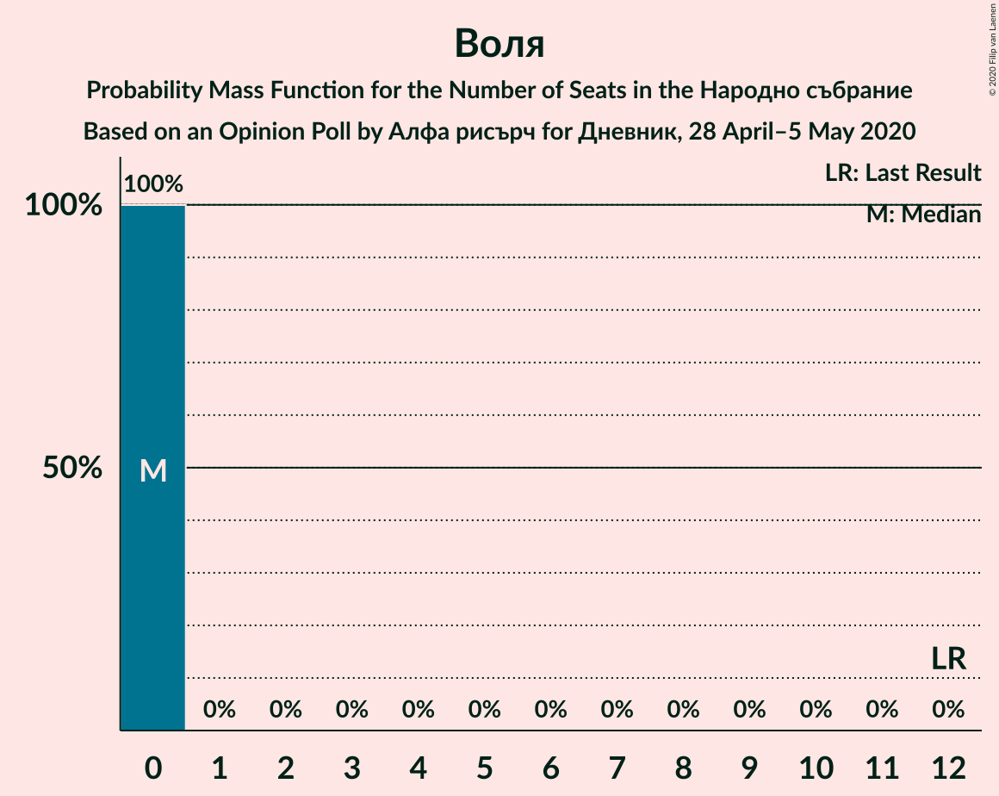

# Opinion Poll by Алфа рисърч for Дневник, 28 April–5 May 2020

<a href="#voting-intentions">Voting Intentions</a> | <a href="#seats">Seats</a> | <a href="#coalitions">Coalitions</a> | <a href="#technical-information">Technical Information</a>

## Voting Intentions

### Confidence Intervals

| Party | Last Result | Poll Result | 80% Confidence Interval | 90% Confidence Interval | 95% Confidence Interval | 99% Confidence Interval |
|:-----:|:-----------:|:-----------:|:-----------------------:|:-----------------------:|:-----------------------:|:-----------------------:|
| Граждани за европейско развитие на България | 33.5% | 33.4% | 31.1–35.9% |30.4–36.6% |29.8–37.3% |28.7–38.5% |
| Българска социалистическа партия | 27.9% | 19.6% | 17.7–21.8% |17.1–22.4% |16.7–22.9% |15.8–24.0% |
| Има такъв народ | 0.0% | 14.6% | 12.9–16.6% |12.5–17.1% |12.1–17.6% |11.3–18.6% |
| Движение за права и свободи | 9.2% | 10.3% | 8.9–12.0% |8.5–12.5% |8.1–12.9% |7.5–13.8% |
| Обединени Патриоти | 9.3% | 6.3% | 5.2–7.7% |4.9–8.1% |4.6–8.5% |4.1–9.2% |
| Демократична България | 0.0% | 5.9% | 4.9–7.3% |4.6–7.7% |4.3–8.1% |3.9–8.8% |
| Воля | 4.3% | 1.6% | 1.1–2.5% |1.0–2.7% |0.9–2.9% |0.7–3.4% |
| Атака | 0.0% | 1.4% | 1.0–2.3% |0.9–2.5% |0.8–2.7% |0.6–3.2% |

*Note:* The poll result column reflects the actual value used in the calculations. Published results may vary slightly, and in addition be rounded to fewer digits.

## Seats

### Confidence Intervals

| Party | Last Result | Median | 80% Confidence Interval | 90% Confidence Interval | 95% Confidence Interval | 99% Confidence Interval |
|:-----:|:-----------:|:------:|:-----------------------:|:-----------------------:|:-----------------------:|:-----------------------:|
| <a href="#граждани-за-европейско-развитие-на-българия">Граждани за европейско развитие на България</a> | 95 | 90 | 83–94 |81–95 |80–97 |77–100 |
| <a href="#българска-социалистическа-партия">Българска социалистическа партия</a> | 80 | 52 | 48–57 |46–58 |44–60 |43–63 |
| <a href="#има-такъв-народ">Има такъв народ</a> | 0 | 38 | 34–43 |33–45 |33–46 |30–49 |
| <a href="#движение-за-права-и-свободи">Движение за права и свободи</a> | 26 | 28 | 24–31 |22–32 |22–33 |21–36 |
| <a href="#обединени-патриоти">Обединени Патриоти</a> | 27 | 17 | 14–18 |14–20 |14–21 |12–24 |
| <a href="#демократична-българия">Демократична България</a> | 0 | 15 | 14–19 |13–20 |12–21 |11–23 |
| <a href="#воля">Воля</a> | 12 | 0 | 0 |0 |0 |0 |
| <a href="#атака">Атака</a> | 0 | 0 | 0 |0 |0 |0 |

### Граждани за европейско развитие на България

*For a full overview of the results for this party, see the [Граждани за европейско развитие на България](party-гражданизаевропейскоразвитиенабългария.html) page.*

| Number of Seats | Probability | Accumulated | Special Marks |
|:---------------:|:-----------:|:-----------:|:-------------:|
| 74 | 0% | 100% |  |
| 75 | 0.1% | 99.9% |  |
| 76 | 0.3% | 99.9% |  |
| 77 | 0.2% | 99.6% |  |
| 78 | 0.5% | 99.3% |  |
| 79 | 0.7% | 98.8% |  |
| 80 | 2% | 98% |  |
| 81 | 3% | 97% |  |
| 82 | 1.3% | 93% |  |
| 83 | 3% | 92% |  |
| 84 | 2% | 89% |  |
| 85 | 3% | 88% |  |
| 86 | 4% | 85% |  |
| 87 | 9% | 81% |  |
| 88 | 7% | 72% |  |
| 89 | 3% | 65% |  |
| 90 | 25% | 63% | Median |
| 91 | 6% | 38% |  |
| 92 | 13% | 31% |  |
| 93 | 4% | 18% |  |
| 94 | 5% | 13% |  |
| 95 | 4% | 8% | Last Result |
| 96 | 1.1% | 5% |  |
| 97 | 2% | 4% |  |
| 98 | 0.3% | 1.3% |  |
| 99 | 0.4% | 1.0% |  |
| 100 | 0.2% | 0.7% |  |
| 101 | 0.2% | 0.5% |  |
| 102 | 0.2% | 0.3% |  |
| 103 | 0.1% | 0.2% |  |
| 104 | 0% | 0.1% |  |
| 105 | 0% | 0.1% |  |
| 106 | 0% | 0.1% |  |
| 107 | 0% | 0% |  |

### Българска социалистическа партия

*For a full overview of the results for this party, see the [Българска социалистическа партия](party-българскасоциалистическапартия.html) page.*

| Number of Seats | Probability | Accumulated | Special Marks |
|:---------------:|:-----------:|:-----------:|:-------------:|
| 40 | 0.1% | 100% |  |
| 41 | 0% | 99.9% |  |
| 42 | 0.2% | 99.8% |  |
| 43 | 0.2% | 99.6% |  |
| 44 | 3% | 99.4% |  |
| 45 | 0.6% | 96% |  |
| 46 | 2% | 96% |  |
| 47 | 2% | 94% |  |
| 48 | 9% | 92% |  |
| 49 | 4% | 83% |  |
| 50 | 3% | 79% |  |
| 51 | 6% | 77% |  |
| 52 | 39% | 71% | Median |
| 53 | 4% | 32% |  |
| 54 | 5% | 28% |  |
| 55 | 2% | 23% |  |
| 56 | 9% | 21% |  |
| 57 | 6% | 11% |  |
| 58 | 2% | 6% |  |
| 59 | 2% | 4% |  |
| 60 | 1.2% | 3% |  |
| 61 | 0.5% | 1.4% |  |
| 62 | 0.2% | 0.9% |  |
| 63 | 0.3% | 0.8% |  |
| 64 | 0.2% | 0.5% |  |
| 65 | 0.3% | 0.3% |  |
| 66 | 0% | 0% |  |
| 67 | 0% | 0% |  |
| 68 | 0% | 0% |  |
| 69 | 0% | 0% |  |
| 70 | 0% | 0% |  |
| 71 | 0% | 0% |  |
| 72 | 0% | 0% |  |
| 73 | 0% | 0% |  |
| 74 | 0% | 0% |  |
| 75 | 0% | 0% |  |
| 76 | 0% | 0% |  |
| 77 | 0% | 0% |  |
| 78 | 0% | 0% |  |
| 79 | 0% | 0% |  |
| 80 | 0% | 0% | Last Result |

### Има такъв народ

*For a full overview of the results for this party, see the [Има такъв народ](party-иматакъвнарод.html) page.*

| Number of Seats | Probability | Accumulated | Special Marks |
|:---------------:|:-----------:|:-----------:|:-------------:|
| 0 | 0% | 100% | Last Result |
| 1 | 0% | 100% |  |
| 2 | 0% | 100% |  |
| 3 | 0% | 100% |  |
| 4 | 0% | 100% |  |
| 5 | 0% | 100% |  |
| 6 | 0% | 100% |  |
| 7 | 0% | 100% |  |
| 8 | 0% | 100% |  |
| 9 | 0% | 100% |  |
| 10 | 0% | 100% |  |
| 11 | 0% | 100% |  |
| 12 | 0% | 100% |  |
| 13 | 0% | 100% |  |
| 14 | 0% | 100% |  |
| 15 | 0% | 100% |  |
| 16 | 0% | 100% |  |
| 17 | 0% | 100% |  |
| 18 | 0% | 100% |  |
| 19 | 0% | 100% |  |
| 20 | 0% | 100% |  |
| 21 | 0% | 100% |  |
| 22 | 0% | 100% |  |
| 23 | 0% | 100% |  |
| 24 | 0% | 100% |  |
| 25 | 0% | 100% |  |
| 26 | 0% | 100% |  |
| 27 | 0% | 100% |  |
| 28 | 0% | 100% |  |
| 29 | 0.2% | 99.9% |  |
| 30 | 0.4% | 99.8% |  |
| 31 | 0.4% | 99.3% |  |
| 32 | 0.8% | 99.0% |  |
| 33 | 5% | 98% |  |
| 34 | 5% | 93% |  |
| 35 | 6% | 88% |  |
| 36 | 3% | 82% |  |
| 37 | 5% | 79% |  |
| 38 | 32% | 74% | Median |
| 39 | 7% | 42% |  |
| 40 | 13% | 35% |  |
| 41 | 5% | 22% |  |
| 42 | 5% | 17% |  |
| 43 | 4% | 12% |  |
| 44 | 2% | 8% |  |
| 45 | 4% | 6% |  |
| 46 | 2% | 3% |  |
| 47 | 0.2% | 1.2% |  |
| 48 | 0.3% | 0.9% |  |
| 49 | 0.3% | 0.6% |  |
| 50 | 0.1% | 0.3% |  |
| 51 | 0.1% | 0.2% |  |
| 52 | 0% | 0.1% |  |
| 53 | 0% | 0% |  |

### Движение за права и свободи

*For a full overview of the results for this party, see the [Движение за права и свободи](party-движениезаправаисвободи.html) page.*

| Number of Seats | Probability | Accumulated | Special Marks |
|:---------------:|:-----------:|:-----------:|:-------------:|
| 18 | 0.1% | 100% |  |
| 19 | 0.2% | 99.9% |  |
| 20 | 0.2% | 99.8% |  |
| 21 | 2% | 99.5% |  |
| 22 | 3% | 98% |  |
| 23 | 2% | 95% |  |
| 24 | 8% | 92% |  |
| 25 | 10% | 84% |  |
| 26 | 8% | 75% | Last Result |
| 27 | 9% | 67% |  |
| 28 | 28% | 57% | Median |
| 29 | 13% | 29% |  |
| 30 | 3% | 16% |  |
| 31 | 6% | 13% |  |
| 32 | 3% | 7% |  |
| 33 | 2% | 4% |  |
| 34 | 0.8% | 2% |  |
| 35 | 0.6% | 1.2% |  |
| 36 | 0.4% | 0.6% |  |
| 37 | 0.1% | 0.2% |  |
| 38 | 0% | 0.1% |  |
| 39 | 0% | 0.1% |  |
| 40 | 0% | 0% |  |

### Обединени Патриоти

*For a full overview of the results for this party, see the [Обединени Патриоти](party-обединенипатриоти.html) page.*

| Number of Seats | Probability | Accumulated | Special Marks |
|:---------------:|:-----------:|:-----------:|:-------------:|
| 0 | 0.2% | 100% |  |
| 1 | 0% | 99.8% |  |
| 2 | 0% | 99.8% |  |
| 3 | 0% | 99.8% |  |
| 4 | 0% | 99.8% |  |
| 5 | 0% | 99.8% |  |
| 6 | 0% | 99.8% |  |
| 7 | 0% | 99.8% |  |
| 8 | 0% | 99.8% |  |
| 9 | 0% | 99.8% |  |
| 10 | 0% | 99.8% |  |
| 11 | 0.2% | 99.8% |  |
| 12 | 0.5% | 99.6% |  |
| 13 | 2% | 99.2% |  |
| 14 | 8% | 98% |  |
| 15 | 9% | 90% |  |
| 16 | 16% | 81% |  |
| 17 | 48% | 65% | Median |
| 18 | 10% | 17% |  |
| 19 | 2% | 7% |  |
| 20 | 1.5% | 5% |  |
| 21 | 1.4% | 4% |  |
| 22 | 1.4% | 2% |  |
| 23 | 0.2% | 1.0% |  |
| 24 | 0.6% | 0.8% |  |
| 25 | 0.2% | 0.2% |  |
| 26 | 0% | 0% |  |
| 27 | 0% | 0% | Last Result |

### Демократична България

*For a full overview of the results for this party, see the [Демократична България](party-демократичнабългария.html) page.*

| Number of Seats | Probability | Accumulated | Special Marks |
|:---------------:|:-----------:|:-----------:|:-------------:|
| 0 | 0.4% | 100% | Last Result |
| 1 | 0% | 99.6% |  |
| 2 | 0% | 99.6% |  |
| 3 | 0% | 99.6% |  |
| 4 | 0% | 99.6% |  |
| 5 | 0% | 99.6% |  |
| 6 | 0% | 99.6% |  |
| 7 | 0% | 99.6% |  |
| 8 | 0% | 99.6% |  |
| 9 | 0% | 99.6% |  |
| 10 | 0% | 99.6% |  |
| 11 | 2% | 99.6% |  |
| 12 | 2% | 98% |  |
| 13 | 3% | 95% |  |
| 14 | 17% | 92% |  |
| 15 | 38% | 75% | Median |
| 16 | 8% | 37% |  |
| 17 | 6% | 29% |  |
| 18 | 9% | 23% |  |
| 19 | 5% | 14% |  |
| 20 | 6% | 9% |  |
| 21 | 2% | 4% |  |
| 22 | 0.7% | 2% |  |
| 23 | 0.8% | 0.9% |  |
| 24 | 0.1% | 0.1% |  |
| 25 | 0% | 0% |  |

### Воля

*For a full overview of the results for this party, see the [Воля](party-воля.html) page.*

| Number of Seats | Probability | Accumulated | Special Marks |
|:---------------:|:-----------:|:-----------:|:-------------:|
| 0 | 100% | 100% | Median |
| 1 | 0% | 0% |  |
| 2 | 0% | 0% |  |
| 3 | 0% | 0% |  |
| 4 | 0% | 0% |  |
| 5 | 0% | 0% |  |
| 6 | 0% | 0% |  |
| 7 | 0% | 0% |  |
| 8 | 0% | 0% |  |
| 9 | 0% | 0% |  |
| 10 | 0% | 0% |  |
| 11 | 0% | 0% |  |
| 12 | 0% | 0% | Last Result |

### Атака

*For a full overview of the results for this party, see the [Атака](party-атака.html) page.*

| Number of Seats | Probability | Accumulated | Special Marks |
|:---------------:|:-----------:|:-----------:|:-------------:|
| 0 | 100% | 100% | Last Result, Median |

## Coalitions

### Confidence Intervals

| Coalition | Last Result | Median | Majority? | 80% Confidence Interval | 90% Confidence Interval | 95% Confidence Interval | 99% Confidence Interval |
|:---------:|:-----------:|:------:|:---------:|:-----------------------:|:-----------------------:|:-----------------------:|:-----------------------:|
| Граждани за европейско развитие на България – Обединени Патриоти | 122 | 107 | 0.2% | 99–111 | 96–113 | 95–114 | 92–117 |
| Българска социалистическа партия – Движение за права и свободи | 106 | 80 | 0% | 75–85 | 73–86 | 71–88 | 69–91 |

### Граждани за европейско развитие на България – Обединени Патриоти

| Number of Seats | Probability | Accumulated | Special Marks |
|:---------------:|:-----------:|:-----------:|:-------------:|
| 90 | 0.1% | 100% |  |
| 91 | 0.1% | 99.8% |  |
| 92 | 0.4% | 99.7% |  |
| 93 | 0.2% | 99.3% |  |
| 94 | 0.7% | 99.0% |  |
| 95 | 0.9% | 98% |  |
| 96 | 3% | 97% |  |
| 97 | 2% | 95% |  |
| 98 | 2% | 92% |  |
| 99 | 1.2% | 90% |  |
| 100 | 4% | 89% |  |
| 101 | 1.5% | 86% |  |
| 102 | 4% | 84% |  |
| 103 | 6% | 81% |  |
| 104 | 6% | 75% |  |
| 105 | 0.7% | 68% |  |
| 106 | 7% | 68% |  |
| 107 | 23% | 61% | Median |
| 108 | 7% | 38% |  |
| 109 | 10% | 30% |  |
| 110 | 7% | 20% |  |
| 111 | 4% | 13% |  |
| 112 | 2% | 8% |  |
| 113 | 2% | 7% |  |
| 114 | 2% | 4% |  |
| 115 | 0.7% | 2% |  |
| 116 | 0.4% | 1.0% |  |
| 117 | 0.2% | 0.6% |  |
| 118 | 0.1% | 0.4% |  |
| 119 | 0.1% | 0.3% |  |
| 120 | 0.1% | 0.2% |  |
| 121 | 0% | 0.2% | Majority |
| 122 | 0% | 0.1% | Last Result |
| 123 | 0% | 0.1% |  |
| 124 | 0% | 0.1% |  |
| 125 | 0% | 0% |  |

### Българска социалистическа партия – Движение за права и свободи

| Number of Seats | Probability | Accumulated | Special Marks |
|:---------------:|:-----------:|:-----------:|:-------------:|
| 66 | 0% | 100% |  |
| 67 | 0.1% | 99.9% |  |
| 68 | 0.1% | 99.8% |  |
| 69 | 0.9% | 99.7% |  |
| 70 | 0.3% | 98.8% |  |
| 71 | 2% | 98.5% |  |
| 72 | 0.7% | 97% |  |
| 73 | 3% | 96% |  |
| 74 | 2% | 93% |  |
| 75 | 7% | 92% |  |
| 76 | 7% | 85% |  |
| 77 | 11% | 78% |  |
| 78 | 4% | 68% |  |
| 79 | 3% | 64% |  |
| 80 | 30% | 61% | Median |
| 81 | 2% | 30% |  |
| 82 | 5% | 29% |  |
| 83 | 9% | 24% |  |
| 84 | 3% | 15% |  |
| 85 | 7% | 12% |  |
| 86 | 1.5% | 5% |  |
| 87 | 1.1% | 4% |  |
| 88 | 0.9% | 3% |  |
| 89 | 1.0% | 2% |  |
| 90 | 0.4% | 1.0% |  |
| 91 | 0.3% | 0.6% |  |
| 92 | 0.1% | 0.3% |  |
| 93 | 0.1% | 0.2% |  |
| 94 | 0.1% | 0.1% |  |
| 95 | 0% | 0.1% |  |
| 96 | 0% | 0% |  |
| 97 | 0% | 0% |  |
| 98 | 0% | 0% |  |
| 99 | 0% | 0% |  |
| 100 | 0% | 0% |  |
| 101 | 0% | 0% |  |
| 102 | 0% | 0% |  |
| 103 | 0% | 0% |  |
| 104 | 0% | 0% |  |
| 105 | 0% | 0% |  |
| 106 | 0% | 0% | Last Result |

## Technical Information

### Opinion Poll

+ **Polling firm:** Алфа рисърч
+ **Commissioner(s):** Дневник
+ **Fieldwork period:** 28 April–5 May 2020

### Calculations

+ **Sample size:** 622
+ **Simulations done:** 131,072
+ **Error estimate:** 1.71%

