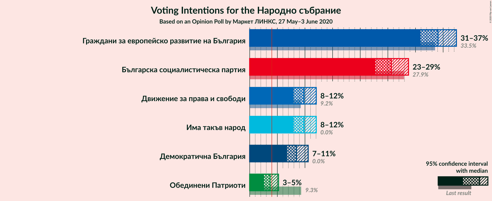
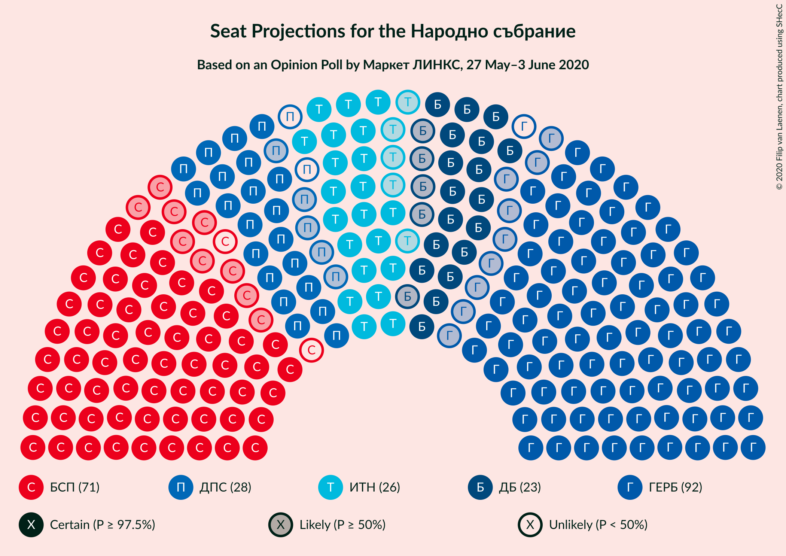
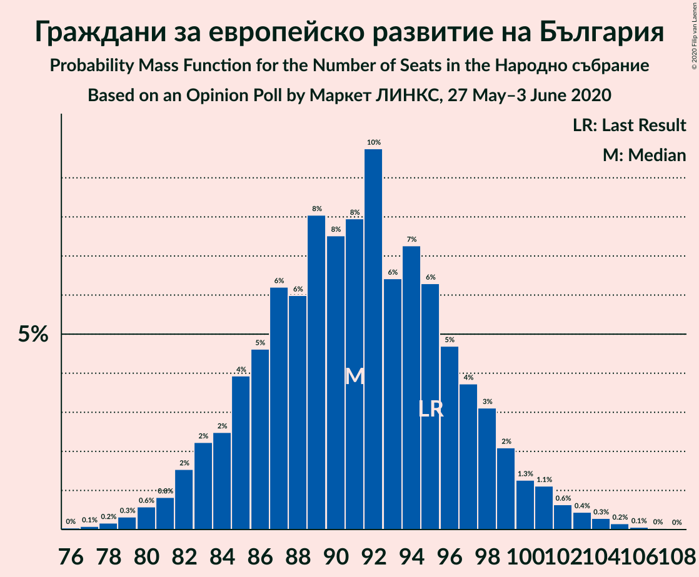
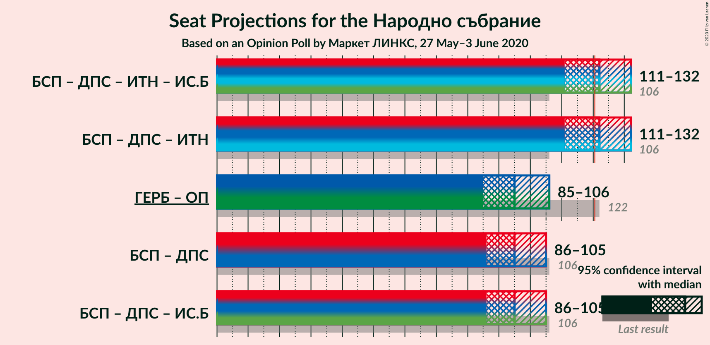

# Opinion Poll by Маркет ЛИНКС, 27 May–3 June 2020

<a href="#voting-intentions">Voting Intentions</a> | <a href="#seats">Seats</a> | <a href="#coalitions">Coalitions</a> | <a href="#technical-information">Technical Information</a>

## Voting Intentions

### Confidence Intervals

| Party | Last Result | Poll Result | 80% Confidence Interval | 90% Confidence Interval | 95% Confidence Interval | 99% Confidence Interval |
|:-----:|:-----------:|:-----------:|:-----------------------:|:-----------------------:|:-----------------------:|:-----------------------:|
| Граждани за европейско развитие на България | 33.5% | 34.1% | 32.0–36.2% |31.4–36.9% |30.9–37.4% |29.9–38.5% |
| Българска социалистическа партия | 27.9% | 25.6% | 23.7–27.6% |23.2–28.2% |22.7–28.7% |21.9–29.7% |
| Движение за права и свободи | 9.2% | 9.8% | 8.6–11.3% |8.2–11.7% |7.9–12.0% |7.4–12.8% |
| Има такъв народ | 0.0% | 9.8% | 8.6–11.3% |8.2–11.7% |7.9–12.0% |7.4–12.8% |
| Демократична България | 0.0% | 8.5% | 7.3–9.8% |7.0–10.2% |6.7–10.6% |6.2–11.3% |
| ВМРО–Българско Национално Движение | 0.0% | 3.7% | 3.0–4.7% |2.8–5.0% |2.6–5.2% |2.3–5.7% |

*Note:* The poll result column reflects the actual value used in the calculations. Published results may vary slightly, and in addition be rounded to fewer digits.

## Seats

### Confidence Intervals

| Party | Last Result | Median | 80% Confidence Interval | 90% Confidence Interval | 95% Confidence Interval | 99% Confidence Interval |
|:-----:|:-----------:|:------:|:-----------------------:|:-----------------------:|:-----------------------:|:-----------------------:|
| <a href="#граждани-за-европейско-развитие-на-българия">Граждани за европейско развитие на България</a> | 95 | 90 | 84–95 |82–97 |81–100 |79–103 |
| <a href="#българска-социалистическа-партия">Българска социалистическа партия</a> | 80 | 69 | 64–75 |62–76 |60–77 |58–80 |
| <a href="#движение-за-права-и-свободи">Движение за права и свободи</a> | 26 | 27 | 23–30 |22–31 |21–32 |20–35 |
| <a href="#има-такъв-народ">Има такъв народ</a> | 0 | 27 | 24–31 |23–31 |22–32 |20–35 |
| <a href="#демократична-българия">Демократична България</a> | 0 | 23 | 20–27 |19–28 |18–29 |17–31 |
| <a href="#вмро–българско-национално-движение">ВМРО–Българско Национално Движение</a> | 0 | 0 | 0–12 |0–13 |0–13 |0–15 |

### Граждани за европейско развитие на България

*For a full overview of the results for this party, see the [Граждани за европейско развитие на България](party-гражданизаевропейскоразвитиенабългария.html) page.*

| Number of Seats | Probability | Accumulated | Special Marks |
|:---------------:|:-----------:|:-----------:|:-------------:|
| 76 | 0.1% | 100% |  |
| 77 | 0.2% | 99.9% |  |
| 78 | 0.2% | 99.8% |  |
| 79 | 0.3% | 99.5% |  |
| 80 | 0.5% | 99.2% |  |
| 81 | 1.2% | 98.7% |  |
| 82 | 3% | 97% |  |
| 83 | 3% | 95% |  |
| 84 | 2% | 91% |  |
| 85 | 5% | 89% |  |
| 86 | 7% | 85% |  |
| 87 | 10% | 77% |  |
| 88 | 8% | 68% |  |
| 89 | 9% | 60% |  |
| 90 | 4% | 50% | Median |
| 91 | 7% | 46% |  |
| 92 | 11% | 39% |  |
| 93 | 4% | 29% |  |
| 94 | 14% | 24% |  |
| 95 | 3% | 10% | Last Result |
| 96 | 0.9% | 7% |  |
| 97 | 2% | 6% |  |
| 98 | 0.7% | 4% |  |
| 99 | 0.5% | 3% |  |
| 100 | 2% | 3% |  |
| 101 | 0.2% | 1.4% |  |
| 102 | 0.4% | 1.3% |  |
| 103 | 0.3% | 0.8% |  |
| 104 | 0.1% | 0.5% |  |
| 105 | 0.3% | 0.4% |  |
| 106 | 0.1% | 0.1% |  |
| 107 | 0% | 0.1% |  |
| 108 | 0% | 0% |  |

### Българска социалистическа партия

*For a full overview of the results for this party, see the [Българска социалистическа партия](party-българскасоциалистическапартия.html) page.*

| Number of Seats | Probability | Accumulated | Special Marks |
|:---------------:|:-----------:|:-----------:|:-------------:|
| 55 | 0% | 100% |  |
| 56 | 0.1% | 99.9% |  |
| 57 | 0.2% | 99.9% |  |
| 58 | 0.4% | 99.7% |  |
| 59 | 0.7% | 99.3% |  |
| 60 | 1.4% | 98.5% |  |
| 61 | 1.4% | 97% |  |
| 62 | 2% | 96% |  |
| 63 | 3% | 94% |  |
| 64 | 6% | 91% |  |
| 65 | 8% | 85% |  |
| 66 | 4% | 77% |  |
| 67 | 7% | 72% |  |
| 68 | 11% | 66% |  |
| 69 | 11% | 54% | Median |
| 70 | 16% | 43% |  |
| 71 | 5% | 27% |  |
| 72 | 5% | 22% |  |
| 73 | 4% | 17% |  |
| 74 | 4% | 14% |  |
| 75 | 5% | 10% |  |
| 76 | 1.5% | 5% |  |
| 77 | 2% | 4% |  |
| 78 | 0.5% | 2% |  |
| 79 | 0.5% | 2% |  |
| 80 | 0.7% | 1.1% | Last Result |
| 81 | 0.2% | 0.4% |  |
| 82 | 0.1% | 0.2% |  |
| 83 | 0% | 0.1% |  |
| 84 | 0% | 0% |  |

### Движение за права и свободи

*For a full overview of the results for this party, see the [Движение за права и свободи](party-движениезаправаисвободи.html) page.*

| Number of Seats | Probability | Accumulated | Special Marks |
|:---------------:|:-----------:|:-----------:|:-------------:|
| 18 | 0% | 100% |  |
| 19 | 0.3% | 99.9% |  |
| 20 | 0.9% | 99.7% |  |
| 21 | 2% | 98.7% |  |
| 22 | 4% | 97% |  |
| 23 | 7% | 93% |  |
| 24 | 12% | 85% |  |
| 25 | 9% | 73% |  |
| 26 | 14% | 65% | Last Result |
| 27 | 15% | 51% | Median |
| 28 | 13% | 36% |  |
| 29 | 12% | 23% |  |
| 30 | 3% | 12% |  |
| 31 | 5% | 9% |  |
| 32 | 1.2% | 4% |  |
| 33 | 2% | 2% |  |
| 34 | 0.2% | 0.8% |  |
| 35 | 0.4% | 0.6% |  |
| 36 | 0.1% | 0.2% |  |
| 37 | 0% | 0.1% |  |
| 38 | 0% | 0% |  |

### Има такъв народ

*For a full overview of the results for this party, see the [Има такъв народ](party-иматакъвнарод.html) page.*

| Number of Seats | Probability | Accumulated | Special Marks |
|:---------------:|:-----------:|:-----------:|:-------------:|
| 0 | 0% | 100% | Last Result |
| 1 | 0% | 100% |  |
| 2 | 0% | 100% |  |
| 3 | 0% | 100% |  |
| 4 | 0% | 100% |  |
| 5 | 0% | 100% |  |
| 6 | 0% | 100% |  |
| 7 | 0% | 100% |  |
| 8 | 0% | 100% |  |
| 9 | 0% | 100% |  |
| 10 | 0% | 100% |  |
| 11 | 0% | 100% |  |
| 12 | 0% | 100% |  |
| 13 | 0% | 100% |  |
| 14 | 0% | 100% |  |
| 15 | 0% | 100% |  |
| 16 | 0% | 100% |  |
| 17 | 0% | 100% |  |
| 18 | 0% | 100% |  |
| 19 | 0.2% | 99.9% |  |
| 20 | 0.3% | 99.7% |  |
| 21 | 1.0% | 99.4% |  |
| 22 | 2% | 98% |  |
| 23 | 4% | 97% |  |
| 24 | 8% | 93% |  |
| 25 | 12% | 85% |  |
| 26 | 17% | 73% |  |
| 27 | 12% | 55% | Median |
| 28 | 11% | 43% |  |
| 29 | 10% | 33% |  |
| 30 | 12% | 23% |  |
| 31 | 6% | 11% |  |
| 32 | 2% | 5% |  |
| 33 | 0.8% | 2% |  |
| 34 | 1.0% | 2% |  |
| 35 | 0.3% | 0.6% |  |
| 36 | 0.2% | 0.3% |  |
| 37 | 0% | 0.1% |  |
| 38 | 0% | 0% |  |

### Демократична България

*For a full overview of the results for this party, see the [Демократична България](party-демократичнабългария.html) page.*

| Number of Seats | Probability | Accumulated | Special Marks |
|:---------------:|:-----------:|:-----------:|:-------------:|
| 0 | 0% | 100% | Last Result |
| 1 | 0% | 100% |  |
| 2 | 0% | 100% |  |
| 3 | 0% | 100% |  |
| 4 | 0% | 100% |  |
| 5 | 0% | 100% |  |
| 6 | 0% | 100% |  |
| 7 | 0% | 100% |  |
| 8 | 0% | 100% |  |
| 9 | 0% | 100% |  |
| 10 | 0% | 100% |  |
| 11 | 0% | 100% |  |
| 12 | 0% | 100% |  |
| 13 | 0% | 100% |  |
| 14 | 0% | 100% |  |
| 15 | 0% | 100% |  |
| 16 | 0.3% | 99.9% |  |
| 17 | 0.5% | 99.7% |  |
| 18 | 2% | 99.2% |  |
| 19 | 4% | 97% |  |
| 20 | 7% | 94% |  |
| 21 | 9% | 87% |  |
| 22 | 9% | 78% |  |
| 23 | 21% | 70% | Median |
| 24 | 15% | 48% |  |
| 25 | 12% | 33% |  |
| 26 | 9% | 21% |  |
| 27 | 5% | 12% |  |
| 28 | 4% | 7% |  |
| 29 | 2% | 3% |  |
| 30 | 1.0% | 2% |  |
| 31 | 0.3% | 0.5% |  |
| 32 | 0.2% | 0.2% |  |
| 33 | 0.1% | 0.1% |  |
| 34 | 0% | 0% |  |

### ВМРО–Българско Национално Движение

*For a full overview of the results for this party, see the [ВМРО–Българско Национално Движение](party-вмро–българсконационалнодвижение.html) page.*

| Number of Seats | Probability | Accumulated | Special Marks |
|:---------------:|:-----------:|:-----------:|:-------------:|
| 0 | 65% | 100% | Last Result, Median |
| 1 | 0% | 35% |  |
| 2 | 0% | 35% |  |
| 3 | 0% | 35% |  |
| 4 | 0% | 35% |  |
| 5 | 0% | 35% |  |
| 6 | 0% | 35% |  |
| 7 | 0% | 35% |  |
| 8 | 0% | 35% |  |
| 9 | 0% | 35% |  |
| 10 | 0.4% | 35% |  |
| 11 | 18% | 35% |  |
| 12 | 11% | 17% |  |
| 13 | 4% | 6% |  |
| 14 | 2% | 2% |  |
| 15 | 0.5% | 0.8% |  |
| 16 | 0.2% | 0.3% |  |
| 17 | 0% | 0.1% |  |
| 18 | 0% | 0% |  |

## Coalitions

### Confidence Intervals

| Coalition | Last Result | Median | Majority? | 80% Confidence Interval | 90% Confidence Interval | 95% Confidence Interval | 99% Confidence Interval |
|:---------:|:-----------:|:------:|:---------:|:-----------------------:|:-----------------------:|:-----------------------:|:-----------------------:|
| Българска социалистическа партия – Движение за права и свободи | 106 | 96 | 0% | 88–102 | 88–104 | 86–105 | 83–108 |

### Българска социалистическа партия – Движение за права и свободи

| Number of Seats | Probability | Accumulated | Special Marks |
|:---------------:|:-----------:|:-----------:|:-------------:|
| 80 | 0% | 100% |  |
| 81 | 0.1% | 99.9% |  |
| 82 | 0.1% | 99.8% |  |
| 83 | 0.2% | 99.7% |  |
| 84 | 0.9% | 99.4% |  |
| 85 | 0.6% | 98.5% |  |
| 86 | 0.8% | 98% |  |
| 87 | 2% | 97% |  |
| 88 | 6% | 96% |  |
| 89 | 1.3% | 90% |  |
| 90 | 3% | 88% |  |
| 91 | 8% | 86% |  |
| 92 | 4% | 78% |  |
| 93 | 10% | 74% |  |
| 94 | 8% | 64% |  |
| 95 | 4% | 57% |  |
| 96 | 9% | 52% | Median |
| 97 | 16% | 44% |  |
| 98 | 6% | 28% |  |
| 99 | 6% | 21% |  |
| 100 | 4% | 16% |  |
| 101 | 2% | 12% |  |
| 102 | 2% | 10% |  |
| 103 | 3% | 8% |  |
| 104 | 2% | 5% |  |
| 105 | 0.7% | 3% |  |
| 106 | 0.6% | 2% | Last Result |
| 107 | 0.8% | 1.5% |  |
| 108 | 0.3% | 0.6% |  |
| 109 | 0.2% | 0.3% |  |
| 110 | 0% | 0.1% |  |
| 111 | 0% | 0.1% |  |
| 112 | 0% | 0% |  |

## Technical Information

### Opinion Poll

+ **Polling firm:** Маркет ЛИНКС
+ **Commissioner(s):** —
+ **Fieldwork period:** 27 May–3 June 2020

### Calculations

+ **Sample size:** 816
+ **Simulations done:** 131,072
+ **Error estimate:** 2.45%

