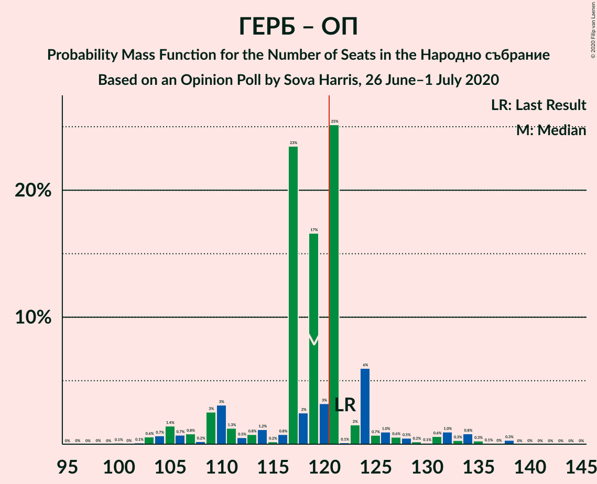

# Opinion Poll by Sova Harris, 26 June–1 July 2020

<a href="#voting-intentions">Voting Intentions</a> | <a href="#seats">Seats</a> | <a href="#coalitions">Coalitions</a> | <a href="#technical-information">Technical Information</a>

## Voting Intentions

### Confidence Intervals

| Party | Last Result | Poll Result | 80% Confidence Interval | 90% Confidence Interval | 95% Confidence Interval | 99% Confidence Interval |
|:-----:|:-----------:|:-----------:|:-----------------------:|:-----------------------:|:-----------------------:|:-----------------------:|
| Граждани за европейско развитие на България | 33.5% | 37.4% | 34.8–40.0% |34.1–40.8% |33.5–41.4% |32.3–42.7% |
| Българска социалистическа партия | 27.9% | 21.4% | 19.3–23.7% |18.7–24.4% |18.2–25.0% |17.3–26.1% |
| Има такъв народ | 0.0% | 9.1% | 7.7–10.9% |7.3–11.3% |7.0–11.8% |6.4–12.7% |
| Движение за права и свободи | 9.2% | 7.7% | 6.4–9.3% |6.1–9.8% |5.8–10.2% |5.2–11.0% |
| Обединени Патриоти | 9.3% | 7.5% | 6.3–9.2% |5.9–9.6% |5.7–10.0% |5.1–10.8% |
| Воля | 4.3% | 4.2% | 3.3–5.5% |3.0–5.9% |2.9–6.2% |2.5–6.9% |
| Демократична България | 0.0% | 4.2% | 3.3–5.5% |3.0–5.9% |2.9–6.2% |2.5–6.9% |
| Възраждане | 0.0% | 2.8% | 2.1–3.9% |1.9–4.2% |1.7–4.5% |1.4–5.1% |
| Изправи се Бг | 0.0% | 2.6% | 2.0–3.7% |1.8–4.0% |1.6–4.3% |1.3–4.9% |
| Алтернатива за българско възраждане | 1.6% | 1.8% | 1.2–2.7% |1.1–3.0% |1.0–3.2% |0.7–3.7% |
| Атака | 0.0% | 1.2% | 0.8–2.1% |0.7–2.3% |0.6–2.5% |0.4–3.0% |

*Note:* The poll result column reflects the actual value used in the calculations. Published results may vary slightly, and in addition be rounded to fewer digits.

## Seats

### Confidence Intervals

| Party | Last Result | Median | 80% Confidence Interval | 90% Confidence Interval | 95% Confidence Interval | 99% Confidence Interval |
|:-----:|:-----------:|:------:|:-----------------------:|:-----------------------:|:-----------------------:|:-----------------------:|
| <a href="#граждани-за-европейско-развитие-на-българия">Граждани за европейско развитие на България</a> | 95 | 100 | 93–106 |89–106 |88–109 |84–115 |
| <a href="#българска-социалистическа-партия">Българска социалистическа партия</a> | 80 | 59 | 53–62 |51–64 |48–64 |46–68 |
| <a href="#има-такъв-народ">Има такъв народ</a> | 0 | 26 | 22–28 |21–29 |19–32 |18–37 |
| <a href="#движение-за-права-и-свободи">Движение за права и свободи</a> | 26 | 19 | 18–24 |16–25 |16–26 |15–30 |
| <a href="#обединени-патриоти">Обединени Патриоти</a> | 27 | 20 | 17–23 |16–25 |14–27 |14–28 |
| <a href="#воля">Воля</a> | 12 | 0 | 0–14 |0–14 |0–16 |0–18 |
| <a href="#демократична-българия">Демократична България</a> | 0 | 12 | 0–14 |0–14 |0–15 |0–18 |
| <a href="#възраждане">Възраждане</a> | 0 | 0 | 0–12 |0–12 |0–12 |0–14 |
| <a href="#изправи-се-бг">Изправи се Бг</a> | 0 | 0 | 0 |0–10 |0–11 |0–12 |
| <a href="#алтернатива-за-българско-възраждане">Алтернатива за българско възраждане</a> | 0 | 0 | 0 |0 |0 |0 |
| <a href="#атака">Атака</a> | 0 | 0 | 0 |0 |0 |0 |

### Граждани за европейско развитие на България

*For a full overview of the results for this party, see the [Граждани за европейско развитие на България](party-гражданизаевропейскоразвитиенабългария.html) page.*

| Number of Seats | Probability | Accumulated | Special Marks |
|:---------------:|:-----------:|:-----------:|:-------------:|
| 79 | 0.1% | 100% |  |
| 80 | 0.1% | 99.9% |  |
| 81 | 0.2% | 99.8% |  |
| 82 | 0.1% | 99.7% |  |
| 83 | 0% | 99.6% |  |
| 84 | 0.1% | 99.6% |  |
| 85 | 0.1% | 99.4% |  |
| 86 | 0.6% | 99.3% |  |
| 87 | 0.9% | 98.7% |  |
| 88 | 2% | 98% |  |
| 89 | 2% | 96% |  |
| 90 | 1.2% | 93% |  |
| 91 | 1.4% | 92% |  |
| 92 | 0.5% | 91% |  |
| 93 | 3% | 90% |  |
| 94 | 0.6% | 87% |  |
| 95 | 0.9% | 87% | Last Result |
| 96 | 18% | 86% |  |
| 97 | 2% | 68% |  |
| 98 | 2% | 65% |  |
| 99 | 1.4% | 63% |  |
| 100 | 24% | 62% | Median |
| 101 | 23% | 38% |  |
| 102 | 0.8% | 15% |  |
| 103 | 2% | 14% |  |
| 104 | 1.3% | 12% |  |
| 105 | 0.2% | 11% |  |
| 106 | 6% | 11% |  |
| 107 | 0.5% | 5% |  |
| 108 | 1.5% | 4% |  |
| 109 | 0.5% | 3% |  |
| 110 | 0.4% | 2% |  |
| 111 | 0.3% | 2% |  |
| 112 | 0.1% | 1.5% |  |
| 113 | 0.3% | 1.4% |  |
| 114 | 0% | 1.0% |  |
| 115 | 1.0% | 1.0% |  |
| 116 | 0% | 0.1% |  |
| 117 | 0% | 0% |  |

### Българска социалистическа партия

*For a full overview of the results for this party, see the [Българска социалистическа партия](party-българскасоциалистическапартия.html) page.*

| Number of Seats | Probability | Accumulated | Special Marks |
|:---------------:|:-----------:|:-----------:|:-------------:|
| 42 | 0.1% | 100% |  |
| 43 | 0.1% | 99.9% |  |
| 44 | 0.1% | 99.8% |  |
| 45 | 0.1% | 99.7% |  |
| 46 | 0.3% | 99.5% |  |
| 47 | 1.4% | 99.2% |  |
| 48 | 1.1% | 98% |  |
| 49 | 0.9% | 97% |  |
| 50 | 0.7% | 96% |  |
| 51 | 3% | 95% |  |
| 52 | 2% | 92% |  |
| 53 | 5% | 90% |  |
| 54 | 1.4% | 85% |  |
| 55 | 0.8% | 83% |  |
| 56 | 25% | 83% |  |
| 57 | 3% | 58% |  |
| 58 | 0.4% | 55% |  |
| 59 | 27% | 54% | Median |
| 60 | 0.7% | 28% |  |
| 61 | 17% | 27% |  |
| 62 | 1.0% | 10% |  |
| 63 | 1.1% | 9% |  |
| 64 | 6% | 8% |  |
| 65 | 0.4% | 2% |  |
| 66 | 0.2% | 2% |  |
| 67 | 0.2% | 1.3% |  |
| 68 | 0.8% | 1.2% |  |
| 69 | 0.1% | 0.4% |  |
| 70 | 0.2% | 0.3% |  |
| 71 | 0% | 0.1% |  |
| 72 | 0% | 0.1% |  |
| 73 | 0% | 0.1% |  |
| 74 | 0% | 0.1% |  |
| 75 | 0% | 0% |  |
| 76 | 0% | 0% |  |
| 77 | 0% | 0% |  |
| 78 | 0% | 0% |  |
| 79 | 0% | 0% |  |
| 80 | 0% | 0% | Last Result |

### Има такъв народ

*For a full overview of the results for this party, see the [Има такъв народ](party-иматакъвнарод.html) page.*

| Number of Seats | Probability | Accumulated | Special Marks |
|:---------------:|:-----------:|:-----------:|:-------------:|
| 0 | 0% | 100% | Last Result |
| 1 | 0% | 100% |  |
| 2 | 0% | 100% |  |
| 3 | 0% | 100% |  |
| 4 | 0% | 100% |  |
| 5 | 0% | 100% |  |
| 6 | 0% | 100% |  |
| 7 | 0% | 100% |  |
| 8 | 0% | 100% |  |
| 9 | 0% | 100% |  |
| 10 | 0% | 100% |  |
| 11 | 0% | 100% |  |
| 12 | 0% | 100% |  |
| 13 | 0% | 100% |  |
| 14 | 0% | 100% |  |
| 15 | 0% | 100% |  |
| 16 | 0% | 100% |  |
| 17 | 0.4% | 99.9% |  |
| 18 | 0.8% | 99.6% |  |
| 19 | 1.4% | 98.8% |  |
| 20 | 2% | 97% |  |
| 21 | 3% | 95% |  |
| 22 | 27% | 93% |  |
| 23 | 7% | 66% |  |
| 24 | 1.5% | 58% |  |
| 25 | 3% | 57% |  |
| 26 | 6% | 54% | Median |
| 27 | 17% | 49% |  |
| 28 | 26% | 32% |  |
| 29 | 1.1% | 5% |  |
| 30 | 0.6% | 4% |  |
| 31 | 0.8% | 4% |  |
| 32 | 1.0% | 3% |  |
| 33 | 0.2% | 2% |  |
| 34 | 0.2% | 2% |  |
| 35 | 0.2% | 2% |  |
| 36 | 0.6% | 1.4% |  |
| 37 | 0.8% | 0.8% |  |
| 38 | 0% | 0% |  |

### Движение за права и свободи

*For a full overview of the results for this party, see the [Движение за права и свободи](party-движениезаправаисвободи.html) page.*

| Number of Seats | Probability | Accumulated | Special Marks |
|:---------------:|:-----------:|:-----------:|:-------------:|
| 13 | 0.1% | 100% |  |
| 14 | 0.2% | 99.9% |  |
| 15 | 0.3% | 99.7% |  |
| 16 | 7% | 99.5% |  |
| 17 | 3% | 93% |  |
| 18 | 3% | 90% |  |
| 19 | 41% | 87% | Median |
| 20 | 25% | 46% |  |
| 21 | 2% | 21% |  |
| 22 | 5% | 19% |  |
| 23 | 4% | 14% |  |
| 24 | 5% | 10% |  |
| 25 | 2% | 6% |  |
| 26 | 2% | 3% | Last Result |
| 27 | 0.4% | 2% |  |
| 28 | 0.3% | 1.4% |  |
| 29 | 0.3% | 1.1% |  |
| 30 | 0.4% | 0.8% |  |
| 31 | 0.1% | 0.4% |  |
| 32 | 0% | 0.3% |  |
| 33 | 0.2% | 0.3% |  |
| 34 | 0% | 0% |  |

### Обединени Патриоти

*For a full overview of the results for this party, see the [Обединени Патриоти](party-обединенипатриоти.html) page.*

| Number of Seats | Probability | Accumulated | Special Marks |
|:---------------:|:-----------:|:-----------:|:-------------:|
| 12 | 0.1% | 100% |  |
| 13 | 0.1% | 99.9% |  |
| 14 | 3% | 99.9% |  |
| 15 | 0.5% | 97% |  |
| 16 | 3% | 97% |  |
| 17 | 28% | 94% |  |
| 18 | 7% | 66% |  |
| 19 | 2% | 59% |  |
| 20 | 25% | 57% | Median |
| 21 | 6% | 32% |  |
| 22 | 3% | 26% |  |
| 23 | 18% | 24% |  |
| 24 | 0.7% | 6% |  |
| 25 | 2% | 5% |  |
| 26 | 0.8% | 4% |  |
| 27 | 2% | 3% | Last Result |
| 28 | 0.2% | 0.6% |  |
| 29 | 0.2% | 0.4% |  |
| 30 | 0.1% | 0.1% |  |
| 31 | 0% | 0.1% |  |
| 32 | 0% | 0% |  |

### Воля

*For a full overview of the results for this party, see the [Воля](party-воля.html) page.*

| Number of Seats | Probability | Accumulated | Special Marks |
|:---------------:|:-----------:|:-----------:|:-------------:|
| 0 | 53% | 100% | Median |
| 1 | 0% | 47% |  |
| 2 | 0% | 47% |  |
| 3 | 0% | 47% |  |
| 4 | 0% | 47% |  |
| 5 | 0% | 47% |  |
| 6 | 0% | 47% |  |
| 7 | 0% | 47% |  |
| 8 | 0% | 47% |  |
| 9 | 0% | 47% |  |
| 10 | 0.1% | 47% |  |
| 11 | 4% | 47% |  |
| 12 | 7% | 43% | Last Result |
| 13 | 10% | 37% |  |
| 14 | 24% | 27% |  |
| 15 | 0.4% | 3% |  |
| 16 | 2% | 3% |  |
| 17 | 0.1% | 1.0% |  |
| 18 | 0.7% | 0.8% |  |
| 19 | 0% | 0.1% |  |
| 20 | 0% | 0% |  |

### Демократична България

*For a full overview of the results for this party, see the [Демократична България](party-демократичнабългария.html) page.*

| Number of Seats | Probability | Accumulated | Special Marks |
|:---------------:|:-----------:|:-----------:|:-------------:|
| 0 | 38% | 100% | Last Result |
| 1 | 0% | 62% |  |
| 2 | 0% | 62% |  |
| 3 | 0% | 62% |  |
| 4 | 0% | 62% |  |
| 5 | 0% | 62% |  |
| 6 | 0% | 62% |  |
| 7 | 0% | 62% |  |
| 8 | 0% | 62% |  |
| 9 | 0% | 62% |  |
| 10 | 0.1% | 62% |  |
| 11 | 6% | 62% |  |
| 12 | 30% | 56% | Median |
| 13 | 2% | 27% |  |
| 14 | 20% | 24% |  |
| 15 | 2% | 4% |  |
| 16 | 1.4% | 2% |  |
| 17 | 0.5% | 1.0% |  |
| 18 | 0.2% | 0.6% |  |
| 19 | 0.3% | 0.3% |  |
| 20 | 0% | 0.1% |  |
| 21 | 0% | 0% |  |

### Възраждане

*For a full overview of the results for this party, see the [Възраждане](party-възраждане.html) page.*

| Number of Seats | Probability | Accumulated | Special Marks |
|:---------------:|:-----------:|:-----------:|:-------------:|
| 0 | 72% | 100% | Last Result, Median |
| 1 | 0% | 28% |  |
| 2 | 0% | 28% |  |
| 3 | 0% | 28% |  |
| 4 | 0% | 28% |  |
| 5 | 0% | 28% |  |
| 6 | 0% | 28% |  |
| 7 | 0% | 28% |  |
| 8 | 0% | 28% |  |
| 9 | 0% | 28% |  |
| 10 | 0.8% | 28% |  |
| 11 | 2% | 27% |  |
| 12 | 24% | 25% |  |
| 13 | 0.9% | 2% |  |
| 14 | 0.4% | 0.6% |  |
| 15 | 0.2% | 0.2% |  |
| 16 | 0% | 0% |  |

### Изправи се Бг

*For a full overview of the results for this party, see the [Изправи се Бг](party-изправисебг.html) page.*

| Number of Seats | Probability | Accumulated | Special Marks |
|:---------------:|:-----------:|:-----------:|:-------------:|
| 0 | 93% | 100% | Last Result, Median |
| 1 | 0% | 7% |  |
| 2 | 0% | 7% |  |
| 3 | 0% | 7% |  |
| 4 | 0% | 7% |  |
| 5 | 0% | 7% |  |
| 6 | 0% | 7% |  |
| 7 | 0% | 7% |  |
| 8 | 0% | 7% |  |
| 9 | 0% | 7% |  |
| 10 | 2% | 7% |  |
| 11 | 3% | 4% |  |
| 12 | 1.5% | 2% |  |
| 13 | 0% | 0.1% |  |
| 14 | 0.1% | 0.1% |  |
| 15 | 0% | 0% |  |

### Алтернатива за българско възраждане

*For a full overview of the results for this party, see the [Алтернатива за българско възраждане](party-алтернативазабългарсковъзраждане.html) page.*

| Number of Seats | Probability | Accumulated | Special Marks |
|:---------------:|:-----------:|:-----------:|:-------------:|
| 0 | 99.9% | 100% | Last Result, Median |
| 1 | 0% | 0.1% |  |
| 2 | 0% | 0.1% |  |
| 3 | 0% | 0.1% |  |
| 4 | 0% | 0.1% |  |
| 5 | 0% | 0.1% |  |
| 6 | 0% | 0.1% |  |
| 7 | 0% | 0.1% |  |
| 8 | 0% | 0.1% |  |
| 9 | 0% | 0.1% |  |
| 10 | 0% | 0.1% |  |
| 11 | 0.1% | 0.1% |  |
| 12 | 0% | 0% |  |

### Атака

*For a full overview of the results for this party, see the [Атака](party-атака.html) page.*

| Number of Seats | Probability | Accumulated | Special Marks |
|:---------------:|:-----------:|:-----------:|:-------------:|
| 0 | 100% | 100% | Last Result, Median |

## Coalitions

### Confidence Intervals

| Coalition | Last Result | Median | Majority? | 80% Confidence Interval | 90% Confidence Interval | 95% Confidence Interval | 99% Confidence Interval |
|:---------:|:-----------:|:------:|:---------:|:-----------------------:|:-----------------------:|:-----------------------:|:-----------------------:|
| Граждани за европейско развитие на България – Обединени Патриоти | 122 | 119 | 39% | 110–124 | 109–126 | 105–132 | 103–135 |
| Българска социалистическа партия – Има такъв народ – Движение за права и свободи – Изправи се Бг | 106 | 107 | 0.7% | 97–108 | 96–112 | 94–114 | 89–122 |
| Българска социалистическа партия – Има такъв народ – Движение за права и свободи | 106 | 105 | 0.5% | 97–107 | 95–110 | 93–113 | 88–121 |
| Българска социалистическа партия – Движение за права и свободи – Изправи се Бг | 106 | 79 | 0% | 75–83 | 71–86 | 70–92 | 65–96 |
| Българска социалистическа партия – Движение за права и свободи | 106 | 79 | 0% | 72–81 | 70–84 | 69–89 | 65–93 |

### Граждани за европейско развитие на България – Обединени Патриоти

| Number of Seats | Probability | Accumulated | Special Marks |
|:---------------:|:-----------:|:-----------:|:-------------:|
| 98 | 0% | 100% |  |
| 99 | 0% | 99.9% |  |
| 100 | 0.1% | 99.9% |  |
| 101 | 0% | 99.9% |  |
| 102 | 0.1% | 99.8% |  |
| 103 | 0.6% | 99.7% |  |
| 104 | 0.7% | 99.1% |  |
| 105 | 1.4% | 98% |  |
| 106 | 0.7% | 97% |  |
| 107 | 0.8% | 96% |  |
| 108 | 0.2% | 96% |  |
| 109 | 3% | 95% |  |
| 110 | 3% | 93% |  |
| 111 | 1.3% | 90% |  |
| 112 | 0.5% | 88% |  |
| 113 | 0.8% | 88% |  |
| 114 | 1.2% | 87% |  |
| 115 | 0.2% | 86% |  |
| 116 | 0.8% | 86% |  |
| 117 | 23% | 85% |  |
| 118 | 2% | 62% |  |
| 119 | 17% | 59% |  |
| 120 | 3% | 42% | Median |
| 121 | 25% | 39% | Majority |
| 122 | 0.1% | 14% | Last Result |
| 123 | 2% | 14% |  |
| 124 | 6% | 12% |  |
| 125 | 0.7% | 6% |  |
| 126 | 1.0% | 6% |  |
| 127 | 0.6% | 5% |  |
| 128 | 0.5% | 4% |  |
| 129 | 0.2% | 4% |  |
| 130 | 0.1% | 4% |  |
| 131 | 0.6% | 3% |  |
| 132 | 1.0% | 3% |  |
| 133 | 0.3% | 2% |  |
| 134 | 0.8% | 2% |  |
| 135 | 0.3% | 0.7% |  |
| 136 | 0.1% | 0.5% |  |
| 137 | 0% | 0.4% |  |
| 138 | 0.3% | 0.4% |  |
| 139 | 0% | 0.1% |  |
| 140 | 0% | 0.1% |  |
| 141 | 0% | 0% |  |

### Българска социалистическа партия – Има такъв народ – Движение за права и свободи – Изправи се Бг

| Number of Seats | Probability | Accumulated | Special Marks |
|:---------------:|:-----------:|:-----------:|:-------------:|
| 85 | 0.2% | 100% |  |
| 86 | 0% | 99.7% |  |
| 87 | 0% | 99.7% |  |
| 88 | 0.1% | 99.7% |  |
| 89 | 0.1% | 99.6% |  |
| 90 | 0.1% | 99.4% |  |
| 91 | 0.3% | 99.3% |  |
| 92 | 0.3% | 99.0% |  |
| 93 | 1.1% | 98.7% |  |
| 94 | 0.4% | 98% |  |
| 95 | 0.8% | 97% |  |
| 96 | 4% | 96% |  |
| 97 | 23% | 93% |  |
| 98 | 1.2% | 70% |  |
| 99 | 0.6% | 68% |  |
| 100 | 1.2% | 68% |  |
| 101 | 0.5% | 67% |  |
| 102 | 1.0% | 66% |  |
| 103 | 6% | 65% |  |
| 104 | 1.0% | 59% | Median |
| 105 | 5% | 58% |  |
| 106 | 3% | 53% | Last Result |
| 107 | 40% | 50% |  |
| 108 | 3% | 10% |  |
| 109 | 0.2% | 8% |  |
| 110 | 1.1% | 8% |  |
| 111 | 1.3% | 7% |  |
| 112 | 0.8% | 5% |  |
| 113 | 2% | 5% |  |
| 114 | 0.6% | 3% |  |
| 115 | 0.2% | 2% |  |
| 116 | 0.3% | 2% |  |
| 117 | 0.7% | 2% |  |
| 118 | 0.1% | 1.1% |  |
| 119 | 0.1% | 1.0% |  |
| 120 | 0.2% | 0.9% |  |
| 121 | 0.1% | 0.7% | Majority |
| 122 | 0.2% | 0.6% |  |
| 123 | 0% | 0.5% |  |
| 124 | 0.3% | 0.5% |  |
| 125 | 0% | 0.2% |  |
| 126 | 0% | 0.2% |  |
| 127 | 0% | 0.2% |  |
| 128 | 0.2% | 0.2% |  |
| 129 | 0% | 0% |  |

### Българска социалистическа партия – Има такъв народ – Движение за права и свободи

| Number of Seats | Probability | Accumulated | Special Marks |
|:---------------:|:-----------:|:-----------:|:-------------:|
| 85 | 0.2% | 100% |  |
| 86 | 0% | 99.7% |  |
| 87 | 0.1% | 99.7% |  |
| 88 | 0.2% | 99.6% |  |
| 89 | 0.2% | 99.4% |  |
| 90 | 0.1% | 99.2% |  |
| 91 | 0.4% | 99.1% |  |
| 92 | 0.3% | 98.7% |  |
| 93 | 1.4% | 98% |  |
| 94 | 0.9% | 97% |  |
| 95 | 2% | 96% |  |
| 96 | 4% | 94% |  |
| 97 | 23% | 90% |  |
| 98 | 3% | 67% |  |
| 99 | 0.4% | 64% |  |
| 100 | 1.2% | 64% |  |
| 101 | 2% | 62% |  |
| 102 | 1.1% | 60% |  |
| 103 | 6% | 59% |  |
| 104 | 0.7% | 54% | Median |
| 105 | 4% | 53% |  |
| 106 | 2% | 48% | Last Result |
| 107 | 40% | 47% |  |
| 108 | 0.8% | 7% |  |
| 109 | 0.4% | 6% |  |
| 110 | 1.1% | 6% |  |
| 111 | 1.3% | 5% |  |
| 112 | 0.1% | 3% |  |
| 113 | 0.8% | 3% |  |
| 114 | 0.6% | 2% |  |
| 115 | 0.1% | 2% |  |
| 116 | 0.3% | 2% |  |
| 117 | 0.8% | 1.5% |  |
| 118 | 0.1% | 0.6% |  |
| 119 | 0% | 0.6% |  |
| 120 | 0% | 0.5% |  |
| 121 | 0.1% | 0.5% | Majority |
| 122 | 0.2% | 0.5% |  |
| 123 | 0% | 0.3% |  |
| 124 | 0.3% | 0.3% |  |
| 125 | 0% | 0% |  |

### Българска социалистическа партия – Движение за права и свободи – Изправи се Бг

| Number of Seats | Probability | Accumulated | Special Marks |
|:---------------:|:-----------:|:-----------:|:-------------:|
| 63 | 0% | 100% |  |
| 64 | 0.1% | 99.9% |  |
| 65 | 0.4% | 99.9% |  |
| 66 | 0.4% | 99.5% |  |
| 67 | 0.2% | 99.0% |  |
| 68 | 0.2% | 98.8% |  |
| 69 | 0.9% | 98.6% |  |
| 70 | 2% | 98% |  |
| 71 | 2% | 95% |  |
| 72 | 0.5% | 94% |  |
| 73 | 0.6% | 93% |  |
| 74 | 1.4% | 93% |  |
| 75 | 25% | 91% |  |
| 76 | 0.5% | 66% |  |
| 77 | 2% | 65% |  |
| 78 | 2% | 63% | Median |
| 79 | 26% | 62% |  |
| 80 | 22% | 36% |  |
| 81 | 1.3% | 14% |  |
| 82 | 2% | 13% |  |
| 83 | 2% | 10% |  |
| 84 | 1.1% | 8% |  |
| 85 | 1.2% | 7% |  |
| 86 | 0.7% | 6% |  |
| 87 | 0.1% | 5% |  |
| 88 | 0.2% | 5% |  |
| 89 | 1.0% | 4% |  |
| 90 | 0.1% | 3% |  |
| 91 | 0.7% | 3% |  |
| 92 | 0.6% | 3% |  |
| 93 | 0.4% | 2% |  |
| 94 | 1.0% | 2% |  |
| 95 | 0.1% | 0.6% |  |
| 96 | 0.3% | 0.5% |  |
| 97 | 0.1% | 0.3% |  |
| 98 | 0% | 0.2% |  |
| 99 | 0% | 0.2% |  |
| 100 | 0% | 0.2% |  |
| 101 | 0% | 0.2% |  |
| 102 | 0% | 0.2% |  |
| 103 | 0.2% | 0.2% |  |
| 104 | 0% | 0% |  |
| 105 | 0% | 0% |  |
| 106 | 0% | 0% | Last Result |

### Българска социалистическа партия – Движение за права и свободи

| Number of Seats | Probability | Accumulated | Special Marks |
|:---------------:|:-----------:|:-----------:|:-------------:|
| 62 | 0% | 100% |  |
| 63 | 0.1% | 99.9% |  |
| 64 | 0.1% | 99.8% |  |
| 65 | 0.5% | 99.7% |  |
| 66 | 0.5% | 99.3% |  |
| 67 | 0.9% | 98.8% |  |
| 68 | 0.3% | 98% |  |
| 69 | 0.9% | 98% |  |
| 70 | 3% | 97% |  |
| 71 | 2% | 93% |  |
| 72 | 2% | 92% |  |
| 73 | 0.7% | 90% |  |
| 74 | 2% | 89% |  |
| 75 | 25% | 87% |  |
| 76 | 0.6% | 62% |  |
| 77 | 2% | 61% |  |
| 78 | 1.3% | 59% | Median |
| 79 | 26% | 58% |  |
| 80 | 22% | 32% |  |
| 81 | 1.0% | 10% |  |
| 82 | 1.5% | 9% |  |
| 83 | 2% | 8% |  |
| 84 | 1.0% | 5% |  |
| 85 | 1.2% | 4% |  |
| 86 | 0.3% | 3% |  |
| 87 | 0.1% | 3% |  |
| 88 | 0.1% | 3% |  |
| 89 | 0.8% | 3% |  |
| 90 | 0.1% | 2% |  |
| 91 | 0.1% | 2% |  |
| 92 | 0.7% | 2% |  |
| 93 | 0.4% | 0.9% |  |
| 94 | 0.1% | 0.5% |  |
| 95 | 0% | 0.3% |  |
| 96 | 0.2% | 0.3% |  |
| 97 | 0% | 0.1% |  |
| 98 | 0% | 0% |  |
| 99 | 0% | 0% |  |
| 100 | 0% | 0% |  |
| 101 | 0% | 0% |  |
| 102 | 0% | 0% |  |
| 103 | 0% | 0% |  |
| 104 | 0% | 0% |  |
| 105 | 0% | 0% |  |
| 106 | 0% | 0% | Last Result |

## Technical Information

### Opinion Poll

+ **Polling firm:** Sova Harris
+ **Commissioner(s):** —
+ **Fieldwork period:** 26 June–1 July 2020

### Calculations

+ **Sample size:** 570
+ **Simulations done:** 1,048,576
+ **Error estimate:** 2.36%

