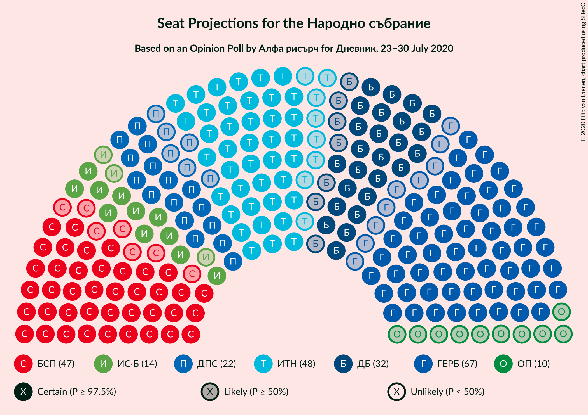
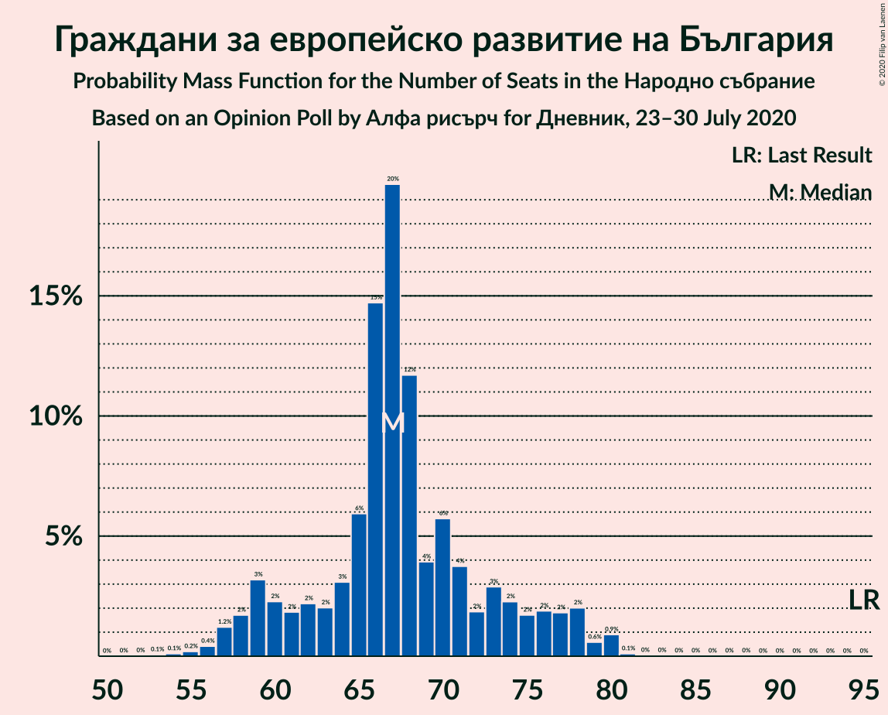
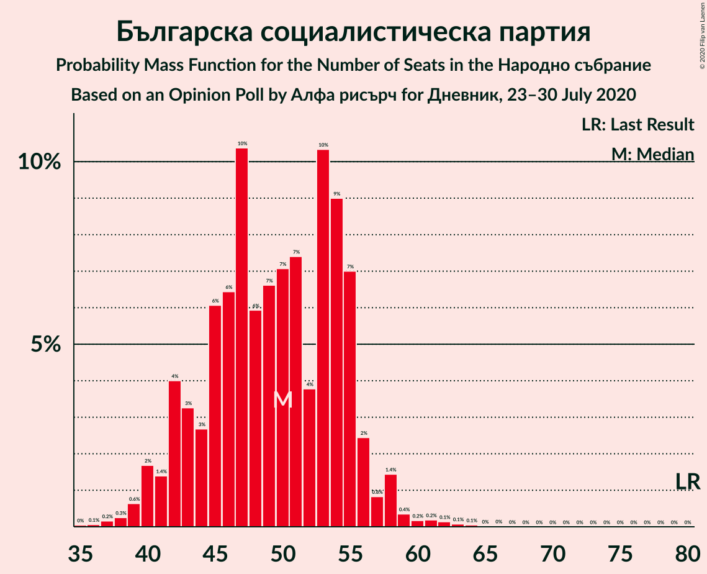

# Opinion Poll by Алфа рисърч for Дневник, 23–30 July 2020

<a href="#voting-intentions">Voting Intentions</a> | <a href="#seats">Seats</a> | <a href="#coalitions">Coalitions</a> | <a href="#technical-information">Technical Information</a>

## Voting Intentions

### Confidence Intervals

| Party | Last Result | Poll Result | 80% Confidence Interval | 90% Confidence Interval | 95% Confidence Interval | 99% Confidence Interval |
|:-----:|:-----------:|:-----------:|:-----------------------:|:-----------------------:|:-----------------------:|:-----------------------:|
| Граждани за европейско развитие на България | 33.5% | 26.6% | 24.3–29.1% |23.7–29.9% |23.1–30.5% |22.0–31.7% |
| Българска социалистическа партия | 27.9% | 19.2% | 17.2–21.5% |16.6–22.1% |16.1–22.7% |15.2–23.8% |
| Има такъв народ | 0.0% | 18.8% | 16.8–21.1% |16.3–21.8% |15.8–22.3% |14.9–23.4% |
| Демократична България | 0.0% | 12.3% | 10.7–14.3% |10.2–14.8% |9.8–15.3% |9.1–16.3% |
| Движение за права и свободи | 9.2% | 8.3% | 7.0–10.0% |6.6–10.5% |6.3–10.9% |5.7–11.8% |
| Изправи се Бг | 0.0% | 6.0% | 4.9–7.5% |4.5–7.9% |4.3–8.3% |3.8–9.1% |
| Обединени Патриоти | 9.3% | 4.2% | 3.3–5.5% |3.0–5.9% |2.8–6.2% |2.4–6.9% |
| Воля | 4.3% | 0.9% | 0.6–1.7% |0.5–1.9% |0.4–2.1% |0.3–2.5% |
| Възраждане | 0.0% | 0.5% | 0.3–1.2% |0.2–1.4% |0.2–1.6% |0.1–2.0% |

*Note:* The poll result column reflects the actual value used in the calculations. Published results may vary slightly, and in addition be rounded to fewer digits.

## Seats

### Confidence Intervals

| Party | Last Result | Median | 80% Confidence Interval | 90% Confidence Interval | 95% Confidence Interval | 99% Confidence Interval |
|:-----:|:-----------:|:------:|:-----------------------:|:-----------------------:|:-----------------------:|:-----------------------:|
| <a href="#граждани-за-европейско-развитие-на-българия">Граждани за европейско развитие на България</a> | 95 | 66 | 62–74 |59–75 |59–77 |56–78 |
| <a href="#българска-социалистическа-партия">Българска социалистическа партия</a> | 80 | 47 | 45–55 |42–56 |41–58 |40–61 |
| <a href="#има-такъв-народ">Има такъв народ</a> | 0 | 49 | 43–51 |41–55 |40–55 |38–60 |
| <a href="#демократична-българия">Демократична България</a> | 0 | 32 | 28–36 |26–37 |25–39 |23–41 |
| <a href="#движение-за-права-и-свободи">Движение за права и свободи</a> | 26 | 21 | 18–27 |16–27 |16–27 |14–29 |
| <a href="#изправи-се-бг">Изправи се Бг</a> | 0 | 14 | 13–18 |12–20 |11–20 |0–23 |
| <a href="#обединени-патриоти">Обединени Патриоти</a> | 27 | 11 | 0–13 |0–15 |0–15 |0–17 |
| <a href="#воля">Воля</a> | 12 | 0 | 0 |0 |0 |0 |
| <a href="#възраждане">Възраждане</a> | 0 | 0 | 0 |0 |0 |0 |

### Граждани за европейско развитие на България

*For a full overview of the results for this party, see the [Граждани за европейско развитие на България](party-гражданизаевропейскоразвитиенабългария.html) page.*

| Number of Seats | Probability | Accumulated | Special Marks |
|:---------------:|:-----------:|:-----------:|:-------------:|
| 53 | 0% | 100% |  |
| 54 | 0.2% | 99.9% |  |
| 55 | 0.2% | 99.8% |  |
| 56 | 0.1% | 99.6% |  |
| 57 | 0.2% | 99.4% |  |
| 58 | 0.7% | 99.2% |  |
| 59 | 6% | 98.5% |  |
| 60 | 0.5% | 92% |  |
| 61 | 1.1% | 92% |  |
| 62 | 2% | 91% |  |
| 63 | 5% | 89% |  |
| 64 | 1.4% | 85% |  |
| 65 | 21% | 83% |  |
| 66 | 29% | 62% | Median |
| 67 | 5% | 33% |  |
| 68 | 3% | 28% |  |
| 69 | 3% | 25% |  |
| 70 | 0.7% | 23% |  |
| 71 | 2% | 22% |  |
| 72 | 0.6% | 20% |  |
| 73 | 10% | 20% |  |
| 74 | 3% | 10% |  |
| 75 | 2% | 7% |  |
| 76 | 1.2% | 5% |  |
| 77 | 2% | 3% |  |
| 78 | 0.7% | 1.2% |  |
| 79 | 0.2% | 0.4% |  |
| 80 | 0.1% | 0.3% |  |
| 81 | 0% | 0.2% |  |
| 82 | 0% | 0.1% |  |
| 83 | 0% | 0.1% |  |
| 84 | 0% | 0.1% |  |
| 85 | 0% | 0.1% |  |
| 86 | 0% | 0.1% |  |
| 87 | 0% | 0.1% |  |
| 88 | 0% | 0% |  |
| 89 | 0% | 0% |  |
| 90 | 0% | 0% |  |
| 91 | 0% | 0% |  |
| 92 | 0% | 0% |  |
| 93 | 0% | 0% |  |
| 94 | 0% | 0% |  |
| 95 | 0% | 0% | Last Result |

### Българска социалистическа партия

*For a full overview of the results for this party, see the [Българска социалистическа партия](party-българскасоциалистическапартия.html) page.*

| Number of Seats | Probability | Accumulated | Special Marks |
|:---------------:|:-----------:|:-----------:|:-------------:|
| 35 | 0% | 100% |  |
| 36 | 0% | 99.9% |  |
| 37 | 0.1% | 99.9% |  |
| 38 | 0.1% | 99.9% |  |
| 39 | 0.2% | 99.8% |  |
| 40 | 0.4% | 99.6% |  |
| 41 | 2% | 99.2% |  |
| 42 | 3% | 97% |  |
| 43 | 1.2% | 94% |  |
| 44 | 0.7% | 93% |  |
| 45 | 3% | 92% |  |
| 46 | 17% | 89% |  |
| 47 | 28% | 71% | Median |
| 48 | 8% | 43% |  |
| 49 | 2% | 35% |  |
| 50 | 5% | 34% |  |
| 51 | 2% | 28% |  |
| 52 | 0.7% | 26% |  |
| 53 | 10% | 26% |  |
| 54 | 4% | 16% |  |
| 55 | 4% | 12% |  |
| 56 | 4% | 8% |  |
| 57 | 0.4% | 4% |  |
| 58 | 2% | 3% |  |
| 59 | 0.1% | 1.1% |  |
| 60 | 0.4% | 1.0% |  |
| 61 | 0.5% | 0.6% |  |
| 62 | 0% | 0.1% |  |
| 63 | 0% | 0.1% |  |
| 64 | 0% | 0.1% |  |
| 65 | 0% | 0% |  |
| 66 | 0% | 0% |  |
| 67 | 0% | 0% |  |
| 68 | 0% | 0% |  |
| 69 | 0% | 0% |  |
| 70 | 0% | 0% |  |
| 71 | 0% | 0% |  |
| 72 | 0% | 0% |  |
| 73 | 0% | 0% |  |
| 74 | 0% | 0% |  |
| 75 | 0% | 0% |  |
| 76 | 0% | 0% |  |
| 77 | 0% | 0% |  |
| 78 | 0% | 0% |  |
| 79 | 0% | 0% |  |
| 80 | 0% | 0% | Last Result |

### Има такъв народ

*For a full overview of the results for this party, see the [Има такъв народ](party-иматакъвнарод.html) page.*

| Number of Seats | Probability | Accumulated | Special Marks |
|:---------------:|:-----------:|:-----------:|:-------------:|
| 0 | 0% | 100% | Last Result |
| 1 | 0% | 100% |  |
| 2 | 0% | 100% |  |
| 3 | 0% | 100% |  |
| 4 | 0% | 100% |  |
| 5 | 0% | 100% |  |
| 6 | 0% | 100% |  |
| 7 | 0% | 100% |  |
| 8 | 0% | 100% |  |
| 9 | 0% | 100% |  |
| 10 | 0% | 100% |  |
| 11 | 0% | 100% |  |
| 12 | 0% | 100% |  |
| 13 | 0% | 100% |  |
| 14 | 0% | 100% |  |
| 15 | 0% | 100% |  |
| 16 | 0% | 100% |  |
| 17 | 0% | 100% |  |
| 18 | 0% | 100% |  |
| 19 | 0% | 100% |  |
| 20 | 0% | 100% |  |
| 21 | 0% | 100% |  |
| 22 | 0% | 100% |  |
| 23 | 0% | 100% |  |
| 24 | 0% | 100% |  |
| 25 | 0% | 100% |  |
| 26 | 0% | 100% |  |
| 27 | 0% | 100% |  |
| 28 | 0% | 100% |  |
| 29 | 0% | 100% |  |
| 30 | 0% | 100% |  |
| 31 | 0% | 100% |  |
| 32 | 0% | 100% |  |
| 33 | 0% | 100% |  |
| 34 | 0% | 100% |  |
| 35 | 0% | 100% |  |
| 36 | 0.1% | 100% |  |
| 37 | 0.2% | 99.9% |  |
| 38 | 1.3% | 99.7% |  |
| 39 | 0.8% | 98% |  |
| 40 | 0.3% | 98% |  |
| 41 | 4% | 97% |  |
| 42 | 2% | 94% |  |
| 43 | 2% | 92% |  |
| 44 | 10% | 90% |  |
| 45 | 12% | 80% |  |
| 46 | 0.9% | 68% |  |
| 47 | 6% | 67% |  |
| 48 | 7% | 61% |  |
| 49 | 37% | 54% | Median |
| 50 | 2% | 17% |  |
| 51 | 5% | 14% |  |
| 52 | 0.4% | 10% |  |
| 53 | 1.0% | 9% |  |
| 54 | 3% | 8% |  |
| 55 | 3% | 5% |  |
| 56 | 1.0% | 2% |  |
| 57 | 0.1% | 1.2% |  |
| 58 | 0.5% | 1.1% |  |
| 59 | 0.1% | 0.6% |  |
| 60 | 0.2% | 0.6% |  |
| 61 | 0% | 0.3% |  |
| 62 | 0.1% | 0.3% |  |
| 63 | 0.2% | 0.2% |  |
| 64 | 0% | 0% |  |

### Демократична България

*For a full overview of the results for this party, see the [Демократична България](party-демократичнабългария.html) page.*

| Number of Seats | Probability | Accumulated | Special Marks |
|:---------------:|:-----------:|:-----------:|:-------------:|
| 0 | 0% | 100% | Last Result |
| 1 | 0% | 100% |  |
| 2 | 0% | 100% |  |
| 3 | 0% | 100% |  |
| 4 | 0% | 100% |  |
| 5 | 0% | 100% |  |
| 6 | 0% | 100% |  |
| 7 | 0% | 100% |  |
| 8 | 0% | 100% |  |
| 9 | 0% | 100% |  |
| 10 | 0% | 100% |  |
| 11 | 0% | 100% |  |
| 12 | 0% | 100% |  |
| 13 | 0% | 100% |  |
| 14 | 0% | 100% |  |
| 15 | 0% | 100% |  |
| 16 | 0% | 100% |  |
| 17 | 0% | 100% |  |
| 18 | 0% | 100% |  |
| 19 | 0% | 100% |  |
| 20 | 0% | 100% |  |
| 21 | 0% | 100% |  |
| 22 | 0.1% | 100% |  |
| 23 | 2% | 99.9% |  |
| 24 | 0.5% | 98% |  |
| 25 | 3% | 98% |  |
| 26 | 0.6% | 95% |  |
| 27 | 2% | 95% |  |
| 28 | 12% | 92% |  |
| 29 | 13% | 81% |  |
| 30 | 7% | 68% |  |
| 31 | 5% | 61% |  |
| 32 | 6% | 56% | Median |
| 33 | 3% | 50% |  |
| 34 | 33% | 47% |  |
| 35 | 3% | 14% |  |
| 36 | 6% | 11% |  |
| 37 | 0.6% | 5% |  |
| 38 | 1.5% | 5% |  |
| 39 | 1.4% | 3% |  |
| 40 | 1.0% | 2% |  |
| 41 | 0.3% | 0.7% |  |
| 42 | 0.1% | 0.5% |  |
| 43 | 0% | 0.4% |  |
| 44 | 0.3% | 0.3% |  |
| 45 | 0% | 0% |  |

### Движение за права и свободи

*For a full overview of the results for this party, see the [Движение за права и свободи](party-движениезаправаисвободи.html) page.*

| Number of Seats | Probability | Accumulated | Special Marks |
|:---------------:|:-----------:|:-----------:|:-------------:|
| 14 | 0.8% | 100% |  |
| 15 | 0.5% | 99.2% |  |
| 16 | 5% | 98.7% |  |
| 17 | 1.2% | 94% |  |
| 18 | 5% | 93% |  |
| 19 | 30% | 88% |  |
| 20 | 5% | 58% |  |
| 21 | 8% | 53% | Median |
| 22 | 12% | 45% |  |
| 23 | 1.4% | 34% |  |
| 24 | 4% | 32% |  |
| 25 | 7% | 28% |  |
| 26 | 3% | 21% | Last Result |
| 27 | 17% | 18% |  |
| 28 | 0.4% | 1.1% |  |
| 29 | 0.2% | 0.7% |  |
| 30 | 0.2% | 0.5% |  |
| 31 | 0.1% | 0.3% |  |
| 32 | 0% | 0.1% |  |
| 33 | 0.1% | 0.1% |  |
| 34 | 0% | 0% |  |

### Изправи се Бг

*For a full overview of the results for this party, see the [Изправи се Бг](party-изправисебг.html) page.*

| Number of Seats | Probability | Accumulated | Special Marks |
|:---------------:|:-----------:|:-----------:|:-------------:|
| 0 | 1.3% | 100% | Last Result |
| 1 | 0% | 98.7% |  |
| 2 | 0% | 98.7% |  |
| 3 | 0% | 98.7% |  |
| 4 | 0% | 98.7% |  |
| 5 | 0% | 98.7% |  |
| 6 | 0% | 98.7% |  |
| 7 | 0% | 98.7% |  |
| 8 | 0% | 98.7% |  |
| 9 | 0% | 98.7% |  |
| 10 | 0.3% | 98.7% |  |
| 11 | 1.4% | 98% |  |
| 12 | 4% | 97% |  |
| 13 | 16% | 93% |  |
| 14 | 43% | 77% | Median |
| 15 | 8% | 34% |  |
| 16 | 14% | 26% |  |
| 17 | 2% | 12% |  |
| 18 | 2% | 10% |  |
| 19 | 3% | 8% |  |
| 20 | 3% | 5% |  |
| 21 | 2% | 2% |  |
| 22 | 0.2% | 0.8% |  |
| 23 | 0.3% | 0.6% |  |
| 24 | 0% | 0.3% |  |
| 25 | 0.2% | 0.3% |  |
| 26 | 0% | 0% |  |

### Обединени Патриоти

*For a full overview of the results for this party, see the [Обединени Патриоти](party-обединенипатриоти.html) page.*

| Number of Seats | Probability | Accumulated | Special Marks |
|:---------------:|:-----------:|:-----------:|:-------------:|
| 0 | 26% | 100% |  |
| 1 | 0% | 74% |  |
| 2 | 0% | 74% |  |
| 3 | 0% | 74% |  |
| 4 | 0% | 74% |  |
| 5 | 0% | 74% |  |
| 6 | 0% | 74% |  |
| 7 | 0% | 74% |  |
| 8 | 0% | 74% |  |
| 9 | 0% | 74% |  |
| 10 | 5% | 74% |  |
| 11 | 34% | 69% | Median |
| 12 | 17% | 35% |  |
| 13 | 10% | 18% |  |
| 14 | 2% | 8% |  |
| 15 | 5% | 6% |  |
| 16 | 0.3% | 1.0% |  |
| 17 | 0.4% | 0.7% |  |
| 18 | 0.1% | 0.2% |  |
| 19 | 0.1% | 0.1% |  |
| 20 | 0% | 0% |  |
| 21 | 0% | 0% |  |
| 22 | 0% | 0% |  |
| 23 | 0% | 0% |  |
| 24 | 0% | 0% |  |
| 25 | 0% | 0% |  |
| 26 | 0% | 0% |  |
| 27 | 0% | 0% | Last Result |

### Воля

*For a full overview of the results for this party, see the [Воля](party-воля.html) page.*

| Number of Seats | Probability | Accumulated | Special Marks |
|:---------------:|:-----------:|:-----------:|:-------------:|
| 0 | 100% | 100% | Median |
| 1 | 0% | 0% |  |
| 2 | 0% | 0% |  |
| 3 | 0% | 0% |  |
| 4 | 0% | 0% |  |
| 5 | 0% | 0% |  |
| 6 | 0% | 0% |  |
| 7 | 0% | 0% |  |
| 8 | 0% | 0% |  |
| 9 | 0% | 0% |  |
| 10 | 0% | 0% |  |
| 11 | 0% | 0% |  |
| 12 | 0% | 0% | Last Result |

### Възраждане

*For a full overview of the results for this party, see the [Възраждане](party-възраждане.html) page.*

| Number of Seats | Probability | Accumulated | Special Marks |
|:---------------:|:-----------:|:-----------:|:-------------:|
| 0 | 100% | 100% | Last Result, Median |

## Coalitions

### Confidence Intervals

| Coalition | Last Result | Median | Majority? | 80% Confidence Interval | 90% Confidence Interval | 95% Confidence Interval | 99% Confidence Interval |
|:---------:|:-----------:|:------:|:---------:|:-----------------------:|:-----------------------:|:-----------------------:|:-----------------------:|
| Граждани за европейско развитие на България – Обединени Патриоти | 122 | 77 | 0% | 68–82 | 65–88 | 63–88 | 62–90 |
| Българска социалистическа партия – Движение за права и свободи | 106 | 70 | 0% | 64–78 | 63–78 | 62–80 | 60–84 |

### Граждани за европейско развитие на България – Обединени Патриоти

| Number of Seats | Probability | Accumulated | Special Marks |
|:---------------:|:-----------:|:-----------:|:-------------:|
| 55 | 0.2% | 100% |  |
| 56 | 0% | 99.8% |  |
| 57 | 0% | 99.8% |  |
| 58 | 0.1% | 99.8% |  |
| 59 | 0.1% | 99.7% |  |
| 60 | 0% | 99.6% |  |
| 61 | 0.1% | 99.6% |  |
| 62 | 1.4% | 99.5% |  |
| 63 | 1.1% | 98% |  |
| 64 | 1.0% | 97% |  |
| 65 | 4% | 96% |  |
| 66 | 0.9% | 92% |  |
| 67 | 0.8% | 91% |  |
| 68 | 2% | 90% |  |
| 69 | 1.1% | 89% |  |
| 70 | 0.7% | 88% |  |
| 71 | 0.4% | 87% |  |
| 72 | 6% | 86% |  |
| 73 | 7% | 80% |  |
| 74 | 6% | 73% |  |
| 75 | 2% | 67% |  |
| 76 | 11% | 65% |  |
| 77 | 35% | 54% | Median |
| 78 | 2% | 19% |  |
| 79 | 6% | 17% |  |
| 80 | 0.4% | 11% |  |
| 81 | 0.3% | 11% |  |
| 82 | 2% | 11% |  |
| 83 | 1.1% | 9% |  |
| 84 | 2% | 8% |  |
| 85 | 0.6% | 6% |  |
| 86 | 0.3% | 6% |  |
| 87 | 0.3% | 5% |  |
| 88 | 4% | 5% |  |
| 89 | 0.9% | 2% |  |
| 90 | 0.4% | 0.6% |  |
| 91 | 0% | 0.2% |  |
| 92 | 0% | 0.2% |  |
| 93 | 0.2% | 0.2% |  |
| 94 | 0% | 0% |  |
| 95 | 0% | 0% |  |
| 96 | 0% | 0% |  |
| 97 | 0% | 0% |  |
| 98 | 0% | 0% |  |
| 99 | 0% | 0% |  |
| 100 | 0% | 0% |  |
| 101 | 0% | 0% |  |
| 102 | 0% | 0% |  |
| 103 | 0% | 0% |  |
| 104 | 0% | 0% |  |
| 105 | 0% | 0% |  |
| 106 | 0% | 0% |  |
| 107 | 0% | 0% |  |
| 108 | 0% | 0% |  |
| 109 | 0% | 0% |  |
| 110 | 0% | 0% |  |
| 111 | 0% | 0% |  |
| 112 | 0% | 0% |  |
| 113 | 0% | 0% |  |
| 114 | 0% | 0% |  |
| 115 | 0% | 0% |  |
| 116 | 0% | 0% |  |
| 117 | 0% | 0% |  |
| 118 | 0% | 0% |  |
| 119 | 0% | 0% |  |
| 120 | 0% | 0% |  |
| 121 | 0% | 0% | Majority |
| 122 | 0% | 0% | Last Result |

### Българска социалистическа партия – Движение за права и свободи

| Number of Seats | Probability | Accumulated | Special Marks |
|:---------------:|:-----------:|:-----------:|:-------------:|
| 55 | 0.1% | 100% |  |
| 56 | 0% | 99.8% |  |
| 57 | 0% | 99.8% |  |
| 58 | 0% | 99.8% |  |
| 59 | 0.1% | 99.8% |  |
| 60 | 0.2% | 99.7% |  |
| 61 | 0.8% | 99.5% |  |
| 62 | 2% | 98.7% |  |
| 63 | 5% | 97% |  |
| 64 | 4% | 92% |  |
| 65 | 4% | 88% |  |
| 66 | 24% | 84% |  |
| 67 | 3% | 59% |  |
| 68 | 5% | 57% | Median |
| 69 | 2% | 52% |  |
| 70 | 1.2% | 50% |  |
| 71 | 0.4% | 49% |  |
| 72 | 3% | 49% |  |
| 73 | 11% | 46% |  |
| 74 | 8% | 35% |  |
| 75 | 8% | 26% |  |
| 76 | 5% | 18% |  |
| 77 | 2% | 13% |  |
| 78 | 8% | 11% |  |
| 79 | 1.0% | 4% |  |
| 80 | 1.4% | 3% |  |
| 81 | 0.1% | 1.3% |  |
| 82 | 0.1% | 1.2% |  |
| 83 | 0.1% | 1.1% |  |
| 84 | 0.8% | 1.0% |  |
| 85 | 0.1% | 0.2% |  |
| 86 | 0% | 0.1% |  |
| 87 | 0% | 0.1% |  |
| 88 | 0% | 0.1% |  |
| 89 | 0% | 0% |  |
| 90 | 0% | 0% |  |
| 91 | 0% | 0% |  |
| 92 | 0% | 0% |  |
| 93 | 0% | 0% |  |
| 94 | 0% | 0% |  |
| 95 | 0% | 0% |  |
| 96 | 0% | 0% |  |
| 97 | 0% | 0% |  |
| 98 | 0% | 0% |  |
| 99 | 0% | 0% |  |
| 100 | 0% | 0% |  |
| 101 | 0% | 0% |  |
| 102 | 0% | 0% |  |
| 103 | 0% | 0% |  |
| 104 | 0% | 0% |  |
| 105 | 0% | 0% |  |
| 106 | 0% | 0% | Last Result |

## Technical Information

### Opinion Poll

+ **Polling firm:** Алфа рисърч
+ **Commissioner(s):** Дневник
+ **Fieldwork period:** 23–30 July 2020

### Calculations

+ **Sample size:** 552
+ **Simulations done:** 131,072
+ **Error estimate:** 3.31%

