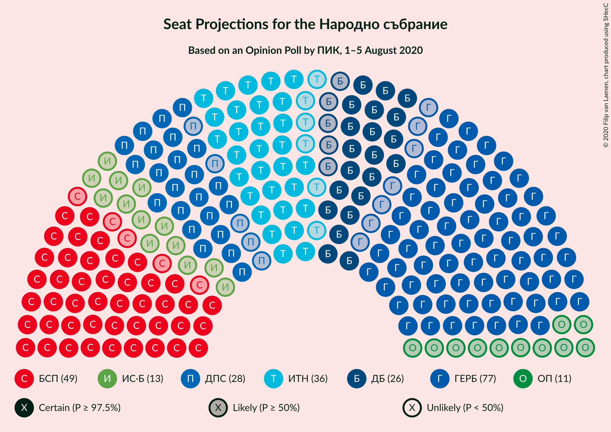
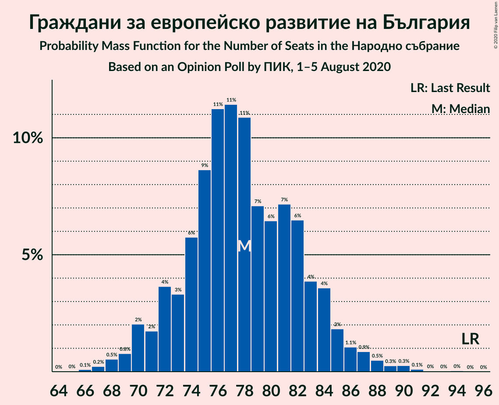
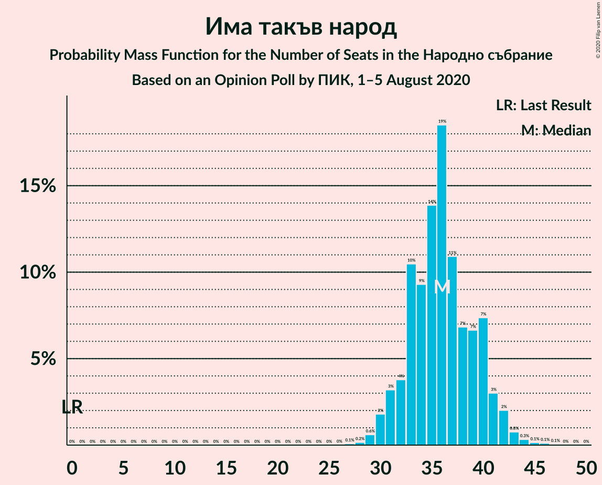
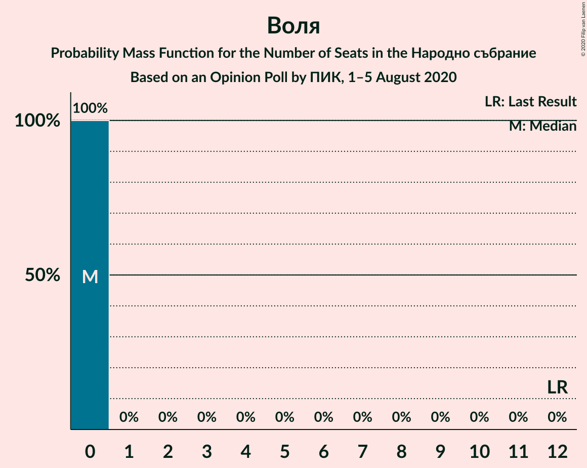
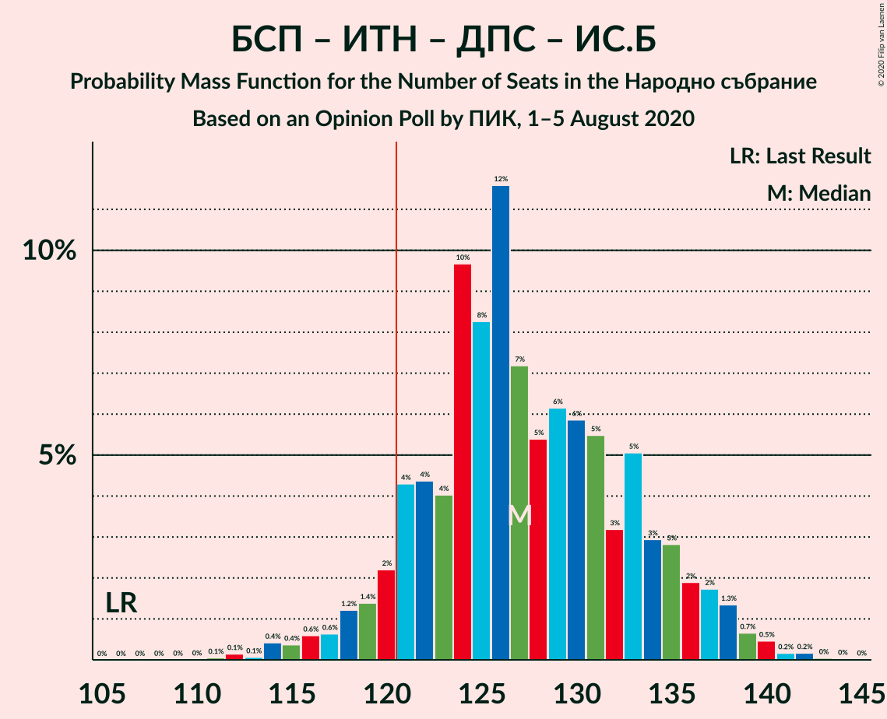
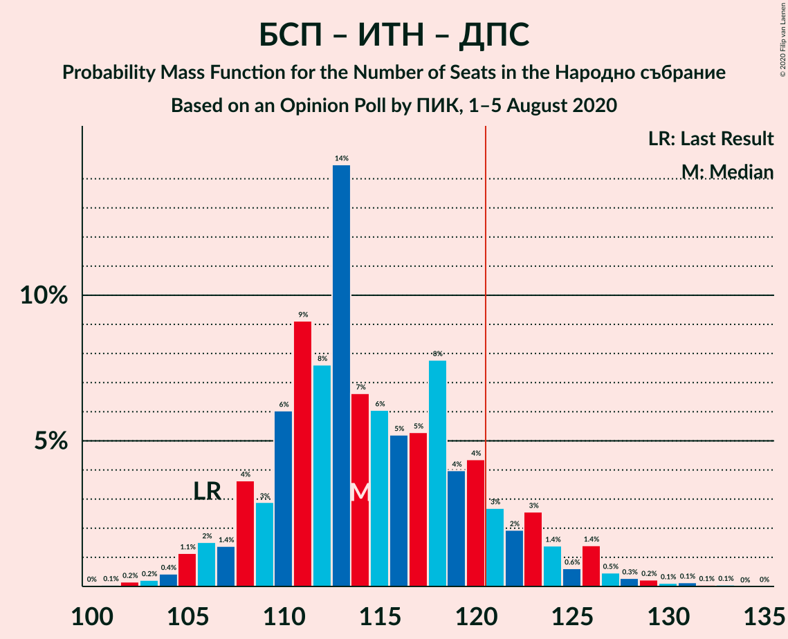

# Opinion Poll by ПИК, 1–5 August 2020

<a href="#voting-intentions">Voting Intentions</a> | <a href="#seats">Seats</a> | <a href="#coalitions">Coalitions</a> | <a href="#technical-information">Technical Information</a>

## Voting Intentions

### Confidence Intervals

| Party | Last Result | Poll Result | 80% Confidence Interval | 90% Confidence Interval | 95% Confidence Interval | 99% Confidence Interval |
|:-----:|:-----------:|:-----------:|:-----------------------:|:-----------------------:|:-----------------------:|:-----------------------:|
| Граждани за европейско развитие на България | 33.5% | 30.2% | 28.4–32.1% |27.9–32.6% |27.4–33.1% |26.6–34.0% |
| Българска социалистическа партия | 27.9% | 19.7% | 18.2–21.4% |17.7–21.8% |17.4–22.3% |16.6–23.1% |
| Има такъв народ | 0.0% | 13.9% | 12.6–15.4% |12.2–15.8% |11.9–16.2% |11.3–16.9% |
| Движение за права и свободи | 9.2% | 10.8% | 9.6–12.1% |9.3–12.5% |9.0–12.8% |8.5–13.5% |
| Демократична България | 0.0% | 10.1% | 9.0–11.4% |8.7–11.8% |8.4–12.1% |7.9–12.8% |
| Изправи се Бг | 0.0% | 5.0% | 4.2–6.0% |4.0–6.3% |3.8–6.5% |3.5–7.0% |
| Обединени Патриоти | 9.3% | 4.3% | 3.6–5.2% |3.4–5.5% |3.2–5.7% |2.9–6.2% |
| Воля | 4.3% | 2.1% | 1.6–2.8% |1.4–3.0% |1.3–3.1% |1.2–3.5% |

*Note:* The poll result column reflects the actual value used in the calculations. Published results may vary slightly, and in addition be rounded to fewer digits.

## Seats

### Confidence Intervals

| Party | Last Result | Median | 80% Confidence Interval | 90% Confidence Interval | 95% Confidence Interval | 99% Confidence Interval |
|:-----:|:-----------:|:------:|:-----------------------:|:-----------------------:|:-----------------------:|:-----------------------:|
| <a href="#граждани-за-европейско-развитие-на-българия">Граждани за европейско развитие на България</a> | 95 | 79 | 74–84 |71–84 |70–86 |67–88 |
| <a href="#българска-социалистическа-партия">Българска социалистическа партия</a> | 80 | 51 | 46–55 |45–57 |43–58 |43–63 |
| <a href="#има-такъв-народ">Има такъв народ</a> | 0 | 37 | 32–41 |31–41 |31–43 |29–44 |
| <a href="#движение-за-права-и-свободи">Движение за права и свободи</a> | 26 | 27 | 25–31 |24–31 |21–33 |21–35 |
| <a href="#демократична-българия">Демократична България</a> | 0 | 26 | 23–30 |22–31 |21–32 |20–33 |
| <a href="#изправи-се-бг">Изправи се Бг</a> | 0 | 14 | 11–16 |10–16 |0–17 |0–19 |
| <a href="#обединени-патриоти">Обединени Патриоти</a> | 27 | 11 | 0–13 |0–14 |0–14 |0–16 |
| <a href="#воля">Воля</a> | 12 | 0 | 0 |0 |0 |0 |

### Граждани за европейско развитие на България

*For a full overview of the results for this party, see the [Граждани за европейско развитие на България](party-гражданизаевропейскоразвитиенабългария.html) page.*

| Number of Seats | Probability | Accumulated | Special Marks |
|:---------------:|:-----------:|:-----------:|:-------------:|
| 66 | 0.2% | 100% |  |
| 67 | 0.6% | 99.8% |  |
| 68 | 0.7% | 99.2% |  |
| 69 | 0.3% | 98% |  |
| 70 | 2% | 98% |  |
| 71 | 2% | 96% |  |
| 72 | 2% | 94% |  |
| 73 | 2% | 92% |  |
| 74 | 5% | 90% |  |
| 75 | 6% | 85% |  |
| 76 | 10% | 80% |  |
| 77 | 6% | 70% |  |
| 78 | 13% | 64% |  |
| 79 | 8% | 51% | Median |
| 80 | 4% | 43% |  |
| 81 | 14% | 39% |  |
| 82 | 9% | 25% |  |
| 83 | 6% | 17% |  |
| 84 | 6% | 10% |  |
| 85 | 0.9% | 4% |  |
| 86 | 1.4% | 4% |  |
| 87 | 1.2% | 2% |  |
| 88 | 0.6% | 0.9% |  |
| 89 | 0.1% | 0.4% |  |
| 90 | 0.1% | 0.3% |  |
| 91 | 0% | 0.2% |  |
| 92 | 0% | 0.2% |  |
| 93 | 0.1% | 0.1% |  |
| 94 | 0% | 0% |  |
| 95 | 0% | 0% | Last Result |

### Българска социалистическа партия

*For a full overview of the results for this party, see the [Българска социалистическа партия](party-българскасоциалистическапартия.html) page.*

| Number of Seats | Probability | Accumulated | Special Marks |
|:---------------:|:-----------:|:-----------:|:-------------:|
| 40 | 0% | 100% |  |
| 41 | 0.2% | 99.9% |  |
| 42 | 0.2% | 99.8% |  |
| 43 | 2% | 99.6% |  |
| 44 | 0.9% | 97% |  |
| 45 | 6% | 97% |  |
| 46 | 2% | 91% |  |
| 47 | 8% | 88% |  |
| 48 | 5% | 80% |  |
| 49 | 5% | 75% |  |
| 50 | 9% | 70% |  |
| 51 | 12% | 61% | Median |
| 52 | 15% | 50% |  |
| 53 | 16% | 34% |  |
| 54 | 7% | 18% |  |
| 55 | 2% | 11% |  |
| 56 | 3% | 9% |  |
| 57 | 3% | 6% |  |
| 58 | 0.7% | 3% |  |
| 59 | 0.7% | 2% |  |
| 60 | 0.5% | 1.1% |  |
| 61 | 0.1% | 0.6% |  |
| 62 | 0% | 0.6% |  |
| 63 | 0.5% | 0.5% |  |
| 64 | 0% | 0.1% |  |
| 65 | 0% | 0% |  |
| 66 | 0% | 0% |  |
| 67 | 0% | 0% |  |
| 68 | 0% | 0% |  |
| 69 | 0% | 0% |  |
| 70 | 0% | 0% |  |
| 71 | 0% | 0% |  |
| 72 | 0% | 0% |  |
| 73 | 0% | 0% |  |
| 74 | 0% | 0% |  |
| 75 | 0% | 0% |  |
| 76 | 0% | 0% |  |
| 77 | 0% | 0% |  |
| 78 | 0% | 0% |  |
| 79 | 0% | 0% |  |
| 80 | 0% | 0% | Last Result |

### Има такъв народ

*For a full overview of the results for this party, see the [Има такъв народ](party-иматакъвнарод.html) page.*

| Number of Seats | Probability | Accumulated | Special Marks |
|:---------------:|:-----------:|:-----------:|:-------------:|
| 0 | 0% | 100% | Last Result |
| 1 | 0% | 100% |  |
| 2 | 0% | 100% |  |
| 3 | 0% | 100% |  |
| 4 | 0% | 100% |  |
| 5 | 0% | 100% |  |
| 6 | 0% | 100% |  |
| 7 | 0% | 100% |  |
| 8 | 0% | 100% |  |
| 9 | 0% | 100% |  |
| 10 | 0% | 100% |  |
| 11 | 0% | 100% |  |
| 12 | 0% | 100% |  |
| 13 | 0% | 100% |  |
| 14 | 0% | 100% |  |
| 15 | 0% | 100% |  |
| 16 | 0% | 100% |  |
| 17 | 0% | 100% |  |
| 18 | 0% | 100% |  |
| 19 | 0% | 100% |  |
| 20 | 0% | 100% |  |
| 21 | 0% | 100% |  |
| 22 | 0% | 100% |  |
| 23 | 0% | 100% |  |
| 24 | 0% | 100% |  |
| 25 | 0% | 100% |  |
| 26 | 0% | 100% |  |
| 27 | 0% | 100% |  |
| 28 | 0.3% | 100% |  |
| 29 | 0.8% | 99.7% |  |
| 30 | 0.3% | 98.9% |  |
| 31 | 8% | 98.6% |  |
| 32 | 2% | 90% |  |
| 33 | 1.1% | 88% |  |
| 34 | 23% | 87% |  |
| 35 | 6% | 64% |  |
| 36 | 6% | 59% |  |
| 37 | 21% | 53% | Median |
| 38 | 9% | 32% |  |
| 39 | 1.0% | 23% |  |
| 40 | 11% | 22% |  |
| 41 | 8% | 11% |  |
| 42 | 1.0% | 4% |  |
| 43 | 2% | 3% |  |
| 44 | 0.3% | 0.7% |  |
| 45 | 0.1% | 0.4% |  |
| 46 | 0.2% | 0.3% |  |
| 47 | 0.1% | 0.1% |  |
| 48 | 0% | 0% |  |

### Движение за права и свободи

*For a full overview of the results for this party, see the [Движение за права и свободи](party-движениезаправаисвободи.html) page.*

| Number of Seats | Probability | Accumulated | Special Marks |
|:---------------:|:-----------:|:-----------:|:-------------:|
| 21 | 2% | 100% |  |
| 22 | 1.0% | 97% |  |
| 23 | 0.9% | 97% |  |
| 24 | 0.7% | 96% |  |
| 25 | 7% | 95% |  |
| 26 | 37% | 88% | Last Result |
| 27 | 8% | 52% | Median |
| 28 | 0.8% | 43% |  |
| 29 | 10% | 42% |  |
| 30 | 15% | 33% |  |
| 31 | 14% | 18% |  |
| 32 | 1.2% | 4% |  |
| 33 | 0.7% | 3% |  |
| 34 | 1.1% | 2% |  |
| 35 | 1.0% | 1.2% |  |
| 36 | 0.1% | 0.2% |  |
| 37 | 0.1% | 0.1% |  |
| 38 | 0% | 0% |  |

### Демократична България

*For a full overview of the results for this party, see the [Демократична България](party-демократичнабългария.html) page.*

| Number of Seats | Probability | Accumulated | Special Marks |
|:---------------:|:-----------:|:-----------:|:-------------:|
| 0 | 0% | 100% | Last Result |
| 1 | 0% | 100% |  |
| 2 | 0% | 100% |  |
| 3 | 0% | 100% |  |
| 4 | 0% | 100% |  |
| 5 | 0% | 100% |  |
| 6 | 0% | 100% |  |
| 7 | 0% | 100% |  |
| 8 | 0% | 100% |  |
| 9 | 0% | 100% |  |
| 10 | 0% | 100% |  |
| 11 | 0% | 100% |  |
| 12 | 0% | 100% |  |
| 13 | 0% | 100% |  |
| 14 | 0% | 100% |  |
| 15 | 0% | 100% |  |
| 16 | 0% | 100% |  |
| 17 | 0% | 100% |  |
| 18 | 0% | 100% |  |
| 19 | 0.1% | 100% |  |
| 20 | 1.2% | 99.8% |  |
| 21 | 2% | 98.6% |  |
| 22 | 5% | 97% |  |
| 23 | 9% | 92% |  |
| 24 | 8% | 83% |  |
| 25 | 13% | 74% |  |
| 26 | 16% | 62% | Median |
| 27 | 10% | 46% |  |
| 28 | 15% | 36% |  |
| 29 | 5% | 22% |  |
| 30 | 9% | 16% |  |
| 31 | 3% | 7% |  |
| 32 | 3% | 4% |  |
| 33 | 0.5% | 0.7% |  |
| 34 | 0.1% | 0.2% |  |
| 35 | 0% | 0.1% |  |
| 36 | 0% | 0.1% |  |
| 37 | 0% | 0% |  |

### Изправи се Бг

*For a full overview of the results for this party, see the [Изправи се Бг](party-изправисебг.html) page.*

| Number of Seats | Probability | Accumulated | Special Marks |
|:---------------:|:-----------:|:-----------:|:-------------:|
| 0 | 4% | 100% | Last Result |
| 1 | 0% | 96% |  |
| 2 | 0% | 96% |  |
| 3 | 0% | 96% |  |
| 4 | 0% | 96% |  |
| 5 | 0% | 96% |  |
| 6 | 0% | 96% |  |
| 7 | 0% | 96% |  |
| 8 | 0% | 96% |  |
| 9 | 0% | 96% |  |
| 10 | 4% | 96% |  |
| 11 | 14% | 91% |  |
| 12 | 8% | 77% |  |
| 13 | 12% | 70% |  |
| 14 | 27% | 58% | Median |
| 15 | 20% | 31% |  |
| 16 | 7% | 11% |  |
| 17 | 2% | 4% |  |
| 18 | 1.0% | 2% |  |
| 19 | 0.5% | 0.6% |  |
| 20 | 0.1% | 0.1% |  |
| 21 | 0% | 0% |  |

### Обединени Патриоти

*For a full overview of the results for this party, see the [Обединени Патриоти](party-обединенипатриоти.html) page.*

| Number of Seats | Probability | Accumulated | Special Marks |
|:---------------:|:-----------:|:-----------:|:-------------:|
| 0 | 43% | 100% |  |
| 1 | 0% | 57% |  |
| 2 | 0% | 57% |  |
| 3 | 0% | 57% |  |
| 4 | 0% | 57% |  |
| 5 | 0% | 57% |  |
| 6 | 0% | 57% |  |
| 7 | 0% | 57% |  |
| 8 | 0% | 57% |  |
| 9 | 0% | 57% |  |
| 10 | 2% | 57% |  |
| 11 | 12% | 55% | Median |
| 12 | 24% | 43% |  |
| 13 | 14% | 20% |  |
| 14 | 4% | 6% |  |
| 15 | 2% | 2% |  |
| 16 | 0.5% | 0.8% |  |
| 17 | 0.3% | 0.3% |  |
| 18 | 0% | 0% |  |
| 19 | 0% | 0% |  |
| 20 | 0% | 0% |  |
| 21 | 0% | 0% |  |
| 22 | 0% | 0% |  |
| 23 | 0% | 0% |  |
| 24 | 0% | 0% |  |
| 25 | 0% | 0% |  |
| 26 | 0% | 0% |  |
| 27 | 0% | 0% | Last Result |

### Воля

*For a full overview of the results for this party, see the [Воля](party-воля.html) page.*

| Number of Seats | Probability | Accumulated | Special Marks |
|:---------------:|:-----------:|:-----------:|:-------------:|
| 0 | 99.9% | 100% | Median |
| 1 | 0% | 0.1% |  |
| 2 | 0% | 0.1% |  |
| 3 | 0% | 0.1% |  |
| 4 | 0% | 0.1% |  |
| 5 | 0% | 0.1% |  |
| 6 | 0% | 0.1% |  |
| 7 | 0% | 0.1% |  |
| 8 | 0% | 0.1% |  |
| 9 | 0% | 0.1% |  |
| 10 | 0% | 0.1% |  |
| 11 | 0% | 0% |  |
| 12 | 0% | 0% | Last Result |

## Coalitions

### Confidence Intervals

| Coalition | Last Result | Median | Majority? | 80% Confidence Interval | 90% Confidence Interval | 95% Confidence Interval | 99% Confidence Interval |
|:---------:|:-----------:|:------:|:---------:|:-----------------------:|:-----------------------:|:-----------------------:|:-----------------------:|
| Българска социалистическа партия – Има такъв народ – Движение за права и свободи – Изправи се Бг | 106 | 128 | 92% | 121–134 | 119–135 | 116–138 | 114–140 |
| Българска социалистическа партия – Има такъв народ – Движение за права и свободи | 106 | 115 | 9% | 109–120 | 107–123 | 105–125 | 103–131 |
| Българска социалистическа партия – Движение за права и свободи – Изправи се Бг | 106 | 92 | 0% | 84–97 | 83–98 | 82–100 | 77–104 |
| Граждани за европейско развитие на България – Обединени Патриоти | 122 | 86 | 0% | 77–93 | 76–94 | 75–96 | 73–99 |
| Българска социалистическа партия – Движение за права и свободи | 106 | 79 | 0% | 72–84 | 71–84 | 70–87 | 69–90 |

### Българска социалистическа партия – Има такъв народ – Движение за права и свободи – Изправи се Бг

| Number of Seats | Probability | Accumulated | Special Marks |
|:---------------:|:-----------:|:-----------:|:-------------:|
| 106 | 0% | 100% | Last Result |
| 107 | 0% | 100% |  |
| 108 | 0% | 100% |  |
| 109 | 0% | 100% |  |
| 110 | 0% | 100% |  |
| 111 | 0% | 100% |  |
| 112 | 0% | 100% |  |
| 113 | 0.1% | 99.9% |  |
| 114 | 0.9% | 99.9% |  |
| 115 | 1.4% | 98.9% |  |
| 116 | 0.5% | 98% |  |
| 117 | 0.3% | 97% |  |
| 118 | 0.3% | 97% |  |
| 119 | 3% | 96% |  |
| 120 | 2% | 94% |  |
| 121 | 4% | 92% | Majority |
| 122 | 4% | 88% |  |
| 123 | 5% | 84% |  |
| 124 | 6% | 80% |  |
| 125 | 4% | 73% |  |
| 126 | 9% | 69% |  |
| 127 | 4% | 60% |  |
| 128 | 7% | 56% |  |
| 129 | 8% | 48% | Median |
| 130 | 5% | 41% |  |
| 131 | 5% | 35% |  |
| 132 | 1.2% | 30% |  |
| 133 | 16% | 29% |  |
| 134 | 5% | 13% |  |
| 135 | 3% | 8% |  |
| 136 | 0.8% | 5% |  |
| 137 | 1.1% | 4% |  |
| 138 | 1.1% | 3% |  |
| 139 | 1.2% | 2% |  |
| 140 | 0.4% | 0.6% |  |
| 141 | 0.1% | 0.2% |  |
| 142 | 0.1% | 0.1% |  |
| 143 | 0% | 0.1% |  |
| 144 | 0% | 0.1% |  |
| 145 | 0% | 0% |  |

### Българска социалистическа партия – Има такъв народ – Движение за права и свободи

| Number of Seats | Probability | Accumulated | Special Marks |
|:---------------:|:-----------:|:-----------:|:-------------:|
| 102 | 0.4% | 100% |  |
| 103 | 0.4% | 99.5% |  |
| 104 | 1.0% | 99.1% |  |
| 105 | 2% | 98% |  |
| 106 | 0.2% | 96% | Last Result |
| 107 | 0.9% | 96% |  |
| 108 | 4% | 95% |  |
| 109 | 5% | 91% |  |
| 110 | 9% | 86% |  |
| 111 | 5% | 77% |  |
| 112 | 0.7% | 72% |  |
| 113 | 6% | 71% |  |
| 114 | 5% | 65% |  |
| 115 | 10% | 60% | Median |
| 116 | 9% | 50% |  |
| 117 | 6% | 41% |  |
| 118 | 11% | 34% |  |
| 119 | 9% | 23% |  |
| 120 | 5% | 14% |  |
| 121 | 2% | 9% | Majority |
| 122 | 2% | 7% |  |
| 123 | 0.5% | 5% |  |
| 124 | 1.3% | 5% |  |
| 125 | 1.1% | 3% |  |
| 126 | 1.3% | 2% |  |
| 127 | 0.3% | 1.0% |  |
| 128 | 0.1% | 0.7% |  |
| 129 | 0% | 0.6% |  |
| 130 | 0% | 0.6% |  |
| 131 | 0.3% | 0.6% |  |
| 132 | 0.2% | 0.2% |  |
| 133 | 0% | 0% |  |

### Българска социалистическа партия – Движение за права и свободи – Изправи се Бг

| Number of Seats | Probability | Accumulated | Special Marks |
|:---------------:|:-----------:|:-----------:|:-------------:|
| 72 | 0.1% | 100% |  |
| 73 | 0% | 99.9% |  |
| 74 | 0% | 99.9% |  |
| 75 | 0% | 99.9% |  |
| 76 | 0% | 99.8% |  |
| 77 | 0.6% | 99.8% |  |
| 78 | 0.2% | 99.2% |  |
| 79 | 0.6% | 99.0% |  |
| 80 | 0.2% | 98% |  |
| 81 | 0.2% | 98% |  |
| 82 | 0.9% | 98% |  |
| 83 | 4% | 97% |  |
| 84 | 4% | 93% |  |
| 85 | 4% | 89% |  |
| 86 | 0.8% | 85% |  |
| 87 | 3% | 85% |  |
| 88 | 3% | 81% |  |
| 89 | 6% | 79% |  |
| 90 | 8% | 73% |  |
| 91 | 8% | 65% |  |
| 92 | 8% | 57% | Median |
| 93 | 10% | 49% |  |
| 94 | 10% | 38% |  |
| 95 | 8% | 29% |  |
| 96 | 6% | 21% |  |
| 97 | 9% | 14% |  |
| 98 | 2% | 5% |  |
| 99 | 0.8% | 4% |  |
| 100 | 1.3% | 3% |  |
| 101 | 0.3% | 2% |  |
| 102 | 0.2% | 1.3% |  |
| 103 | 0.5% | 1.1% |  |
| 104 | 0.1% | 0.6% |  |
| 105 | 0.3% | 0.5% |  |
| 106 | 0.1% | 0.2% | Last Result |
| 107 | 0% | 0.1% |  |
| 108 | 0% | 0% |  |

### Граждани за европейско развитие на България – Обединени Патриоти

| Number of Seats | Probability | Accumulated | Special Marks |
|:---------------:|:-----------:|:-----------:|:-------------:|
| 71 | 0.1% | 100% |  |
| 72 | 0.1% | 99.9% |  |
| 73 | 0.7% | 99.8% |  |
| 74 | 1.2% | 99.1% |  |
| 75 | 2% | 98% |  |
| 76 | 5% | 96% |  |
| 77 | 1.3% | 90% |  |
| 78 | 2% | 89% |  |
| 79 | 2% | 87% |  |
| 80 | 1.1% | 84% |  |
| 81 | 7% | 83% |  |
| 82 | 10% | 76% |  |
| 83 | 7% | 66% |  |
| 84 | 6% | 58% |  |
| 85 | 2% | 52% |  |
| 86 | 1.3% | 51% |  |
| 87 | 6% | 50% |  |
| 88 | 5% | 43% |  |
| 89 | 5% | 38% |  |
| 90 | 11% | 33% | Median |
| 91 | 6% | 22% |  |
| 92 | 6% | 16% |  |
| 93 | 3% | 10% |  |
| 94 | 4% | 7% |  |
| 95 | 0.5% | 3% |  |
| 96 | 1.0% | 3% |  |
| 97 | 0.4% | 2% |  |
| 98 | 0.2% | 2% |  |
| 99 | 1.2% | 1.3% |  |
| 100 | 0% | 0.1% |  |
| 101 | 0% | 0.1% |  |
| 102 | 0% | 0.1% |  |
| 103 | 0% | 0% |  |
| 104 | 0% | 0% |  |
| 105 | 0% | 0% |  |
| 106 | 0% | 0% |  |
| 107 | 0% | 0% |  |
| 108 | 0% | 0% |  |
| 109 | 0% | 0% |  |
| 110 | 0% | 0% |  |
| 111 | 0% | 0% |  |
| 112 | 0% | 0% |  |
| 113 | 0% | 0% |  |
| 114 | 0% | 0% |  |
| 115 | 0% | 0% |  |
| 116 | 0% | 0% |  |
| 117 | 0% | 0% |  |
| 118 | 0% | 0% |  |
| 119 | 0% | 0% |  |
| 120 | 0% | 0% |  |
| 121 | 0% | 0% | Majority |
| 122 | 0% | 0% | Last Result |

### Българска социалистическа партия – Движение за права и свободи

| Number of Seats | Probability | Accumulated | Special Marks |
|:---------------:|:-----------:|:-----------:|:-------------:|
| 66 | 0% | 100% |  |
| 67 | 0.1% | 99.9% |  |
| 68 | 0.1% | 99.8% |  |
| 69 | 0.7% | 99.7% |  |
| 70 | 2% | 99.0% |  |
| 71 | 5% | 97% |  |
| 72 | 4% | 92% |  |
| 73 | 3% | 88% |  |
| 74 | 2% | 85% |  |
| 75 | 3% | 83% |  |
| 76 | 6% | 80% |  |
| 77 | 12% | 74% |  |
| 78 | 5% | 62% | Median |
| 79 | 19% | 57% |  |
| 80 | 8% | 38% |  |
| 81 | 5% | 31% |  |
| 82 | 5% | 26% |  |
| 83 | 8% | 21% |  |
| 84 | 9% | 13% |  |
| 85 | 1.1% | 5% |  |
| 86 | 1.0% | 4% |  |
| 87 | 0.3% | 3% |  |
| 88 | 0.4% | 2% |  |
| 89 | 1.2% | 2% |  |
| 90 | 0.5% | 0.9% |  |
| 91 | 0.2% | 0.4% |  |
| 92 | 0.1% | 0.2% |  |
| 93 | 0% | 0.1% |  |
| 94 | 0% | 0.1% |  |
| 95 | 0.1% | 0.1% |  |
| 96 | 0% | 0% |  |
| 97 | 0% | 0% |  |
| 98 | 0% | 0% |  |
| 99 | 0% | 0% |  |
| 100 | 0% | 0% |  |
| 101 | 0% | 0% |  |
| 102 | 0% | 0% |  |
| 103 | 0% | 0% |  |
| 104 | 0% | 0% |  |
| 105 | 0% | 0% |  |
| 106 | 0% | 0% | Last Result |

## Technical Information

### Opinion Poll

+ **Polling firm:** ПИК
+ **Commissioner(s):** —
+ **Fieldwork period:** 1–5 August 2020

### Calculations

+ **Sample size:** 1021
+ **Simulations done:** 131,072
+ **Error estimate:** 0.84%

