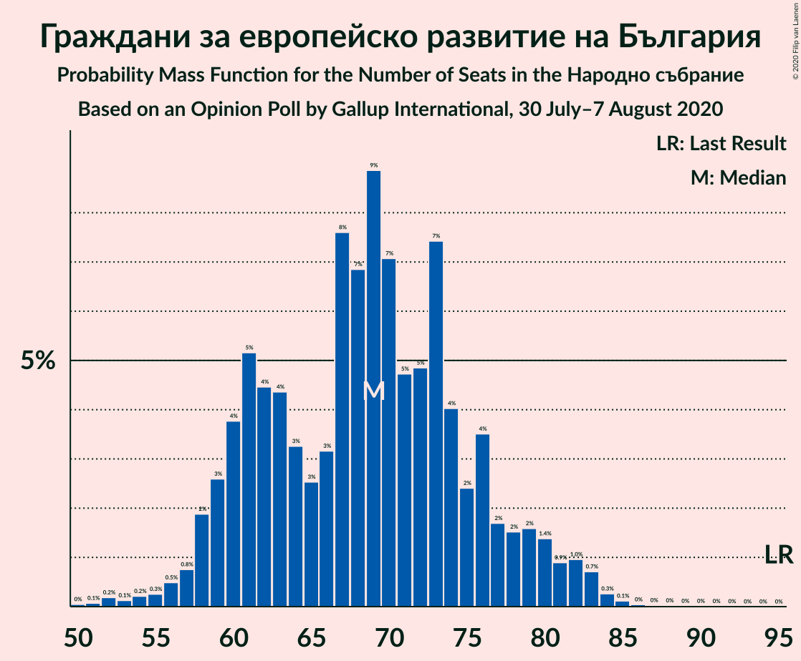
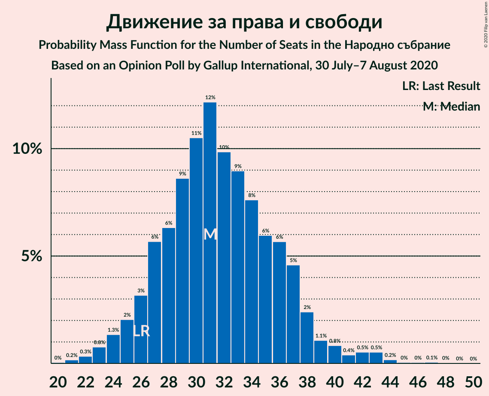
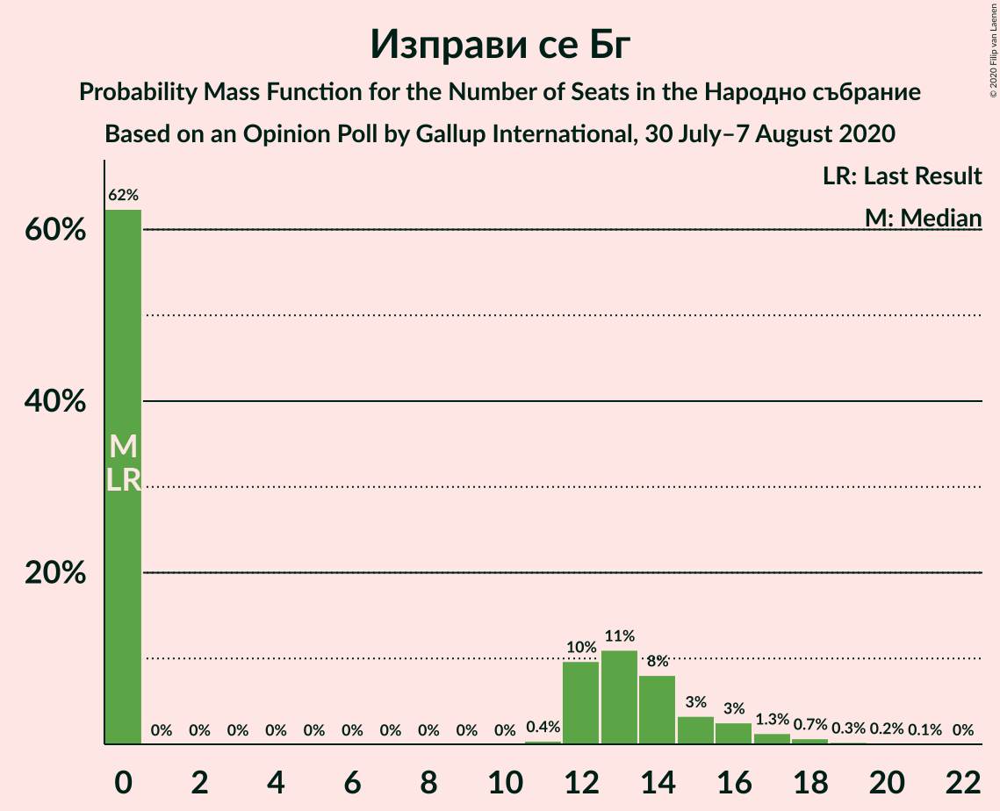
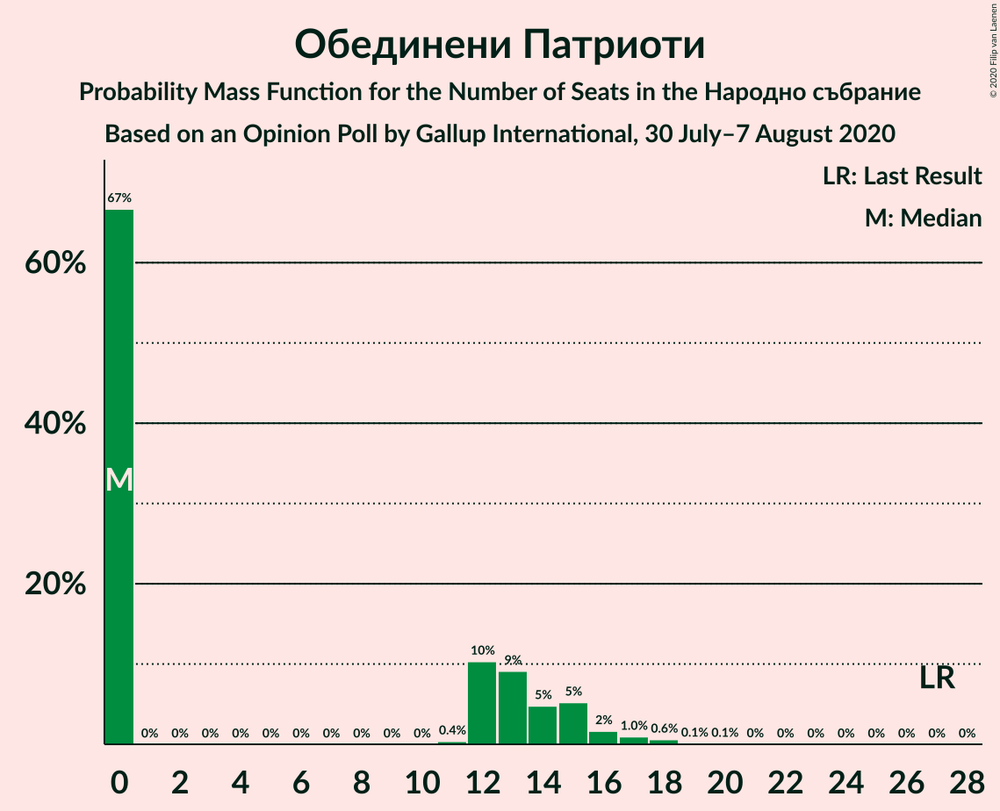
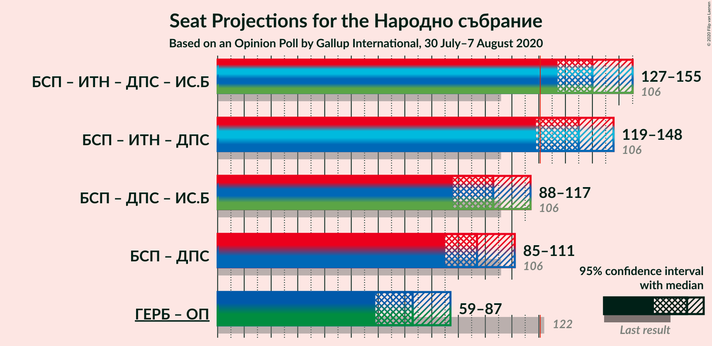

# Opinion Poll by Gallup International, 30 July–7 August 2020

<a href="#voting-intentions">Voting Intentions</a> | <a href="#seats">Seats</a> | <a href="#coalitions">Coalitions</a> | <a href="#technical-information">Technical Information</a>

## Voting Intentions

### Confidence Intervals

| Party | Last Result | Poll Result | 80% Confidence Interval | 90% Confidence Interval | 95% Confidence Interval | 99% Confidence Interval |
|:-----:|:-----------:|:-----------:|:-----------------------:|:-----------------------:|:-----------------------:|:-----------------------:|
| Граждани за европейско развитие на България | 33.5% | 22.6% | 20.4–25.1% |19.8–25.8% |19.3–26.4% |18.3–27.6% |
| Българска социалистическа партия | 27.9% | 21.7% | 19.5–24.1% |18.9–24.8% |18.4–25.4% |17.4–26.6% |
| Има такъв народ | 0.0% | 12.3% | 10.7–14.3% |10.2–14.9% |9.8–15.4% |9.1–16.4% |
| Движение за права и свободи | 9.2% | 10.5% | 8.9–12.4% |8.5–12.9% |8.2–13.4% |7.5–14.3% |
| Демократична България | 0.0% | 8.8% | 7.4–10.5% |7.0–11.1% |6.7–11.5% |6.1–12.4% |
| Изправи се Бг | 0.0% | 3.7% | 2.9–5.0% |2.6–5.4% |2.4–5.7% |2.1–6.4% |
| Обединени Патриоти | 9.3% | 3.6% | 2.7–4.8% |2.5–5.2% |2.3–5.5% |1.9–6.2% |

*Note:* The poll result column reflects the actual value used in the calculations. Published results may vary slightly, and in addition be rounded to fewer digits.

## Seats

### Confidence Intervals

| Party | Last Result | Median | 80% Confidence Interval | 90% Confidence Interval | 95% Confidence Interval | 99% Confidence Interval |
|:-----:|:-----------:|:------:|:-----------------------:|:-----------------------:|:-----------------------:|:-----------------------:|
| <a href="#граждани-за-европейско-развитие-на-българия">Граждани за европейско развитие на България</a> | 95 | 69 | 60–76 |59–79 |58–81 |54–84 |
| <a href="#българска-социалистическа-партия">Българска социалистическа партия</a> | 80 | 66 | 59–72 |56–74 |55–76 |51–80 |
| <a href="#има-такъв-народ">Има такъв народ</a> | 0 | 38 | 32–43 |30–45 |29–46 |27–50 |
| <a href="#движение-за-права-и-свободи">Движение за права и свободи</a> | 26 | 31 | 27–37 |26–38 |24–40 |22–43 |
| <a href="#демократична-българия">Демократична България</a> | 0 | 27 | 22–32 |21–34 |20–35 |18–37 |
| <a href="#изправи-се-бг">Изправи се Бг</a> | 0 | 0 | 0–14 |0–16 |0–17 |0–19 |
| <a href="#обединени-патриоти">Обединени Патриоти</a> | 27 | 0 | 0–14 |0–15 |0–16 |0–18 |

### Граждани за европейско развитие на България

*For a full overview of the results for this party, see the [Граждани за европейско развитие на България](party-гражданизаевропейскоразвитиенабългария.html) page.*

| Number of Seats | Probability | Accumulated | Special Marks |
|:---------------:|:-----------:|:-----------:|:-------------:|
| 50 | 0% | 100% |  |
| 51 | 0.1% | 99.9% |  |
| 52 | 0.2% | 99.9% |  |
| 53 | 0.1% | 99.7% |  |
| 54 | 0.2% | 99.5% |  |
| 55 | 0.3% | 99.3% |  |
| 56 | 0.5% | 99.1% |  |
| 57 | 0.8% | 98.6% |  |
| 58 | 2% | 98% |  |
| 59 | 3% | 96% |  |
| 60 | 4% | 93% |  |
| 61 | 5% | 90% |  |
| 62 | 4% | 84% |  |
| 63 | 4% | 80% |  |
| 64 | 3% | 76% |  |
| 65 | 3% | 72% |  |
| 66 | 3% | 70% |  |
| 67 | 8% | 67% |  |
| 68 | 7% | 59% |  |
| 69 | 9% | 52% | Median |
| 70 | 7% | 43% |  |
| 71 | 5% | 36% |  |
| 72 | 5% | 32% |  |
| 73 | 7% | 27% |  |
| 74 | 4% | 19% |  |
| 75 | 2% | 15% |  |
| 76 | 4% | 13% |  |
| 77 | 2% | 9% |  |
| 78 | 2% | 8% |  |
| 79 | 2% | 6% |  |
| 80 | 1.4% | 4% |  |
| 81 | 0.9% | 3% |  |
| 82 | 1.0% | 2% |  |
| 83 | 0.7% | 1.2% |  |
| 84 | 0.3% | 0.5% |  |
| 85 | 0.1% | 0.3% |  |
| 86 | 0% | 0.1% |  |
| 87 | 0% | 0.1% |  |
| 88 | 0% | 0.1% |  |
| 89 | 0% | 0% |  |
| 90 | 0% | 0% |  |
| 91 | 0% | 0% |  |
| 92 | 0% | 0% |  |
| 93 | 0% | 0% |  |
| 94 | 0% | 0% |  |
| 95 | 0% | 0% | Last Result |

### Българска социалистическа партия

*For a full overview of the results for this party, see the [Българска социалистическа партия](party-българскасоциалистическапартия.html) page.*

| Number of Seats | Probability | Accumulated | Special Marks |
|:---------------:|:-----------:|:-----------:|:-------------:|
| 48 | 0% | 100% |  |
| 49 | 0.1% | 99.9% |  |
| 50 | 0.2% | 99.8% |  |
| 51 | 0.2% | 99.6% |  |
| 52 | 0.3% | 99.4% |  |
| 53 | 0.5% | 99.1% |  |
| 54 | 0.8% | 98.6% |  |
| 55 | 1.1% | 98% |  |
| 56 | 2% | 97% |  |
| 57 | 2% | 95% |  |
| 58 | 2% | 93% |  |
| 59 | 4% | 91% |  |
| 60 | 4% | 87% |  |
| 61 | 5% | 83% |  |
| 62 | 5% | 78% |  |
| 63 | 7% | 72% |  |
| 64 | 7% | 65% |  |
| 65 | 6% | 59% |  |
| 66 | 5% | 53% | Median |
| 67 | 5% | 48% |  |
| 68 | 7% | 43% |  |
| 69 | 7% | 36% |  |
| 70 | 9% | 29% |  |
| 71 | 8% | 20% |  |
| 72 | 3% | 12% |  |
| 73 | 3% | 8% |  |
| 74 | 1.2% | 5% |  |
| 75 | 1.4% | 4% |  |
| 76 | 0.9% | 3% |  |
| 77 | 0.7% | 2% |  |
| 78 | 0.4% | 1.1% |  |
| 79 | 0.2% | 0.7% |  |
| 80 | 0.1% | 0.6% | Last Result |
| 81 | 0.1% | 0.5% |  |
| 82 | 0.2% | 0.3% |  |
| 83 | 0.1% | 0.2% |  |
| 84 | 0% | 0.1% |  |
| 85 | 0% | 0.1% |  |
| 86 | 0% | 0% |  |

### Има такъв народ

*For a full overview of the results for this party, see the [Има такъв народ](party-иматакъвнарод.html) page.*

| Number of Seats | Probability | Accumulated | Special Marks |
|:---------------:|:-----------:|:-----------:|:-------------:|
| 0 | 0% | 100% | Last Result |
| 1 | 0% | 100% |  |
| 2 | 0% | 100% |  |
| 3 | 0% | 100% |  |
| 4 | 0% | 100% |  |
| 5 | 0% | 100% |  |
| 6 | 0% | 100% |  |
| 7 | 0% | 100% |  |
| 8 | 0% | 100% |  |
| 9 | 0% | 100% |  |
| 10 | 0% | 100% |  |
| 11 | 0% | 100% |  |
| 12 | 0% | 100% |  |
| 13 | 0% | 100% |  |
| 14 | 0% | 100% |  |
| 15 | 0% | 100% |  |
| 16 | 0% | 100% |  |
| 17 | 0% | 100% |  |
| 18 | 0% | 100% |  |
| 19 | 0% | 100% |  |
| 20 | 0% | 100% |  |
| 21 | 0% | 100% |  |
| 22 | 0% | 100% |  |
| 23 | 0% | 100% |  |
| 24 | 0% | 100% |  |
| 25 | 0.1% | 100% |  |
| 26 | 0.2% | 99.9% |  |
| 27 | 0.4% | 99.7% |  |
| 28 | 0.9% | 99.3% |  |
| 29 | 2% | 98% |  |
| 30 | 2% | 97% |  |
| 31 | 4% | 94% |  |
| 32 | 5% | 91% |  |
| 33 | 6% | 86% |  |
| 34 | 6% | 80% |  |
| 35 | 7% | 74% |  |
| 36 | 7% | 67% |  |
| 37 | 9% | 60% |  |
| 38 | 9% | 51% | Median |
| 39 | 9% | 42% |  |
| 40 | 8% | 33% |  |
| 41 | 7% | 25% |  |
| 42 | 4% | 18% |  |
| 43 | 5% | 13% |  |
| 44 | 3% | 8% |  |
| 45 | 1.3% | 6% |  |
| 46 | 2% | 4% |  |
| 47 | 0.7% | 2% |  |
| 48 | 0.5% | 2% |  |
| 49 | 0.6% | 1.2% |  |
| 50 | 0.2% | 0.6% |  |
| 51 | 0.2% | 0.4% |  |
| 52 | 0.1% | 0.2% |  |
| 53 | 0% | 0.1% |  |
| 54 | 0% | 0.1% |  |
| 55 | 0% | 0% |  |

### Движение за права и свободи

*For a full overview of the results for this party, see the [Движение за права и свободи](party-движениезаправаисвободи.html) page.*

| Number of Seats | Probability | Accumulated | Special Marks |
|:---------------:|:-----------:|:-----------:|:-------------:|
| 20 | 0% | 100% |  |
| 21 | 0.2% | 99.9% |  |
| 22 | 0.3% | 99.8% |  |
| 23 | 0.8% | 99.4% |  |
| 24 | 1.3% | 98.7% |  |
| 25 | 2% | 97% |  |
| 26 | 3% | 95% | Last Result |
| 27 | 6% | 92% |  |
| 28 | 6% | 86% |  |
| 29 | 9% | 80% |  |
| 30 | 11% | 71% |  |
| 31 | 12% | 61% | Median |
| 32 | 10% | 49% |  |
| 33 | 9% | 39% |  |
| 34 | 8% | 30% |  |
| 35 | 6% | 22% |  |
| 36 | 6% | 16% |  |
| 37 | 5% | 11% |  |
| 38 | 2% | 6% |  |
| 39 | 1.1% | 4% |  |
| 40 | 0.8% | 3% |  |
| 41 | 0.4% | 2% |  |
| 42 | 0.5% | 1.4% |  |
| 43 | 0.5% | 0.9% |  |
| 44 | 0.2% | 0.4% |  |
| 45 | 0% | 0.2% |  |
| 46 | 0% | 0.2% |  |
| 47 | 0.1% | 0.1% |  |
| 48 | 0% | 0.1% |  |
| 49 | 0% | 0% |  |

### Демократична България

*For a full overview of the results for this party, see the [Демократична България](party-демократичнабългария.html) page.*

| Number of Seats | Probability | Accumulated | Special Marks |
|:---------------:|:-----------:|:-----------:|:-------------:|
| 0 | 0% | 100% | Last Result |
| 1 | 0% | 100% |  |
| 2 | 0% | 100% |  |
| 3 | 0% | 100% |  |
| 4 | 0% | 100% |  |
| 5 | 0% | 100% |  |
| 6 | 0% | 100% |  |
| 7 | 0% | 100% |  |
| 8 | 0% | 100% |  |
| 9 | 0% | 100% |  |
| 10 | 0% | 100% |  |
| 11 | 0% | 100% |  |
| 12 | 0% | 100% |  |
| 13 | 0% | 100% |  |
| 14 | 0% | 100% |  |
| 15 | 0% | 100% |  |
| 16 | 0% | 100% |  |
| 17 | 0.2% | 99.9% |  |
| 18 | 0.5% | 99.8% |  |
| 19 | 1.1% | 99.3% |  |
| 20 | 2% | 98% |  |
| 21 | 3% | 96% |  |
| 22 | 5% | 94% |  |
| 23 | 9% | 88% |  |
| 24 | 9% | 80% |  |
| 25 | 9% | 70% |  |
| 26 | 10% | 61% |  |
| 27 | 11% | 51% | Median |
| 28 | 10% | 40% |  |
| 29 | 5% | 30% |  |
| 30 | 6% | 25% |  |
| 31 | 6% | 18% |  |
| 32 | 4% | 13% |  |
| 33 | 3% | 8% |  |
| 34 | 2% | 5% |  |
| 35 | 2% | 3% |  |
| 36 | 0.7% | 2% |  |
| 37 | 0.5% | 0.8% |  |
| 38 | 0.2% | 0.3% |  |
| 39 | 0.1% | 0.2% |  |
| 40 | 0% | 0.1% |  |
| 41 | 0% | 0.1% |  |
| 42 | 0% | 0% |  |

### Изправи се Бг

*For a full overview of the results for this party, see the [Изправи се Бг](party-изправисебг.html) page.*

| Number of Seats | Probability | Accumulated | Special Marks |
|:---------------:|:-----------:|:-----------:|:-------------:|
| 0 | 62% | 100% | Last Result, Median |
| 1 | 0% | 38% |  |
| 2 | 0% | 38% |  |
| 3 | 0% | 38% |  |
| 4 | 0% | 38% |  |
| 5 | 0% | 38% |  |
| 6 | 0% | 38% |  |
| 7 | 0% | 38% |  |
| 8 | 0% | 38% |  |
| 9 | 0% | 38% |  |
| 10 | 0% | 38% |  |
| 11 | 0.4% | 38% |  |
| 12 | 10% | 37% |  |
| 13 | 11% | 27% |  |
| 14 | 8% | 16% |  |
| 15 | 3% | 8% |  |
| 16 | 3% | 5% |  |
| 17 | 1.3% | 3% |  |
| 18 | 0.7% | 1.3% |  |
| 19 | 0.3% | 0.6% |  |
| 20 | 0.2% | 0.3% |  |
| 21 | 0.1% | 0.1% |  |
| 22 | 0% | 0% |  |

### Обединени Патриоти

*For a full overview of the results for this party, see the [Обединени Патриоти](party-обединенипатриоти.html) page.*

| Number of Seats | Probability | Accumulated | Special Marks |
|:---------------:|:-----------:|:-----------:|:-------------:|
| 0 | 67% | 100% | Median |
| 1 | 0% | 33% |  |
| 2 | 0% | 33% |  |
| 3 | 0% | 33% |  |
| 4 | 0% | 33% |  |
| 5 | 0% | 33% |  |
| 6 | 0% | 33% |  |
| 7 | 0% | 33% |  |
| 8 | 0% | 33% |  |
| 9 | 0% | 33% |  |
| 10 | 0% | 33% |  |
| 11 | 0.4% | 33% |  |
| 12 | 10% | 33% |  |
| 13 | 9% | 23% |  |
| 14 | 5% | 13% |  |
| 15 | 5% | 9% |  |
| 16 | 2% | 3% |  |
| 17 | 1.0% | 2% |  |
| 18 | 0.6% | 0.8% |  |
| 19 | 0.1% | 0.2% |  |
| 20 | 0.1% | 0.1% |  |
| 21 | 0% | 0% |  |
| 22 | 0% | 0% |  |
| 23 | 0% | 0% |  |
| 24 | 0% | 0% |  |
| 25 | 0% | 0% |  |
| 26 | 0% | 0% |  |
| 27 | 0% | 0% | Last Result |

## Coalitions

### Confidence Intervals

| Coalition | Last Result | Median | Majority? | 80% Confidence Interval | 90% Confidence Interval | 95% Confidence Interval | 99% Confidence Interval |
|:---------:|:-----------:|:------:|:---------:|:-----------------------:|:-----------------------:|:-----------------------:|:-----------------------:|
| Българска социалистическа партия – Има такъв народ – Движение за права и свободи – Изправи се Бг | 106 | 140 | 99.6% | 130–148 | 128–152 | 127–155 | 121–157 |
| Българска социалистическа партия – Има такъв народ – Движение за права и свободи | 106 | 135 | 96% | 125–145 | 123–147 | 119–148 | 115–153 |
| Българска социалистическа партия – Движение за права и свободи – Изправи се Бг | 106 | 103 | 0.8% | 93–112 | 91–115 | 88–117 | 84–121 |
| Българска социалистическа партия – Движение за права и свободи | 106 | 97 | 0% | 88–106 | 87–108 | 85–111 | 80–115 |
| Граждани за европейско развитие на България – Обединени Патриоти | 122 | 73 | 0% | 64–82 | 61–85 | 59–87 | 57–91 |

### Българска социалистическа партия – Има такъв народ – Движение за права и свободи – Изправи се Бг

| Number of Seats | Probability | Accumulated | Special Marks |
|:---------------:|:-----------:|:-----------:|:-------------:|
| 106 | 0% | 100% | Last Result |
| 107 | 0% | 100% |  |
| 108 | 0% | 100% |  |
| 109 | 0% | 100% |  |
| 110 | 0% | 100% |  |
| 111 | 0% | 100% |  |
| 112 | 0% | 100% |  |
| 113 | 0% | 100% |  |
| 114 | 0% | 100% |  |
| 115 | 0% | 100% |  |
| 116 | 0% | 100% |  |
| 117 | 0% | 99.9% |  |
| 118 | 0.1% | 99.9% |  |
| 119 | 0.1% | 99.8% |  |
| 120 | 0.1% | 99.7% |  |
| 121 | 0.1% | 99.6% | Majority |
| 122 | 0.1% | 99.4% |  |
| 123 | 0.1% | 99.3% |  |
| 124 | 0.2% | 99.1% |  |
| 125 | 0.4% | 98.9% |  |
| 126 | 0.3% | 98% |  |
| 127 | 2% | 98% |  |
| 128 | 2% | 96% |  |
| 129 | 3% | 94% |  |
| 130 | 2% | 91% |  |
| 131 | 2% | 89% |  |
| 132 | 4% | 87% |  |
| 133 | 4% | 83% |  |
| 134 | 2% | 80% |  |
| 135 | 1.2% | 78% | Median |
| 136 | 5% | 76% |  |
| 137 | 4% | 71% |  |
| 138 | 5% | 67% |  |
| 139 | 8% | 61% |  |
| 140 | 5% | 53% |  |
| 141 | 4% | 49% |  |
| 142 | 3% | 44% |  |
| 143 | 6% | 42% |  |
| 144 | 6% | 36% |  |
| 145 | 7% | 29% |  |
| 146 | 7% | 22% |  |
| 147 | 2% | 15% |  |
| 148 | 4% | 13% |  |
| 149 | 1.5% | 10% |  |
| 150 | 2% | 8% |  |
| 151 | 0.4% | 6% |  |
| 152 | 1.0% | 5% |  |
| 153 | 0.9% | 4% |  |
| 154 | 0.7% | 3% |  |
| 155 | 0.3% | 3% |  |
| 156 | 0.8% | 2% |  |
| 157 | 1.2% | 2% |  |
| 158 | 0.2% | 0.5% |  |
| 159 | 0.1% | 0.3% |  |
| 160 | 0.1% | 0.2% |  |
| 161 | 0.1% | 0.1% |  |
| 162 | 0% | 0% |  |

### Българска социалистическа партия – Има такъв народ – Движение за права и свободи

| Number of Seats | Probability | Accumulated | Special Marks |
|:---------------:|:-----------:|:-----------:|:-------------:|
| 106 | 0% | 100% | Last Result |
| 107 | 0% | 100% |  |
| 108 | 0% | 100% |  |
| 109 | 0% | 100% |  |
| 110 | 0% | 100% |  |
| 111 | 0% | 100% |  |
| 112 | 0% | 100% |  |
| 113 | 0% | 99.9% |  |
| 114 | 0.1% | 99.9% |  |
| 115 | 0.4% | 99.8% |  |
| 116 | 0.5% | 99.5% |  |
| 117 | 0.6% | 99.0% |  |
| 118 | 0.8% | 98% |  |
| 119 | 0.5% | 98% |  |
| 120 | 0.6% | 97% |  |
| 121 | 0.6% | 96% | Majority |
| 122 | 0.6% | 96% |  |
| 123 | 0.5% | 95% |  |
| 124 | 2% | 95% |  |
| 125 | 4% | 93% |  |
| 126 | 2% | 90% |  |
| 127 | 4% | 87% |  |
| 128 | 4% | 84% |  |
| 129 | 7% | 79% |  |
| 130 | 3% | 72% |  |
| 131 | 3% | 69% |  |
| 132 | 7% | 66% |  |
| 133 | 6% | 59% |  |
| 134 | 2% | 53% |  |
| 135 | 2% | 51% | Median |
| 136 | 6% | 48% |  |
| 137 | 1.3% | 43% |  |
| 138 | 6% | 41% |  |
| 139 | 6% | 36% |  |
| 140 | 3% | 29% |  |
| 141 | 2% | 26% |  |
| 142 | 1.4% | 24% |  |
| 143 | 4% | 23% |  |
| 144 | 6% | 18% |  |
| 145 | 5% | 12% |  |
| 146 | 2% | 7% |  |
| 147 | 1.2% | 5% |  |
| 148 | 3% | 4% |  |
| 149 | 0.4% | 2% |  |
| 150 | 0.2% | 1.3% |  |
| 151 | 0.2% | 1.1% |  |
| 152 | 0.3% | 0.9% |  |
| 153 | 0.2% | 0.6% |  |
| 154 | 0% | 0.5% |  |
| 155 | 0.1% | 0.4% |  |
| 156 | 0.1% | 0.3% |  |
| 157 | 0.1% | 0.2% |  |
| 158 | 0% | 0.1% |  |
| 159 | 0% | 0% |  |

### Българска социалистическа партия – Движение за права и свободи – Изправи се Бг

| Number of Seats | Probability | Accumulated | Special Marks |
|:---------------:|:-----------:|:-----------:|:-------------:|
| 80 | 0% | 100% |  |
| 81 | 0% | 99.9% |  |
| 82 | 0.1% | 99.9% |  |
| 83 | 0.1% | 99.7% |  |
| 84 | 0.3% | 99.7% |  |
| 85 | 0.2% | 99.4% |  |
| 86 | 0.6% | 99.2% |  |
| 87 | 0.5% | 98.6% |  |
| 88 | 0.9% | 98% |  |
| 89 | 1.0% | 97% |  |
| 90 | 1.1% | 96% |  |
| 91 | 1.3% | 95% |  |
| 92 | 3% | 94% |  |
| 93 | 2% | 91% |  |
| 94 | 3% | 89% |  |
| 95 | 3% | 87% |  |
| 96 | 5% | 84% |  |
| 97 | 4% | 79% | Median |
| 98 | 4% | 75% |  |
| 99 | 5% | 71% |  |
| 100 | 5% | 66% |  |
| 101 | 5% | 61% |  |
| 102 | 6% | 56% |  |
| 103 | 6% | 50% |  |
| 104 | 5% | 44% |  |
| 105 | 5% | 39% |  |
| 106 | 6% | 34% | Last Result |
| 107 | 3% | 28% |  |
| 108 | 4% | 25% |  |
| 109 | 3% | 20% |  |
| 110 | 3% | 17% |  |
| 111 | 3% | 14% |  |
| 112 | 2% | 11% |  |
| 113 | 2% | 10% |  |
| 114 | 1.4% | 8% |  |
| 115 | 2% | 6% |  |
| 116 | 1.0% | 4% |  |
| 117 | 0.9% | 3% |  |
| 118 | 0.9% | 2% |  |
| 119 | 0.4% | 2% |  |
| 120 | 0.4% | 1.2% |  |
| 121 | 0.4% | 0.8% | Majority |
| 122 | 0.2% | 0.5% |  |
| 123 | 0.1% | 0.3% |  |
| 124 | 0.1% | 0.2% |  |
| 125 | 0.1% | 0.2% |  |
| 126 | 0.1% | 0.1% |  |
| 127 | 0% | 0% |  |

### Българска социалистическа партия – Движение за права и свободи

| Number of Seats | Probability | Accumulated | Special Marks |
|:---------------:|:-----------:|:-----------:|:-------------:|
| 76 | 0% | 100% |  |
| 77 | 0.1% | 99.9% |  |
| 78 | 0.1% | 99.9% |  |
| 79 | 0.2% | 99.8% |  |
| 80 | 0.1% | 99.6% |  |
| 81 | 0.4% | 99.5% |  |
| 82 | 0.3% | 99.1% |  |
| 83 | 0.6% | 98.8% |  |
| 84 | 0.6% | 98% |  |
| 85 | 1.1% | 98% |  |
| 86 | 2% | 97% |  |
| 87 | 2% | 95% |  |
| 88 | 3% | 93% |  |
| 89 | 3% | 90% |  |
| 90 | 3% | 87% |  |
| 91 | 3% | 84% |  |
| 92 | 5% | 81% |  |
| 93 | 4% | 76% |  |
| 94 | 5% | 72% |  |
| 95 | 4% | 67% |  |
| 96 | 8% | 63% |  |
| 97 | 5% | 54% | Median |
| 98 | 5% | 50% |  |
| 99 | 5% | 44% |  |
| 100 | 6% | 40% |  |
| 101 | 5% | 33% |  |
| 102 | 5% | 29% |  |
| 103 | 5% | 23% |  |
| 104 | 4% | 19% |  |
| 105 | 3% | 14% |  |
| 106 | 3% | 11% | Last Result |
| 107 | 2% | 8% |  |
| 108 | 2% | 6% |  |
| 109 | 0.9% | 5% |  |
| 110 | 1.1% | 4% |  |
| 111 | 0.8% | 3% |  |
| 112 | 0.6% | 2% |  |
| 113 | 0.3% | 1.2% |  |
| 114 | 0.3% | 0.9% |  |
| 115 | 0.2% | 0.6% |  |
| 116 | 0.1% | 0.4% |  |
| 117 | 0.1% | 0.2% |  |
| 118 | 0.1% | 0.1% |  |
| 119 | 0% | 0.1% |  |
| 120 | 0% | 0% |  |

### Граждани за европейско развитие на България – Обединени Патриоти

| Number of Seats | Probability | Accumulated | Special Marks |
|:---------------:|:-----------:|:-----------:|:-------------:|
| 52 | 0% | 100% |  |
| 53 | 0% | 99.9% |  |
| 54 | 0.1% | 99.9% |  |
| 55 | 0.1% | 99.9% |  |
| 56 | 0.3% | 99.8% |  |
| 57 | 0.3% | 99.5% |  |
| 58 | 0.7% | 99.2% |  |
| 59 | 1.2% | 98.5% |  |
| 60 | 1.2% | 97% |  |
| 61 | 2% | 96% |  |
| 62 | 2% | 94% |  |
| 63 | 2% | 92% |  |
| 64 | 2% | 90% |  |
| 65 | 1.5% | 88% |  |
| 66 | 2% | 87% |  |
| 67 | 6% | 85% |  |
| 68 | 4% | 79% |  |
| 69 | 6% | 75% | Median |
| 70 | 7% | 69% |  |
| 71 | 4% | 62% |  |
| 72 | 5% | 58% |  |
| 73 | 9% | 53% |  |
| 74 | 5% | 44% |  |
| 75 | 4% | 39% |  |
| 76 | 5% | 35% |  |
| 77 | 4% | 30% |  |
| 78 | 3% | 26% |  |
| 79 | 4% | 23% |  |
| 80 | 4% | 19% |  |
| 81 | 4% | 15% |  |
| 82 | 3% | 12% |  |
| 83 | 2% | 9% |  |
| 84 | 1.1% | 8% |  |
| 85 | 2% | 6% |  |
| 86 | 1.3% | 5% |  |
| 87 | 1.1% | 4% |  |
| 88 | 0.8% | 2% |  |
| 89 | 0.6% | 2% |  |
| 90 | 0.2% | 1.0% |  |
| 91 | 0.3% | 0.7% |  |
| 92 | 0.1% | 0.4% |  |
| 93 | 0.1% | 0.3% |  |
| 94 | 0.1% | 0.2% |  |
| 95 | 0.1% | 0.2% |  |
| 96 | 0% | 0.1% |  |
| 97 | 0% | 0% |  |
| 98 | 0% | 0% |  |
| 99 | 0% | 0% |  |
| 100 | 0% | 0% |  |
| 101 | 0% | 0% |  |
| 102 | 0% | 0% |  |
| 103 | 0% | 0% |  |
| 104 | 0% | 0% |  |
| 105 | 0% | 0% |  |
| 106 | 0% | 0% |  |
| 107 | 0% | 0% |  |
| 108 | 0% | 0% |  |
| 109 | 0% | 0% |  |
| 110 | 0% | 0% |  |
| 111 | 0% | 0% |  |
| 112 | 0% | 0% |  |
| 113 | 0% | 0% |  |
| 114 | 0% | 0% |  |
| 115 | 0% | 0% |  |
| 116 | 0% | 0% |  |
| 117 | 0% | 0% |  |
| 118 | 0% | 0% |  |
| 119 | 0% | 0% |  |
| 120 | 0% | 0% |  |
| 121 | 0% | 0% | Majority |
| 122 | 0% | 0% | Last Result |

## Technical Information

### Opinion Poll

+ **Polling firm:** Gallup International
+ **Commissioner(s):** —
+ **Fieldwork period:** 30 July–7 August 2020

### Calculations

+ **Sample size:** 535
+ **Simulations done:** 1,048,576
+ **Error estimate:** 1.02%

