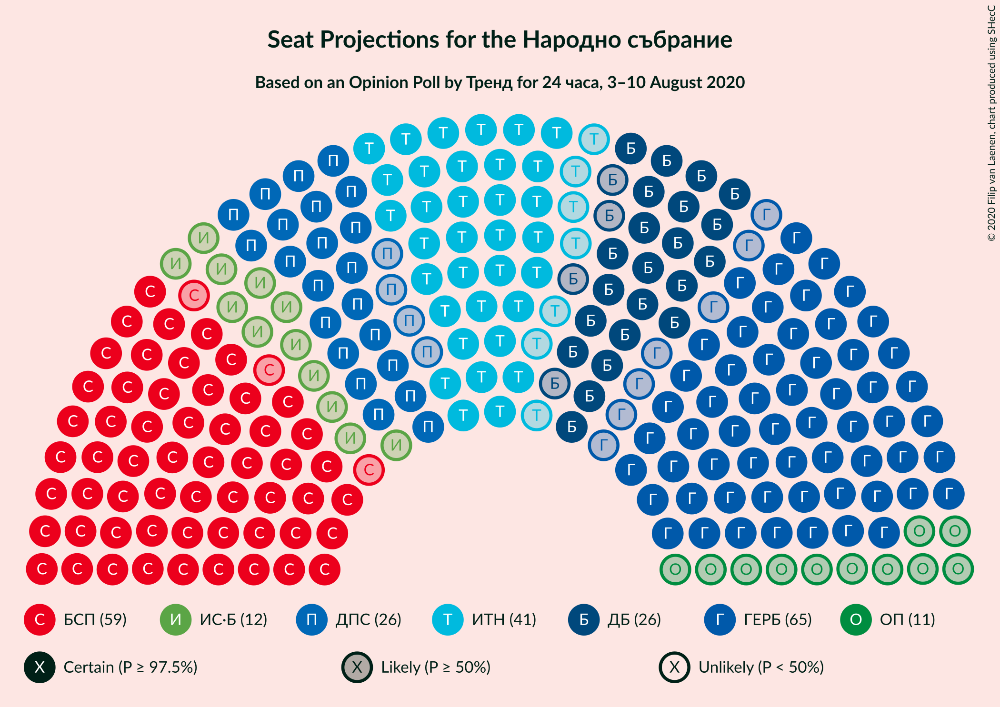
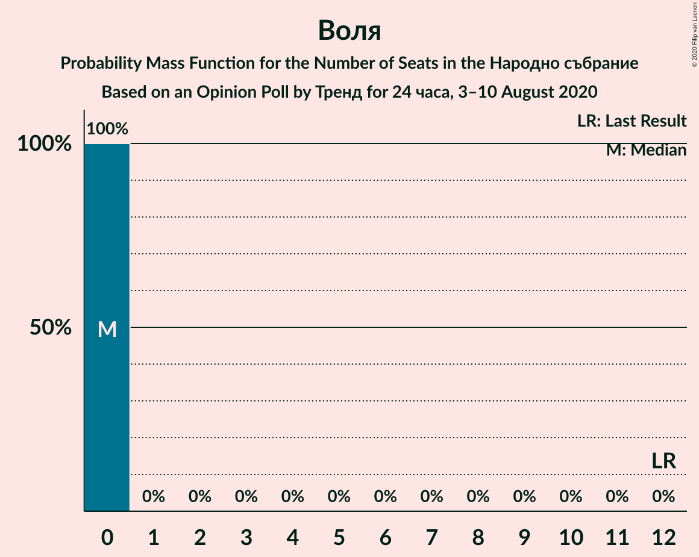
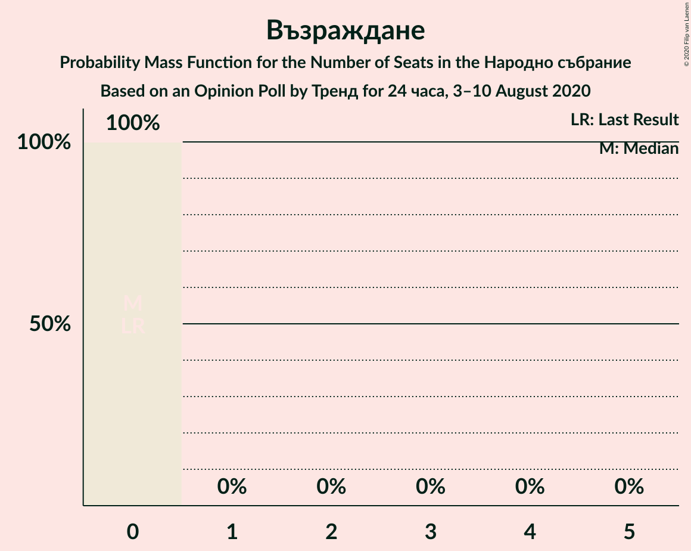
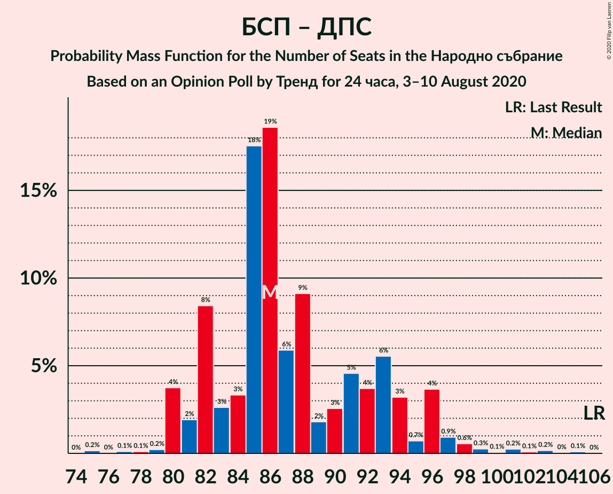

# Opinion Poll by Тренд for 24 часа, 3–10 August 2020

<a href="#voting-intentions">Voting Intentions</a> | <a href="#seats">Seats</a> | <a href="#coalitions">Coalitions</a> | <a href="#technical-information">Technical Information</a>

## Voting Intentions

### Confidence Intervals

| Party | Last Result | Poll Result | 80% Confidence Interval | 90% Confidence Interval | 95% Confidence Interval | 99% Confidence Interval |
|:-----:|:-----------:|:-----------:|:-----------------------:|:-----------------------:|:-----------------------:|:-----------------------:|
| Граждани за европейско развитие на България | 33.5% | 25.0% | 23.4–26.9% |22.9–27.4% |22.5–27.8% |21.7–28.7% |
| Българска социалистическа партия | 27.9% | 23.8% | 22.1–25.5% |21.6–26.0% |21.2–26.5% |20.5–27.4% |
| Има такъв народ | 0.0% | 15.4% | 14.1–17.0% |13.7–17.4% |13.3–17.8% |12.7–18.6% |
| Демократична България | 0.0% | 10.5% | 9.3–11.8% |9.0–12.2% |8.7–12.5% |8.2–13.2% |
| Движение за права и свободи | 9.2% | 10.2% | 9.1–11.5% |8.7–11.9% |8.5–12.2% |8.0–12.9% |
| Изправи се Бг | 0.0% | 4.6% | 3.8–5.5% |3.6–5.8% |3.4–6.0% |3.1–6.5% |
| Обединени Патриоти | 9.3% | 4.3% | 3.5–5.2% |3.3–5.5% |3.2–5.7% |2.9–6.2% |
| Воля | 4.3% | 1.3% | 0.9–1.9% |0.8–2.0% |0.7–2.2% |0.6–2.5% |
| Атака | 0.0% | 1.2% | 0.9–1.8% |0.8–1.9% |0.7–2.1% |0.5–2.4% |
| Възраждане | 0.0% | 0.8% | 0.5–1.3% |0.5–1.4% |0.4–1.6% |0.3–1.8% |
| Алтернатива за българско възраждане | 1.6% | 0.2% | 0.1–0.5% |0.1–0.6% |0.1–0.7% |0.0–0.9% |

*Note:* The poll result column reflects the actual value used in the calculations. Published results may vary slightly, and in addition be rounded to fewer digits.

## Seats

### Confidence Intervals

| Party | Last Result | Median | 80% Confidence Interval | 90% Confidence Interval | 95% Confidence Interval | 99% Confidence Interval |
|:-----:|:-----------:|:------:|:-----------------------:|:-----------------------:|:-----------------------:|:-----------------------:|
| <a href="#граждани-за-европейско-развитие-на-българия">Граждани за европейско развитие на България</a> | 95 | 67 | 60–70 |60–70 |60–70 |58–74 |
| <a href="#българска-социалистическа-партия">Българска социалистическа партия</a> | 80 | 61 | 60–67 |58–67 |56–67 |55–71 |
| <a href="#има-такъв-народ">Има такъв народ</a> | 0 | 40 | 37–42 |35–47 |33–49 |32–49 |
| <a href="#демократична-българия">Демократична България</a> | 0 | 30 | 26–33 |24–33 |23–33 |23–33 |
| <a href="#движение-за-права-и-свободи">Движение за права и свободи</a> | 26 | 26 | 23–31 |20–31 |20–31 |20–32 |
| <a href="#изправи-се-бг">Изправи се Бг</a> | 0 | 12 | 0–14 |0–14 |0–15 |0–16 |
| <a href="#обединени-патриоти">Обединени Патриоти</a> | 27 | 0 | 0–12 |0–13 |0–13 |0–16 |
| <a href="#воля">Воля</a> | 12 | 0 | 0 |0 |0 |0 |
| <a href="#атака">Атака</a> | 0 | 0 | 0 |0 |0 |0 |
| <a href="#възраждане">Възраждане</a> | 0 | 0 | 0 |0 |0 |0 |
| <a href="#алтернатива-за-българско-възраждане">Алтернатива за българско възраждане</a> | 0 | 0 | 0 |0 |0 |0 |

### Граждани за европейско развитие на България

*For a full overview of the results for this party, see the [Граждани за европейско развитие на България](party-гражданизаевропейскоразвитиенабългария.html) page.*

| Number of Seats | Probability | Accumulated | Special Marks |
|:---------------:|:-----------:|:-----------:|:-------------:|
| 55 | 0.3% | 100% |  |
| 56 | 0.1% | 99.7% |  |
| 57 | 0% | 99.6% |  |
| 58 | 0.3% | 99.6% |  |
| 59 | 1.4% | 99.3% |  |
| 60 | 16% | 98% |  |
| 61 | 1.4% | 82% |  |
| 62 | 8% | 80% |  |
| 63 | 0.3% | 73% |  |
| 64 | 0.3% | 72% |  |
| 65 | 0.8% | 72% |  |
| 66 | 1.0% | 71% |  |
| 67 | 20% | 70% | Median |
| 68 | 35% | 50% |  |
| 69 | 3% | 15% |  |
| 70 | 10% | 12% |  |
| 71 | 0.2% | 2% |  |
| 72 | 0.7% | 2% |  |
| 73 | 0.3% | 0.8% |  |
| 74 | 0.1% | 0.5% |  |
| 75 | 0% | 0.5% |  |
| 76 | 0% | 0.4% |  |
| 77 | 0.2% | 0.4% |  |
| 78 | 0.1% | 0.2% |  |
| 79 | 0% | 0% |  |
| 80 | 0% | 0% |  |
| 81 | 0% | 0% |  |
| 82 | 0% | 0% |  |
| 83 | 0% | 0% |  |
| 84 | 0% | 0% |  |
| 85 | 0% | 0% |  |
| 86 | 0% | 0% |  |
| 87 | 0% | 0% |  |
| 88 | 0% | 0% |  |
| 89 | 0% | 0% |  |
| 90 | 0% | 0% |  |
| 91 | 0% | 0% |  |
| 92 | 0% | 0% |  |
| 93 | 0% | 0% |  |
| 94 | 0% | 0% |  |
| 95 | 0% | 0% | Last Result |

### Българска социалистическа партия

*For a full overview of the results for this party, see the [Българска социалистическа партия](party-българскасоциалистическапартия.html) page.*

| Number of Seats | Probability | Accumulated | Special Marks |
|:---------------:|:-----------:|:-----------:|:-------------:|
| 50 | 0.1% | 100% |  |
| 51 | 0% | 99.9% |  |
| 52 | 0.1% | 99.9% |  |
| 53 | 0% | 99.8% |  |
| 54 | 0.2% | 99.8% |  |
| 55 | 0.9% | 99.6% |  |
| 56 | 2% | 98.7% |  |
| 57 | 1.2% | 97% |  |
| 58 | 3% | 96% |  |
| 59 | 0.8% | 93% |  |
| 60 | 9% | 92% |  |
| 61 | 38% | 83% | Median |
| 62 | 0.7% | 45% |  |
| 63 | 16% | 44% |  |
| 64 | 0.3% | 29% |  |
| 65 | 2% | 28% |  |
| 66 | 4% | 26% |  |
| 67 | 21% | 22% |  |
| 68 | 0.1% | 1.5% |  |
| 69 | 0.7% | 1.3% |  |
| 70 | 0.1% | 0.6% |  |
| 71 | 0.1% | 0.5% |  |
| 72 | 0.1% | 0.4% |  |
| 73 | 0.1% | 0.2% |  |
| 74 | 0.1% | 0.1% |  |
| 75 | 0% | 0.1% |  |
| 76 | 0% | 0.1% |  |
| 77 | 0% | 0.1% |  |
| 78 | 0% | 0% |  |
| 79 | 0% | 0% |  |
| 80 | 0% | 0% | Last Result |

### Има такъв народ

*For a full overview of the results for this party, see the [Има такъв народ](party-иматакъвнарод.html) page.*

| Number of Seats | Probability | Accumulated | Special Marks |
|:---------------:|:-----------:|:-----------:|:-------------:|
| 0 | 0% | 100% | Last Result |
| 1 | 0% | 100% |  |
| 2 | 0% | 100% |  |
| 3 | 0% | 100% |  |
| 4 | 0% | 100% |  |
| 5 | 0% | 100% |  |
| 6 | 0% | 100% |  |
| 7 | 0% | 100% |  |
| 8 | 0% | 100% |  |
| 9 | 0% | 100% |  |
| 10 | 0% | 100% |  |
| 11 | 0% | 100% |  |
| 12 | 0% | 100% |  |
| 13 | 0% | 100% |  |
| 14 | 0% | 100% |  |
| 15 | 0% | 100% |  |
| 16 | 0% | 100% |  |
| 17 | 0% | 100% |  |
| 18 | 0% | 100% |  |
| 19 | 0% | 100% |  |
| 20 | 0% | 100% |  |
| 21 | 0% | 100% |  |
| 22 | 0% | 100% |  |
| 23 | 0% | 100% |  |
| 24 | 0% | 100% |  |
| 25 | 0% | 100% |  |
| 26 | 0% | 100% |  |
| 27 | 0% | 100% |  |
| 28 | 0% | 100% |  |
| 29 | 0% | 100% |  |
| 30 | 0.1% | 100% |  |
| 31 | 0.1% | 99.9% |  |
| 32 | 1.3% | 99.8% |  |
| 33 | 1.1% | 98.5% |  |
| 34 | 0.2% | 97% |  |
| 35 | 3% | 97% |  |
| 36 | 0.4% | 95% |  |
| 37 | 9% | 94% |  |
| 38 | 0.7% | 85% |  |
| 39 | 2% | 85% |  |
| 40 | 55% | 83% | Median |
| 41 | 2% | 28% |  |
| 42 | 17% | 27% |  |
| 43 | 1.0% | 9% |  |
| 44 | 0.2% | 8% |  |
| 45 | 0.1% | 8% |  |
| 46 | 2% | 8% |  |
| 47 | 1.1% | 6% |  |
| 48 | 2% | 5% |  |
| 49 | 2% | 3% |  |
| 50 | 0% | 0% |  |

### Демократична България

*For a full overview of the results for this party, see the [Демократична България](party-демократичнабългария.html) page.*

| Number of Seats | Probability | Accumulated | Special Marks |
|:---------------:|:-----------:|:-----------:|:-------------:|
| 0 | 0% | 100% | Last Result |
| 1 | 0% | 100% |  |
| 2 | 0% | 100% |  |
| 3 | 0% | 100% |  |
| 4 | 0% | 100% |  |
| 5 | 0% | 100% |  |
| 6 | 0% | 100% |  |
| 7 | 0% | 100% |  |
| 8 | 0% | 100% |  |
| 9 | 0% | 100% |  |
| 10 | 0% | 100% |  |
| 11 | 0% | 100% |  |
| 12 | 0% | 100% |  |
| 13 | 0% | 100% |  |
| 14 | 0% | 100% |  |
| 15 | 0% | 100% |  |
| 16 | 0% | 100% |  |
| 17 | 0% | 100% |  |
| 18 | 0% | 100% |  |
| 19 | 0% | 100% |  |
| 20 | 0.2% | 100% |  |
| 21 | 0.1% | 99.8% |  |
| 22 | 0.1% | 99.7% |  |
| 23 | 4% | 99.6% |  |
| 24 | 0.5% | 95% |  |
| 25 | 0.7% | 95% |  |
| 26 | 4% | 94% |  |
| 27 | 6% | 90% |  |
| 28 | 1.0% | 84% |  |
| 29 | 20% | 83% |  |
| 30 | 23% | 63% | Median |
| 31 | 2% | 40% |  |
| 32 | 1.4% | 38% |  |
| 33 | 36% | 36% |  |
| 34 | 0.2% | 0.5% |  |
| 35 | 0.1% | 0.3% |  |
| 36 | 0% | 0.2% |  |
| 37 | 0.2% | 0.2% |  |
| 38 | 0% | 0.1% |  |
| 39 | 0% | 0% |  |

### Движение за права и свободи

*For a full overview of the results for this party, see the [Движение за права и свободи](party-движениезаправаисвободи.html) page.*

| Number of Seats | Probability | Accumulated | Special Marks |
|:---------------:|:-----------:|:-----------:|:-------------:|
| 18 | 0.5% | 100% |  |
| 19 | 0% | 99.5% |  |
| 20 | 7% | 99.5% |  |
| 21 | 0.2% | 92% |  |
| 22 | 0.5% | 92% |  |
| 23 | 3% | 92% |  |
| 24 | 1.4% | 88% |  |
| 25 | 5% | 87% |  |
| 26 | 57% | 82% | Last Result, Median |
| 27 | 3% | 25% |  |
| 28 | 3% | 22% |  |
| 29 | 2% | 19% |  |
| 30 | 1.1% | 17% |  |
| 31 | 15% | 16% |  |
| 32 | 0.4% | 0.7% |  |
| 33 | 0% | 0.3% |  |
| 34 | 0.2% | 0.2% |  |
| 35 | 0% | 0.1% |  |
| 36 | 0% | 0% |  |

### Изправи се Бг

*For a full overview of the results for this party, see the [Изправи се Бг](party-изправисебг.html) page.*

| Number of Seats | Probability | Accumulated | Special Marks |
|:---------------:|:-----------:|:-----------:|:-------------:|
| 0 | 25% | 100% | Last Result |
| 1 | 0% | 75% |  |
| 2 | 0% | 75% |  |
| 3 | 0% | 75% |  |
| 4 | 0% | 75% |  |
| 5 | 0% | 75% |  |
| 6 | 0% | 75% |  |
| 7 | 0% | 75% |  |
| 8 | 0% | 75% |  |
| 9 | 0% | 75% |  |
| 10 | 0.1% | 75% |  |
| 11 | 5% | 75% |  |
| 12 | 45% | 70% | Median |
| 13 | 2% | 25% |  |
| 14 | 20% | 23% |  |
| 15 | 2% | 3% |  |
| 16 | 0.8% | 1.2% |  |
| 17 | 0.4% | 0.4% |  |
| 18 | 0.1% | 0.1% |  |
| 19 | 0% | 0% |  |

### Обединени Патриоти

*For a full overview of the results for this party, see the [Обединени Патриоти](party-обединенипатриоти.html) page.*

| Number of Seats | Probability | Accumulated | Special Marks |
|:---------------:|:-----------:|:-----------:|:-------------:|
| 0 | 55% | 100% | Median |
| 1 | 0% | 45% |  |
| 2 | 0% | 45% |  |
| 3 | 0% | 45% |  |
| 4 | 0% | 45% |  |
| 5 | 0% | 45% |  |
| 6 | 0% | 45% |  |
| 7 | 0% | 45% |  |
| 8 | 0% | 45% |  |
| 9 | 0% | 45% |  |
| 10 | 0% | 45% |  |
| 11 | 33% | 45% |  |
| 12 | 6% | 12% |  |
| 13 | 5% | 6% |  |
| 14 | 0.2% | 1.0% |  |
| 15 | 0.3% | 0.8% |  |
| 16 | 0.4% | 0.5% |  |
| 17 | 0% | 0.1% |  |
| 18 | 0.1% | 0.1% |  |
| 19 | 0% | 0% |  |
| 20 | 0% | 0% |  |
| 21 | 0% | 0% |  |
| 22 | 0% | 0% |  |
| 23 | 0% | 0% |  |
| 24 | 0% | 0% |  |
| 25 | 0% | 0% |  |
| 26 | 0% | 0% |  |
| 27 | 0% | 0% | Last Result |

### Воля

*For a full overview of the results for this party, see the [Воля](party-воля.html) page.*

| Number of Seats | Probability | Accumulated | Special Marks |
|:---------------:|:-----------:|:-----------:|:-------------:|
| 0 | 100% | 100% | Median |
| 1 | 0% | 0% |  |
| 2 | 0% | 0% |  |
| 3 | 0% | 0% |  |
| 4 | 0% | 0% |  |
| 5 | 0% | 0% |  |
| 6 | 0% | 0% |  |
| 7 | 0% | 0% |  |
| 8 | 0% | 0% |  |
| 9 | 0% | 0% |  |
| 10 | 0% | 0% |  |
| 11 | 0% | 0% |  |
| 12 | 0% | 0% | Last Result |

### Атака

*For a full overview of the results for this party, see the [Атака](party-атака.html) page.*

| Number of Seats | Probability | Accumulated | Special Marks |
|:---------------:|:-----------:|:-----------:|:-------------:|
| 0 | 100% | 100% | Last Result, Median |

### Възраждане

*For a full overview of the results for this party, see the [Възраждане](party-възраждане.html) page.*

| Number of Seats | Probability | Accumulated | Special Marks |
|:---------------:|:-----------:|:-----------:|:-------------:|
| 0 | 100% | 100% | Last Result, Median |

### Алтернатива за българско възраждане

*For a full overview of the results for this party, see the [Алтернатива за българско възраждане](party-алтернативазабългарсковъзраждане.html) page.*

| Number of Seats | Probability | Accumulated | Special Marks |
|:---------------:|:-----------:|:-----------:|:-------------:|
| 0 | 100% | 100% | Last Result, Median |

## Coalitions

### Confidence Intervals

| Coalition | Last Result | Median | Majority? | 80% Confidence Interval | 90% Confidence Interval | 95% Confidence Interval | 99% Confidence Interval |
|:---------:|:-----------:|:------:|:---------:|:-----------------------:|:-----------------------:|:-----------------------:|:-----------------------:|
| Българска социалистическа партия – Движение за права и свободи | 106 | 87 | 0% | 81–94 | 80–94 | 80–95 | 78–98 |
| Граждани за европейско развитие на България – Обединени Патриоти | 122 | 68 | 0% | 60–81 | 60–81 | 60–82 | 60–84 |

### Българска социалистическа партия – Движение за права и свободи

| Number of Seats | Probability | Accumulated | Special Marks |
|:---------------:|:-----------:|:-----------:|:-------------:|
| 76 | 0% | 100% |  |
| 77 | 0% | 99.9% |  |
| 78 | 0.6% | 99.9% |  |
| 79 | 0% | 99.3% |  |
| 80 | 7% | 99.3% |  |
| 81 | 3% | 92% |  |
| 82 | 1.1% | 89% |  |
| 83 | 1.1% | 88% |  |
| 84 | 1.3% | 87% |  |
| 85 | 2% | 86% |  |
| 86 | 0.2% | 84% |  |
| 87 | 36% | 83% | Median |
| 88 | 2% | 48% |  |
| 89 | 3% | 45% |  |
| 90 | 0.4% | 43% |  |
| 91 | 3% | 42% |  |
| 92 | 2% | 39% |  |
| 93 | 20% | 38% |  |
| 94 | 15% | 18% |  |
| 95 | 1.1% | 3% |  |
| 96 | 1.2% | 2% |  |
| 97 | 0.2% | 0.8% |  |
| 98 | 0.1% | 0.6% |  |
| 99 | 0% | 0.5% |  |
| 100 | 0% | 0.4% |  |
| 101 | 0.3% | 0.4% |  |
| 102 | 0% | 0.1% |  |
| 103 | 0% | 0.1% |  |
| 104 | 0% | 0.1% |  |
| 105 | 0% | 0.1% |  |
| 106 | 0% | 0.1% | Last Result |
| 107 | 0.1% | 0.1% |  |
| 108 | 0% | 0% |  |

### Граждани за европейско развитие на България – Обединени Патриоти

| Number of Seats | Probability | Accumulated | Special Marks |
|:---------------:|:-----------:|:-----------:|:-------------:|
| 58 | 0% | 100% |  |
| 59 | 0.1% | 99.9% |  |
| 60 | 15% | 99.9% |  |
| 61 | 0% | 85% |  |
| 62 | 0.4% | 85% |  |
| 63 | 0.3% | 84% |  |
| 64 | 0% | 84% |  |
| 65 | 0.7% | 84% |  |
| 66 | 0.1% | 83% |  |
| 67 | 0.5% | 83% | Median |
| 68 | 35% | 83% |  |
| 69 | 2% | 48% |  |
| 70 | 1.2% | 47% |  |
| 71 | 1.1% | 45% |  |
| 72 | 3% | 44% |  |
| 73 | 4% | 42% |  |
| 74 | 4% | 38% |  |
| 75 | 0.2% | 34% |  |
| 76 | 0.1% | 33% |  |
| 77 | 0.6% | 33% |  |
| 78 | 20% | 33% |  |
| 79 | 1.2% | 13% |  |
| 80 | 0.1% | 11% |  |
| 81 | 8% | 11% |  |
| 82 | 2% | 3% |  |
| 83 | 1.1% | 2% |  |
| 84 | 0.1% | 0.5% |  |
| 85 | 0.2% | 0.4% |  |
| 86 | 0.1% | 0.2% |  |
| 87 | 0% | 0.1% |  |
| 88 | 0% | 0.1% |  |
| 89 | 0% | 0.1% |  |
| 90 | 0% | 0.1% |  |
| 91 | 0% | 0.1% |  |
| 92 | 0.1% | 0.1% |  |
| 93 | 0% | 0% |  |
| 94 | 0% | 0% |  |
| 95 | 0% | 0% |  |
| 96 | 0% | 0% |  |
| 97 | 0% | 0% |  |
| 98 | 0% | 0% |  |
| 99 | 0% | 0% |  |
| 100 | 0% | 0% |  |
| 101 | 0% | 0% |  |
| 102 | 0% | 0% |  |
| 103 | 0% | 0% |  |
| 104 | 0% | 0% |  |
| 105 | 0% | 0% |  |
| 106 | 0% | 0% |  |
| 107 | 0% | 0% |  |
| 108 | 0% | 0% |  |
| 109 | 0% | 0% |  |
| 110 | 0% | 0% |  |
| 111 | 0% | 0% |  |
| 112 | 0% | 0% |  |
| 113 | 0% | 0% |  |
| 114 | 0% | 0% |  |
| 115 | 0% | 0% |  |
| 116 | 0% | 0% |  |
| 117 | 0% | 0% |  |
| 118 | 0% | 0% |  |
| 119 | 0% | 0% |  |
| 120 | 0% | 0% |  |
| 121 | 0% | 0% | Majority |
| 122 | 0% | 0% | Last Result |

## Technical Information

### Opinion Poll

+ **Polling firm:** Тренд
+ **Commissioner(s):** 24 часа
+ **Fieldwork period:** 3–10 August 2020

### Calculations

+ **Sample size:** 1010
+ **Simulations done:** 131,072
+ **Error estimate:** 2.42%

