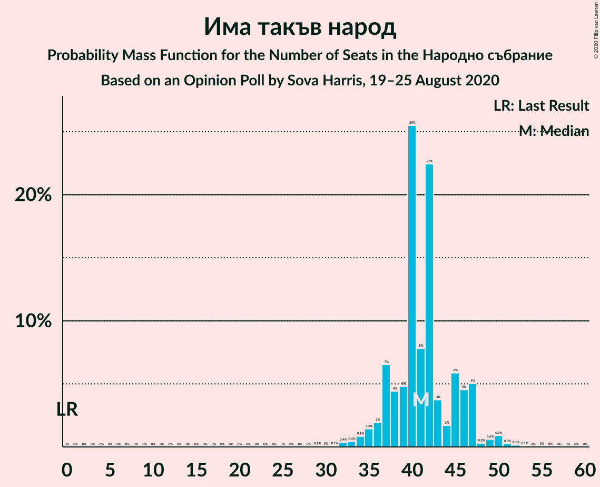
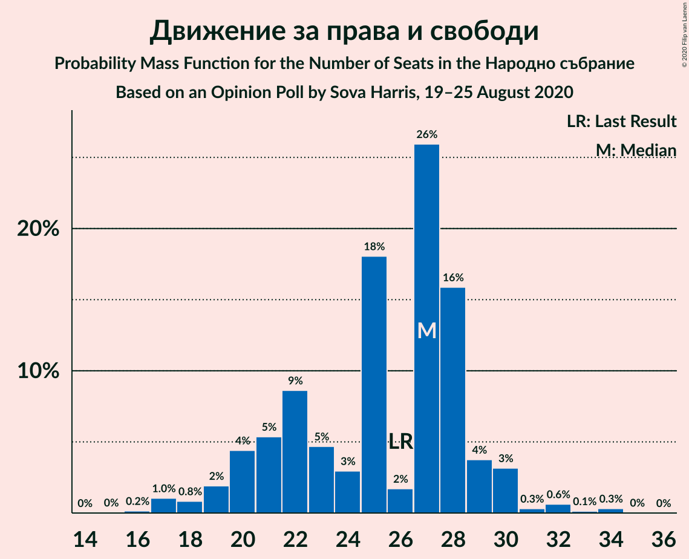
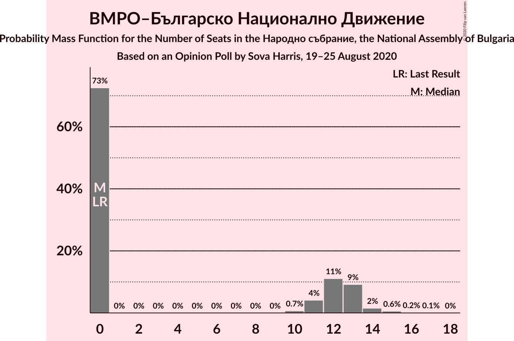
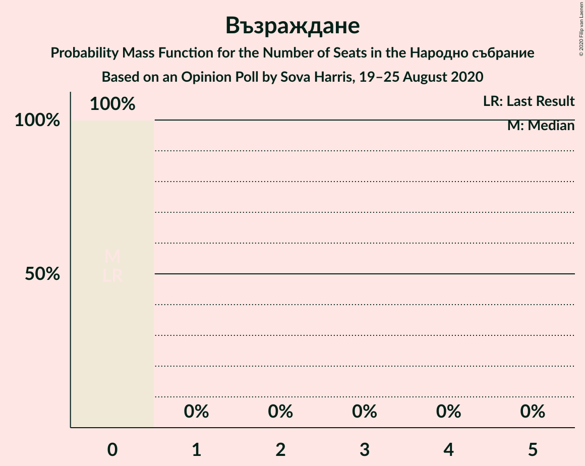
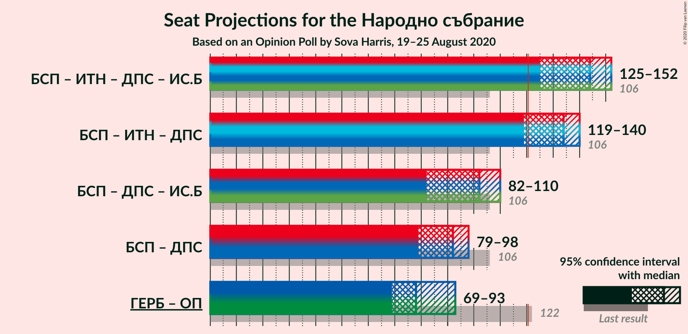

# Opinion Poll by Sova Harris, 19–25 August 2020

<a href="#voting-intentions">Voting Intentions</a> | <a href="#seats">Seats</a> | <a href="#coalitions">Coalitions</a> | <a href="#technical-information">Technical Information</a>

## Voting Intentions

### Confidence Intervals

| Party | Last Result | Poll Result | 80% Confidence Interval | 90% Confidence Interval | 95% Confidence Interval | 99% Confidence Interval |
|:-----:|:-----------:|:-----------:|:-----------------------:|:-----------------------:|:-----------------------:|:-----------------------:|
| Граждани за европейско развитие на България | 33.5% | 27.9% | 25.7–30.2% |25.1–30.9% |24.5–31.5% |23.5–32.6% |
| Българска социалистическа партия | 27.9% | 24.6% | 22.5–26.9% |21.9–27.5% |21.4–28.1% |20.5–29.2% |
| Има такъв народ | 0.0% | 15.7% | 14.0–17.7% |13.5–18.3% |13.1–18.8% |12.3–19.7% |
| Движение за права и свободи | 9.2% | 9.2% | 7.9–10.8% |7.5–11.3% |7.2–11.7% |6.6–12.5% |
| Демократична България | 0.0% | 7.0% | 5.9–8.5% |5.5–8.9% |5.3–9.3% |4.8–10.0% |
| Изправи се Бг | 0.0% | 4.5% | 3.6–5.8% |3.4–6.1% |3.2–6.4% |2.8–7.1% |
| ВМРО–Българско Национално Движение | 0.0% | 3.7% | 2.9–4.9% |2.7–5.2% |2.5–5.5% |2.2–6.1% |
| Воля | 4.3% | 3.0% | 2.3–4.0% |2.1–4.3% |1.9–4.6% |1.6–5.1% |
| Алтернатива за българско възраждане | 1.6% | 1.1% | 0.7–1.8% |0.6–2.0% |0.5–2.2% |0.4–2.7% |
| Атака | 0.0% | 0.9% | 0.6–1.6% |0.5–1.8% |0.4–2.0% |0.3–2.4% |
| Национален фронт за спасение на България | 0.0% | 0.6% | 0.4–1.2% |0.3–1.4% |0.2–1.6% |0.2–2.0% |
| Възраждане | 0.0% | 0.6% | 0.4–1.2% |0.3–1.4% |0.2–1.6% |0.2–2.0% |

*Note:* The poll result column reflects the actual value used in the calculations. Published results may vary slightly, and in addition be rounded to fewer digits.

## Seats

### Confidence Intervals

| Party | Last Result | Median | 80% Confidence Interval | 90% Confidence Interval | 95% Confidence Interval | 99% Confidence Interval |
|:-----:|:-----------:|:------:|:-----------------------:|:-----------------------:|:-----------------------:|:-----------------------:|
| <a href="#граждани-за-европейско-развитие-на-българия">Граждани за европейско развитие на България</a> | 95 | 76 | 66–80 |66–80 |66–81 |62–84 |
| <a href="#българска-социалистическа-партия">Българска социалистическа партия</a> | 80 | 68 | 61–73 |57–74 |57–74 |53–79 |
| <a href="#има-такъв-народ">Има такъв народ</a> | 0 | 43 | 36–51 |36–51 |33–51 |32–52 |
| <a href="#движение-за-права-и-свободи">Движение за права и свободи</a> | 26 | 25 | 21–30 |18–30 |18–30 |16–32 |
| <a href="#демократична-българия">Демократична България</a> | 0 | 18 | 15–23 |14–25 |14–26 |13–26 |
| <a href="#изправи-се-бг">Изправи се Бг</a> | 0 | 12 | 0–15 |0–15 |0–16 |0–18 |
| <a href="#вмро–българско-национално-движение">ВМРО–Българско Национално Движение</a> | 0 | 0 | 0–13 |0–13 |0–13 |0–15 |
| <a href="#воля">Воля</a> | 12 | 0 | 0 |0–11 |0–11 |0–12 |
| <a href="#алтернатива-за-българско-възраждане">Алтернатива за българско възраждане</a> | 0 | 0 | 0 |0 |0 |0 |
| <a href="#атака">Атака</a> | 0 | 0 | 0 |0 |0 |0 |
| <a href="#национален-фронт-за-спасение-на-българия">Национален фронт за спасение на България</a> | 0 | 0 | 0 |0 |0 |0 |
| <a href="#възраждане">Възраждане</a> | 0 | 0 | 0 |0 |0 |0 |

### Граждани за европейско развитие на България

*For a full overview of the results for this party, see the [Граждани за европейско развитие на България](party-гражданизаевропейскоразвитиенабългария.html) page.*

| Number of Seats | Probability | Accumulated | Special Marks |
|:---------------:|:-----------:|:-----------:|:-------------:|
| 59 | 0% | 100% |  |
| 60 | 0.2% | 99.9% |  |
| 61 | 0.2% | 99.7% |  |
| 62 | 0.2% | 99.6% |  |
| 63 | 0.6% | 99.4% |  |
| 64 | 0.2% | 98.8% |  |
| 65 | 0.7% | 98.6% |  |
| 66 | 9% | 98% |  |
| 67 | 0.6% | 89% |  |
| 68 | 0.7% | 88% |  |
| 69 | 2% | 87% |  |
| 70 | 7% | 86% |  |
| 71 | 9% | 79% |  |
| 72 | 2% | 69% |  |
| 73 | 2% | 68% |  |
| 74 | 4% | 66% |  |
| 75 | 9% | 62% |  |
| 76 | 3% | 53% | Median |
| 77 | 0.7% | 50% |  |
| 78 | 10% | 49% |  |
| 79 | 18% | 39% |  |
| 80 | 17% | 20% |  |
| 81 | 1.2% | 3% |  |
| 82 | 0.4% | 2% |  |
| 83 | 0.4% | 2% |  |
| 84 | 0.6% | 1.1% |  |
| 85 | 0.2% | 0.5% |  |
| 86 | 0.1% | 0.3% |  |
| 87 | 0.1% | 0.2% |  |
| 88 | 0% | 0.1% |  |
| 89 | 0% | 0.1% |  |
| 90 | 0% | 0% |  |
| 91 | 0% | 0% |  |
| 92 | 0% | 0% |  |
| 93 | 0% | 0% |  |
| 94 | 0% | 0% |  |
| 95 | 0% | 0% | Last Result |

### Българска социалистическа партия

*For a full overview of the results for this party, see the [Българска социалистическа партия](party-българскасоциалистическапартия.html) page.*

| Number of Seats | Probability | Accumulated | Special Marks |
|:---------------:|:-----------:|:-----------:|:-------------:|
| 50 | 0% | 100% |  |
| 51 | 0% | 99.9% |  |
| 52 | 0.3% | 99.9% |  |
| 53 | 0.1% | 99.6% |  |
| 54 | 0.1% | 99.4% |  |
| 55 | 0.2% | 99.4% |  |
| 56 | 2% | 99.1% |  |
| 57 | 3% | 98% |  |
| 58 | 0.3% | 94% |  |
| 59 | 1.5% | 94% |  |
| 60 | 2% | 93% |  |
| 61 | 4% | 90% |  |
| 62 | 3% | 86% |  |
| 63 | 18% | 84% |  |
| 64 | 4% | 65% |  |
| 65 | 1.3% | 61% |  |
| 66 | 2% | 60% |  |
| 67 | 6% | 58% |  |
| 68 | 23% | 52% | Median |
| 69 | 7% | 30% |  |
| 70 | 8% | 23% |  |
| 71 | 0.5% | 15% |  |
| 72 | 1.5% | 14% |  |
| 73 | 8% | 13% |  |
| 74 | 3% | 5% |  |
| 75 | 0.9% | 2% |  |
| 76 | 0.1% | 0.8% |  |
| 77 | 0% | 0.7% |  |
| 78 | 0% | 0.7% |  |
| 79 | 0.4% | 0.6% |  |
| 80 | 0.1% | 0.2% | Last Result |
| 81 | 0% | 0.1% |  |
| 82 | 0% | 0.1% |  |
| 83 | 0% | 0% |  |

### Има такъв народ

*For a full overview of the results for this party, see the [Има такъв народ](party-иматакъвнарод.html) page.*

| Number of Seats | Probability | Accumulated | Special Marks |
|:---------------:|:-----------:|:-----------:|:-------------:|
| 0 | 0% | 100% | Last Result |
| 1 | 0% | 100% |  |
| 2 | 0% | 100% |  |
| 3 | 0% | 100% |  |
| 4 | 0% | 100% |  |
| 5 | 0% | 100% |  |
| 6 | 0% | 100% |  |
| 7 | 0% | 100% |  |
| 8 | 0% | 100% |  |
| 9 | 0% | 100% |  |
| 10 | 0% | 100% |  |
| 11 | 0% | 100% |  |
| 12 | 0% | 100% |  |
| 13 | 0% | 100% |  |
| 14 | 0% | 100% |  |
| 15 | 0% | 100% |  |
| 16 | 0% | 100% |  |
| 17 | 0% | 100% |  |
| 18 | 0% | 100% |  |
| 19 | 0% | 100% |  |
| 20 | 0% | 100% |  |
| 21 | 0% | 100% |  |
| 22 | 0% | 100% |  |
| 23 | 0% | 100% |  |
| 24 | 0% | 100% |  |
| 25 | 0% | 100% |  |
| 26 | 0% | 100% |  |
| 27 | 0% | 100% |  |
| 28 | 0% | 100% |  |
| 29 | 0% | 100% |  |
| 30 | 0% | 100% |  |
| 31 | 0.1% | 100% |  |
| 32 | 0.8% | 99.9% |  |
| 33 | 2% | 99.0% |  |
| 34 | 0.9% | 97% |  |
| 35 | 0.8% | 96% |  |
| 36 | 9% | 95% |  |
| 37 | 12% | 87% |  |
| 38 | 2% | 74% |  |
| 39 | 1.5% | 72% |  |
| 40 | 13% | 71% |  |
| 41 | 6% | 58% |  |
| 42 | 2% | 52% |  |
| 43 | 8% | 50% | Median |
| 44 | 1.2% | 42% |  |
| 45 | 2% | 41% |  |
| 46 | 2% | 39% |  |
| 47 | 19% | 38% |  |
| 48 | 0.6% | 19% |  |
| 49 | 0.5% | 18% |  |
| 50 | 0.2% | 18% |  |
| 51 | 16% | 17% |  |
| 52 | 0.9% | 1.2% |  |
| 53 | 0.1% | 0.3% |  |
| 54 | 0% | 0.1% |  |
| 55 | 0.1% | 0.1% |  |
| 56 | 0% | 0% |  |

### Движение за права и свободи

*For a full overview of the results for this party, see the [Движение за права и свободи](party-движениезаправаисвободи.html) page.*

| Number of Seats | Probability | Accumulated | Special Marks |
|:---------------:|:-----------:|:-----------:|:-------------:|
| 16 | 1.0% | 100% |  |
| 17 | 0.1% | 99.0% |  |
| 18 | 4% | 98.9% |  |
| 19 | 1.0% | 95% |  |
| 20 | 2% | 94% |  |
| 21 | 2% | 91% |  |
| 22 | 17% | 89% |  |
| 23 | 6% | 72% |  |
| 24 | 3% | 66% |  |
| 25 | 27% | 63% | Median |
| 26 | 2% | 36% | Last Result |
| 27 | 13% | 34% |  |
| 28 | 5% | 21% |  |
| 29 | 2% | 16% |  |
| 30 | 12% | 14% |  |
| 31 | 0.7% | 2% |  |
| 32 | 0.5% | 0.8% |  |
| 33 | 0.1% | 0.3% |  |
| 34 | 0.2% | 0.2% |  |
| 35 | 0% | 0% |  |

### Демократична България

*For a full overview of the results for this party, see the [Демократична България](party-демократичнабългария.html) page.*

| Number of Seats | Probability | Accumulated | Special Marks |
|:---------------:|:-----------:|:-----------:|:-------------:|
| 0 | 0% | 100% | Last Result |
| 1 | 0% | 100% |  |
| 2 | 0% | 100% |  |
| 3 | 0% | 100% |  |
| 4 | 0% | 100% |  |
| 5 | 0% | 100% |  |
| 6 | 0% | 100% |  |
| 7 | 0% | 100% |  |
| 8 | 0% | 100% |  |
| 9 | 0% | 100% |  |
| 10 | 0% | 100% |  |
| 11 | 0% | 100% |  |
| 12 | 0.4% | 100% |  |
| 13 | 0.7% | 99.6% |  |
| 14 | 7% | 98.9% |  |
| 15 | 2% | 92% |  |
| 16 | 17% | 90% |  |
| 17 | 20% | 73% |  |
| 18 | 13% | 52% | Median |
| 19 | 11% | 39% |  |
| 20 | 6% | 29% |  |
| 21 | 7% | 23% |  |
| 22 | 4% | 16% |  |
| 23 | 4% | 13% |  |
| 24 | 1.0% | 8% |  |
| 25 | 5% | 7% |  |
| 26 | 2% | 3% |  |
| 27 | 0.3% | 0.3% |  |
| 28 | 0% | 0.1% |  |
| 29 | 0% | 0% |  |

### Изправи се Бг

*For a full overview of the results for this party, see the [Изправи се Бг](party-изправисебг.html) page.*

| Number of Seats | Probability | Accumulated | Special Marks |
|:---------------:|:-----------:|:-----------:|:-------------:|
| 0 | 37% | 100% | Last Result |
| 1 | 0% | 63% |  |
| 2 | 0% | 63% |  |
| 3 | 0% | 63% |  |
| 4 | 0% | 63% |  |
| 5 | 0% | 63% |  |
| 6 | 0% | 63% |  |
| 7 | 0% | 63% |  |
| 8 | 0% | 63% |  |
| 9 | 0% | 63% |  |
| 10 | 0.7% | 63% |  |
| 11 | 7% | 63% |  |
| 12 | 27% | 56% | Median |
| 13 | 14% | 28% |  |
| 14 | 3% | 15% |  |
| 15 | 7% | 11% |  |
| 16 | 2% | 4% |  |
| 17 | 2% | 2% |  |
| 18 | 0.3% | 0.6% |  |
| 19 | 0.2% | 0.3% |  |
| 20 | 0% | 0.1% |  |
| 21 | 0% | 0% |  |

### ВМРО–Българско Национално Движение

*For a full overview of the results for this party, see the [ВМРО–Българско Национално Движение](party-вмро–българсконационалнодвижение.html) page.*

| Number of Seats | Probability | Accumulated | Special Marks |
|:---------------:|:-----------:|:-----------:|:-------------:|
| 0 | 73% | 100% | Last Result, Median |
| 1 | 0% | 27% |  |
| 2 | 0% | 27% |  |
| 3 | 0% | 27% |  |
| 4 | 0% | 27% |  |
| 5 | 0% | 27% |  |
| 6 | 0% | 27% |  |
| 7 | 0% | 27% |  |
| 8 | 0% | 27% |  |
| 9 | 0% | 27% |  |
| 10 | 0.7% | 27% |  |
| 11 | 4% | 27% |  |
| 12 | 11% | 23% |  |
| 13 | 9% | 12% |  |
| 14 | 2% | 2% |  |
| 15 | 0.6% | 0.9% |  |
| 16 | 0.2% | 0.3% |  |
| 17 | 0.1% | 0.1% |  |
| 18 | 0% | 0% |  |

### Воля

*For a full overview of the results for this party, see the [Воля](party-воля.html) page.*

| Number of Seats | Probability | Accumulated | Special Marks |
|:---------------:|:-----------:|:-----------:|:-------------:|
| 0 | 93% | 100% | Median |
| 1 | 0% | 7% |  |
| 2 | 0% | 7% |  |
| 3 | 0% | 7% |  |
| 4 | 0% | 7% |  |
| 5 | 0% | 7% |  |
| 6 | 0% | 7% |  |
| 7 | 0% | 7% |  |
| 8 | 0% | 7% |  |
| 9 | 0% | 7% |  |
| 10 | 1.3% | 7% |  |
| 11 | 5% | 6% |  |
| 12 | 0.3% | 0.8% | Last Result |
| 13 | 0.2% | 0.5% |  |
| 14 | 0.1% | 0.2% |  |
| 15 | 0.1% | 0.1% |  |
| 16 | 0% | 0.1% |  |
| 17 | 0% | 0% |  |

### Алтернатива за българско възраждане

*For a full overview of the results for this party, see the [Алтернатива за българско възраждане](party-алтернативазабългарсковъзраждане.html) page.*

| Number of Seats | Probability | Accumulated | Special Marks |
|:---------------:|:-----------:|:-----------:|:-------------:|
| 0 | 100% | 100% | Last Result, Median |

### Атака

*For a full overview of the results for this party, see the [Атака](party-атака.html) page.*

| Number of Seats | Probability | Accumulated | Special Marks |
|:---------------:|:-----------:|:-----------:|:-------------:|
| 0 | 100% | 100% | Last Result, Median |

### Национален фронт за спасение на България

*For a full overview of the results for this party, see the [Национален фронт за спасение на България](party-националенфронтзаспасениенабългария.html) page.*

| Number of Seats | Probability | Accumulated | Special Marks |
|:---------------:|:-----------:|:-----------:|:-------------:|
| 0 | 100% | 100% | Last Result, Median |

### Възраждане

*For a full overview of the results for this party, see the [Възраждане](party-възраждане.html) page.*

| Number of Seats | Probability | Accumulated | Special Marks |
|:---------------:|:-----------:|:-----------:|:-------------:|
| 0 | 100% | 100% | Last Result, Median |

## Coalitions

### Confidence Intervals

| Coalition | Last Result | Median | Majority? | 80% Confidence Interval | 90% Confidence Interval | 95% Confidence Interval | 99% Confidence Interval |
|:---------:|:-----------:|:------:|:---------:|:-----------------------:|:-----------------------:|:-----------------------:|:-----------------------:|
| Българска социалистическа партия – Движение за права и свободи | 106 | 93 | 0% | 84–101 | 81–103 | 75–103 | 75–104 |

### Българска социалистическа партия – Движение за права и свободи

| Number of Seats | Probability | Accumulated | Special Marks |
|:---------------:|:-----------:|:-----------:|:-------------:|
| 73 | 0% | 100% |  |
| 74 | 0.1% | 99.9% |  |
| 75 | 3% | 99.9% |  |
| 76 | 0.1% | 97% |  |
| 77 | 0.6% | 97% |  |
| 78 | 0.1% | 96% |  |
| 79 | 0.6% | 96% |  |
| 80 | 0.2% | 96% |  |
| 81 | 3% | 95% |  |
| 82 | 1.3% | 92% |  |
| 83 | 0.4% | 91% |  |
| 84 | 2% | 91% |  |
| 85 | 18% | 89% |  |
| 86 | 1.1% | 71% |  |
| 87 | 1.4% | 70% |  |
| 88 | 2% | 69% |  |
| 89 | 2% | 66% |  |
| 90 | 2% | 64% |  |
| 91 | 3% | 62% |  |
| 92 | 4% | 59% |  |
| 93 | 20% | 55% | Median |
| 94 | 9% | 35% |  |
| 95 | 7% | 27% |  |
| 96 | 1.0% | 20% |  |
| 97 | 5% | 19% |  |
| 98 | 0.8% | 14% |  |
| 99 | 0.1% | 13% |  |
| 100 | 0.6% | 13% |  |
| 101 | 4% | 12% |  |
| 102 | 0.3% | 9% |  |
| 103 | 8% | 8% |  |
| 104 | 0.3% | 0.6% |  |
| 105 | 0% | 0.3% |  |
| 106 | 0.1% | 0.2% | Last Result |
| 107 | 0.1% | 0.2% |  |
| 108 | 0% | 0.1% |  |
| 109 | 0% | 0% |  |

## Technical Information

### Opinion Poll

+ **Polling firm:** Sova Harris
+ **Commissioner(s):** —
+ **Fieldwork period:** 19–25 August 2020

### Calculations

+ **Sample size:** 642
+ **Simulations done:** 1,048,576
+ **Error estimate:** 1.46%

