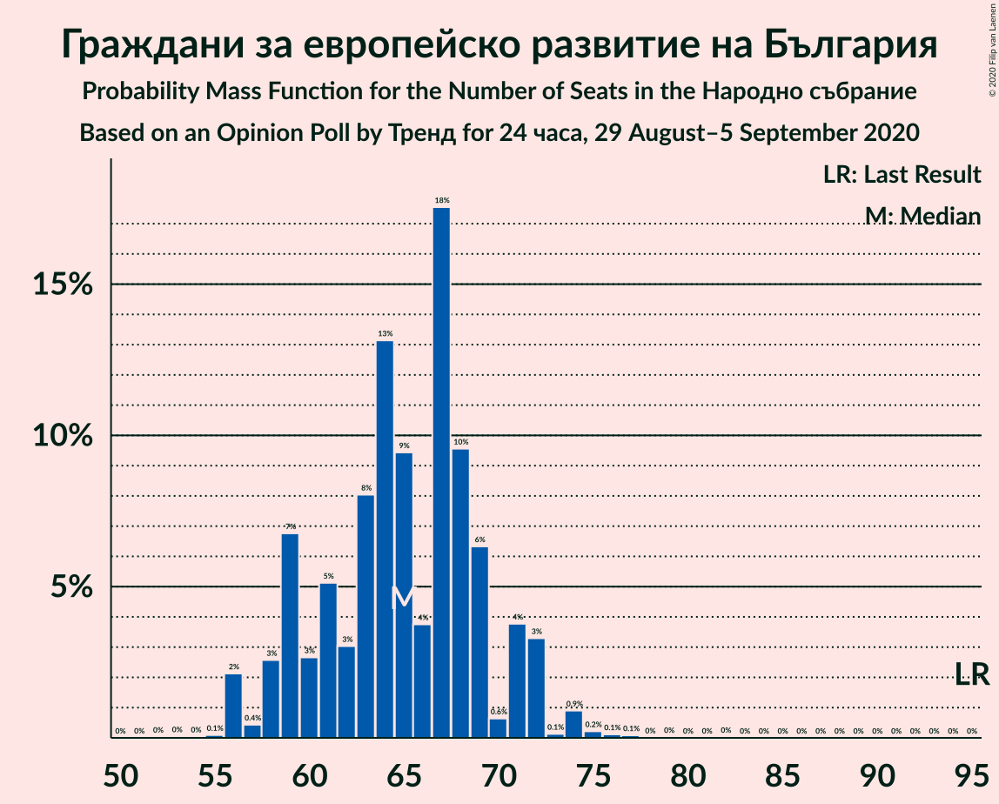
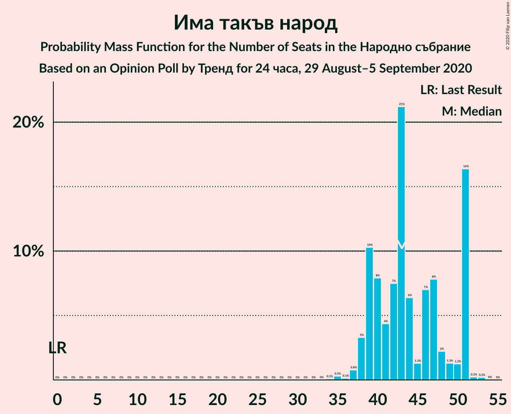
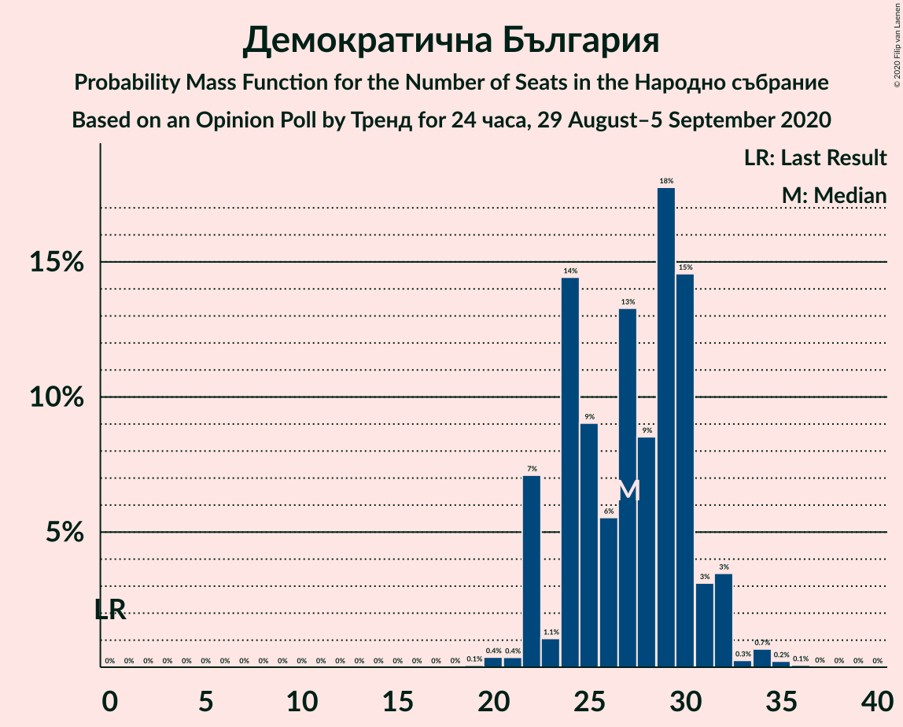
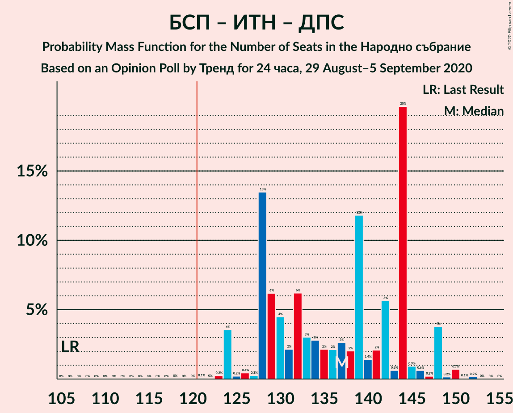
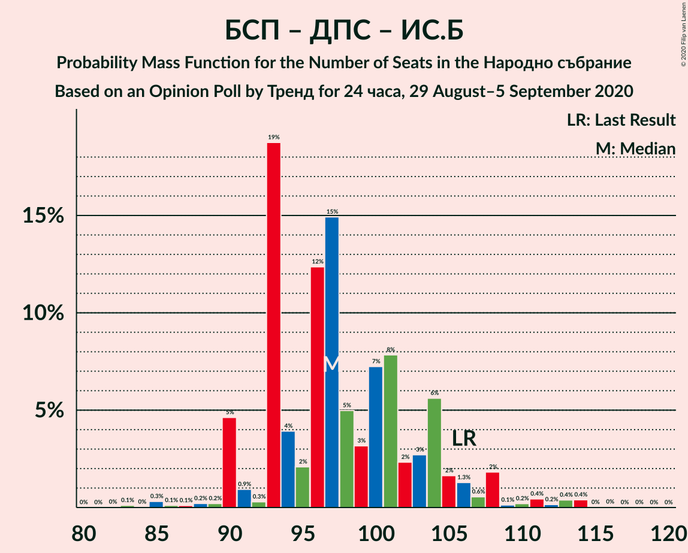

# Opinion Poll by Тренд for 24 часа, 29 August–5 September 2020

<a href="#voting-intentions">Voting Intentions</a> | <a href="#seats">Seats</a> | <a href="#coalitions">Coalitions</a> | <a href="#technical-information">Technical Information</a>

## Voting Intentions

### Confidence Intervals

| Party | Last Result | Poll Result | 80% Confidence Interval | 90% Confidence Interval | 95% Confidence Interval | 99% Confidence Interval |
|:-----:|:-----------:|:-----------:|:-----------------------:|:-----------------------:|:-----------------------:|:-----------------------:|
| Граждани за европейско развитие на България | 33.5% | 23.8% | 22.1–25.6% |21.7–26.1% |21.3–26.6% |20.5–27.4% |
| Българска социалистическа партия | 27.9% | 23.4% | 21.8–25.2% |21.3–25.7% |20.9–26.1% |20.1–27.0% |
| Има такъв народ | 0.0% | 15.9% | 14.5–17.4% |14.1–17.9% |13.7–18.3% |13.1–19.0% |
| Движение за права и свободи | 9.2% | 10.4% | 9.3–11.8% |8.9–12.1% |8.7–12.5% |8.2–13.1% |
| Демократична България | 0.0% | 9.9% | 8.8–11.2% |8.5–11.6% |8.2–11.9% |7.7–12.6% |
| Изправи се Бг | 0.0% | 4.0% | 3.3–4.9% |3.1–5.1% |2.9–5.4% |2.6–5.8% |
| Обединени Патриоти | 9.3% | 3.9% | 3.2–4.8% |3.0–5.0% |2.8–5.3% |2.5–5.7% |
| Воля | 4.3% | 1.2% | 0.9–1.8% |0.8–1.9% |0.7–2.1% |0.5–2.4% |
| Възраждане | 0.0% | 1.2% | 0.9–1.8% |0.8–1.9% |0.7–2.1% |0.5–2.4% |
| Атака | 0.0% | 1.1% | 0.8–1.6% |0.7–1.8% |0.6–2.0% |0.5–2.3% |
| Алтернатива за българско възраждане | 1.6% | 0.2% | 0.1–0.5% |0.1–0.6% |0.1–0.7% |0.0–0.9% |

*Note:* The poll result column reflects the actual value used in the calculations. Published results may vary slightly, and in addition be rounded to fewer digits.

## Seats

### Confidence Intervals

| Party | Last Result | Median | 80% Confidence Interval | 90% Confidence Interval | 95% Confidence Interval | 99% Confidence Interval |
|:-----:|:-----------:|:------:|:-----------------------:|:-----------------------:|:-----------------------:|:-----------------------:|
| <a href="#граждани-за-европейско-развитие-на-българия">Граждани за европейско развитие на България</a> | 95 | 63 | 60–70 |58–72 |57–72 |56–74 |
| <a href="#българска-социалистическа-партия">Българска социалистическа партия</a> | 80 | 61 | 59–69 |59–71 |58–73 |54–75 |
| <a href="#има-такъв-народ">Има такъв народ</a> | 0 | 40 | 40–50 |39–50 |37–50 |37–52 |
| <a href="#движение-за-права-и-свободи">Движение за права и свободи</a> | 26 | 27 | 24–32 |24–32 |23–33 |23–36 |
| <a href="#демократична-българия">Демократична България</a> | 0 | 25 | 25–29 |24–31 |24–34 |23–34 |
| <a href="#изправи-се-бг">Изправи се Бг</a> | 0 | 13 | 0–13 |0–13 |0–13 |0–15 |
| <a href="#обединени-патриоти">Обединени Патриоти</a> | 27 | 11 | 0–12 |0–13 |0–14 |0–15 |
| <a href="#воля">Воля</a> | 12 | 0 | 0 |0 |0 |0 |
| <a href="#възраждане">Възраждане</a> | 0 | 0 | 0 |0 |0 |0 |
| <a href="#атака">Атака</a> | 0 | 0 | 0 |0 |0 |0 |
| <a href="#алтернатива-за-българско-възраждане">Алтернатива за българско възраждане</a> | 0 | 0 | 0 |0 |0 |0 |

### Граждани за европейско развитие на България

*For a full overview of the results for this party, see the [Граждани за европейско развитие на България](party-гражданизаевропейскоразвитиенабългария.html) page.*

| Number of Seats | Probability | Accumulated | Special Marks |
|:---------------:|:-----------:|:-----------:|:-------------:|
| 54 | 0% | 100% |  |
| 55 | 0.1% | 99.9% |  |
| 56 | 2% | 99.9% |  |
| 57 | 0.7% | 98% |  |
| 58 | 6% | 97% |  |
| 59 | 0.4% | 91% |  |
| 60 | 3% | 91% |  |
| 61 | 0.6% | 88% |  |
| 62 | 2% | 87% |  |
| 63 | 50% | 85% | Median |
| 64 | 5% | 35% |  |
| 65 | 1.0% | 30% |  |
| 66 | 7% | 29% |  |
| 67 | 0.3% | 22% |  |
| 68 | 0.8% | 22% |  |
| 69 | 9% | 21% |  |
| 70 | 3% | 13% |  |
| 71 | 1.2% | 10% |  |
| 72 | 7% | 9% |  |
| 73 | 0.3% | 1.2% |  |
| 74 | 0.6% | 0.9% |  |
| 75 | 0.2% | 0.3% |  |
| 76 | 0.1% | 0.1% |  |
| 77 | 0% | 0% |  |
| 78 | 0% | 0% |  |
| 79 | 0% | 0% |  |
| 80 | 0% | 0% |  |
| 81 | 0% | 0% |  |
| 82 | 0% | 0% |  |
| 83 | 0% | 0% |  |
| 84 | 0% | 0% |  |
| 85 | 0% | 0% |  |
| 86 | 0% | 0% |  |
| 87 | 0% | 0% |  |
| 88 | 0% | 0% |  |
| 89 | 0% | 0% |  |
| 90 | 0% | 0% |  |
| 91 | 0% | 0% |  |
| 92 | 0% | 0% |  |
| 93 | 0% | 0% |  |
| 94 | 0% | 0% |  |
| 95 | 0% | 0% | Last Result |

### Българска социалистическа партия

*For a full overview of the results for this party, see the [Българска социалистическа партия](party-българскасоциалистическапартия.html) page.*

| Number of Seats | Probability | Accumulated | Special Marks |
|:---------------:|:-----------:|:-----------:|:-------------:|
| 53 | 0.4% | 100% |  |
| 54 | 0.2% | 99.6% |  |
| 55 | 0% | 99.4% |  |
| 56 | 1.4% | 99.4% |  |
| 57 | 0% | 98% |  |
| 58 | 2% | 98% |  |
| 59 | 6% | 95% |  |
| 60 | 0.6% | 89% |  |
| 61 | 50% | 88% | Median |
| 62 | 8% | 38% |  |
| 63 | 1.3% | 31% |  |
| 64 | 0.9% | 30% |  |
| 65 | 0.1% | 29% |  |
| 66 | 11% | 28% |  |
| 67 | 5% | 17% |  |
| 68 | 0.2% | 12% |  |
| 69 | 5% | 12% |  |
| 70 | 0.8% | 7% |  |
| 71 | 3% | 6% |  |
| 72 | 0.9% | 3% |  |
| 73 | 2% | 3% |  |
| 74 | 0.2% | 0.8% |  |
| 75 | 0.3% | 0.6% |  |
| 76 | 0% | 0.3% |  |
| 77 | 0.1% | 0.3% |  |
| 78 | 0% | 0.2% |  |
| 79 | 0.1% | 0.1% |  |
| 80 | 0% | 0% | Last Result |

### Има такъв народ

*For a full overview of the results for this party, see the [Има такъв народ](party-иматакъвнарод.html) page.*

| Number of Seats | Probability | Accumulated | Special Marks |
|:---------------:|:-----------:|:-----------:|:-------------:|
| 0 | 0% | 100% | Last Result |
| 1 | 0% | 100% |  |
| 2 | 0% | 100% |  |
| 3 | 0% | 100% |  |
| 4 | 0% | 100% |  |
| 5 | 0% | 100% |  |
| 6 | 0% | 100% |  |
| 7 | 0% | 100% |  |
| 8 | 0% | 100% |  |
| 9 | 0% | 100% |  |
| 10 | 0% | 100% |  |
| 11 | 0% | 100% |  |
| 12 | 0% | 100% |  |
| 13 | 0% | 100% |  |
| 14 | 0% | 100% |  |
| 15 | 0% | 100% |  |
| 16 | 0% | 100% |  |
| 17 | 0% | 100% |  |
| 18 | 0% | 100% |  |
| 19 | 0% | 100% |  |
| 20 | 0% | 100% |  |
| 21 | 0% | 100% |  |
| 22 | 0% | 100% |  |
| 23 | 0% | 100% |  |
| 24 | 0% | 100% |  |
| 25 | 0% | 100% |  |
| 26 | 0% | 100% |  |
| 27 | 0% | 100% |  |
| 28 | 0% | 100% |  |
| 29 | 0% | 100% |  |
| 30 | 0% | 100% |  |
| 31 | 0% | 100% |  |
| 32 | 0% | 100% |  |
| 33 | 0% | 100% |  |
| 34 | 0.1% | 100% |  |
| 35 | 0.2% | 99.9% |  |
| 36 | 0.1% | 99.7% |  |
| 37 | 3% | 99.6% |  |
| 38 | 0.8% | 96% |  |
| 39 | 0.4% | 95% |  |
| 40 | 53% | 95% | Median |
| 41 | 0.6% | 42% |  |
| 42 | 15% | 41% |  |
| 43 | 2% | 26% |  |
| 44 | 6% | 24% |  |
| 45 | 2% | 17% |  |
| 46 | 0.9% | 15% |  |
| 47 | 0.1% | 14% |  |
| 48 | 3% | 14% |  |
| 49 | 0.4% | 11% |  |
| 50 | 9% | 11% |  |
| 51 | 2% | 2% |  |
| 52 | 0.1% | 0.6% |  |
| 53 | 0.4% | 0.5% |  |
| 54 | 0.1% | 0.1% |  |
| 55 | 0% | 0% |  |

### Движение за права и свободи

*For a full overview of the results for this party, see the [Движение за права и свободи](party-движениезаправаисвободи.html) page.*

| Number of Seats | Probability | Accumulated | Special Marks |
|:---------------:|:-----------:|:-----------:|:-------------:|
| 21 | 0% | 100% |  |
| 22 | 0.1% | 99.9% |  |
| 23 | 3% | 99.9% |  |
| 24 | 15% | 97% |  |
| 25 | 2% | 82% |  |
| 26 | 1.0% | 80% | Last Result |
| 27 | 54% | 79% | Median |
| 28 | 7% | 25% |  |
| 29 | 3% | 18% |  |
| 30 | 2% | 16% |  |
| 31 | 4% | 14% |  |
| 32 | 8% | 10% |  |
| 33 | 0.7% | 3% |  |
| 34 | 0.1% | 2% |  |
| 35 | 1.2% | 2% |  |
| 36 | 0.6% | 0.7% |  |
| 37 | 0% | 0.1% |  |
| 38 | 0% | 0% |  |

### Демократична България

*For a full overview of the results for this party, see the [Демократична България](party-демократичнабългария.html) page.*

| Number of Seats | Probability | Accumulated | Special Marks |
|:---------------:|:-----------:|:-----------:|:-------------:|
| 0 | 0% | 100% | Last Result |
| 1 | 0% | 100% |  |
| 2 | 0% | 100% |  |
| 3 | 0% | 100% |  |
| 4 | 0% | 100% |  |
| 5 | 0% | 100% |  |
| 6 | 0% | 100% |  |
| 7 | 0% | 100% |  |
| 8 | 0% | 100% |  |
| 9 | 0% | 100% |  |
| 10 | 0% | 100% |  |
| 11 | 0% | 100% |  |
| 12 | 0% | 100% |  |
| 13 | 0% | 100% |  |
| 14 | 0% | 100% |  |
| 15 | 0% | 100% |  |
| 16 | 0% | 100% |  |
| 17 | 0% | 100% |  |
| 18 | 0% | 100% |  |
| 19 | 0% | 100% |  |
| 20 | 0% | 100% |  |
| 21 | 0.3% | 100% |  |
| 22 | 0.1% | 99.7% |  |
| 23 | 2% | 99.6% |  |
| 24 | 5% | 98% |  |
| 25 | 56% | 92% | Median |
| 26 | 6% | 37% |  |
| 27 | 9% | 31% |  |
| 28 | 8% | 22% |  |
| 29 | 4% | 14% |  |
| 30 | 4% | 10% |  |
| 31 | 3% | 6% |  |
| 32 | 0.1% | 3% |  |
| 33 | 0.1% | 3% |  |
| 34 | 2% | 3% |  |
| 35 | 0% | 0.1% |  |
| 36 | 0% | 0.1% |  |
| 37 | 0% | 0% |  |

### Изправи се Бг

*For a full overview of the results for this party, see the [Изправи се Бг](party-изправисебг.html) page.*

| Number of Seats | Probability | Accumulated | Special Marks |
|:---------------:|:-----------:|:-----------:|:-------------:|
| 0 | 32% | 100% | Last Result |
| 1 | 0% | 68% |  |
| 2 | 0% | 68% |  |
| 3 | 0% | 68% |  |
| 4 | 0% | 68% |  |
| 5 | 0% | 68% |  |
| 6 | 0% | 68% |  |
| 7 | 0% | 68% |  |
| 8 | 0% | 68% |  |
| 9 | 0% | 68% |  |
| 10 | 0% | 68% |  |
| 11 | 4% | 68% |  |
| 12 | 8% | 64% |  |
| 13 | 55% | 56% | Median |
| 14 | 0.2% | 2% |  |
| 15 | 1.1% | 1.4% |  |
| 16 | 0% | 0.4% |  |
| 17 | 0.3% | 0.3% |  |
| 18 | 0% | 0% |  |

### Обединени Патриоти

*For a full overview of the results for this party, see the [Обединени Патриоти](party-обединенипатриоти.html) page.*

| Number of Seats | Probability | Accumulated | Special Marks |
|:---------------:|:-----------:|:-----------:|:-------------:|
| 0 | 25% | 100% |  |
| 1 | 0% | 75% |  |
| 2 | 0% | 75% |  |
| 3 | 0% | 75% |  |
| 4 | 0% | 75% |  |
| 5 | 0% | 75% |  |
| 6 | 0% | 75% |  |
| 7 | 0% | 75% |  |
| 8 | 0% | 75% |  |
| 9 | 0% | 75% |  |
| 10 | 0% | 75% |  |
| 11 | 53% | 75% | Median |
| 12 | 12% | 21% |  |
| 13 | 7% | 10% |  |
| 14 | 1.1% | 3% |  |
| 15 | 2% | 2% |  |
| 16 | 0% | 0.1% |  |
| 17 | 0% | 0% |  |
| 18 | 0% | 0% |  |
| 19 | 0% | 0% |  |
| 20 | 0% | 0% |  |
| 21 | 0% | 0% |  |
| 22 | 0% | 0% |  |
| 23 | 0% | 0% |  |
| 24 | 0% | 0% |  |
| 25 | 0% | 0% |  |
| 26 | 0% | 0% |  |
| 27 | 0% | 0% | Last Result |

### Воля

*For a full overview of the results for this party, see the [Воля](party-воля.html) page.*

| Number of Seats | Probability | Accumulated | Special Marks |
|:---------------:|:-----------:|:-----------:|:-------------:|
| 0 | 100% | 100% | Median |
| 1 | 0% | 0% |  |
| 2 | 0% | 0% |  |
| 3 | 0% | 0% |  |
| 4 | 0% | 0% |  |
| 5 | 0% | 0% |  |
| 6 | 0% | 0% |  |
| 7 | 0% | 0% |  |
| 8 | 0% | 0% |  |
| 9 | 0% | 0% |  |
| 10 | 0% | 0% |  |
| 11 | 0% | 0% |  |
| 12 | 0% | 0% | Last Result |

### Възраждане

*For a full overview of the results for this party, see the [Възраждане](party-възраждане.html) page.*

| Number of Seats | Probability | Accumulated | Special Marks |
|:---------------:|:-----------:|:-----------:|:-------------:|
| 0 | 100% | 100% | Last Result, Median |

### Атака

*For a full overview of the results for this party, see the [Атака](party-атака.html) page.*

| Number of Seats | Probability | Accumulated | Special Marks |
|:---------------:|:-----------:|:-----------:|:-------------:|
| 0 | 100% | 100% | Last Result, Median |

### Алтернатива за българско възраждане

*For a full overview of the results for this party, see the [Алтернатива за българско възраждане](party-алтернативазабългарсковъзраждане.html) page.*

| Number of Seats | Probability | Accumulated | Special Marks |
|:---------------:|:-----------:|:-----------:|:-------------:|
| 0 | 100% | 100% | Last Result, Median |

## Coalitions

### Confidence Intervals

| Coalition | Last Result | Median | Majority? | 80% Confidence Interval | 90% Confidence Interval | 95% Confidence Interval | 99% Confidence Interval |
|:---------:|:-----------:|:------:|:---------:|:-----------------------:|:-----------------------:|:-----------------------:|:-----------------------:|
| Българска социалистическа партия – Има такъв народ – Движение за права и свободи – Изправи се Бг | 106 | 141 | 100% | 135–146 | 132–149 | 132–149 | 132–153 |
| Българска социалистическа партия – Има такъв народ – Движение за права и свободи | 106 | 128 | 100% | 128–141 | 128–145 | 128–146 | 125–151 |
| Българска социалистическа партия – Движение за права и свободи – Изправи се Бг | 106 | 101 | 0% | 90–105 | 90–105 | 85–105 | 85–110 |
| Българска социалистическа партия – Движение за права и свободи | 106 | 88 | 0% | 88–97 | 86–99 | 85–102 | 82–108 |
| Граждани за европейско развитие на България – Обединени Патриоти | 122 | 74 | 0% | 66–77 | 65–81 | 60–81 | 60–82 |

### Българска социалистическа партия – Има такъв народ – Движение за права и свободи – Изправи се Бг

| Number of Seats | Probability | Accumulated | Special Marks |
|:---------------:|:-----------:|:-----------:|:-------------:|
| 106 | 0% | 100% | Last Result |
| 107 | 0% | 100% |  |
| 108 | 0% | 100% |  |
| 109 | 0% | 100% |  |
| 110 | 0% | 100% |  |
| 111 | 0% | 100% |  |
| 112 | 0% | 100% |  |
| 113 | 0% | 100% |  |
| 114 | 0% | 100% |  |
| 115 | 0% | 100% |  |
| 116 | 0% | 100% |  |
| 117 | 0% | 100% |  |
| 118 | 0% | 100% |  |
| 119 | 0% | 100% |  |
| 120 | 0% | 100% |  |
| 121 | 0% | 100% | Majority |
| 122 | 0% | 100% |  |
| 123 | 0% | 100% |  |
| 124 | 0% | 100% |  |
| 125 | 0% | 100% |  |
| 126 | 0% | 100% |  |
| 127 | 0% | 100% |  |
| 128 | 0.3% | 100% |  |
| 129 | 0% | 99.7% |  |
| 130 | 0.1% | 99.7% |  |
| 131 | 0% | 99.6% |  |
| 132 | 8% | 99.6% |  |
| 133 | 0.9% | 92% |  |
| 134 | 0.6% | 91% |  |
| 135 | 5% | 90% |  |
| 136 | 0.2% | 85% |  |
| 137 | 0.1% | 85% |  |
| 138 | 1.1% | 85% |  |
| 139 | 3% | 84% |  |
| 140 | 1.0% | 81% |  |
| 141 | 57% | 80% | Median |
| 142 | 3% | 23% |  |
| 143 | 0.6% | 20% |  |
| 144 | 4% | 19% |  |
| 145 | 3% | 15% |  |
| 146 | 4% | 12% |  |
| 147 | 0.6% | 8% |  |
| 148 | 0.1% | 7% |  |
| 149 | 5% | 7% |  |
| 150 | 0.1% | 2% |  |
| 151 | 0.7% | 2% |  |
| 152 | 0.3% | 2% |  |
| 153 | 1.0% | 1.2% |  |
| 154 | 0.1% | 0.2% |  |
| 155 | 0.1% | 0.1% |  |
| 156 | 0% | 0.1% |  |
| 157 | 0% | 0% |  |

### Българска социалистическа партия – Има такъв народ – Движение за права и свободи

| Number of Seats | Probability | Accumulated | Special Marks |
|:---------------:|:-----------:|:-----------:|:-------------:|
| 106 | 0% | 100% | Last Result |
| 107 | 0% | 100% |  |
| 108 | 0% | 100% |  |
| 109 | 0% | 100% |  |
| 110 | 0% | 100% |  |
| 111 | 0% | 100% |  |
| 112 | 0% | 100% |  |
| 113 | 0% | 100% |  |
| 114 | 0% | 100% |  |
| 115 | 0% | 100% |  |
| 116 | 0% | 100% |  |
| 117 | 0% | 100% |  |
| 118 | 0% | 100% |  |
| 119 | 0% | 100% |  |
| 120 | 0% | 100% |  |
| 121 | 0.3% | 100% | Majority |
| 122 | 0% | 99.6% |  |
| 123 | 0% | 99.6% |  |
| 124 | 0.1% | 99.6% |  |
| 125 | 0.1% | 99.5% |  |
| 126 | 0.1% | 99.4% |  |
| 127 | 0.2% | 99.4% |  |
| 128 | 50% | 99.2% | Median |
| 129 | 0.1% | 49% |  |
| 130 | 0.4% | 49% |  |
| 131 | 7% | 49% |  |
| 132 | 9% | 42% |  |
| 133 | 1.3% | 33% |  |
| 134 | 3% | 32% |  |
| 135 | 5% | 29% |  |
| 136 | 0.3% | 24% |  |
| 137 | 5% | 24% |  |
| 138 | 2% | 19% |  |
| 139 | 3% | 17% |  |
| 140 | 0.8% | 14% |  |
| 141 | 7% | 13% |  |
| 142 | 0.2% | 6% |  |
| 143 | 0.1% | 6% |  |
| 144 | 0.1% | 5% |  |
| 145 | 2% | 5% |  |
| 146 | 2% | 4% |  |
| 147 | 0.2% | 1.1% |  |
| 148 | 0% | 0.9% |  |
| 149 | 0% | 0.9% |  |
| 150 | 0.1% | 0.9% |  |
| 151 | 0.4% | 0.8% |  |
| 152 | 0.3% | 0.4% |  |
| 153 | 0% | 0.1% |  |
| 154 | 0% | 0.1% |  |
| 155 | 0.1% | 0.1% |  |
| 156 | 0% | 0% |  |

### Българска социалистическа партия – Движение за права и свободи – Изправи се Бг

| Number of Seats | Probability | Accumulated | Special Marks |
|:---------------:|:-----------:|:-----------:|:-------------:|
| 85 | 3% | 100% |  |
| 86 | 0.2% | 97% |  |
| 87 | 0% | 97% |  |
| 88 | 0.1% | 97% |  |
| 89 | 0.5% | 97% |  |
| 90 | 9% | 96% |  |
| 91 | 6% | 87% |  |
| 92 | 0.6% | 81% |  |
| 93 | 0.7% | 80% |  |
| 94 | 2% | 79% |  |
| 95 | 0.9% | 77% |  |
| 96 | 0% | 76% |  |
| 97 | 0.6% | 76% |  |
| 98 | 3% | 76% |  |
| 99 | 3% | 73% |  |
| 100 | 0.3% | 70% |  |
| 101 | 50% | 69% | Median |
| 102 | 7% | 20% |  |
| 103 | 0.1% | 12% |  |
| 104 | 2% | 12% |  |
| 105 | 9% | 10% |  |
| 106 | 0.3% | 2% | Last Result |
| 107 | 0.1% | 1.3% |  |
| 108 | 0.5% | 1.2% |  |
| 109 | 0% | 0.7% |  |
| 110 | 0.3% | 0.7% |  |
| 111 | 0.1% | 0.4% |  |
| 112 | 0.2% | 0.3% |  |
| 113 | 0.1% | 0.1% |  |
| 114 | 0% | 0% |  |

### Българска социалистическа партия – Движение за права и свободи

| Number of Seats | Probability | Accumulated | Special Marks |
|:---------------:|:-----------:|:-----------:|:-------------:|
| 79 | 0% | 100% |  |
| 80 | 0% | 99.9% |  |
| 81 | 0% | 99.9% |  |
| 82 | 1.0% | 99.9% |  |
| 83 | 0.4% | 98.9% |  |
| 84 | 0.1% | 98% |  |
| 85 | 3% | 98% |  |
| 86 | 0.4% | 95% |  |
| 87 | 1.2% | 95% |  |
| 88 | 50% | 94% | Median |
| 89 | 5% | 44% |  |
| 90 | 9% | 39% |  |
| 91 | 6% | 30% |  |
| 92 | 3% | 24% |  |
| 93 | 6% | 21% |  |
| 94 | 4% | 15% |  |
| 95 | 0.9% | 11% |  |
| 96 | 0% | 10% |  |
| 97 | 0.7% | 10% |  |
| 98 | 3% | 10% |  |
| 99 | 3% | 7% |  |
| 100 | 0% | 4% |  |
| 101 | 0% | 4% |  |
| 102 | 3% | 3% |  |
| 103 | 0.1% | 0.9% |  |
| 104 | 0% | 0.8% |  |
| 105 | 0.2% | 0.7% |  |
| 106 | 0% | 0.6% | Last Result |
| 107 | 0% | 0.6% |  |
| 108 | 0.3% | 0.6% |  |
| 109 | 0% | 0.2% |  |
| 110 | 0.1% | 0.2% |  |
| 111 | 0% | 0.1% |  |
| 112 | 0% | 0.1% |  |
| 113 | 0.1% | 0.1% |  |
| 114 | 0% | 0% |  |

### Граждани за европейско развитие на България – Обединени Патриоти

| Number of Seats | Probability | Accumulated | Special Marks |
|:---------------:|:-----------:|:-----------:|:-------------:|
| 55 | 0% | 100% |  |
| 56 | 0% | 99.9% |  |
| 57 | 0% | 99.9% |  |
| 58 | 0% | 99.9% |  |
| 59 | 0% | 99.9% |  |
| 60 | 3% | 99.9% |  |
| 61 | 0.3% | 97% |  |
| 62 | 0.1% | 97% |  |
| 63 | 0.6% | 97% |  |
| 64 | 1.3% | 96% |  |
| 65 | 0.3% | 95% |  |
| 66 | 7% | 95% |  |
| 67 | 0.3% | 88% |  |
| 68 | 2% | 88% |  |
| 69 | 0.6% | 86% |  |
| 70 | 3% | 85% |  |
| 71 | 8% | 82% |  |
| 72 | 8% | 74% |  |
| 73 | 0.6% | 67% |  |
| 74 | 50% | 66% | Median |
| 75 | 3% | 16% |  |
| 76 | 1.1% | 13% |  |
| 77 | 2% | 12% |  |
| 78 | 0.2% | 9% |  |
| 79 | 0.1% | 9% |  |
| 80 | 0.5% | 9% |  |
| 81 | 8% | 9% |  |
| 82 | 0.5% | 0.7% |  |
| 83 | 0.1% | 0.2% |  |
| 84 | 0% | 0.1% |  |
| 85 | 0% | 0.1% |  |
| 86 | 0% | 0.1% |  |
| 87 | 0% | 0% |  |
| 88 | 0% | 0% |  |
| 89 | 0% | 0% |  |
| 90 | 0% | 0% |  |
| 91 | 0% | 0% |  |
| 92 | 0% | 0% |  |
| 93 | 0% | 0% |  |
| 94 | 0% | 0% |  |
| 95 | 0% | 0% |  |
| 96 | 0% | 0% |  |
| 97 | 0% | 0% |  |
| 98 | 0% | 0% |  |
| 99 | 0% | 0% |  |
| 100 | 0% | 0% |  |
| 101 | 0% | 0% |  |
| 102 | 0% | 0% |  |
| 103 | 0% | 0% |  |
| 104 | 0% | 0% |  |
| 105 | 0% | 0% |  |
| 106 | 0% | 0% |  |
| 107 | 0% | 0% |  |
| 108 | 0% | 0% |  |
| 109 | 0% | 0% |  |
| 110 | 0% | 0% |  |
| 111 | 0% | 0% |  |
| 112 | 0% | 0% |  |
| 113 | 0% | 0% |  |
| 114 | 0% | 0% |  |
| 115 | 0% | 0% |  |
| 116 | 0% | 0% |  |
| 117 | 0% | 0% |  |
| 118 | 0% | 0% |  |
| 119 | 0% | 0% |  |
| 120 | 0% | 0% |  |
| 121 | 0% | 0% | Majority |
| 122 | 0% | 0% | Last Result |

## Technical Information

### Opinion Poll

+ **Polling firm:** Тренд
+ **Commissioner(s):** 24 часа
+ **Fieldwork period:** 29 August–5 September 2020

### Calculations

+ **Sample size:** 1008
+ **Simulations done:** 131,072
+ **Error estimate:** 1.91%

