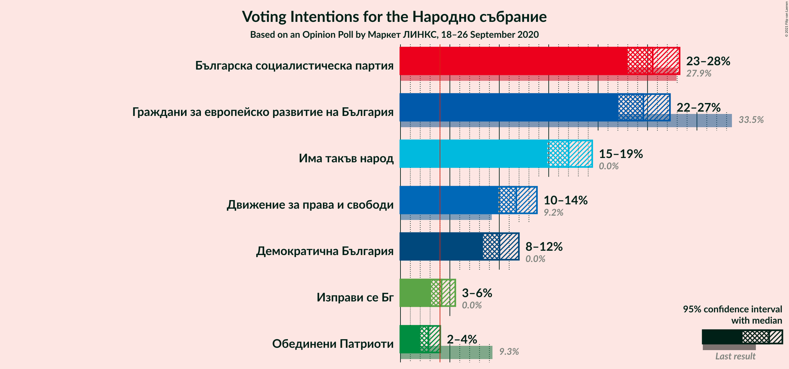
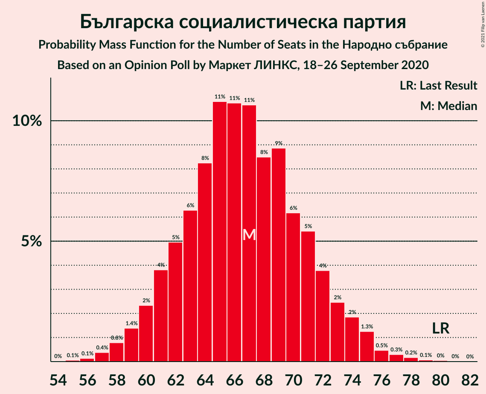
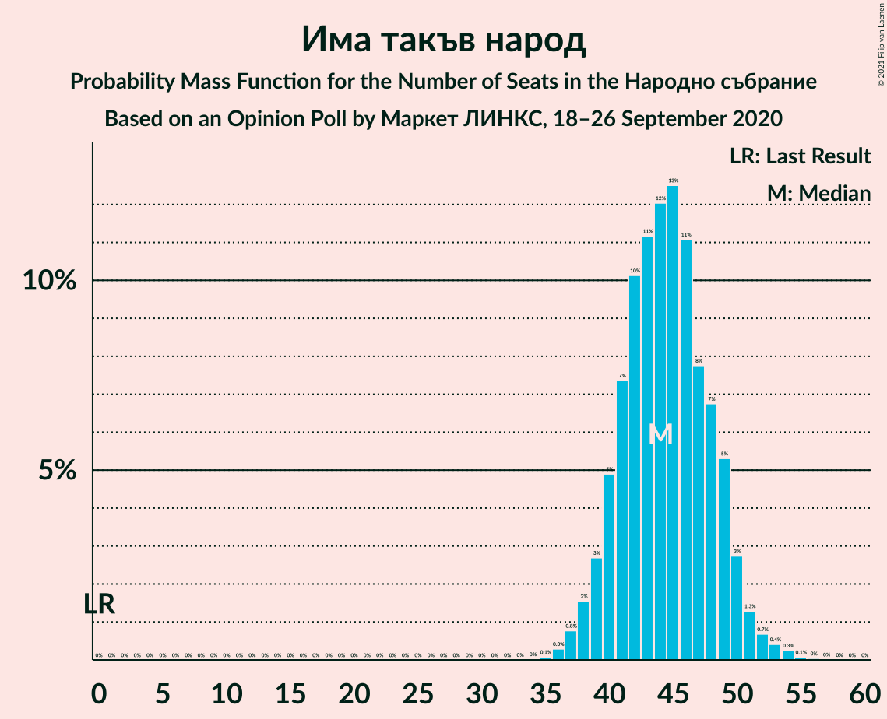
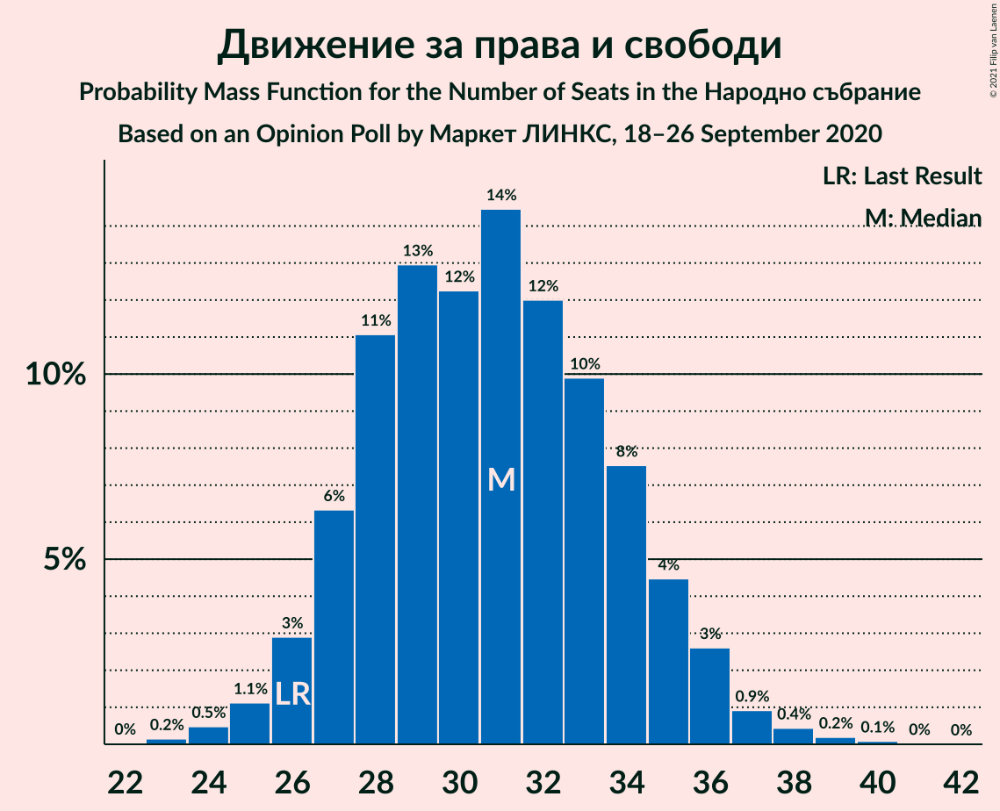
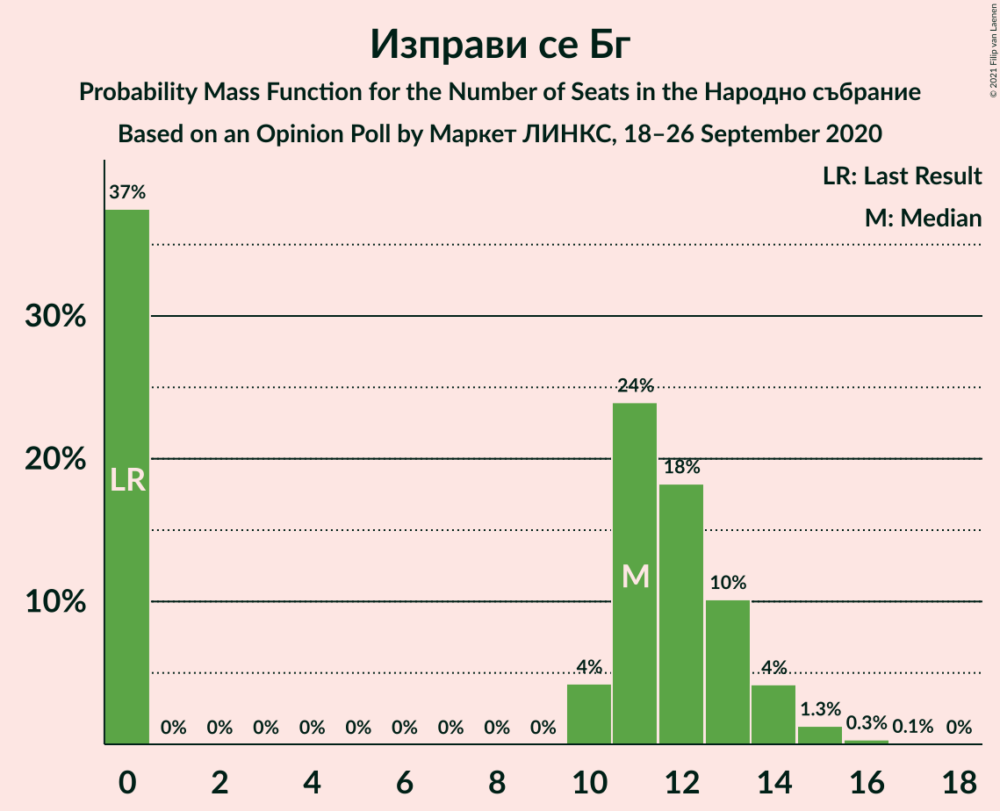
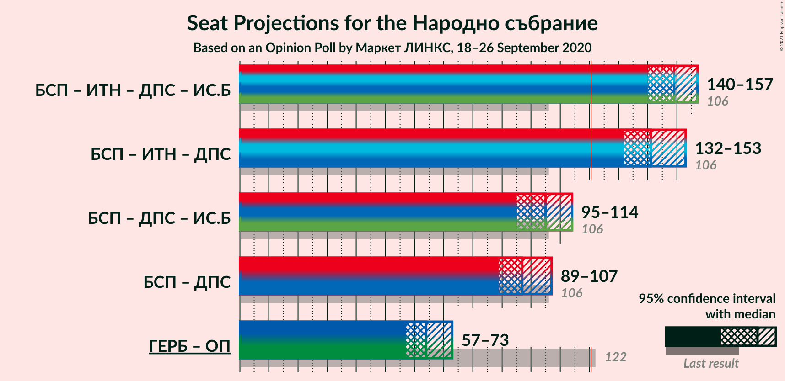
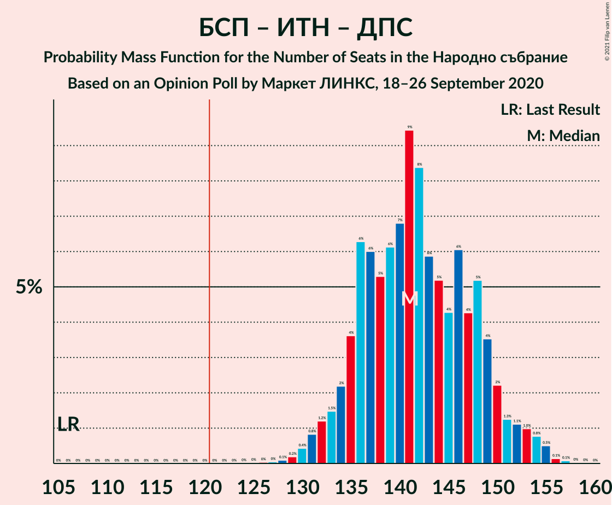
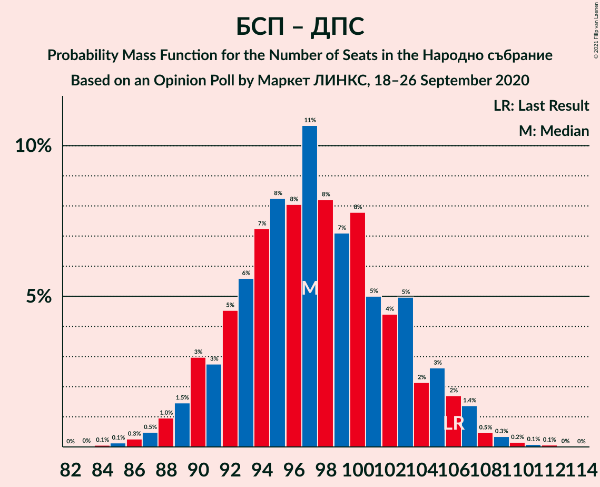
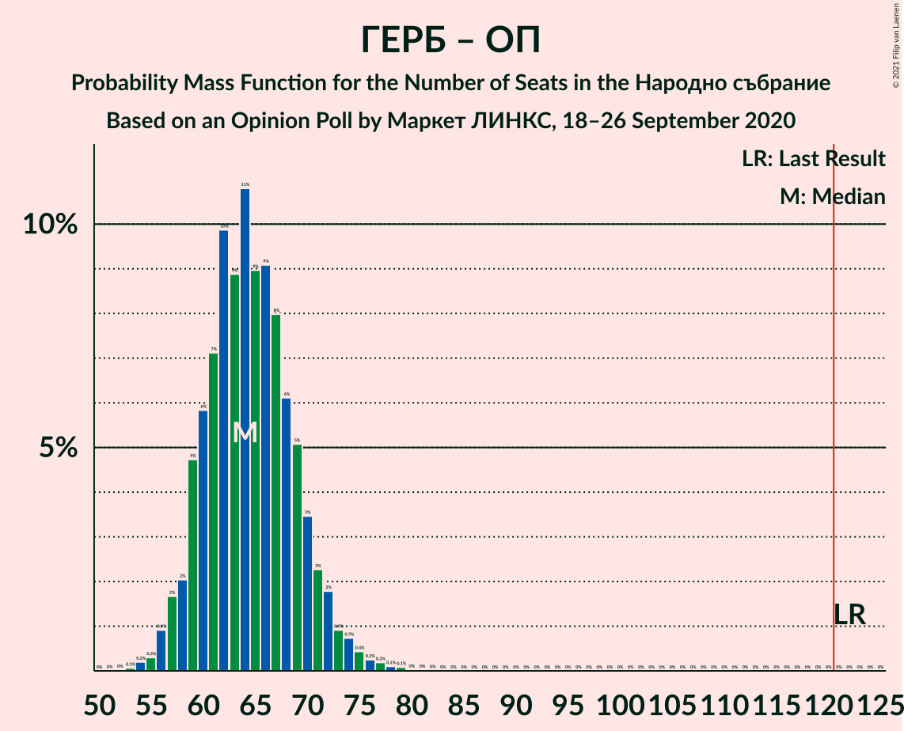

# Opinion Poll by Маркет ЛИНКС, 18–26 September 2020

<a href="#voting-intentions">Voting Intentions</a> | <a href="#seats">Seats</a> | <a href="#coalitions">Coalitions</a> | <a href="#technical-information">Technical Information</a>

## Voting Intentions

### Confidence Intervals

| Party | Last Result | Poll Result | 80% Confidence Interval | 90% Confidence Interval | 95% Confidence Interval | 99% Confidence Interval |
|:-----:|:-----------:|:-----------:|:-----------------------:|:-----------------------:|:-----------------------:|:-----------------------:|
| Граждани за европейско развитие на България | 33.5% | 27.4% | 25.0–29.9% |24.4–30.7% |23.8–31.3% |22.7–32.5% |
| Българска социалистическа партия | 27.9% | 27.2% | 24.9–29.8% |24.2–30.5% |23.6–31.1% |22.5–32.3% |
| Има такъв народ | 0.0% | 13.4% | 11.7–15.5% |11.2–16.0% |10.8–16.6% |10.0–17.6% |
| Демократична България | 0.0% | 11.8% | 10.2–13.7% |9.7–14.3% |9.3–14.8% |8.6–15.7% |
| Движение за права и свободи | 9.2% | 9.9% | 8.4–11.8% |8.0–12.3% |7.7–12.7% |7.0–13.7% |
| Изправи се Бг | 0.0% | 3.1% | 2.3–4.3% |2.1–4.6% |2.0–5.0% |1.6–5.6% |
| Обединени Патриоти | 9.3% | 2.8% | 2.0–3.9% |1.8–4.2% |1.7–4.5% |1.4–5.1% |

*Note:* The poll result column reflects the actual value used in the calculations. Published results may vary slightly, and in addition be rounded to fewer digits.

## Seats

### Confidence Intervals

| Party | Last Result | Median | 80% Confidence Interval | 90% Confidence Interval | 95% Confidence Interval | 99% Confidence Interval |
|:-----:|:-----------:|:------:|:-----------------------:|:-----------------------:|:-----------------------:|:-----------------------:|
| <a href="#граждани-за-европейско-развитие-на-българия">Граждани за европейско развитие на България</a> | 95 | 72 | 66–79 |64–80 |62–82 |59–86 |
| <a href="#българска-социалистическа-партия">Българска социалистическа партия</a> | 80 | 72 | 65–78 |63–80 |62–82 |59–85 |
| <a href="#има-такъв-народ">Има такъв народ</a> | 0 | 35 | 31–41 |29–42 |28–43 |26–46 |
| <a href="#демократична-българия">Демократична България</a> | 0 | 31 | 27–36 |25–38 |24–39 |23–41 |
| <a href="#движение-за-права-и-свободи">Движение за права и свободи</a> | 26 | 26 | 22–31 |21–32 |20–33 |18–36 |
| <a href="#изправи-се-бг">Изправи се Бг</a> | 0 | 0 | 0–11 |0–12 |0–13 |0–14 |
| <a href="#обединени-патриоти">Обединени Патриоти</a> | 27 | 0 | 0 |0–11 |0–12 |0–13 |

### Граждани за европейско развитие на България

*For a full overview of the results for this party, see the [Граждани за европейско развитие на България](party-гражданизаевропейскоразвитиенабългария.html) page.*

| Number of Seats | Probability | Accumulated | Special Marks |
|:---------------:|:-----------:|:-----------:|:-------------:|
| 56 | 0% | 100% |  |
| 57 | 0.1% | 99.9% |  |
| 58 | 0.1% | 99.8% |  |
| 59 | 0.3% | 99.7% |  |
| 60 | 0.4% | 99.4% |  |
| 61 | 0.6% | 98.9% |  |
| 62 | 1.0% | 98% |  |
| 63 | 1.4% | 97% |  |
| 64 | 2% | 96% |  |
| 65 | 3% | 94% |  |
| 66 | 4% | 91% |  |
| 67 | 5% | 87% |  |
| 68 | 6% | 81% |  |
| 69 | 7% | 75% |  |
| 70 | 7% | 68% |  |
| 71 | 7% | 62% |  |
| 72 | 6% | 54% | Median |
| 73 | 8% | 49% |  |
| 74 | 6% | 41% |  |
| 75 | 8% | 35% |  |
| 76 | 7% | 27% |  |
| 77 | 5% | 20% |  |
| 78 | 5% | 15% |  |
| 79 | 3% | 10% |  |
| 80 | 2% | 7% |  |
| 81 | 1.2% | 5% |  |
| 82 | 1.3% | 4% |  |
| 83 | 0.9% | 2% |  |
| 84 | 0.6% | 2% |  |
| 85 | 0.4% | 1.0% |  |
| 86 | 0.2% | 0.6% |  |
| 87 | 0.2% | 0.4% |  |
| 88 | 0.1% | 0.2% |  |
| 89 | 0% | 0.1% |  |
| 90 | 0% | 0.1% |  |
| 91 | 0% | 0% |  |
| 92 | 0% | 0% |  |
| 93 | 0% | 0% |  |
| 94 | 0% | 0% |  |
| 95 | 0% | 0% | Last Result |

### Българска социалистическа партия

*For a full overview of the results for this party, see the [Българска социалистическа партия](party-българскасоциалистическапартия.html) page.*

| Number of Seats | Probability | Accumulated | Special Marks |
|:---------------:|:-----------:|:-----------:|:-------------:|
| 55 | 0% | 100% |  |
| 56 | 0% | 99.9% |  |
| 57 | 0.1% | 99.9% |  |
| 58 | 0.2% | 99.8% |  |
| 59 | 0.3% | 99.6% |  |
| 60 | 0.6% | 99.2% |  |
| 61 | 0.7% | 98.6% |  |
| 62 | 1.2% | 98% |  |
| 63 | 2% | 97% |  |
| 64 | 3% | 95% |  |
| 65 | 3% | 92% |  |
| 66 | 4% | 88% |  |
| 67 | 4% | 84% |  |
| 68 | 6% | 80% |  |
| 69 | 7% | 73% |  |
| 70 | 9% | 66% |  |
| 71 | 8% | 58% |  |
| 72 | 7% | 50% | Median |
| 73 | 7% | 43% |  |
| 74 | 6% | 36% |  |
| 75 | 5% | 30% |  |
| 76 | 7% | 24% |  |
| 77 | 5% | 17% |  |
| 78 | 3% | 12% |  |
| 79 | 2% | 9% |  |
| 80 | 2% | 7% | Last Result |
| 81 | 2% | 5% |  |
| 82 | 1.0% | 3% |  |
| 83 | 0.8% | 2% |  |
| 84 | 0.5% | 1.1% |  |
| 85 | 0.3% | 0.7% |  |
| 86 | 0.2% | 0.4% |  |
| 87 | 0.1% | 0.3% |  |
| 88 | 0.1% | 0.1% |  |
| 89 | 0% | 0.1% |  |
| 90 | 0% | 0% |  |

### Има такъв народ

*For a full overview of the results for this party, see the [Има такъв народ](party-иматакъвнарод.html) page.*

| Number of Seats | Probability | Accumulated | Special Marks |
|:---------------:|:-----------:|:-----------:|:-------------:|
| 0 | 0% | 100% | Last Result |
| 1 | 0% | 100% |  |
| 2 | 0% | 100% |  |
| 3 | 0% | 100% |  |
| 4 | 0% | 100% |  |
| 5 | 0% | 100% |  |
| 6 | 0% | 100% |  |
| 7 | 0% | 100% |  |
| 8 | 0% | 100% |  |
| 9 | 0% | 100% |  |
| 10 | 0% | 100% |  |
| 11 | 0% | 100% |  |
| 12 | 0% | 100% |  |
| 13 | 0% | 100% |  |
| 14 | 0% | 100% |  |
| 15 | 0% | 100% |  |
| 16 | 0% | 100% |  |
| 17 | 0% | 100% |  |
| 18 | 0% | 100% |  |
| 19 | 0% | 100% |  |
| 20 | 0% | 100% |  |
| 21 | 0% | 100% |  |
| 22 | 0% | 100% |  |
| 23 | 0% | 100% |  |
| 24 | 0.1% | 100% |  |
| 25 | 0.2% | 99.9% |  |
| 26 | 0.4% | 99.8% |  |
| 27 | 0.7% | 99.4% |  |
| 28 | 1.5% | 98.7% |  |
| 29 | 2% | 97% |  |
| 30 | 4% | 95% |  |
| 31 | 5% | 90% |  |
| 32 | 8% | 86% |  |
| 33 | 8% | 78% |  |
| 34 | 10% | 70% |  |
| 35 | 10% | 59% | Median |
| 36 | 9% | 49% |  |
| 37 | 10% | 40% |  |
| 38 | 8% | 30% |  |
| 39 | 7% | 23% |  |
| 40 | 5% | 15% |  |
| 41 | 4% | 11% |  |
| 42 | 2% | 6% |  |
| 43 | 2% | 4% |  |
| 44 | 0.9% | 2% |  |
| 45 | 0.7% | 2% |  |
| 46 | 0.4% | 0.8% |  |
| 47 | 0.2% | 0.4% |  |
| 48 | 0.1% | 0.2% |  |
| 49 | 0.1% | 0.1% |  |
| 50 | 0% | 0.1% |  |
| 51 | 0% | 0% |  |

### Демократична България

*For a full overview of the results for this party, see the [Демократична България](party-демократичнабългария.html) page.*

| Number of Seats | Probability | Accumulated | Special Marks |
|:---------------:|:-----------:|:-----------:|:-------------:|
| 0 | 0% | 100% | Last Result |
| 1 | 0% | 100% |  |
| 2 | 0% | 100% |  |
| 3 | 0% | 100% |  |
| 4 | 0% | 100% |  |
| 5 | 0% | 100% |  |
| 6 | 0% | 100% |  |
| 7 | 0% | 100% |  |
| 8 | 0% | 100% |  |
| 9 | 0% | 100% |  |
| 10 | 0% | 100% |  |
| 11 | 0% | 100% |  |
| 12 | 0% | 100% |  |
| 13 | 0% | 100% |  |
| 14 | 0% | 100% |  |
| 15 | 0% | 100% |  |
| 16 | 0% | 100% |  |
| 17 | 0% | 100% |  |
| 18 | 0% | 100% |  |
| 19 | 0% | 100% |  |
| 20 | 0% | 100% |  |
| 21 | 0.1% | 99.9% |  |
| 22 | 0.3% | 99.8% |  |
| 23 | 0.7% | 99.5% |  |
| 24 | 2% | 98.8% |  |
| 25 | 2% | 97% |  |
| 26 | 4% | 95% |  |
| 27 | 5% | 91% |  |
| 28 | 8% | 86% |  |
| 29 | 9% | 78% |  |
| 30 | 14% | 69% |  |
| 31 | 8% | 56% | Median |
| 32 | 11% | 47% |  |
| 33 | 10% | 36% |  |
| 34 | 7% | 26% |  |
| 35 | 6% | 19% |  |
| 36 | 5% | 13% |  |
| 37 | 3% | 9% |  |
| 38 | 3% | 6% |  |
| 39 | 2% | 3% |  |
| 40 | 0.7% | 2% |  |
| 41 | 0.4% | 0.9% |  |
| 42 | 0.2% | 0.5% |  |
| 43 | 0.1% | 0.2% |  |
| 44 | 0.1% | 0.1% |  |
| 45 | 0% | 0% |  |

### Движение за права и свободи

*For a full overview of the results for this party, see the [Движение за права и свободи](party-движениезаправаисвободи.html) page.*

| Number of Seats | Probability | Accumulated | Special Marks |
|:---------------:|:-----------:|:-----------:|:-------------:|
| 17 | 0.1% | 100% |  |
| 18 | 0.4% | 99.8% |  |
| 19 | 0.8% | 99.4% |  |
| 20 | 2% | 98.6% |  |
| 21 | 3% | 97% |  |
| 22 | 6% | 94% |  |
| 23 | 9% | 88% |  |
| 24 | 8% | 79% |  |
| 25 | 9% | 71% |  |
| 26 | 13% | 62% | Last Result, Median |
| 27 | 15% | 50% |  |
| 28 | 9% | 35% |  |
| 29 | 7% | 26% |  |
| 30 | 6% | 19% |  |
| 31 | 6% | 13% |  |
| 32 | 3% | 7% |  |
| 33 | 2% | 4% |  |
| 34 | 1.0% | 2% |  |
| 35 | 0.8% | 1.5% |  |
| 36 | 0.4% | 0.7% |  |
| 37 | 0.1% | 0.3% |  |
| 38 | 0.1% | 0.1% |  |
| 39 | 0% | 0.1% |  |
| 40 | 0% | 0% |  |

### Изправи се Бг

*For a full overview of the results for this party, see the [Изправи се Бг](party-изправисебг.html) page.*

| Number of Seats | Probability | Accumulated | Special Marks |
|:---------------:|:-----------:|:-----------:|:-------------:|
| 0 | 83% | 100% | Last Result, Median |
| 1 | 0% | 17% |  |
| 2 | 0% | 17% |  |
| 3 | 0% | 17% |  |
| 4 | 0% | 17% |  |
| 5 | 0% | 17% |  |
| 6 | 0% | 17% |  |
| 7 | 0% | 17% |  |
| 8 | 0% | 17% |  |
| 9 | 0% | 17% |  |
| 10 | 3% | 17% |  |
| 11 | 7% | 14% |  |
| 12 | 4% | 7% |  |
| 13 | 2% | 3% |  |
| 14 | 0.7% | 1.1% |  |
| 15 | 0.3% | 0.4% |  |
| 16 | 0.1% | 0.1% |  |
| 17 | 0% | 0% |  |

### Обединени Патриоти

*For a full overview of the results for this party, see the [Обединени Патриоти](party-обединенипатриоти.html) page.*

| Number of Seats | Probability | Accumulated | Special Marks |
|:---------------:|:-----------:|:-----------:|:-------------:|
| 0 | 93% | 100% | Median |
| 1 | 0% | 7% |  |
| 2 | 0% | 7% |  |
| 3 | 0% | 7% |  |
| 4 | 0% | 7% |  |
| 5 | 0% | 7% |  |
| 6 | 0% | 7% |  |
| 7 | 0% | 7% |  |
| 8 | 0% | 7% |  |
| 9 | 0% | 7% |  |
| 10 | 1.1% | 7% |  |
| 11 | 4% | 6% |  |
| 12 | 2% | 3% |  |
| 13 | 0.6% | 0.9% |  |
| 14 | 0.2% | 0.3% |  |
| 15 | 0.1% | 0.1% |  |
| 16 | 0% | 0% |  |
| 17 | 0% | 0% |  |
| 18 | 0% | 0% |  |
| 19 | 0% | 0% |  |
| 20 | 0% | 0% |  |
| 21 | 0% | 0% |  |
| 22 | 0% | 0% |  |
| 23 | 0% | 0% |  |
| 24 | 0% | 0% |  |
| 25 | 0% | 0% |  |
| 26 | 0% | 0% |  |
| 27 | 0% | 0% | Last Result |

## Coalitions

### Confidence Intervals

| Coalition | Last Result | Median | Majority? | 80% Confidence Interval | 90% Confidence Interval | 95% Confidence Interval | 99% Confidence Interval |
|:---------:|:-----------:|:------:|:---------:|:-----------------------:|:-----------------------:|:-----------------------:|:-----------------------:|
| Българска социалистическа партия – Има такъв народ – Движение за права и свободи – Изправи се Бг | 106 | 135 | 99.5% | 128–143 | 126–145 | 124–147 | 121–151 |
| Българска социалистическа партия – Има такъв народ – Движение за права и свободи | 106 | 134 | 98% | 126–141 | 123–144 | 121–145 | 118–148 |
| Българска социалистическа партия – Движение за права и свободи – Изправи се Бг | 106 | 100 | 0% | 93–108 | 91–110 | 89–112 | 85–116 |
| Българска социалистическа партия – Движение за права и свободи | 106 | 98 | 0% | 91–106 | 89–107 | 87–109 | 84–113 |
| Граждани за европейско развитие на България – Обединени Патриоти | 122 | 73 | 0% | 66–80 | 64–82 | 63–84 | 60–89 |

### Българска социалистическа партия – Има такъв народ – Движение за права и свободи – Изправи се Бг

| Number of Seats | Probability | Accumulated | Special Marks |
|:---------------:|:-----------:|:-----------:|:-------------:|
| 106 | 0% | 100% | Last Result |
| 107 | 0% | 100% |  |
| 108 | 0% | 100% |  |
| 109 | 0% | 100% |  |
| 110 | 0% | 100% |  |
| 111 | 0% | 100% |  |
| 112 | 0% | 100% |  |
| 113 | 0% | 100% |  |
| 114 | 0% | 100% |  |
| 115 | 0% | 100% |  |
| 116 | 0% | 100% |  |
| 117 | 0.1% | 99.9% |  |
| 118 | 0% | 99.9% |  |
| 119 | 0.2% | 99.8% |  |
| 120 | 0.2% | 99.7% |  |
| 121 | 0.4% | 99.5% | Majority |
| 122 | 0.5% | 99.1% |  |
| 123 | 0.8% | 98.6% |  |
| 124 | 1.0% | 98% |  |
| 125 | 1.4% | 97% |  |
| 126 | 2% | 95% |  |
| 127 | 2% | 94% |  |
| 128 | 3% | 92% |  |
| 129 | 3% | 89% |  |
| 130 | 4% | 86% |  |
| 131 | 5% | 82% |  |
| 132 | 8% | 77% |  |
| 133 | 5% | 70% | Median |
| 134 | 7% | 64% |  |
| 135 | 8% | 58% |  |
| 136 | 6% | 50% |  |
| 137 | 7% | 43% |  |
| 138 | 4% | 36% |  |
| 139 | 6% | 32% |  |
| 140 | 4% | 25% |  |
| 141 | 5% | 21% |  |
| 142 | 4% | 16% |  |
| 143 | 3% | 12% |  |
| 144 | 3% | 9% |  |
| 145 | 2% | 6% |  |
| 146 | 2% | 4% |  |
| 147 | 1.0% | 3% |  |
| 148 | 0.6% | 2% |  |
| 149 | 0.4% | 1.4% |  |
| 150 | 0.4% | 0.9% |  |
| 151 | 0.3% | 0.6% |  |
| 152 | 0.1% | 0.3% |  |
| 153 | 0.1% | 0.2% |  |
| 154 | 0.1% | 0.1% |  |
| 155 | 0% | 0% |  |

### Българска социалистическа партия – Има такъв народ – Движение за права и свободи

| Number of Seats | Probability | Accumulated | Special Marks |
|:---------------:|:-----------:|:-----------:|:-------------:|
| 106 | 0% | 100% | Last Result |
| 107 | 0% | 100% |  |
| 108 | 0% | 100% |  |
| 109 | 0% | 100% |  |
| 110 | 0% | 100% |  |
| 111 | 0% | 100% |  |
| 112 | 0% | 100% |  |
| 113 | 0% | 100% |  |
| 114 | 0% | 99.9% |  |
| 115 | 0.1% | 99.9% |  |
| 116 | 0.1% | 99.8% |  |
| 117 | 0.2% | 99.7% |  |
| 118 | 0.3% | 99.6% |  |
| 119 | 0.5% | 99.3% |  |
| 120 | 0.6% | 98.8% |  |
| 121 | 0.8% | 98% | Majority |
| 122 | 1.3% | 97% |  |
| 123 | 2% | 96% |  |
| 124 | 2% | 94% |  |
| 125 | 2% | 93% |  |
| 126 | 2% | 90% |  |
| 127 | 3% | 88% |  |
| 128 | 4% | 86% |  |
| 129 | 5% | 82% |  |
| 130 | 5% | 77% |  |
| 131 | 5% | 72% |  |
| 132 | 8% | 67% |  |
| 133 | 6% | 58% | Median |
| 134 | 7% | 53% |  |
| 135 | 8% | 46% |  |
| 136 | 6% | 38% |  |
| 137 | 6% | 32% |  |
| 138 | 4% | 25% |  |
| 139 | 4% | 22% |  |
| 140 | 3% | 17% |  |
| 141 | 4% | 14% |  |
| 142 | 3% | 10% |  |
| 143 | 2% | 7% |  |
| 144 | 2% | 5% |  |
| 145 | 1.2% | 3% |  |
| 146 | 0.7% | 2% |  |
| 147 | 0.6% | 1.3% |  |
| 148 | 0.3% | 0.8% |  |
| 149 | 0.2% | 0.5% |  |
| 150 | 0.1% | 0.3% |  |
| 151 | 0.1% | 0.2% |  |
| 152 | 0% | 0.1% |  |
| 153 | 0% | 0% |  |

### Българска социалистическа партия – Движение за права и свободи – Изправи се Бг

| Number of Seats | Probability | Accumulated | Special Marks |
|:---------------:|:-----------:|:-----------:|:-------------:|
| 82 | 0% | 100% |  |
| 83 | 0.1% | 99.9% |  |
| 84 | 0.1% | 99.8% |  |
| 85 | 0.2% | 99.7% |  |
| 86 | 0.4% | 99.4% |  |
| 87 | 0.5% | 99.1% |  |
| 88 | 1.0% | 98.5% |  |
| 89 | 1.0% | 98% |  |
| 90 | 1.4% | 97% |  |
| 91 | 2% | 95% |  |
| 92 | 2% | 93% |  |
| 93 | 4% | 91% |  |
| 94 | 4% | 87% |  |
| 95 | 5% | 82% |  |
| 96 | 4% | 78% |  |
| 97 | 7% | 73% |  |
| 98 | 8% | 66% | Median |
| 99 | 7% | 59% |  |
| 100 | 6% | 52% |  |
| 101 | 6% | 46% |  |
| 102 | 6% | 40% |  |
| 103 | 7% | 34% |  |
| 104 | 5% | 27% |  |
| 105 | 4% | 22% |  |
| 106 | 4% | 18% | Last Result |
| 107 | 3% | 14% |  |
| 108 | 3% | 11% |  |
| 109 | 2% | 8% |  |
| 110 | 2% | 6% |  |
| 111 | 2% | 5% |  |
| 112 | 0.9% | 3% |  |
| 113 | 0.7% | 2% |  |
| 114 | 0.5% | 1.5% |  |
| 115 | 0.4% | 1.0% |  |
| 116 | 0.2% | 0.6% |  |
| 117 | 0.2% | 0.4% |  |
| 118 | 0.1% | 0.2% |  |
| 119 | 0.1% | 0.1% |  |
| 120 | 0% | 0.1% |  |
| 121 | 0% | 0% | Majority |

### Българска социалистическа партия – Движение за права и свободи

| Number of Seats | Probability | Accumulated | Special Marks |
|:---------------:|:-----------:|:-----------:|:-------------:|
| 80 | 0% | 100% |  |
| 81 | 0.1% | 99.9% |  |
| 82 | 0.1% | 99.9% |  |
| 83 | 0.2% | 99.7% |  |
| 84 | 0.4% | 99.5% |  |
| 85 | 0.5% | 99.2% |  |
| 86 | 0.8% | 98.7% |  |
| 87 | 1.0% | 98% |  |
| 88 | 2% | 97% |  |
| 89 | 2% | 95% |  |
| 90 | 2% | 93% |  |
| 91 | 3% | 91% |  |
| 92 | 3% | 88% |  |
| 93 | 5% | 85% |  |
| 94 | 5% | 80% |  |
| 95 | 6% | 74% |  |
| 96 | 6% | 69% |  |
| 97 | 7% | 62% |  |
| 98 | 8% | 55% | Median |
| 99 | 7% | 47% |  |
| 100 | 6% | 40% |  |
| 101 | 6% | 34% |  |
| 102 | 5% | 28% |  |
| 103 | 6% | 23% |  |
| 104 | 5% | 17% |  |
| 105 | 2% | 12% |  |
| 106 | 3% | 10% | Last Result |
| 107 | 2% | 7% |  |
| 108 | 1.5% | 5% |  |
| 109 | 0.9% | 3% |  |
| 110 | 0.9% | 2% |  |
| 111 | 0.6% | 1.5% |  |
| 112 | 0.3% | 0.9% |  |
| 113 | 0.2% | 0.5% |  |
| 114 | 0.2% | 0.3% |  |
| 115 | 0.1% | 0.2% |  |
| 116 | 0% | 0.1% |  |
| 117 | 0% | 0.1% |  |
| 118 | 0% | 0% |  |

### Граждани за европейско развитие на България – Обединени Патриоти

| Number of Seats | Probability | Accumulated | Special Marks |
|:---------------:|:-----------:|:-----------:|:-------------:|
| 56 | 0% | 100% |  |
| 57 | 0.1% | 99.9% |  |
| 58 | 0.1% | 99.9% |  |
| 59 | 0.2% | 99.8% |  |
| 60 | 0.3% | 99.5% |  |
| 61 | 0.5% | 99.3% |  |
| 62 | 0.8% | 98.8% |  |
| 63 | 1.1% | 98% |  |
| 64 | 2% | 97% |  |
| 65 | 3% | 95% |  |
| 66 | 4% | 92% |  |
| 67 | 5% | 89% |  |
| 68 | 5% | 84% |  |
| 69 | 6% | 79% |  |
| 70 | 6% | 72% |  |
| 71 | 7% | 66% |  |
| 72 | 5% | 60% | Median |
| 73 | 8% | 54% |  |
| 74 | 6% | 46% |  |
| 75 | 8% | 40% |  |
| 76 | 7% | 32% |  |
| 77 | 5% | 25% |  |
| 78 | 5% | 21% |  |
| 79 | 4% | 15% |  |
| 80 | 3% | 12% |  |
| 81 | 2% | 8% |  |
| 82 | 2% | 7% |  |
| 83 | 1.3% | 5% |  |
| 84 | 1.0% | 3% |  |
| 85 | 0.6% | 2% |  |
| 86 | 0.5% | 2% |  |
| 87 | 0.3% | 1.2% |  |
| 88 | 0.3% | 0.9% |  |
| 89 | 0.2% | 0.5% |  |
| 90 | 0.1% | 0.3% |  |
| 91 | 0.1% | 0.2% |  |
| 92 | 0% | 0.1% |  |
| 93 | 0% | 0.1% |  |
| 94 | 0% | 0% |  |
| 95 | 0% | 0% |  |
| 96 | 0% | 0% |  |
| 97 | 0% | 0% |  |
| 98 | 0% | 0% |  |
| 99 | 0% | 0% |  |
| 100 | 0% | 0% |  |
| 101 | 0% | 0% |  |
| 102 | 0% | 0% |  |
| 103 | 0% | 0% |  |
| 104 | 0% | 0% |  |
| 105 | 0% | 0% |  |
| 106 | 0% | 0% |  |
| 107 | 0% | 0% |  |
| 108 | 0% | 0% |  |
| 109 | 0% | 0% |  |
| 110 | 0% | 0% |  |
| 111 | 0% | 0% |  |
| 112 | 0% | 0% |  |
| 113 | 0% | 0% |  |
| 114 | 0% | 0% |  |
| 115 | 0% | 0% |  |
| 116 | 0% | 0% |  |
| 117 | 0% | 0% |  |
| 118 | 0% | 0% |  |
| 119 | 0% | 0% |  |
| 120 | 0% | 0% |  |
| 121 | 0% | 0% | Majority |
| 122 | 0% | 0% | Last Result |

## Technical Information

### Opinion Poll

+ **Polling firm:** Маркет ЛИНКС
+ **Commissioner(s):** —
+ **Fieldwork period:** 18–26 September 2020

### Calculations

+ **Sample size:** 544
+ **Simulations done:** 1,048,576
+ **Error estimate:** 2.23%

