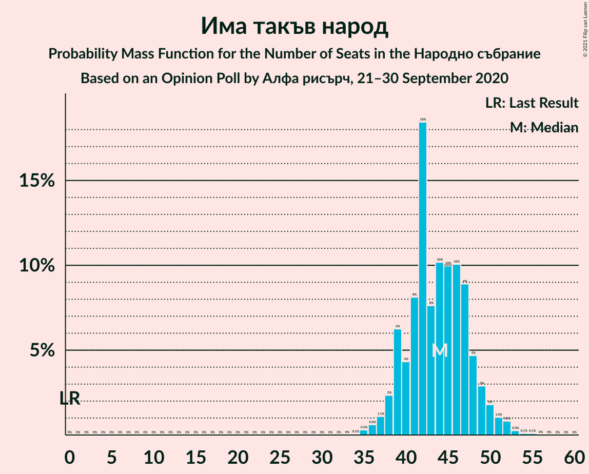

# Opinion Poll by Алфа рисърч, 21–30 September 2020

<a href="#voting-intentions">Voting Intentions</a> | <a href="#seats">Seats</a> | <a href="#coalitions">Coalitions</a> | <a href="#technical-information">Technical Information</a>

## Voting Intentions

### Confidence Intervals

| Party | Last Result | Poll Result | 80% Confidence Interval | 90% Confidence Interval | 95% Confidence Interval | 99% Confidence Interval |
|:-----:|:-----------:|:-----------:|:-----------------------:|:-----------------------:|:-----------------------:|:-----------------------:|
| Граждани за европейско развитие на България | 33.5% | 22.8% | 21.2–24.5% |20.7–25.0% |20.3–25.5% |19.6–26.3% |
| Българска социалистическа партия | 27.9% | 21.8% | 20.2–23.5% |19.8–24.0% |19.4–24.5% |18.7–25.3% |
| Има такъв народ | 0.0% | 16.6% | 15.2–18.2% |14.8–18.6% |14.4–19.0% |13.8–19.8% |
| Движение за права и свободи | 9.2% | 11.1% | 9.9–12.4% |9.6–12.8% |9.3–13.1% |8.7–13.8% |
| Демократична България | 0.0% | 10.5% | 9.3–11.8% |9.0–12.2% |8.7–12.5% |8.2–13.2% |
| Изправи се Бг | 0.0% | 5.1% | 4.4–6.1% |4.1–6.4% |3.9–6.7% |3.6–7.2% |
| Обединени Патриоти | 9.3% | 4.3% | 3.6–5.2% |3.4–5.5% |3.2–5.7% |2.9–6.2% |
| Воля | 4.3% | 0.3% | 0.2–0.7% |0.1–0.8% |0.1–0.9% |0.1–1.1% |

*Note:* The poll result column reflects the actual value used in the calculations. Published results may vary slightly, and in addition be rounded to fewer digits.

## Seats

### Confidence Intervals

| Party | Last Result | Median | 80% Confidence Interval | 90% Confidence Interval | 95% Confidence Interval | 99% Confidence Interval |
|:-----:|:-----------:|:------:|:-----------------------:|:-----------------------:|:-----------------------:|:-----------------------:|
| <a href="#граждани-за-европейско-развитие-на-българия">Граждани за европейско развитие на България</a> | 95 | 60 | 56–64 |55–66 |54–67 |51–70 |
| <a href="#българска-социалистическа-партия">Българска социалистическа партия</a> | 80 | 57 | 54–61 |52–61 |51–63 |51–64 |
| <a href="#има-такъв-народ">Има такъв народ</a> | 0 | 45 | 42–47 |40–48 |39–49 |38–51 |
| <a href="#движение-за-права-и-свободи">Движение за права и свободи</a> | 26 | 31 | 25–33 |25–34 |24–34 |23–35 |
| <a href="#демократична-българия">Демократична България</a> | 0 | 28 | 26–30 |26–31 |23–33 |22–34 |
| <a href="#изправи-се-бг">Изправи се Бг</a> | 0 | 14 | 11–15 |11–16 |11–16 |0–17 |
| <a href="#обединени-патриоти">Обединени Патриоти</a> | 27 | 11 | 0–13 |0–14 |0–15 |0–16 |
| <a href="#воля">Воля</a> | 12 | 0 | 0 |0 |0 |0 |

### Граждани за европейско развитие на България

*For a full overview of the results for this party, see the [Граждани за европейско развитие на България](party-гражданизаевропейскоразвитиенабългария.html) page.*

| Number of Seats | Probability | Accumulated | Special Marks |
|:---------------:|:-----------:|:-----------:|:-------------:|
| 49 | 0.1% | 100% |  |
| 50 | 0.1% | 99.9% |  |
| 51 | 0.4% | 99.8% |  |
| 52 | 0.4% | 99.4% |  |
| 53 | 1.1% | 99.1% |  |
| 54 | 2% | 98% |  |
| 55 | 2% | 96% |  |
| 56 | 7% | 94% |  |
| 57 | 7% | 87% |  |
| 58 | 3% | 81% |  |
| 59 | 16% | 77% |  |
| 60 | 26% | 62% | Median |
| 61 | 5% | 36% |  |
| 62 | 7% | 31% |  |
| 63 | 8% | 24% |  |
| 64 | 6% | 16% |  |
| 65 | 3% | 10% |  |
| 66 | 4% | 7% |  |
| 67 | 0.6% | 3% |  |
| 68 | 2% | 2% |  |
| 69 | 0.2% | 0.7% |  |
| 70 | 0.4% | 0.5% |  |
| 71 | 0.1% | 0.1% |  |
| 72 | 0.1% | 0.1% |  |
| 73 | 0% | 0% |  |
| 74 | 0% | 0% |  |
| 75 | 0% | 0% |  |
| 76 | 0% | 0% |  |
| 77 | 0% | 0% |  |
| 78 | 0% | 0% |  |
| 79 | 0% | 0% |  |
| 80 | 0% | 0% |  |
| 81 | 0% | 0% |  |
| 82 | 0% | 0% |  |
| 83 | 0% | 0% |  |
| 84 | 0% | 0% |  |
| 85 | 0% | 0% |  |
| 86 | 0% | 0% |  |
| 87 | 0% | 0% |  |
| 88 | 0% | 0% |  |
| 89 | 0% | 0% |  |
| 90 | 0% | 0% |  |
| 91 | 0% | 0% |  |
| 92 | 0% | 0% |  |
| 93 | 0% | 0% |  |
| 94 | 0% | 0% |  |
| 95 | 0% | 0% | Last Result |

### Българска социалистическа партия

*For a full overview of the results for this party, see the [Българска социалистическа партия](party-българскасоциалистическапартия.html) page.*

| Number of Seats | Probability | Accumulated | Special Marks |
|:---------------:|:-----------:|:-----------:|:-------------:|
| 48 | 0.1% | 100% |  |
| 49 | 0.2% | 99.9% |  |
| 50 | 0.1% | 99.6% |  |
| 51 | 4% | 99.6% |  |
| 52 | 3% | 95% |  |
| 53 | 0.4% | 92% |  |
| 54 | 21% | 92% |  |
| 55 | 5% | 70% |  |
| 56 | 5% | 65% |  |
| 57 | 14% | 60% | Median |
| 58 | 8% | 47% |  |
| 59 | 0.6% | 39% |  |
| 60 | 24% | 38% |  |
| 61 | 10% | 13% |  |
| 62 | 0.8% | 3% |  |
| 63 | 2% | 3% |  |
| 64 | 0.3% | 0.8% |  |
| 65 | 0.1% | 0.4% |  |
| 66 | 0.3% | 0.4% |  |
| 67 | 0% | 0.1% |  |
| 68 | 0% | 0.1% |  |
| 69 | 0% | 0% |  |
| 70 | 0% | 0% |  |
| 71 | 0% | 0% |  |
| 72 | 0% | 0% |  |
| 73 | 0% | 0% |  |
| 74 | 0% | 0% |  |
| 75 | 0% | 0% |  |
| 76 | 0% | 0% |  |
| 77 | 0% | 0% |  |
| 78 | 0% | 0% |  |
| 79 | 0% | 0% |  |
| 80 | 0% | 0% | Last Result |

### Има такъв народ

*For a full overview of the results for this party, see the [Има такъв народ](party-иматакъвнарод.html) page.*

| Number of Seats | Probability | Accumulated | Special Marks |
|:---------------:|:-----------:|:-----------:|:-------------:|
| 0 | 0% | 100% | Last Result |
| 1 | 0% | 100% |  |
| 2 | 0% | 100% |  |
| 3 | 0% | 100% |  |
| 4 | 0% | 100% |  |
| 5 | 0% | 100% |  |
| 6 | 0% | 100% |  |
| 7 | 0% | 100% |  |
| 8 | 0% | 100% |  |
| 9 | 0% | 100% |  |
| 10 | 0% | 100% |  |
| 11 | 0% | 100% |  |
| 12 | 0% | 100% |  |
| 13 | 0% | 100% |  |
| 14 | 0% | 100% |  |
| 15 | 0% | 100% |  |
| 16 | 0% | 100% |  |
| 17 | 0% | 100% |  |
| 18 | 0% | 100% |  |
| 19 | 0% | 100% |  |
| 20 | 0% | 100% |  |
| 21 | 0% | 100% |  |
| 22 | 0% | 100% |  |
| 23 | 0% | 100% |  |
| 24 | 0% | 100% |  |
| 25 | 0% | 100% |  |
| 26 | 0% | 100% |  |
| 27 | 0% | 100% |  |
| 28 | 0% | 100% |  |
| 29 | 0% | 100% |  |
| 30 | 0% | 100% |  |
| 31 | 0% | 100% |  |
| 32 | 0% | 100% |  |
| 33 | 0% | 100% |  |
| 34 | 0% | 100% |  |
| 35 | 0% | 100% |  |
| 36 | 0.1% | 100% |  |
| 37 | 0.2% | 99.9% |  |
| 38 | 0.5% | 99.6% |  |
| 39 | 2% | 99.2% |  |
| 40 | 3% | 97% |  |
| 41 | 4% | 94% |  |
| 42 | 8% | 90% |  |
| 43 | 10% | 83% |  |
| 44 | 21% | 73% |  |
| 45 | 20% | 52% | Median |
| 46 | 7% | 32% |  |
| 47 | 17% | 25% |  |
| 48 | 3% | 8% |  |
| 49 | 3% | 5% |  |
| 50 | 1.3% | 2% |  |
| 51 | 0.3% | 0.6% |  |
| 52 | 0.1% | 0.3% |  |
| 53 | 0.1% | 0.2% |  |
| 54 | 0% | 0% |  |

### Движение за права и свободи

*For a full overview of the results for this party, see the [Движение за права и свободи](party-движениезаправаисвободи.html) page.*

| Number of Seats | Probability | Accumulated | Special Marks |
|:---------------:|:-----------:|:-----------:|:-------------:|
| 23 | 0.8% | 100% |  |
| 24 | 2% | 99.1% |  |
| 25 | 12% | 97% |  |
| 26 | 15% | 86% | Last Result |
| 27 | 5% | 70% |  |
| 28 | 4% | 65% |  |
| 29 | 5% | 62% |  |
| 30 | 4% | 56% |  |
| 31 | 4% | 52% | Median |
| 32 | 31% | 48% |  |
| 33 | 9% | 17% |  |
| 34 | 7% | 8% |  |
| 35 | 0.8% | 1.1% |  |
| 36 | 0% | 0.3% |  |
| 37 | 0.1% | 0.3% |  |
| 38 | 0.1% | 0.1% |  |
| 39 | 0% | 0.1% |  |
| 40 | 0% | 0% |  |

### Демократична България

*For a full overview of the results for this party, see the [Демократична България](party-демократичнабългария.html) page.*

| Number of Seats | Probability | Accumulated | Special Marks |
|:---------------:|:-----------:|:-----------:|:-------------:|
| 0 | 0% | 100% | Last Result |
| 1 | 0% | 100% |  |
| 2 | 0% | 100% |  |
| 3 | 0% | 100% |  |
| 4 | 0% | 100% |  |
| 5 | 0% | 100% |  |
| 6 | 0% | 100% |  |
| 7 | 0% | 100% |  |
| 8 | 0% | 100% |  |
| 9 | 0% | 100% |  |
| 10 | 0% | 100% |  |
| 11 | 0% | 100% |  |
| 12 | 0% | 100% |  |
| 13 | 0% | 100% |  |
| 14 | 0% | 100% |  |
| 15 | 0% | 100% |  |
| 16 | 0% | 100% |  |
| 17 | 0% | 100% |  |
| 18 | 0% | 100% |  |
| 19 | 0% | 100% |  |
| 20 | 0% | 100% |  |
| 21 | 0.1% | 100% |  |
| 22 | 0.4% | 99.9% |  |
| 23 | 2% | 99.5% |  |
| 24 | 1.1% | 97% |  |
| 25 | 1.3% | 96% |  |
| 26 | 5% | 95% |  |
| 27 | 25% | 90% |  |
| 28 | 26% | 65% | Median |
| 29 | 29% | 39% |  |
| 30 | 5% | 11% |  |
| 31 | 2% | 6% |  |
| 32 | 0.8% | 4% |  |
| 33 | 2% | 3% |  |
| 34 | 0.8% | 1.1% |  |
| 35 | 0.2% | 0.2% |  |
| 36 | 0% | 0.1% |  |
| 37 | 0% | 0% |  |

### Изправи се Бг

*For a full overview of the results for this party, see the [Изправи се Бг](party-изправисебг.html) page.*

| Number of Seats | Probability | Accumulated | Special Marks |
|:---------------:|:-----------:|:-----------:|:-------------:|
| 0 | 1.3% | 100% | Last Result |
| 1 | 0% | 98.7% |  |
| 2 | 0% | 98.7% |  |
| 3 | 0% | 98.7% |  |
| 4 | 0% | 98.7% |  |
| 5 | 0% | 98.7% |  |
| 6 | 0% | 98.7% |  |
| 7 | 0% | 98.7% |  |
| 8 | 0% | 98.7% |  |
| 9 | 0% | 98.7% |  |
| 10 | 1.1% | 98.7% |  |
| 11 | 13% | 98% |  |
| 12 | 11% | 85% |  |
| 13 | 11% | 73% |  |
| 14 | 39% | 63% | Median |
| 15 | 13% | 23% |  |
| 16 | 9% | 10% |  |
| 17 | 0.8% | 1.3% |  |
| 18 | 0.2% | 0.5% |  |
| 19 | 0.2% | 0.2% |  |
| 20 | 0% | 0% |  |

### Обединени Патриоти

*For a full overview of the results for this party, see the [Обединени Патриоти](party-обединенипатриоти.html) page.*

| Number of Seats | Probability | Accumulated | Special Marks |
|:---------------:|:-----------:|:-----------:|:-------------:|
| 0 | 44% | 100% |  |
| 1 | 0% | 56% |  |
| 2 | 0% | 56% |  |
| 3 | 0% | 56% |  |
| 4 | 0% | 56% |  |
| 5 | 0% | 56% |  |
| 6 | 0% | 56% |  |
| 7 | 0% | 56% |  |
| 8 | 0% | 56% |  |
| 9 | 0% | 56% |  |
| 10 | 0.5% | 56% |  |
| 11 | 16% | 56% | Median |
| 12 | 20% | 40% |  |
| 13 | 13% | 20% |  |
| 14 | 4% | 7% |  |
| 15 | 2% | 3% |  |
| 16 | 0.9% | 1.0% |  |
| 17 | 0.1% | 0.1% |  |
| 18 | 0% | 0% |  |
| 19 | 0% | 0% |  |
| 20 | 0% | 0% |  |
| 21 | 0% | 0% |  |
| 22 | 0% | 0% |  |
| 23 | 0% | 0% |  |
| 24 | 0% | 0% |  |
| 25 | 0% | 0% |  |
| 26 | 0% | 0% |  |
| 27 | 0% | 0% | Last Result |

### Воля

*For a full overview of the results for this party, see the [Воля](party-воля.html) page.*

| Number of Seats | Probability | Accumulated | Special Marks |
|:---------------:|:-----------:|:-----------:|:-------------:|
| 0 | 100% | 100% | Median |
| 1 | 0% | 0% |  |
| 2 | 0% | 0% |  |
| 3 | 0% | 0% |  |
| 4 | 0% | 0% |  |
| 5 | 0% | 0% |  |
| 6 | 0% | 0% |  |
| 7 | 0% | 0% |  |
| 8 | 0% | 0% |  |
| 9 | 0% | 0% |  |
| 10 | 0% | 0% |  |
| 11 | 0% | 0% |  |
| 12 | 0% | 0% | Last Result |

## Coalitions

### Confidence Intervals

| Coalition | Last Result | Median | Majority? | 80% Confidence Interval | 90% Confidence Interval | 95% Confidence Interval | 99% Confidence Interval |
|:---------:|:-----------:|:------:|:---------:|:-----------------------:|:-----------------------:|:-----------------------:|:-----------------------:|
| Българска социалистическа партия – Има такъв народ – Движение за права и свободи – Изправи се Бг | 106 | 145 | 100% | 137–152 | 136–152 | 135–155 | 133–157 |
| Българска социалистическа партия – Има такъв народ – Движение за права и свободи | 106 | 131 | 97% | 123–137 | 123–139 | 120–141 | 119–144 |
| Българска социалистическа партия – Движение за права и свободи – Изправи се Бг | 106 | 100 | 0% | 94–106 | 94–107 | 92–107 | 92–109 |
| Българска социалистическа партия – Движение за права и свободи | 106 | 88 | 0% | 80–92 | 79–93 | 79–93 | 78–95 |
| Граждани за европейско развитие на България – Обединени Патриоти | 122 | 67 | 0% | 59–75 | 59–76 | 57–78 | 53–80 |

### Българска социалистическа партия – Има такъв народ – Движение за права и свободи – Изправи се Бг

| Number of Seats | Probability | Accumulated | Special Marks |
|:---------------:|:-----------:|:-----------:|:-------------:|
| 106 | 0% | 100% | Last Result |
| 107 | 0% | 100% |  |
| 108 | 0% | 100% |  |
| 109 | 0% | 100% |  |
| 110 | 0% | 100% |  |
| 111 | 0% | 100% |  |
| 112 | 0% | 100% |  |
| 113 | 0% | 100% |  |
| 114 | 0% | 100% |  |
| 115 | 0% | 100% |  |
| 116 | 0% | 100% |  |
| 117 | 0% | 100% |  |
| 118 | 0% | 100% |  |
| 119 | 0% | 100% |  |
| 120 | 0% | 100% |  |
| 121 | 0% | 100% | Majority |
| 122 | 0% | 100% |  |
| 123 | 0% | 100% |  |
| 124 | 0% | 100% |  |
| 125 | 0% | 100% |  |
| 126 | 0% | 100% |  |
| 127 | 0% | 100% |  |
| 128 | 0% | 100% |  |
| 129 | 0% | 100% |  |
| 130 | 0.1% | 99.9% |  |
| 131 | 0.1% | 99.8% |  |
| 132 | 0.1% | 99.7% |  |
| 133 | 0.3% | 99.7% |  |
| 134 | 1.0% | 99.4% |  |
| 135 | 2% | 98% |  |
| 136 | 2% | 96% |  |
| 137 | 8% | 95% |  |
| 138 | 4% | 87% |  |
| 139 | 5% | 83% |  |
| 140 | 8% | 78% |  |
| 141 | 6% | 71% |  |
| 142 | 8% | 65% |  |
| 143 | 2% | 56% |  |
| 144 | 3% | 55% |  |
| 145 | 9% | 52% |  |
| 146 | 0.9% | 43% |  |
| 147 | 3% | 42% | Median |
| 148 | 2% | 39% |  |
| 149 | 4% | 37% |  |
| 150 | 4% | 33% |  |
| 151 | 19% | 29% |  |
| 152 | 6% | 10% |  |
| 153 | 1.1% | 5% |  |
| 154 | 0% | 4% |  |
| 155 | 2% | 3% |  |
| 156 | 0% | 1.2% |  |
| 157 | 0.9% | 1.2% |  |
| 158 | 0.1% | 0.3% |  |
| 159 | 0.1% | 0.2% |  |
| 160 | 0% | 0% |  |

### Българска социалистическа партия – Има такъв народ – Движение за права и свободи

| Number of Seats | Probability | Accumulated | Special Marks |
|:---------------:|:-----------:|:-----------:|:-------------:|
| 106 | 0% | 100% | Last Result |
| 107 | 0% | 100% |  |
| 108 | 0% | 100% |  |
| 109 | 0% | 100% |  |
| 110 | 0% | 100% |  |
| 111 | 0% | 100% |  |
| 112 | 0% | 100% |  |
| 113 | 0% | 100% |  |
| 114 | 0% | 100% |  |
| 115 | 0% | 100% |  |
| 116 | 0.1% | 100% |  |
| 117 | 0.1% | 99.9% |  |
| 118 | 0.1% | 99.8% |  |
| 119 | 0.4% | 99.7% |  |
| 120 | 2% | 99.3% |  |
| 121 | 0.2% | 97% | Majority |
| 122 | 0.6% | 97% |  |
| 123 | 8% | 96% |  |
| 124 | 1.2% | 89% |  |
| 125 | 3% | 88% |  |
| 126 | 6% | 85% |  |
| 127 | 14% | 79% |  |
| 128 | 7% | 65% |  |
| 129 | 3% | 58% |  |
| 130 | 3% | 55% |  |
| 131 | 2% | 52% |  |
| 132 | 0.5% | 50% |  |
| 133 | 4% | 49% | Median |
| 134 | 8% | 46% |  |
| 135 | 0.6% | 38% |  |
| 136 | 0.5% | 37% |  |
| 137 | 30% | 37% |  |
| 138 | 2% | 7% |  |
| 139 | 0.6% | 5% |  |
| 140 | 0.5% | 4% |  |
| 141 | 3% | 4% |  |
| 142 | 0.2% | 1.4% |  |
| 143 | 0.2% | 1.2% |  |
| 144 | 0.8% | 1.0% |  |
| 145 | 0.1% | 0.3% |  |
| 146 | 0.1% | 0.2% |  |
| 147 | 0% | 0.1% |  |
| 148 | 0% | 0.1% |  |
| 149 | 0% | 0.1% |  |
| 150 | 0% | 0% |  |

### Българска социалистическа партия – Движение за права и свободи – Изправи се Бг

| Number of Seats | Probability | Accumulated | Special Marks |
|:---------------:|:-----------:|:-----------:|:-------------:|
| 89 | 0% | 100% |  |
| 90 | 0% | 99.9% |  |
| 91 | 0.2% | 99.9% |  |
| 92 | 2% | 99.7% |  |
| 93 | 1.3% | 97% |  |
| 94 | 9% | 96% |  |
| 95 | 11% | 87% |  |
| 96 | 6% | 76% |  |
| 97 | 9% | 70% |  |
| 98 | 4% | 60% |  |
| 99 | 3% | 57% |  |
| 100 | 4% | 53% |  |
| 101 | 7% | 50% |  |
| 102 | 3% | 43% | Median |
| 103 | 4% | 40% |  |
| 104 | 7% | 36% |  |
| 105 | 6% | 29% |  |
| 106 | 16% | 23% | Last Result |
| 107 | 6% | 7% |  |
| 108 | 0.2% | 0.7% |  |
| 109 | 0.5% | 0.6% |  |
| 110 | 0% | 0.1% |  |
| 111 | 0% | 0.1% |  |
| 112 | 0% | 0% |  |

### Българска социалистическа партия – Движение за права и свободи

| Number of Seats | Probability | Accumulated | Special Marks |
|:---------------:|:-----------:|:-----------:|:-------------:|
| 77 | 0.1% | 100% |  |
| 78 | 1.4% | 99.8% |  |
| 79 | 4% | 98% |  |
| 80 | 13% | 94% |  |
| 81 | 4% | 81% |  |
| 82 | 6% | 77% |  |
| 83 | 6% | 71% |  |
| 84 | 1.5% | 65% |  |
| 85 | 2% | 63% |  |
| 86 | 6% | 62% |  |
| 87 | 3% | 55% |  |
| 88 | 4% | 53% | Median |
| 89 | 3% | 49% |  |
| 90 | 16% | 46% |  |
| 91 | 2% | 30% |  |
| 92 | 20% | 28% |  |
| 93 | 6% | 8% |  |
| 94 | 0.9% | 2% |  |
| 95 | 0.2% | 0.7% |  |
| 96 | 0.2% | 0.4% |  |
| 97 | 0.1% | 0.3% |  |
| 98 | 0.1% | 0.2% |  |
| 99 | 0.1% | 0.1% |  |
| 100 | 0% | 0.1% |  |
| 101 | 0% | 0% |  |
| 102 | 0% | 0% |  |
| 103 | 0% | 0% |  |
| 104 | 0% | 0% |  |
| 105 | 0% | 0% |  |
| 106 | 0% | 0% | Last Result |

### Граждани за европейско развитие на България – Обединени Патриоти

| Number of Seats | Probability | Accumulated | Special Marks |
|:---------------:|:-----------:|:-----------:|:-------------:|
| 51 | 0.1% | 100% |  |
| 52 | 0% | 99.9% |  |
| 53 | 0.3% | 99.8% |  |
| 54 | 0% | 99.5% |  |
| 55 | 0.8% | 99.5% |  |
| 56 | 0.1% | 98.7% |  |
| 57 | 2% | 98.6% |  |
| 58 | 0.4% | 96% |  |
| 59 | 6% | 96% |  |
| 60 | 19% | 90% |  |
| 61 | 1.1% | 71% |  |
| 62 | 0.8% | 70% |  |
| 63 | 4% | 69% |  |
| 64 | 4% | 65% |  |
| 65 | 2% | 61% |  |
| 66 | 4% | 59% |  |
| 67 | 7% | 56% |  |
| 68 | 3% | 49% |  |
| 69 | 4% | 46% |  |
| 70 | 3% | 42% |  |
| 71 | 9% | 40% | Median |
| 72 | 9% | 31% |  |
| 73 | 2% | 22% |  |
| 74 | 7% | 20% |  |
| 75 | 6% | 13% |  |
| 76 | 3% | 7% |  |
| 77 | 0.8% | 4% |  |
| 78 | 0.4% | 3% |  |
| 79 | 1.2% | 2% |  |
| 80 | 0.8% | 1.2% |  |
| 81 | 0.2% | 0.4% |  |
| 82 | 0.2% | 0.2% |  |
| 83 | 0% | 0.1% |  |
| 84 | 0% | 0% |  |
| 85 | 0% | 0% |  |
| 86 | 0% | 0% |  |
| 87 | 0% | 0% |  |
| 88 | 0% | 0% |  |
| 89 | 0% | 0% |  |
| 90 | 0% | 0% |  |
| 91 | 0% | 0% |  |
| 92 | 0% | 0% |  |
| 93 | 0% | 0% |  |
| 94 | 0% | 0% |  |
| 95 | 0% | 0% |  |
| 96 | 0% | 0% |  |
| 97 | 0% | 0% |  |
| 98 | 0% | 0% |  |
| 99 | 0% | 0% |  |
| 100 | 0% | 0% |  |
| 101 | 0% | 0% |  |
| 102 | 0% | 0% |  |
| 103 | 0% | 0% |  |
| 104 | 0% | 0% |  |
| 105 | 0% | 0% |  |
| 106 | 0% | 0% |  |
| 107 | 0% | 0% |  |
| 108 | 0% | 0% |  |
| 109 | 0% | 0% |  |
| 110 | 0% | 0% |  |
| 111 | 0% | 0% |  |
| 112 | 0% | 0% |  |
| 113 | 0% | 0% |  |
| 114 | 0% | 0% |  |
| 115 | 0% | 0% |  |
| 116 | 0% | 0% |  |
| 117 | 0% | 0% |  |
| 118 | 0% | 0% |  |
| 119 | 0% | 0% |  |
| 120 | 0% | 0% |  |
| 121 | 0% | 0% | Majority |
| 122 | 0% | 0% | Last Result |

## Technical Information

### Opinion Poll

+ **Polling firm:** Алфа рисърч
+ **Commissioner(s):** —
+ **Fieldwork period:** 21–30 September 2020

### Calculations

+ **Sample size:** 1031
+ **Simulations done:** 131,072
+ **Error estimate:** 1.84%

