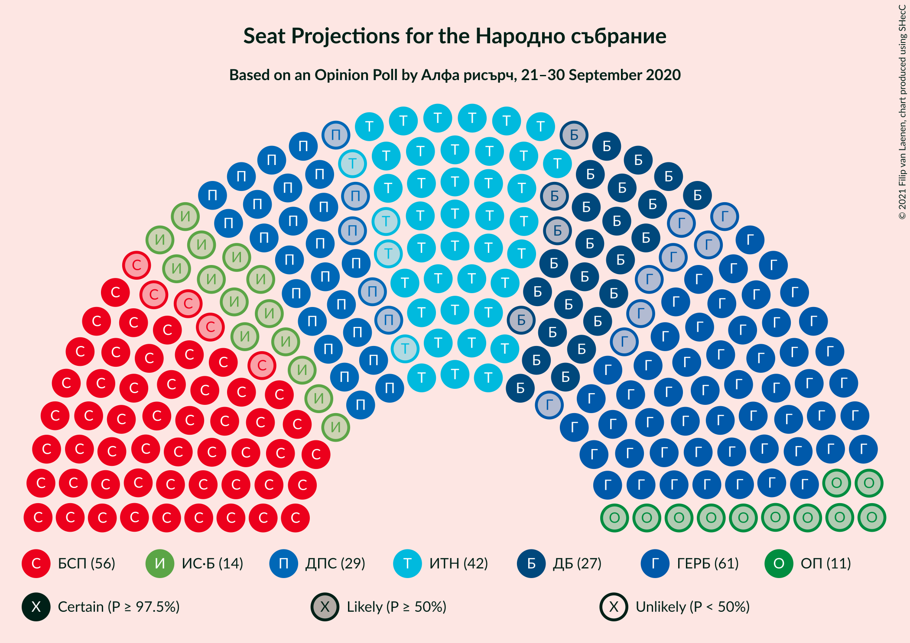
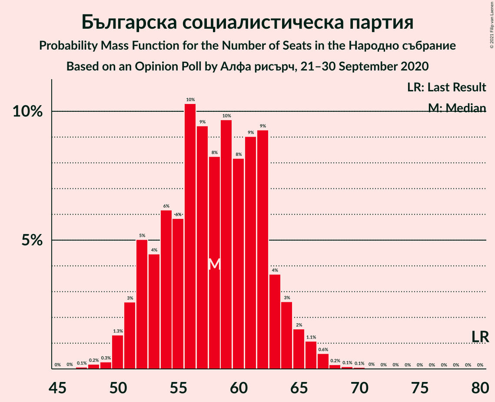
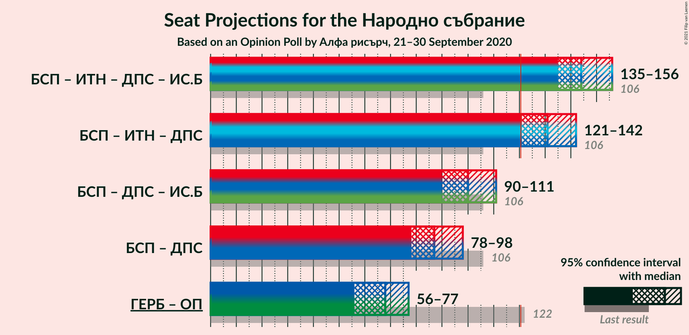
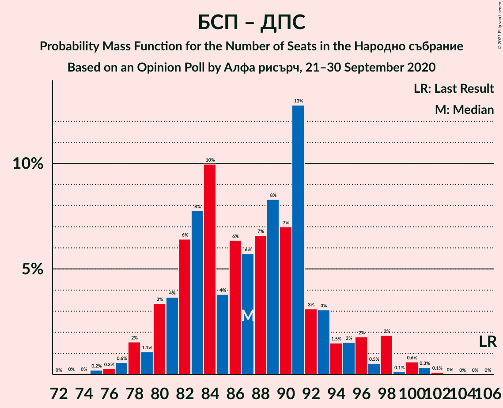
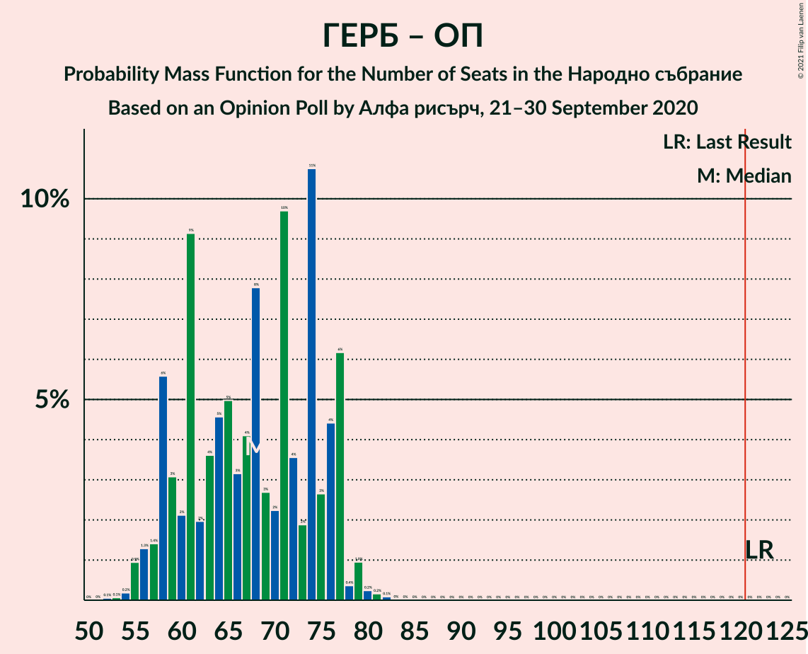

# Opinion Poll by Алфа рисърч, 21–30 September 2020

<a href="#voting-intentions">Voting Intentions</a> | <a href="#seats">Seats</a> | <a href="#coalitions">Coalitions</a> | <a href="#technical-information">Technical Information</a>

## Voting Intentions

### Confidence Intervals

| Party | Last Result | Poll Result | 80% Confidence Interval | 90% Confidence Interval | 95% Confidence Interval | 99% Confidence Interval |
|:-----:|:-----------:|:-----------:|:-----------------------:|:-----------------------:|:-----------------------:|:-----------------------:|
| Граждани за европейско развитие на България | 33.5% | 22.8% | 21.2–24.5% |20.7–25.0% |20.3–25.5% |19.6–26.3% |
| Българска социалистическа партия | 27.9% | 21.8% | 20.2–23.5% |19.8–24.0% |19.4–24.5% |18.7–25.3% |
| Има такъв народ | 0.0% | 16.6% | 15.2–18.2% |14.8–18.6% |14.4–19.0% |13.8–19.8% |
| Движение за права и свободи | 9.2% | 11.0% | 9.8–12.3% |9.5–12.7% |9.2–13.0% |8.7–13.7% |
| Демократична България | 0.0% | 10.5% | 9.3–11.8% |9.0–12.2% |8.7–12.5% |8.2–13.2% |
| Изправи се Бг | 0.0% | 5.1% | 4.4–6.1% |4.1–6.4% |3.9–6.7% |3.6–7.2% |
| Обединени Патриоти | 9.3% | 4.2% | 3.5–5.1% |3.3–5.3% |3.1–5.6% |2.8–6.1% |
| Възраждане | 0.0% | 0.9% | 0.6–1.4% |0.5–1.5% |0.5–1.7% |0.4–1.9% |
| Воля | 4.3% | 0.3% | 0.2–0.7% |0.1–0.8% |0.1–0.9% |0.1–1.1% |

*Note:* The poll result column reflects the actual value used in the calculations. Published results may vary slightly, and in addition be rounded to fewer digits.

## Seats

### Confidence Intervals

| Party | Last Result | Median | 80% Confidence Interval | 90% Confidence Interval | 95% Confidence Interval | 99% Confidence Interval |
|:-----:|:-----------:|:------:|:-----------------------:|:-----------------------:|:-----------------------:|:-----------------------:|
| <a href="#граждани-за-европейско-развитие-на-българия">Граждани за европейско развитие на България</a> | 95 | 61 | 56–64 |55–66 |54–68 |51–70 |
| <a href="#българска-социалистическа-партия">Българска социалистическа партия</a> | 80 | 58 | 54–61 |54–63 |52–64 |49–67 |
| <a href="#има-такъв-народ">Има такъв народ</a> | 0 | 43 | 38–50 |38–50 |38–50 |35–55 |
| <a href="#движение-за-права-и-свободи">Движение за права и свободи</a> | 26 | 30 | 26–33 |25–34 |25–35 |23–37 |
| <a href="#демократична-българия">Демократична България</a> | 0 | 27 | 25–32 |23–33 |22–33 |22–37 |
| <a href="#изправи-се-бг">Изправи се Бг</a> | 0 | 14 | 11–16 |0–17 |0–18 |0–19 |
| <a href="#обединени-патриоти">Обединени Патриоти</a> | 27 | 11 | 0–13 |0–13 |0–15 |0–16 |
| <a href="#възраждане">Възраждане</a> | 0 | 0 | 0 |0 |0 |0 |
| <a href="#воля">Воля</a> | 12 | 0 | 0 |0 |0 |0 |

### Граждани за европейско развитие на България

*For a full overview of the results for this party, see the [Граждани за европейско развитие на България](party-гражданизаевропейскоразвитиенабългария.html) page.*

| Number of Seats | Probability | Accumulated | Special Marks |
|:---------------:|:-----------:|:-----------:|:-------------:|
| 48 | 0.1% | 100% |  |
| 49 | 0% | 99.9% |  |
| 50 | 0.2% | 99.9% |  |
| 51 | 0.9% | 99.7% |  |
| 52 | 0.6% | 98.8% |  |
| 53 | 0.4% | 98% |  |
| 54 | 3% | 98% |  |
| 55 | 4% | 95% |  |
| 56 | 11% | 91% |  |
| 57 | 1.0% | 80% |  |
| 58 | 14% | 79% |  |
| 59 | 3% | 65% |  |
| 60 | 2% | 62% |  |
| 61 | 11% | 59% | Median |
| 62 | 12% | 48% |  |
| 63 | 5% | 36% |  |
| 64 | 24% | 32% |  |
| 65 | 1.3% | 8% |  |
| 66 | 2% | 7% |  |
| 67 | 2% | 4% |  |
| 68 | 0.7% | 3% |  |
| 69 | 1.1% | 2% |  |
| 70 | 0.4% | 0.7% |  |
| 71 | 0.1% | 0.3% |  |
| 72 | 0% | 0.2% |  |
| 73 | 0.1% | 0.2% |  |
| 74 | 0% | 0% |  |
| 75 | 0% | 0% |  |
| 76 | 0% | 0% |  |
| 77 | 0% | 0% |  |
| 78 | 0% | 0% |  |
| 79 | 0% | 0% |  |
| 80 | 0% | 0% |  |
| 81 | 0% | 0% |  |
| 82 | 0% | 0% |  |
| 83 | 0% | 0% |  |
| 84 | 0% | 0% |  |
| 85 | 0% | 0% |  |
| 86 | 0% | 0% |  |
| 87 | 0% | 0% |  |
| 88 | 0% | 0% |  |
| 89 | 0% | 0% |  |
| 90 | 0% | 0% |  |
| 91 | 0% | 0% |  |
| 92 | 0% | 0% |  |
| 93 | 0% | 0% |  |
| 94 | 0% | 0% |  |
| 95 | 0% | 0% | Last Result |

### Българска социалистическа партия

*For a full overview of the results for this party, see the [Българска социалистическа партия](party-българскасоциалистическапартия.html) page.*

| Number of Seats | Probability | Accumulated | Special Marks |
|:---------------:|:-----------:|:-----------:|:-------------:|
| 47 | 0% | 100% |  |
| 48 | 0.3% | 99.9% |  |
| 49 | 0.2% | 99.6% |  |
| 50 | 0.3% | 99.4% |  |
| 51 | 1.2% | 99.1% |  |
| 52 | 1.3% | 98% |  |
| 53 | 1.2% | 97% |  |
| 54 | 14% | 95% |  |
| 55 | 6% | 81% |  |
| 56 | 3% | 76% |  |
| 57 | 6% | 72% |  |
| 58 | 21% | 67% | Median |
| 59 | 10% | 46% |  |
| 60 | 23% | 36% |  |
| 61 | 7% | 13% |  |
| 62 | 0.7% | 6% |  |
| 63 | 2% | 5% |  |
| 64 | 2% | 3% |  |
| 65 | 0.5% | 1.3% |  |
| 66 | 0.1% | 0.8% |  |
| 67 | 0.2% | 0.7% |  |
| 68 | 0% | 0.4% |  |
| 69 | 0.1% | 0.4% |  |
| 70 | 0.2% | 0.3% |  |
| 71 | 0% | 0.1% |  |
| 72 | 0% | 0.1% |  |
| 73 | 0.1% | 0.1% |  |
| 74 | 0% | 0% |  |
| 75 | 0% | 0% |  |
| 76 | 0% | 0% |  |
| 77 | 0% | 0% |  |
| 78 | 0% | 0% |  |
| 79 | 0% | 0% |  |
| 80 | 0% | 0% | Last Result |

### Има такъв народ

*For a full overview of the results for this party, see the [Има такъв народ](party-иматакъвнарод.html) page.*

| Number of Seats | Probability | Accumulated | Special Marks |
|:---------------:|:-----------:|:-----------:|:-------------:|
| 0 | 0% | 100% | Last Result |
| 1 | 0% | 100% |  |
| 2 | 0% | 100% |  |
| 3 | 0% | 100% |  |
| 4 | 0% | 100% |  |
| 5 | 0% | 100% |  |
| 6 | 0% | 100% |  |
| 7 | 0% | 100% |  |
| 8 | 0% | 100% |  |
| 9 | 0% | 100% |  |
| 10 | 0% | 100% |  |
| 11 | 0% | 100% |  |
| 12 | 0% | 100% |  |
| 13 | 0% | 100% |  |
| 14 | 0% | 100% |  |
| 15 | 0% | 100% |  |
| 16 | 0% | 100% |  |
| 17 | 0% | 100% |  |
| 18 | 0% | 100% |  |
| 19 | 0% | 100% |  |
| 20 | 0% | 100% |  |
| 21 | 0% | 100% |  |
| 22 | 0% | 100% |  |
| 23 | 0% | 100% |  |
| 24 | 0% | 100% |  |
| 25 | 0% | 100% |  |
| 26 | 0% | 100% |  |
| 27 | 0% | 100% |  |
| 28 | 0% | 100% |  |
| 29 | 0% | 100% |  |
| 30 | 0% | 100% |  |
| 31 | 0% | 100% |  |
| 32 | 0% | 100% |  |
| 33 | 0% | 100% |  |
| 34 | 0.2% | 100% |  |
| 35 | 1.0% | 99.8% |  |
| 36 | 0.3% | 98.8% |  |
| 37 | 0.6% | 98.5% |  |
| 38 | 11% | 98% |  |
| 39 | 9% | 87% |  |
| 40 | 2% | 78% |  |
| 41 | 7% | 76% |  |
| 42 | 13% | 69% |  |
| 43 | 8% | 57% | Median |
| 44 | 4% | 49% |  |
| 45 | 7% | 45% |  |
| 46 | 17% | 38% |  |
| 47 | 4% | 21% |  |
| 48 | 4% | 16% |  |
| 49 | 2% | 12% |  |
| 50 | 9% | 11% |  |
| 51 | 0.6% | 2% |  |
| 52 | 0.3% | 1.0% |  |
| 53 | 0% | 0.7% |  |
| 54 | 0.1% | 0.7% |  |
| 55 | 0.6% | 0.6% |  |
| 56 | 0% | 0% |  |

### Движение за права и свободи

*For a full overview of the results for this party, see the [Движение за права и свободи](party-движениезаправаисвободи.html) page.*

| Number of Seats | Probability | Accumulated | Special Marks |
|:---------------:|:-----------:|:-----------:|:-------------:|
| 21 | 0% | 100% |  |
| 22 | 0.1% | 99.9% |  |
| 23 | 0.8% | 99.8% |  |
| 24 | 1.3% | 99.0% |  |
| 25 | 7% | 98% |  |
| 26 | 13% | 90% | Last Result |
| 27 | 9% | 77% |  |
| 28 | 6% | 68% |  |
| 29 | 4% | 62% |  |
| 30 | 12% | 58% | Median |
| 31 | 20% | 46% |  |
| 32 | 9% | 27% |  |
| 33 | 11% | 17% |  |
| 34 | 3% | 6% |  |
| 35 | 2% | 4% |  |
| 36 | 0.7% | 1.3% |  |
| 37 | 0.1% | 0.6% |  |
| 38 | 0.2% | 0.5% |  |
| 39 | 0.3% | 0.3% |  |
| 40 | 0% | 0% |  |

### Демократична България

*For a full overview of the results for this party, see the [Демократична България](party-демократичнабългария.html) page.*

| Number of Seats | Probability | Accumulated | Special Marks |
|:---------------:|:-----------:|:-----------:|:-------------:|
| 0 | 0% | 100% | Last Result |
| 1 | 0% | 100% |  |
| 2 | 0% | 100% |  |
| 3 | 0% | 100% |  |
| 4 | 0% | 100% |  |
| 5 | 0% | 100% |  |
| 6 | 0% | 100% |  |
| 7 | 0% | 100% |  |
| 8 | 0% | 100% |  |
| 9 | 0% | 100% |  |
| 10 | 0% | 100% |  |
| 11 | 0% | 100% |  |
| 12 | 0% | 100% |  |
| 13 | 0% | 100% |  |
| 14 | 0% | 100% |  |
| 15 | 0% | 100% |  |
| 16 | 0% | 100% |  |
| 17 | 0% | 100% |  |
| 18 | 0% | 100% |  |
| 19 | 0% | 100% |  |
| 20 | 0% | 100% |  |
| 21 | 0.1% | 100% |  |
| 22 | 4% | 99.9% |  |
| 23 | 1.0% | 96% |  |
| 24 | 4% | 95% |  |
| 25 | 21% | 91% |  |
| 26 | 16% | 70% |  |
| 27 | 6% | 54% | Median |
| 28 | 12% | 47% |  |
| 29 | 3% | 36% |  |
| 30 | 11% | 32% |  |
| 31 | 8% | 22% |  |
| 32 | 4% | 14% |  |
| 33 | 8% | 10% |  |
| 34 | 0.9% | 2% |  |
| 35 | 0.3% | 1.4% |  |
| 36 | 0.1% | 1.1% |  |
| 37 | 1.0% | 1.1% |  |
| 38 | 0% | 0% |  |

### Изправи се Бг

*For a full overview of the results for this party, see the [Изправи се Бг](party-изправисебг.html) page.*

| Number of Seats | Probability | Accumulated | Special Marks |
|:---------------:|:-----------:|:-----------:|:-------------:|
| 0 | 5% | 100% | Last Result |
| 1 | 0% | 95% |  |
| 2 | 0% | 95% |  |
| 3 | 0% | 95% |  |
| 4 | 0% | 95% |  |
| 5 | 0% | 95% |  |
| 6 | 0% | 95% |  |
| 7 | 0% | 95% |  |
| 8 | 0% | 95% |  |
| 9 | 0% | 95% |  |
| 10 | 0% | 95% |  |
| 11 | 11% | 95% |  |
| 12 | 9% | 84% |  |
| 13 | 20% | 74% |  |
| 14 | 21% | 54% | Median |
| 15 | 19% | 33% |  |
| 16 | 6% | 15% |  |
| 17 | 7% | 9% |  |
| 18 | 1.5% | 3% |  |
| 19 | 0.6% | 1.1% |  |
| 20 | 0.4% | 0.5% |  |
| 21 | 0% | 0% |  |

### Обединени Патриоти

*For a full overview of the results for this party, see the [Обединени Патриоти](party-обединенипатриоти.html) page.*

| Number of Seats | Probability | Accumulated | Special Marks |
|:---------------:|:-----------:|:-----------:|:-------------:|
| 0 | 42% | 100% |  |
| 1 | 0% | 58% |  |
| 2 | 0% | 58% |  |
| 3 | 0% | 58% |  |
| 4 | 0% | 58% |  |
| 5 | 0% | 58% |  |
| 6 | 0% | 58% |  |
| 7 | 0% | 58% |  |
| 8 | 0% | 58% |  |
| 9 | 0% | 58% |  |
| 10 | 0% | 58% |  |
| 11 | 8% | 58% | Median |
| 12 | 16% | 50% |  |
| 13 | 31% | 34% |  |
| 14 | 0.2% | 4% |  |
| 15 | 2% | 3% |  |
| 16 | 1.0% | 1.1% |  |
| 17 | 0% | 0.1% |  |
| 18 | 0% | 0.1% |  |
| 19 | 0% | 0% |  |
| 20 | 0% | 0% |  |
| 21 | 0% | 0% |  |
| 22 | 0% | 0% |  |
| 23 | 0% | 0% |  |
| 24 | 0% | 0% |  |
| 25 | 0% | 0% |  |
| 26 | 0% | 0% |  |
| 27 | 0% | 0% | Last Result |

### Възраждане

*For a full overview of the results for this party, see the [Възраждане](party-възраждане.html) page.*

| Number of Seats | Probability | Accumulated | Special Marks |
|:---------------:|:-----------:|:-----------:|:-------------:|
| 0 | 100% | 100% | Last Result, Median |

### Воля

*For a full overview of the results for this party, see the [Воля](party-воля.html) page.*

| Number of Seats | Probability | Accumulated | Special Marks |
|:---------------:|:-----------:|:-----------:|:-------------:|
| 0 | 100% | 100% | Median |
| 1 | 0% | 0% |  |
| 2 | 0% | 0% |  |
| 3 | 0% | 0% |  |
| 4 | 0% | 0% |  |
| 5 | 0% | 0% |  |
| 6 | 0% | 0% |  |
| 7 | 0% | 0% |  |
| 8 | 0% | 0% |  |
| 9 | 0% | 0% |  |
| 10 | 0% | 0% |  |
| 11 | 0% | 0% |  |
| 12 | 0% | 0% | Last Result |

## Coalitions

### Confidence Intervals

| Coalition | Last Result | Median | Majority? | 80% Confidence Interval | 90% Confidence Interval | 95% Confidence Interval | 99% Confidence Interval |
|:---------:|:-----------:|:------:|:---------:|:-----------------------:|:-----------------------:|:-----------------------:|:-----------------------:|
| Българска социалистическа партия – Има такъв народ – Движение за права и свободи – Изправи се Бг | 106 | 144 | 100% | 138–151 | 136–156 | 135–156 | 132–158 |
| Българска социалистическа партия – Има такъв народ – Движение за права и свободи | 106 | 131 | 97% | 124–138 | 123–141 | 120–141 | 120–148 |
| Българска социалистическа партия – Движение за права и свободи – Изправи се Бг | 106 | 100 | 0% | 95–106 | 92–108 | 90–108 | 90–111 |
| Българска социалистическа партия – Движение за права и свободи | 106 | 88 | 0% | 82–91 | 81–92 | 80–94 | 76–100 |
| Граждани за европейско развитие на България – Обединени Патриоти | 122 | 69 | 0% | 58–76 | 56–77 | 56–77 | 55–81 |

### Българска социалистическа партия – Има такъв народ – Движение за права и свободи – Изправи се Бг

| Number of Seats | Probability | Accumulated | Special Marks |
|:---------------:|:-----------:|:-----------:|:-------------:|
| 106 | 0% | 100% | Last Result |
| 107 | 0% | 100% |  |
| 108 | 0% | 100% |  |
| 109 | 0% | 100% |  |
| 110 | 0% | 100% |  |
| 111 | 0% | 100% |  |
| 112 | 0% | 100% |  |
| 113 | 0% | 100% |  |
| 114 | 0% | 100% |  |
| 115 | 0% | 100% |  |
| 116 | 0% | 100% |  |
| 117 | 0% | 100% |  |
| 118 | 0% | 100% |  |
| 119 | 0% | 100% |  |
| 120 | 0% | 100% |  |
| 121 | 0% | 100% | Majority |
| 122 | 0% | 100% |  |
| 123 | 0% | 100% |  |
| 124 | 0% | 100% |  |
| 125 | 0% | 100% |  |
| 126 | 0% | 100% |  |
| 127 | 0% | 100% |  |
| 128 | 0% | 100% |  |
| 129 | 0% | 100% |  |
| 130 | 0.1% | 100% |  |
| 131 | 0.1% | 99.9% |  |
| 132 | 0.6% | 99.8% |  |
| 133 | 0.3% | 99.2% |  |
| 134 | 0.7% | 98.9% |  |
| 135 | 3% | 98% |  |
| 136 | 1.0% | 95% |  |
| 137 | 3% | 94% |  |
| 138 | 11% | 91% |  |
| 139 | 7% | 80% |  |
| 140 | 5% | 73% |  |
| 141 | 14% | 68% |  |
| 142 | 2% | 54% |  |
| 143 | 2% | 53% |  |
| 144 | 2% | 51% |  |
| 145 | 4% | 49% | Median |
| 146 | 7% | 45% |  |
| 147 | 3% | 38% |  |
| 148 | 4% | 35% |  |
| 149 | 6% | 31% |  |
| 150 | 13% | 25% |  |
| 151 | 2% | 12% |  |
| 152 | 1.0% | 9% |  |
| 153 | 0.3% | 8% |  |
| 154 | 0.6% | 8% |  |
| 155 | 1.2% | 7% |  |
| 156 | 6% | 6% |  |
| 157 | 0.1% | 0.6% |  |
| 158 | 0.2% | 0.5% |  |
| 159 | 0% | 0.3% |  |
| 160 | 0.3% | 0.3% |  |
| 161 | 0% | 0% |  |

### Българска социалистическа партия – Има такъв народ – Движение за права и свободи

| Number of Seats | Probability | Accumulated | Special Marks |
|:---------------:|:-----------:|:-----------:|:-------------:|
| 106 | 0% | 100% | Last Result |
| 107 | 0% | 100% |  |
| 108 | 0% | 100% |  |
| 109 | 0% | 100% |  |
| 110 | 0% | 100% |  |
| 111 | 0% | 100% |  |
| 112 | 0% | 100% |  |
| 113 | 0% | 100% |  |
| 114 | 0% | 100% |  |
| 115 | 0% | 100% |  |
| 116 | 0% | 100% |  |
| 117 | 0.1% | 99.9% |  |
| 118 | 0.2% | 99.9% |  |
| 119 | 0.1% | 99.7% |  |
| 120 | 3% | 99.7% |  |
| 121 | 0.6% | 97% | Majority |
| 122 | 0.8% | 96% |  |
| 123 | 3% | 95% |  |
| 124 | 8% | 92% |  |
| 125 | 7% | 84% |  |
| 126 | 3% | 77% |  |
| 127 | 0.9% | 73% |  |
| 128 | 9% | 72% |  |
| 129 | 1.1% | 64% |  |
| 130 | 12% | 63% |  |
| 131 | 6% | 51% | Median |
| 132 | 6% | 45% |  |
| 133 | 3% | 39% |  |
| 134 | 3% | 36% |  |
| 135 | 5% | 32% |  |
| 136 | 1.4% | 28% |  |
| 137 | 14% | 26% |  |
| 138 | 4% | 13% |  |
| 139 | 0.7% | 8% |  |
| 140 | 0.3% | 8% |  |
| 141 | 5% | 7% |  |
| 142 | 0.3% | 2% |  |
| 143 | 0.1% | 2% |  |
| 144 | 0.2% | 1.5% |  |
| 145 | 0.7% | 1.3% |  |
| 146 | 0.1% | 0.6% |  |
| 147 | 0% | 0.6% |  |
| 148 | 0.3% | 0.6% |  |
| 149 | 0.2% | 0.3% |  |
| 150 | 0% | 0% |  |

### Българска социалистическа партия – Движение за права и свободи – Изправи се Бг

| Number of Seats | Probability | Accumulated | Special Marks |
|:---------------:|:-----------:|:-----------:|:-------------:|
| 85 | 0.2% | 100% |  |
| 86 | 0% | 99.8% |  |
| 87 | 0% | 99.8% |  |
| 88 | 0% | 99.7% |  |
| 89 | 0.2% | 99.7% |  |
| 90 | 4% | 99.5% |  |
| 91 | 0.3% | 95% |  |
| 92 | 1.2% | 95% |  |
| 93 | 0.8% | 94% |  |
| 94 | 2% | 93% |  |
| 95 | 3% | 92% |  |
| 96 | 1.0% | 88% |  |
| 97 | 7% | 88% |  |
| 98 | 4% | 80% |  |
| 99 | 12% | 76% |  |
| 100 | 19% | 64% |  |
| 101 | 6% | 45% |  |
| 102 | 3% | 39% | Median |
| 103 | 3% | 36% |  |
| 104 | 17% | 33% |  |
| 105 | 2% | 17% |  |
| 106 | 6% | 15% | Last Result |
| 107 | 3% | 9% |  |
| 108 | 4% | 6% |  |
| 109 | 0.5% | 2% |  |
| 110 | 0.6% | 2% |  |
| 111 | 0.9% | 1.2% |  |
| 112 | 0.1% | 0.3% |  |
| 113 | 0.1% | 0.3% |  |
| 114 | 0.1% | 0.2% |  |
| 115 | 0.1% | 0.1% |  |
| 116 | 0% | 0% |  |

### Българска социалистическа партия – Движение за права и свободи

| Number of Seats | Probability | Accumulated | Special Marks |
|:---------------:|:-----------:|:-----------:|:-------------:|
| 74 | 0% | 100% |  |
| 75 | 0.2% | 99.9% |  |
| 76 | 0.3% | 99.7% |  |
| 77 | 0.3% | 99.4% |  |
| 78 | 0.4% | 99.1% |  |
| 79 | 1.0% | 98.7% |  |
| 80 | 0.7% | 98% |  |
| 81 | 3% | 97% |  |
| 82 | 5% | 94% |  |
| 83 | 0.7% | 89% |  |
| 84 | 1.3% | 89% |  |
| 85 | 13% | 87% |  |
| 86 | 19% | 74% |  |
| 87 | 6% | 56% |  |
| 88 | 12% | 50% | Median |
| 89 | 3% | 38% |  |
| 90 | 7% | 35% |  |
| 91 | 21% | 28% |  |
| 92 | 3% | 7% |  |
| 93 | 1.2% | 4% |  |
| 94 | 0.8% | 3% |  |
| 95 | 0.3% | 2% |  |
| 96 | 0.4% | 2% |  |
| 97 | 0.3% | 1.3% |  |
| 98 | 0.1% | 1.0% |  |
| 99 | 0.3% | 0.9% |  |
| 100 | 0.2% | 0.6% |  |
| 101 | 0.1% | 0.5% |  |
| 102 | 0.1% | 0.4% |  |
| 103 | 0.3% | 0.3% |  |
| 104 | 0% | 0% |  |
| 105 | 0% | 0% |  |
| 106 | 0% | 0% | Last Result |

### Граждани за европейско развитие на България – Обединени Патриоти

| Number of Seats | Probability | Accumulated | Special Marks |
|:---------------:|:-----------:|:-----------:|:-------------:|
| 52 | 0.3% | 100% |  |
| 53 | 0% | 99.7% |  |
| 54 | 0.2% | 99.7% |  |
| 55 | 0.1% | 99.5% |  |
| 56 | 6% | 99.4% |  |
| 57 | 0.8% | 94% |  |
| 58 | 4% | 93% |  |
| 59 | 0.4% | 89% |  |
| 60 | 0.7% | 89% |  |
| 61 | 7% | 88% |  |
| 62 | 1.3% | 81% |  |
| 63 | 0.8% | 80% |  |
| 64 | 16% | 79% |  |
| 65 | 1.4% | 63% |  |
| 66 | 5% | 62% |  |
| 67 | 4% | 57% |  |
| 68 | 1.3% | 53% |  |
| 69 | 7% | 51% |  |
| 70 | 0.8% | 44% |  |
| 71 | 11% | 43% |  |
| 72 | 3% | 32% | Median |
| 73 | 1.3% | 30% |  |
| 74 | 12% | 29% |  |
| 75 | 5% | 16% |  |
| 76 | 2% | 11% |  |
| 77 | 9% | 10% |  |
| 78 | 0.1% | 1.1% |  |
| 79 | 0.3% | 0.9% |  |
| 80 | 0.1% | 0.6% |  |
| 81 | 0.5% | 0.6% |  |
| 82 | 0% | 0% |  |
| 83 | 0% | 0% |  |
| 84 | 0% | 0% |  |
| 85 | 0% | 0% |  |
| 86 | 0% | 0% |  |
| 87 | 0% | 0% |  |
| 88 | 0% | 0% |  |
| 89 | 0% | 0% |  |
| 90 | 0% | 0% |  |
| 91 | 0% | 0% |  |
| 92 | 0% | 0% |  |
| 93 | 0% | 0% |  |
| 94 | 0% | 0% |  |
| 95 | 0% | 0% |  |
| 96 | 0% | 0% |  |
| 97 | 0% | 0% |  |
| 98 | 0% | 0% |  |
| 99 | 0% | 0% |  |
| 100 | 0% | 0% |  |
| 101 | 0% | 0% |  |
| 102 | 0% | 0% |  |
| 103 | 0% | 0% |  |
| 104 | 0% | 0% |  |
| 105 | 0% | 0% |  |
| 106 | 0% | 0% |  |
| 107 | 0% | 0% |  |
| 108 | 0% | 0% |  |
| 109 | 0% | 0% |  |
| 110 | 0% | 0% |  |
| 111 | 0% | 0% |  |
| 112 | 0% | 0% |  |
| 113 | 0% | 0% |  |
| 114 | 0% | 0% |  |
| 115 | 0% | 0% |  |
| 116 | 0% | 0% |  |
| 117 | 0% | 0% |  |
| 118 | 0% | 0% |  |
| 119 | 0% | 0% |  |
| 120 | 0% | 0% |  |
| 121 | 0% | 0% | Majority |
| 122 | 0% | 0% | Last Result |

## Technical Information

### Opinion Poll

+ **Polling firm:** Алфа рисърч
+ **Commissioner(s):** —
+ **Fieldwork period:** 21–30 September 2020

### Calculations

+ **Sample size:** 1031
+ **Simulations done:** 131,072
+ **Error estimate:** 1.07%

