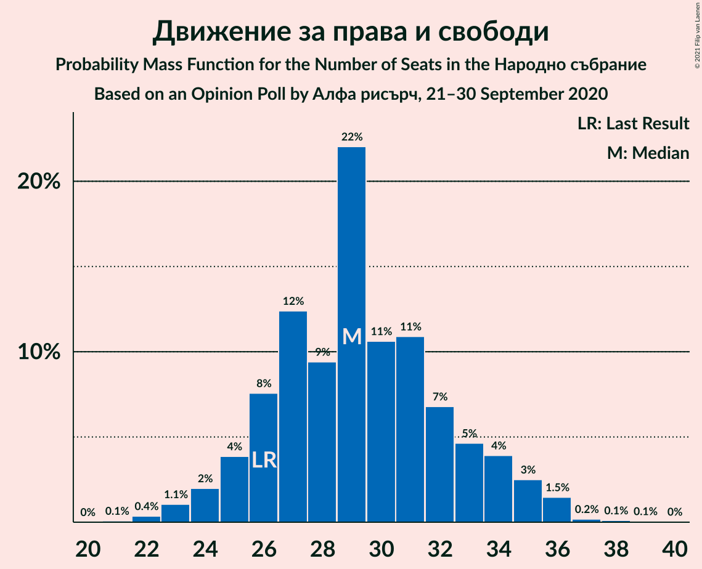
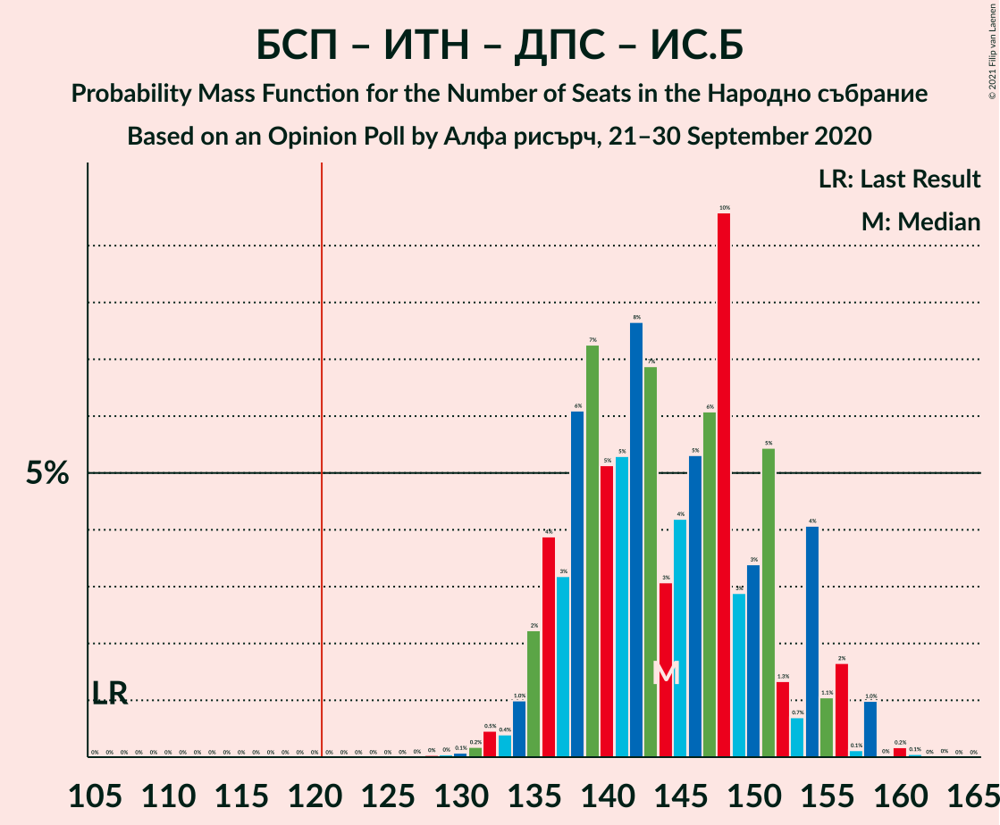

# Opinion Poll by Алфа рисърч, 21–30 September 2020

<a href="#voting-intentions">Voting Intentions</a> | <a href="#seats">Seats</a> | <a href="#coalitions">Coalitions</a> | <a href="#technical-information">Technical Information</a>

## Voting Intentions

### Confidence Intervals

| Party | Last Result | Poll Result | 80% Confidence Interval | 90% Confidence Interval | 95% Confidence Interval | 99% Confidence Interval |
|:-----:|:-----------:|:-----------:|:-----------------------:|:-----------------------:|:-----------------------:|:-----------------------:|
| Граждани за европейско развитие на България | 33.5% | 22.8% | 21.2–24.5% |20.7–25.0% |20.3–25.5% |19.6–26.3% |
| Българска социалистическа партия | 27.9% | 21.8% | 20.2–23.5% |19.8–24.0% |19.4–24.5% |18.7–25.3% |
| Има такъв народ | 0.0% | 16.6% | 15.2–18.2% |14.8–18.6% |14.4–19.0% |13.8–19.8% |
| Движение за права и свободи | 9.2% | 11.1% | 9.9–12.4% |9.6–12.8% |9.3–13.1% |8.7–13.8% |
| Демократична България | 0.0% | 10.5% | 9.3–11.8% |9.0–12.2% |8.7–12.5% |8.2–13.2% |
| Изправи се Бг | 0.0% | 5.1% | 4.4–6.1% |4.1–6.4% |3.9–6.7% |3.6–7.2% |
| Обединени Патриоти | 9.3% | 4.3% | 3.6–5.2% |3.4–5.5% |3.2–5.7% |2.9–6.2% |
| Воля | 4.3% | 0.3% | 0.2–0.7% |0.1–0.8% |0.1–0.9% |0.1–1.1% |

*Note:* The poll result column reflects the actual value used in the calculations. Published results may vary slightly, and in addition be rounded to fewer digits.

## Seats

### Confidence Intervals

| Party | Last Result | Median | 80% Confidence Interval | 90% Confidence Interval | 95% Confidence Interval | 99% Confidence Interval |
|:-----:|:-----------:|:------:|:-----------------------:|:-----------------------:|:-----------------------:|:-----------------------:|
| <a href="#граждани-за-европейско-развитие-на-българия">Граждани за европейско развитие на България</a> | 95 | 60 | 56–65 |54–66 |53–67 |51–70 |
| <a href="#българска-социалистическа-партия">Българска социалистическа партия</a> | 80 | 57 | 53–61 |52–63 |51–64 |49–67 |
| <a href="#има-такъв-народ">Има такъв народ</a> | 0 | 44 | 40–48 |39–49 |38–50 |36–53 |
| <a href="#движение-за-права-и-свободи">Движение за права и свободи</a> | 26 | 29 | 26–33 |25–34 |25–35 |23–36 |
| <a href="#демократична-българия">Демократична България</a> | 0 | 28 | 25–31 |24–32 |23–33 |22–35 |
| <a href="#изправи-се-бг">Изправи се Бг</a> | 0 | 14 | 11–16 |11–17 |0–18 |0–19 |
| <a href="#обединени-патриоти">Обединени Патриоти</a> | 27 | 11 | 0–13 |0–14 |0–15 |0–16 |
| <a href="#воля">Воля</a> | 12 | 0 | 0 |0 |0 |0 |

### Граждани за европейско развитие на България

*For a full overview of the results for this party, see the [Граждани за европейско развитие на България](party-гражданизаевропейскоразвитиенабългария.html) page.*

| Number of Seats | Probability | Accumulated | Special Marks |
|:---------------:|:-----------:|:-----------:|:-------------:|
| 49 | 0.1% | 100% |  |
| 50 | 0.2% | 99.9% |  |
| 51 | 0.4% | 99.8% |  |
| 52 | 0.5% | 99.4% |  |
| 53 | 1.3% | 98.8% |  |
| 54 | 3% | 97% |  |
| 55 | 4% | 95% |  |
| 56 | 6% | 91% |  |
| 57 | 10% | 84% |  |
| 58 | 7% | 75% |  |
| 59 | 9% | 68% |  |
| 60 | 16% | 59% | Median |
| 61 | 11% | 43% |  |
| 62 | 5% | 32% |  |
| 63 | 10% | 27% |  |
| 64 | 6% | 17% |  |
| 65 | 4% | 11% |  |
| 66 | 3% | 7% |  |
| 67 | 2% | 4% |  |
| 68 | 0.9% | 2% |  |
| 69 | 0.6% | 1.4% |  |
| 70 | 0.5% | 0.9% |  |
| 71 | 0.2% | 0.4% |  |
| 72 | 0.1% | 0.2% |  |
| 73 | 0.1% | 0.1% |  |
| 74 | 0% | 0% |  |
| 75 | 0% | 0% |  |
| 76 | 0% | 0% |  |
| 77 | 0% | 0% |  |
| 78 | 0% | 0% |  |
| 79 | 0% | 0% |  |
| 80 | 0% | 0% |  |
| 81 | 0% | 0% |  |
| 82 | 0% | 0% |  |
| 83 | 0% | 0% |  |
| 84 | 0% | 0% |  |
| 85 | 0% | 0% |  |
| 86 | 0% | 0% |  |
| 87 | 0% | 0% |  |
| 88 | 0% | 0% |  |
| 89 | 0% | 0% |  |
| 90 | 0% | 0% |  |
| 91 | 0% | 0% |  |
| 92 | 0% | 0% |  |
| 93 | 0% | 0% |  |
| 94 | 0% | 0% |  |
| 95 | 0% | 0% | Last Result |

### Българска социалистическа партия

*For a full overview of the results for this party, see the [Българска социалистическа партия](party-българскасоциалистическапартия.html) page.*

| Number of Seats | Probability | Accumulated | Special Marks |
|:---------------:|:-----------:|:-----------:|:-------------:|
| 46 | 0% | 100% |  |
| 47 | 0.1% | 99.9% |  |
| 48 | 0.3% | 99.8% |  |
| 49 | 0.6% | 99.5% |  |
| 50 | 1.2% | 98.9% |  |
| 51 | 2% | 98% |  |
| 52 | 5% | 95% |  |
| 53 | 7% | 91% |  |
| 54 | 8% | 84% |  |
| 55 | 10% | 76% |  |
| 56 | 12% | 66% |  |
| 57 | 10% | 53% | Median |
| 58 | 5% | 44% |  |
| 59 | 9% | 39% |  |
| 60 | 14% | 29% |  |
| 61 | 6% | 15% |  |
| 62 | 3% | 9% |  |
| 63 | 2% | 6% |  |
| 64 | 2% | 4% |  |
| 65 | 1.0% | 2% |  |
| 66 | 0.4% | 1.3% |  |
| 67 | 0.4% | 0.8% |  |
| 68 | 0.3% | 0.4% |  |
| 69 | 0.1% | 0.2% |  |
| 70 | 0% | 0.1% |  |
| 71 | 0% | 0.1% |  |
| 72 | 0% | 0% |  |
| 73 | 0% | 0% |  |
| 74 | 0% | 0% |  |
| 75 | 0% | 0% |  |
| 76 | 0% | 0% |  |
| 77 | 0% | 0% |  |
| 78 | 0% | 0% |  |
| 79 | 0% | 0% |  |
| 80 | 0% | 0% | Last Result |

### Има такъв народ

*For a full overview of the results for this party, see the [Има такъв народ](party-иматакъвнарод.html) page.*

| Number of Seats | Probability | Accumulated | Special Marks |
|:---------------:|:-----------:|:-----------:|:-------------:|
| 0 | 0% | 100% | Last Result |
| 1 | 0% | 100% |  |
| 2 | 0% | 100% |  |
| 3 | 0% | 100% |  |
| 4 | 0% | 100% |  |
| 5 | 0% | 100% |  |
| 6 | 0% | 100% |  |
| 7 | 0% | 100% |  |
| 8 | 0% | 100% |  |
| 9 | 0% | 100% |  |
| 10 | 0% | 100% |  |
| 11 | 0% | 100% |  |
| 12 | 0% | 100% |  |
| 13 | 0% | 100% |  |
| 14 | 0% | 100% |  |
| 15 | 0% | 100% |  |
| 16 | 0% | 100% |  |
| 17 | 0% | 100% |  |
| 18 | 0% | 100% |  |
| 19 | 0% | 100% |  |
| 20 | 0% | 100% |  |
| 21 | 0% | 100% |  |
| 22 | 0% | 100% |  |
| 23 | 0% | 100% |  |
| 24 | 0% | 100% |  |
| 25 | 0% | 100% |  |
| 26 | 0% | 100% |  |
| 27 | 0% | 100% |  |
| 28 | 0% | 100% |  |
| 29 | 0% | 100% |  |
| 30 | 0% | 100% |  |
| 31 | 0% | 100% |  |
| 32 | 0% | 100% |  |
| 33 | 0% | 100% |  |
| 34 | 0% | 100% |  |
| 35 | 0.2% | 99.9% |  |
| 36 | 0.3% | 99.7% |  |
| 37 | 0.9% | 99.4% |  |
| 38 | 3% | 98% |  |
| 39 | 3% | 95% |  |
| 40 | 4% | 92% |  |
| 41 | 6% | 88% |  |
| 42 | 10% | 82% |  |
| 43 | 14% | 72% |  |
| 44 | 11% | 58% | Median |
| 45 | 13% | 47% |  |
| 46 | 11% | 34% |  |
| 47 | 8% | 22% |  |
| 48 | 6% | 14% |  |
| 49 | 4% | 8% |  |
| 50 | 2% | 4% |  |
| 51 | 1.4% | 2% |  |
| 52 | 0.5% | 1.0% |  |
| 53 | 0.3% | 0.5% |  |
| 54 | 0.1% | 0.2% |  |
| 55 | 0% | 0.1% |  |
| 56 | 0% | 0% |  |

### Движение за права и свободи

*For a full overview of the results for this party, see the [Движение за права и свободи](party-движениезаправаисвободи.html) page.*

| Number of Seats | Probability | Accumulated | Special Marks |
|:---------------:|:-----------:|:-----------:|:-------------:|
| 21 | 0% | 100% |  |
| 22 | 0.1% | 99.9% |  |
| 23 | 0.4% | 99.8% |  |
| 24 | 2% | 99.4% |  |
| 25 | 7% | 98% |  |
| 26 | 12% | 91% | Last Result |
| 27 | 16% | 79% |  |
| 28 | 13% | 63% |  |
| 29 | 8% | 50% | Median |
| 30 | 6% | 42% |  |
| 31 | 8% | 37% |  |
| 32 | 12% | 29% |  |
| 33 | 8% | 17% |  |
| 34 | 6% | 9% |  |
| 35 | 2% | 3% |  |
| 36 | 0.8% | 1.1% |  |
| 37 | 0.2% | 0.3% |  |
| 38 | 0% | 0.1% |  |
| 39 | 0% | 0.1% |  |
| 40 | 0% | 0% |  |

### Демократична България

*For a full overview of the results for this party, see the [Демократична България](party-демократичнабългария.html) page.*

| Number of Seats | Probability | Accumulated | Special Marks |
|:---------------:|:-----------:|:-----------:|:-------------:|
| 0 | 0% | 100% | Last Result |
| 1 | 0% | 100% |  |
| 2 | 0% | 100% |  |
| 3 | 0% | 100% |  |
| 4 | 0% | 100% |  |
| 5 | 0% | 100% |  |
| 6 | 0% | 100% |  |
| 7 | 0% | 100% |  |
| 8 | 0% | 100% |  |
| 9 | 0% | 100% |  |
| 10 | 0% | 100% |  |
| 11 | 0% | 100% |  |
| 12 | 0% | 100% |  |
| 13 | 0% | 100% |  |
| 14 | 0% | 100% |  |
| 15 | 0% | 100% |  |
| 16 | 0% | 100% |  |
| 17 | 0% | 100% |  |
| 18 | 0% | 100% |  |
| 19 | 0% | 100% |  |
| 20 | 0.1% | 100% |  |
| 21 | 0.2% | 99.9% |  |
| 22 | 0.7% | 99.7% |  |
| 23 | 2% | 99.0% |  |
| 24 | 3% | 97% |  |
| 25 | 10% | 93% |  |
| 26 | 11% | 83% |  |
| 27 | 14% | 72% |  |
| 28 | 20% | 58% | Median |
| 29 | 15% | 39% |  |
| 30 | 10% | 23% |  |
| 31 | 5% | 13% |  |
| 32 | 4% | 8% |  |
| 33 | 2% | 4% |  |
| 34 | 1.5% | 2% |  |
| 35 | 0.5% | 0.7% |  |
| 36 | 0.2% | 0.2% |  |
| 37 | 0% | 0.1% |  |
| 38 | 0% | 0% |  |

### Изправи се Бг

*For a full overview of the results for this party, see the [Изправи се Бг](party-изправисебг.html) page.*

| Number of Seats | Probability | Accumulated | Special Marks |
|:---------------:|:-----------:|:-----------:|:-------------:|
| 0 | 4% | 100% | Last Result |
| 1 | 0% | 96% |  |
| 2 | 0% | 96% |  |
| 3 | 0% | 96% |  |
| 4 | 0% | 96% |  |
| 5 | 0% | 96% |  |
| 6 | 0% | 96% |  |
| 7 | 0% | 96% |  |
| 8 | 0% | 96% |  |
| 9 | 0% | 96% |  |
| 10 | 0.4% | 96% |  |
| 11 | 9% | 96% |  |
| 12 | 14% | 87% |  |
| 13 | 22% | 73% |  |
| 14 | 22% | 51% | Median |
| 15 | 14% | 29% |  |
| 16 | 8% | 14% |  |
| 17 | 4% | 6% |  |
| 18 | 2% | 3% |  |
| 19 | 0.8% | 0.9% |  |
| 20 | 0.1% | 0.2% |  |
| 21 | 0.1% | 0.1% |  |
| 22 | 0% | 0% |  |

### Обединени Патриоти

*For a full overview of the results for this party, see the [Обединени Патриоти](party-обединенипатриоти.html) page.*

| Number of Seats | Probability | Accumulated | Special Marks |
|:---------------:|:-----------:|:-----------:|:-------------:|
| 0 | 32% | 100% |  |
| 1 | 0% | 68% |  |
| 2 | 0% | 68% |  |
| 3 | 0% | 68% |  |
| 4 | 0% | 68% |  |
| 5 | 0% | 68% |  |
| 6 | 0% | 68% |  |
| 7 | 0% | 68% |  |
| 8 | 0% | 68% |  |
| 9 | 0% | 68% |  |
| 10 | 2% | 68% |  |
| 11 | 26% | 66% | Median |
| 12 | 18% | 40% |  |
| 13 | 12% | 21% |  |
| 14 | 7% | 10% |  |
| 15 | 2% | 3% |  |
| 16 | 0.6% | 0.9% |  |
| 17 | 0.2% | 0.3% |  |
| 18 | 0% | 0.1% |  |
| 19 | 0% | 0% |  |
| 20 | 0% | 0% |  |
| 21 | 0% | 0% |  |
| 22 | 0% | 0% |  |
| 23 | 0% | 0% |  |
| 24 | 0% | 0% |  |
| 25 | 0% | 0% |  |
| 26 | 0% | 0% |  |
| 27 | 0% | 0% | Last Result |

### Воля

*For a full overview of the results for this party, see the [Воля](party-воля.html) page.*

| Number of Seats | Probability | Accumulated | Special Marks |
|:---------------:|:-----------:|:-----------:|:-------------:|
| 0 | 100% | 100% | Median |
| 1 | 0% | 0% |  |
| 2 | 0% | 0% |  |
| 3 | 0% | 0% |  |
| 4 | 0% | 0% |  |
| 5 | 0% | 0% |  |
| 6 | 0% | 0% |  |
| 7 | 0% | 0% |  |
| 8 | 0% | 0% |  |
| 9 | 0% | 0% |  |
| 10 | 0% | 0% |  |
| 11 | 0% | 0% |  |
| 12 | 0% | 0% | Last Result |

## Coalitions

### Confidence Intervals

| Coalition | Last Result | Median | Majority? | 80% Confidence Interval | 90% Confidence Interval | 95% Confidence Interval | 99% Confidence Interval |
|:---------:|:-----------:|:------:|:---------:|:-----------------------:|:-----------------------:|:-----------------------:|:-----------------------:|
| Българска социалистическа партия – Има такъв народ – Движение за права и свободи – Изправи се Бг | 106 | 143 | 100% | 137–151 | 135–152 | 134–154 | 131–157 |
| Българска социалистическа партия – Има такъв народ – Движение за права и свободи | 106 | 130 | 98.6% | 124–137 | 122–139 | 121–141 | 119–145 |
| Българска социалистическа партия – Движение за права и свободи – Изправи се Бг | 106 | 99 | 0% | 94–106 | 92–108 | 91–109 | 86–113 |
| Българска социалистическа партия – Движение за права и свободи | 106 | 85 | 0% | 81–93 | 80–94 | 79–95 | 77–99 |
| Граждани за европейско развитие на България – Обединени Патриоти | 122 | 69 | 0% | 60–75 | 59–77 | 57–78 | 54–81 |

### Българска социалистическа партия – Има такъв народ – Движение за права и свободи – Изправи се Бг

| Number of Seats | Probability | Accumulated | Special Marks |
|:---------------:|:-----------:|:-----------:|:-------------:|
| 106 | 0% | 100% | Last Result |
| 107 | 0% | 100% |  |
| 108 | 0% | 100% |  |
| 109 | 0% | 100% |  |
| 110 | 0% | 100% |  |
| 111 | 0% | 100% |  |
| 112 | 0% | 100% |  |
| 113 | 0% | 100% |  |
| 114 | 0% | 100% |  |
| 115 | 0% | 100% |  |
| 116 | 0% | 100% |  |
| 117 | 0% | 100% |  |
| 118 | 0% | 100% |  |
| 119 | 0% | 100% |  |
| 120 | 0% | 100% |  |
| 121 | 0% | 100% | Majority |
| 122 | 0% | 100% |  |
| 123 | 0% | 100% |  |
| 124 | 0% | 100% |  |
| 125 | 0% | 100% |  |
| 126 | 0% | 100% |  |
| 127 | 0% | 100% |  |
| 128 | 0.1% | 99.9% |  |
| 129 | 0.1% | 99.8% |  |
| 130 | 0.1% | 99.8% |  |
| 131 | 0.3% | 99.7% |  |
| 132 | 0.4% | 99.4% |  |
| 133 | 0.5% | 99.0% |  |
| 134 | 1.2% | 98% |  |
| 135 | 2% | 97% |  |
| 136 | 4% | 95% |  |
| 137 | 4% | 91% |  |
| 138 | 4% | 87% |  |
| 139 | 6% | 82% |  |
| 140 | 5% | 76% |  |
| 141 | 10% | 71% |  |
| 142 | 6% | 61% |  |
| 143 | 7% | 55% |  |
| 144 | 5% | 48% | Median |
| 145 | 6% | 43% |  |
| 146 | 4% | 36% |  |
| 147 | 6% | 32% |  |
| 148 | 5% | 26% |  |
| 149 | 3% | 22% |  |
| 150 | 4% | 18% |  |
| 151 | 5% | 15% |  |
| 152 | 5% | 10% |  |
| 153 | 1.1% | 4% |  |
| 154 | 0.9% | 3% |  |
| 155 | 1.2% | 2% |  |
| 156 | 0.4% | 1.2% |  |
| 157 | 0.5% | 0.9% |  |
| 158 | 0.2% | 0.3% |  |
| 159 | 0.1% | 0.2% |  |
| 160 | 0.1% | 0.1% |  |
| 161 | 0% | 0% |  |

### Българска социалистическа партия – Има такъв народ – Движение за права и свободи

| Number of Seats | Probability | Accumulated | Special Marks |
|:---------------:|:-----------:|:-----------:|:-------------:|
| 106 | 0% | 100% | Last Result |
| 107 | 0% | 100% |  |
| 108 | 0% | 100% |  |
| 109 | 0% | 100% |  |
| 110 | 0% | 100% |  |
| 111 | 0% | 100% |  |
| 112 | 0% | 100% |  |
| 113 | 0% | 100% |  |
| 114 | 0% | 100% |  |
| 115 | 0% | 100% |  |
| 116 | 0% | 100% |  |
| 117 | 0.1% | 99.9% |  |
| 118 | 0.2% | 99.9% |  |
| 119 | 0.3% | 99.7% |  |
| 120 | 0.8% | 99.4% |  |
| 121 | 2% | 98.6% | Majority |
| 122 | 3% | 97% |  |
| 123 | 3% | 94% |  |
| 124 | 4% | 91% |  |
| 125 | 6% | 87% |  |
| 126 | 7% | 81% |  |
| 127 | 7% | 74% |  |
| 128 | 9% | 67% |  |
| 129 | 5% | 58% |  |
| 130 | 6% | 52% | Median |
| 131 | 4% | 46% |  |
| 132 | 5% | 43% |  |
| 133 | 5% | 38% |  |
| 134 | 9% | 33% |  |
| 135 | 3% | 24% |  |
| 136 | 2% | 20% |  |
| 137 | 10% | 18% |  |
| 138 | 3% | 9% |  |
| 139 | 2% | 6% |  |
| 140 | 0.9% | 4% |  |
| 141 | 1.3% | 3% |  |
| 142 | 0.6% | 2% |  |
| 143 | 0.3% | 1.4% |  |
| 144 | 0.5% | 1.1% |  |
| 145 | 0.2% | 0.6% |  |
| 146 | 0.1% | 0.4% |  |
| 147 | 0.1% | 0.3% |  |
| 148 | 0.1% | 0.3% |  |
| 149 | 0.1% | 0.2% |  |
| 150 | 0% | 0.1% |  |
| 151 | 0% | 0% |  |

### Българска социалистическа партия – Движение за права и свободи – Изправи се Бг

| Number of Seats | Probability | Accumulated | Special Marks |
|:---------------:|:-----------:|:-----------:|:-------------:|
| 83 | 0.1% | 100% |  |
| 84 | 0.1% | 99.8% |  |
| 85 | 0.1% | 99.7% |  |
| 86 | 0.2% | 99.6% |  |
| 87 | 0.4% | 99.4% |  |
| 88 | 0.1% | 99.0% |  |
| 89 | 0.3% | 98.9% |  |
| 90 | 0.3% | 98.6% |  |
| 91 | 2% | 98% |  |
| 92 | 2% | 97% |  |
| 93 | 3% | 95% |  |
| 94 | 8% | 92% |  |
| 95 | 9% | 84% |  |
| 96 | 10% | 75% |  |
| 97 | 7% | 65% |  |
| 98 | 6% | 57% |  |
| 99 | 6% | 52% |  |
| 100 | 5% | 46% | Median |
| 101 | 5% | 41% |  |
| 102 | 4% | 36% |  |
| 103 | 5% | 32% |  |
| 104 | 7% | 27% |  |
| 105 | 4% | 20% |  |
| 106 | 7% | 16% | Last Result |
| 107 | 3% | 9% |  |
| 108 | 2% | 6% |  |
| 109 | 2% | 5% |  |
| 110 | 1.0% | 2% |  |
| 111 | 0.4% | 1.2% |  |
| 112 | 0.3% | 0.8% |  |
| 113 | 0.3% | 0.5% |  |
| 114 | 0.1% | 0.2% |  |
| 115 | 0% | 0.1% |  |
| 116 | 0% | 0.1% |  |
| 117 | 0% | 0% |  |

### Българска социалистическа партия – Движение за права и свободи

| Number of Seats | Probability | Accumulated | Special Marks |
|:---------------:|:-----------:|:-----------:|:-------------:|
| 73 | 0% | 100% |  |
| 74 | 0.1% | 99.9% |  |
| 75 | 0.1% | 99.8% |  |
| 76 | 0.1% | 99.8% |  |
| 77 | 0.3% | 99.7% |  |
| 78 | 1.0% | 99.4% |  |
| 79 | 2% | 98% |  |
| 80 | 6% | 96% |  |
| 81 | 6% | 90% |  |
| 82 | 12% | 84% |  |
| 83 | 12% | 73% |  |
| 84 | 5% | 61% |  |
| 85 | 8% | 56% |  |
| 86 | 5% | 48% | Median |
| 87 | 4% | 44% |  |
| 88 | 4% | 40% |  |
| 89 | 4% | 36% |  |
| 90 | 5% | 31% |  |
| 91 | 7% | 27% |  |
| 92 | 7% | 19% |  |
| 93 | 4% | 12% |  |
| 94 | 5% | 8% |  |
| 95 | 1.2% | 3% |  |
| 96 | 1.1% | 2% |  |
| 97 | 0.3% | 1.1% |  |
| 98 | 0.3% | 0.8% |  |
| 99 | 0.3% | 0.5% |  |
| 100 | 0.2% | 0.3% |  |
| 101 | 0% | 0.1% |  |
| 102 | 0% | 0.1% |  |
| 103 | 0% | 0% |  |
| 104 | 0% | 0% |  |
| 105 | 0% | 0% |  |
| 106 | 0% | 0% | Last Result |

### Граждани за европейско развитие на България – Обединени Патриоти

| Number of Seats | Probability | Accumulated | Special Marks |
|:---------------:|:-----------:|:-----------:|:-------------:|
| 51 | 0.1% | 100% |  |
| 52 | 0% | 99.9% |  |
| 53 | 0.2% | 99.9% |  |
| 54 | 0.3% | 99.7% |  |
| 55 | 0.4% | 99.5% |  |
| 56 | 0.5% | 99.1% |  |
| 57 | 1.3% | 98.6% |  |
| 58 | 2% | 97% |  |
| 59 | 3% | 96% |  |
| 60 | 7% | 93% |  |
| 61 | 4% | 86% |  |
| 62 | 2% | 82% |  |
| 63 | 4% | 80% |  |
| 64 | 4% | 76% |  |
| 65 | 3% | 73% |  |
| 66 | 5% | 70% |  |
| 67 | 6% | 65% |  |
| 68 | 6% | 59% |  |
| 69 | 6% | 53% |  |
| 70 | 5% | 47% |  |
| 71 | 10% | 42% | Median |
| 72 | 5% | 32% |  |
| 73 | 4% | 26% |  |
| 74 | 7% | 22% |  |
| 75 | 6% | 16% |  |
| 76 | 4% | 9% |  |
| 77 | 3% | 6% |  |
| 78 | 1.1% | 3% |  |
| 79 | 0.8% | 2% |  |
| 80 | 0.4% | 1.0% |  |
| 81 | 0.3% | 0.6% |  |
| 82 | 0.1% | 0.2% |  |
| 83 | 0% | 0.1% |  |
| 84 | 0.1% | 0.1% |  |
| 85 | 0% | 0% |  |
| 86 | 0% | 0% |  |
| 87 | 0% | 0% |  |
| 88 | 0% | 0% |  |
| 89 | 0% | 0% |  |
| 90 | 0% | 0% |  |
| 91 | 0% | 0% |  |
| 92 | 0% | 0% |  |
| 93 | 0% | 0% |  |
| 94 | 0% | 0% |  |
| 95 | 0% | 0% |  |
| 96 | 0% | 0% |  |
| 97 | 0% | 0% |  |
| 98 | 0% | 0% |  |
| 99 | 0% | 0% |  |
| 100 | 0% | 0% |  |
| 101 | 0% | 0% |  |
| 102 | 0% | 0% |  |
| 103 | 0% | 0% |  |
| 104 | 0% | 0% |  |
| 105 | 0% | 0% |  |
| 106 | 0% | 0% |  |
| 107 | 0% | 0% |  |
| 108 | 0% | 0% |  |
| 109 | 0% | 0% |  |
| 110 | 0% | 0% |  |
| 111 | 0% | 0% |  |
| 112 | 0% | 0% |  |
| 113 | 0% | 0% |  |
| 114 | 0% | 0% |  |
| 115 | 0% | 0% |  |
| 116 | 0% | 0% |  |
| 117 | 0% | 0% |  |
| 118 | 0% | 0% |  |
| 119 | 0% | 0% |  |
| 120 | 0% | 0% |  |
| 121 | 0% | 0% | Majority |
| 122 | 0% | 0% | Last Result |

## Technical Information

### Opinion Poll

+ **Polling firm:** Алфа рисърч
+ **Commissioner(s):** —
+ **Fieldwork period:** 21–30 September 2020

### Calculations

+ **Sample size:** 1031
+ **Simulations done:** 1,048,576
+ **Error estimate:** 1.54%

